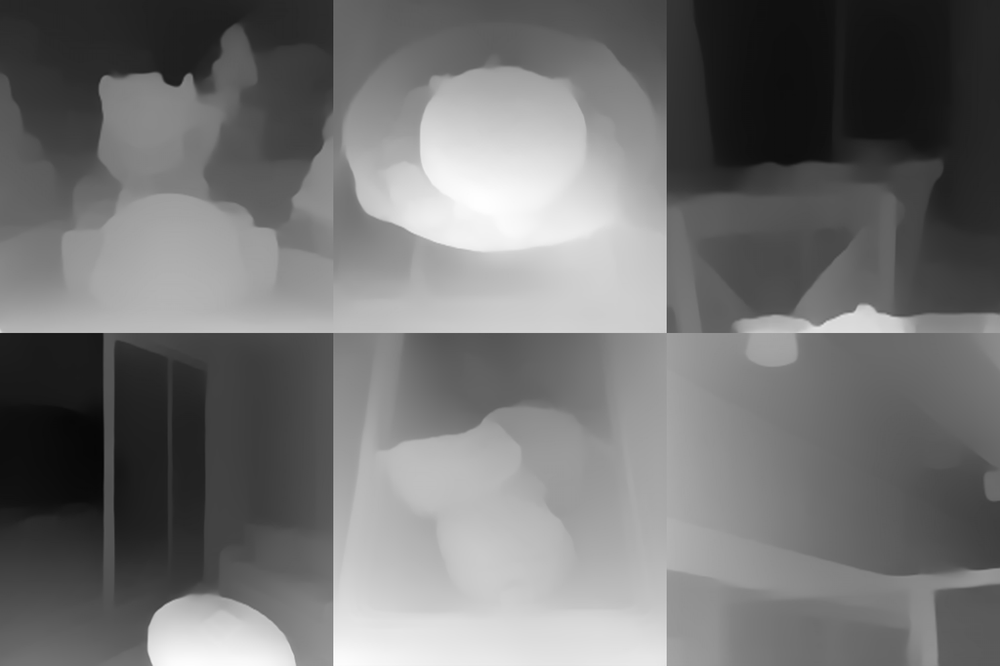
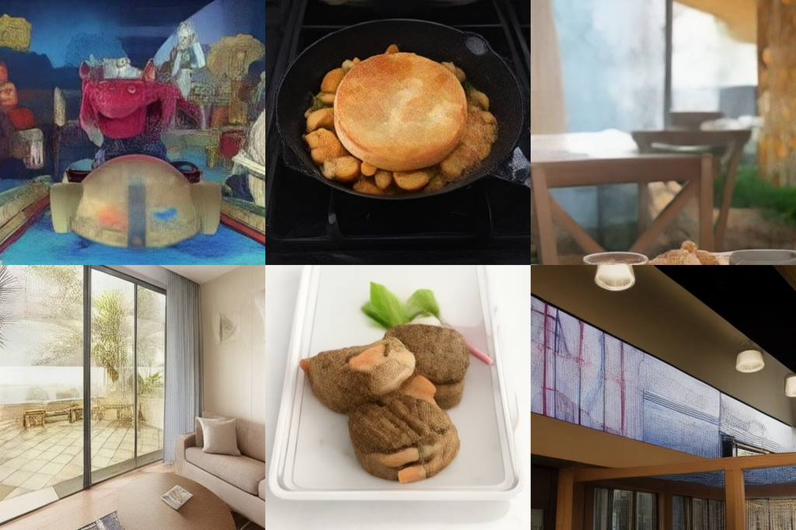
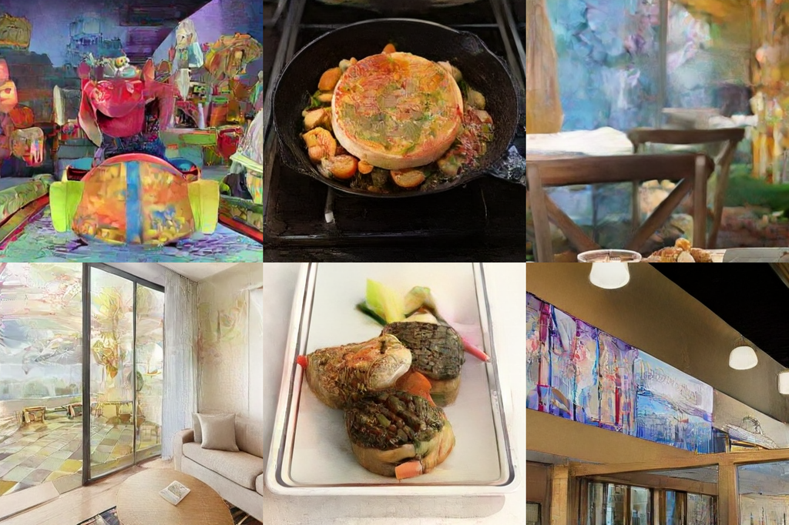

# CoDi — Research Note

## 📇 Academic Context

| Field | Value |
|-|-|
| Title | CoDi: Conditional Diffusion Distillation for Higher-Fidelity and Faster Image Generation |
| Venue | CVPR 2024 |
| Year | 2024 |
| Authors | Kangfu Mei, Mauricio Delbracio, Hossein Talebi, Zhengzhong Tu, Vishal M. Patel, Peyman Milanfar |
| Official Code | unknown |
| Venue Kind | paper |

*本筆記基於 arXiv 全文版本 `2310.01407v2`（2024-02-17 更新）撰寫；論文正式發表於 CVPR 2024，camera-ready 版與此 preprint 若有差異，以正式版為準。作者未釋出公開程式碼倉庫，專案頁為 https://fast-codi.github.io。*

## First Principles

### 一句話的問題設定

擴散模型（diffusion model）能產生高品質影像，但推論時需要 20–200 次的取樣步數（function evaluations），即使用上 DPM-Solver 這類進階取樣器也是如此，這讓它難以即時應用。CoDi 想同時解決兩件事：把一個「只吃文字條件」的預訓練潛在擴散模型（latent diffusion model, LDM）改造成「能吃額外影像條件」的條件模型，並把取樣步數壓到 1–4 步，而且是在**單一階段**內完成，不需要原始的文字–影像資料。

### 為什麼既有做法不夠好

在 CoDi 之前，要把「加新條件」與「加速」兜在一起，主流有兩條路線，論文把它們整理成 CM-X 與 GD-X。第一條是先蒸餾、再微調（distill-first，對應 CM-I）：先把無條件的文字–影像模型蒸餾成少步數學生，再用條件資料去微調它。第二條是先微調、再蒸餾（finetune-first，對應 GD-II／CM-II）：先用條件資料把擴散模型微調成條件版本，再對這個已微調的條件模型做蒸餾。

這兩條路線各有硬傷。distill-first 需要原始的大規模文字–影像資料（例如 LAION）來完成第一階段的無條件蒸餾，實務上未必拿得到；finetune-first 則在第一階段的微調中可能犧牲掉預訓練帶來的生成先驗（diffusion prior）。CoDi 的主張是：把「條件化」與「蒸餾」合成單一階段，就能同時繞開這兩個缺點——不再需要文字–影像資料，也不必先做一次會傷到先驗的微調。

### 第一步：把無條件模型改造成條件模型（零初始化）

CoDi 沿用 ControlNet 式的想法，複製 U-Net 的 encoder 層當作「條件編碼器」，用一個可學的純量 $\mu$ 把主幹特徵 $\boldsymbol{h}_\theta(\mathbf{z}_t)$ 與條件特徵 $\boldsymbol{h}_\eta(c)$ 融合：

$$\boldsymbol{h}_\theta(\mathbf{z}_t)' = (1 - \mu)\,\boldsymbol{h}_\theta(\mathbf{z}_t) + \mu\,\boldsymbol{h}_\eta(c)$$

關鍵在於 $\mu$ 初始化為 $0$。當 $\mu=0$ 時，融合後的特徵完全等於原本的無條件特徵，也就是說改造後的模型在訓練起點與預訓練模型**完全等價**，先驗被原封不動地保留下來；隨著訓練，$\mu$ 慢慢長大，條件資訊才逐步注入。這就是所謂零初始化（zero initialization）：用一條「起點無害」的路徑，把無條件主幹 $\hat{\mathbf{v}}_\theta(\mathbf{z}_t,t)$ 適配成條件模型 $\hat{\mathbf{w}}_\theta(\mathbf{z}_t,c,t)$。

### 第二步：條件擴散一致性（conditional diffusion consistency）

一致性模型（consistency model）的核心是自我一致性（self-consistency）：沿著 probability-flow ODE（PF-ODE）軌跡上的任兩個時間點，模型對乾淨訊號的預測應當一致。CoDi 把這個性質搬到條件模型上，要求

$$\hat{\mathbf{w}}_\theta(\mathbf{z}_t, c, t) = \hat{\mathbf{w}}_\theta(\hat{\mathbf{z}}_s, c, s), \quad \forall\, t, s \in [0, T]$$

其中 $\hat{\mathbf{z}}_s$ 取自**改造後模型自己**的 PF-ODE。這裡有兩個和原始一致性模型不同的地方：一是用來取樣 $\hat{\mathbf{z}}_s$ 的 ODE 用的是正在訓練的模型，而不是凍結的教師；二是一致性損失施加的空間（噪聲空間 vs. 訊號空間）。論文用一個 remark 說明：只要模型在噪聲預測 $\hat{\epsilon}_\theta = \alpha_t \hat{\mathbf{v}}_\theta + \sigma_t \mathbf{z}_t$ 上滿足自我一致性，透過變數變換它就同時在訊號預測 $\hat{\mathbf{x}}_\theta = \alpha_t \mathbf{z}_t - \sigma_t \hat{\mathbf{v}}_\theta$ 上滿足一致性。這讓「噪聲空間的自我一致性」與「訊號空間的條件生成」可以被同一組參數一起學。

### 第三步：用模型自己的 ODE 走一步（而不是凍結教師）

以往的蒸餾（progressive／guided distillation）用凍結的預訓練教師跑 DDIM 兩步來得到下一個時間點的樣本，consistency model 則用 Euler 解一步。CoDi 改成直接用**適配中的擴散模型**走一步：

$$\hat{\mathbf{z}}_s = \alpha_s\,\hat{\mathbf{x}}_\theta(\mathbf{z}_t, c, t) + \sigma_s\,\epsilon, \quad \text{其中}\ \mathbf{z}_t = \alpha_t \mathbf{x} + \sigma_t \epsilon,\ \epsilon \sim \mathcal{N}(0, \mathbf{I})$$

論文論證這個替換「調和了兩個相互衝突的最佳化方向」：來自預訓練資料的一致性蒸餾，與來自條件資料的條件導引。因為 $\hat{\mathbf{z}}_s$ 現在是由條件模型自己生成的軌跡，蒸餾的目標軌跡就會被條件資料「拉」向正確方向，而不是被凍結教師的無條件軌跡綁死。

### 損失：噪聲一致性 + 訊號導引

把上述兩件事合起來，訓練損失是（$\theta^-$ 為 EMA 目標網路，穩定訓練用）：

$$\mathcal{L}(\theta) := \mathbb{E}\big[\, d_\epsilon\big(\hat{\epsilon}_{\theta^-}(\hat{\mathbf{z}}_s, s, c),\ \hat{\epsilon}_\theta(\mathbf{z}_t, t, c)\big) + d_\mathbf{x}\big(\mathbf{x},\ \hat{\mathbf{x}}_\theta(\mathbf{z}_t, t, c)\big) \,\big]$$

第一項 $d_\epsilon$ 是噪聲空間的自我一致性（讓不同步數的預測收斂到同一條軌跡，這是「加速」的來源）；第二項 $d_\mathbf{x}$ 是訊號空間的條件導引（讓輸出貼合條件對應的真實影像 $\mathbf{x}$，這是「加條件」的來源）。邊界條件用與 consistency model／EDM 相同的 skip connection 參數化，$c_\mathrm{skip}(t) = \sigma_\mathrm{data}/(t^2 + \sigma_\mathrm{data}^2)$、$c_\mathrm{out}(t) = \sigma_\mathrm{data}\,t/\sqrt{t^2 + \sigma_\mathrm{data}^2}$，並取 $\sigma_\mathrm{data}=0.5$。

關於 $d_\mathbf{x}$ 的選擇，論文做了消融：在像素或編碼空間用 $\ell_2$ 會讓多步取樣變得平滑而模糊；用 LPIPS 感知距離則會過飽和；最後預設採用**潛在空間的 $\ell_2$**，因為它在 4 步取樣時視覺品質與 FID 最好。

### 完整訓練演算法（CDD）

論文附錄以 pseudocode 給出 Conditional Diffusion Distillation（CDD）。核心迴圈如下（採 velocity 參數化的 DDIM 更新）：

```text
輸入: 條件資料 (x, c) ~ p_data, 適配模型 ŵ_θ(z_t, c, t), 學習率 η,
      距離函數 d_ε 與 d_x, EMA 係數 γ
θ⁻ ← θ                                  # 目標網路初始化
repeat
    抽樣 (x, c) ~ p_data,  t ~ [Δt, T]    # 經驗上 Δt = 1
    抽樣 ε ~ N(0, I);  s ← t − Δt
    z_t ← α_t x + σ_t ε
    x̂_t ← α_t z_t − σ_t ŵ_θ(z_t, c, t)     # 訊號預測
    ε̂_t ← α_t ŵ_θ(z_t, c, t) + σ_t z_t     # 噪聲預測
    ẑ_s ← α_s x̂_t + σ_s ε̂_t                # DDIM (v 參數化) 走一步
    ε̂_s ← α_s ŵ_{θ⁻}(ẑ_s, c, t) + σ_s ẑ_s   # 用 EMA 目標網路
    L(θ, θ⁻) ← d_ε(ε̂_t, ε̂_s) + d_x(x, x̂_t)
    θ  ← θ − η ∇_θ L(θ, θ⁻)
    θ⁻ ← stopgrad(γ θ⁻ + (1−γ) θ)          # 指數移動平均
until 收斂
```

注意 $\hat{\mathbf{z}}_s$ 是用**當前** $\theta$ 走一步（模型自己的 PF-ODE），而一致性目標 $\hat{\epsilon}_s$ 是用 EMA 的 $\theta^-$ 算，兩者搭配就是「加速 + 條件化」單階段完成的機制。

### 參數高效版本：PE-CoDi

同一套損失可以只更新和蒸餾／條件微調相關的參數，其餘凍結。把它套在 ControlNet 這種只複製 encoder 的介面上，就得到 PE-CoDi：主幹完全凍結，只訓練複製出來的 encoder。這帶來一個實務上很好的性質——不同任務可以共享大部分參數，每個新條件任務只需少量額外參數。

### 一個帶真實數字的走查（real-world super-resolution）

以論文的真實世界超解析度實驗（DF2K、Real-ESRGAN 退化管線、3,000 對測試影像）為例，把一次前向串起來看：

1. 取一張退化的低解析度影像當條件 $c$，對應的高解析度潛在 $\mathbf{x}$ 進 forward process 得到 $\mathbf{z}_t = \alpha_t \mathbf{x} + \sigma_t \epsilon$；同一個 batch 內用**同一個 $t$**（消融顯示這對 1–4 步表現更好，與 progressive distillation 逐樣本抽不同 $t$ 相反）。
2. 條件 $c$ 經複製 encoder 得 $\boldsymbol{h}_\eta(c)$，以 $\mu$ 融入主幹；模型輸出 velocity $\hat{\mathbf{w}}_\theta$，轉成 $\hat{\mathbf{x}}_t$ 與 $\hat{\epsilon}_t$。
3. 用模型自己走一步得 $\hat{\mathbf{z}}_s$，EMA 網路在 $s$ 上算 $\hat{\epsilon}_s$，湊出損失 $d_\epsilon(\hat{\epsilon}_t, \hat{\epsilon}_s) + d_\mathbf{x}(\mathbf{x}, \hat{\mathbf{x}}_t)$。
4. 蒸餾完成後，推論只跑 **4 步**。

結果對照下表（FID、LPIPS 皆越低越好）：

| Sampling Steps | Method | FID ↓ | LPIPS ↓ |
|-|-|-|-|
| 250 steps | LDMs | 19.200 | 0.2639 |
| 4 steps | LDMs | 29.266 | 0.3014 |
| 4 steps | ControlNet | 34.56 | 0.3381 |
| — | GD-II | 23.675 | 0.2796 |
| — | CM-II | 27.810 | 0.3172 |
| 4 steps | **PE-CoDi (Ours)** | 25.214 | 0.2941 |
| 4 steps | **CoDi (Ours)** | 19.637 | 0.2656 |

換算成白話：CoDi 用 4 步得到的 FID 19.637，幾乎追平教師 LDM 跑 250 步的 19.200，而且明顯優於同為 4 步的 GD-II（23.675）與 CM-II（27.810）。附錄在 TPUv5 上量到 CoDi 4 步的延遲是 $107 \pm 3$ ms，對比 LDM 50 步的 $977 \pm 1$ ms——品質相近但延遲約為九分之一。訓練成本方面，每個被比較的方法（含文字–影像預訓練）各自在 64 顆 TPU-v4 上訓練 8 天。

### 消融如何拆解貢獻

論文用 SR 任務拆解各設計的貢獻（皆為 4 步取樣）：

| Method | Params | FID | LPIPS |
|-|-|-|-|
| LDMs | 865M | 29.266 | 0.3014 |
| + ControlNet | 1.22B | 28.951 | 0.3049 |
| PE-CoDi (Ours) | 364M | 25.214 | 0.2941 |
| CoDi (Ours) | 1.22B | 19.637 | 0.2656 |
| − distilling PF-ODE | 1.22B | 20.307 | 0.2733 |
| − noise-consistency | 1.22B | 25.728 | 0.3252 |

兩點值得注意：單純加上 ControlNet 模組（不含 CoDi 的蒸餾）幾乎沒改善（29.266 → 28.951），代表增益不是來自架構變動；而拿掉噪聲一致性項後 FID 從 19.637 掉到 25.728，是最大的單項退化，顯示噪聲空間的自我一致性是主要貢獻來源。PE-CoDi 只用 364M 參數（比凍結前的 865M 主幹還少，因為只算可訓練參數）就把 FID 從 29.266 壓到 25.214。

### 條件愈接近目標，蒸餾愈容易

在指令式影像編輯（InstructPix2Pix 資料）上，CoDi 單步取樣就能達到與 IP2P 200 步相近的視覺品質。論文據此推測：條件導引對蒸餾的助益，與「條件和目標資料的相似度」相關——當條件本身已經很接近答案（例如編輯只是微調光影），單步就夠。

下圖為深度到影像（depth-to-image）任務的定性對照：左為深度條件，中為 ControlNet 4 步，右為 CoDi 4 步（皆為 4 步取樣）。





## 🧪 Critical Assessment

### 問題是否真實、重要（problem realness）

擴散模型推論慢是一個被廣泛承認的真問題，加速與加條件也都是活躍且有實用價值的方向。CoDi 的切角——把「條件化」和「蒸餾」併成單一階段——確實對應到一個實務痛點：兩階段做法要嘛依賴拿不到的大規模文字–影像資料，要嘛在先微調時傷到先驗。就問題設定而言，這是站得住腳的。比較保留的一點是：論文把 1–4 步當成主打，但對某些任務（如超解析度）本來就有並行工作指出所需步數不多，因此「極少步數」帶來的邊際效益在不同任務上並不等價，這點論文自己在相關工作也承認。

### 基線、消融、資料集與指標是否足夠

消融是這篇論文比較有說服力的部分：ControlNet-only 幾乎無增益、拿掉 noise-consistency 造成最大退化，這兩個對照有效地把功勞歸因到一致性項而非架構。基線涵蓋 CM、GD 的兩種擺法與 DPM-Solver 系列，算是周全。但也有幾個弱點值得指出。其一，主結果的關鍵欄位缺步數標註：效能表中 GD-II、CM-II 等列沒有明確標出取樣步數，讀者只能從標題「4 steps」推測，跨列比較的嚴謹度因此打折。其二，指標偏重 FID／LPIPS／CLIP 這類分布層級或感知代理，缺少人類偏好評測，而 IP2P「單步 ≈ 200 步」這種強主張主要靠定性圖與作者自述的「僅有微小視覺差異」支撐，證據強度偏軟。

### 是自定義評測還是公平比較

一個需要警惕的點是：CoDi 用的是「內部文字–影像資料訓練、宣稱與 SD v1.4 相當」的私有基礎模型，而 CM／GD 等基線是作者用同一架構、同一參數量自行實作的（例如 CM 以未凍結的 ControlNet 實作）。這意味著基線的強弱很大程度取決於作者的實作與調參，外部無法獨立複現。換句話說，比較是在作者自建、圍繞自身方法優勢設計的場景內進行的；雖然作者刻意對齊了架構與參數量以求公平，但「私有基礎模型 + 自行實作基線」的組合，讓 SOTA 宣稱的可外部驗證性下降。inpainting 一項作者也自陳解析度與 Palette 不同、數字「僅供參考」，這點算誠實揭露。

### 問題真的被解決了嗎、是否具真實世界意義

在論文給定的設定內，CoDi 的證據鏈是完整的：4 步 FID 19.637 追平教師 250 步、延遲降到約九分之一、消融歸因清楚，這些支持「單階段條件蒸餾可行且有效」的結論。真實世界意義也存在——107 ms 級的條件生成對消費級影像應用（超解析、編輯）是有感的加速。但「解決」需要打折看：其一，方法依賴 adapter 架構，作者在限制一節自承這帶來額外計算，尚未做到輕量化；其二，最亮眼的宣稱（IP2P 單步 ≈ 200 步、追平 250 步教師）在缺少人類評測與外部可複現基線下，比較像是「在受控設定內成立」而非「普遍成立」。整體上這是一份設計乾淨、消融紮實但可外部驗證性受限的工作，結論宜視為在其實驗協定內可信，跨設定的普適性則仍待第三方複現。

## 🔗 Related notes

- [DDPM — Denoising Diffusion Probabilistic Models](../diffusion/)
