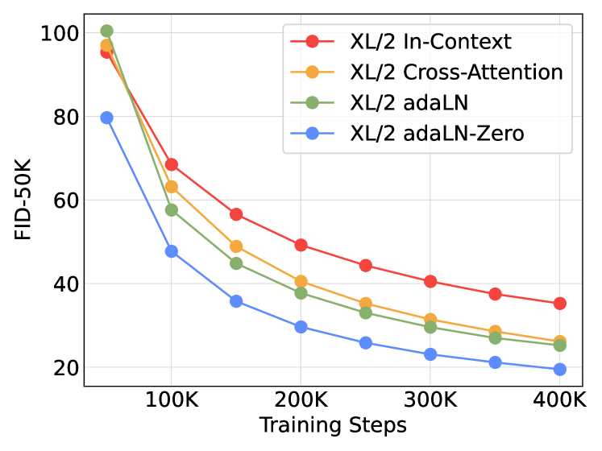
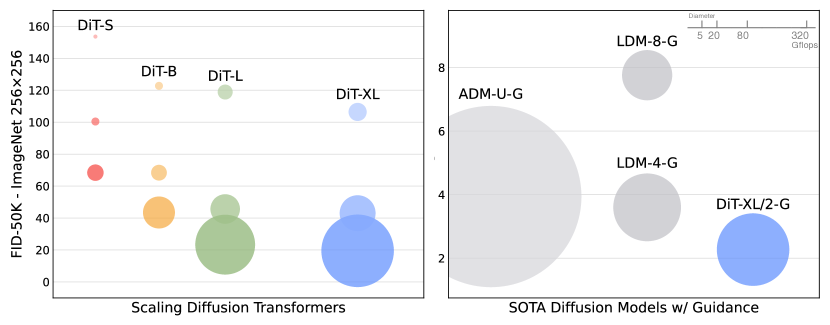
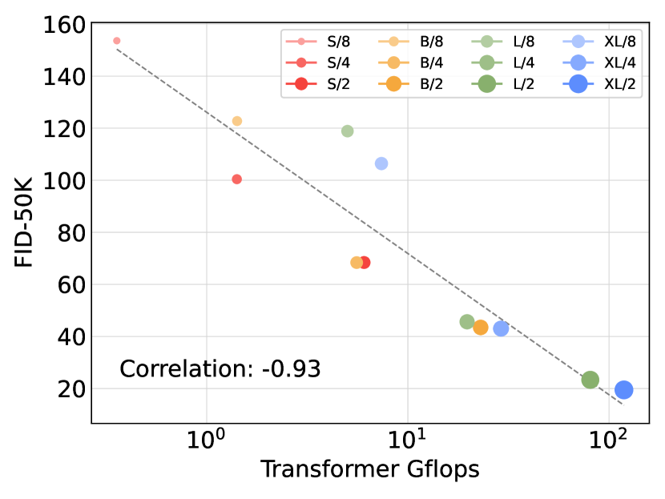
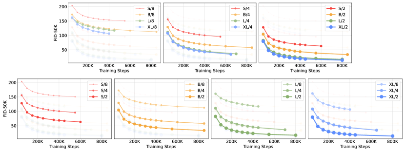

# DiT: Scalable Diffusion Models with a Transformer Backbone — Research Note
> **English** | [繁體中文](./README.zh-TW.md)

## 📇 Academic Context

| Field | Value |
|-|-|
| Title | Scalable Diffusion Models with Transformers |
| Venue | ICCV |
| Year | 2023 |
| Authors | William Peebles, Saining Xie |
| Official Code | https://github.com/facebookresearch/DiT |
| Venue Kind | paper |

This paper (hereafter DiT) tackles a concrete and long-overlooked architectural question: ever since DDPM, image diffusion models have almost universally used a convolutional U-Net as the denoising backbone, while the Transformer — despite having swept through language and visual recognition — has been slow to enter the backbone of diffusion models. The authors (William Peebles of UC Berkeley and Saining Xie of NYU, with the work completed during their time at Meta AI FAIR) argue that the inductive bias of the U-Net is not the key to diffusion-model performance, and with a pure Transformer backbone achieve a state-of-the-art FID of 2.27 on class-conditional ImageNet 256×256. The paper was published as an ICCV 2023 oral, and the official code and model weights are released by Meta (facebookresearch/DiT).

## First Principles

### From U-Net to Transformer: Problem Setup and the Latent-Space Strategy

DiT's core claim is very direct: replacing the commonly-used U-Net backbone with a Transformer that operates directly on latent-space patches. The authors deliberately stay as faithful as possible to the standard Transformer / ViT design in order to inherit its scaling properties, and take "network complexity vs. sample quality" as the research axis — complexity measured in theoretical Gflops, quality measured in FID.

To make computation affordable, DiT builds on the Latent Diffusion Models (LDM) framework: a frozen VAE encoder $E$ first compresses the image into a smaller spatial representation $z = E(x)$, the diffusion process runs on $z$, and after sampling the decoder $x = D(z)$ reconstructs the image. The VAE used here is taken directly from Stable Diffusion. The VAE encoder has a downsample factor of 8: a $256\times256\times3$ image is compressed into a $32\times32\times4$ latent. This step shifts the high-resolution burden of pixel space onto the lightweight VAE, so the Transformer only has to handle a small $32\times32$ grid.

Diffusion itself follows the standard DDPM formulation. The forward noising process gradually adds Gaussian noise to real data $x_0$:

$$
q(x_t|x_0) = \mathcal{N}(x_t; \sqrt{\bar{\alpha}_t}x_0, (1 - \bar{\alpha}_t)\mathbf{I})
$$

The network $\epsilon_\theta$ is trained to predict the added noise, and the main loss is the mean squared error between the predicted noise and the true noise:

$$
\mathcal{L}_{simple}(\theta) = ||\epsilon_\theta(x_t) - \epsilon_t||_2^2
$$

DiT also follows Nichol & Dhariwal in additionally training a learnable covariance $\Sigma_\theta$ with the full variational lower bound. Conditional generation relies on classifier-free guidance: during training the class $c$ is randomly replaced with a learned null embedding $\emptyset$, and at sampling time the output is extrapolated in the "conditional" direction

$$
\hat{\epsilon}_\theta(x_t, c) = \epsilon_\theta(x_t,\emptyset) + s \cdot (\epsilon_\theta(x_t, c) - \epsilon_\theta(x_t, \emptyset))
$$

where $s>1$ is the guidance scale, and $s=1$ recovers ordinary sampling. This formula is key to the SOTA numbers later on — without guidance the FID of DiT-XL/2 is only 9.62, and only after adding $s=1.5$ guidance does it drop to 2.27.

### Patchify: Cutting the Latent into a Token Sequence


DiT's first layer is patchify: it linearly embeds a latent of shape $I\times I \times C$ using $p\times p$ patches into a sequence of length $T = (I/p)^2$ with per-token dimension $d$, then adds the standard ViT sine-cosine frequency positional encoding. The patch size $p$ is the key hyperparameter determining sequence length: halving $p$ quadruples $T$, and thus at least quadruples the Transformer's total Gflops; but $p$ has almost no effect on the parameter count. The authors include $p \in \{2,4,8\}$ in the design space, which is precisely the mechanism that lets "same parameter count, different compute" be studied independently.

### Four Ways to Inject the Condition: Why adaLN-Zero Wins


Diffusion models need to inject the noise timestep $t$ and the class $c$ into the backbone. The authors compare four Transformer blocks: (1) in-context — append $t$ and $c$ as two extra tokens to the sequence; (2) cross-attention — add a layer of cross-attention over $t$ and $c$ after the self-attention, adding about 15% Gflops; (3) adaptive layer norm (adaLN) — instead of learning the scale and shift directly, regress the layer-norm $\gamma$ and $\beta$ from the embedding sum of $t$ and $c$; (4) adaLN-Zero — on top of adaLN, additionally regress a set of scaling parameters $\alpha$ applied before the residual connection, and initialize that MLP to output the zero vector, so this initializes the full DiT block as the identity function.



The experimental result is clear: The adaLN-Zero block yields lower FID than both cross-attention and in-context at every stage of training, and it is also the most compute-efficient (on XL/2, adaLN-Zero takes only 118.6 Gflops, while cross-attention takes 137.6 Gflops). At 400K training steps, adaLN-Zero's FID is nearly half that of in-context, and the identity initialization itself matters too — adaLN-Zero clearly beats a vanilla adaLN without zero initialization. The rest of the paper therefore uses adaLN-Zero throughout. This is one of the paper's few truly architectural findings: the choice of how to inject the condition affects final quality enough to sway the conclusion.

### Model Sizes and the Decoding Head

The authors follow ViT's configuration convention, jointly scaling the number of layers $N$, the hidden dimension $d$, and the number of attention heads, defining four scales:

| Model | Layers $N$ | Hidden size $d$ | Heads | Gflops ($I$=32, $p$=4) |
|-|-|-|-|-|
| DiT-S | 12 | 384 | 6 | 1.4 |
| DiT-B | 12 | 768 | 12 | 5.6 |
| DiT-L | 24 | 1024 | 16 | 19.7 |
| DiT-XL | 28 | 1152 | 16 | 29.1 |

The four configurations span a range from 0.3 to 118.6 Gflops. After the last DiT block, the decoding head is a standard linear layer: it first applies a (adaLN-version) final layer norm, then linearly decodes each token into a $p \times p \times 2C$ tensor — half the channels are the predicted noise and half are the predicted diagonal covariance — and finally rearranges back to the original spatial layout.

### One Concrete Forward Pass (DiT-XL/2, 256×256)

The following walks through the forward path of the strongest model using the paper's real numbers:

```text
輸入影像            256 × 256 × 3
  │  VAE 編碼器（下採樣 8，凍結）
潛表徵 z            32 × 32 × 4          （I=32, C=4）
  │  patchify，patch 大小 p=2
token 序列          T = (32/2)^2 = 256 個 token，每個維度 d=1152
  │  + sine-cosine 位置編碼；注入 t、c 用 adaLN-Zero
  │  28 個 DiT 區塊（N=28, heads=16）      → 118.6 Gflops
線性解碼頭          每個 token → 2 × 2 × (2·4) = 2×2×8
  │  重排回空間佈局
輸出                噪聲預測 32×32×4 + 對角協方差 32×32×4
  │  DDPM 取樣 250 步；classifier-free guidance s=1.5
還原                VAE 解碼器 → 256 × 256 × 3
結果                FID-50K = 2.27（ImageNet 256×256，SOTA）
```

When the same XL/2 architecture is moved to 512×512, the input latent becomes $64\times64\times4$, the patch size is still 2, so the sequence length becomes 1024 tokens and a single forward pass is 524.6 Gflops; even so, it is still far more compute-efficient than a pixel-space U-Net (ADM uses 1983 Gflops, ADM-U uses 2813 Gflops).

### Scalability: Gflops, Not Parameter Count, Is the Key



The most important empirical conclusion of this paper is: DiT's sample quality is determined by Gflops, not by parameter count. The authors sweep 4 scales × 3 patch sizes, 12 models in total, and find that both "going deeper and wider" and "shrinking the patch (increasing the token count)" steadily lower FID. In particular, when the model scale is fixed and only the patch is shrunk, the total parameter count barely changes (it even decreases slightly); it is purely Gflops that rise, yet FID drops significantly — showing that parameter count cannot uniquely determine quality.



Plotting the 400K-step FID-50K of the 12 models against Gflops shows a strong negative correlation: different configurations with similar Gflops (e.g. DiT-S/2 and DiT-B/4) get similar FID. From this the authors argue that "increasing model compute" is the key factor for improving DiT. They also note separately that increasing "sampling-time" compute (more sampling steps) cannot compensate for insufficient "model compute" — a small model, even with far more sampling steps than a large one, still cannot catch up in FID.



In the final SOTA comparison, after DiT-XL/2 is trained all the way to 7M steps and combined with $s=1.5$ classifier-free guidance, it pushes the 3.60 FID record previously held by LDM forward to 2.27, and also performs excellently on secondary metrics such as Inception Score and Recall; on 512×512 it also improves ADM's 3.85 to 3.04. The table below is the main comparison at 256×256:

| Model | FID↓ | IS↑ | Precision↑ | Recall↑ |
|-|-|-|-|-|
| ADM-G, ADM-U | 3.94 | 215.84 | 0.83 | 0.53 |
| LDM-4-G (cfg=1.50) | 3.60 | 247.67 | 0.87 | 0.48 |
| StyleGAN-XL | 2.30 | 265.12 | 0.78 | 0.53 |
| DiT-XL/2-G (cfg=1.50) | 2.27 | 278.24 | 0.83 | 0.57 |

## 🧪 Critical Assessment

### Is the Problem Real and Important

"Whether the U-Net is a necessary condition for diffusion models" is a genuine, falsifiable scientific question, not an artificially packaged pseudo-issue. Before this paper, the whole community assumed the U-Net was indispensable; DiT breaks this assumption with rigorous controlled experiments and provides a clean set of scaling baselines, which has had a real impact on subsequent research (Stable Diffusion 3, Sora, PixArt, etc. all adopt DiT-style backbones). On this point, the paper's importance stands the test of time.

### Are the Baselines, Ablations, and Measurements Sufficient

The experimental design is quite solid: the four-way ablation of conditioning injection, the scale × patch two-axis sweep of 12 models, and the cross-comparison of "model compute vs. sampling compute" all directly support its claims; and it deliberately uses ADM's official TensorFlow FID evaluation suite to ensure comparability. But there are still points worth reserving. First, FID is extremely sensitive to implementation details, and DiT is a JAX/TPU implementation while its comparison targets are mostly PyTorch/GPU implementations, so cross-framework absolute-number comparisons inherently carry noise; although the authors unify the evaluation suite, they still cannot fully eliminate such differences. Second, although adaLN-Zero is claimed to be "best", the four blocks do not have the same parameter count (in-context 449M, cross-attention 598M, adaLN 600M, adaLN-Zero 675M), so "adaLN-Zero is better" and "adaLN-Zero just happens to also have more parameters" are not fully disentangled in this ablation, which sits in some tension with the paper's main thesis that "parameter count doesn't matter, Gflops do".

### Is This a New Method or a Recombination of Existing Components

To be fair, DiT contains almost no brand-new mathematical component: ViT's patchify, DDPM's training objective, LDM's latent space, FiLM/adaLN conditioning injection, classifier-free guidance — all are existing techniques. The paper's contribution lies in "proving that this combination is feasible and scalable", not in inventing a new mechanism. This is a contribution of clear value but of a systematic, empirical kind. It should be noted that its "scalability" conclusion holds on its own defined Gflops axis and on the specific benchmark of class-conditional ImageNet; defining complexity as Gflops itself favors Transformers, which are parameter-efficient but Gflops-heavy, so the argument carries a certain degree of self-selected framing.

### Is the Claimed Problem Really Solved, and Does It Have Real-World Significance

The authors' claim that "the U-Net is not necessary" is indeed established within their experimental scope, and subsequent industry adoption provides strong external validation. But one should also honestly point out what the paper does not cover: all conclusions come only from two resolutions of class-conditional ImageNet, and do not touch text-to-image, the most important real-world application of diffusion models; the authors themselves list text-to-image only as future work. Moreover, DiT-XL/2 trains at roughly 5.7 iterations/second on a TPU v3-256 and runs to 7M steps, so its scalability is bought at the cost of considerable compute — "a larger model is more compute-efficient" holds in the relative sense of reaching the same FID, and does not mean the absolute cost is cheap. A more precise conclusion is therefore: given sufficient compute, the Transformer is a more worthwhile diffusion backbone to invest in than the U-Net, rather than "diffusion models have become cheap".

## 🔗 Related notes

- [DDPM](../diffusion/)
- [ViT](../ViT/)
