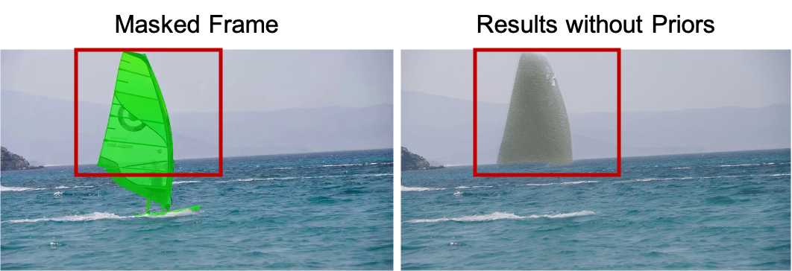
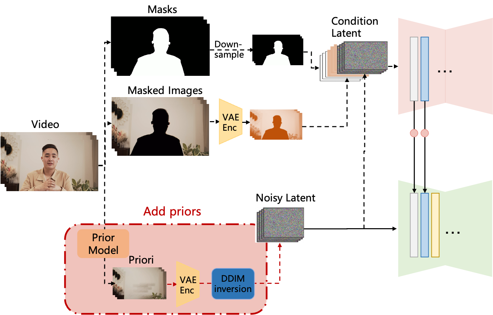
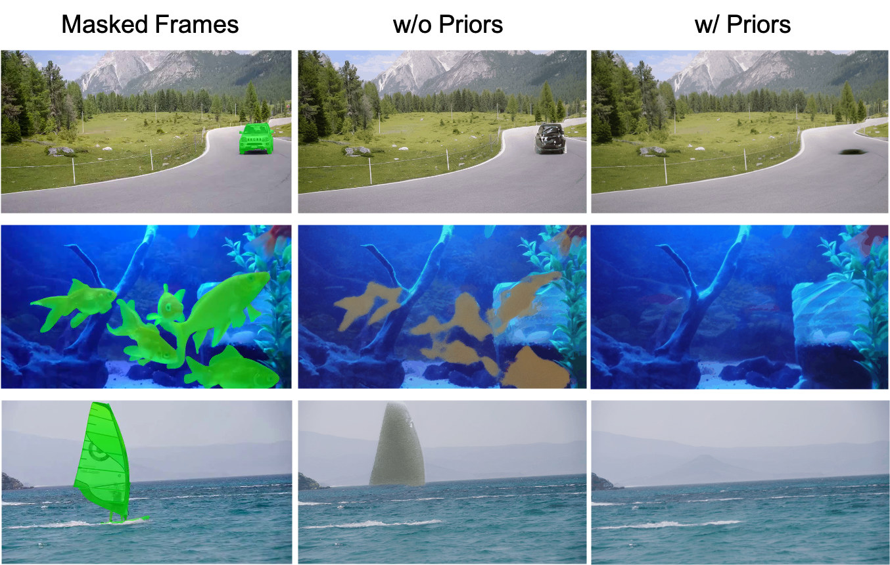
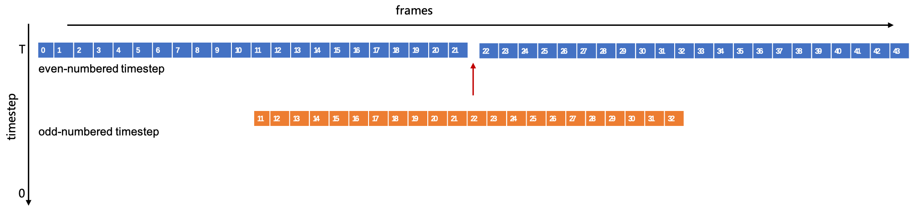
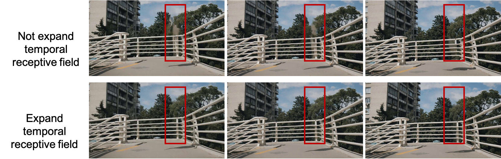

# DiffuEraser — Research Note
> **English** | [繁體中文](./README.zh-TW.md)

## 📇 Academic Context

| Field | Value |
|-|-|
| Title | DiffuEraser: A Diffusion Model for Video Inpainting |
| Venue | arXiv (Technical Report) |
| Year | 2025 |
| Authors | Xiaowen Li, Haolan Xue, Peiran Ren, Liefeng Bo (Tongyi Lab, Alibaba Group) |
| Official Code | https://github.com/lixiaowen-xw/DiffuEraser.git |
| Venue Kind | tech-report |

## Introduction

Video inpainting has to fill masked regions with content that is both plausible and temporally coherent. The dominant prior approach decomposes the problem into three modules — flow completion, feature propagation, and content generation — and splits pixels into two classes: known pixels, which have appeared in some frames and can be propagated via optical flow, and unknown pixels, which have never appeared and must be filled in by the generation module. The representative of this line is Propainter, composed of recurrent flow completion, dual-domain propagation, and a mask-guided sparse Transformer.

The starting point of this technical report is a concrete failure case: when the mask is large, the Transformer's generative capacity is insufficient, and Propainter produces obvious blur and mosaic-like artifacts. The authors argue for switching to the more generatively capable Stable Diffusion as the inpainting backbone, naming it DiffuEraser. The core method has three parts: turning the image inpainting model BrushNet into a video model by adding an AnimateDiff-style motion module, using the output of a prior model (Propainter) as initialization and a weak condition, and using pre-inference plus the temporal smoothness of VDMs to handle cross-clip consistency in long videos.

![Paper teaser (Figure 1): a qualitative comparison of DiffuEraser and Propainter. (a) The left half is texture quality — each group, from left to right, is the input frame with a green mask (Masked Frames), the Propainter result, and the DiffuEraser result (Ours); under large masks Propainter tends to blur while DiffuEraser has sharper texture. (b) The right half is temporal consistency — consecutive frames of the same clip, comparing the cross-frame stability of the two. This is the core and almost the only qualitative comparison the paper uses to support the "outperforms state-of-the-art" claim, and it is not accompanied by any quantitative metric.](imgs/fig1ab.png)

It is worth stating up front how the paper checks whether the method works: it trains on over three million clips filtered from Panda-70M, generating masks with random ratios, directions, and shapes during training to simulate inpainting and object removal. But on the evaluation side, this technical report provides only qualitative figure comparisons against Propainter (texture quality and temporal consistency); the whole paper contains no quantitative table and no metric numbers such as PSNR, SSIM, VFID, or $E_{\mathrm{warp}}$. The abstract and conclusion claim that it outperforms state-of-the-art in both content completeness and temporal consistency, but this claim has no quantitative evidence backing it in the body of the paper — a point elaborated in the Critical Assessment.

## First Principles

### Network overview: BrushNet branch plus a motion module

The backbone of DiffuEraser is a primary denoising UNet plus an auxiliary BrushNet branch. The BrushNet branch takes as its conditioning input the concatenation of masked images, masks, and noisy latents, with dimension $[n, f, h/4, w/4, 9]$; the features it extracts, after passing through a zero convolution block, are added back layer by layer into the main denoising UNet, which processes noisy latents of dimension $[n, f, h/4, w/4, 4]$. For temporal consistency, the authors insert a temporal attention layer after each of the self-attention and cross-attention layers. After denoising completes, the generated image is blended with the input masked images using a blurred mask.

This design maps the three sub-problems to different components: the motion module propagates known pixels and maintains consistency within a single inference pass; Stable Diffusion's generative power fills in the details and texture of unknown pixels; and cross-clip long-sequence consistency is handled separately by pre-inference. The authors themselves note that Stable Diffusion's generative power and the motion module's temporal consistency have already been validated in other work, so this paper's focus is the two things "injecting a prior" and "long-sequence cross-clip consistency."

### Injecting a prior: using Propainter's output as initialization and a weak condition

A plain diffusion model occasionally generates meaningless noise-like artifacts in the masked region — the example the paper gives is a masked region above the sea horizon being filled with random noise rather than coherent content. The authors' solution is to strengthen the noisy latent input: they claim that, inspired by DDIM Inversion, they apply DDIM inversion to the output of a lightweight inpainting model (Propainter is chosen) and add the result into the noisy latent. This prior provides initialization information, letting the model generate meaningful and stable content that removes the noise artifacts, while also serving as a weak condition that suppresses the object hallucination common in diffusion models.

The authors emphasize that the blur and mosaic of the prior model do not drag down the final output; instead they are refined away by DiffuEraser, yielding richer texture in exchange. Here it is worth noting a discrepancy between the paper and the released code: the body of the paper describes the prior injection as applying DDIM Inversion to the prior model's output, but the released inference code `diffueraser/diffueraser.py` takes a different route — it first VAE-encodes the Propainter output frames into a latent (`self.vae.encode(...).latent_dist.sample()` at line 318), sets a fixed `timesteps=[0]` (line 322), and then uses `noise_scheduler.add_noise(latents, noise, timesteps)` to form the starting latent for inference (the frame-by-frame inference at line 383, the pre-inference branch at line 338). This is a fixed-timestep forward-noising (forward diffusion) rather than the deterministic DDIM inversion that recovers a specific $x_T$ as the paper's wording literally implies. Written in our own notation, this step does

$$
x_t = \sqrt{\bar\alpha_t}\, z_{\mathrm{prior}} + \sqrt{1-\bar\alpha_t}\,\epsilon,\qquad \epsilon \sim \mathcal{N}(0, I)
$$

where $z_{\mathrm{prior}}$ is the latent of the Propainter output after VAE encoding, and $t$ takes the fixed value 0 — that is, the least-noised end of any monotonic noise schedule, so the prior latent is used almost verbatim as initialization. This "add noise first, then denoise for a few steps" belongs to the SDEdit family of forward-noising initialization, and in form it is clearly different from the DDIM inversion the paper describes; as for whether the two produce an appreciable difference in the final output in this low-noise regime, neither the paper nor the code provides a comparison, so it cannot be determined from the released materials.

### Temporal consistency for long sequences: staggered denoising and expanding the temporal receptive field

The motion module can only guarantee temporal consistency within a single clip (set to 22 frames in this paper); once a long video is cut into multiple clips, obvious jumps appear at clip boundaries. The authors use two complementary means to address this.

The first is to exploit the temporal smoothness of the Video Diffusion Model (VDM) to do staggered denoising: during inference, even timesteps are aligned from the start of the clip, and odd timesteps are aligned from the midpoint of the clip. For frames overlapping between adjacent clips, even if the latent input is the same, the VDM's temporal smoothness adjusts the overlapping frames to be consistent with the starting frame, so repeatedly applying this smoothness at clip boundaries flattens the multiple jumps into a single gradual change across the whole video from start to end. The authors also honestly point out that, because the first and last frames themselves differ, full consistency across the entire video still cannot be achieved.

The second is to expand the temporal receptive field. A single inference pass can only see a limited number of frames (e.g. 22), and cannot propagate known pixels from distant frames. The authors add a two-stage "sample first, then process frame by frame" pipeline to both the prior and DiffuEraser: they first subsample the whole video into one clip for pre-propagation or pre-inference, letting the model "see" a wider temporal context, then use this result to guide the frame-by-frame inference. The optimization on the prior side ensures known pixels are propagated completely and stably along the entire time axis (maintaining correctness), and the optimization on the DiffuEraser side ensures the generation of unknown pixels is consistent across the whole video (maintaining stability).

### A concrete data-flow walkthrough

Take the setting of the paper's efficiency test as an example: a 10-second, 540p, 25 FPS video has about 250 frames. At inference the clip length is `nframes=22`, and the code overlaps clips by `overlap = num_frames//4` (i.e. 5 frames). Because the total 250 frames is greater than `nframes*2` (44), pre-inference is triggered: first subsample a clip representing the whole video and run it once, write the result back to the corresponding frames as initialization, then infer clip by clip and frame by frame. Within each clip, the BrushNet branch processes the $[n, f, h/4, w/4, 9]$ conditioning input, the main UNet processes the $[n, f, h/4, w/4, 4]$ latent, and the clip partition alternates between start-aligned and midpoint-aligned across even/odd timesteps. Aided by PCM two-step denoising, this 540p, 25 FPS, 10-second video takes about 200 seconds to finish on an Nvidia L20.

### Training, data, and efficiency

The paper's training and efficiency settings are summarized in the table below. Note that these are settings and cost numbers, not evaluation results — the whole paper contains no quantitative accuracy comparison.

| Aspect | Paper setting | Concrete number |
|-|-|-|
| Training data | Panda-70M cut into segments by scene cut and filtered by matching score, paired with captions | 3,183,727 clips |
| Training resolution | Fixed resolution in both stages | 512 |
| Stage 1 | Train BrushNet and the main denoising UNet (no motion module) | 4×A100, 100,000 steps, batch 16 |
| Stage 2 | Train only the main UNet's motion module | 8×A100, 80,000 steps, 22-frame sequences, batch 1 |
| Optimization | Same in both stages | L2 loss, lr 1e-5 |
| Inference efficiency | Aided by PCM two-step generation | 10-second 540p 25 FPS video ~200 seconds on Nvidia L20 |

### Static check of the released code

Under static inspection only, without running any code, the released code broadly matches the paper's description and also fills in defaults the paper does not spell out. `run_diffueraser.py` indeed first runs Propainter to produce the prior `priori.mp4` before handing off to DiffuEraser; the default clip length in `diffueraser/diffueraser.py` is `nframes=22`, PCM provides a `2-Step` checkpoint (2 steps, guidance 0.0), and pre-inference is done only when `n_total_frames > nframes*2`. Staggered denoising comes from `get_frames_context_swap` in `diffueraser/pipeline_diffueraser.py`, which produces two clip partitions, `context_list` and `context_list_swap` (line 1184), and the denoising loop switches to the shifted `context_list_swap` on odd timesteps (`if (i%2==1)`, lines 1202-1203). As noted above, the prior injection is `add_noise` forward-noising in the code, which diverges from the paper's wording of DDIM inversion.

## 🧪 Critical Assessment

### Realness and importance of the problem

"Under large masks, propagation/Transformer methods blur, lose detail, hallucinate, and are temporally inconsistent" is a real and observable problem, which the paper makes concrete with the Propainter comparison in Figure 1, so the motivation holds up. Replacing the weaker-generation Transformer with Stable Diffusion is also a reasonable direction. But it should be noted that this is a technical report rather than a peer-reviewed paper (the title plainly marks it TECHNICAL REPORT), so its claims should be read with a more conservative attitude than a typical conference paper.

### Are baselines, ablations, datasets, and metrics sufficient

This is the biggest weakness of the paper: it contains no quantitative evaluation at all. There is no designated test dataset, no metrics such as PSNR/SSIM/VFID/warping error, not a single quantitative table, and the baseline is only Propainter, compared using only qualitative figures. Both the abstract and conclusion write "outperforms state-of-the-art," but the paper does not provide any numbers supporting this SOTA claim — this is a typical case of substituting qualitative figures for quantitative evaluation and self-selecting favorable display conditions. All ablations (before/after the prior, before/after temporal consistency) are also figure comparisons, so readers cannot judge the magnitude of the improvement, nor confirm whether the comparison conditions are aligned.

The "more comparison results" the paper adds in the conclusion section continue the same pattern: these supplementary figures are likewise three-column (Masked Frames / Propainter / Ours) qualitative comparisons of DiffuEraser against Propainter, all on author-chosen cases, with no numbers in any cell. The two below are representative — one comparing texture, one comparing temporal consistency.

### Novelty: integration of existing components, not new modules

Looking at the method components, DiffuEraser is an integration of existing parts: BrushNet provides the masked-image branch, AnimateDiff provides the motion module, Propainter serves as the prior, PCM provides few-step distillation, and staggered denoising is explicitly said to be inspired by FloED's timestep interpolation. The genuinely own combined contributions of this paper are the two engineering designs "inject Propainter as a prior into the noisy latent" and "expand the temporal receptive field with pre-inference." These designs have their ingenuity, but packaging them as a beyond-SOTA claim looks excessive without quantitative support.

### Is the claimed problem actually solved, and is it practically meaningful

The method is usable from an engineering standpoint: the released code is complete, it has PCM few-step inference, and the cost of ~200 seconds for a 10-second 540p video is acceptable for offline editing — all of which point to a system that can actually run. The paper also includes real-world examples — including timestamped dashcam/surveillance-style footage (figure below), where DiffuEraser fills in the background with fewer blocky artifacts than Propainter after object removal. But this precisely highlights the problem: such real videos have no ground truth, so whether the filled-in texture "restores the real background" or "the diffusion model fabricates a plausible-looking background (hallucination)" cannot be determined by the naked eye alone without PSNR/SSIM comparisons. So "whether it is solved" remains open at the level of evidence.

Prior dependence is a double-edged sword — the correctness of the whole result hinges on Propainter first propagating known pixels correctly; if the prior fails under extremely large masks or fast motion, DiffuEraser lacks independent quantitative evidence of robustness. In addition, the paper admits that full consistency across the entire video still cannot be achieved, and the failure cases for long videos and large masks, and the quantitative degree of hallucination suppression, are not measured. The reasonable conclusion is: this is a system that holds up engineering-wise and demonstrates decent results, but has not yet been verified in terms of quantitative evidence.

## One-minute version

- **The problem to solve**: when the mask is large, propagation/Transformer methods like Propainter have insufficient generative power and fill in blur and mosaic-like artifacts.
- **The core approach**: add the output of a lightweight inpainting model (Propainter) into the noisy latent as initialization and a weak condition, preventing the diffusion model from generating random noise or object hallucinations; then use the VDM's temporal smoothness and pre-inference to handle cross-clip consistency in long videos.
- **The biggest caveat**: the paper claims to outperform state-of-the-art in content completeness and temporal consistency, but the whole paper contains no quantitative table, and no PSNR/SSIM/VFID/$E_{\mathrm{warp}}$, only qualitative figures against Propainter — this SOTA claim has no numerical support in the body.
- **The key dependency**: the correctness of the result hinges on Propainter first propagating known pixels correctly; the authors also admit that, due to the difference between the first and last frames, full consistency across the entire video still cannot be achieved.
- **The practical cost**: aided by PCM two-step denoising, a 10-second, 540p, 25 FPS video takes about 200 seconds on an Nvidia L20, acceptable for offline editing.

## 🔗 Related notes

- [Segment Anything](../Segment_Anything/)
- [DDPM (Denoising Diffusion Probabilistic Models)](../diffusion/)
