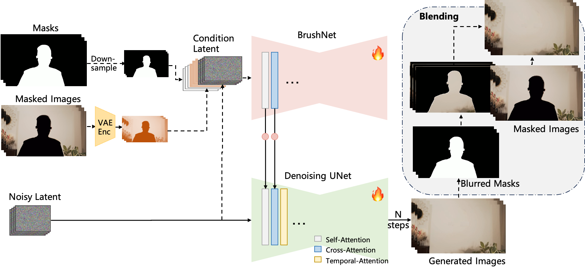
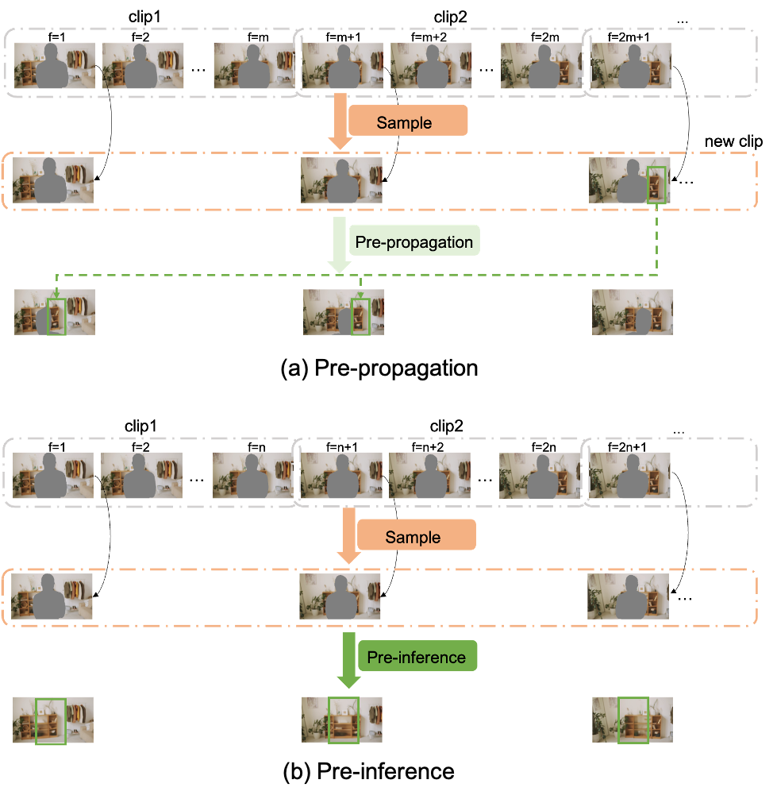
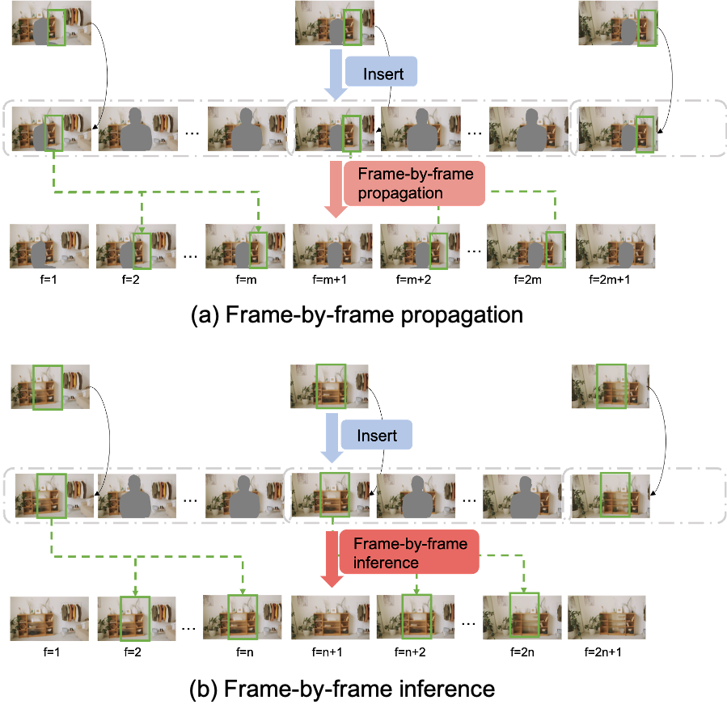
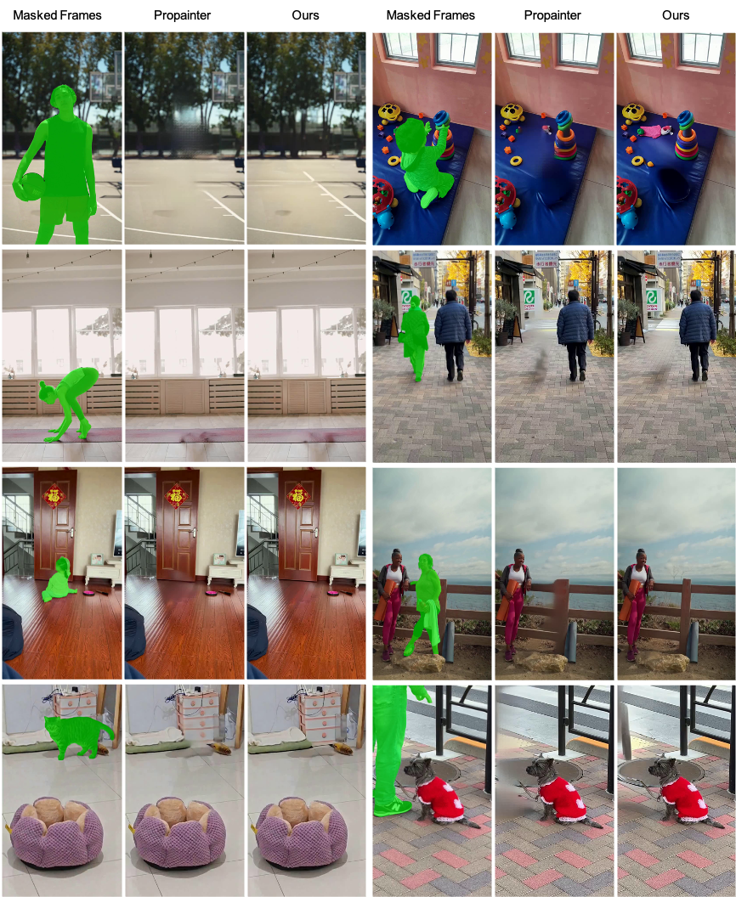
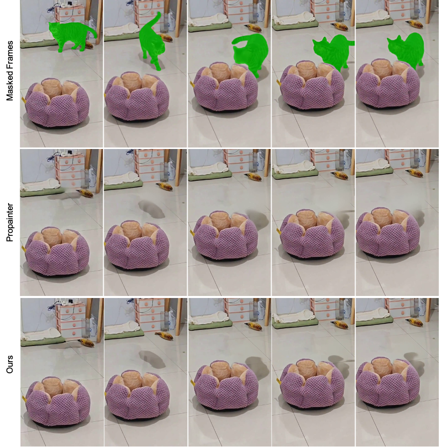
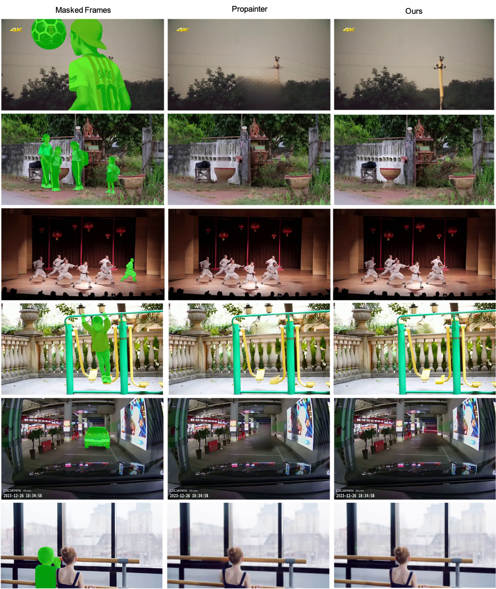

# DiffuEraser — 研究筆記
> [English](./README.md) | **繁體中文**

## 📇 Academic Context

| Field | Value |
|-|-|
| Title | DiffuEraser: A Diffusion Model for Video Inpainting |
| Venue | arXiv (Technical Report) |
| Year | 2025 |
| Authors | Xiaowen Li, Haolan Xue, Peiran Ren, Liefeng Bo (Tongyi Lab, Alibaba Group) |
| Official Code | https://github.com/lixiaowen-xw/DiffuEraser.git |
| Venue Kind | tech-report |

## Introduction

Video inpainting 要在被遮罩的區域補上既合理、又在時間上連續的內容。過去主流做法把問題拆成三個模組：flow completion、feature propagation、content generation，並把像素分成兩類——曾在某些幀出現過、可以靠 optical flow 傳播的 known pixels，以及從未出現過、必須靠生成模組補出的 unknown pixels。這條路線的代表是 Propainter，它由 recurrent flow completion、dual-domain propagation 與 mask-guided sparse Transformer 組成。

這篇技術報告的出發點是一個具體的失效情境：當遮罩很大時，Transformer 的生成能力不足，Propainter 會產生明顯的模糊與馬賽克狀 artifacts。作者主張改用生成能力更強的 Stable Diffusion 當作補洞的骨幹，並把它命名為 DiffuEraser。核心方法有三塊：把 image inpainting 模型 BrushNet 加上 AnimateDiff 式的 motion module 變成影片模型、用一個先驗模型（Propainter）的輸出當作初始化與弱條件、以及用 pre-inference 與 VDM 的時間平滑性來處理長影片跨 clip 的一致性。

論文如何檢驗方法是否有效，值得先講清楚：它用 Panda-70M 過濾後的三百多萬段影片訓練，訓練時以隨機比率、方向與形狀產生遮罩來模擬 inpainting 與物件移除。但在評估端，這份技術報告只提供對 Propainter 的定性圖例比較（texture 品質與 temporal consistency），全文沒有任何一張量化表格，也沒有 PSNR、SSIM、VFID、$E_{\mathrm{warp}}$ 這類 metric 數字。摘要與結論宣稱在 content completeness 與 temporal consistency 上超越 state-of-the-art，但這個宣稱在論文正文裡並沒有量化證據支撐——這一點會在 Critical Assessment 詳述。

## First Principles

### 網路總覽：BrushNet 分支加上 motion module

DiffuEraser 的骨架是一個 primary denoising UNet 加上輔助的 BrushNet 分支。BrushNet 分支吃進由 masked images、masks 與 noisy latents 串接成的條件輸入，維度是 $[n, f, h/4, w/4, 9]$；它抽出的特徵經過一個 zero convolution block 之後，逐層加回主 denoising UNet，而主 UNet 處理的是維度 $[n, f, h/4, w/4, 4]$ 的 noisy latents。為了時間一致性，作者在 self-attention 與 cross-attention 之後各插入一層 temporal attention。去噪完成後，生成影像會用模糊過的遮罩與輸入的 masked images 融合。

這個設計把三個子問題對應到不同元件：motion module 負責在單次推論內傳播 known pixels 並維持一致性；Stable Diffusion 的生成力負責補出 unknown pixels 的細節與紋理；跨 clip 的長序列一致性則另外用 pre-inference 處理。作者自己也說明，Stable Diffusion 的生成力與 motion module 的時間一致性在別的研究已被驗證，本文的重點是「注入先驗」與「長序列跨 clip 一致性」這兩件事。

### 注入先驗：用 Propainter 的輸出當初始化與弱條件

單純的擴散模型在遮罩區域偶爾會生出無意義的雜訊狀 artifacts——論文舉的例子是海平面上方的遮罩區被填成隨機雜訊而非連貫內容。作者的解法是強化 noisy latent 這個輸入：他們宣稱受 DDIM Inversion 啟發，對一個輕量 inpainting 模型（選定 Propainter）的輸出做 DDIM inversion，再把結果加進 noisy latent。這個先驗提供了初始化資訊，讓模型生成有意義且穩定的內容以消除雜訊 artifacts，同時當作弱條件抑制擴散模型常見的物件幻覺。

作者強調先驗模型的模糊與馬賽克不會拖累最終輸出，反而會被 DiffuEraser 精修掉，換來更豐富的紋理。這裡值得注意一個 paper 與 released code 的落差：論文正文把先驗注入描述成對先驗模型輸出做 DDIM Inversion，但釋出的推論程式 `diffueraser/diffueraser.py` 走的是另一條路——先把 Propainter 輸出的影格用 VAE 編碼成 latent（line 318 的 `self.vae.encode(...).latent_dist.sample()`），設一個固定的 `timesteps=[0]`（line 322），再用 `noise_scheduler.add_noise(latents, noise, timesteps)` 形成推論的起始 latent（frame-by-frame 推論在 line 383、pre-inference 分支在 line 338）。這是一個固定 timestep 的前向擴散加噪（forward-noising），而不是論文字面上可回復特定 $x_T$ 的確定性 DDIM inversion。用我們自己的記號寫，這一步做的是

$$
x_t = \sqrt{\bar\alpha_t}\, z_{\mathrm{prior}} + \sqrt{1-\bar\alpha_t}\,\epsilon,\qquad \epsilon \sim \mathcal{N}(0, I)
$$

其中 $z_{\mathrm{prior}}$ 是 Propainter 輸出經 VAE 編碼後的 latent，$t$ 取固定值 0——也就是任何單調噪聲排程中加噪程度最低的一端，先驗 latent 幾乎原樣被當成初始化。這種「先加噪、再少步去噪」屬於 SDEdit 一類的 forward-noising 初始化，在寫法上與論文所述的 DDIM inversion 明確不同；至於兩者在這種低噪聲設定下對最終輸出是否造成可觀差異，論文與程式都沒有給出對照，無法從釋出資料判定。

### 長序列的時間一致性：staggered denoising 與擴大時間感受野

motion module 只能保證單一 clip（本文設定為 22 幀）內的時間一致性，長影片被切成多個 clip 後，clip 邊界會出現明顯跳變。作者用兩個互補的手段處理。

第一個是利用 Video Diffusion Model（VDM）的時間平滑性做 staggered denoising：推論時偶數 timestep 從 clip 的起點對齊，奇數 timestep 從 clip 的中點對齊。對相鄰 clip 重疊的幀，即使 latent 輸入相同，VDM 的時間平滑性會把重疊幀調整成與起始幀一致，於是在 clip 交界處反覆施加這個平滑性，就能把多次跳變攤平成整段影片從頭到尾的一次漸變。作者也誠實指出，因為首尾幀本身存在差異，整段完全一致仍無法達成。

第二個是擴大時間感受野。單次推論只能看到有限幀（例如 22 幀），無法傳播來自遠處幀的 known pixels。作者對先驗與 DiffuEraser 都加上「先取樣、再逐幀」的兩段式流程：先把整段影片抽樣成一個 clip 做 pre-propagation 或 pre-inference，讓模型「看見」更廣的時間脈絡，再用這個結果引導逐幀推論。先驗端的優化確保 known pixels 在整個時間軸上被完整且穩定地傳播（維持正確性），DiffuEraser 端的優化則確保 unknown pixels 的生成在整段影片一致（維持穩定性）。

### 一個具體的資料流走查

以論文效率測試的設定為例：一段 10 秒、540p、25 FPS 的影片約有 250 幀。推論時 clip 長度 `nframes=22`，程式以 `overlap = num_frames//4`（即 5 幀）在 clip 間重疊。因為總幀數 250 大於 `nframes*2`（44），會觸發 pre-inference：先抽樣出一個代表整段的 clip 跑一次，把結果寫回對應幀當作初始化，再逐 clip 逐幀推論。每個 clip 內，BrushNet 分支處理 $[n, f, h/4, w/4, 9]$ 的條件輸入、主 UNet 處理 $[n, f, h/4, w/4, 4]$ 的 latent，並在偶/奇 timestep 之間切換起點/中點對齊的 clip 切分。借助 PCM 兩步去噪，這段 540p、25 FPS、10 秒的影片在 Nvidia L20 上約需 200 秒完成。

### 訓練、資料與效率

論文的訓練與效率設定整理如下表。要注意這些是設定與成本數字，不是評估結果——全文沒有任何量化的準確度比較。

| 面向 | 論文設定 | 具體數字 |
|-|-|-|
| 訓練資料 | Panda-70M 依 scene cut 切段並用 matching score 過濾，配對 caption | 3,183,727 段短片 |
| 訓練解析度 | 兩階段皆用固定解析度 | 512 |
| 第一階段 | 訓練 BrushNet 與主 denoising UNet（無 motion module） | 4×A100，100,000 步，batch 16 |
| 第二階段 | 只訓練主 UNet 的 motion module | 8×A100，80,000 步，22 幀序列，batch 1 |
| 最佳化 | 兩階段皆同 | L2 loss，lr 1e-5 |
| 推論效率 | 借助 PCM 兩步生成 | 10 秒 540p 25 FPS 影片於 Nvidia L20 約 200 秒 |

### 釋出程式碼的靜態核對

只做靜態檢視、未執行任何程式的前提下，釋出的程式碼與論文描述大致吻合，也補上了論文沒寫清楚的預設值。`run_diffueraser.py` 確實先跑 Propainter 產出先驗 `priori.mp4` 再交給 DiffuEraser；`diffueraser/diffueraser.py` 的預設 clip 長度是 `nframes=22`，PCM 提供 `2-Step` 檔（2 步、guidance 0.0），且只有在 `n_total_frames > nframes*2` 時才做 pre-inference。staggered denoising 由 `diffueraser/pipeline_diffueraser.py` 的 `get_frames_context_swap` 產生 `context_list` 與 `context_list_swap` 兩套 clip 切分（line 1184），去噪迴圈在奇數 timestep（`if (i%2==1)`，line 1202-1203）改用位移後的 `context_list_swap`。如前所述，先驗注入在程式裡是 `add_noise` 的前向加噪，與論文措辭的 DDIM inversion 有落差。

## 🧪 Critical Assessment

### 問題的真實性與重要性

「大遮罩下 propagation/transformer 方法會模糊、掉細節、幻覺、時間不一致」是一個真實且可觀察的問題，論文用 Figure 1 的 Propainter 對比把它具體化，動機站得住腳。用 Stable Diffusion 換掉生成能力較弱的 Transformer 也是合理方向。但要說明的是，這是一份技術報告而非經同儕審查的論文（標題明白標示 TECHNICAL REPORT），因此它的宣稱需要用比一般會議論文更保守的態度來讀。

### baseline、消融、資料集與 metric 是否足夠

這是本文最大的弱點：全文沒有任何量化評估。沒有指定的測試資料集、沒有 PSNR/SSIM/VFID/warping error 之類的 metric、沒有一張量化表格，baseline 也只有 Propainter 一個，而且只用定性圖例比較。摘要與結論都寫「outperforms state-of-the-art」，但論文並未提供任何數字支撐這個 SOTA 宣稱——這是一個以定性圖例代替量化評估、自訂有利展示條件的典型情形。所有消融（先驗前後、時間一致性前後）也都是圖例對照，讀者無法判斷改善幅度，也無法確認比較條件是否對齊。

論文在結論段補上的「更多比較結果」延續同一模式：這些補充圖同樣是 DiffuEraser 對 Propainter 的三欄式（Masked Frames／Propainter／Ours）定性對照，全部由作者自選案例，沒有一格搭配數字。下面兩張是其中的代表——一張比紋理、一張比時間一致性。

### 新穎性：整合既有元件，而非全新模組

從方法元件看，DiffuEraser 是既有零件的整合：BrushNet 提供 masked-image 分支、AnimateDiff 提供 motion module、Propainter 當先驗、PCM 提供少步數蒸餾、staggered denoising 明說是受 FloED 的 timestep 插值啟發。真正屬於本文的組合貢獻是「把 Propainter 當先驗注入 noisy latent」與「用 pre-inference 擴大時間感受野」這兩個工程設計。這些設計有其巧思，但把它包裝為超越 SOTA 的宣稱，缺乏量化佐證就顯得過度。

### 宣稱的問題是否真的解決、是否具現實意義

方法在工程上是可用的：釋出程式碼完整、有 PCM 少步數推論、10 秒 540p 影片約 200 秒的成本對離線編輯尚可接受，這些都指向一個能實際跑的系統。論文也附上真實場景的例子——包含帶時間戳的行車／監視器風格畫面（下圖），DiffuEraser 在移除物件後補出的背景比 Propainter 少了塊狀偽影。但這正凸顯了問題：這類真實影片沒有 ground truth，補出的紋理究竟是「還原了真實背景」還是「擴散模型編出一個看起來合理的背景（hallucination）」，光靠肉眼與缺乏 PSNR/SSIM 的對照無從判定。但「是否解決」在證據層面仍是開放的。

先驗依賴是雙面刃——整個結果的正確性繫於 Propainter 先把 known pixels 傳播對，若先驗在極大遮罩或快速運動下失效，DiffuEraser 缺乏獨立的量化韌性證據。此外，論文坦承整段影片的完全一致性仍無法達成，長影片與大遮罩的失效案例、幻覺抑制的量化程度都沒有被測量。合理的結論是：這是一個工程上成立、展示效果不錯，但在量化證據上尚未被驗證的系統。

## 一分鐘版

- **要解決的問題**：遮罩很大時，Propainter 這類 propagation/Transformer 方法生成力不足，會補出模糊與馬賽克狀 artifacts。
- **核心做法**：把輕量修復模型（Propainter）的輸出加進 noisy latent，當作初始化與弱條件，防止擴散模型生出隨機雜訊或物件幻覺；再用 VDM 的時間平滑性與 pre-inference 處理長影片跨 clip 的一致性。
- **最大保留**：論文宣稱在內容完整度與時間一致性超越 state-of-the-art，但全文沒有任何量化表格，也沒有 PSNR/SSIM/VFID/$E_{\mathrm{warp}}$，只有對 Propainter 的定性圖例——這個 SOTA 宣稱在正文裡沒有數字支撐。
- **關鍵依賴**：結果的正確性繫於 Propainter 先把 known pixels 傳播對；作者也坦承因首尾幀差異，整段影片的完全一致性仍無法達成。
- **實務成本**：借助 PCM 兩步去噪，10 秒、540p、25 FPS 的影片在 Nvidia L20 上約需 200 秒，對離線編輯尚可接受。

## 🔗 Related notes

- [Segment Anything](../Segment_Anything/)
- [DDPM (Denoising Diffusion Probabilistic Models)](../diffusion/)
