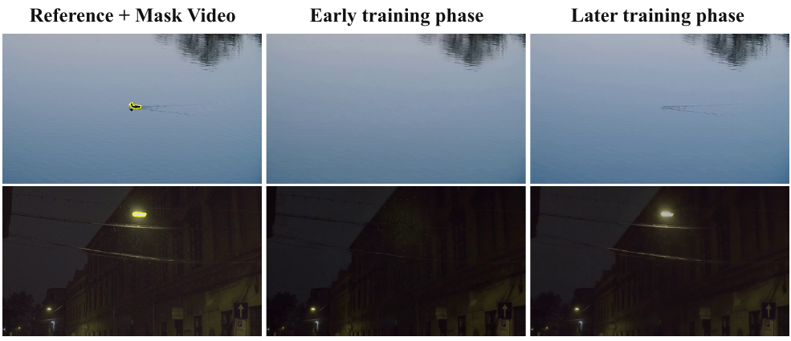
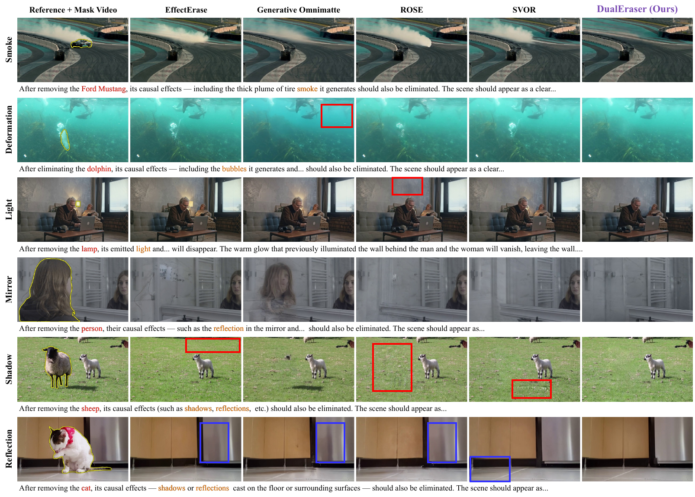
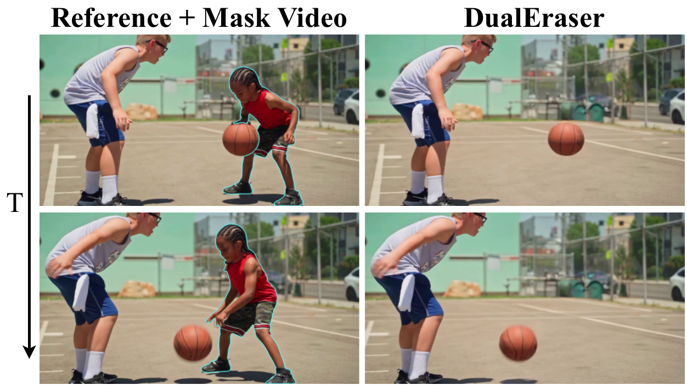

# DualEraser — 研究筆記
> [English](./README.md) | **繁體中文**

## 📇 Academic Context

| Field | Value |
|-|-|
| Title | DualEraser: Joint Video Object and Effect Removal via Balanced Text-Mask Guidance and Decoupled Locator-Preserver |
| Venue | arXiv preprint (CVPR 2026 submission template; acceptance unverified) |
| Year | 2026 |
| Authors | Yuqing Chen, Lin Liu, Haisu Wu, Xiaopeng Zhang, Yaowei Wang, Yujiu Yang, Qi Tian (Tsinghua, Huawei, Pengcheng Lab, Southeast, HIT) |
| Official Code | https://github.com/cyqii/GenEraser |
| Venue Kind | paper |

本文以 arXiv `2605.30045v2` 的全文與 LaTeX 原始碼為證據來源。paper_info 使用 CVPR 2026 投稿模板且 paperID 遮罩為 `*****`，因此「已被 CVPR 2026 錄取」並無證據，本文一律以 preprint 對待。官方 repo 目前只是一個名為 **GenEraser**（v1 舊名）的展示頁，除 README、LICENSE 與一段 showcase GIF 外**沒有任何程式碼、設定檔或權重**。

## Introduction

一般的 video object removal 只把 mask 指定的物件塗掉，卻留下它造成的物理效果——例如賽車揚起的輪胎 smoke、檯燈打在牆上的 emitted light、水面上的 wake 與 ripple、鏡中的 reflection。留著這些「因」而抹掉「果」會產生物理上不一致的畫面（例如車不見了、煙還在）。DualEraser 要解決的是 **joint video object and effect removal**：同時抹掉物件與其關聯效果，並且盡量不動到與它無關的背景。

作者把這件事做不好的原因歸結為一個他們稱為 **semantic–pixel conflict** 的根本衝突，並拆成兩層。第一層是 condition-level 的 modality dissonance：單一 modality 資訊不完整（binary mask 對「擴散的煙」這種弱時空相關的效果幾乎沒有語義），而 text 與 mask 兩種條件的相對主導權又會隨場景漂移。第二層是 optimization-level 的 objective entanglement：語義抹除（要敢刪）與像素保真（要別亂動）兩個目標被塞進同一組網路權重裡互相拉扯。

DualEraser 的高階解法對應三個模組：用 **Bipartite Text** 明確寫出「要移除什麼＋移除後場景長怎樣」並配合 **MCCE** 的條件 dropout 訓練，補回 mask 缺的語義；用 **LD-CFG** 這個可學習的 fusion 模組取代固定 scale 的 classifier-free guidance，讓 text/mask 的權重隨場景自動平衡；用 **Locator（高噪聲專家）＋ Preserver（低噪聲專家）** 的解耦架構，把「抹除」與「保真」交給兩個不同訓練配方的 expert。

評估方式上，量化用兩個提供 ground-truth 的 benchmark：ROSE Benchmark 與 VOR-Eval，指標為 PSNR、SSIM、LPIPS；開放世界（沒有 GT）用 VOR-Wild，指標為 Erasure Preference Rate (EPR) 與 User Preference Rate (UPR) 這兩個人工偏好率。baseline 分兩類：只做物件移除的 ProPainter、MiniMax-Remover、DiffuEraser，以及做物件＋效果聯合移除的 ROSE、EffectErase、SVOR、Generative Omnimatte。headline 數字是 5B 版在 ROSE 上 PSNR 較 SVOR 高 2.16 dB、在 VOR-Eval 上較 EffectErase 高 1.44 dB。

## First Principles

### 兩層衝突：本文的問題界定

第一層 condition-level 的第一個症狀是「單一 modality 資訊不完整」：pixel-level 的 binary mask 只框出物件占據的像素，對 smoke、emitted light 這種與物件弱相關、會擴散到 mask 外的效果沒有語義描述，模型只能「猜」哪些像素屬於效果。第二個症狀是「cross-modal dominance imbalance」：如 Figure 2 所示，水面小船那一列需要 text 主導（mask 只框住船，抹不掉船尾的 wake），而嬰兒車那一列需要 mask 主導（要保住畫面裡沒被框的另一個小孩與後方的人），兩種 modality 的相對重要性會整個翻轉。

第二層 optimization-level 的 objective entanglement 有直接證據。作者拿單一 expert 觀察訓練早期與晚期：Table 1 顯示晚期在 ROSE PSNR 從 30.39 升到 32.86、VOR-Eval 從 23.29 升到 23.53，像素重建更好；但開放世界的 EPR 卻從 0.4987 掉到 0.4346。也就是說訓練越久越會 overfit 到「把未編輯區域照抄回來」，反而喪失在真實影片裡「敢把效果刪乾淨」的能力。這兩個目標塞在同一組權重裡，單一模型很難兩者兼優。

### 資料流：從輸入到輸出

給定 reference video $V_{\mathrm{ref}}$ 與 mask $M$，masked video 定義為 $V_{\mathrm{m}} = V_{\mathrm{ref}} \odot (\mathbf{1}-M)$。三路視覺輸入分別編碼成 latent：$x_{\mathrm{ref}}$、masked-video latent $x_{\mathrm{m}}$ 由 frozen VAE encoder 得到，mask latent $m$ 則只是把 mask **resize** 到 latent 尺度（如 Figure 4 左半，mask 走的是 Resize 而非 VAE）。Bipartite Text prompt $\mathcal{P}$ 由 frozen text encoder 編成 $c_{\mathrm{txt}}$。backbone 採用 Wan2.2 5B（預設）與 Wan2.1 1.3B 的 flow-matching MMDiT，訓練目標是預測 velocity field：

$$
x_t = (1-t)\,x_0 + t\,\epsilon,\qquad v_t^{\star} = \frac{\partial x_t}{\partial t} = \epsilon - x_0
$$

其中 $x_0$ 是目標（已移除）影片 $V_{\mathrm{gt}}$ 的 latent、$\epsilon \sim \mathcal{N}(0,I)$、$t\in[0,1]$ 是 flow-matching timestep。推論時從噪聲出發，先由 Locator 走高噪聲步、再交給 Preserver 走低噪聲步，跑完 40 步後取 full-guidance 分支的 clean latent $x^{\mathrm{f}}_0$，經 VAE decoder 還原成輸出影片。要特別指出：論文全文沒有給出支援的解析度、frame 數/影片長度或 fps，這些 input boundary 屬於 undocumented，本文不臆測。有明確記載的預處理只有兩項：訓練時對影片施加 affine transformation 以增加相機視角多樣性，並對輸入 mask 做 erosion 與 dilation，以提升模型對不精準 mask 的韌性。至於 mask 來源，附錄說明評估用的定性樣本 mask 多由 SAM3 自動生成、且明言「並非總是精準」（如 mirror 例有邊界誤差、hand 例只框到部分手臂），代表實務上 mask 品質受自動分割誤差左右，DualEraser 得靠 Bipartite Text 的語義把 mask 邊界外的目標補齊。

### MCCE 與 Bipartite Text：把缺的語義補回來

Bipartite Text 不是普通 caption，而是明確的兩段式結構：removal semantics 寫出「要移除的物件＋其關聯效果」，reconstruction semantics 寫出「移除後場景應長怎樣」。這些 prompt 在訓練與評估時皆由 Qwen3-VL 8B 自動生成，輸入是 reference video 加一段「只保留 masked 目標區、去掉背景」的 target-object-only video，讓 VLM 能同時指認物件與推斷其效果。

MCCE（Multi-Conditional Capability Elicitation）是 Stage I 的訓練策略：在 MMDiT 原本「隨機丟棄 text 條件」的 CFG 之上，額外以機率隨機把 mask latent $m$ 與 masked-video latent $x_{\mathrm{m}}$ 一起歸零，於是模型被逼著在三種條件配置下都能運作：

$$
c^{\mathrm{txt}}_t = (x_t,t,x_{\mathrm{ref}},\mathbf{0},\mathbf{0},c_{\mathrm{txt}}),\quad
c^{\mathrm{m}}_t = (x_t,t,x_{\mathrm{ref}},m,x_{\mathrm{m}},\varnothing),\quad
c^{\mathrm{f}}_t = (x_t,t,x_{\mathrm{ref}},m,x_{\mathrm{m}},c_{\mathrm{txt}})
$$

實作上 text-condition dropout 機率設 0.1、把 mask 與 masked-video 一起歸零的機率設 0.2；刻意排除「全無條件」那一格，因為其隨機性和 removal 需要的確定性控制相衝突。text-only 那格逼模型只靠文字重建目標，強化 text-to-visual 對齊。消融（Table 3）顯示：$p=0$ 等同 Wan2.2 baseline，多數訓練長度下 $p>0$ 的 EPR 都優於 $p=0$（例如 2000 步時 $p=0.2$ 的 0.4000 對 $p=0$ 的 0.3692），支持這個 mask dropout 的效果。

### 從 MC-CFG 到 LD-CFG：把 guidance 變成可學習

作為對照，作者先把傳統 CFG 擴成能同時吃 text 與 mask 的 MC-CFG baseline，用兩個手動 scale $\omega_{\mathrm{m}}$、$\omega_{\mathrm{txt}}$ 依序做外插、rescale、再融合：

$$
\tilde{v}_t = v^{\mathrm{m}}_t + \omega_{\mathrm{m}}(v^{\mathrm{f}}_t - v^{\mathrm{m}}_t),\quad
\hat{v}_t = \mathrm{clip}\!\left(\frac{\lVert v^{\mathrm{f}}_t\rVert_2}{\lVert\tilde{v}_t\rVert_2+\delta},0,1\right)\tilde{v}_t,\quad
v_t = v^{\mathrm{txt}}_t + \omega_{\mathrm{txt}}(\hat{v}_t - v^{\mathrm{txt}}_t)
$$

問題是這組 scale 是全域固定的、無法隨場景調整；而且 MC-CFG 對 scale 很敏感（附錄顯示 ROSE-Bench 最佳落在 text=1.0/mask=3.0，VOR-Eval 卻是兩者都 1.5，換 benchmark 就換最佳點）。LD-CFG 的作法是把「調 scale」換成「學 fusion」：Stage II 改用 text-only／mask-only／joint 三路並行的確定性輸入，每個 DiT block 之後接兩個可學習的 linear projection $f^{\mathrm{m}}_i$、$f^{\mathrm{txt}}_i$ 對三路特徵做殘差式融合：

$$
\hat{h}^{\mathrm{f}}_{i+1} = \tilde{h}^{\mathrm{f}}_{i+1} + f^{\mathrm{m}}_i(\tilde{h}^{\mathrm{f}}_{i+1} - h^{\mathrm{m}}_{i+1}),\qquad
h^{\mathrm{f}}_{i+1} = \hat{h}^{\mathrm{f}}_{i+1} + f^{\mathrm{txt}}_i(\hat{h}^{\mathrm{f}}_{i+1} - h^{\mathrm{txt}}_{i})
$$

DiT block 本身 frozen，只有這些 projection 可訓練；推論時三路 batch-wise concat 進網路，最後只取 full 分支 $v^{\mathrm{f}}_t$ 往下一步 denoise（$dx_t = v^{\mathrm{f}}_t\,dt$）。因此 LD-CFG 是把「text 與 mask 誰主導」內化成網路權重，而非推論時的一個純量。消融（Table 4）顯示它在三個 benchmark 全面勝出：ROSE 33.33 / VOR-Eval 23.91 / VOR-Wild EPR 0.5846，優於 Standard MC-CFG（32.91 / 23.79 / 0.5154）；且贏過參數量相同、只是硬接一層 linear 的 Simple Linear（32.16 / 23.41 / 0.5077），說明增益來自融合設計而非多出來的參數。

### Locator–Preserver：把兩個目標拆給兩個專家

為打破 objective entanglement，作者把去噪軌跡按 noise level 切成兩個 expert：Locator 是高噪聲專家、負責指認並抹除物件與效果；Preserver 是低噪聲專家、負責忠實保留背景。三個關鍵差異讓它們專精不同目標：(1) 訓練時長——Locator 步數較少（5B 為 12,500 步）以保住高階語義抹除，Preserver 步數較多（20,000 步）以磨像素對齊；(2) 訓練資料——Locator 用多樣的合成＋真實混合資料，Preserver 只用「像素乾淨」的資料；(3) 目標本身——一個要「敢刪」、一個要「別動」。作者刻意點出這與 Wan2.2 內建的 noise-level dual-expert（高噪聲做佈局、低噪聲做細節）在目標、時長、資料三個維度上都不同，因此不是單純沿用。

Preserver 為何不用真實資料？因為真實 pair（如 VOR）常有背景對不齊的問題：附錄 Table 7 量到 VOR（Real）在 1/16 crop 的背景 MAE 高達 11.50，而 ROSE（Synthetic）只有 3.85。若拿對不齊的真實 pair 訓 Preserver，它會去 fit 這些假影。消融（Table 6）印證：只用 ROSE 訓 Preserver、即使只 5,000 步，其 reference-background PSNR（53.60）也高於用 VOR–ROSE 混合資料訓 40,000 步（52.97）。整體訓練資料由 VOR（約 60K pair）與 ROSE（約 17K pair、對其非 common 的四類效果過採樣後）混成約 100K sampled pair；Stage I 5B 共 32.5K expert-step、1.3B 共 35K，Stage II 兩專家各再 1,800 步（合 3.6K）。noise-level 分界（routing boundary）設 0.875，是附錄在 {0.675, 0.775, 0.875} 中比較後採用的預設值——它在四個 Locator 訓練時長中有三個（2,000／3,000／4,000 步）的 VOR-Wild EPR 最高，僅在 1,000 步時 0.675（0.3897）高於 0.875（0.3692）。全程 16 張 A100、batch size 2、推論 40 步。

### 一次具體的前向：以水面小船為例

以 Figure 2 上列的 text-dominant 場景走一遍：輸入是一段俯拍水面小船的 reference video，mask（黃色輪廓）只框住船體；Bipartite Text 的 removal 段寫「移除 boat 及其 shadow / wake / ripple」，reconstruction 段寫「還原成平靜、無擾動的綠色水面」。編碼得 $x_{\mathrm{ref}}$（VAE）、$x_{\mathrm{m}}$（masked video 的 VAE latent，船的位置被挖空）、$m$（resize 後的 mask）、$c_{\mathrm{txt}}$（text encoder）。三路 conditioning tuple $c^{\mathrm{txt}}_t, c^{\mathrm{m}}_t, c^{\mathrm{f}}_t$ batch-concat 後，先由 Locator 在高噪聲步（noise level 高於 0.875 側）決定「船與尾流都該消失」，再由 Preserver 在低噪聲步把周圍水面補回連續紋理；每個 block 後 LD-CFG 用 $f^{\mathrm{m}}_i, f^{\mathrm{txt}}_i$ 融合三路。這裡若只給 mask（mask-only），因為 wake 落在 mask 外，模型會抹掉船卻留下尾流——這正是需要 text 主導的原因。跑完 40 步、取 full 分支、VAE 解碼即得移除結果。附錄的 mask 消融給了同一機制的反向數字：把 mask 條件整個拿掉、只留 Bipartite Text，ROSE-Bench PSNR 從 33.55 掉到 30.32（−3.23 dB）、VOR-Eval 從 23.87 掉到 21.30（−2.57 dB），說明 text 供語義、mask 供像素定位，兩者缺一不可。

### 主結果與證據

下表為主要量化比較（節錄自 Table 2，↑越高越好、↓越低越好）：

| Method | ROSE PSNR↑ | ROSE LPIPS↓ | VOR-Eval PSNR↑ | VOR-Wild EPR↑ | VOR-Wild UPR↑ |
|-|-|-|-|-|-|
| EffectErase | 27.04 | 0.0679 | 22.47 | 0.4256 | 0.4462 |
| ROSE | 31.09 | 0.0527 | 22.07 | 0.3744 | 0.3744 |
| SVOR | 31.17 | 0.0552 | 21.91 | 0.4769 | 0.5179 |
| DualEraser 1.3B | 32.21 | 0.0483 | 23.08 | 0.5410 | 0.5538 |
| DualEraser 5B | 33.33 | 0.0461 | 23.91 | 0.5872 | 0.5744 |

5B 版在 ROSE 較最強 baseline SVOR（31.17）高 2.16 dB、在 VOR-Eval 較 EffectErase（22.47）高 1.44 dB，並在 VOR-Wild 同時拿下最高 EPR 與 UPR；連 1.3B 版都勝過所有 baseline。定性上（Figure 1，即封面 teaser）DualEraser 在 smoke、deformation、light、mirror、shadow、reflection 六類效果上都比對手乾淨：對手常見背景斷裂（紅框）或抹不乾淨（藍框），例如 Gen. Omnimatte 移除氣泡卻染上不自然藍調、SVOR 留下白色殘影。此外，prompt 完整度消融顯示完整 Bipartite Text 的 VOR-Wild EPR（0.5923）高於任何殘缺設定（empty 0.5231、object-only 0.5282、effect-only 0.5256、background-only 0.5385），但像素指標幾乎不動——暗示 text 主要幫助的是開放世界的語義抹除，而非 benchmark 的像素分數。

## 🧪 Critical Assessment

### semantic–pixel conflict 是不是真問題

問題是真的：把物件抹掉卻留下 shadow、smoke、reflection 確實會產生物理不一致，這在影視後製、內容創作是實務痛點。作者對「semantic–pixel conflict」的兩層拆解（modality dissonance／objective entanglement）也不是空談，Table 1 與 Figure 3 提供了「訓練越久像素越好、開放世界抹除越差」的直接證據，這個 trade-off 的觀察本身有價值。

### 消融紮實，但訓練資料與 backbone 的公平性存疑

消融相當紮實：MCCE 的 dropout 機率、LD-CFG 對 MC-CFG 與 Simple Linear、Locator/Preserver 的步數與資料組成、routing boundary、VLM 選擇、殘缺 prompt、有無 mask 都有掃描，Simple Linear 這個「同參數量」對照尤其加分。但有兩個公平性隱憂。其一是**訓練資料優勢**：DualEraser 同時吃 VOR＋ROSE 混成的約 100K pair，而像 ROSE 這個 baseline 主要只在自家資料上訓、backbone 也各不相同，因此部分增益可能來自「更多資料＋更強的 Wan2.2/2.1 backbone」而非架構本身；論文並未提供「把 baseline 也搬到 Wan backbone、同資料重訓」的對照。其二是 **VOR-Eval 的 PSNR 本身偏低且吵**：所有方法在 VOR-Eval 都只有 21–24 dB，作者自己量到 VOR（Real）背景 MAE 11.50，代表 GT pair 對不齊；在一個 GT 不乾淨的 benchmark 上比 1.44 dB 的差距，其訊號強度要打折。

### 三個模組的原創度並不均等

三個模組的新穎度並不均等。LD-CFG 這個把 CFG 融合變成可學習 projection 的小模組最有原創性，且有 Simple Linear 對照支撐「不是靠多參數」。相對地，Bipartite Text＋MCCE 本質是「更好的 prompt 工程＋條件 dropout」，而 Locator–Preserver 是把 Wan2.2 既有的 noise-level dual-expert 換個訓練目標/時長/資料來重新利用——作者也誠實承認差異只在這三個維度、架構沿用。所以與其說是全新架構，不如說是「一個新的小融合模組＋一套針對 removal 精心設計的訓練配方」；這對社群仍有用，但「novel framework」的措辭略微膨脹。

### VOR-Wild 人工評測協定與同源 split 的隱憂

開放世界的 headline（robust effect removal）幾乎全靠 VOR-Wild 的 EPR/UPR 這兩個人工偏好率支撐，而評測協定值得警惕：EPR 只用 **2 位**「video object removal 專家」評 195 個 case，論文未載明這兩位與作者是否獨立；UPR 也僅 5 位志工，且每位只評隨機分派的 117 個 case、每個 case 恰由 3 位不同志工評估（並非五人全評 195 例），實際評分覆蓋比表面人數更薄。更關鍵的是「select multiple」協定——評審可同時勾選多個「成功」樣本，這比強制排序更寬鬆，容易讓分數整體偏高且方法間差距被壓縮或放大，統計顯著性與 inter-rater 一致性皆未報告。因此 EPR 上 0.58 vs 0.48 這類差距應視為「傾向性證據」而非硬結論。另外，訓練用 ROSE-Train／VOR-Train、評估用 ROSE-Bench／VOR-Eval，同源 split 的分佈高度重疊，雖非同一筆資料，仍存在對「自家分佈」過擬合的風險。

### 未解的 failure case 與復現性短板

沒有被完全解決，作者自陳兩類 failure：occlusion reconstruction（前景馬移除後、後方被遮的馬結構斷裂）與 physical causality（移除運球小孩後，籃球仍照抄原本被小孩驅動的彈跳軌跡，違反物理因果，見 Figure 9）。這說明模型仍受限於 base model 的生成能力與訓練資料中複雜互動場景的稀缺。可重現性則是最實際的短板：對官方 repo `cyqii/GenEraser` 做 transport-disabled 的靜態 shallow clone（不執行任何程式），可見它只追蹤三個檔案——`README.md`、`LICENSE`、`asset/showcases/showcases.gif`，**沒有任何 inference 程式、設定或權重**，secret 掃描亦無所獲；論文也未給解析度、frame 數、推論延遲或顯存需求。因此除了「16×A100、batch 2、40 步、Wan backbone」等零星數字外，外部要如實復現目前並不可行。此外主表 5B 的 ROSE PSNR 記為 33.33，但附錄多個消融表（mask、VLM）卻是 33.55，論文內部就有小幅不一致，暗示 headline 表與 ablation 表可能來自略微不同的 checkpoint/設定。

## 一分鐘版

- **聯合移除**：抹除影片物件時必須連帶清掉其關聯物理效果，避免留下「車不見了、煙還在」的矛盾畫面。例子：水面小船被 mask 框掉後，模型不能只挖空船身，還得撫平落在框外的擴散尾流。
- **高低噪聲雙專家**：把「敢刪物件」的高噪聲階段與「別動背景」的低噪聲階段拆給 Locator 與 Preserver 兩個專家，破解單一模型訓練越久越不敢刪效果的矛盾。例子：單一模型訓練到晚期時開放世界偏好率 EPR 從 0.4987 跌到 0.4346，拆開後高噪聲專家專注抹除、低噪聲專家在合成資料上專門打磨背景像素。
- **基準評測超越 baseline**：在有真值的合成影片與開放世界盲測中，抹除品質與像素重建指標均刷新先前成績。例子：5B 模型在 ROSE benchmark 取得 33.33 dB PSNR（勝過最強對手 SVOR 達 2.16 dB），開放世界人工抹除偏好率 EPR 拿下 0.5872。
- **評測基底雜訊與評審偏差**：領先數據的可靠度受限於真值未對齊與過於寬鬆的主觀標註協定。例子：VOR 真實基準背景誤差 MAE 高達 11.50 代表真值本就不乾淨，而開放世界 EPR 僅由 2 位可同時多選的評審給分，統計顯著性未經檢驗。
- **開源僅為展示空殼**：論文宣稱的程式庫目前毫無實用價值，外部完全無法重現或投入產線。例子：官方 GitHub 專案僅含說明文件、授權條款與一張展示用 GIF，連支援的影片解析度、幀率或推論顯存需求都未曾公布。

## 🔗 Related notes

- [DiffuEraser](../DiffuEraser/) — 本文的 object-only removal baseline 之一（video inpainting 的 diffusion 方法）。
- [ProPainter](../ProPainter/) — 本文的 object-only removal baseline 之一（flow-based video inpainting）。
