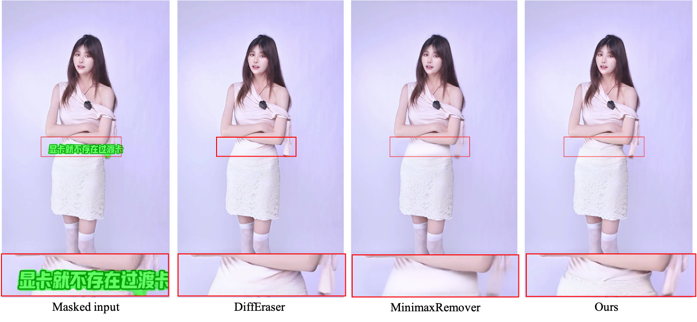
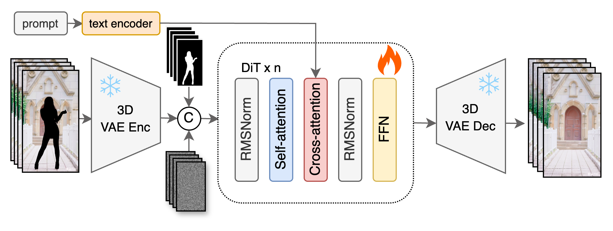
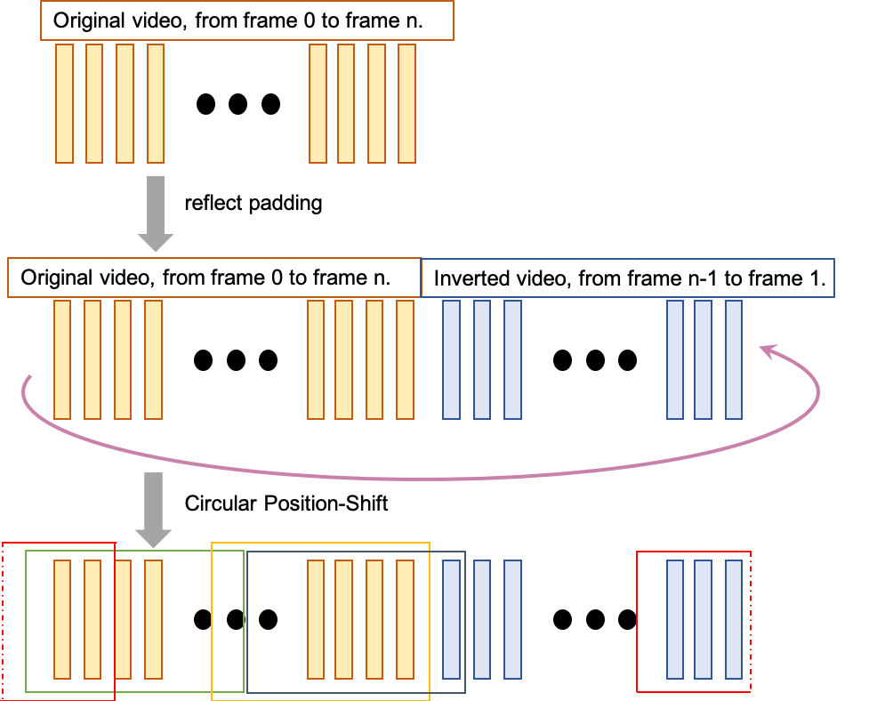
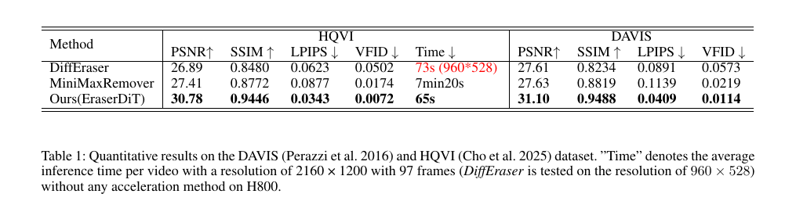

# EraserDiT — Research Note
> [English](./README.md) | **繁體中文**

## 📇 Academic Context

| Field | Value |
|-|-|
| Title | EraserDiT: Fast Video Inpainting with Diffusion Transformer Model |
| Authors | Jie Liu, Zheng Hui |
| Affiliation | Mango TV（Changsha, Hunan, China） |
| Venue | arXiv preprint（arXiv:2506.12853v2；以 AAAI 2026 投稿模板排版） |
| Year | 2025 |
| Venue Kind | tech-report |
| Venue Tier | unknown |
| Citation Count | unavailable |
| Official Code | https://github.com/JieLiu95/EraserDiT |
| Project Page | https://jieliu95.github.io/EraserDiT_demo/ |
| Model Weights | https://huggingface.co/jieeliu/EraserDiT |
| Backbone | LTX-Video（Lightricks） |

> 溯源說明：本 note 依據 arXiv 全文（`2506.12853v2`，2026-09-04 取得）與官方程式碼倉庫的靜態檢視撰寫；並未執行任何第三方程式碼、未下載模型權重。論文以 AAAI 2026 的 LaTeX 模板排版，但目前僅能證實其為 arXiv 預印本，是否被 AAAI 2026 接受無可查證來源，因此 Venue Tier 記為 `unknown`。

## Introduction

影片修補（video inpainting）與物件移除要在被遮蔽的區域填入「看起來真、語意對、且跨影格穩定」的內容——例如把一段廣告影片裡的人物或字幕去掉，還原出乾淨的背景。過去主流有兩條路線。第一條是 flow-guided propagation，以 ProPainter 為代表：先做 recurrent flow completion 估計光流，再用 dual-domain propagation 把「曾經出現過的已知像素」沿光流搬到被遮蔽的影格，最後用 mask-guided sparse Transformer 生成從未出現過的未知像素。第二條是 video Transformer，如 STTN、FuseFormer，把 ViT 引入時空維度。這兩條路線的共同弱點是：當遮罩很大時，propagation 找不到可搬運的已知像素，而其生成模組（GAN 或稀疏 Transformer）的生成能力不足，會留下明顯的模糊與馬賽克。

近期的擴散模型改善了生成力，但各有代價。DiffuEraser 把 Stable Diffusion 當修補骨幹、用 ProPainter 的輸出做先驗初始化，然而受限於其影片生成能力，紋理自然度仍不足，常見規律性的紋理瑕疵與模糊；MiniMax-Remover 走精簡兩階段路線但一段 2K clip 推論要超過 7 分鐘。與此同時，文字生影片的 Diffusion Transformer（DiT）——CogVideoX、HunyuanVideo、LTX-Video——改用 3D full attention 取代分離的時間／空間注意力，並以 3D VAE 沿時間與空間一起壓縮，大幅改善大幅度運動下的一致性與閃爍問題。EraserDiT 的核心主張就是：把這種影片 DiT 的強生成力與時空一致性搬到「大缺口、大運動、高解析度（宣稱最高 1080p）」的物件移除任務上。

作者列出四項貢獻。其一，引入 DiT 以 3D full attention 維持高解析影片在物件移除時的時空一致性，並靠 3D Causal VAE 的高壓縮率處理到 1080p。其二，提出推論階段的 Circular Position-Shift（CPS）策略以強化長片段的時間一致性。其三，為了訓練大型動態物件（人、動物）的移除，作者自建約 60,000 段 mask 影片。其四，提出一套自動生成 text prompt 的方法，讓提示詞描述「移除目標後」的畫面。論文最醒目的效率數字是：在單張 NVIDIA H800 上、不使用任何加速方法，處理一段 97 影格的高解析影片只要 65 秒。

論文如何驗證方法是否有效，值得先講清楚：評測用 DAVIS 與 HQVI 兩個資料集，量化指標為 PSNR、SSIM、LPIPS、VFID 四項再加上推論時間，baseline 只比較 DiffEraser 與 MiniMax-Remover 兩個近期擴散法，質化比較與時間一致性的動態證據則放在 project page 的影片。兩個資料集的遮罩來源並不相同：在 DAVIS 上作者自行生成二值遮罩並據此重建 masked video，在 HQVI 上則直接沿用資料集提供的 ground-truth 遮罩——這個差異在解讀跨資料集數字時值得記著（尤以自行生成遮罩的 DAVIS 為然）。整體而言這是一份篇幅精簡、以工程報告形式呈現的技術報告，正文沒有 user study、也沒有對主打貢獻 CPS 的量化 ablation（詳見 Critical Assessment）。

## First Principles

### 骨幹選擇：為什麼是 LTX-Video

EraserDiT 不是從零訓練的 DiT，而是拿 Lightricks 的 LTX-Video 當基礎架構做微調。作者的取捨很直接：HunyuanVideo 生成品質最好但 720p、129 影格就要 60GB 顯存且推論慢；LTX-Video 以 $32\times32\times8$ 的時空下採樣達到約 1:192 的壓縮率，換來極快的推論速度，雖然純文字生影片的品質不如 HunyuanVideo，但影片修補是「有強參考」的任務（大部分像素來自原片），對生成力的要求較低，因此速度優先的 LTX-Video 是划算的選擇。整條管線裡，3D VAE 與 text encoder（T5）凍結，只微調 denoising video transformer（DiT）的全部參數；官方 `inference_utils.py` 載入的三個子模組 `AutoencoderKLLTXVideo`、`T5EncoderModel`、`LTXVideoTransformer3DModel` 與 `FlowMatchEulerDiscreteScheduler` 正對應這個設計。

### 輸入怎麼構造、條件怎麼餵

訓練時隨機取一段背景影片 $V_i$ 與一段 mask 影片 $M_j$，論文寫成逐像素相乘 $V_M = V_i \ast M_j$ 得到 masked video，再由 3D VAE encoder 以 $32\times32\times8$ 壓縮成 latent；對應的 mask 序列也下採樣到同一尺度。這裡有一個論文留白、要對照程式碼才補得齊的細節：論文正文從未定義 $M_j$ 的極性（被移除區到底標 0 還是 1），只給了 $V_i \ast M_j$ 這個式子——若照字面要讓相乘把被移除區歸零，$M_j$ 就得是「背景為 1、目標為 0」的遮罩。但釋出程式碼採用相反極性：`pre.py` 先把目標遮罩門檻化為 1（`torch.where(mask_align>(255/2*self.threshold),1,0)`，被移除的目標區為 1），再以 `video*(1-mask)` 算 masked video（原始碼註解為 `# mask to be white`），也就是用 $1-M$ 把「目標為 1」的遮罩翻回去。最終效果一致（被移除區歸零），但論文的 $V_i \ast M_j$ 記法在極性上是留白的，真正的遮罩約定得看程式碼。denoising transformer 的輸入，是把「加噪的 latent」「masked video 的 latent」「下採樣後的 mask」沿通道維度串接而成；prompt 則經 T5 編碼後，以 cross-attention 與影片 token 做特徵融合。官方 `pipeline_ltx_video2video.py` 印證了這個條件結構：transformer 每步同時吃 `hidden_states`（noisy latent）、`cond_latents`（masked video latent）與 `mask_values`（mask），而 `num_channels_latents = (in_channels - 1) // 2` 恰好對應「兩份 latent＋一份 mask」的通道配置。值得注意的是，官方推論其實是 video-to-video：以 `strength=0.8` 對 masked video 的 latent 加噪當作起點，而非從純高斯噪聲生成。

由於 3D Causal VAE 在時間維度也做 8 倍壓縮，$n$ 個像素影格會被壓成的 latent 時間長度為

$$
f_{\text{lat}} = 1 + \frac{n-1}{8}
$$

也就是「第一影格獨立、其餘每 8 影格併為 1 個 latent 影格」。這帶來一個 mask 對齊的細節：每 8 個連續 mask 影格必須併成 1 張 mask。官方 `pre.py` 的 `mask_video_nchw` 對這 8 影格取「聯集」（`torch.sum(...) >= 1 → 255`，只要任一影格被遮就標記為遮蔽），這才是對的做法；論文正文卻寫成 "intersected"（交集），屬於用詞與程式碼不一致——按交集會漏掉只在部分影格出現的遮罩。程式碼另外先對 mask 做 9 次十字核膨脹（`dilate_iter=9`、`ksize=(9,9)`）再壓縮。以論文的旗艦測試 97 影格為例，未補幀的公式給出 $1+(97-1)/8 = 13$ 個 latent 影格，訓練用的 81 影格則壓成 11 個；但要注意這 13 只是論文層級的公式值，釋出的推論程式碼會先把片段反射補幀到 `TEMP_INFER_LEN=121` 再送進 DiT，實際的 latent 時間長度因此是 16 而非 13（推導見後文「一次具體的前向」）。

### 推論流程與自動提示詞

推論時，使用者只需在第一影格用 bounding box 框出要移除的物件，這個框的作用是條件化 VLM（論文說「例如 Qwen2.5-VL」）自動生成一段「描述移除目標後畫面」的 prompt。要留意的是：mask 序列 $M_{test}$ 是另一步取得的，論文原文只寫「based on the prompt … a mask sequence $M_{test}$ can be obtained」（依 prompt 可取得一段 mask 序列），並未交代實際的 mask 生成方法——也就是說「由框直接產生遮罩」在論文裡並沒有被寫出來，這一步在正文中是留白的。得到 mask 後與原片逐像素相乘得 masked video，三者一起送入 EraserDiT 得到輸出。而在釋出程式碼裡這個落差更明顯：`inference.py` 根本不會自動產生遮罩，它必須由使用者外部提供一支 mask 影片——參數 `--mask_path`（預設 `data/10268234_mask.mp4`）是必經輸入，`run_batch` 會把該影片以 `mask_path=video_mask_path` 傳進前處理；反而 `--bbox_path` 預設是 `None`，只有在解析度超過約 1080p、需要裁切 ROI 時才會用到。至於「自動提示詞生成」也尚未真正產品化：釋出的 `img_caption.py` 用的其實是 MiniCPM-o-2.6（不是論文說的 Qwen2.5-VL），而且它是一支帶有作者本機絕對路徑、寫死「Remove the woman」的獨立示範腳本，並未接進 `inference.py`（後者的 `--prompt` 需使用者手動給定，預設值是 "There is a bridge over the lake."）。

### Circular Position-Shift：論文描述 vs 釋出實作

CPS 針對「推論片段長度超過訓練最大長度」的情境。論文的做法（Algorithm 1、Figure 4）是：先以 reflect 模式把長度為 $l$ 的序列 $[0,l]$ 反射補上 $[l-1,1]$，串成一個環狀序列，環長

$$
L = 2l - 2
$$

在環狀序列上，任一連續子序列都是一段物理連貫的影片。接著設一個累積位移 $\alpha_\sigma$，每個 denoising timestep 都加上 $\alpha$，使長度為 $f$ 的滑動視窗在不同 timestep 從不同位置切入序列，藉此讓片段邊界的接縫被反覆「抹平」。因為滑動推論會讓成本近乎加倍，作者再用 CFG distillation 把「無條件＋有條件」兩路輸出蒸餾進單一 student，於固定 guidance scale $3.0$ 下訓練，把成本壓回原本水準。

然而靜態檢視釋出程式碼後，我在單卡推論路徑裡找不到 Algorithm 1 那種「每個 timestep 累積 $\alpha_\sigma$、視窗滑動」的實作。我能定位到的長片段機制是另一種較樸素的串流：`inference.py` 以 `TEMP_INFER_LEN=121` 為單位一批批處理，批與批之間保留 `shift_alpha = 1*8+1 = 9` 個影格重疊（`pre_video_shift = output_frames[-9:]` 接到下一批開頭），最後一批不足長度時以 `pre.py` 的 `flip(0)[1:-1]`（reflect）補齊；每一批本身則是對 121 個像素影格做一次完整 attention 的 vid2vid 去噪——注意 `TEMP_INFER_LEN=121` 是前處理的像素影格批長，不是 latent 長度；依 $1+(n-1)/8$ 規則，121 個像素影格對應的是 $1+(121-1)/8 = 16$ 個 temporal latent 影格。此外，釋出的去噪迴圈實際上跑的是完整雙路 CFG（每步兩次 transformer 前向、`guidance_scale=3`），而非論文所說用來抵銷加倍成本的「CFG 蒸餾單一 student」。因此 CPS 這項主打貢獻，在公開程式碼中呈現的是「固定 9 影格重疊的滑窗串流＋尾端 reflect 補幀」，與論文 Algorithm 1 的逐步環狀位移在形式上並不相同——這是可重現性上的一個缺口。

### 高解析度其實靠「裁切」達成

論文標題與摘要主打 2K／高解析，但實作揭露了關鍵前提：`inference.py` 中 `crop_flag = True if height*width > 1088*1920 else False`，一旦影片超過約 2K，就會啟動裁切。`pre.py` 的 `bbox_cal` 並不讀取任何 mask 影格或 mask 影片，而是開啟 `--bbox_path` 指向的 CSV（該引數 help 字串誤標為 "Input mask path"），逐列解析其 `bboxes` 欄、取每列第 `inference_idx` 個 bounding box，收集後求出四個座標極值（`x1_min`、`x2_max`、`y1_min`、`y2_max`），再以這組極值為中心切出一個 $1920\times1088$（直式則 $1088\times1920$）的視窗；依程式邏輯，若這些框的水平總跨度超出視窗（`x2_max - x1_min > crop_w` 或高度方向同理），`bbox_cal` 會回傳 `None`，主程式便輸出 "The maximum mask movement in the current video sequence exceeds 1080 × 1920" 而放棄。不過這是「設計意圖」而非我能從釋出碼驗證的實際執行行為：`inference.py:52` 只用 3 個引數呼叫 `preprocessor.bbox_video(height, width, bbox_path)`，但 `pre.py:75` 的 `bbox_video` 還要求第 4 個參數 `inference_idx`；按釋出版本原樣，高解析（裁切）分支會先在這個呼叫上拋出 `TypeError`，根本走不到上述的 movement 檢查。因此這裡描述的是靜態程式碼中發現的呼叫不相容，讀者不宜把「優雅放棄」當成已驗證的執行結果。無論如何，設計上 DiT 從不對完整的 2160×2100 做 full attention，而是先裁到 $\le 1088\times1920$（本質上 ≤1080p）的物件周邊視窗，在該視窗上生成，再貼回原圖。這解釋了「貢獻寫 up to 1080p、摘要卻寫 2160×2100」看似矛盾的地方：模型的生成解析度上限是 1080p，更高解析只是被裁切後處理。代價是使用場景受限——被移除物件連同其運動軌跡，必須整段落在一個 1088×1920 的框內。

### 訓練、資料與效率設定（一覽）

下表整理論文與程式碼中的設定與成本數字；注意這些是「設定與代價」，不是評測結果。

| 面向 | 設定 | 具體數字／來源 |
|-|-|-|
| Backbone | LTX-Video 微調，僅訓練 video transformer | 3D VAE、T5 凍結 |
| 訓練解析度／影格 | 固定解析度、固定影格數 | $960\times960$、81 frames |
| 迭代／硬體 | Adam-W、Rectified Flow | 280k iters、24× A100(80G)、lr $3\times10^{-5}$ |
| 損失（兩階段） | 前 150k 用 L2；其後改 Focal Area | 見下式 |
| frame sampling step | 訓練時隨機取樣步長以強化大運動 | 1～6 |
| 背景影片 | 從 Pexels 下載多樣背景 | 600,000 段 |
| mask 資料 | SA-V ＋ 自建動物／人物 mask（SAM 2 / Grounded SAM 2 抽取） | 動物 ~30,000（1–5s）＋人物 ~32,000（5–20s）≈ 60,000 |
| 推論步數 | 官方 `num_inference_steps=50` × `strength=0.8` | 有效 40 步 |
| 推論片段長度 | `TEMP_INFER_LEN` | 121 frames（重疊 9） |
| 旗艦效率 | 2160×1200、97 frames、H800、無加速 | 65 秒（需 >60GB 顯存） |

第二階段的 Focal Area loss 把損失聚焦到遮罩區：

$$
L_{\text{focal}} = L_2 \cdot (1 + D_{\text{mask}})
$$

其中 $D_{\text{mask}}$ 是 $M_j^{input}$ 的膨脹遮罩，等於在遮罩內部（要生成的地方）加權，讓模型更用力學好被移除區域的重建。

### 一次具體的前向：旗艦效率測試怎麼跑

以論文 Table 1 的效率測試為例走一遍其「設計上」的資料流（如上一節所述，釋出碼的裁切分支因引數不相容會先拋 `TypeError`，故以下描述的是設計意圖而非可直接跑通的路徑）：輸入一段 2160×1200、97 影格的影片。因 $2160\times1200 > 1088\times1920$，觸發裁切，依 `bbox_path` CSV 逐列 `bboxes` 座標的極值（而非任何 mask 影格）切出 $1920\times1088$ 的視窗；經對齊到 32 的倍數後，空間下採樣 32 倍得到約 $60\times34$ 的 latent 網格。時間維度要分兩層看：論文層級的未補幀公式給出 $1+(97-1)/8 = 13$ 個 latent 影格，但釋出程式碼的串流前處理並不直接餵 97 影格——`pre.py` 的首批路徑（`batch_idx==0`）依 `TEMP_INFER_LEN=121`、`shift_alpha=9` 算出還缺 $121-97 = 24$ 個影格，於是用反射方式（`flip(0)[1:-1]`）補到 121 影格；`inference_utils.py` 隨即以 `num_frames=videos.shape[0]=121` 呼叫 pipeline，`pipeline_ltx_video2video.py` 依 $(121-1)//8+1 = 16$ 得到 16 個 temporal latent 影格。因此在釋出路徑下，DiT 實際處理的 latent 約為 $[1, C, 16, 34, 60]$（時間維度是 16、來自補幀後的 121，而非未補幀公式的 13）。條件端把 masked-video latent 與下採樣 mask 沿通道串接後，以 `strength=0.8` 起噪、跑 40 步 rectified-flow 去噪，每步做 `guidance_scale=3` 的雙路 CFG；解碼回像素後貼回原 2160×1200 畫面。整段在單張 H800 上約 65 秒，對照 MiniMax-Remover 對同一輸入用 6 步卻要 7 分 20 秒——EraserDiT 的速度優勢主要來自 LTX-Video 的高壓縮骨幹，而非更少的去噪步數。

### 評測結果：數字與質化圖

量化上，論文在 HQVI 與 DAVIS 兩個資料集、以 PSNR/SSIM/LPIPS/VFID 四項指標對照 DiffEraser 與 MiniMax-Remover，本方法在這兩個被選中的 baseline 上四項指標皆最佳（下表，粗體為各欄最佳；DiffEraser 因解析度上限在 $960\times528$ 評測，此為條件不匹配之處，詳見 Critical Assessment）。另有一個評測設定值得先標明：論文正文載明對 DAVIS 是自行生成二值遮罩並重建 masked video，對 HQVI 則直接使用資料集提供的 ground-truth 遮罩，兩者遮罩來源不同——DAVIS 的重建品質因此部分取決於作者自訂遮罩的形狀與大小，這是解讀該欄數字時的一個隱含變因。

| Method | HQVI PSNR↑ | HQVI SSIM↑ | HQVI LPIPS↓ | HQVI VFID↓ | HQVI Time↓ | DAVIS PSNR↑ | DAVIS SSIM↑ | DAVIS LPIPS↓ | DAVIS VFID↓ |
|-|-|-|-|-|-|-|-|-|-|
| DiffEraser | 26.89 | 0.8480 | 0.0623 | 0.0502 | 73s（960×528） | 27.61 | 0.8234 | 0.0891 | 0.0573 |
| MiniMaxRemover | 27.41 | 0.8772 | 0.0877 | 0.0174 | 7min20s | 27.63 | 0.8819 | 0.1139 | 0.0219 |
| Ours（EraserDiT） | **30.78** | **0.9446** | **0.0343** | **0.0072** | **65s** | **31.10** | **0.9488** | **0.0409** | **0.0114** |

## 🧪 Critical Assessment

### 問題是真的，但這是一份工程味濃的技術報告

字幕、logo、路人、動物的影片移除，在媒體與短影音產線是真實且高頻的需求（作者來自 Mango TV，背景合理）。方法在骨幹選型、資料工程與推論工程上都有務實的取捨。但要強調：這是一份精簡的技術報告，正文缺少對主打貢獻的量化驗證與嚴謹的對照設計，下面逐點檢視。

### 旗艦數字自相矛盾，且「無加速」的說法可議

同一個效率賣點在論文內部就對不齊：摘要與官方 README 都寫 2160×2100、97 frames、65 秒，但 Table 1 的圖說與正文卻寫 2160×1200、97 frames、65 秒（源檔中更早的一版圖說甚至是 2160×1200、121 frames）。旗艦解析度數字在 abstract 與 table 之間不一致，讀者無從判斷哪個才是實測條件。其次，摘要宣稱「without any acceleration method」，但論文自己描述了 CFG distillation 這種降本手段，而釋出程式碼跑的是 40 步的完整雙路 CFG；「無加速」到底指「沒用 step distillation」還是「什麼都沒用」，界定並不清楚。第三，Table 1 的計時只交代了解析度、影格數、單張 H800 與去噪步數，卻完全沒有標明數值精度（precision）；釋出程式碼其實預設以 bfloat16 載入 transformer 並在 `torch.autocast` 下推論（`inference.py` 的 `weight_dtype=torch.bfloat16`、`inference_utils.py` 以 `torch_dtype=torch.bfloat16` 載入並用 `torch.autocast(str(device), dtype=weight_dtype)` 包住整個前向），但論文既沒說 65 秒是在哪一種精度下計時、也沒交代兩個 baseline 是否用同一精度——因此 65s vs 73s vs 7min20s 的比較，連精度是否對齊這一基本前提都無從查證，屬於未記載（undocumented）的條件缺口。

### 對照條件不齊、baseline 偏少

Table 1 的量化比較存在條件不匹配：DiffEraser 因解析度上限只在 $960\times528$ 評測，本方法卻在 2160×1200，兩者的 PSNR/SSIM/LPIPS/VFID 是在不同解析度、不同像素量的重建上算出來的，直接同表比較並不公平；速度也一樣——DiffEraser 在 960×528 用 73 秒、本方法在 2160×1200 用 65 秒。把兩者的像素量攤開看差距更明顯：本方法的 $2160\times1200 = 2{,}592{,}000$ 像素，是 DiffEraser $960\times528 = 506{,}880$ 像素的約 5.11 倍；在像素量差 5 倍以上的前提下，65 秒與 73 秒並不構成一個同基準的吞吐量比較，孰快孰慢並不明朗。此外 baseline 僅 DiffEraser 與 MiniMax-Remover 兩個擴散法，經典的 ProPainter、以及 flow＋生成的 RGVI 都未進表。

### 被移除的最強對手，正好是評測資料集的作者

一個值得警惕的細節：HQVI 這個評測資料集正是 RGVI（cho2025elevating）提出的，論文用了它的資料卻沒把 RGVI 放進比較。更關鍵的是，arXiv 源碼 `Formatting-Instructions-LaTeX-2026.tex` 裡有一列被註解掉的 RGVI 數據（HQVI 上 PSNR 30.10、SSIM 0.9489、LPIPS 0.0357、VFID 0.0058），對照本方法的 30.78、0.9446、0.0343、0.0072——RGVI 在 SSIM 與 VFID 兩項其實優於 EraserDiT。也就是說，在別人資料集上、且對方在部分指標更強的最強 baseline，被從公開表格中移除了。這使「outperforms across all considered evaluation metrics」的結論帶有明顯的挑選對手色彩，讀者應把它理解為「相對這兩個被選中的擴散 baseline」而非普遍最優。

### 主打貢獻 CPS 沒有量化 ablation，且與釋出程式碼不符

CPS 是論文四大貢獻之一，但 "Ablation Study on Temporal Consistency" 一節通篇是文字描述（「without CPS 會有 flickering、加了就穩定」），把證據推給 supplementary/project page 的影片，正文沒有任何量化數字（例如去掉 CPS 後 VFID 掉多少）。缺少量化 ablation，就無法把改善量化歸因到 CPS。雪上加霜的是，如 First Principles 所述，釋出程式碼的長片段處理是「固定 9 影格重疊的滑窗串流」，我找不到 Algorithm 1 逐步累積位移的環狀實作，也沒看到論文所述的 CFG 蒸餾 student——公開可驗證的部分與論文的核心演算法描述並不吻合。

### 是新方法還是把 LTX-Video 重新包裝

拆開來看，EraserDiT 的骨幹、3D full attention、3D VAE、rectified flow、cross-attention 注入 prompt 全部來自 LTX-Video；把 mask 與 masked-video latent 沿通道串接當條件，本質上是既有 inpainting／BrushNet 式的條件配方換到 DiT 上。真正屬於本文的，是（a）自建約 6 萬段動態物件 mask 的資料引擎，（b）CPS 的想法，以及（c）自動 prompt 生成。但 (b) 在程式碼中退化為滑窗重疊，(c) 是寫死「the woman」、換了 VLM 的示範腳本，兩者的完成度都低於論文敘述。這份工作更像是「把 LTX-Video 工程化落地到物件移除」，而非架構層面的創新。

### 真實世界邊界：門檻高、且有明確失效場景

即使接受其品質主張，實用邊界也需講清楚：官方 README 標明 2K 影片需要 >60GB 顯存，等於把單卡使用者限制在 H800/A100 級別；被移除物件連同運動軌跡必須整段落在 $1088\times1920$ 的裁切框內，否則直接放棄；論文 Limitations 也自承在「快速流水、極快鏡頭運動」場景結果不佳。加上長片段全域一致性並無保證（CPS 只是抹平接縫）、質化比較是精心挑選的少數案例，這些都提醒讀者：65 秒、SOTA 這類標題數字，應被限定在「被評測的輸入與硬體」範圍內解讀，不宜外推。

## 一分鐘版

- **任務難題**：影片大物件移除要在廣告或影片中擦除大面積人物與字幕，並在沒有歷史影格可搬運時補出自然、時空連貫的新背景。例子：傳統光流與擴散法遇到大遮罩容易生成模糊，如 DiffEraser 在樹幹邊緣殘留彩色色塊，而 MiniMax-Remover 處理一段 2K 影片要超過 7 分鐘。
- **核心架構**：拿現成的文字生影片模型 LTX-Video 微調，凍結它的 3D VAE 與文字編碼器，只訓練去噪骨幹——這個 3D full attention 骨幹每步吃下三份沿通道串接的特徵：加噪 latent、masked video（被遮區歸零後）的 latent，以及下採樣後的遮罩。例子：靠 $32\times32\times8$ 的時空下採樣達到約 1:192 壓縮率，一段 97 影格的影片，其論文未補幀公式對應 13 個 latent 影格（釋出串流實作則會先反射補幀到 121 影格、對應 16 個 latent 影格）後才去噪。
- **標竿成果**：在 DAVIS 與 HQVI 上，EraserDiT 對這兩個被選中的 baseline 四項品質指標全面領先；速度上明顯快於 MiniMax-Remover，但對 DiffEraser 的 65 秒 vs 73 秒是不同解析度下的表列數字（2160×1200 vs 960×528、像素量差約 5.11 倍），並非同基準的吞吐量比較，孰快孰慢並不明朗。例子：HQVI 上 EraserDiT 的時間一致性指標 VFID 為 0.0072、耗時 65 秒，對比 MiniMax-Remover 的 0.0174、7 分 20 秒。
- **宣稱破綻**：論文主打的 2K 高解析並不是模型對整張圖生成，而是程式碼把大影片裁到 1080p 局部視窗修補後再貼回；評測也有挑選對手之嫌。例子：若待移除物件的運動範圍超出 $1088\times1920$ 視窗，程式（設計上）會直接放棄；且源碼註解顯示對手 RGVI 在 HQVI 的 SSIM（0.9489）與 VFID（0.0058）都優於 EraserDiT（0.9446、0.0072），卻未被列入正式表格。
- **落地邊界**：實際部署需要頂級伺服器顯卡，且被移除物件的運動受限，提示詞自動化也尚未真正產品化。例子：推論 2K 影片需要 >60GB 顯存（限制在 H800／A100 級別），釋出腳本的提示詞寫死為移除「the woman」，遇到快速流水或劇烈鏡頭運動時品質會明顯劣化。

## 🔗 Related notes

- [DiffuEraser](../DiffuEraser/) — 同為影片修補、且是本文的主要 baseline 之一；對照兩者「先驗初始化 UNet」與「DiT 通道串接條件」的不同路線。
- [DiT](../DiT/) — Diffusion Transformer 的原始工作，本文骨幹 LTX-Video 的架構源頭。
- [wan](../wan/) — 另一個影片生成的 DiT 架構筆記，可對照 3D VAE 與時空注意力的設計取捨。
- [Segment Anything](../Segment_Anything/) — 本文的 mask 資料引擎以 SAM 2 / Grounded SAM 2 抽取遮罩。
