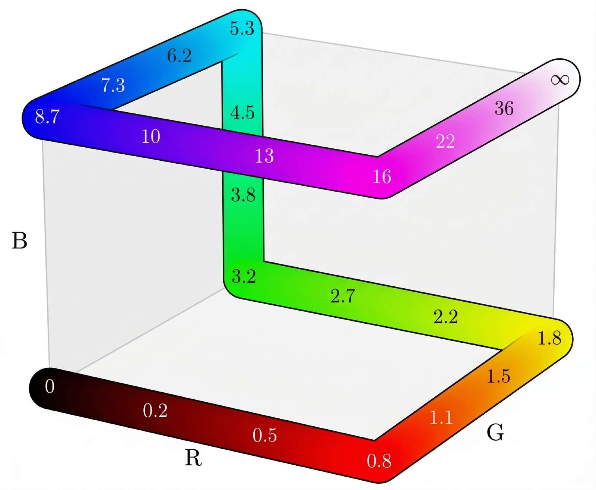
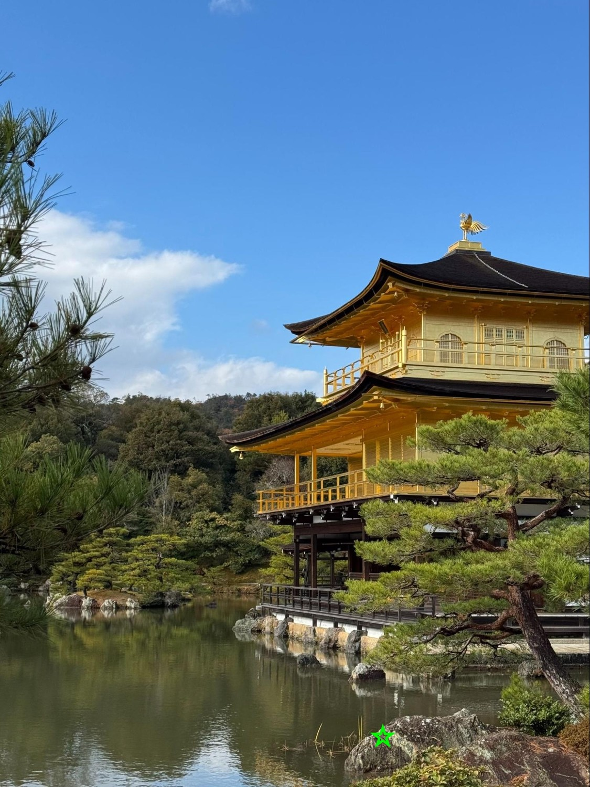
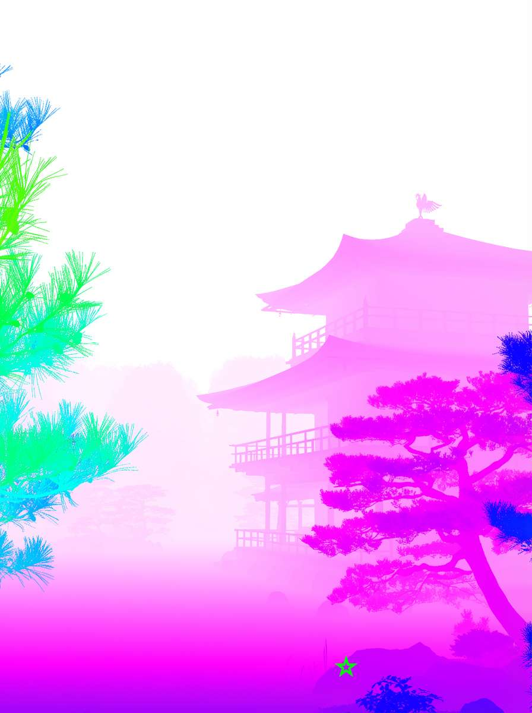
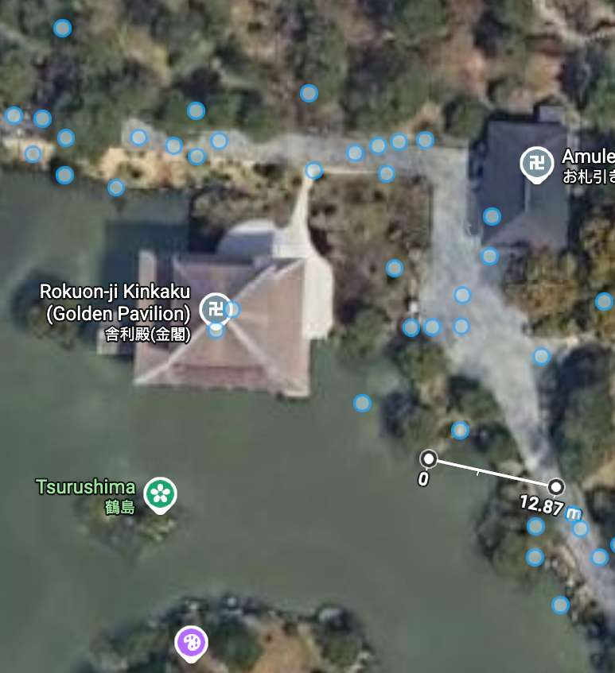
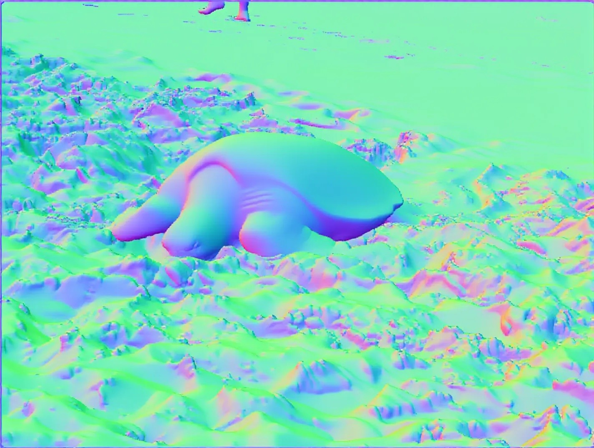
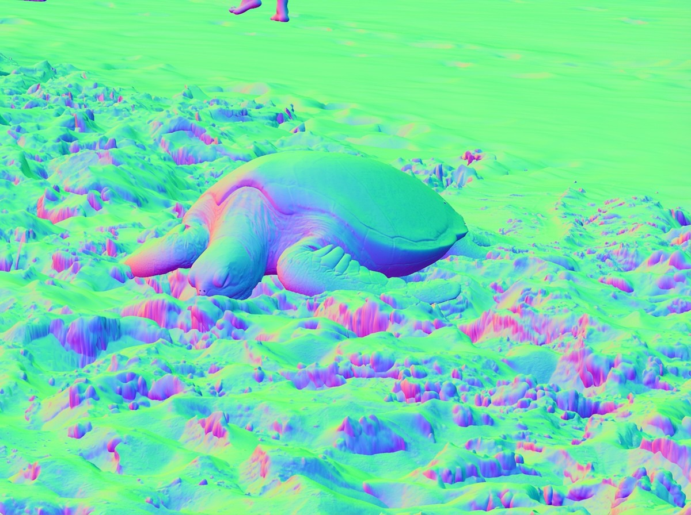
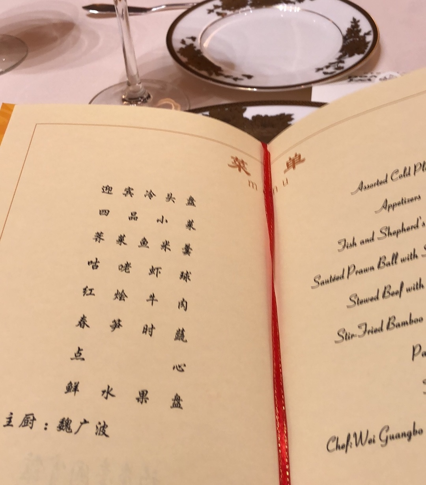
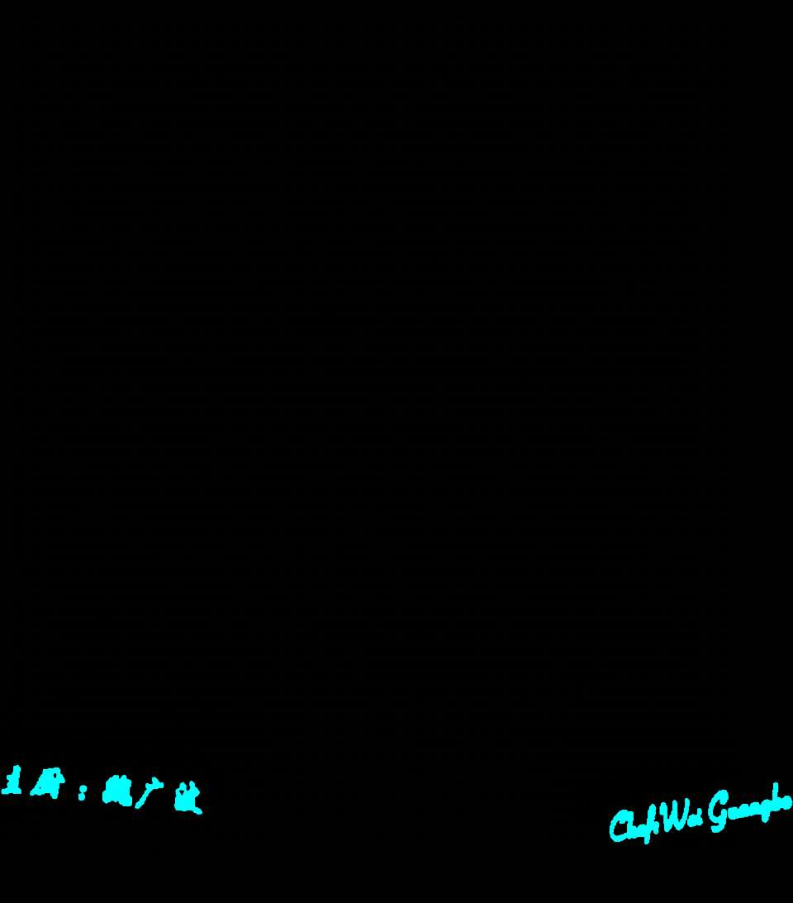

# ImageGenerators-Generalist-Vision — Research Note

## 📇 Academic Context

| Field | Value |
|-|-|
| Title | Image Generators are Generalist Vision Learners |
| Venue | arXiv preprint |
| Year | 2026 |
| Authors | Valentin Gabeur, Shangbang Long, Songyou Peng, Paul Voigtlaender 等 25 人（Google DeepMind；含 Jonathan T. Barron、Saining Xie、Kaiming He、Thomas Funkhouser、Radu Soricut） |
| Official Code | unknown |
| Venue Kind | tech-report |

> 本筆記依據 arXiv 預印本（arXiv 2604.20329）的全文與 LaTeX 原始碼撰寫；正式發表版（若有）內容可能不同。專案頁：vision-banana.github.io。

## First Principles

這篇論文問的是一個老問題的新版本：**會畫，是否就代表會看？** 作者把一個當前最強的影像生成模型 Nano Banana Pro（NBP）當成語言模型式的「base model」，用極少量的視覺任務資料做 instruction-tuning，得到一個叫 Vision Banana 的統一模型。核心主張是：生成式預訓練對電腦視覺，扮演的角色類似 LLM 預訓練對語言——理解能力已經藏在生成模型裡，instruction-tuning 只是把它「解鎖」成可量測的格式。

### 把感知重新表述為圖像生成

方法的關鍵在於**輸出空間的參數化**：所有視覺任務的輸出都被編碼成一張 RGB 圖。作者的原話是 By parameterizing the output space of vision tasks as RGB images，於是 segmentation、depth、surface normal 全部變成「生成一張特定格式的圖」。例如提示模型用純黃色 `<255,255,0>` 畫出 skateboard 的遮罩，就能靠「找出接近該顏色的像素」把 mask 解回來。這樣做有三個好處：單一權重支援多任務、只需教模型「如何把輸出排版成 RGB」故資料量小、以及因為輸出仍是 RGB 圖所以能保留原本的生成能力。

訓練配方本身很輕：作者把視覺任務資料以很低的比例混進 NBP 原本的訓練資料中（Mixing the vision data at a low ratio serves as a lightweight instruction-tuning strategy），而不是像 Marigold、Diception 那類做法去做全參數微調——This strategy distinguishes our work from previous approaches that perform full fine-tuning。作者也強調評測基準的訓練切分完全沒進混合資料（no training data from our evaluation benchmarks is included in the instruction-tuning mixture），以此宣稱結果反映「zero-shot transfer」的泛化。

### 深度估計：把公尺映射到 RGB 立方體

深度是這套「輸出即 RGB」框架最精巧的地方，因為深度是 $[0,\infty)$ 的無界純量，要塞進 $[0,1]^3$ 的有界 RGB。作者先用 Barron 的 power transform 把距離「彎折」（近處給更多顏色解析度，因為近物對機器人等應用更重要），再沿 RGB 立方體的邊做分段線性內插，路徑像 3D Hilbert 曲線第一階：黑→紅→黃→綠→青→藍→洋紅→白。彎折函數為：

$$
f(d, \lambda, c) = 1 - \left(1 - \frac{d}{\lambda c}\right)^{\lambda + 1}
$$

論文固定 $\lambda = -3$、$c = \tfrac{10}{3}$（故 $\lambda c = -10$）。由於 power transform 與 false-color 兩步都可逆，其複合是 metric depth 與 RGB 之間的雙射；推論時把生成的 RGB 投影回最近的邊、再反解內插，就能把圖解回公尺。作者宣稱訓練完全只用模擬引擎產生的合成深度、完全沒用真實深度資料（we use zero real-world depth data）。

### 一個具體的深度前向流程（真實數字）

用論文的「野外實測」把整條管線走一遍最清楚。作者在金閣寺用消費級手機拍了一張照片（下圖左），Vision Banana 生成一張假色深度圖（下圖右）；影像中綠色星號標記處被解回 $13.71$ 公尺，作者用 Google Maps 量到的真實距離是 $12.87$ 公尺，該點 AbsRel 誤差約 $0.065$。我們可以自行代入彎折函數驗證這個顏色：$f(12.87) = 1 - (1 + 12.87/10)^{-2} \approx 0.81$（此為本筆記的推算），落在洋紅接近白的區段——與圖中建物呈洋紅、天空為白的深淺完全一致。注意星號本身是**測量標記**而非該像素的深度色。

作者把「野外 vibe test」的量測閉環也一併附上：下圖是金閣寺（Rokuon-ji Kinkaku）的 Google Maps 衛星視圖，白色量測線標出拍攝點到目標的水平距離為 $12.87$ 公尺，正是上面 AbsRel $\approx 0.065$ 的分母來源。要提醒的是這只是單一點、單一場景的軼事式佐證，不等同於整體幾何精度——真正的量化結論仍以下方主結果表為準。

### 表面法向量：直接對齊 RGB

相較於深度需要精心設計顏色映射，surface normal 天生就對齊 RGB：法向量是 $[-1,1]$ 的單位向量 $(x,y,z)$，直接線性搬到三個色通道即可，論文用右手相機座標（+x 右、+y 上、+z 指向鏡頭外）：

$$
R=\mathrm{trunc}((1-x)/2)\times 255,\quad G=\mathrm{trunc}((1+y)/2)\times 255,\quad B=\mathrm{trunc}((1+z)/2)\times 255
$$

於是「面朝上」是淺綠、「面朝鏡頭」是淺藍、「面朝左」是粉紅——這也解釋了下方比較圖裡沙地大片呈綠色（朝上）、海龜殼呈藍粉漸層的視覺樣貌。

### 實例分割：動態配色 + 分群解碼

實例分割是這套框架最尷尬的一環，因為實例數目事先未知，無法在 prompt 裡預先指定每個顏色。作者的做法是只給目標類別與背景色，讓模型**自行**為每個實例指派不同顏色，再用一套多階段連通元件分群演算法把 mask 解回來，以對抗生成圖固有的顏色漂移與邊界光暈。這套後處理有五個階段：背景初始化（顏色距離背景色小於 $\tau = 14$ 者標為背景）、顏色相似分群（16-連通 floodfill）、雜訊剪除（面積小於影像 $0.02\%$ 者丟棄）、邊界光暈消除（$3\times3$ 二值侵蝕，侵蝕後保留率低於 $0.1$ 者剪除）、空間受限合併（顏色相近且合併後外接框不過度膨脹的分離元件視為同一物件）。此外 SA-Co/Gold 有 168k 個 Image-NP 配對、且大多是「圖中根本沒有該物」的負樣本（The SA-Co/Gold benchmark consists of 168k Image-NP pairs, where a large majority are negative queries），作者不讓 Vision Banana 自己判斷有無，而是外接 Gemini 3.1 Flash-Lite 先做「有/無」分類，只把判為「有」的樣本交給 Vision Banana 畫圖。

### 主要結果

下表整理論文的頭條數字（↑ 越高越好、↓ 越低越好）；理解任務全部宣稱在 zero-shot transfer 設定下取得：

| 任務 / 基準 | 指標 | Vision Banana | 最佳對照 |
|-|-|-|-|
| Referring seg. RefCOCOg UMD | cIoU ↑ | 73.8 | 73.4（SAM3 Agent）|
| Referring seg. ReasonSeg | gIoU ↑ | 79.3（+Gemini 2.5 Pro）| 77.0（SAM3 Agent）|
| Semantic seg. Cityscapes | mIoU ↑ | 69.9 | 65.2（SAM 3）/ 84.2（SegMan，非 zero-shot）|
| Instance seg. SA-Co/Gold | cgF1 ↑ | 47.5（+Gemini 3.1 FL）| 24.6（OWLv2）/ 54.1（SAM 3，非 zero-shot）|
| Metric depth（4 dataset 平均）| δ1 ↑ | 0.929 | 0.918（Depth Anything 3）|
| Metric depth（6 dataset 平均）| δ1 ↑ | 0.882 | 0.823（UniK3D）|
| Surface normal（4 dataset 平均）| mean err ↓ | 18.928 | 19.642（Lotus-2）|
| Text-to-image GenAI-Bench | win rate | 53.5% | 46.5%（NBP）|
| Image editing ImgEdit | win rate | 47.8% | 52.2%（NBP）|

在分割上，Vision Banana 在 Cityscapes 以 mIoU 69.9 勝過 SAM 3（outperforms SAM 3 by $4.7$ points in mIoU），在 RefCOCOg 得 cIoU 73.8、ReasonSeg 得 gIoU 79.3。在深度上，六個基準的平均 δ1 達 0.882（average $\delta_1$ accuracy of 0.882），比 UniK3D 高近 6 點、AbsRel 比 MoGe-2 低約 20%；而頭條的「勝過 Depth Anything 3」是在 DAv3 有報告的那四個資料集上比（on which it was evaluated（$0.929$ v.s. $0.918$））。生成能力方面，作者以人評 win rates of 53.5\% and 47.8\% 宣稱 Vision Banana 大致保住了 NBP 的生成水準。

下圖用一個海龜例子比較 Vision Banana 與前 SOTA 專家 Lotus-2 的法向量輸出：兩者都抓到海龜殼的整體形狀，但 Vision Banana 在沙粒與殼面紋理上呈現明顯更高頻的細節。這是論文的定性論據，但也正是這類「挑過的展示圖」最容易以視覺印象取代量化證據之處——量化上 Vision Banana 只在室內平均領先（mean error $15.549$ 對 Lotus-2 的 $16.558$），到了戶外 VKitti 反而略差（$29.063$ 對 $28.894$）。換言之高頻細節的視覺優勢並沒有一致地轉化為戶外的角度精度。

### 指代分割：把 OCR 與跨語言理解當成分割提示

referring segmentation 這條線最能展示底模「繼承來」的能力。下面這組定性例子裡，輸入是一張中英雙語菜單照片（底部落款為「主廚：魏廣波 / Chef Wei Guangbo」），提示要求模型「把中英文的廚師名字塗成青色、其餘塗黑」。Vision Banana 的輸出正確只在兩處落款文字上塗了青色遮罩，其餘留黑——它得先讀懂 prompt 的語意、在圖中做 OCR 定位、再跨中英兩種文字對應到「廚師名字」這個指代，最後把答案排版成一張 RGB 遮罩圖。這說明分割在此框架下不是像素分類，而是「理解 + 生成」的合成任務。

要克制地看待這類展示：它是作者挑選的成功案例，證明「能做到」而非「多穩地做到」——同一份 prompt 換一張排版更雜的菜單是否仍成立，論文沒有給出量化的 OCR-分割成功率。它的說服力在於揭示機制（底模的 OCR/語言能力被 instruction-tuning 接了出來），而不在於統計上的可靠性。

## 🧪 Critical Assessment

### 問題是真的，但「解鎖」的敘事把功勞算給了誰

「生成即理解、以圖像生成作為視覺任務的統一介面」是一個貨真價實且重要的方向。但論文把 SOTA 成績歸因於「生成式預訓練已經學到通用視覺表徵、只需輕量解鎖」，這個因果歸屬是全篇最弱的一環。真正做重活的是一個**閉源、未公開**的前沿模型 Nano Banana Pro（NBP）——它的訓練資料、規模、算力全部未揭露。因此讀者無法排除：這些 SOTA 成績有多少來自「生成式預訓練」這個範式、有多少只是來自「這是目前最強的商用生成模型」。沒有任何模型是開放的，這篇的可重現性實質為零。

### zero-shot 標籤只擋住了評測切分，擋不住不透明的底模

論文的「zero-shot transfer」定義沿用 SAM/CLIP，僅指「沒有用評測基準的訓練切分」。但 NBP 的預訓練語料完全不透明，我們無從得知它是否看過與 Cityscapes、NYU、KITTI 語意/幾何高度相關的網路影像。當底模資料未公開，「zero-shot」只能保證沒有直接洩題，卻無法保證沒有分佈上的間接曝光——這個標籤在此處的保證強度，遠低於它在開源底模上的保證強度。

### 頭條數字是被挑選過的子集與外掛管線

有兩處明顯的 benchmark 選擇問題。其一，深度的頭條「勝過 Depth Anything 3（0.929 vs 0.918）」只在 DAv3 剛好有報告的四個資料集上成立；一旦看完整六資料集，平均掉到 0.882，而在戶外駕駛場景 nuScenes 上 Vision Banana 只有 δ1 = 0.643（表列 0.840 & 0.820 & 0.643 中最右者），大幅落後 UniK3D 的 0.840 與 MoGe-2 的 0.820。也就是說，這套方法的幾何強項集中在室內/近景，戶外遠景是明顯短板，卻沒有進入頭條敘事。其二，多個理解成績並非「單一統一模型」獨力取得：ReasonSeg 的 79.3 要靠 Gemini 2.5 Pro 先改寫查詢（utilize Gemini 2.5 Pro to translate the reasoning query），SA-Co 的 47.5 要靠 Gemini 3.1 Flash-Lite 做有無分類，RefCOCOg 的對照組本身就是 SAM3+Gemini 的「SAM3 Agent」。把外掛 LLM 的貢獻算進「image generation as a universal interface」的純度，是有水分的。

### 基準與消融的充分性不足

作者自己也承認在 SA-Co/Gold 上仍輸給 SAM 3 專家（still lags behind the SAM 3 specialist）：Vision Banana 外接 Gemini 3.1 Flash-Lite 後三項指標為 cgF1 $47.5$ / IL_MCC $0.84$ / pmF1 $56.0$，而非 zero-shot 的 SAM 3 是 $54.1$ / $0.82$ / $66.1$——只有 IL_MCC 這一項略勝。而 Cityscapes 上封閉集專家 SegMan 的 84.2 也遠在 69.9 之上——「勝過 SAM 3」成立的範圍其實限定在 open-vocabulary / zero-shot 這一格。更關鍵的是正文幾乎沒有消融：沒有混合比例的掃描、沒有「拿掉外掛 Gemini 會掉多少」的拆解、沒有把生成式底模換成同級判別式底模的對照。生成保真度也只用人評 win rate 佐證，53.5% 只是略高於五五、而影像編輯的 47.8% 其實低於基準線（win rates of 53.5\% and 47.8\%），代表編輯能力有輕微退化——這點作者誠實呈現，但也說明「完全不犧牲生成能力」是被溫和放寬的。

### 新意主要在「把舊介面接到最強底模」，且部署成本是硬傷

作者明白承認「輸出即 RGB」不是原創（we are not the first to encode vision outputs as RGB，並引用 Marigold、Diception、InstructCV、Unified-IO 等）。真正的新意因此不在方法本身，而在於「把這個簡單介面接到一個夠強的生成底模、加上一套讓輸出可解碼的 instruction-tuning 與分群後處理，就足以在多個 open-vocab 基準上壓過專家」的實證。這是有價值的觀察，但它更像一份頂尖模型的能力報告，而非一個可被社群複用的方法。最後，作者也承認跑一次影像生成器的算力遠高於輕量專家模型（incurs a significantly higher computational overhead than running lightweight specialist models），在延遲/成本敏感的真實部署（機器人、自駕）裡，這與其戶外深度的弱點疊加，讓「取代專家」的實用性打上問號。至於論文結尾把方向拔高到「Artificial General Intelligence from Vision」，屬於缺乏量化支撐的願景式宣稱，宜當作 motivation 而非結論。

## 一分鐘版

- **統一介面**：所有視覺任務的預測都被重寫成「畫出一張特定顏色的彩圖」。想找滑板在哪，就叫模型把滑板塗成純黃色，再把黃色像素撈出來當遮罩。
- **深度映射**：現實中無界的距離，被一條彎折公式映射到彩色立方體的各條邊上。看到模型在某處畫洋紅色，反推公式就解得該點距相機約 13.71 公尺。
- **跨界成績**：模型能在自己非專精的視覺理解任務上壓過領域專家，例如 Cityscapes 語意分割以 mIoU 69.9 贏過專職的 SAM 3。
- **黑箱疑慮**：好成績有多少該歸功於「生成式預訓練」其實難以驗證，因為做重活的底模完全閉源、訓練資料不透明，整篇的可重現性實質為零。
- **分數水分**：部分亮眼分數其實靠外掛語言模型才拿到——SA-Co 的 47.5 是先接了 Gemini 3.1 Flash-Lite 幫忙判斷圖中有沒有目標物。
- **部署硬傷**：拿龐大的生成式模型兼職做視覺任務，算力開銷遠高於輕量專家，在對延遲與成本敏感的真實部署裡實用性存疑。

## 🔗 Related notes

- [Segment Anything](../Segment_Anything/)
- [DiT](../DiT/)
- [Scaling Properties of Latent Diffusion Models](../scaling_properties_ldm/)
