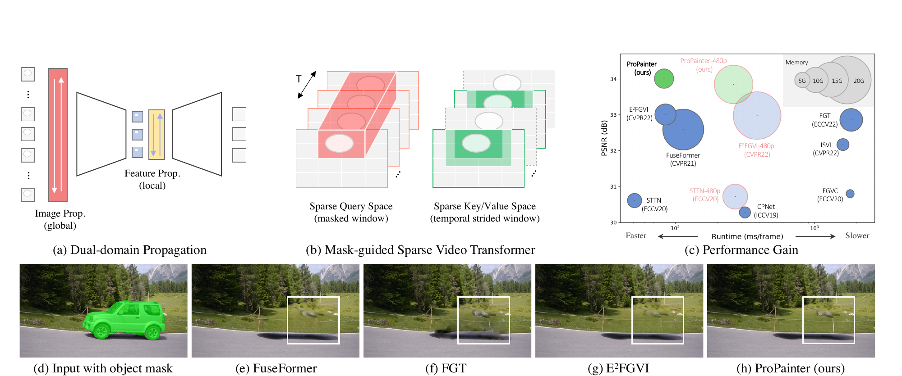
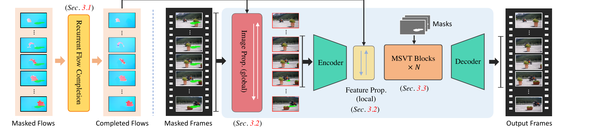
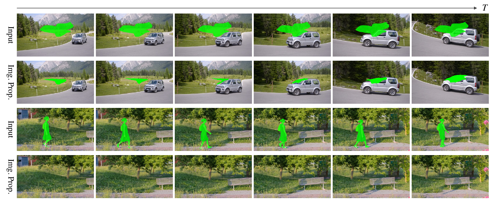
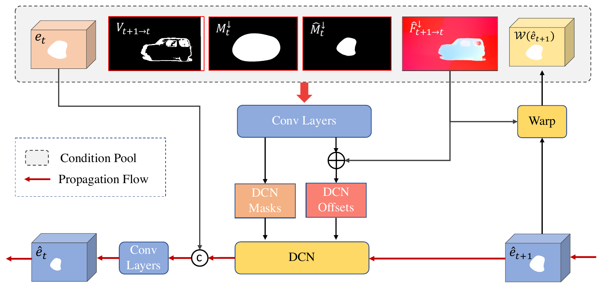
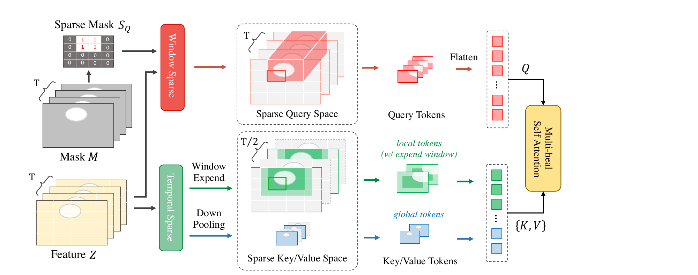
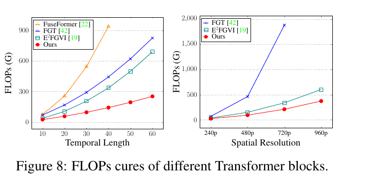
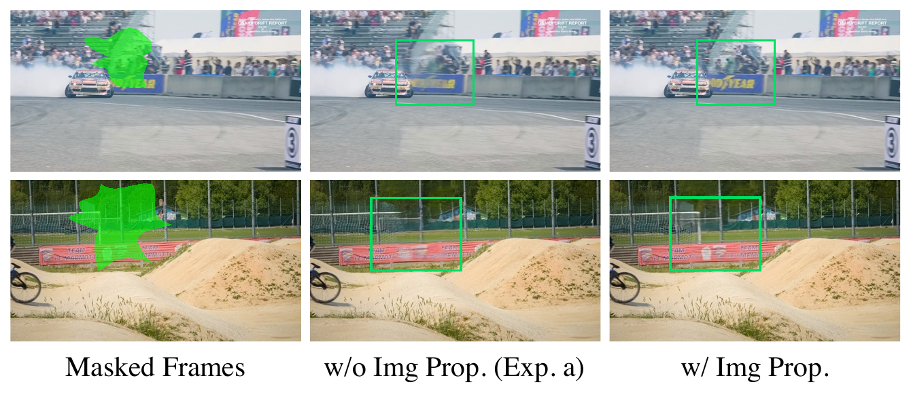
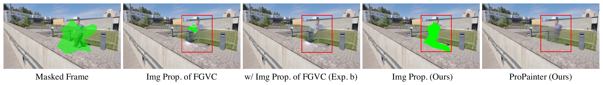
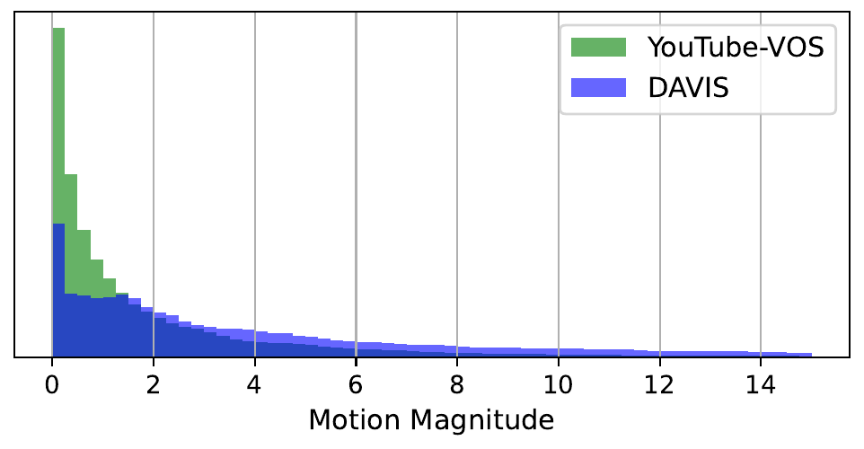
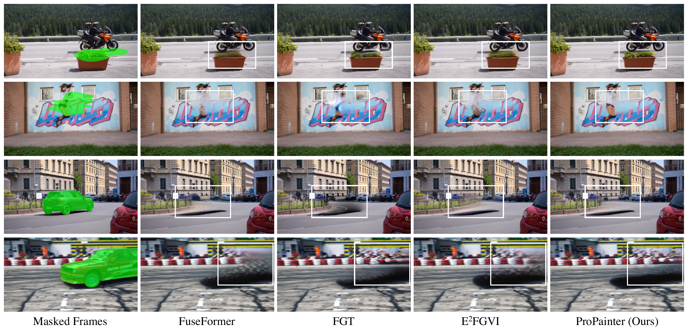

# ProPainter — Research Note
> [English](./README.md) | **繁體中文**

## 📇 Academic Context

| Field | Value |
|-|-|
| Title | ProPainter: Improving Propagation and Transformer for Video Inpainting |
| Venue | ICCV 2023 |
| Year | 2023 |
| Authors | Shangchen Zhou, Chongyi Li, Kelvin C.K. Chan, Chen Change Loy (S-Lab, Nanyang Technological University) |
| Official Code | https://github.com/sczhou/ProPainter |
| Venue Kind | paper |

## Introduction

影片修補（video inpainting, VI）要在一段影片被遮住或缺失的區域填入內容，並同時維持空間上的合理與時間上的連貫。它的實際用途很具體：移除畫面中的物體、去除浮水印與 logo、補回破損畫面。難點在於「跨越相距很遠的影格建立正確的對應關係」——同一塊被遮住的背景可能只在幾十格之外的某一格露出來過一次，要把它搬回來就必須有可靠的長距離傳遞。

在 ProPainter 之前，主流做法有兩條路線，各有明確的痛點。第一條是「影像域傳遞」（image propagation）：先用完成後的光流把已知像素在 RGB 影像上雙向搬移填洞，再接一個獨立的修補網路補剩下的洞；問題是這個兩段式流程彼此獨立，光流一旦不準就會留下貼歪的紋理與破綻，而且後段網路無從修正前段的錯誤。第二條是「特徵域傳遞」與影片 Transformer：E$^2$FGVI 把光流完成與內容幻補放進端到端框架，但它在降採樣後的特徵域上做扭曲，空間精度受限而容易糊；更關鍵的是特徵傳遞與時空注意力都受記憶體與計算量限制，只能在很短的時間範圍內運作，拿不到遠處影格的紋理。

ProPainter 的高階解法是把兩條路線的長處合併成「雙域傳遞」（dual-domain propagation），再配一個為 VI 量身打造的「遮罩引導稀疏影片 Transformer」（mask-guided sparse video Transformer, MSVT）。整體分三個元件：先用一個高效的循環光流完成網路（recurrent flow completion, RFC）補齊破損光流；接著在影像域做全域傳遞、在特徵域做局部傳遞；最後用多個 MSVT 區塊精修並解碼出完整影片。下圖的 (a)(b) 是兩個核心設計、(c) 是 PSNR 對執行時間的散佈圖（泡泡大小代表記憶體用量，ProPainter 位在左上角，又快、又準、又省記憶體），(d–h) 則是移除汽車的定性比較——(f) FGT 在方框內留下黑霧與扭曲，(h) ProPainter 填得乾淨。

論文用具體的實驗來檢驗這個解法是否成立：在 YouTube-VOS（測試集 508 段）與 DAVIS（90 段中取 50 段）兩個資料集上，以固定的 stationary mask 計算 PSNR、SSIM、VFID 與時間一致性指標 $E_{warp}$，並和九個既有方法（DFVI、CPNet、FGVC、STTN、TSAM、FuseFormer、ISVI、FGT、E$^2$FGVI）比較準確度與效率（FLOPs、每格秒數）。所有影片統一縮到 $432\times 240$ 訓練與評估。以下先把機制拆開重建，再回頭質疑證據是否撐得起結論。

## First Principles

### 從一段被遮住的影片到完整輸出：資料流

給定遮罩影片 $X=\{X_t\in\mathbb{R}^{H\times W\times 3}\}_{t=1}^{T}$ 與對應二值遮罩 $M=\{M_t\in\mathbb{R}^{H\times W\times 1}\}_{t=1}^{T}$（值為 1 代表要填的區域），先用 RAFT 抽出前向與後向光流 $F^f, F^b$。整條管線的順序是固定的：RFC 補光流 → 影像域全域傳遞 → 特徵域局部傳遞 → 多個 MSVT 區塊精修 → 解碼器重建輸出 $\hat{Y}$。下圖是官方的總覽，可以看到「Masked Flows→Recurrent Flow Completion→Completed Flows」這一支先算好光流，再餵給右側「Image Prop.（global）→Encoder→Feature Prop.（local）→MSVT Blocks×N→Decoder」的修補主幹。

### 循環光流完成（RFC）：先把光流補好，而且要快

論文的立場是：直接補 RGB 內容很難，補光流相對簡單，而且用補好的光流去搬像素能更好地維持時間連貫，因此需要一個「獨立訓練」的光流完成模組——若把光流完成和修補損失綁在一起學，會得到次佳、較不準的光流。RFC 先把光流 $F_t$ 編碼成降採樣比例為 8 的特徵 $f_t$，再用以 deformable convolution（DCN）為基礎的可變形對齊，從鄰近影格雙向傳遞資訊來補洞。以後向傳遞為例，對齊可寫成

$$
\hat{f_t} = \mathcal{R}\big(\mathcal{D}(\hat{f}_{t+1}; o_{t\rightarrow t+1}, m_{t\rightarrow t+1}), f_t\big),
$$

其中 $\mathcal{D}$ 是可變形卷積、$\mathcal{R}$ 是融合對齊特徵與當前特徵的卷積。它用循環網路取代過去的滑動視窗，避免在重疊影格上重複推論。效果是既快又準：光流端點誤差（EPE）在 YouTube-VOS 為 0.020、DAVIS 為 0.051，與最佳方法相當，但每格只要 0.005 秒，論文宣稱比 SOTA 快約 40 倍（約 192 fps，單張 V100）。

### 影像域全域傳遞：不學習、可靠性檢查、在 GPU 上跑

影像域傳遞刻意不含任何可學習運算，只做「以光流扭曲＋可靠性檢查」。關鍵是用前後向一致性誤差判斷光流是否可信：

$$
\mathcal{E}_{t\rightarrow t+1}(p) = \Big\| \hat{F}_{t\rightarrow t+1}(p) + \hat{F}_{t+1\rightarrow t}\big(p+\hat{F}_{t\rightarrow t+1}(p)\big) \Big\|_2^2 ,
$$

只有一致性誤差夠小（$C_1:\mathcal{E}<\epsilon$，門檻 $\epsilon$ 設為 5）、當前影格該點確實被遮住（$C_2:M_t(p)=1$）、且來源鄰格對應點沒被遮住（$C_3$）時，才視為可靠傳遞區 $A_r$。傳遞本身是

$$
\hat{X}_t = \mathcal{W}(X_{t+1}, \hat{F}_{t\rightarrow t+1}) * A_r + X_t * (1-A_r),
$$

搬完立刻把遮罩更新成 $\hat{M}_t = M_t - A_r$，讓後續影格能接力繼續填。因為只在通過三條檢查的位置才搬像素，錯誤光流造成的貼歪會被擋下來，而不是硬搬進畫面。這一步在 GPU 上做，取代了過去 FGVC 等方法在 CPU 上索引光流軌跡、Poisson blending 的耗時流程；更重要的是它和整個網路一起訓練，後段模組因此能修正它殘留的誤差。

這一步的實際威力可以直接看出來：下圖上兩列是一段汽車移除、下兩列是行人移除，第一與第三列是輸入（綠色為遮罩），第二與第四列是「只做完影像域傳遞」的結果——大部分甚至整塊遮罩已經被填滿，殘留的綠色區域大幅縮小。也就是說，後面的模組多半只需要精修與補齊少量殘洞，而不是從零學整個修補。

### 特徵域局部傳遞：用光流當基準、額外餵入遮罩條件

影像域傳遞填掉大塊區域後，用一個與 FuseFormer/E$^2$FGVI 相同結構的編碼器把局部序列抽成 $\frac{H}{4}\times\frac{W}{4}\times C$ 的特徵，再做「光流引導的可變形對齊」。它與 RFC 那個直接學 DCN 偏移的版本不同：這裡把完成後的光流當成 DCN 的基準偏移，只學相對光流的殘差偏移。ProPainter 相較 E$^2$FGVI 的差異在於餵入更豐富的條件——除了當前特徵、扭曲後的傳遞特徵、降採樣光流之外，還額外加入一致性檢查得到的光流有效圖 $V$、原始遮罩 $M^{\downarrow}$ 與影像傳遞後的更新遮罩 $\hat{M}^{\downarrow}$。有了這些條件，這一步能把注意力集中在「光流無效、且前面影像傳遞不可靠」的真正難填區域。下圖是這個模組的內部結構：頂端灰色虛線框的 condition pool 併接了當前特徵 $e_t$、光流有效圖 $V_{t+1\rightarrow t}$、原始降採樣遮罩 $M^{\downarrow}_t$、影像傳遞後的更新遮罩 $\hat{M}^{\downarrow}_t$、降採樣補齊光流 $\hat{F}^{\downarrow}_{t+1\rightarrow t}$ 與扭曲的鄰格特徵 $\mathcal{W}(\hat{e}_{t+1})$；卷積層據此吐出 DCN 的調變遮罩與殘差偏移，殘差偏移在圖中 $\oplus$ 處與光流基準偏移相加成為最終偏移，對鄰格特徵 $\hat{e}_{t+1}$ 做可變形對齊，再與當前特徵併接、經卷積融合成 $\hat{e}_t$。

### 遮罩引導稀疏影片 Transformer（MSVT）：兩個方向各自剪枝

古典時空 Transformer 的成本隨 token 數平方成長，論文指出 FuseFormer 與 FGT 在 32G GPU 上甚至無法處理 480p 影片。ProPainter 的觀察是：遮罩通常只覆蓋一小塊局部區域（DAVIS 上物體區域平均只佔 13.6%），而相鄰影格的紋理高度冗餘。於是它在 query 與 key/value 兩個空間分別剪枝。特徵先經 soft split 得到 patch embedding $Z\in\mathbb{R}^{T_l\times M\times N\times C_z}$，再切成 $m\times n$ 個不重疊視窗（實驗用 $5\times 9$ 的小視窗）。

query 端只對「碰到遮罩」的視窗做注意力。把遮罩降採樣到視窗網格 $M^{\downarrow}$，沿時間維相加後夾到 1，得到稀疏遮罩

$$
S_Q = \mathrm{Clip}\Big(\sum\nolimits_{t=1}^{T_l} M^{\downarrow}_t,\ 1\Big),
$$

若某視窗在過去所有影格都沒碰過遮罩，$S_Q(i,j)=0$，該視窗的時空注意力可以整個跳過。key/value 端則利用相鄰影格的冗餘：用時間步幅 2 交替取樣——奇數區塊只讓奇數影格、偶數區塊只讓偶數影格參與，把 key/value 空間直接砍半；另外再用 window expand 與 pooling 出的 global token 補回較大的空間關聯範圍。下圖清楚呈現這兩條路：上排的 $S_Q$（一個由 0/1 構成的視窗網格）決定哪些 query 視窗保留，下排的 temporal sparse 把影格數從 $T$ 砍到 $T/2$，再加上 local（expand window）與 global 兩種 key/value token。

### 一次具體的前向與頭條數字

把上面串起來走一遍：一段 DAVIS 物體移除影片縮到 $432\times 240$，RAFT（推論時只跑 5 個迭代）算出雙向光流；RFC 在降採樣 8 倍的特徵上循環補流，每格 0.005 秒；影像域傳遞以 $\epsilon=5$ 的一致性檢查把大部分遮罩填掉並更新遮罩；編碼器把畫面降到 $108\times 60$ 特徵做光流引導對齊；8 個 MSVT 區塊在 $5\times 9$ 視窗上、以 $S_Q$ 跳過未遮視窗、key/value 減半的方式精修；解碼器輸出。因為夠省，推論用的時間長度可以拉到 20 格，訓練時局部序列長度為 10。

準確度與效率的頭條結果如下（節錄自論文 Table 1，10 格的 FLOPs 與每格秒數）：

| Model | YT-VOS PSNR↑ | DAVIS PSNR↑ | DAVIS VFID↓ | DAVIS E*warp↓ | FLOPs | Runtime |
|-|-|-|-|-|-|-|
| FuseFormer | 33.32 | 32.59 | 0.137 | 1.349 | 1025G | 0.114 |
| E$^2$FGVI | 33.71 | 33.01 | 0.116 | 1.289 | 986G | 0.085 |
| ProPainter (ours) | 34.43 | 34.47 | 0.098 | 1.187 | 808G | 0.083 |

ProPainter 在所有指標都領先，同時 FLOPs（808G）比第二名 E$^2$FGVI（986G）更低。稀疏 Transformer 的省算優勢在序列拉長、解析度變大時更明顯：同一個 Transformer 區塊在時間長度 10 時的 FLOPs 是 25.77G（E$^2$FGVI 37.65G、FuseFormer 75.1G），到時間長度 60 時是 253G（E$^2$FGVI 690G、FGT 824G）；用 1/6 的缺失比例計算。

| 時間長度 | FuseFormer | FGT | E$^2$FGVI | ProPainter |
|-|-|-|-|-|
| 10 | 75.1 | 70 | 37.65 | 25.77 |
| 30 | 544 | 292 | 206 | 97 |
| 60 | — | 824 | 690 | 253 |

省算優勢在解析度變大時更誇張。下圖左邊是隨時間長度的 FLOPs 曲線（FuseFormer 在長度 40 就衝到 937G 且畫不出更長的點），右邊是隨空間解析度的曲線：FGT 在 720p 就爆到 1880G，而 ProPainter 到 960p 也只要 374G（E$^2$FGVI 為 602G）。這張圖是 MSVT 能撐到高解析度的主要量化證據，光看正文的時間長度表格會漏掉解析度這一軸。

### 消融：哪個元件真正在出力

論文的消融（Table 2，PSNR/SSIM）顯示：拿掉影像域傳遞會從 34.15 掉到 33.05，是最大的單一跌幅；把影像域傳遞換成 FGVC 的版本（不重訓）反而更差（32.91），因為 FGVC 容易被錯誤光流帶偏、造成後段無法修正的紋理扭曲。特徵域傳遞的貢獻較小：拿掉降到 33.17、換成 E$^2$FGVI 版本為 33.94。稀疏 Transformer 幾乎不損失品質——完整 token 版本是 34.18、稀疏版本 34.15，論文據此主張「剪枝只去掉冗餘與不必要的 token，不傷效能」。

「拿掉影像域傳遞跌 1.10 dB」的原因在定性圖上一眼可見。下圖只有兩種設定：中欄是拿掉影像傳遞（Exp. a）、只靠特徵域對齊與 Transformer 修補，右欄是完整模型。上排賽車場景綠框裡的「GOODYEAR」字樣、下排越野單車場景綠框裡的鐵絲網，在中欄都被糊成一團或扭曲，右欄則因為直接在原始像素上搬運而把文字邊緣與網格清楚還原——特徵域是在降採樣特徵上運作，補不回這種高頻細節。

而「把影像傳遞換成 FGVC 反而更差（32.91）」則來自可靠性檢查的有無。下圖第 2 欄是 FGVC 的影像傳遞中間結果：它沒有前後向一致性把關，被錯誤光流帶著把變形的內容硬搬進遮罩，第 3 欄的 FGVC 最終輸出因此在紅框內留下後段修不掉的重影。ProPainter 的做法相反——第 4 欄是它的影像傳遞中間結果，一致性檢查主動拒絕不可靠的搬移、把不確定的區域留成綠色空洞，第 5 欄才在這個乾淨基礎上補齊。這正是前面那個前後向一致性誤差門檻（$\mathcal{E}<\epsilon$）存在的理由。

### 官方實作對照：程式碼坐實了什麼、又多說了什麼

官方 repo 的推論入口 `inference_propainter.py` 的階段順序與論文一致：先用 RAFT 分塊抽流、循環網路補流、影像域傳遞、特徵域傳遞加 Transformer、最後融合輸出，過程載入 raft-things.pth、recurrent_flow_completion.pth、ProPainter.pth 三個權重。程式碼也逐一坐實了論文的關鍵設定：Transformer 為 8 個區塊（depths = 8）、視窗大小為 5×9（window_size = (5, 9)）、影像域傳遞不含可學習參數（learnable=False）而特徵域傳遞可學習，key/value 的時間步幅為 2（t_dilation=2）。

不過程式碼也暴露了兩處論文沒明講、卻對重現很關鍵的細節。其一，論文所稱的長影片推論，在釋出版是靠 `--subvideo_length`（子片段長度，預設 80）把影片切成子片段逐塊處理，官方描述它「把 GPU 記憶體成本與影片長度解耦」。官方 README 把 `--subvideo_length` 與 `--fp16` 都列為可調的記憶體選項，而不是高解析度的硬性前提：以 1280×720 為例，預設的 80 格子片段在 fp32 下會 OOM、改開 fp16 約需 25G，但把子片段長度縮到 50 格時 fp32 就只要 28G、fp16 19G；720×480 則不論 50 或 80 格、fp32 或 fp16 都落在 13G 以內。換句話說，較長的子片段換得較少的接縫、較高的記憶體，`--fp16` 再進一步壓低記憶體，兩者都是取捨旋鈕。其二，釋出版的 RAFT 迭代預設是 20（`--raft_iter` 預設 20），而論文量測效率時特別聲明只跑 5 個迭代；要重現論文的每格秒數，必須把它調回 5。

## 🧪 Critical Assessment

### 問題是真的，但評測解析度與論文最在意的用途對不齊

影片修補與物體移除是有真實需求的問題，這點無庸置疑。但頭條比較全部在 $432\times 240$ 這種很低的解析度上完成，而真正的應用（去浮水印、移除物體）幾乎都發生在 720p 以上。論文只在附錄用 480p 補了一張表（實際尺寸 $864\times 480$），而且該表只剩 STTN 與 E$^2$FGVI 兩個對手——因為 TSAM、FuseFormer、FGT 在 32G GPU 上已經記憶體爆掉或太慢。在這個只剩兩個對手的表上，ProPainter 的 PSNR 是 33.81、E$^2$FGVI 是 32.98，每格 0.249 秒對 0.332 秒，確實仍領先；但這正好說明問題——換句話說，最能凸顯 ProPainter 效率主張的高解析度場景，恰恰是對手最少、最難公平比較的地方；頭條的「大幅領先」是在低解析度、對手齊全的設定下取得的。

### 頭條數字自身就有一處對不上

摘要與 Table 1 指向 DAVIS 上約 1.46 dB 的 PSNR 領先（$34.47-33.01=1.46$），但正文 Comparisons 段落卻寫「在 DAVIS 上超越 SOTA 方法 1.14 dB」。這兩個數字不一致，且 1.14 與表格算不出來。這類內部不一致不影響結論方向，卻提醒讀者：論文對數字的校對並不嚴謹，引用時應以表格與摘要一致的 1.46 dB 為準，而非正文那句 1.14 dB。

### 增益高度依賴「畫面有足夠運動」

雙域傳遞的整個價值建立在「有可靠光流可搬」之上。論文自己在附錄坦承：DAVIS 的增益明顯大於 YouTube-VOS，原因是 YouTube-VOS 有許多幾乎靜止、沒有運動的場景，限制了傳遞模組的效果，並附上兩資料集的運動幅度分布佐證。這其實是一個誠實但不小的限制：對近乎靜止的鏡頭，被遮區域從未在別格露出，傳遞無從施力，ProPainter 相對 Transformer-only 方法的優勢會收斂。YouTube-VOS 上僅 0.72 dB 的領先（$34.43-33.71$）正是這個效應的量化。下面這張附錄的運動幅度分布直方圖把這個限制講得很直白：綠色的 YouTube-VOS 幾乎全擠在運動幅度小於 1 像素的尖峰，代表大量近乎靜止的鏡頭；藍色的 DAVIS 則一路平緩延伸到 14 像素以上。被遮住的背景要能被搬回來，前提是它曾在別格因運動而露出——YouTube-VOS 這種靜止分布正好讓雙域傳遞無從施力。

### 稀疏假設在大遮罩與剪接處會鬆動

效率主張的兩個前提都是資料相依的。稀疏 query 靠「遮罩只佔 13.6%」，但這是 DAVIS 物體移除的數字；面對大面積浮水印、字幕條或佔畫面很大的物體，$S_Q$ 幾乎全為 1，query 端的節省會蒸發（論文的 FLOPs 曲線也刻意用 1/6 的缺失比例來算）。稀疏 key/value 用時間步幅 2 交替，隱含「相鄰影格高度冗餘」；一旦遇到快速運動或鏡頭剪接，被跳過的那半數影格可能正好帶有需要的內容，而論文沒有在含剪接的長鏡頭上測試這個假設。此外「稀疏不傷效能」的說法其實有 0.03 dB（34.18→34.15）與 0.0001 SSIM 的可測小幅下降，只是幅度很小。

### 新穎性偏向系統整合，缺少對「移除」用途的量化與失敗案例

論文自我定位為「系統性研究」，這是誠實的：光流引導可變形對齊來自 BasicVSR++、soft split 來自 FuseFormer、global token 與 window 化來自 FGT/E$^2$FGVI、一致性檢查來自 DFVI/FGVC。真正新的部分是兩點——可訓練且帶可靠性檢查的 GPU 影像域傳遞，以及遮罩引導的稀疏 query＋時間步幅 KV。這是紮實的工程整合，但把它當成方法論突破會高估其新意。更實際的缺口是：所有量化指標都建立在「隨機 stationary mask 的重建」這個代理任務上（有 ground truth 可算 PSNR），而使用者真正在意的「物體移除」只有定性圖、沒有任何量化或使用者研究，也沒有系統化的失敗案例分析（例如光流嚴重出錯時的崩壞長相）。因此「在 benchmark 上全面領先」不應被讀成「在真實物體移除上普遍最佳」。

論文對「移除」用途唯一的證據就是下面這張定性圖（前兩列是影片補全、後兩列是物體移除）。ProPainter（最右欄）確實把 FuseFormer 與 FGT 在白框內留下的大片黑霧與雜訊清乾淨，重建出較連續的路面與賽道圍欄；但仔細看第 3 列——被移除的是那台綠色汽車，車體雖然消失，地面上原本那道投射陰影卻在包含 ProPainter 在內的所有方法輸出裡都還留著。這恰好戳中前面說的代理任務問題：評測遮罩只框住物體本體、不含它的陰影，於是「移除」在視覺上並不完整，而這種缺口不會被 PSNR 這類重建指標抓到。

## 一分鐘版

- 核心難題不是「無中生有」，而是跨越相距很遠的影格，把曾經露出來過的乾淨背景搬回被遮住的位置。只看鄰近幾格用猜的（例如 FGT）會在汽車移除的方框裡留下黑霧與扭曲，得靠可靠的長距離傳遞才填得乾淨。
- 影像域傳遞是在未降採樣的原始影像上、只用前後向一致的光流把鄰格像素直接搬去填洞。汽車與行人移除中大面積遮罩單靠這步就幾乎填滿；消融裡拿掉它，PSNR 從 34.15 掉到 33.05，是最大的單一跌幅。
- 稀疏 Transformer 在空間上只算「碰到遮罩」的視窗，在時間上把 key/value 的影格以步幅 2 減半。處理 60 格長的影片時，單個 Transformer 區塊的計算量從 FGT 的 824G、E$^2$FGVI 的 690G 壓到 253G。
- 頭條戰果是品質與效率同時贏：DAVIS 上 PSNR 34.47 dB，10 格 FLOPs 只要 808G、每格 0.083 秒，比居次的 E$^2$FGVI 又準又省。
- 最關鍵的破綻是增益高度依賴鏡頭有運動：在近乎靜止的 YouTube-VOS 上領先只剩 0.72 dB；而且所有客觀分數都建立在隨機靜止遮罩的重建代理任務上，真正的物體移除完全沒有量化評測或使用者研究。
- 實作上還有落差：官方程式碼的 RAFT 迭代預設是 20 次而非測速時聲明的 5 次；記憶體則是可調的取捨——以 1280×720 為例，預設的 80 格子片段在 fp32 下會 OOM、開 fp16 約 25G，把子片段縮到 50 格則 fp32 只要 28G，`--subvideo_length` 與 `--fp16` 都是旋鈕而非硬性前提。

## 🔗 Related notes

- [DiffuEraser](../DiffuEraser/) — 直接以 ProPainter 為前導模型（prior），並主張在大遮罩時改用擴散模型補其生成力不足的後續工作。
