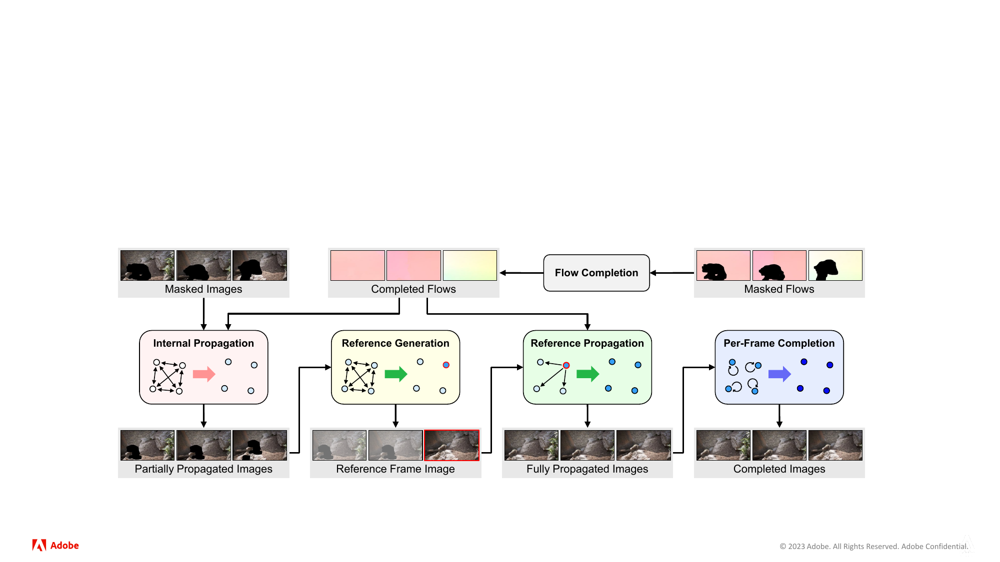
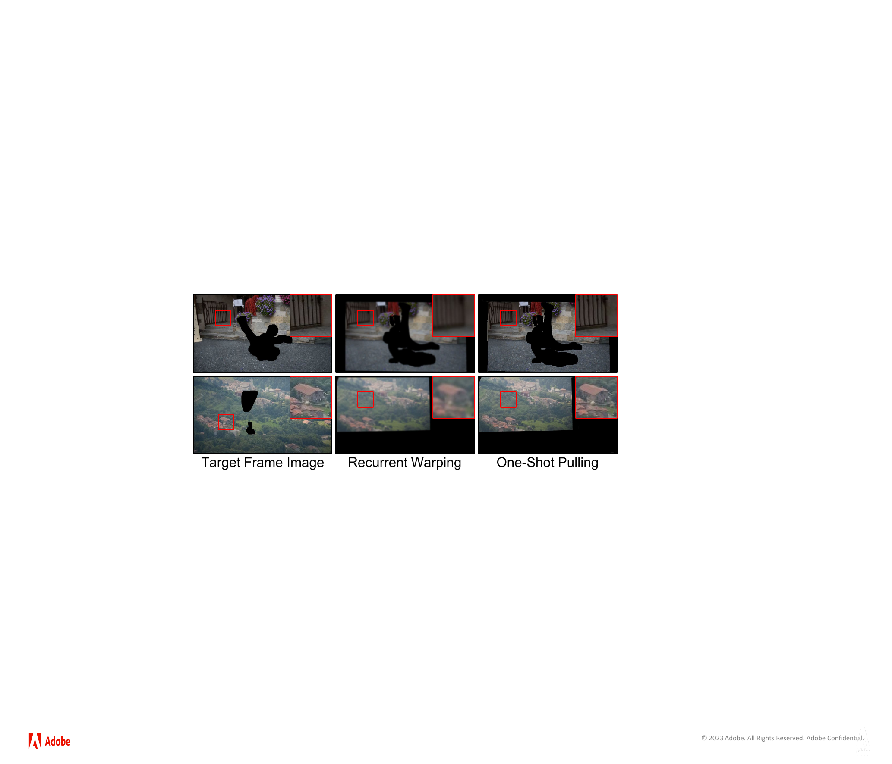
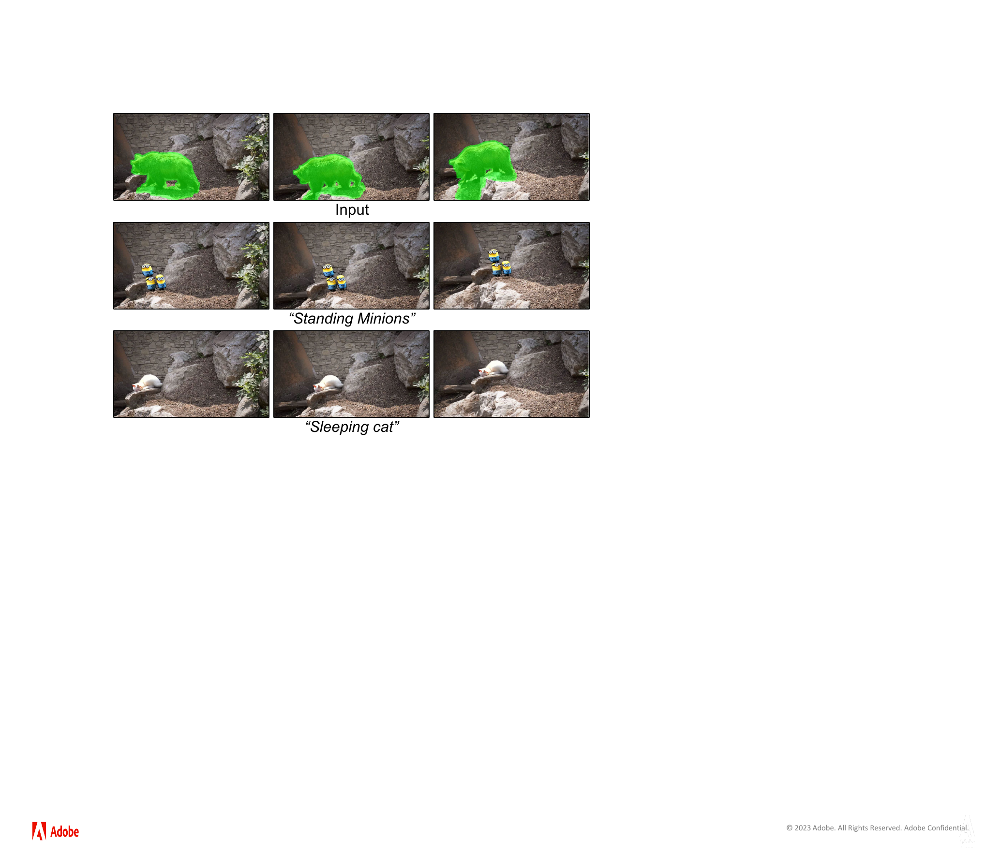
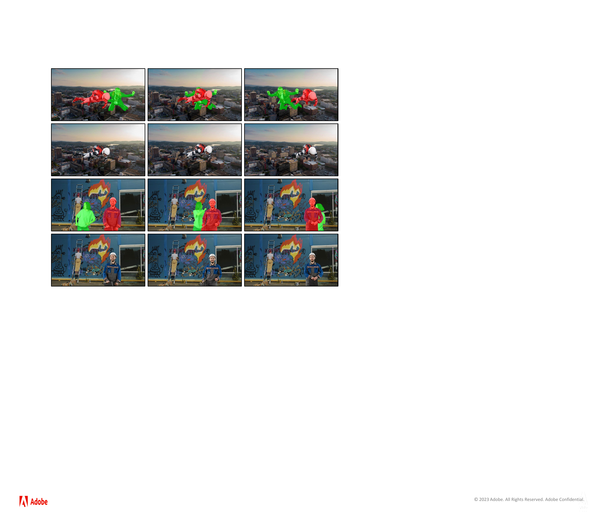
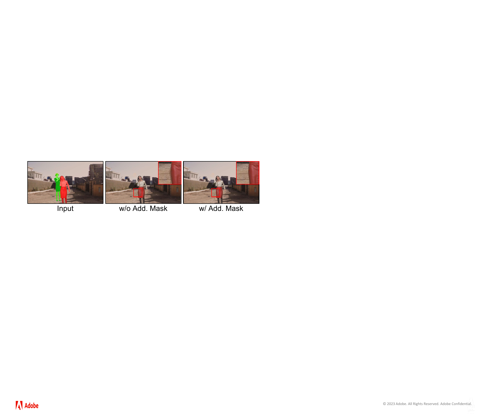
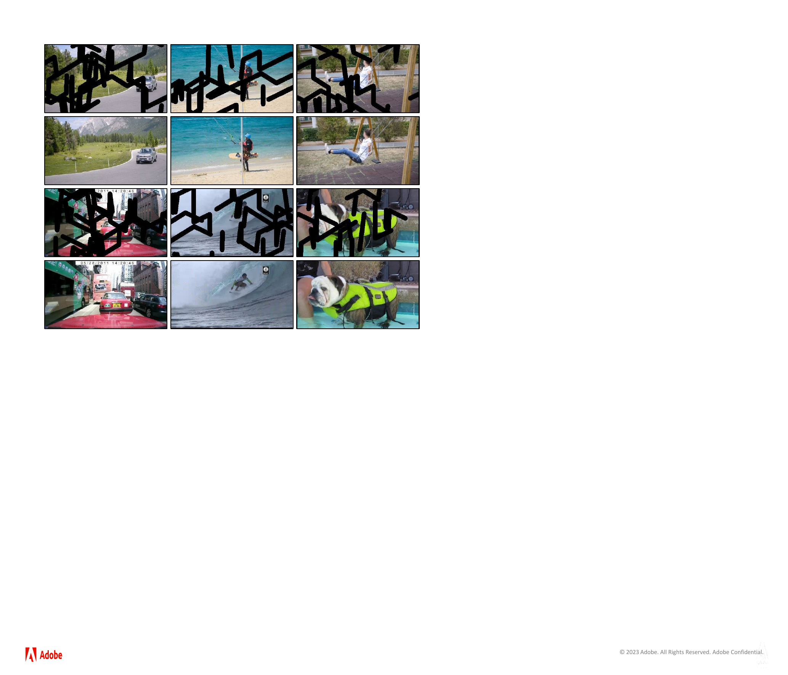
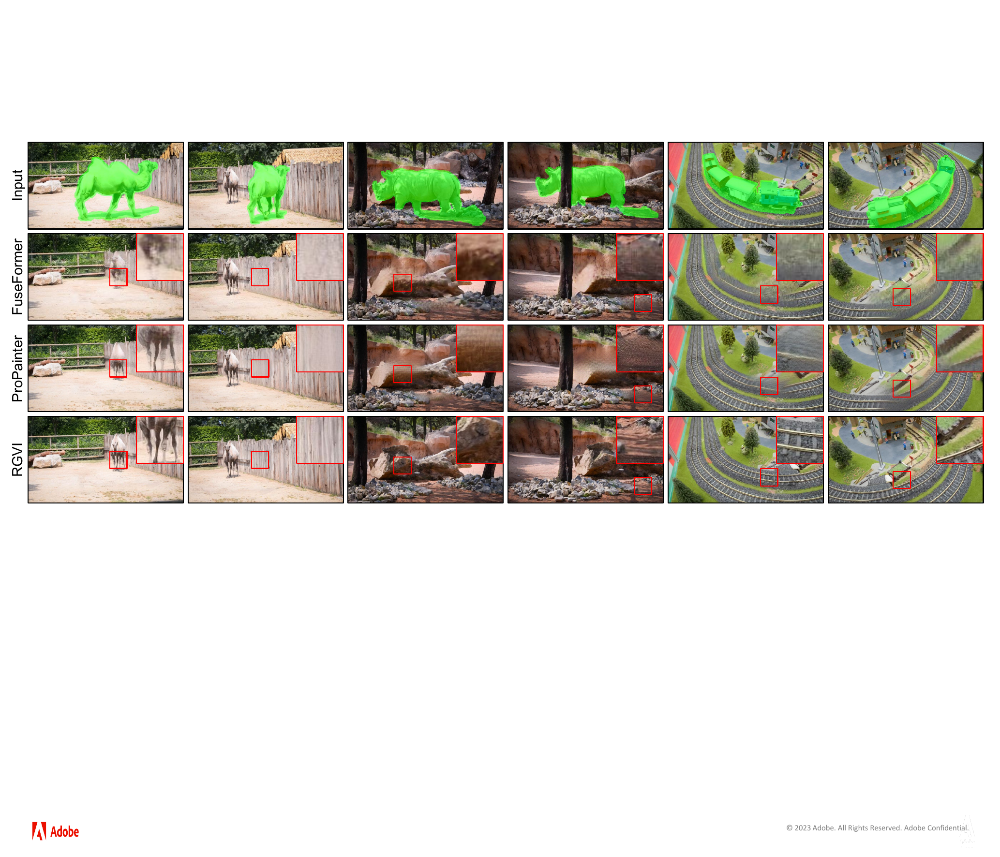

# Elevating Flow-Guided Video Inpainting with Reference Generation — Research Note
> [English](./README.md) | **繁體中文**

## 📇 Academic Context

| Field | Value |
|-|-|
| Title | Elevating Flow-Guided Video Inpainting with Reference Generation |
| Venue | AAAI 2025 |
| Year | 2025 |
| Authors | Suhwan Cho, Seoung Wug Oh, Sangyoun Lee, Joon-Young Lee |
| Affiliations | Yonsei University; Adobe Research |
| Paper Version | arXiv 2412.08975v1 (submitted 2024-12-12) |
| DOI | https://doi.org/10.1609/aaai.v39i3.32255 |
| Publication Status | Published in AAAI 2025 proceedings |
| Official Code | https://github.com/suhwan-cho/RGVI |
| Venue Kind | paper |

## Introduction

影片修補同時有兩種互相拉扯的工作：若被遮住的背景曾在別格出現，系統應搬回真實像素；若整段影片從未露出該區域，就只能生成新內容。前者決定紋理與時間一致性，後者決定大洞能否合理補上；只會傳播的方法遇到從未可見的背景會無像素可搬，只靠短時間窗生成的方法則容易逐格改變外觀。

RGVI 將兩件事拆開。它先以 RAFT 估計相鄰格 optical flow，遮掉待移除物體內的 flow 並用 ProPainter 的 recurrent flow completion 補齊；接著建立跨任意兩格的 correspondence，以 one-shot pixel pulling 搬運影片內已知像素。還有缺口時，只在一個影響範圍最大的 key frame 用 Stable Diffusion 生成 reference，再把 reference 傳到全片，最後由輕量 per-frame network 清理剩餘缺口。

論文在 HQVI、DAVI 與 YTVI 評估。HQVI 使用 PSNR、SSIM、LPIPS、VFID，同時報告單一 TITAN RTX 上的最大記憶體與每段時間；DAVI/YTVI 使用 PSNR、SSIM。比較方法包含 STTN、FGVC、FuseFormer、E$^2$FGVI、ProPainter，另以 propagation ablation、遮擋 mask ablation，以及 10 人對 29 支 DAVIS 影片的平均排名補充判讀。

## First Principles

### 先搬真實像素，再生成不存在的內容

輸入是 masked frames $X$、binary masks $M$ 與由相鄰格估得的 flow。RGVI 的順序不能任意交換：internal propagation 先用影片本身能觀察到的背景縮小洞；reference generation 才處理仍無來源的區域；reference propagation 讓同一份生成內容跨格共享；最後 per-frame completion 接手 flow 驗證判定不可靠或仍未填滿的像素。這個設計用單一 reference 避免每格各自生成而互相衝突，但也把該格的生成錯誤變成全片共用的錯誤。

### Flow tracing 只重採樣座標場

對任意來源格 $j$ 與目標格 $i$，方法把相鄰 flow 逐段串成全域 correspondence。$w(A,B)$ 表示以 flow $B$ 對 $A$ 做 sub-pixel grid warping；當 $i<j$ 時，累積式為

$$
f_{i\rightarrow j}=f_{i\rightarrow j-1}+w(f_{j-1\rightarrow j},f_{i\rightarrow j-1}).
$$

傳統 recurrent pixel warping 每跨一格就對 RGB 做一次取樣；例如從 frame 1 傳到 frame 4 要依序產生三個中間影像，每次都把前一次的取樣結果再取樣。RGVI 仍反覆 warp 較平滑的 flow 來得到 $f_{1\rightarrow4}$，但只在最後以 $w(X_4,f_{1\rightarrow4})$ 從原始 frame 4 取一次顏色，因此把多次 RGB 重採樣改成一次取樣；Figure 6 的金屬欄杆與紅瓦屋頂局部顯示 recurrent warping 較模糊，而 one-shot pulling 保留較多邊緣。

### 雙向收集不是盲目相信 flow

對每個 target frame，演算法各跑一次向前與向後來源搜尋，並優先採用最近且未被遮住的來源像素。若兩個方向都找到對應顏色，就比較歸一化 RGB 的 L1 distance：小於經驗閾值 1 時取兩者平均，超過時把該位置標成 invalid propagation area $V$；流程停止於洞已填滿或來源格已用盡。這能拒收前後方向互相矛盾的 correspondence，卻不能證明兩邊一致時就是正確背景。

### 單一 key frame 把生成變成可傳播的 reference

Internal propagation 後，以每格連到其他格未知像素的數量作為 connection count。論文定義

$$
C_i=\sum_{j=1}^{L}\left\{\sum_p\left(w(\hat{M}_j,f_{i\rightarrow j})\odot\hat{M}_i\right)\right\},\qquad
k=\underset{i}{\arg\max}\ C_i.
$$

$k$ 因而不是「畫面最漂亮」的一格，而是其生成像素預計可覆蓋最多跨格缺口的一格。Removal mode 固定 prompt 為 `Empty background, high resolution`；generation mode 則裁切洞附近影像，讓文字控制新增材質。生成後以

$$
\tilde{X}_i=\hat{X}_i+\hat{M}_i\odot w(\hat{X}_k,f_{i\rightarrow k})
$$

把 key frame 顏色傳至其餘格；少數單格不足的情況，論文只提出依序使用多個 key frames，沒有給自動停止準則或量化結果。

### 一個具體像素如何走完整條路

假設 frame 1 的洞像素在 frame 4 有可見來源。RGVI 先用三段 completed flow 合成 $f_{1\rightarrow4}$，再直接從 $X_4$ 的 sub-pixel 座標取色一次；若反向來源所得 RGB 與它的 L1 distance 為 0.8，因 $0.8<1$ 而取平均並清除此 mask。若 distance 是 1.2，該點進入 $V$；最後網路實際接收的是 $\Psi(\tilde{X}\odot(1-V),\tilde{M}+V)$，也就是把不可信像素重新遮回去再逐格補。0.8 與 1.2 是為解釋閾值而設的例值，不是論文量測；閾值 1 與運算路徑則來自方法段落。

### 遮擋物需要正、負兩張 mask

當要移除的物體被另一個應保留物體擋住，後者的 motion 會污染背景 flow。RGVI 把待移除物體標為 negative mask、遮擋物標為 positive mask，推論前暫時合併兩者，完成後再把 positive-mask 原像素覆回；HQVI 的綠色與紅色標註展示了兩者隨時間交換前後關係。只在含遮擋物的子集上，加入此 mask 使 PSNR 從 35.13 升至 37.31、LPIPS 從 0.0137 降至 0.0102，但這需要額外精細標註，並非完全自動的 object removal。

### HQVI 把可計分的合成與接近編輯情境的遮擋放在一起

HQVI 以 VideoMatte240K 的前景物體和 Pexels 背景影片做 alpha compositing，每段解析度為 $1200\times2160$；精細 alpha matte 避免硬邊貼圖，並保留無前景背景作為 ground truth。它包含大缺口、需要生成的案例，以及 negative/positive masks 描述的目標被其他物體遮擋案例。正文沒有交代影片數量、train/validation/test split、前景或 mask 尺寸分布，因此讀者無法由論文判斷樣本多樣性或資料洩漏風險。

這種組合很適合測試「有移動前景、乾淨背景可當答案」的 object removal，也能公平算 PSNR；但真實拍攝中的陰影、反射、motion blur、透明物體與互相照明不一定能由 alpha compositing 重現。例如前景拿走後陰影是否也該消失，本身就沒有單一像素答案，所以 HQVI 的高分不能直接外推到這類編輯。

### 數字顯示 reference 改善感知指標，不總是改善逐像素誤差

| HQVI 設定 | 方法 | PSNR ↑ | SSIM ↑ | LPIPS ↓ | VFID ↓ | Mem. | 每段時間 |
|-|-|-:|-:|-:|-:|-:|-:|
| 240×432 | RGVI w/o Ref. | **31.60** | **0.9559** | 0.0390 | 0.1868 | 8.3G | 55s |
| 240×432 | RGVI | 30.66 | 0.9527 | **0.0335** | **0.1825** | 8.3G | 58s |
| 480×864 | RGVI w/o Ref. | **31.19** | **0.9534** | 0.0403 | 0.0404 | 8.3G | 1m 38s |
| 480×864 | RGVI | 30.90 | 0.9513 | **0.0342** | **0.0311** | 8.3G | 1m 41s |
| 1200×2160 | RGVI w/o Ref. | 29.81 | **0.9501** | 0.0403 | 0.0101 | 17.2G | 7m 56s |
| 1200×2160 | RGVI | **30.10** | 0.9489 | **0.0357** | **0.0058** | 17.2G | 7m 59s |

在 240p，reference 讓 PSNR 下降 0.94 dB，卻讓 LPIPS 改善 0.0055；480p 也是相同方向。到 $1200\times2160$，有 reference 才讓 PSNR 從 29.81 升到 30.10。這支持「生成紋理可能較銳利、感知距離較好，卻不逐像素貼近唯一 ground truth」的解讀；它不支持所有解析度、所有 metric 都優於不生成版本。

與外部方法的 240p 同表比較中，RGVI w/o Ref. 的 PSNR 31.60 高於 E$^2$FGVI 30.63 與 ProPainter 30.62；有 reference 的 RGVI 則以 LPIPS 0.0335、VFID 0.1825 最佳。到 480p，表中只剩 FGVC、ProPainter 和 RGVI 變體；2K 更完全沒有外部 baseline，因此「可在 2K 跑完」有 17.2G、7m59s 的實測支持，「2K 優於既有方法」則沒有 matched comparison 支持。

### 公開 benchmark、ablation 與人類偏好各回答不同問題

DAVI 由 DAVIS 2016 train+validation 共 50 支影片組成，YTVI 使用 YouTube-VOS 2018 test 共 508 支，兩者以 random free-form masks 污損並在 240p 評估，不使用 reference generation。RGVI w/o Ref. 在 DAVI 得 29.75 PSNR / 0.9186 SSIM；YTVI 得 31.70 / 0.9335，其中 PSNR 與 ProPainter 的 31.70 並列，而 SSIM 較高。這證明 propagation/restoration 管線具競爭力，卻沒有檢驗文字生成或大缺口。

Propagation ablation 在 HQVI 240p 顯示，只做 internal propagation 時，recurrent warping 為 31.43 PSNR / 0.0595 LPIPS，one-shot 為 31.60 / 0.0390；internal 與 reference 都啟用時，兩者分別是 30.17 / 0.0558 與 30.66 / 0.0335。差異同時更換了 recurrent sequential distribution 與 one-shot bi-directional collection，因而支持整套 propagation protocol，不能把全部增益單獨歸因於「只採樣一次」。

User study 讓 10 位參與者對 29 支 DAVIS 影片排列 FuseFormer、ProPainter、RGVI，平均排名分別為 2.52、1.90、1.59；但輸入解析度並不一致：FuseFormer 是 $240\times432$，後兩者是 $480\times864$。論文未報告盲測方式、隨機化、信賴區間或顯著性，因此 1.59 最佳只能視為有限樣本的偏好訊號，而非已排除解析度與程序混雜的結論。

## 🧪 Critical Assessment

### 真問題被拆對了，但錯誤也沿管線被放大

把「能搬的真實像素」與「必須生成的未知內容」分開，是對實際 failure mode 有意義的分解；one-shot pulling 也直接針對 repeated RGB resampling。可是整條管線仍依賴 completed flow：大位移、長遮擋或非剛性邊界若讓 correspondence 錯誤，雙向顏色恰巧相近仍可能通過閾值；若錯誤落在 key frame，reference propagation 又會把結構偏移傳到多格。論文自己承認 flow 不準會造成明顯 structural misalignment。

### Reference 的可控性證據比穩定性證據強

論文展示文字 prompt 可替換材質，且預設 removal prompt 只有一句 `Empty background, high resolution`；它沒有 prompt sweep、seed variance、跨 key-frame 選擇的 identity consistency，亦未量化 unnatural generation 發生率。因而「可以接受文字控制」有 Figure 3 支持，「對 prompt 不敏感、長片維持身分、少有 hallucination」都尚未被證明；作者也明列 generated reference 有時不自然。

### HQVI 提高解析度，卻未提供足夠的資料審計面

$1200\times2160$ 與精細 alpha matte 確實比低解析 random masks 更接近後製，但正文省略資料量、split、scene/subject 分布與授權後的公開形式。更根本地，VideoMatte240K 前景貼到 Pexels 背景仍是合成分布：遮擋輪廓可以精準，陰影、反射、透明度與接觸關係卻可能不符合真實物理。此 benchmark 能檢驗指定型態，尚不足以代表一般 object removal。

### 比較條件限制了「高解析領先」的強度

240p 表格有五個外部 baselines，480p 只剩兩個，2K 則沒有任何外部方法；固定解析度方法以 $\dagger$ 標記，但記憶體與時間仍受實作、影片長度與生成步驟影響。單一 TITAN RTX 上 RGVI 的 2K 記錄證明可執行，不證明比未在相同硬體與解析度測到的對手更快或更省；作者所稱的「輕鬆處理」也與每段約 8 分鐘之間存在實務判準缺口。

### 系統整合有價值，因果歸屬仍不完整

RGVI 組合 RAFT、ProPainter flow completion、Stable Diffusion、flow tracing/grid warping 與輕量 per-frame network，主要新意是 one-shot correspondence/verification 與 single-key-frame reference 設計。現有 ablation 沒有拆開 flow tracing、雙向最近來源、L1 verification、key-frame selection 與 Stable Diffusion 各自效果，也沒有「相同 one-shot propagation、換不同生成器」的成本品質曲線。HQVI 的 tested ablation 支持 reference 在三種解析度改善 LPIPS，但 240p 與 480p 的 PSNR 反而下降；所以只能肯定這個 protocol 的感知指標增益，不能宣稱整體或每一元件一致改善。

### 發布資訊不足以閉合可復現性

逐格修補網路的訓練資訊相對具體：YouTube-VOS 2018 train 影像縮放至 $240\times432$，使用 random free-form 與 random object masks，並以 L1 加 adversarial loss、Adam 固定 learning rate $10^{-4}$ 訓練。然而，論文雖給了 code URL，正文仍未記載 Stable Diffusion 的確切 checkpoint、sampler、steps、guidance scale、random seed、flow-completion checkpoint、HQVI 數量與 split。沒有提供 code_repo_url 給本次任務，因此本筆記不以 repository 靜態分析補足這些欄位；僅憑論文，外部團隊難以重現 58 秒與 7 分 59 秒結果，或判斷 prompt/seed 改動造成的變異。

## 一分鐘版

- Video inpainting 要同時處理兩件事：曾出現的背景應從其他格搬回，整段影片從未出現的內容才需要生成；RGVI 因此先傳播、後生成。
- One-shot pulling 反覆組合 flow 座標，RGB 只從原始來源格取樣一次。以 frame 1 搬到 frame 4 為例，它不產生三張反覆插值的中間影像；240p internal-only ablation 的 LPIPS 也由 0.0595 降至 0.0390。
- 單一 key frame 依 connection count 選出，Stable Diffusion 只在該格補 reference，再以 flow 傳到全片，避免每格各自生成互相衝突。
- 這項 reference 有指標取捨：240p 的 LPIPS 由 0.0390 降至 0.0335，PSNR 卻由 31.60 降至 30.66，也就是少 0.94 dB。
- 最大風險也是「全片共用」：key frame 的 flow 偏差或不自然生成會傳至多格；論文未量化 prompt、seed 與長片一致性。
- HQVI 的 2K 測試在單張 TITAN RTX 使用 17.2G、每段 7 分 59 秒；該解析度沒有外部 baseline，因此只證明能跑完，不證明同條件領先。

## 🔗 Related notes

- [ProPainter](../ProPainter/) — RGVI 採用其 recurrent flow completion，並以 one-shot pulling 回應 recurrent pixel warping 的重採樣問題。
- [DiffuEraser](../DiffuEraser/) — 另一條以 diffusion 強化 video inpainting 生成能力的路線。
