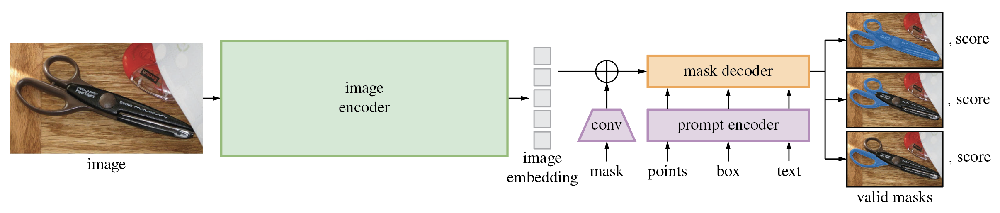

# Segment Anything — Research Note

## 📇 Academic Context

| Field | Value |
|-|-|
| Title | Segment Anything |
| Venue | ICCV |
| Year | 2023 |
| Authors | Alexander Kirillov, Eric Mintun, Nikhila Ravi, Hanzi Mao, Chloe Rolland, Laura Gustafson, Tete Xiao, Spencer Whitehead, Alexander C. Berg, Wan-Yen Lo, Piotr Dollár, Ross Girshick |
| Official Code | https://github.com/facebookresearch/segment-anything |
| Venue Kind | paper |

## 可提示分割的機制

本文依據 arXiv:2304.02643v1 與 CVF ICCV 2023 OpenAccess 版本整理；CVF 頁面列出同一篇論文收於 Proceedings of the IEEE/CVF International Conference on Computer Vision (ICCV), 2023, pp. 4015-4026，因此下列技術解讀把 arXiv 全文當作可檢查的主要來源，並以 CVF 版本校對出版脈絡。

圖中最重要的切分不是「更大的分割網路」，而是把 SAM 拆成一次性的 image encoder、可重複查詢的 prompt encoder，以及很輕的 mask decoder；這讓同一張圖的 embedding 可以被點、框、遮罩等提示反覆使用。

### 從固定任務改成提示介面

SAM 的核心問題設定是可提示分割 (promptable segmentation)：輸入影像與任意分割提示，模型只需要回傳至少一個合理的有效遮罩。有效遮罩的要求是：即使提示有歧義，輸出也應是其中至少一個可能物件的合理遮罩。SAM 的 promptable segmentation 不同於固定 semantic、instance、panoptic segmentation 任務的多任務系統。這個定義刻意容許歧義；例如單點可能落在衣服、人體或衣服局部上，論文因此讓模型對單一提示輸出 3 個候選遮罩，並附上 estimated IoU 作為排序訊號。

### 資料引擎如何放大標註

SA-1B 不是先有的網路資料集，而是由三階段 data engine 產生：第一階段由標註者在 SAM 輔助下畫遮罩，第二階段混合自動候選與人工補標，最後以全自動方式在 11M 授權且隱私處理的影像上產生 1.1B masks。論文報告自動遮罩品質檢查時，隨機抽取約 500 張圖與約 50k masks 讓專業標註者修正，94% 的自動/修正遮罩配對 IoU 大於 90%。

### 一次影像編碼，多次提示解碼

模型先把影像縮放並 padding 到 $1024\times1024$，ViT-H/16 image encoder 產生 $64\times64$ 的影像 embedding，通道經卷積降到 256；點與框會被位置編碼加上提示類型 embedding，遮罩提示則以卷積下採樣後加到影像 embedding 上。mask decoder 使用兩層 two-way Transformer：token self-attention、token-to-image cross-attention、MLP、image-to-token cross-attention 依序更新提示 token 與影像 embedding，最後用 mask token 經 MLP 產生動態線性分類器，對 upscaled image embedding 的每個位置預測遮罩值。

$$
\text{mask}_{k}(x,y)=h_k^\top E_{\text{up}}(x,y), \quad k\in\{1,2,3\}
$$

這個式子是本文對論文動態遮罩頭的摘要記號：$E_{\text{up}}$ 表示上採樣後的影像 embedding，$h_k$ 表示第 $k$ 個 mask token 經 MLP 得到的分類向量；論文實作的重點是把每個候選遮罩變成「token 產生分類器，再掃過空間 embedding」。

### 一個真實數字的 forward pass

以單點提示為例，一張圖先被轉成長邊 1024 的張量並經 ViT-H 編成 `1x256x64x64` embedding；一個前景點 `(x,y)` 會經位置編碼與 foreground 類型 embedding 形成 256 維 point embedding，沒有 box 時公開 predictor 會再補一個 padding point token；沒有遮罩提示時 dense prompt 是 `1x256x64x64` 的 learned no-mask embedding。decoder 會把 IoU token、4 個 mask tokens 與 sparse prompt tokens 串接，經兩層 two-way Transformer 後輸出低解析度 `Cx256x256` logits；當 `multimask_output=True` 時，公開介面回傳 3 張遮罩、3 個品質分數，以及可供下一輪提示使用的低解析度 logits。

| 實驗 | 設定 | SAM 結果 | 對照 |
|-|-|-|-|
| Single-point 23 datasets | 1 個中心點提示，mIoU 與人工評分 | 16/23 datasets 高於 RITM；oracle 選 3 個候選中最接近 ground truth 時全數高於 RITM | RITM、FocalClick、SimpleClick |
| BSDS500 edge detection | 16x16 grid 產生 768 masks，再從 mask probability 取邊 | ODS .768、OIS .786、AP .794、R50 .928 | HED ODS .788；EDETR ODS .840 |
| LVIS object proposals | AR@1000，zero-shot masks proposal | all 59.3、medium 81.6、large 86.9、rare 65.8 | ViTDet-H all 63.0、medium 80.8、large 87.0、rare 58.3 |
| Instance segmentation | 用 ViTDet boxes 提示 SAM | COCO AP 46.5；LVIS AP 44.7 | ViTDet-H COCO AP 51.0；LVIS AP 46.6 |

結果的讀法要小心：SAM 在 open-world proposal 與遮罩品質上很強，但它不是在所有既有指標上壓過專用模型。論文自己的限制段落也承認，它可能漏掉細結構、偶爾產生小型不連通區塊，且 heavy image encoder 使整體系統並非端到端即時；真正即時的是預先算好 image embedding 後的 prompt encoder 與 mask decoder。

## 🧪 Critical Assessment

### 問題是否值得獨立成一個介面

把分割改寫成可提示介面是有實際價值的，因為許多下游系統已經能產生點、框、文字或候選區域，卻缺少一個通用且可組合的遮罩模組。這個問題設定也避開了類別封閉假設，對資料標註、互動修圖、機器人視覺或偵測器後處理都有自然位置；不過「回傳一個有效遮罩」比「回傳使用者心中那個遮罩」弱，成功與否高度依賴提示設計與後處理。

### 評估能證明什麼，也不能證明什麼

論文的評估面涵蓋五個 zero-shot transfer 任務，其中四個明顯不同於訓練用的 promptable segmentation task。論文用 23 個資料集評估 single-point prompt 的 mIoU，並在 BSDS500 上評估 zero-shot edge detection、在 LVIS v1 上以 AR@1000 評估 object proposal generation、在 COCO 與 LVIS 上比較 SAM 和 ViTDet 的 instance segmentation masks；它也用人類評分補充 mIoU，並在 23-dataset suite 上做多個 ablations。這比只報單一資料集 mIoU 更有說服力。可是若以嚴格產品需求來看，很多結果仍是「可組合元件」證據而非完整應用證據；例如 edge detection 需要把 768 個 masks 再做 Sobel 與 NMS，object proposal 也調整 grid 與 NMS 閾值，這些流程證明 SAM 可被工程化，但不等於單一模型直接解決所有分割任務。

### 新意主要在尺度與介面，而非單一模組發明

從模型積木看，ViT image encoder、prompt embedding、Transformer decoder、focal/dice loss、multi-mask minimum loss 都有前例；真正的新意是把 ambiguity-aware promptable task、可互動的 decoder、以及能自我擴張的 SA-1B data engine 放在同一個閉環裡。這也表示如果移除資料規模與產品化標註迴圈，單看架構很難解釋 SAM 的躍升；它更像是任務定義、資料生產與系統設計的合成成果。

### 基準設計的風險

作者清楚指出單點提示有歧義，並加入 human study 與 oracle 評估來補 mIoU 的盲點，這是合理的；但 oracle 指標本質上替模型選了最接近 ground truth 的候選，較接近「候選集合品質」而不是「模型第一答案品質」。同樣地，human rating 能減少資料集標註偏差，卻也引入評分主觀性與標註指南依賴；因此最穩健的結論應是 SAM 產生大量高品質候選遮罩的能力很強，而不是每個任務都已被它完整解決。

### 現實使用的缺口

SA-1B 的 11M images 與 1.1B masks 讓模型具備廣泛泛化，但資料授權、隱私處理、地理代表性與 compute 成本都不是小問題；論文模型卡也寫明 released SAM 訓練使用 256 A100 GPUs 68 小時。對一般團隊而言，最可落地的路徑通常是使用公開 checkpoint 與 automatic mask generator，而不是重建整個資料引擎；這讓 SAM 更像基礎設施，而不是一篇可輕易複製的單模型方法。

## 🔗 Related notes
