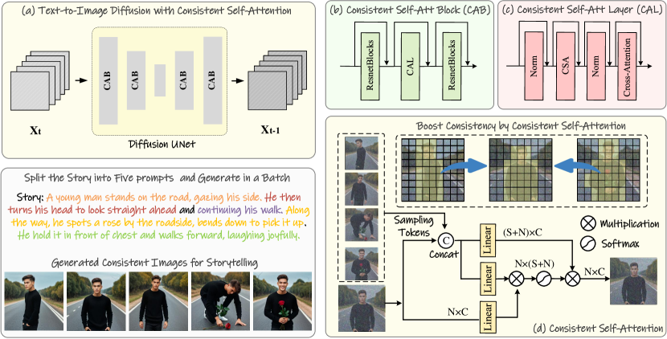
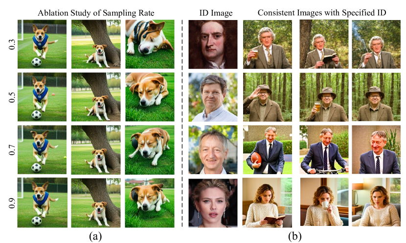
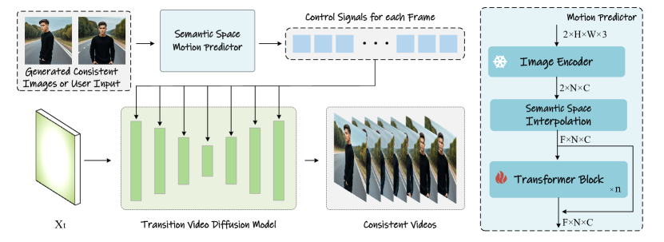

# StoryDiffusion — Research Note
> **English** | [繁體中文](./README.zh-TW.md)

## 📇 Academic Context

| Field | Value |
|-|-|
| Title | StoryDiffusion: Consistent Self-Attention for Long-Range Image and Video Generation |
| Venue | NeurIPS |
| Year | 2024 |
| Authors | Yupeng Zhou, Daquan Zhou, Ming-Ming Cheng, Jiashi Feng, Qibin Hou |
| Official Code | https://github.com/HVision-NKU/StoryDiffusion |
| Venue Kind | paper |

> This note is written based on the full text of the arXiv preprint `2405.01434v1` and the official code released by the authors; the paper was formally published at NeurIPS 2024 (Spotlight), and details in the camera-ready version may differ slightly from the preprint.

## First Principles

StoryDiffusion aims to solve a very concrete pain point: when using a diffusion model to draw a "story," the same character must look identical across several images—face, hairstyle, and clothing all have to stay consistent, otherwise it does not hold together as a story. The paper decomposes this requirement into two parts: the first stage uses a training-free modification of attention that lets a "batch" of images see one another, so as to converge on a consistent character; the second stage then uses a module that predicts motion in the semantic space to string these consistent images into transition videos. Our method can be divided into two stages: the first stage generates subject-consistent images with Consistent Self-Attention, and the second stage turns these images into transition videos.



### Why start from self-attention

The authors' core motivation comes from an observation: self-attention is one of the most important modules that determine the overall structure of the generated content, and its attention weights are "input-dependent"—since the weights are determined by the input tokens, as long as the tokens of a reference image are "fed in" when computing attention, in principle the consistency of the reference image can be carried over without retraining or fine-tuning the model. This is the founding argument for why the whole method can be zero-shot: if a reference image can be used to guide the computation of self-attention, the consistency between the two images will improve significantly.

Conversely, the paper contrasts existing approaches as counterexamples. Methods like IP-Adapter, which condition on an entire reference image, guide too strongly, so the controllability over the generated content of the text prompts is reduced; while ID-preservation methods like InstantID and PhotoMaker, although they hold onto identity, do not guarantee consistency of clothing and scene. StoryDiffusion's goal is to hold onto both identity and clothing consistency "at the same time," while preserving text controllability as much as possible.

### Formalization of Consistent Self-Attention

Given a batch of image features $\mathcal{I} \in \mathbb{R}^{B \times N \times C}$, where $B$, $N$, $C$ are the batch size, the number of tokens per image, and the number of channels respectively. Define a function $\operatorname{Attention} ( X_k, X_q, X_v )$ to calculate self-attention. The original self-attention is computed independently within each image's own features $I_i$:

$$
O_i = \operatorname{Attention}\left(Q_i, K_i, V_i\right).
$$

The approach of Consistent Self-Attention is: for the $i$-th image, it first samples some tokens $S_i$ from other image features in the batch randomly:

$$
S_i = \operatorname{RandSample}\left(I_1, I_2, ..., I_{i-1}, I_{i+1}, ..., I_{B-1}, I_{B}\right),
$$

then we pair the sampled tokens $S_i$ with the image's own features $I_i$ into a new set of tokens $P_i$, apply a linear projection to $P_i$ to obtain new keys $K_{Pi}$ and values $V_{Pi}$, while the query still keeps the image's original $Q_i$ unchanged. Finally it computes:

$$
O_i = \operatorname{Attention}\left(Q_i, K_{Pi}, V_{Pi}\right).
$$

Placing the three equations side by side, the key difference is in only one place: the source pool of key/value expands from "the $N$ tokens of the image itself" to "the image itself + tokens sampled from other images," while the query is not touched at all. Because the $Q$-$K$-$V$ projection weights are inherited from the original model, without adding any parameters, no extra training is required and the whole operation is hot-pluggable. Intuitively, such cross-image interaction pushes the model, during generation, to make the character's face, clothing, and other features converge toward one another.

### Sustaining long stories with tile and sliding window

The paper attaches the pseudocode of Algorithm 1, adding two practical engineering considerations: one is to use `tile_size` to process tokens in chunks, avoiding a GPU memory blow-up from computing everything at once; the other is to slide the tile along the temporal dimension, which removes the peak memory consumption's dependency on the input text length, so that long stories can be generated.

```python
def ConsistentSelfAttention(images_features, sampling_rate, tile_size):
  output = zeros(B, N, C), count = zeros(B, N, C), W = tile_size
  for t in range(0, N - tile_size + 1):
    # 用 tile 分塊，避免超出 GPU 記憶體
    tile_features = images_tokens[t:t + W, :, :]
    reshape_featrue = tile_feature.reshape(1, W*N, C).repeat(W, 1, 1)
    sampled_tokens = RandSample(reshape_featrue, rate=sampling_rate, dim=1)
    # 把其他圖抽到的 token 與原 token 串接
    token_KV = concat([sampled_tokens, tile_features], dim=1)
    token_Q = tile_features
    X_q, X_k, X_v = Linear_q(token_Q), Linear_k(token_KV), Linear_v(token_KV)
    output[t:t+w, :, :] += Attention(X_q, X_k, X_v)
    count[t:t+w, :, :]  += 1
  output = output/count
  return output
```

It is worth contrasting how the official code implements this "RandSample." In `cal_attn_mask_xl` of `utils/gradio_utils.py`, sampling is actually implemented with a boolean mask: `bool_matrix1024 = torch.rand((1, total_length * 1024),device = device,dtype = dtype) < sa32`, that is, over "the whole batch flattened," each token is Bernoulli-sampled with probability `sa32`, and only the retained tokens participate in the attention at that resolution. In other words, the random sampling of the paper's Eq. (2) is, in implementation, equivalent to a random attention mask, and `sa32` / `sa64` are exactly the sampling rates at different resolutions. The `SpatialAttnProcessor2_0` in `app.py` also adds a schedule over time: the first few steps of `cur_step < 5` go entirely through the original self-attention (`__call2__`), and only afterward is there a probability of switching to the consistent path (`__call1__`), and the probability threshold for applying consistency tightens from `1-0.3` to `1-0.1` around step 20, letting consistency intervene more strongly in the later stages of denoising.

### A concrete forward example

Plugging in the numbers makes it clearer. Suppose we want to draw a 5-panel comic (in the official code this corresponds to `id_length=4`, `total_length=id_length+1=5`). When generating a 1024×1024 image on SDXL, the feature map at a certain downsampling stage of the U-Net is 32×32, i.e., each image has $N = 32\times32 = 1024$ tokens (the code decides this resolution via `(height//32)*(width//32)`, and note that `self.total_length = id_length + 1`).

- **Standard self-attention**: the query of the $i$-th panel (1024 tokens) can only attend to its own 1024 key/value, the attention matrix is $1024\times1024$, there is no information exchange among the five panels, and so each is drawn on its own and the character drifts.
- **Consistent Self-Attention**: flatten the 5 panels into a pool of $5\times1024 = 5120$ tokens, and with a Bernoulli mask at sampling rate 0.5 retain about $0.5\times5120 \approx 2560$ visible tokens as key/value (in code `token_KV = concat([sampled_tokens, tile_features], dim=1)`). Thus the query of the $i$-th panel, besides seeing its own 1024 tokens, can also see tokens sampled from the other four panels—the face and clothing tokens of other panels are introduced into the computation, pulling this panel toward a common character appearance. Because only the key/value pool is enlarged while the query and projection weights are unchanged, none of this requires training.

The paper's ablation shows that this sampling rate cannot be too low: at a sampling rate of 0.3 the images in the third column already fail to hold onto subject consistency, and a higher sampling rate holds it better; in practice we set the sampling rate to 0.5 by default, to cause the least disturbance to the diffusion process while maintaining consistency.



### Semantic Motion Predictor: predicting motion in the semantic space

The second stage needs to fill in intermediate frames between two adjacent consistent images, turning them into a transition video. The paper first points out the problem of existing methods (SEINE, SparseCtrl): they rely solely on a temporal module to predict the intermediate content independently at each spatial position in the image latent space, lacking an overall consideration of spatial information, so when the first and last frames differ greatly (e.g., the character moves substantially) the transition fails to connect stably and produces collapsed intermediate frames.



The countermeasure of the Semantic Motion Predictor is to move the prediction into the "image semantic space." Given a start frame $F_s$ and an end frame $F_e$, we utilize a pre-trained CLIP image encoder as $E$ (exploiting its zero-shot capability) to compress them into semantic vectors:

$$
K_s, K_e = E\left(F_s, F_e\right).
$$

Next, in the semantic space, first apply linear interpolation to expand the two frames $K_s$, $K_e$ into a sequence of length $L$, $K_1, K_2, ..., K_L$, then feed it into a series of transformer blocks $B$ to predict the transition frames:

$$
P_1, P_2, ..., P_l = B\left(K_1, K_2, ..., K_L\right).
$$

Finally, these semantic embeddings are used as control signals, with the video diffusion model as the decoder: for each video frame feature $V_i$, the text embedding $T$ and the predicted semantic embedding $P_i$ are concatenated and projected into key/value fed into cross-attention:

$$
V_i = \mathrm{CrossAttention}\left(V_i, \operatorname{concat}(T, P_i), \operatorname{concat}(T, P_i)\right),
$$

and the MSE between the predicted video and the ground truth is used as the training loss $Loss = \mathrm{MSE}(G, O)$. In terms of concrete specifications, this predictor uses OpenCLIP ViT-H-14 as the encoder, initializes the temporal module weights from the motion module of AnimateDiff V2, and contains 8 transformer layers, with a hidden dimension of 1024 and 12 attention heads, a learning rate of 1e-4, trained on Webvid10M for 100k iterations on 8 A100 GPUs.

### Experimental data

For consistent image generation, the paper uses GPT-4 to generate 20 character prompts and 100 activity prompts, cross-combined into a test set, and compares against IP-Adapter and PhotoMaker on Stable Diffusion XL, all using 50-step DDIM sampling, and the classifier-free guidance score is consistently set to 5.0. CLIP scores are used to measure text alignment and character consistency:

| Metric | IP-Adapter | Photo Maker | StoryDiffusion (ours) |
|-|-|-|-|
| Text-Image Similarity | 0.6129 | 0.6541 | **0.6586** |
| Character Similarity | 0.8802 | 0.8924 | **0.8950** |

For transition video generation, about 1000 videos are randomly sampled as the test set, compared against SEINE and SparseCtrl on four metrics:

| Methods | LPIPS-*first* (↓) | LPIPS-*frames* (↓) | CLIPSIM-*first* (↑) | CLIPSIM-*frames* (↑) |
|-|-|-|-|-|
| SEINE | 0.4332 | 0.2220 | 0.9259 | 0.9736 |
| SparseCtrl | 0.4913 | 0.1768 | 0.9032 | 0.9756 |
| Ours | **0.3794** | **0.1635** | **0.9606** | **0.9870** |

In addition, there is a user study with 30 participants, each answering 50 questions: for consistent image generation the proportion of users who prefer StoryDiffusion is 72.8% (IP-Adapter 10.4%, PhotoMaker 16.8%); for transition video generation it is 82% (SEINE 11.6%, SparseCtrl 6.4%).

## 🧪 Critical Assessment

### Cross-image character consistency is the real pain point when pushing T2I toward comics and storyboards

"Cross-image character consistency" is indeed the real pain point when pushing T2I models toward practical applications like comics, picture books, and storyboards, and this holds up without any need to overstate it: the existing IP-Adapter sacrifices text controllability, and PhotoMaker misses clothing consistency—both are pitfalls users actually hit. Even more commendable is that the method chose a low-cost route that is "training-free and pluggable," which is especially friendly to people who only have inference resources. This positioning is the most solid value of this work.

### The bias of using CLIP as a consistency judge and the 0.003-magnitude gap

This is the part I think most deserves a discount. The quantitative evaluation of consistent image generation only compares against the two baselines IP-Adapter and PhotoMaker, and moreover the two core metrics Text-Image Similarity and Character Similarity **are both computed using CLIP scores**—note that character similarity, which measures the CLIP Scores of the character images, and a CLIP embedding is inherently biased toward capturing semantics/style rather than fine-grained identity; using it as a judge of "consistency" is inherently favorable to methods that "make multiple images look similar." More critically, StoryDiffusion beats PhotoMaker on Character Similarity by only 0.8950 vs 0.8924 (a difference of 0.0026), and on Text-Image Similarity by 0.6586 vs 0.6541 (a difference of 0.0045), gaps that fall into an almost negligible magnitude, yet the paper gives no significance test or variance over multiple runs. Looking at this table alone, it is hard to call it an overwhelming win.

### The sampling-rate ablation sweeps only two points, with no matching ablation for the schedule or tile_size

The ablation is also thin: the sampling rate only sweeps two settings, 0.3 and "a higher value" (a sampling rate of 0.3 could not maintain subject consistency), and then directly claims 0.5 is optimal, but there is no curve for 0.4, 0.6, 0.7, so "0.5 is optimal" looks more like an empirically chosen point than a conclusion from a sweep; `tile_size`, and that "first 5 steps go through the original attention, later tighten the threshold" schedule in the code, have no matching ablation, so the reader has no way to judge how much each of these designs contributes.

### The relationship of CSA to existing cross-image/cross-frame KV sharing

One must ask honestly: what exactly is new about Consistent Self-Attention. In essence it extends the key/value of self-attention from a single image to multiple images within a batch (The sampled tokens share the same set of projection weights as the image's own tokens)—this idea of "cross-image/cross-frame KV sharing" is not entirely new in the video and reference-generation fields (e.g., various reference/extended attention), and the paper's contribution lies more in "getting it to work in the storytelling scenario in the most economical way (random sampling + inherited weights + training-free)." This is solid engineering integration and scenario deployment, but narrating it as a brand-new attention mechanism slightly overstates the novelty at the mechanism level. The Semantic Motion Predictor is likewise a combination of three off-the-shelf building blocks: "CLIP semantic encoding + transformer interpolation + IP-Adapter-style cross-attention decoding."

### The gap between the self-built prompt set and the overwhelming user-study preference

The test prompts are self-built—we use GPT-4 to generate twenty character prompts and one hundred activity prompts—generated by the authors themselves, and the test videos are self-sampled, without adopting a publicly recognized community benchmark; the evaluation set is essentially defined around the method's own scenario, lacking a fixed benchmark that is third-party reproducible for alignment. Add to this that the only "human criterion" is a user study, and the overwhelming preference of 72.8% / 82% forms a stark contrast with the mere 0.003-magnitude gap on the quantitative metrics—this contrast itself hints: either the CLIP metrics may fail to measure the consistency that human eyes really care about, or the presentation of the user study (e.g., cherry-picking display samples) magnified the gap. Both point to the concern that "the evaluation design is biased in favor of this method," which the paper does not address head-on.

### The deployment value is solid, but consistency is only held at the level of the face and large garments

Pragmatically, the method indeed has strong real-world relevance in being "pluggable, with zero barrier to the existing SD1.5/SDXL ecosystem," and the official code and Gradio demo also lower the barrier to deployment, which is the practical reason it can be widely adopted by the community. But "the problem is solved" needs a discount: the limitations the paper itself states already point out two hard issues—details (such as small accessories like a tie) can still be inconsistent, requiring finer prompts to remedy; and long videos, lacking global information exchange, use the sliding window only as a stopgap, and our method is not designed specifically for long video generation. It is credible that consistency holds at the "face and large garments" level, but holding it down to "every fine detail" has not yet been established.

## 🔗 Related notes

- [DDPM](../diffusion/)
- [Wan 2.2](../wan/)
