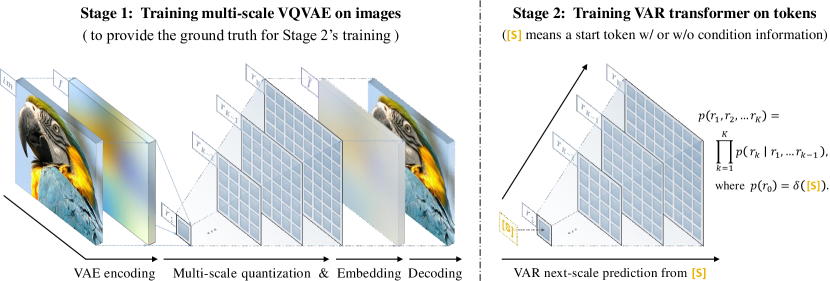
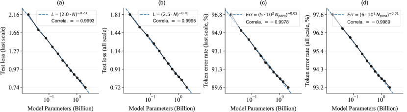
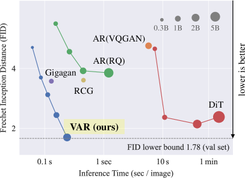

# VAR — Research Note

## 📇 Academic Context

| Field | Value |
|-|-|
| Title | Visual Autoregressive Modeling: Scalable Image Generation via Next-Scale Prediction |
| Venue | NeurIPS 2024 |
| Year | 2024 |
| Authors | Keyu Tian, Yi Jiang, Zehuan Yuan, Bingyue Peng, Liwei Wang |
| Official Code | https://github.com/FoundationVision/VAR |
| Venue Kind | paper |

本篇筆記基於 arXiv 預印本 `2404.02905` 全文撰寫，正式 NeurIPS 2024 版本的細節可能略有差異；所有數值與引述皆以該預印本為準。

## First Principles

### 問題：把「自回歸」硬搬到影像上為什麼會卡住

大型語言模型（LLM）的成功幾乎建立在一個極其樸素的自監督目標上——**next-token prediction**，也就是依序預測序列中的下一個 token。這條路線帶來了兩個令人著迷的性質：scaling laws（可從小模型外推大模型表現）與 zero-shot / few-shot 泛化。電腦視覺一直想複製這套「可擴展且可泛化」的配方，於是 VQGAN、DALL-E 這類方法先用一個視覺 tokenizer 把連續影像離散成 2D token 網格，再把它攤平（flatten）成 1D 序列，套用跟語言一模一樣的逐 token 生成流程。

問題在於，這種「攤平後逐 token」的作法把幾個矛盾一起帶進來。作者列出四點：其一是**數學前提被違反**，VQVAE 的 encoder 產生的特徵圖 $f^{(i,j)}$ 彼此雙向相關，攤平後序列仍保有 bidirectional 相關性，卻被硬套上「每個 token 只依賴前綴」的單向假設；其二是**無法做某些 zero-shot 任務**，單向性讓模型無法「用下半張圖去補上半張圖」；其三是**破壞空間結構**，攤平打散了相鄰 token $q^{(i,j)}$ 與其上下左右鄰居的空間局部性；其四是**低效**，用標準自注意力 transformer 逐一生成 $n\times n$ 個 token，需要 $\mathcal{O}(n^2)$ 步、總計 $\mathcal{O}(n^6)$ 的計算量。這些問題合起來，讓 AR 在影像上的表現長期顯著落後於擴散模型。


### 核心重構：把「自回歸單元」從一個 token 換成一整張 token map

VAR 的關鍵動作，是重新定義影像的「順序」。人類看圖或畫圖是階層式的：先抓全局輪廓，再補局部細節。作者把這種 **coarse-to-fine、multi-scale** 的直覺定為影像的自回歸順序，稱之為 **next-scale prediction**：自回歸的單元不再是單一 token，而是**一整張 token map**。標準的 next-token 自回歸把序列似然分解為

$$
p(x_1, x_2, \dots, x_T) = \prod_{t=1}^{T} p(x_t \mid x_1, x_2, \dots, x_{t-1}),
$$

其中每個 $x_t$ 只依賴其前綴。VAR 則先把特徵圖量化成 $K$ 張逐級變大的多尺度 token map $(r_1, r_2, \dots, r_K)$，最粗的 $r_1$ 是 $1\times1$，最細的 $r_K$ 對齊原特徵圖解析度，並把似然改寫成以「尺度」為單位的乘積

$$
p(r_1, r_2, \dots, r_K) = \prod_{k=1}^{K} p(r_k \mid r_1, r_2, \dots, r_{k-1}),
$$

每個 $r_k \in [V]^{h_k \times w_k}$ 是第 $k$ 尺度的 token map，前面所有尺度 $(r_1,\dots,r_{k-1})$ 當成它的前綴。

這個改寫巧妙地一次回應了前述問題。訓練時 VAR 用一個 **block-wise causal attention mask**，確保每個 $r_k$ 只能看到 $r_{\le k}$；而在**單一尺度內部**，$h_k \times w_k$ 個 token 是**平行**一次生成的（推論時可用 kv-caching、不需 mask）。這樣一來，單向依賴的數學前提被滿足（$r_k$ 只依賴前綴尺度），空間局部性因為完全沒有攤平而被保留，且平行生成大幅降低了步數。

### 多尺度 VQVAE 與殘差式 tokenization

要餵給 VAR 的那串多尺度 token map，需要一個新的 tokenizer。作者沿用 VQGAN 的 CNN 架構，只換掉量化層做成多尺度版本，並在所有尺度共享同一本 codebook（shared codebook for all scales with $V=4096$），確保各尺度 token 同屬一個字彙 $[V]$；多尺度化只多出約 $0.03$M 參數的 $K$ 個額外卷積。編碼是一個殘差（residual）迴圈：每一步把當前殘差特徵下採樣到 $h_k\times w_k$、量化得到 $r_k$、再查表上採樣回最終解析度、從殘差中扣掉，如下列虛擬碼所示。

```text
# Algorithm 1: Multi-scale VQVAE Encoding（改寫自論文 Alg. 1）
f = E(im); R = []
for k = 1..K:
    r_k = Q(interpolate(f, h_k, w_k))   # 下採樣後量化
    R.push(r_k)
    z_k = interpolate(lookup(Z, r_k), h_K, w_K)
    f = f - phi_k(z_k)                  # 從殘差中扣除本尺度已表徵的成分
return R  # 多尺度 token maps (r_1, ..., r_K)
```

這種殘差設計（residual-style design，作者實測優於各尺度獨立內插）讓 $r_k$ 只依賴 $(r_1,\dots,r_{k-1})$，把「尺度前綴」的因果結構直接烘焙進 tokenizer；解碼則是反向把各尺度查表結果累加回 $\hat{f}$ 再送進 decoder。整體訓練分兩階段：先訓多尺度 VQ autoencoder，再用它產生的 token map ground truth 訓練 VAR transformer。



### 複雜度：從 $\mathcal{O}(n^6)$ 降到 $\mathcal{O}(n^4)$

效率的改善不只是工程細節，而是複雜度層級的下降。逐 token 的 AR 生成 $n^2$ 個 token，需 $\mathcal{O}(n^2)$ 步、$\mathcal{O}(n^6)$ 計算；VAR 因為每個尺度平行生成，複雜度 significantly reduced to $\mathcal{O}(n^4)$（附錄以 $n_k=a^{k-1}$ 的幾何級數解析度給出證明）。經驗上，論文報告 VAR 比 VQGAN、ViT-VQGAN 約快 20 times faster，即使參數量更多，也逼近只需 1 步的高效 GAN。

### 參數化與訓練配方

VAR transformer 刻意保持簡單：decoder-only、GPT-2 風格加上 AdaLN，把 class embedding 當作起始 token `[s]` 兼 AdaLN 的條件，並刻意**不用** RoPE、SwiGLU、RMSNorm 等 LLM 進階技巧。模型形狀依深度 $d$ 線性擴張（$w=64d$、$h=d$），主參數量為

$$
N(d) = 18\,dw^2 = 73728\,d^3,
$$

因此 $d16 \to$ 約 0.3B、$d30 \to$ 約 2.0B。訓練用 AdamW、每 256 batch 的 base lr $10^{-4}$、200–350 個 epoch（依模型大小）。

### 一次完整的前向推論：VAR-$d16$ 生成一張 256×256 影像

把上面的機制用論文的真實數字走一遍。輸入目標是 256×256 影像，tokenizer 的 spatial downsample ratio of $16\times$，所以最終潛在特徵圖是 $16\times16=256$ 個 token 的 $r_K$。VAR 用 $K=10$ 個尺度（主結果表 `#Step`=10 一欄），由 $1\times1$ 的 $r_1$ 逐級長到 $16\times16$ 的 $r_{10}$。第 $k$ 步時，transformer 吃前綴 $(r_1,\dots,r_{k-1})$ 與第 $k$ 個位置嵌入，**一次平行**輸出該尺度 $h_k\times w_k$ 個 token、每個是 4096 類（$V=4096$）的 softmax；查 codebook、上採樣、累加進 $\hat{f}$，直到 $r_{10}$ 完成後把 $\hat{f}$ 丟給 decoder 還原成 256×256。以 $n=16$ 代入：逐 token AR 要跑 $n^2=256$ 步、$n^6\approx1.68\times10^7$ 計算，VAR 只要 10 步、$n^4=65536$，比值約 256 倍——這正是主結果表中 VAR-$d16$ 相對 wall-clock time 只有 0.4、而 VQGAN 是 19 的來源。

同一顆 VAR-$d16$ 的品質提升，也可以沿著消融逐項讀出來。從 MaskGIT 實作的 vanilla AR 基線（FID 18.65）開始，僅把方法換成 VAR（AR to VAR）FID 就掉到 5.22（18.65 vs. 5.22），且推論成本只有基線的 0.013×；再依序加 AdaLN（4.95）、top-$k$=600 取樣（4.64）、CFG=2.0（3.60）、把 $q,k$ 正規化到單位向量的 attention normalization（3.30）；最後把規模拉到 2.0B 的 VAR-$d30$，FID 來到 1.73。這條「換範式拿大頭、工程細節逐項補、最後靠 scaling 收尾」的軌跡，是理解 VAR 數字的關鍵。

### 主結果與消融

在 class-conditional ImageNet 256×256 上，VAR 與各家生成模型家族的對照如下（節錄自主結果表 Table 1）：

| Type | Model | FID↓ | IS↑ | #Para | #Step | Time |
|-|-|-|-|-|-|-|
| Diff. | DiT-XL/2 | 2.27 | 278.2 | 675M | 250 | 45 |
| Diff. | L-DiT-7B | 2.28 | 316.2 | 7.0B | 250 | >45 |
| AR | VQGAN (baseline) | 18.65 | 80.4 | 227M | 256 | 19 |
| VAR | VAR-$d24$ | 2.09 | 312.9 | 1.0B | 10 | 0.6 |
| VAR | VAR-$d30$-re | **1.73** | **350.2** | 2.0B | 10 | 1 |

VAR-$d30$-re 在 FID 與 IS 上同時勝過 DiT-XL/2 甚至 7B 的 L-DiT，且步數從 250 降到 10、相對 wall-clock 時間只有 DiT-XL/2 的約 1/45；作者據此宣稱這是 GPT 式自回歸模型「first time」在影像生成上勝過擴散 transformer 的里程碑（makes GPT-style AR models surpass diffusion transformers）。資料效率上，VAR 只用 350 training epochs compared to DiT-XL/2 的 1400。

消融表把每個增益拆得很乾淨：

| # | Description | Model | FID↓ | Δ |
|-|-|-|-|-|
| 1 | AR baseline | AR (227M) | 18.65 | 0.00 |
| 2 | AR to VAR | VAR-$d16$ | 5.22 | −13.43 |
| 5 | +CFG +Attn.Norm | VAR-$d16$ | 3.30 | −15.35 |
| 6 | +Scale up | VAR-$d30$ | 1.73 | −16.85 |

最後，作者訓練了 12 個從 18M 到 2B 的模型，觀察到 test loss 與 token error rate 對參數量 $N$ 與最佳訓練計算量 $C_\text{min}$ 都呈現冪律，$\log$–$\log$ 線性相關係數 near $-0.998$，被當成「VAR 具備 LLM 式 scaling laws」的主要證據。





## 🧪 Critical Assessment

### 問題是真的、但「AR 落後擴散」這個問題被框得剛好對自己有利

「讓 AR 在影像生成追上擴散」是一個真實且有份量的問題：AR 路線若能拿回 LLM 的可擴展性與統一建模潛力，對多模態統一模型意義重大。不過要留意，論文反覆強調的「首次讓 GPT 式 AR 勝過擴散 transformer」這個標題性結論，其比較邊界是作者自己劃的——對照組主要是 DiT 系列，而 VAR 本身既改了生成範式、又換了 tokenizer、又疊上 CFG 與 attention normalization。把「範式勝利」單獨歸功於 next-scale prediction，其實混入了多個同時變動的因素。

### 消融把方法內部拆得清楚，但跨家族的「同條件」對照仍有缺口

就 VAR 內部而言，消融相當扎實：從 AR 基線逐項加 AdaLN、top-$k$、CFG、attention normalization 到放大規模，每一步的 FID 與成本都列出，AR→VAR 這一步（18.65→5.22）確實是最大跳躍，說服力最強。真正的弱點在跨家族比較：VAR 與 DiT 並非在完全相同的 tokenizer、資料與取樣預算下對齊，VAR 用了 CFG 而表中部分基線未必同等處理；再者主打數字 1.73 是 VAR-$d30$-**re**（rejection sampling）的結果，把 rejection sampling 與 CFG 疊上去後再宣稱「範式」層級的勝利，可能高估了 next-scale 本身的貢獻。

### 「20× 更快、O(n^4)」在此設定成立，但外推到高解析度需保留

效率論述在 256×256、$K=10$、$16\times16$ 潛在圖這個設定下是成立且可驗證的：步數 250→10、複雜度 $\mathcal{O}(n^6)\to\mathcal{O}(n^4)$ 有附錄證明，wall-clock 也有實測。但複雜度證明依賴「解析度呈幾何級數 $n_k=a^{k-1}$」的理想排程，實際 tokenizer 的尺度排程是離散且人工挑選的；把「約快 20 倍」直接外推到 512×512 或影片等更高維度時，量化誤差累積與 tokenizer 重建上限是否仍讓帳面加速成立，論文並未充分回答。

### scaling laws 的證據強度：相關係數漂亮，但點數與外推都偏薄

$-0.998$ 這種近乎完美的線性相關看起來很有力，但它建立在 12 個點、且 $x$ 軸只跨到 2B 參數；LLM 的 scaling law 之所以被信任，是因為跨了好幾個數量級並被獨立複現。這裡的冪律更接近「在有限範圍內擬合得很好」，把它稱為與 LLM「同級」的 scaling laws，是一個合理但尚未被大規模外推驗證的推斷；token error rate 的指數（如 $-0.016$）極小，實務上更像近乎持平，宣稱其為顯著冪律下降需要保留。

### zero-shot 泛化目前是定性展示，缺量化基準

in-painting / out-painting / class-conditional editing 的 zero-shot 結果目前主要以視覺樣本呈現，沒有與專用模型在標準指標上的量化對照。這足以說明「VAR 不需改架構即可做這些任務」，但要支撐「已初步具備 LLM 式 zero-shot」的強主張，仍缺乏可比的量化證據，屬於尚未被充分證立的宣稱。

### 真實世界相關性與未言明的成本

FID/IS 是分佈層級指標，VAR 的高 IS（350.2）在 class-conditional ImageNet 上很亮眼，但這類指標與人類感知品質、以及 text-to-image 這種更貼近應用的設定之間仍有落差；論文的主戰場是 class-conditional 生成，text-to-image 的可擴展性只是被列為未來工作。此外「更快」是相對於逐 token AR 而言，VAR 仍需訓練並維護一個額外的多尺度 VQVAE，這部分的訓練成本與重建瓶頸在主打數字中並未被計入。

整體而言，VAR 是一個設計乾淨、經驗結果強的貢獻，next-scale prediction 的重構本身站得住腳；但「首次超越擴散」「LLM 式 scaling laws」「zero-shot 泛化」這三個標題性主張，都帶有由作者自訂比較邊界與有限外推所支撐的成分，宜視為有力但仍待獨立、同條件複現的結論。

## 🔗 Related notes

- [Diffusion / DDPM](../diffusion/) — VAR 全篇對照的擴散基線（DiT 屬擴散 transformer）即源於此類方法。
