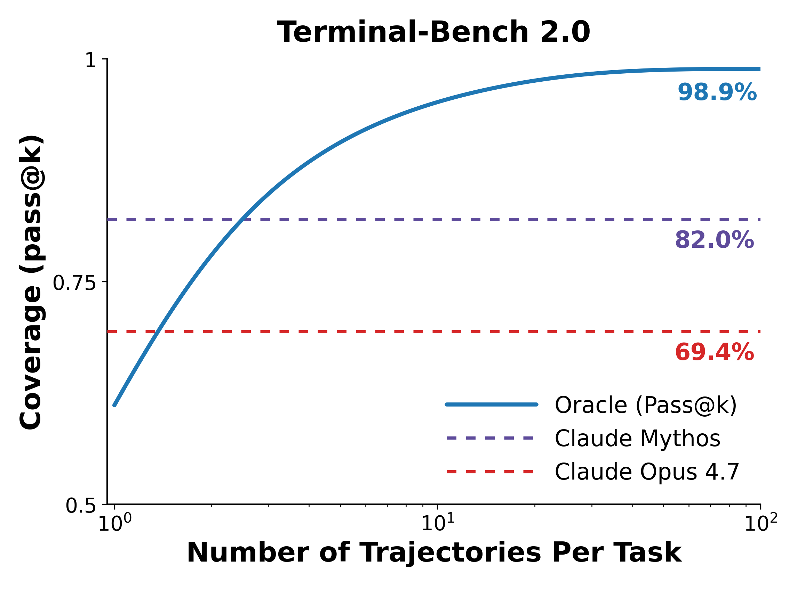
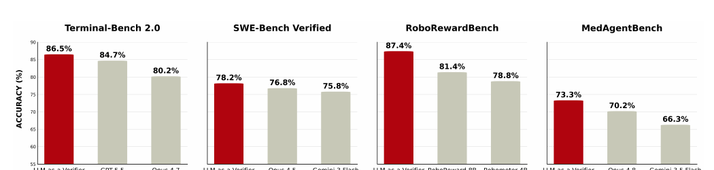
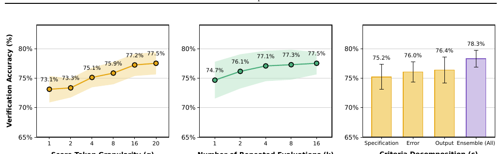
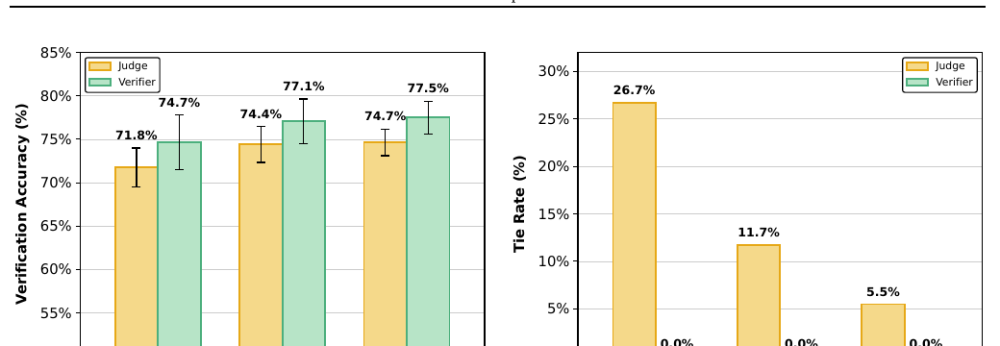
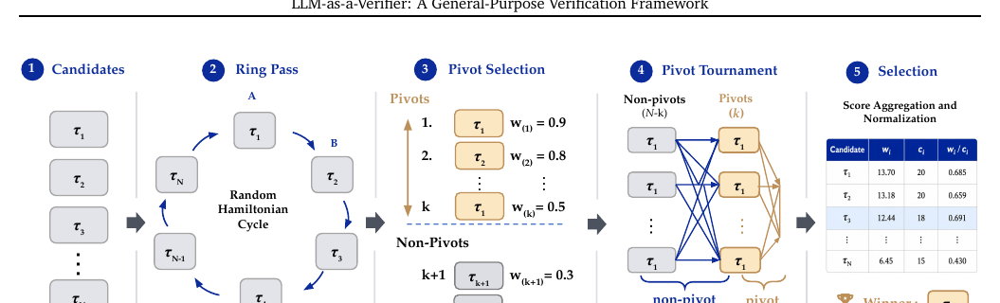

# LLM-as-a-Verifier — Research Note
> [English](./README.md) | **繁體中文**

## 📇 Academic Context

| Field | Value |
|-|-|
| Title | LLM-as-a-Verifier: A General-Purpose Verification Framework |
| Venue | arXiv preprint (2607.05391v2, cs.AI) |
| Year | 2026 |
| Authors | Jacky Kwok, Shulu Li, Pranav Atreya, Yuejiang Liu, Yixing Jiang, Chelsea Finn, Marco Pavone, Ion Stoica, Azalia Mirhoseini (Stanford / UC Berkeley / NVIDIA Research) |
| Official Code | https://github.com/llm-as-a-verifier/llm-as-a-verifier |
| Venue Kind | paper |
| Venue Tier | unknown |
| Peer-review status | Not peer-reviewed (arXiv preprint; camera-ready may differ) |
| Citation count | unavailable |

> 本筆記依據 arXiv 全文 `2607.05391v2`（2026-07-24 取得）與官方程式庫的**靜態**閱讀撰寫，未執行任何論文程式碼。

## Introduction

當一個 coding agent 對同一題跑五次，其中至少一次寫出正確補丁的機率往往很高——但你事後**不知道是哪一次**。這篇論文把這個缺口正式命名為一條新的擴展軸：**verification（驗證）**。作者在 Terminal-Bench V2 上量出這個缺口有多大：把整個排行榜的軌跡匯集起來、假設有一個永遠選對的 oracle verifier，Pass@N 可達 98.9%，幾乎解掉整個 benchmark；瓶頸不在生成，而在「從一堆候選裡挑出對的那一條」。

論文要解的具體問題是：**在不做任何額外訓練的前提下，用一個現成 LLM 當 verifier，把 best-of-N 選擇做得夠準，逼近 oracle 上限。** 核心觀察是傳統 LLM-as-a-Judge 的失敗模式——它要模型吐出一個離散分數 token（例如 1–5 分裡的「5」），取機率最高的那顆 token 當最終分數，於是把整個評分機率分佈壓成一個整數。在 Terminal-Bench 上，這種粗粒度評分導致約 27% 的軌跡對「打成平手」（同分），verifier 根本無法分辨誰對誰錯。

作者的高階解法只有一句話：**不要取 argmax，取期望值。** 對同一組 score token 的機率分佈求期望，就得到連續分數；接著沿三條軸擴展這個連續訊號——(1) score granularity（分數 token 數 $G$）、(2) repeated evaluation（重複評估次數 $K$）、(3) criteria decomposition（把單一評分準則拆成 $C$ 個子準則）。為了讓「對所有候選兩兩比較」在預算上可行，論文再提出 **Probabilistic Pivot Tournament (PPT)**，把選擇成本從 $\mathcal{O}(N^2)$ 降到 $\mathcal{O}(Nk)$。

**如何衡量成功**：把 verifier 當作 trajectory reward model，在四個 benchmark 上做 best-of-N 選擇——coding 的 Terminal-Bench V2 與 SWE-Bench Verified、robotics 的 RoboRewardBench、medical 的 MedAgentBench。主要指標是選擇後的任務成功率（RoboRewardBench 則是 pairwise preference accuracy），對照組是 Pass@1、oracle Pass@N 上限，以及離散 LLM-as-a-Judge 與已訓練的 reward model。此外還量測 Value-Order Correlation（VOC，進度追蹤）與 RL 的 sample efficiency。論文宣稱在四個 benchmark 上都達到 state-of-the-art：Terminal-Bench V2 86.5%、SWE-Bench Verified 78.2%、RoboRewardBench 87.4%、MedAgentBench 73.3%。

## First Principles

### 從 argmax 到期望值：離散 judge 與機率 verifier 的數學差異

先把物件定義清楚。一個 verifier 面對任務 prompt $x$、一條軌跡 $\tau$（agent 與環境互動的完整序列 $s_1,a_1,\dots,s_H,a_H$）。傳統離散 judge 讓語言模型輸出一顆評分 token，取機率最高者當分數，形式上是 $R_{\mathrm{LM}}(x,\tau)\in\{1,\dots,G\}$，解析度只有 $1/G$。

LLM-as-a-Verifier 保留同一個評分 prompt，但改讀模型在評分位置的 logprob 分佈，對其求期望：

$$
R(x, \tau) = \frac{1}{CK} \sum_{c=1}^{C} \sum_{k=1}^{K} \sum_{g=1}^{G} p_{\theta}(v_g \mid x, c, \tau)\,\phi(v_g)
$$

其中 $V_{\mathrm{score}}=\{v_1,\dots,v_G\}$ 是一組有序的評分 token，$\phi(v_g)$ 把每顆 token 映到一個純量分數，$p_\theta(v_g\mid x,c,\tau)$ 是模型指派給該 token 的機率，$C$ 是準則數、$K$ 是重複次數、$G$ 是粒度。這條式子把三個求和分別對應到三條擴展軸。

關鍵的實作細節（在官方程式碼 `llm_verifier/fine_grained_reward.py` 裡）值得點出：評分並非用數字 1–20，而是用**字母 A–T 這 20 顆 token**，映射為 A=20（最好）到 T=1（最差）。論文自己在 prompt 註記中說明原因——「用字母刻度而非數字，是為了讓 logprob 抽取能支撐粒度擴展」。這是因為 API 每個位置只回傳 top-20 logprobs：把 20 個分數等級各自對應一顆獨立字母，就能一次拿到整條分佈；若用多位數字，token 化會把「17」拆成「1」「7」兩顆，分佈就對不齊。

一個具體的期望值計算（數字為說明用途，非論文原文）：假設 verifier 在評分位置給 $p(\text{A})=0.6,\ p(\text{B})=0.3,\ p(\text{C})=0.1$，對應純量 20、19、18。離散 judge 只會輸出 A，正規化後得 1.0；而期望值為 $0.6\times20+0.3\times19+0.1\times18=19.5$，正規化 $(19.5-1)/(20-1)=0.974$。兩條都「四捨五入到 A」的軌跡在離散 judge 下必然平手，但連續分數能區分 0.974 與 0.951 的差別——這正是消除平手的來源。

得到連續分數後還有一個容易被略過、但數值上很關鍵的步驟：論文**先**把 $R(x,\tau)$ 用線性映射 $R\mapsto(R-\phi_{\min})/(\phi_{\max}-\phi_{\min})$ 正規化到 $[0,1]$，**再**把兩條軌跡正規化後的分差餵進 Bradley–Terry 的 sigmoid：

$$
P(\tau_i \succ \tau_j \mid x) = \frac{1}{1+\exp\!\big(-(R(x,\tau_i)-R(x,\tau_j))\big)}
$$

這個 $[0,1]$ 正規化不是修辭——上面 worked example 裡 0.974、0.951 那組數字就是正規化後的值（原始期望 19.5、19.1 落在 1–20 尺上）；官方 `pivot_tournament.py` 的 `bradley_terry` docstring 也明寫「p(a beats b) under the Bradley-Terry model on rewards in [0, 1]」，`extract_score` 在回傳前就已把期望 map 回 $[0,1]$。若直接把未正規化的 1–20 期望丟進 sigmoid，分差動輒好幾個單位，sigmoid 會飽和成近乎硬性的 0/1 偏好，反而丟掉連續分數帶來的細緻度。

### 三條擴展軸各自對付哪一種誤差

三條軸不是同一件事的三種說法，而是針對 reward 估計中三種不同的誤差來源：

- **Score granularity $G$**：對付「解析度」誤差。把 $G$ 從 1 加到 20，pairwise verification accuracy 從 73.1% 升到 77.5%。論文用一個 signal-to-noise ratio $\mathrm{SNR}(G)=\mathbb{E}[s_c-s_i]/\sqrt{\mathrm{Var}(s_c-s_i)}$（正確軌跡分數 $s_c$ 減錯誤軌跡分數 $s_i$）來解釋：$G$ 從 1 到 20，SNR 從 0.775 升到 0.799。注意——這是**很小**的 SNR 變化（約 +3%），卻對應到 +4.4 點 accuracy，兩者的因果強度值得存疑（見 Critical Assessment）。
- **Repeated evaluation $K$**：對付「單次評估的變異」。$\frac{1}{K}\sum_k R^{(k)}$ 是期望 reward 的 Monte Carlo 估計，變異以 $\mathcal{O}(1/K)$ 收縮但 bias 不變。$K$ 從 1 到 16，accuracy 從 74.7% 升到 77.5%，且報酬遞減——論文坦言「額外評估因困難樣本上的相關偏差而收益遞減」。這條軸也能跨模態遷移到 robotics：在 RoboRewardBench 上，同一套重複評估把軌跡偏好準確度隨 $K$ 一路推到 $K=8$ 的 87.4% 後飽和。但這裡有一個文字與圖不一致、值得讀者自己核對的地方：論文正文與圖說都寫「$K=1$ 為 81.5%、在**所有預算**下都贏過已訓練 baseline」，然而同一張圖上藍線的起點肉眼看約 **79.8%**，落在 RoboReward-8B 的 81.4% 參考線**之下**——也就是說在 $K=1$ 這個最省的預算點，verifier 其實**輸給** RoboReward-8B，要到約 $K=2$ 才交叉超車。所以正確的說法是「重複評估後超車並拉開」，而非「全程壓過」。

- **Criteria decomposition $C$**：對付「單一準則是壞代理」的問題。對 code agent，把「這條軌跡對不對？」拆成三個子準則——Specification（是否滿足所有需求）、Output（最終輸出格式是否符合）、Errors（log/工具輸出中是否有未解錯誤訊號）。任一單準則 75.2%–76.4%，三者 ensemble 達 78.3%。這三個準則在官方程式庫 `criteria/terminal_bench.md` 中逐字對應。

上圖右側是全篇最有力的一張圖：離散 judge 在 $K=1$ 時有 26.7% 的比較打成平手，靠重複評估的平均化才慢慢降到 $K=16$ 的 5.5%；連續 verifier 則**恆為零平手**。這說明 judge 用大量重複評估換來的，主要只是「把平手打破」，而 verifier 一次就拿到更強的訊號。

### 一個真實的 worked example：`query-optimize`

論文用 Terminal-Bench V2 的 `query-optimize` 任務具體展示粒度的作用（軌跡由 Claude Opus 4.5 在 OpenHands harness 下產生，Gemini 2.5 Flash 評分）。任務是把一條慢的 SQL 查詢改寫成等價的快查詢。兩條候選都產出更快的查詢，但驗證程序不同：正確的那條老實等原查詢在標準資料庫上跑完整整 5 分鐘再做 `diff`；失敗的那條從未在資料庫上驗證等價性，反而另建了一個資料庫。

Gemini 2.5 Flash 其實能識破這個失敗模式，但它用的是「稍微乾淨一點」「略為直接」這類含糊、graded 的措辭。當跑 100 次重複評估時：

| 方法 | $\#(s_c > s_i)$ 選對 | 平手 (tie) | $\#(s_c < s_i)$ 選錯 |
|-|-|-|-|
| Judge（離散，$G{=}5$，取 argmax） | 12/100 | **88/100** | 0/100 |
| Verifier（連續，$G{=}5$，取期望） | 69/100 | 0/100 | 31/100 |
| Verifier（連續，$G{=}20$） | **77/100** | 0/100 | 23/100 |

離散 judge 在 88/100 次把兩條打成平手；對**同一組** 1–5 分佈取期望就把平手全消掉、69 次選對；把粒度加到 20 進一步升到 77 次選對。這張表把「argmax → 期望」的價值講得最清楚。

### Probabilistic Pivot Tournament：把選擇成本壓到 O(Nk)

有了 pairwise 偏好，最直觀的選法是 round-robin：對所有 $\binom{N}{2}$ 對兩兩比較、累積 soft win $w_i \mathrel{+}= P(\tau_i\succ\tau_j)$。但這是 $\mathcal{O}(N^2)$，$N$ 一大就吃光 verifier 預算。PPT 用三步把它降到 $\mathcal{O}(Nk)$（$k\ll N$ 個 pivot）：

1. **Ring pass**：抽一個隨機 Hamiltonian cycle，只評分環上 $N$ 對相鄰候選。因為是單一環，每個候選**恰好一次在 A 位、一次在 B 位**，於是模型對「A/B 誰先呈現」的位置偏好在期望上相互抵消。這是 PPT 處理 positional bias 的機制——不是靠 debias prompt，而是靠對稱的比賽結構。
2. **Pivot selection**：按 ring pass 的平均偏好 $w_i/c_i$ 排序，取前 $k$ 名當 pivot 集合 $\mathcal{P}$。把 pivot 選在經驗上的領先者身上，等於把剩餘預算花在「最可能是對的」候選之間的區分上，而非浪費在明顯弱的候選。
3. **Pivot rounds**：只比 (i) 每個 non-pivot 對 pivot、(ii) pivot 兩兩之間。所有比較累進同一組 $w_i,c_i$，最後取 $\arg\max_i w_i/c_i$。除以 $c_i$ 是為了抵消「pivot 參與比較次數較多」的偏差。

總比較數為

$$
N + k(N-k) + \binom{k}{2}
$$

隨 $N$ 線性成長。舉例 $N=20,\ k=5$：$20 + 5\times15 + 10 = 105$ 個查詢對（論文稱 pairwise comparisons，每對一次 query 同時取 `<score_A>` 與 `<score_B>`），相對 round-robin 的 $\binom{20}{2}=190$。官方程式碼 `llm_verifier/pivot_tournament.py` 的 `select_best` 逐行實作這三步，預設 pivot 數 $k=2$。

在 89 題、每題 20 條候選的 Terminal-Bench V2 設定下，PPT 的預算–準確度取捨如下（節錄自 appendix 表）：

| 方法 | 查詢對數 | 選擇準確度 (%) |
|-|-|-|
| pass@1 | — | 52.64 |
| V1（$3N$ 預算） | 4,200 | 65.62 |
| PPT $k{=}3$ | 4,723 | 66.17 |
| PPT $k{=}5$ | 6,609 | 66.27 |
| PPT $k{=}9$ | 9,630 | 67.13 |
| Full Round-Robin | 13,111 | 67.42 |

關鍵是看清 PPT 買到了什麼：$k=5$ 用約**一半**預算（6,609/13,111 ≈ 50%）拿到 66.27%，仍比 full round-robin **低 1.15 點**（67.42）；把 pivot 加到 $k=9$ 用約 73% 預算（9,630/13,111）拿到 67.13%，這才把差距縮到僅 **0.29 點**。而相對 V1（$3N$ 預算，65.62%）的增益也很薄：$k=5$ 只多 0.65 點（卻多用 2,409 個查詢對）、$k=9$ 多 1.51 點。換言之 PPT 是「用線性預算逼近 round-robin」而非「更準」的方法（見 Critical Assessment）。

### Verifier 分數作為進度代理與 RL dense reward

同一個連續分數還有兩個延伸用途。其一是 **task progress**：對成功軌跡的每個 prefix 打分，用 Spearman rank correlation（Value-Order Correlation, VOC）量測「分數是否隨時間步單調上升」。在 Terminal-Bench V2 上，成功軌跡 VOC 0.848、失敗軌跡 0.769，兩者僅差 0.079；robotics 的 RoboRewardBench 上 VOC 達 0.966，勝過已訓練的 RoboReward-8B（0.877）。其二是 **dense reward for RL**：把 $\rho_t=R(x,\tau_{1:t})$ 當 shaped reward 餵給 DSRL-SAC（LIBERO `ketchup` 任務，約 1.8× sample efficiency，最終成功率 0.76 vs 0.69）與 GRPO（Qwen3-8B on MATH，約 1.1×）。

有兩點值得一提。其一，成功軌跡（綠線）並非嚴格單調：它在中段有數次可見的回落（約 0.61→0.585→0.605→0.59）才在結尾跳到 1.0——這正說明 VOC 用的是 Spearman **rank** correlation 而非要求逐步遞增，容得下幾次小回落仍拿到 0.848 的高相關。其二，失敗軌跡（紅線）分數並非完全停滯，而是仍緩步爬到約 0.36——這對應下文 Critical Assessment 指出的 VOC 疑慮：verifier 對失敗軌跡也給出帶上升趨勢的分數。

值得注意的是官方程式庫 `llm_verifier/progress.py` 的 docstring 自己承認：離線 `track` 在替每個 checkpoint 打分時，verifier 看得到**整條軌跡**（含結尾），「早期 checkpoint 原則上可能被可見的結尾影響」；只有線上 `ProgressTracker` 逐步餵入才在結構上看不到未來。這對 VOC 的解讀是重要保留（見下）。

## 🧪 Critical Assessment

### 問題是真的，但 headroom 被匯集式取樣灌了水

「verification 是瓶頸」這個問題是真實且重要的——best-of-N 的 oracle 上限確實遠高於 Pass@1。但論文開篇最醒目的 98.9% oracle 數字，是「把整個 Terminal-Bench V2 **排行榜**上各家模型的軌跡匯集起來」後的 Pass@N，並非單一生成策略的能力。而實驗表裡同一 benchmark、單一策略（GPT-5.5）的 oracle Pass@5 只有 92.1%。用跨模型匯集的 98.9% 當作 motivation，再用單模型的 92.1% 當實驗上限，等於用一個不可實現的頭room 誇大了「可回收的空間」。

### SOTA 增益偏小，且四張長條圖混用了不可比的指標

把 headline 拆開看，verifier 相對 Pass@1 的實際增益其實不大：Terminal-Bench 83.1→86.5（+3.4）、SWE-Bench 76.1→78.2（+2.1）、MedAgentBench 70.2→73.3（+3.1）。以「回收 oracle headroom 的比例」計，SWE-Bench 只回收了 $(78.2-76.1)/(84.4-76.1)\approx25\%$。更關鍵的是 Figure 1 那張「SOTA」長條圖把四個 benchmark 並排，但 RoboRewardBench 的 87.4% 是 **pairwise preference accuracy**（判斷兩段影片誰進度多），與其他三者的**任務成功率**不是同一種量；把 preference accuracy 和 task success rate 放進同一張 SOTA 圖，是 apples-to-oranges 的呈現。此外 Terminal-Bench 的「SOTA」是拿「GPT-5.5+Capy+verifier」去比排行榜上**不同 harness、不同基模**的條目（如 GPT-5.5+NexAU-AHE 84.7%），harness、基模、verifier 三者同時變動，無法把功勞乾淨地歸給 verifier。RoboRewardBench 的「全程領先」宣稱也有一個文字與圖不符的細節：正文寫 $K=1$ 為 81.5%、在每個預算下都贏過已訓練 baseline，但同一張圖的藍線起點約 79.8%，在 $K=1$ 時其實落在 RoboReward-8B 的 81.4% 之下、要到約 $K=2$ 才超車——「零樣本、無需訓練就全面碾壓已訓練模型」這個最搶眼的敘事，在最省的單次預算點上並不成立。

### 相關 verifier 偏差與 self-preference 風險未被正面處理

驗證訊號的可信度取決於 verifier 與生成者是否獨立。SWE-Bench 的候選池包含 Gemini 3 Flash，而 verifier 正是同家族的 Gemini 2.5 Flash——同族模型間的 self-preference bias 是 LLM-as-a-Judge 文獻的已知問題，論文未針對此做對照。repeated evaluation 也只能消去獨立雜訊，對「verifier 系統性地偏好某類寫法」這種**相關**偏差無能為力——論文自己在 $K$ 擴展處承認困難樣本上的收益因「correlated biases」而遞減，等於默認了這條軸的天花板。

### 「訓練無關、通用」的框架其實有兩個隱藏依賴

第一個是 **token-level logprobs**：整個方法建立在能讀到評分位置的分佈上，而 GPT-5.5、Claude Opus 4.7 等前沿模型的公開 API 並不回傳 logprobs。論文的 two-stage workaround（讓封閉模型產生 reasoning、再由一個**能回傳 logprob 的 API verifier**——論文與程式碼都用 Gemini 2.5 Flash——讀 logprob 算連續分數）能回收大部分增益。這裡要糾正一個常見誤解：論文把這個 verifier 稱作「open verifier」，指的是它的 **logprob 對外開放可讀**，並非開源模型——Gemini 2.5 Flash 是 Google 的閉源模型，官方實作 `fine_grained_reward.py` 也是透過 `VERTEX_API_KEY` 走 Vertex AI 取用（`genai.Client(vertexai=True, ...)`，且註解明寫「Only Vertex AI is supported」）。所以「通用」是有條件的：你得先有一個願意回傳 token-level logprob 的後端（自架 vLLM/SGLang，或 Vertex 這類商用 API），而非隨便一個前沿模型都能插上。程式碼層面還有一個更細的落差：`extract_score` 取的是 **top-20 logprobs 中落在有效分數 token 上、再重新正規化**的期望（`expected = sum(v*p)/total_p` 後再 map 到 $[0,1]$），並非論文字面上「整條分佈」的期望；而且 $G=20$ 的上限根本是 API `top_logprobs=20` 這個硬限制決定的（程式碼註解直書「the OpenAI API caps this at 20」），不是自由選的擴展軸。當後端拿不到 logprob 時，程式碼預設把該次比較記為 0.5/0.5 平手（`on_error="tie"`，`fine_grained_reward.py:541-613`），且該平手只寫進當次結果、不落盤快取（避免暫時性 API 錯誤變成永久假平手）。這不是完全「靜默」：預設 `progress=True` 下，前三個錯誤會被 `print` 出來、進度條也持續顯示累積錯誤數；也不是「退化成隨機」——PPT 對相等的平均偏好與最終分數是以候選 index 遞增做決定性 tie-break（`pivot_tournament.py:67-74` 的 `select_pivots` 以 `i` 為次鍵、`87-105` 的 `select_best` 以 `-i` 為次鍵）。所以整批比較都失敗時，選擇不會隨機化，而是決定性地退回最低 index 的候選——等於一個不含資訊的預設值，而非亂數。

第二個是 **hand-designed criteria**：criteria decomposition 對每個 domain 手寫子準則（論文也把「準則能否自動生成」列為 future work）。所以「plug-and-play、無需 per-domain fine-tuning」在 criteria 這一層並不完全成立。

### VOC 建立了時間相關，但不等於語義進度

VOC 量的是「verifier 分數的排序」與「時間步的排序」之間的 Spearman 相關。這裡有一個 chronological-correlation ≠ semantic-progress 的陷阱：一個只要「後面的 prefix 內容更多、看起來更完整就給更高分」的 verifier，也會拿到高 VOC，卻未必真的理解任務進度。兩個數字加深這個疑慮：(1) 成功與失敗軌跡的 VOC 只差 0.079（0.848 vs 0.769），意味著 verifier 對**失敗**軌跡也給出相當單調上升的分數——這削弱了論文宣稱的「early-warning／可在寫壞磁碟前 rollback」的用途；(2) 程式碼自承離線評分時 verifier 看得到結尾，存在資訊洩漏，用它算出的 VOC 可能高估了「僅憑前綴」的進度判斷力。論文把 VOC 稱為「calibrated estimator of task progress」，這個 label 下得偏強。

### RL 與成本證據偏薄

RL 部分的證據面很窄：off-policy 只在 LIBERO 的**單一** `ketchup` 任務（n=5 seeds）上得到 1.8×，on-policy 在 MATH 上僅 1.1×（約省 10% optimizer steps）。以「dense reward 改善 RL」這麼大的宣稱而言，單任務、小增益的證據不足以支撐通用結論。成本上，一次 MedAgentBench 選擇（$N=5,\ C=3,\ K=8$、PPT 預設 $k=2$）約需 $12$ 個查詢對 $\times\,3\times8=288$ 次 verifier forward pass，每次還要讀 20 logprobs——用近 300 次評分換 +3.1 點，latency 與 token 成本在論文正文未被正面量化。

### 小結

這是一個**方向正確、工程紮實、但被 SOTA 敘事包裝得比實際更強**的貢獻。「argmax → 期望」消除平手的洞見是乾淨且可複用的；PPT 的 ring-based 對稱去偏也優雅。但通用性受制於 logprob 存取、SOTA 圖混用指標、增益普遍偏小、progress/RL 證據偏薄。把它當成「一個好用的、省事的 best-of-N selector」看待是恰當的；把它當成「verification 作為新 scaling law 的定案證明」則言過其實。

## 一分鐘版

- **驗證瓶頸**：模型的困難點常常不在「生成」而在「從一堆候選裡挑對的那一條」。把 Terminal-Bench V2 整個排行榜的軌跡匯集起來、假設有一個永遠選對的完美 verifier，成功率可達 98.9%——潛力充足，卡在選擇。
- **連續評分取代 argmax**：不取機率最高的單一分數 token，而是對整條評分分佈求期望值。在 `query-optimize` 任務裡，離散取 argmax 有 88/100 次把對錯兩條打成平手；對同一組分佈改取期望後平手全消、69/100 次選對。
- **免訓練的增益**：只用現成 LLM 算連續分數、不做任何額外訓練，就能小幅推高任務成功率——Terminal-Bench 83.1%→86.5%、SWE-Bench 76.1%→78.2%。
- **隱藏的 API 依賴（保留意見）**：整套方法建立在能讀到評分位置的 token logprobs 上，而 GPT-5.5 等前沿模型的公開 API 並不回傳 logprobs；程式碼在拿不到 logprob 時會把該次比較記成 0.5/0.5 平手（前幾個錯誤仍會印出、不落盤快取），而 PPT 對全平手是以候選 index 遞增做決定性 tie-break——不會隨機化，而是退回一個不含資訊的最低 index 預設。
- **被包裝得偏強的 SOTA 敘事（保留意見）**：增益其實不大——SWE-Bench 只回收了約 25% 的 oracle headroom；而首頁那張 SOTA 長條圖把 RoboRewardBench 的**偏好準確率**和其他 benchmark 的**任務成功率**混放進同一張圖，並不可直接比較。

## 🔗 Related notes

- [CodingAgentTokenEfficiency](../CodingAgentTokenEfficiency/) — 同屬 coding-agent 的 test-time 工具面向；本篇的 TurboAgent 代理式 best-of-N 與其 token 成本取捨可對照閱讀。
