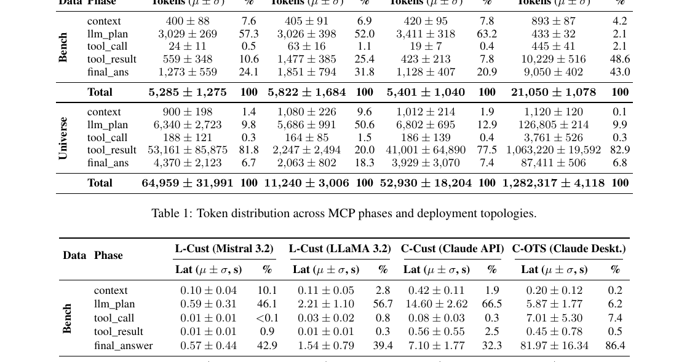

# ProMCP — Research Note
> **English** | [繁體中文](./README.zh-TW.md)

## 📇 Academic Context

| Field | Value |
|-|-|
| Title | ProMCP: Profiling Token Flows and Latency Costs in Model Context Protocol–Based LLM Agents |
| Venue | Findings of ACL 2026 |
| Year | 2026 |
| Authors | Sumera Anjum, Weijian Zheng, Rajkumar Kettimuthu, Heng Fan, Yunhe Feng |
| Official Code | https://github.com/ResponsibleAILab/ProMCP |
| Venue Kind | paper |

## Introduction

The Model Context Protocol (MCP) sets out to solve the `n × m` integration problem of connecting LLMs to tools: n LLM backends each have to be custom-wired to m tools, with every pair requiring a bespoke adapter and prompt glue, making the result hard to reproduce or compare. MCP uses a uniform Host–Client–Server interface so that tools become pluggable, but this paper points out that existing research almost exclusively evaluates whether the *function* succeeds, treating the protocol itself as a black box, and therefore cannot see where token and latency costs are actually spent.

This cost blind spot is a real problem, because for time-sensitive, cost-conscious agent deployments, token consumption and latency are first-order concerns. The extra steps MCP introduces for the sake of standardization (e.g. tool schema discovery and injection) can significantly inflate end-to-end latency and token usage even when they do not change final answer quality. The authors argue that without a stage-by-stage breakdown, one cannot diagnose bottlenecks, compare deployment choices, or design optimizations targeting the real overhead.

ProMCP's high-level solution is an end-to-end profiling and instrumentation framework: it breaks a single tool-augmented interaction into six stages, S1–S6, and uses a Token Tracking Module (TTM) and a Latency Monitoring Module (LMM) to record the token footprint and stage latency of every MCP message. The authors deliberately include session initialization and tools/list discovery in the measurement, so that this hidden "before-the-user-query" protocol cost is not silently amortized away.

On the measurement side, the paper uses two benchmarks, MCP-Bench and MCP-Universe, spanning 20 MCP servers and 169 tools as its workload; and it compares three deployment topologies: L-Cust (local LLM + custom client), C-Cust (cloud LLM + custom client), and C-OTS (cloud LLM + off-the-shelf client, i.e. Claude Desktop). The primary metrics are the per-stage token distribution (Table 1) and latency distribution (Table 2), supplemented by Table 4's tool-call accuracy, execution success, and 1–5 answer quality, confirming that the overhead differences do not sacrifice answer quality.

## First Principles

### The six-stage breakdown and two measurement modules

ProMCP models MCP's execution flow as six stages: S1, the user sends a query into the Host, which forwards it to the LLM (Prompting); S2, the LLM produces a tool plan (Planning); S3, the client validates the plan, assembles the JSON-RPC, and issues the tool call; S4, the server executes the tool and returns the payload; S5, the client packages the tool result (together with schema/context when necessary) back into the LLM input (Context Update); S6, the LLM generates the final response (Answer Synthesis). Each stage records its token footprint and stage latency; in multi-round tool use, S1–S6 repeat and are aggregated per task.

By embedding monitoring modules into the Host–Client–Server loop, ProMCP decomposes one complete tool-invocation interaction into six standard stages. The figure below shows this architecture, along with the observation boundaries of the two measurement modules across the protocol lifecycle.

![Figure 1: ProMCP system architecture and the six-stage flow. On the left are the User and MCP Host (Claude IDE / Ollama Local LLMs); in the middle the MCP Client contains a Session Connector, Plan Validator, and JSON Request Formatter; on the right the MCP Server connects to resources such as Database / API / Web / File System. The upper blue block, the Latency Monitoring Module (LMM), measures Tool Plan Latency (①→②), Tool Execution Latency (③→④), and Final Answer Latency (⑤→⑥); the lower blue block, the Token Tracking Module (TTM), tracks the token footprint across all six stages of the loop.](imgs/figure1-architecture.png)

To make cross-stage costs attributable, ProMCP writes one structured log entry per event, with fields including run_id, task_id, stage index, semantic phase label (e.g. llm_plan, tool_call, final_answer), communication direction, high-resolution timestamp and the derived stage latency, plus token accounting. A key design choice is to split tokens into two classes: LLM usage tokens (prompt/response tokens reported by the provider or computed by a local tokenizer), and protocol token footprint (the size, under the same tokenizer, of MCP artifacts such as schema, JSON tool call, and tool result). This split lets "the protocol-representation cost of verbose schemas" be attributed separately from "model reasoning and generation cost."

The paper renders this split as a structured log entry — for example, an S6 final_answer event records `latency_ms` as 6061.06, `tokens_in` 555, `tokens_out` 321, `tokens_total` 876. Below we use our own notation to write "the total tokens of one task" as the sum of the inputs and outputs over the six stages (this expression is our own summary, not the paper's original):

$$ T_{\mathrm{total}} = \sum_{s=1}^{6} \left( t^{\mathrm{in}}_{s} + t^{\mathrm{out}}_{s} \right) $$

where $t^{\mathrm{in}}_{s}$ in the planning stage (S2) is dominated by the injected tool schema footprint, which is precisely the source of llm_plan's high share in Table 1 later.

### The hidden initialization cost

Before handling any user query, the MCP client must first establish a session with each server: one `initialize` handshake and metadata exchange, one `tools/list` request for the server to expose its available tools as JSON Schema, and one readiness confirmation. This token cost is dominated mainly by the verbose JSON schema (i.e. the `tools_discovery` stage), not by the connection handshake itself.

ProMCP treats session initialization as a first-class part of the MCP lifecycle and records it separately. Measurements show that `tools_discovery` dominates the initialization cost, because the server must serialize and transmit a lengthy JSON schema for each tool; and at the transport layer, HTTP/SSE's initialization latency is clearly lower than STDIO's, because STDIO must spawn a new subprocess cold start on every connection — once the connection is established, schema transmission is bandwidth-bound rather than compute-bound. Still, the latency structure is not as simple as "STDIO is always slower."

![Figure 3: Latency distribution (seconds) of the initialization and tool discovery stages across 20 MCP servers. Red bars are STDIO, blue are HTTP/SSE; light shading is Initialization, dark shading is tools_discovery. Almost all latency in the plot falls in the Initialization stage; tools_discovery is so small under both transports as to be nearly invisible — consistent with the paper's statement that "schema transmission is bandwidth-bound and its latency is negligible." STDIO connections have a substantial cold-start latency (most exceeding 0.8s, with Scientific Computing peaking at about 1.5s), spent mainly on process initialization; HTTP/SSE's Initialization latency varies enormously across servers — Google Maps is near 0, but Google Search's Initialization reaches about 2.35s and NixOS about 1.9s, in fact the two longest bars in the whole plot, clearly exceeding most STDIO servers.](imgs/figure3-latency-initialization.png)

### Worked example: the per-task average profile of C-Cust vs C-OTS

Table 1 / Table 2 both report per-task µ ± σ; below we contrast the average profiles of two topologies, rather than a single observed task. Take C-Cust (Claude API + custom client) on MCP-Bench: a task averages 5,401 tokens, of which llm_plan alone averages 3,411 tokens (63.2%), because the schemas of all 169 tools (such as the Google Maps distance matrix schema in Box 1) are stuffed into the prompt for the model to "reason" over; the actual tool_call averages only 19 tokens (0.4%). The latency side is likewise hijacked by planning: Table 2 reports llm_plan averaging 14.60s, listed as 66.5% of the total 22.76s (the tabulated percentage, not the 64.1% one would get by dividing the two means), meaning the bottleneck is the pre-fill of the prompt/tool definitions rather than tool execution.

By contrast, C-OTS (Claude Desktop) shows a dramatic reversal on the more complex MCP-Universe: each task averages 1,282,317 ± 4,118 tokens (Table 1's µ ± σ, not a single observation), of which tool_result alone averages 1,063,220 tokens (82.9%), mainly because the WebSearch tool injects entire multi-document raw JSON directly into context and retains it across rounds, re-reading it repeatedly. Latency follows, hijacked by the output side: final_answer averages 286.50s, 75.0% of the total 382.05s. Same protocol, swap in one client's orchestration policy, and the cost structure flips from an "input bottleneck" into an "output bottleneck."

The table below places three representative MCP-Bench topologies side by side for the token shares of llm_plan and tool_call: the custom clients (L-Cust, C-Cust) are dominated by planning, while tool_call message serialization itself accounts for only 0.4–2.1% across all three topologies (C-OTS's cost lies elsewhere, with its llm_plan only 2.1% and tool_result taking 48.6%; figures from the paper's Table 1):

| Topology (MCP-Bench) | llm_plan token % | tool_call token % |
|-|-|-|
| L-Cust (Mistral 3.2) | 57.3 | 0.5 |
| C-Cust (Claude API) | 63.2 | 0.4 |
| C-OTS (Claude Desktop) | 2.1 | 2.1 |

### The full token and latency distributions

Table 1 quantifies the overall picture: on the custom clients (L-Cust, C-Cust), llm_plan accounts for 52–63% of tokens on MCP-Bench, a schema-dominated profile; on MCP-Universe, the cost center shifts to tool_result (C-Cust 77.5%, Mistral 3.2 as high as 81.8%), reflecting the heavy retrieval demand of open-ended queries, yet the equally local LLaMA 3.2 lets tool_result take only 20.0%, showing that model behavior differs enormously. C-OTS, meanwhile, exhibits extreme amplification on MCP-Universe, reaching a per-task average of 1,282,317 tokens, roughly 20–114× the per-task averages of the custom settings (Mistral 64,959 / LLaMA 11,240 / C-Cust 52,930), i.e. about 1.3–2.1 orders of magnitude.

Table 2 corresponds to latency: C-Cust has an about-22s baseline even on simple tasks, dominated by llm_plan (14.60s), exposing a lower bound on cloud inference's "first token" latency; C-OTS's total latency stays high throughout (Bench about 95s, Universe about 382s), and is almost entirely contributed by final_answer (Bench 86.4%, Universe 75.0%). Under most configurations, the latency shares of tool_call and tool_result are small (the exception being C-OTS: MCP-Universe's tool_result reaches 58.20s / 15.2%, MCP-Bench's tool_call reaches 7.01s / 7.4%), broadly supporting the paper's core claim that "tool execution is a negligible cost." The authors also report 85–100% tool-call accuracy and 4.06–4.91 answer quality, arguing these overhead differences do not come at the cost of a quality drop.

## 🧪 Critical Assessment

### Is the problem real and does the measurement design hold up?

Protocol-layer efficiency profiling is a real and timely problem: MCP is spreading fast, while the existing functional benchmarks (MCP-Bench, MCP-Universe) do focus on task success and answer-level outcomes, without breaking down which protocol stage the token/latency falls into; even MCP-RADAR, which emphasizes process quality, only describes tool-use behavior along axes such as accuracy and first-error position, explicitly not examining protocol overhead or communication-layer bottlenecks. ProMCP's clear inclusion of this "pre-query" cost — session initialization and tools/list — in the measurement is a valuable contribution. But note that C-OTS's numbers are not real-time instrumentation but a post-hoc reconstruction of the six-stage pipeline from `conversations.json`; the authors themselves concede in the Limitations that this cannot measure millisecond-level jitter or internal retries invisible to the user. C-OTS's final_answer share (e.g. 286.50s) may therefore fold in unattributable waiting, and should not be put on equal footing with the custom clients' real-time measurements.

### Is the topology comparison a fair one?

The thing to watch most is that the "topology" independent variable actually moves several factors at once. L-Cust runs Mistral Small 3.2 24B and LLaMA 3.2, whereas C-Cust/C-OTS run Claude Sonnet 4.5 — the model capability itself already differs; more critically, Table 3's Evaluation Card shows the custom clients turn streaming off with plan/synth token caps of 12K/10K respectively, while C-OTS has streaming enabled and max tokens unconstrained. C-OTS's "output bottleneck" is therefore in substantial part a matter of implementation choices — "streaming + uncapped generation + WebSearch retaining the entire raw JSON" — rather than a necessity of the protocol itself. The paper does in fact note this is an "orchestration policy choice, not a protocol requirement," which is honest, but it also means that describing it as MCP's protocol overhead risks a semantic slippage.

### Statistical robustness and sample size

The sample sizes are on the small side (30 single-server tasks in MCP-Bench, 125 tasks in MCP-Universe), and the variance of some key numbers is large enough to strip the mean of representativeness: for example, Mistral 3.2's tool_result on MCP-Universe is 53,161 ± 85,875 tokens, with a standard deviation larger than the mean, meaning cross-task variance is extremely high and the mean itself is not very representative (whether this is driven by a few outliers or by a multimodal distribution, Table 1 gives only µ ± σ and cannot settle it); treating "tool_result at 81.8%" as a stable characteristic here is fragile. On the latency side, Mistral's llm_plan at 46.84 ± 113.38s is the same. All experiments were also measured on a single Windows 11 workstation, and differences in OS scheduling and STDIO buffer size could change the L-Cust conclusions.

### Novelty, and whether the problem is really "solved"

ProMCP's contribution is essentially instrumentation and measurement, not a new algorithm: what it produces is a descriptive baseline and a direction ("future optimization should target schema orchestration and transport"), without implementing any optimization to prove these bottlenecks can be eliminated. The paper also does not compare against other profilers or alternative stage-decomposition schemes; the six-stage split is a reasonable but author-defined framework, and it is hard to verify whether it is the decomposition that best reveals bottlenecks. It is therefore more of a solid engineering-measurement effort that "measures the cost clearly," while "how to reduce these costs" remains an open question — a reasonable positioning for a Findings paper, but readers should not read it as an already-solved optimization result.

## One-minute version

- Cost blind spot: the extra steps MCP introduces for standardization (e.g. tool schema discovery and injection) can significantly inflate end-to-end latency and token usage even without changing answer quality, making it hard for developers to diagnose the real consumption. Example: on C-Cust with MCP-Bench, merely stuffing the 169 tools' schemas into the prompt for the model to reason over makes llm_plan average 14.60s per task, listed as 66.5% of the total 22.76s (both per-task µ from Table 2).
- Six-stage breakdown: ProMCP splits one tool-augmented interaction into six stages S1–S6, and attributes "model reasoning and generation cost" separately from "the protocol-representation cost of verbose schemas." Example: pure model usage tokens and the protocol footprint of JSON schema/tool call are each recorded as their own class, preventing the protocol-representation cost from being miscounted as model reasoning cost.
- Bottleneck reversal: the cost of actually executing tools is minuscule; the bottleneck lies in the up-front preparation or in result transmission. Example: C-Cust's tool_call is only 19 tokens (0.4%), whereas C-OTS on MCP-Universe, due to heavy retrieval, spends 82.9% of its per-task-average tokens on tool_result.
- Implementation confound: a substantial share of C-OTS's extreme output cost stems from a specific client's implementation choices, not from any necessity of the protocol. Example: C-OTS's output bottleneck comes from streaming + uncapped generation + WebSearch retaining the entire raw JSON, which the paper itself calls an orchestration policy choice rather than a protocol requirement.

## 🔗 Related notes

- [Token-Saving Tools & Papers for Coding Agents](../CodingAgentTokenEfficiency/)
</content>
</invoke>
