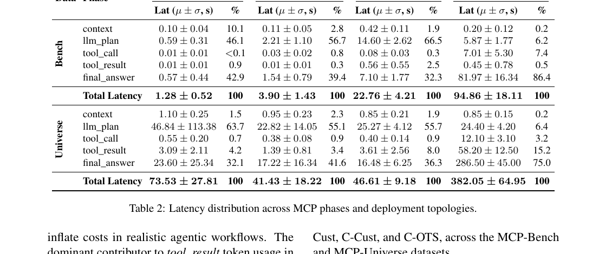

# ProMCP — Research Note
> [English](./README.md) | **繁體中文**

## 📇 Academic Context

| Field | Value |
|-|-|
| Title | ProMCP: Profiling Token Flows and Latency Costs in Model Context Protocol–Based LLM Agents |
| Venue | Findings of ACL 2026 |
| Year | 2026 |
| Authors | Sumera Anjum, Weijian Zheng, Rajkumar Kettimuthu, Heng Fan, Yunhe Feng |
| Official Code | https://github.com/ResponsibleAILab/ProMCP |
| Venue Kind | paper |

## Introduction

Model Context Protocol（MCP）想解決的是 LLM 接工具的 `n × m` 整合問題：n 個 LLM backend 要客製化接到 m 個工具，每組都要 bespoke adapter 與 prompt glue，難以重現與比較。MCP 用一致的 Host–Client–Server 介面讓工具可以隨插隨拔，但這篇論文指出既有研究幾乎只評估「功能是否成功」，把協定本身當成 black box，因此看不到 token 與 latency 到底花在哪裡。

這個成本盲點是真問題，因為對時間敏感、講究成本的 agent 部署而言，token 消耗與 latency 是 first-order concern。MCP 為了標準化而多出的步驟（例如 tool schema discovery 與 injection）即使不改變最終答案品質，也會顯著推高 end-to-end latency 與 token usage。作者主張若不逐階段拆解，就無法診斷瓶頸、比較部署選擇，或設計針對真正 overhead 的優化。

ProMCP 的高階解法是一套 end-to-end profiling 與 instrumentation 框架：它把一次 tool-augmented 互動拆成 S1–S6 六個階段，並用 Token Tracking Module（TTM）與 Latency Monitoring Module（LMM）記錄每一則 MCP 訊息的 token footprint 與 stage latency。作者刻意把 session initialization 與 tools/list discovery 也納入量測，避免這段「使用者查詢前」的隱藏協定成本被默默攤掉。

在衡量方式上，論文用 MCP-Bench 與 MCP-Universe 兩套 benchmark，共 20 個 MCP server、169 個 tool 作為 workload；並比較三種部署拓樸：L-Cust（local LLM + 客製 client）、C-Cust（cloud LLM + 客製 client）、C-OTS（cloud LLM + 現成 client，即 Claude Desktop）。主要 metric 是各階段的 token 分布（Table 1）與 latency 分布（Table 2），並輔以 Table 4 的 tool-call accuracy、execution success 與 1–5 分 answer quality，確認 overhead 差異並未犧牲答案品質。

## First Principles

### 六階段拆解與兩個量測模組

ProMCP 把 MCP 的執行流程建模成六個 stage：S1 使用者把 query 送進 Host 再轉給 LLM（Prompting）；S2 LLM 產生 tool plan（Planning）；S3 client 驗證計畫、組成 JSON-RPC 並發出 tool call；S4 server 執行工具並回傳 payload；S5 client 把工具結果（必要時連同 schema/context）打包回 LLM input（Context Update）；S6 LLM 生成最終回覆（Answer Synthesis）。每個 stage 都記錄 token footprint 與 stage latency，多輪工具使用時 S1–S6 會重複並依 task 聚合。

ProMCP 透過在 Host–Client–Server 迴圈中植入監控模組，把一次完整的工具調用互動拆解為六個標準階段。下圖展示這個架構，以及兩大量測模組在協定生命週期中的觀測邊界。

為了讓跨階段的成本可被歸因，ProMCP 對每個事件寫一筆結構化 log，欄位包含 run_id、task_id、stage index、semantic phase label（如 llm_plan、tool_call、final_answer）、通訊方向、高解析度 timestamp 與衍生的 stage latency，以及 token accounting。一個關鍵設計是把 token 分成兩類：LLM usage tokens（provider 回報或本地 tokenizer 算出的 prompt/response token），與 protocol token footprint（schema、JSON tool call、tool result 這些 MCP artifact 在相同 tokenizer 下的大小）。這個切分讓「verbose schema 的協定表述成本」能和「模型推理與生成成本」分開歸因。

論文把這個切分寫成一個結構化 log entry，例如一筆 S6 的 final_answer 事件記到 `latency_ms` 為 6061.06、`tokens_in` 555、`tokens_out` 321、`tokens_total` 876。以下用我們自訂的記號把「一個 task 的總 token」寫成六個階段輸入輸出的加總（此式為本文整理，非論文原式）：

$$ T_{\mathrm{total}} = \sum_{s=1}^{6} \left( t^{\mathrm{in}}_{s} + t^{\mathrm{out}}_{s} \right) $$

其中 $t^{\mathrm{in}}_{s}$ 在 planning 階段（S2）會被注入的 tool schema footprint 主導，這正是後面 Table 1 中 llm_plan 佔比偏高的來源。

### 隱藏的初始化成本

在處理任何 user query 之前，MCP client 必須先和每個 server 建立 session：一次 `initialize` 握手與 metadata 交換、一次 `tools/list` 請求讓 server 以 JSON Schema 暴露可用工具，以及一次 readiness 確認。這種 token 成本主要由 verbose 的 JSON schema（即 `tools_discovery` 階段）主導，而非連線握手本身。

ProMCP 把 session initialization 當成 MCP lifecycle 的 first-class 部分並單獨記錄。實測顯示 `tools_discovery` 這一步主導了初始化成本，因為 server 必須為每個工具序列化並傳輸冗長的 JSON schema；而在 transport 層，HTTP/SSE 的初始化 latency 明顯低於 STDIO，原因是 STDIO 每次連線都要 spawn 新 subprocess 的 cold start，一旦連線建立後 schema 傳輸則是 bandwidth-bound 而非 compute-bound。不過延遲結構也並非「STDIO 一律較慢」這麼單純。

### Worked example：C-Cust vs C-OTS 的 per-task 平均剖面

Table 1／Table 2 報的都是 per-task 的 µ ± σ，以下用兩個 topology 的平均剖面對照，而非某一個觀測到的 task。以 MCP-Bench 上的 C-Cust（Claude API + 客製 client）為例，一個 task 平均花 5,401 tokens，其中 llm_plan 平均就佔 3,411 tokens（63.2%），因為 169 個工具的 schema（如 Box 1 的 Google Maps distance matrix schema）都被塞進 prompt 讓模型「reason」；真正的 tool_call 平均只有 19 tokens（0.4%）。latency 側同樣被 planning 綁架：Table 2 報告 llm_plan 平均 14.60s，於 total 22.76s 中列為 66.5%（表列百分比，非兩均值相除的 64.1%），等於瓶頸是 prompt/tool 定義的 pre-fill 而非工具執行。

對照之下，C-OTS（Claude Desktop）在較複雜的 MCP-Universe 上出現戲劇性反轉：每個 task 平均耗掉 1,282,317 ± 4,118 tokens（Table 1 的 µ ± σ，非單一觀測值），其中 tool_result 一項平均就佔 1,063,220 tokens（82.9%），主因是 WebSearch 工具把整份 multi-document 原始 JSON 直接注入 context 並跨輪保留、反覆重讀。latency 也隨之被輸出端綁架：final_answer 平均 286.50s，佔 total 382.05s 的 75.0%。同一個協定，換一個 client 的 orchestration policy，成本結構就從「input bottleneck」翻成「output bottleneck」。

下表用 MCP-Bench 的三個代表拓樸並列 llm_plan 與 tool_call 的 token 佔比：客製 client（L-Cust、C-Cust）由 planning 主導，而 tool_call 訊息序列化本身在三種拓樸都只佔 0.4–2.1%（C-OTS 的成本則另有出處，其 llm_plan 僅 2.1%、tool_result 反佔 48.6%；數字取自論文 Table 1）：

| 拓樸 (MCP-Bench) | llm_plan token % | tool_call token % |
|-|-|-|
| L-Cust (Mistral 3.2) | 57.3 | 0.5 |
| C-Cust (Claude API) | 63.2 | 0.4 |
| C-OTS (Claude Desktop) | 2.1 | 2.1 |

### 完整的 token 與 latency 分布

Table 1 量化了整體圖像：在客製 client（L-Cust、C-Cust）上，llm_plan 在 MCP-Bench 佔 52–63% 的 token，屬 schema-dominated profile；到了 MCP-Universe，成本重心搬到 tool_result（C-Cust 77.5%、Mistral 3.2 高達 81.8%），反映 open-ended query 的重度檢索需求，但同為 local 的 LLaMA 3.2 卻只讓 tool_result 佔 20.0%，顯示模型行為差異巨大。C-OTS 則在 MCP-Universe 出現極端放大，per-task 平均達 1,282,317 tokens，約為客製設定的 per-task 平均（Mistral 64,959／LLaMA 11,240／C-Cust 52,930）的 20–114 倍，即約 1.3–2.1 個數量級。

Table 2 對應到 latency：C-Cust 即使在簡單任務也有約 22s 的 baseline，由 llm_plan（14.60s）主導，揭露 cloud 推理的「first token」延遲下限；C-OTS 的 total latency 一路高（Bench 約 95s、Universe 約 382s），且幾乎全由 final_answer 貢獻（Bench 86.4%、Universe 75.0%）。在多數配置下，tool_call 與 tool_result 的 latency 佔比都很小（例外是 C-OTS：MCP-Universe 的 tool_result 達 58.20s／15.2%、MCP-Bench 的 tool_call 達 7.01s／7.4%），大致支撐了論文「tool execution 是可忽略成本」的核心論點。作者同時報告 85–100% 的 tool-call accuracy 與 4.06–4.91 的 answer quality，主張這些 overhead 差異並未換來品質下降。

## 🧪 Critical Assessment

### 問題真實性與量測設計是否成立

協定層的 efficiency profiling 是真實且及時的問題：MCP 正在快速普及，而既有的功能型 benchmark（MCP-Bench、MCP-Universe）確實聚焦在 task success 與 answer-level 結果，沒有拆解 token/latency 落在協定的哪個階段；即使是側重 process quality 的 MCP-RADAR，也只沿 accuracy、first-error position 等軸描述 tool-use 行為，明言不檢視 protocol overhead 或 communication-layer bottleneck。ProMCP 把 session initialization 與 tools/list 這段「查詢前」成本明確納入量測，是有價值的貢獻。但要注意 C-OTS 的數字並非即時 instrumentation，而是事後從 `conversations.json` 重建 six-stage pipeline，作者自己在 Limitations 承認這無法量到毫秒級 jitter 或 user 看不到的 internal retry；因此 C-OTS 的 final_answer 佔比（如 286.50s）可能混入了無法歸因的等待，不宜與客製 client 的即時量測等量齊觀。

### 拓樸比較是否為公平對照

最需要警惕的是「拓樸」這個自變數其實同時綁動了多個因子。L-Cust 跑的是 Mistral Small 3.2 24B 與 LLaMA 3.2，C-Cust/C-OTS 跑的是 Claude Sonnet 4.5，模型能力本身就不同；更關鍵的是 Table 3 的 Evaluation Card 顯示客製 client 關掉 streaming、plan/synth token 上限各為 12K/10K，而 C-OTS 是 streaming 開啟且 max tokens unconstrained。C-OTS 的「output bottleneck」因此有相當比例是「streaming + 無上限生成 + WebSearch 保留整份原始 JSON」的實作選擇，而非協定本身的必然。論文其實也點明這是「orchestration policy choice, not a protocol requirement」，這是誠實的，但也意味著把它敘述成 MCP 的 protocol overhead 有語意滑動的風險。

### 統計穩健性與樣本量

樣本量偏小（MCP-Bench 30 個 single-server task、MCP-Universe 125 個 task），且部分關鍵數字的變異大到讓平均值失去代表性：例如 Mistral 3.2 在 MCP-Universe 的 tool_result 是 53,161 ± 85,875 tokens，標準差大於均值，代表跨 task 的變異極高、平均值本身不太有代表性（至於這是少數 outlier 主導、還是多峰分布，Table 1 只給 µ ± σ、無從斷定），這時把「tool_result 佔 81.8%」當成穩定特徵是脆弱的；latency 側 Mistral 的 llm_plan 46.84 ± 113.38s 同樣如此。全部實驗又只在單一 Windows 11 工作站上量測，OS 排程與 STDIO buffer 大小的差異都可能改變 L-Cust 的結論。

### 新穎性與是否真的「解決」了問題

ProMCP 的貢獻本質是 instrumentation 與 measurement，而非新演算法：它產出的是一個描述性 baseline 與「未來優化該針對 schema orchestration 與 transport」的方向，並沒有實作任何優化來證明這些瓶頸可被消除。論文也沒有和其他 profiler 或替代的階段拆解方案做對照，六階段的切法是合理但作者自定的框架，難以驗證它是不是最能揭露瓶頸的拆法。因此它更像是「把成本量清楚」的紮實工程量測工作，對「如何降低這些成本」仍是 open question——這對一篇 Findings 論文是合理定位，但讀者不宜把它讀成已被解決的優化成果。

## 一分鐘版

- 成本盲點：MCP 為了標準化而多出的步驟（例如 tool schema discovery 與 injection）即使不改變答案品質，也會顯著推高 end-to-end latency 與 token usage，讓開發者難以診斷真實消耗。例子：C-Cust 在 MCP-Bench 上，光是把 169 個工具的 schema 塞進 prompt 讓模型 reason，llm_plan 每個 task 平均就佔 14.60s，於 total 22.76s（皆為 Table 2 的 per-task µ）中被列為 66.5%。
- 六段拆解：ProMCP 把一次 tool-augmented 互動拆成 S1–S6 六個階段，並把「模型推理與生成成本」和「verbose schema 的協定表述成本」分開歸因。例子：純模型 usage token 與 JSON schema/tool call 的 protocol footprint 各記一類，避免協定表述成本被誤算成模型推理代價。
- 瓶頸反轉：真正執行工具的代價微乎其微，瓶頸落在前置準備或結果傳輸。例子：C-Cust 的 tool_call 只有 19 tokens（0.4%），而 C-OTS 在 MCP-Universe 卻因大量檢索，per-task 平均把 82.9% 的 token 花在 tool_result。
- 實作混淆：C-OTS 的極端 output 成本有相當比例源自特定 client 的實作選擇，而非協定本身的必然。例子：C-OTS 的 output bottleneck 來自 streaming + 無上限生成 + WebSearch 保留整份原始 JSON，論文自己也稱這是 orchestration policy choice 而非 protocol requirement。

## 🔗 Related notes

- [Token-Saving Tools & Papers for Coding Agents](../CodingAgentTokenEfficiency/)
