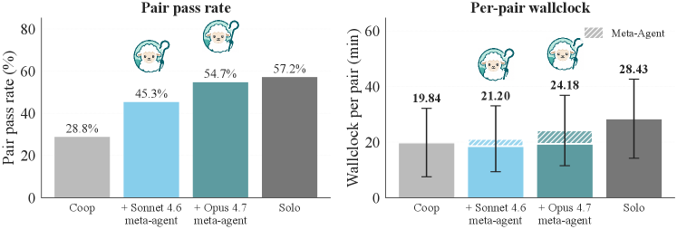
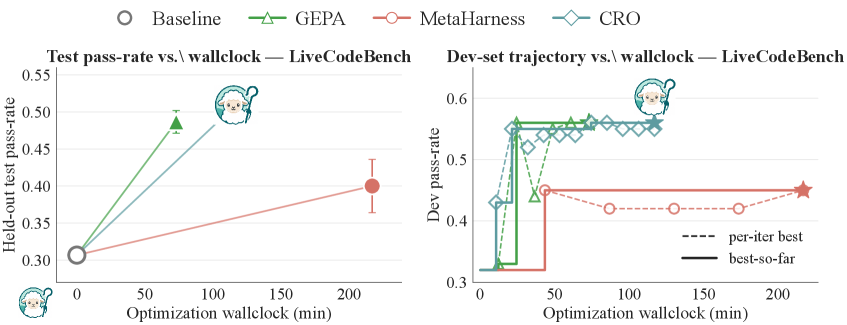

# Shepherd — Research Note
> **English** | [繁體中文](./README.zh-TW.md)

## 📇 Academic Context

| Field | Value |
|-|-|
| Title | Shepherd: Enabling Programmable Meta-Agents via Reversible Agentic Execution Traces |
| Venue | unknown |
| Year | 2026 |
| Authors | Simon Yu, Derek Chong, Ananjan Nandi, Dilara Soylu, Jiuding Sun, Christopher D. Manning, Weiyan Shi (Northeastern University; Stanford University) |
| Official Code | https://github.com/shepherd-agents/shepherd |
| Venue Kind | paper |

Venue is marked `unknown`: this version is an arXiv preprint with no citable formal publication venue or peer-review record. This note is written from arXiv preprint `2605.10913v3` (cs.AI, 2026-06-24 version); if a formal camera-ready appears later, the numbers and arguments may change.

## First Principles

### What this paper solves: meta-agents lack an execution object they can operate on

A long-horizon LLM agent edits files, runs tests, queries databases, calls APIs. When we want to place another agent "on top of it" to supervise, debug, optimize, or train it, we get a **meta-agent**: a higher-order agent with access to and control over another agent and its artifacts. The paper's core observation is that today's agent runtimes expose the result of execution as only two things — the chat transcript and the final environment snapshot. Anyone wanting to supervise has to reconstruct the current state by reasoning backwards from logs; anyone wanting to run a counterfactual experiment has to re-run the whole workflow from scratch; and every meta-agent system ends up rebuilding its own tooling for capturing state, forking, and replaying.

Shepherd's thesis is to make "an agent's execution" a **first-class object**, the way functional programming makes functions first-class objects, so that a meta-agent can hold, observe, fork, and rewrite it just as a higher-order function operates on functions. It lands as a Python substrate, and the capabilities of prior systems compare as follows (paper Table 1): Shepherd fully supports all four of "intercept execution / fork agent+environment / revert to a past state / modify agent behavior," while BranchFS and Docker support only the environment side, and OpenHands and AgentGit support only part of the agent side.

### Four primitives, mapped to git

Shepherd promotes four things to first-class objects: what an agent "is" = **Task**, what an agent "did" = **Effect**, where an agent "runs" = **Scope**, and "what has already been done" = **Execution Trace**. Each maps to a functional-programming construct (typed function, algebraic effect, scoped effect handler, persistent data structure).

Execution history is stored as a content-addressed, Git-like commit graph, and Scope's four operations map directly onto git operations:

```
scope.emit(effect)   <=>  shepherd commit -m "<effect>"
scope.fork()         <=>  shepherd checkout -b <child-branch>
scope.merge(child)   <=>  shepherd merge <child-branch>
scope.discard(child) <=>  shepherd branch -D <child-branch>
```

An effect splits into two events: the **intent** when the agent issues the action, and the **outcome** when the world responds. Because intent and outcome are separated, a supervisor can intervene after the intent appears but before the outcome lands (e.g., on reading a destructive `ToolCallIntent`, call `discard` so the outcome never materializes). Observation is **non-perturbing**: the worker's effect stream is append-only and immutable, and it is byte-for-byte identical whether or not anyone is watching.

Every effect carries a **reversibility tier** that decides whether, once "materialized" (actually executed against the world), it can be undone. In the open-source code this is a three-level enum, composed across nested scopes with "weakest-link" semantics:

```python
class ReversibilityLevel(Enum):
    AUTO = auto()         # Mechanically reversible (git reset, db rollback)
    COMPENSABLE = auto()  # Requires compensation action (send correction email)
    NONE = auto()         # Cannot be reversed (published tweet, sent SMS)
```

That is: filesystem writes and other AUTO effects roll back natively; database writes and other COMPENSABLE effects need a user-provided compensation handler; and model calls, sent emails, and other NONE effects land the moment they are issued, with the trace only able to record them for audit. A nested execution containing even a single NONE gets the whole segment marked NONE — which lets the meta-agent know, before merging, whether this step will leak into the irreversible world.

### The cost of fork/revert: independent of image size

Shepherd's `fork` layers a copy-on-write layer over the existing filesystem rather than copying the whole rootfs, so its cost is independent of image size. This is the root of the framework's cheapness (paper Table 2):

| Image | Method | Fork ↓ | Revert ↓ | Storage ↓ |
|-|-|-|-|-|
| openssl-selfsigned-cert (42 MB) | Full copy | 5,154 ms | 2,067 ms | 268 MB |
| | Docker commit | 658 ms | 749 ms | 30 KB |
| | **Shepherd** | **134 ms** | **142 ms** | **10 KB** |
| pytorch-model-recovery (5.8 GB) | Full copy | 53,462 ms | 25,943 ms | 8.3 GB |
| | Docker commit | 725 ms | 828 ms | 30 KB |
| | **Shepherd** | **143 ms** | **147 ms** | **10 KB** |

Regardless of whether the image is 42 MB or 5.8 GB, fork stays at 134–143 ms (about 2–3% of one agent turn). On the 5.8 GB image, dividing directly from Table 2, fork is a per-branch speedup of `53,462 / 143 ≈ 374×` over a full-rootfs copy, and about `725 / 143 ≈ 5.1×` over `docker commit`; the abstract's "5× faster than `docker commit`" is the latter. One internal numerical inconsistency in the paper is worth flagging: elsewhere in the body the full-copy comparison is written as a "192× per-branch slowdown," but its own Table 2 (same row, 53,462 ms vs 143 ms) computes to ~374×, and the two do not agree; this note adopts the 374× that can be re-derived cell-by-cell from the table, rather than the 192× in the prose that cannot be recovered from it.

### What the KV cache actually reuses

The framework claims to "reuse over 95% of the KV cache" on replay. The mechanism: `fork` preserves the byte-for-byte identical LLM message **prefix** of the parent, so the provider's prompt cache recognizes that prefix and serves it at roughly 10% of the input-token price; the only thing a branch pays for is the divergent **suffix** after the fork point. In other words, what gets reused is the **shared prefix**; once a branch diverges, the subsequent tokens are entirely new compute. The paper itself is explicit about this: "the only cost replay pays is the executed suffix."

The definition of "95%" deserves care. The appendix Table's columns are actually two numbers: **hit%** (whether revert restored the prefix byte-for-byte — a substrate-fidelity check) and **savings%** (the token cost actually saved). Measured with Claude Haiku 4.5 on 8 Terminal-Bench 2.0 tasks, hit% stays around 95% from `K=2` onward, but the average actual savings% is only about 70% (62/71/71/70/68% at K=1/2/4/8/16). The two diverge precisely because the divergent suffix is always new compute, and the per-branch suffix generation grows linearly with K. So ">95% reuse" is about prefix fidelity, and does not equal saving 95% of the cost.

### Three demonstration meta-agents (walked through with the paper's real numbers)

**(A) Runtime supervisor (CooperBench).** Two Claude Haiku 4.5 workers implement complementary features in parallel, each inside its own forked scope; one Claude Sonnet 4.6 or Opus 4.7 meta-agent subscribes to both effect streams and holds three tools: `inject` (push a piece of guidance into a worker session), `handoff` (fork the leading worker's scope into a new root for the lagging one and restart), and `discard` (abort and roll back via `scope.discard()`). On the 479-pair structural-conflict split, the unsupervised coop baseline gets only 28.8% pair pass, the solo ceiling is 57.2%, a gap of 28.4 points; the Sonnet meta-agent pulls it up to 45.3%, and Opus to 54.7%. Walked through with Opus: it fills `(54.7 − 28.8) / (57.2 − 28.8) = 25.9 / 28.4 ≈ 0.91`, i.e., 91% of the "curse of coordination" gap.



The wall-clock overhead is small: solo 28.4 min per pair, coop 19.8 min; Sonnet 21.2 min (meta adds 1.4 min), Opus 24.2 min (meta adds 4.3 min). The paper explicitly calls this a "proof of existence."

**(B) Counterfactual Replay Optimization (CRO).** This is a meta-optimizer: it maintains a pool of workflow variants and their Shepherd execution traces on the training set; a proposer reads the traces to find failure modes and proposes a set of candidate edits to some parent, each edit paired with a **fix set** it must fix and a **guard set** it must not regress on. Validation is by **counterfactual replay** — for each edit, fork the parent's trace at "the first commit the edit would affect" and re-run only the suffix after that, rather than re-running the whole workflow from scratch. Only candidates that beat the parent on fix∪guard enter dev evaluation and join the pool. The executor is GPT-5.4-mini, and the meta-optimizer uses GPT-5.4.

Across five datasets, CRO gets the best test on four (HoVer 79.4, MATH 80.0, LiveCodeBench 51.0, TB2.0 35.2), with wall-clock 27–58% lower than MetaHarness; the only loss is IFBench (MetaHarness 52.3 vs CRO 51.3, within one standard deviation). Walked through with LiveCodeBench (figure below, left): baseline ≈ 30.7, CRO reaches 51.0 in about 117 min, MetaHarness only reaches 40.0 at about 217 min, and GEPA is about 48.7. The abstract's "27.5% higher than MetaHarness" is a relative value: `(51.0 − 40.0) / 40.0 ≈ 0.275`; "TB2.0 higher by 12.8%" is likewise `(35.2 − 31.2) / 31.2 ≈ 0.128`.



CRO's wall-clock savings come from "re-run the suffix + prefix hits the cache," but this reuse rate is not stable. The paper additionally gives the per-proposer-session compute reuse rate on LiveCodeBench (figure below): it is not monotonically increasing but instead **near 0% at cold start and only amortizes upward afterward** — session 1 is only about 1%, climbs to about 45% by session 4, but drops back to about 1% by session 6 (another cold start), then climbs again to about 62% by session 8. This corresponds exactly to what the paper's limitations section says: when an edit touches a component whose "influence propagates widely," the affected suffix is the whole trajectory and the cache saves nothing at all, and this cold-start situation takes two or three sessions to amortize away. In other words, the "re-run only the suffix" saving only shows up as optimization progresses, and does not hold on every round.


**(C) Meta-Agent Guided Tree-RL (Tree-GRPO).** The reward in long-horizon RL is sparse: dozens of steps yield only a single binary signal at the end. The approach: along each root rollout, the meta-agent picks a fork turn and samples K sibling branches forward from that state. Walked through with G=8 roots, K=4: each task produces $G(K{+}1)=8\times5=40$ trajectories, but each root only pays K extra "suffix-only" branch rollouts, because forks are precise and cheap. Credit is split into two layers: prefix actions before the fork point use the standard cross-root GRPO advantage, and suffix actions after it use the group-internal advantage of the K+1 siblings in the same group, directly reflecting how good the local choice was. Result: Qwen3.5-35B-A3B rises from Flat GRPO's 34.2% to 39.4% (+5.2 points), and Nemotron-3-Super-120B-A12B from 33.8% to 37.2% (+3.4 points).


![Training-time raw reward (averaged over the $G{=}8$ roots): left Qwen3.5-35B-A3B, right Nemotron-3-Super-120B-A12B. Tree-GRPO ($K{=}4$, teal) interleaves with Flat GRPO (red) early on and is even lower for parts of the range (Qwen ~step 5–45, Nemotron ~step 20–55), only pulling steadily apart after ~step 50–60 and finishing at a higher reward on both bases; light dots are the flat baseline's measured steps, smooth lines are the denoised trajectory. The paper's original caption says "higher at every rollout step," which does not match the actual early interleaving in the curve; this note adopts the actually-visible trend.](imgs/tree-grpo-train-reward.png)

These two figures are the process evidence for the +5.2 / +3.4 points above: the held-out curves show the gain is not a single-endpoint jitter but a separation that opens up steadily in the mid-to-late training phase (the training-time raw reward still interleaves early, with Tree-GRPO even lower at one point, and only steadies its lead after ~step 50–60); but one should also read the magnitude clearly — the separation band between the two curves is not wide, and this is on the paper's self-chosen Endless Terminals training environment, run on only two open-source bases, so it should not be extrapolated into "Tree-GRPO is generally better than Flat GRPO."

Shepherd additionally mechanizes a small part of the core trace machine (fragments such as Core-0/Core-A) with Lean proofs, providing theorems such as `source_eval_to_machine` (forward simulation), `trace_monotonic` (the trace only appends, never rewrites), and `single_child_branch_replay_sound` (structural soundness of single-child branch replay). The Critical Assessment discusses the boundaries of this in detail.

**(Appendix) A fourth demonstration: post-hoc trajectory compression.** The paper also reports, in the appendix, a downstream use of fork/replay: let the meta-agent read a completed successful trajectory, pick a fork step, write a hint into the system prompt, and replay from that point; if the re-run still passes the same validation while using strictly fewer model calls, it counts as "compression success." Across two worker families (Claude Sonnet 4.6, GPT-5.4) and two benchmarks, 68–82% of successful trajectories can be further compressed, with the average length roughly halved (on SWE-Bench Verified, Sonnet drops from 21.4 steps to 8.9, GPT-5.4 from 19.0 to 8.8; on Terminal-Bench v2.0, 15.8→7.1, 11.4→5.2). This corroborates that "cheap fork/replay" serves not only the three applications in the main paper but also makes it feasible to go back and prune wasted compute after the fact — but it is likewise retrospective, done on already-passing trajectories, and does not change the conclusion of RQ3 (it compresses a path already known to succeed, rather than judging correctness in advance).


## 🧪 Critical Assessment

### Is the problem real: the necessity of the meta-agent abstraction

The need for "agents operating on agents" is real: CooperBench documents parallel coding agents coordinating poorly — sometimes worse than a single agent — the "curse of coordination," while workflow optimizers such as GEPA and MetaHarness are already in production research. Making execution history a git-backed, forkable/revertable first-class object does map onto a set of concrete pain points. This part of the argument is solid, not a manufactured problem.

### Can the supervisor really tell it is drifting, or is it just "a different kind of interruption"

This is the point most in need of unpacking. Shepherd does, **mechanically**, let the meta-agent see every one of the worker's tool calls in real time and non-perturbatively. But "seeing" is not "seeing correctly." The implementation details reveal two limits: first, the supervisor is only invoked every 5 seconds, and what it sees is a **compressed snapshot** — about 150 bytes each time, containing only summaries of the most recent 25 tool calls, with the feature description truncated to 350 characters. It judges on a lossy view. Second, the whole decision is a single LLM judgment (the system prompt explicitly says "decision heuristics, not hard rules — trust your judgement," and repeatedly warns that "over-intervention destroys progress"), with no ground truth against which to check whether this intervention was correct.

More critically, the paper **only provides aggregate pass-rate gains** (28.8% → 54.7%), with no ablation that separates "intervened correctly" from "simply threw a stronger model into the loop." Swapping Sonnet for Opus jumps it from 45.3% to 54.7%, which precisely shows the result is highly sensitive to the meta-agent's own capability — so how much of the gain comes from "seeing the drift correctly" versus "Opus just judges better anyway," the paper does not answer. The honest conclusion for RQ1 is therefore: Shepherd proves that "a supervisor can observe and intervene and bring benchmark-level gains," but it does not prove that "the supervisor's judgment is correct rather than just another way of interrupting." The paper's self-description as a proof of existence is consistent with this.

### What exactly is the KV cache that is claimed reused

As described in First Principles, what is reused is the KV cache of the **shared prefix**, not the entire conversation. If the prefix is the same but the branches diverge, the tokens after divergence are **all new compute** — the paper does not hide this. What really deserves a discount is the "> 95%" façade number: it is prefix-restoration fidelity (hit%), not the money-saving ratio; the actual token savings average only about 70%, and stop increasing as K rises because suffix generation grows linearly. The appendix also admits a harder boundary (see CRO limitations): when an edit touches a component whose "influence propagates widely" (e.g., the system prompt of a tool used at every step), the affected suffix is the whole trajectory and the cache saves nothing — which is exactly the situation of the first cold-start proposer session on every dataset (reuse starts at about 1% and only climbs above 60% after several rounds). So the answer to "is the KV cache really reusable" is: reusable, but only significantly when branches share a long prefix and the edit's blast radius is narrow; treating it as a stable 95% cost saving overstates the benefit.

### The correctness of intervention / revert / correction cannot be guaranteed in advance

RQ3 asks: before a child agent finishes, how does the system confirm that an intervention, revert, or correction is "correct"? From the evidence, the answer is that it **cannot be guaranteed in advance**, and the paper's Lean proofs are not guaranteeing this either. What Lean mechanizes is the **semantic correctness** of the trace machine — that revert restores state byte-for-byte, that the trace only appends and never rewrites, that single-child branch replay is structurally sound — which is "the substrate's mechanical behavior is correct," a completely different matter from "should the meta-agent discard this worker this time." The paper's "Non-claims" section draws this line clearly: the proof envelope does **not** verify Python control flow, model output, prompt-cache state, shell commands, filesystem-change correctness, or even multi-branch replay; the main paper's meta-agent applications "rely on the production substrate plus empirical validation."

So the meta-agent making its own mistakes is a real and unresolved risk. The runtime supervisor has no per-intervention correctness check, only the after-the-fact aggregate benchmark score. CRO is slightly better: the fix/guard set provides a kind of **empirical** advance screening — an edit must beat the parent on this set of examples to graduate — but this is still "measured an improvement on the sampled examples," not a correctness guarantee, and it hinges entirely on whether the causal hypothesis the proposer put forward holds and whether the guard set covers the cases that will be broken. In short: Shepherd makes it so that "if you were wrong, you can roll back cheaply," but it does not make it so that "you know in advance this step is right." What it lowers is the **cost** of intervention, not the **risk** of intervention.

### The extra token bill of revert / replay

RQ4 asks about the extra cost. It has to be seen in two parts. The **observation side** is nearly free: subscribing to the effect stream adds 0 tokens to the worker context (byte-for-byte identical), and the recording overhead of each effect is about 3.1 ms locally (5% of wall-clock). But the **meta-agent side** pays for tokens in hard cash: the runtime supervisor calls the LLM every 5 seconds (each tick's prompt is < 3K tokens, but it adds up over a whole task); CRO's proposer does verbalized sampling to generate hypotheses, each candidate has to replay the suffix on fix∪guard, and the compute of discarded candidates has already been spent too. The paper's limitations section says it bluntly: "for short tasks, the meta-agent's token cost may exceed the worker's own." So revert/replay saves on **recompute** (run only the suffix, prefix hits the cache), but supervision and proposer calls, replayed suffixes, and discarded branches are all net-added cost; whether it is worth it depends on task length and the worker/meta-agent cost ratio. The 27–58% wall-clock savings figure is the **time** relative to MetaHarness, and cannot be read directly as saving the same proportion of tokens or money.

### The cross-validation gap of same-family GPT-5.x, and the amplification of relative %

The evidence leans toward "breadth of demonstration" rather than "rigorous controlled comparison." Each of the three applications runs on only a representative dataset, and the paper itself does not claim optimality of the meta-agent policy or robustness across models/benchmarks. A few concrete caveats: (1) CRO's executor and meta-optimizer are both in the GPT-5.x family, with no cross-provider cross-validation seen, so "same-family models suiting each other" cannot be ruled out; (2) the abstract and intro make heavy use of **relative percentages** (27.5%, 12.8%), while the absolute gains are +11 points and +4 points — relative values look especially large on a low base, and readers should look back at the Table's absolute numbers; (3) on TB2.0, GEPA and MetaHarness fail to beat the baseline at all on the tested subset, so CRO's +4 points is compared against "opponents that could not improve," which discounts its persuasiveness; (4) the runtime supervisor's solo ceiling of 57.2% is itself not high, meaning this benchmark's absolute difficulty is still there, and "filling 91% of the gap" is relative to a rather low ceiling.

### The perspective novelty of treating "execution" as the unit of composition, while the substrate is still an integration of copy-on-write + container checkpoint

The real novelty is in the **perspective**: treating "an agent's execution" rather than "filesystem state" as the unit of composition, giving it a clean semantics with algebraic effects / persistent data structures, and mechanizing the core fragment — this goes a step beyond AgentGit/BranchFS, which treat snapshot/fork as a tool the worker has to actively call (Shepherd's worker is oblivious to all of it). But the boundaries should also be seen clearly: the underlying fork is still an integration of existing mechanisms like OverlayFS copy-on-write + container checkpoint, and performance varies a lot across backends (Modal's gVisor blocks mount, so fork takes 935 ms; Prime Intellect falls back to `cp -a`, taking 57 s on a 6 GB rootfs, unusable for large repos); the Lean proof covers a "small, deterministic" core, and production Python execution defaults to `runtime_only` (without proofs). So it is not an out-of-nowhere new algorithm, but a substrate that fits the right abstraction together with fast-enough engineering and honestly marks the proof boundary — the contribution is real, but do not read "mechanized proof" as "the whole framework has been proven correct."

## One-minute version

- **Problem**: existing agent runtimes only expose execution as a chat transcript and a final environment snapshot, so wanting to supervise or run counterfactual experiments is extremely costly — for example, re-running one workflow means running the whole thing from scratch.
- **Solution**: make "an agent's execution" a git-like first-class object that can be forked/reverted at low cost; fork cost is independent of image size, and forking one branch on a 5.8 GB environment takes only about 143 ms.
- **Results**: all three demonstration applications get benchmark-level gains — CooperBench coordination pass rate 28.8% → 54.7%; CRO gets the best test on four datasets (reaching 51.0 on LiveCodeBench), with wall-clock 27–58% lower than MetaHarness; Tree-GRPO gets +5.2 / +3.4 points on two open-source bases.
- **Blind spot**: the system only lowers the "cost of intervention/rollback," and does not guarantee in advance that the supervisor's judgment is correct; swapping Sonnet for Opus jumps the pass rate from 45.3% to 54.7%, showing the gain depends heavily on the meta-agent's own capability, not on proving that it "saw the drift correctly."
- **Cost**: the claimed "> 95% KV cache reuse" is the fidelity of byte-for-byte prefix restoration (hit%), not the money-saving ratio; tokens after a branch diverges are all new compute, so actual token savings average only about 70%, and approach 0 at cold start.

## 🔗 Related notes

<!-- No safely resolvable related notes under domains/mlops at present; keeping the heading, left empty for now. -->
