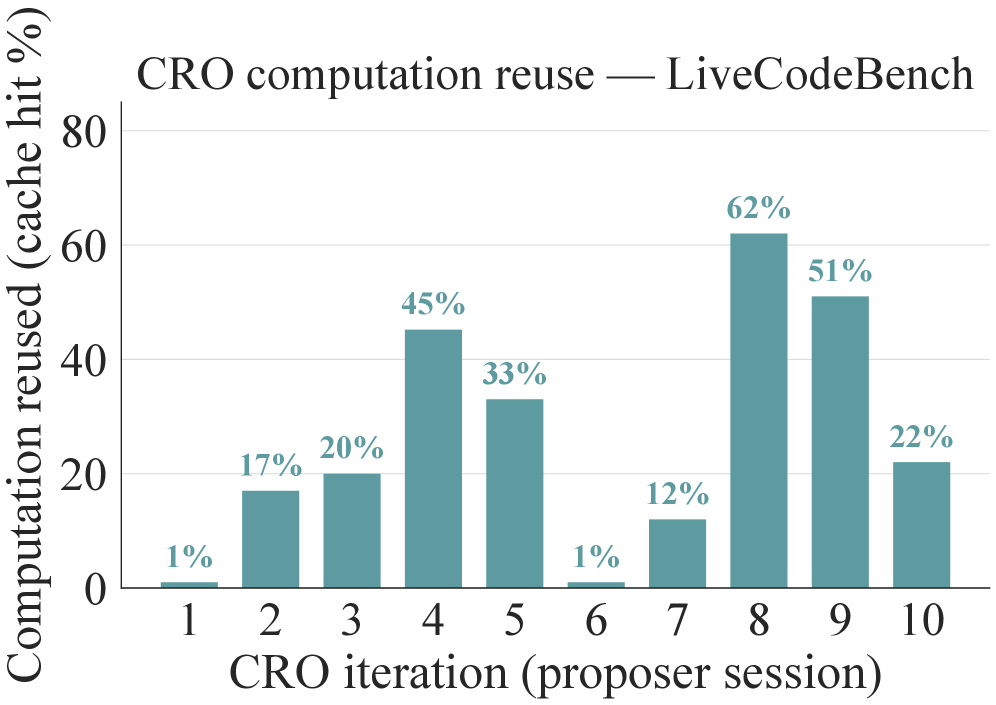
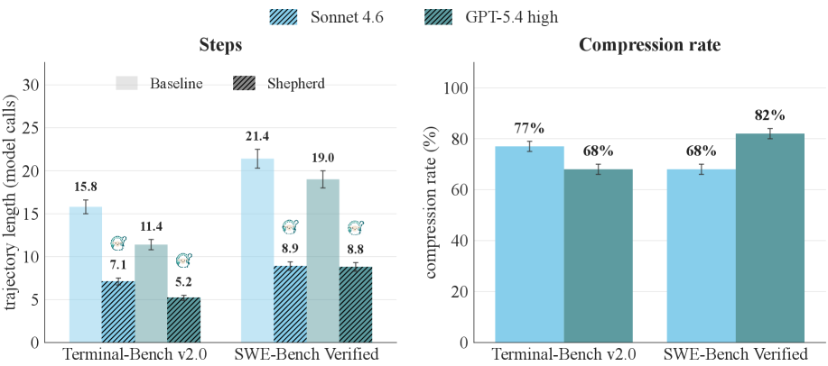

# Shepherd — Research Note
> [English](./README.md) | **繁體中文**

## 📇 Academic Context

| Field | Value |
|-|-|
| Title | Shepherd: Enabling Programmable Meta-Agents via Reversible Agentic Execution Traces |
| Venue | unknown |
| Year | 2026 |
| Authors | Simon Yu, Derek Chong, Ananjan Nandi, Dilara Soylu, Jiuding Sun, Christopher D. Manning, Weiyan Shi(Northeastern University；Stanford University) |
| Official Code | https://github.com/shepherd-agents/shepherd |
| Venue Kind | paper |

Venue 標為 `unknown`:此版本是 arXiv 預印本,無可引用的正式發表場域或同儕審查紀錄。本筆記依據 arXiv preprint `2605.10913v3`(cs.AI,2026-06-24 版)撰寫;若日後有正式 camera-ready,數字與論述可能調整。

## First Principles

### 這篇在解決什麼:meta-agent 缺一個可以操作的執行物件

長時序的 LLM agent 會改檔案、跑測試、查資料庫、呼叫 API。當我們想在它「之上」再放一個 agent 來監督、除錯、最佳化或訓練它時,就出現了 **meta-agent**:一個對別的 agent 及其產物有存取權與操作權的高階 agent。論文的核心觀察是:今天的 agent runtime 只把執行結果暴露成兩種東西——聊天 transcript 與最終環境快照。想監督的人得從 log 反推當下狀態,想跑反事實實驗的人得整條 workflow 從頭重跑,每個 meta-agent 系統都要自己重造一套抓狀態、fork、replay 的工具。

Shepherd 的主張是把「一個 agent 的執行」變成**一等物件**(first-class object),就像 functional programming 把函式當一等物件那樣,讓 meta-agent 能像 higher-order function 操作函式一樣去持有、觀察、fork、改寫它。落地成一個 Python substrate,對照的既有系統能力如下(論文 Table 1):Shepherd 對「攔截執行 / fork agent+環境 / revert 到過去狀態 / 修改 agent 行為」四項都完整支援,而 BranchFS、Docker 只支援環境側,OpenHands、AgentGit 只對 agent 側部分支援。

### 四個原語與 git 對照

Shepherd 把四個東西提升為一等物件:agent「是什麼」= **Task**、agent「做了什麼」= **Effect**、agent「在哪裡跑」= **Scope**、「已經做過什麼」= **Execution Trace**。每個都對映一個 functional programming 構件(typed function、algebraic effect、scoped effect handler、persistent data structure)。

執行歷史被存成一張 content-addressed、Git-like 的 commit graph,Scope 的四個操作直接對映 git 操作:

```
scope.emit(effect)   <=>  shepherd commit -m "<effect>"
scope.fork()         <=>  shepherd checkout -b <child-branch>
scope.merge(child)   <=>  shepherd merge <child-branch>
scope.discard(child) <=>  shepherd branch -D <child-branch>
```

一個 effect 分成兩筆事件:agent 送出動作時的 **intent**,與世界回應時的 **outcome**。因為 intent 與 outcome 分離,監督者可以在 intent 出現、outcome 還沒落地前就介入(例如讀到一個具破壞性的 `ToolCallIntent` 就 `discard`,讓 outcome 永不成真)。觀察是**非擾動**的:worker 的 effect stream 是 append-only 且不可變,不論有沒有人在看,它逐位元組相同。

每個 effect 帶一個 **reversibility tier**,決定它被「materialize」(真正對世界執行)後能不能被撤回。這在開源程式碼裡就是一個三層 enum,並以「最弱者勝」(weakest-link)語意在巢狀 scope 間合成:

```python
class ReversibilityLevel(Enum):
    AUTO = auto()         # Mechanically reversible (git reset, db rollback)
    COMPENSABLE = auto()  # Requires compensation action (send correction email)
    NONE = auto()         # Cannot be reversed (published tweet, sent SMS)
```

也就是說:filesystem 寫入這類 AUTO 效果原生可回滾;資料庫寫入這類 COMPENSABLE 效果要靠使用者提供的補償 handler;而 model 呼叫、寄信這類 NONE 效果在送出當下就落地,trace 只能記錄它供稽核。一條巢狀執行只要含一個 NONE,整段就被標成 NONE——這讓 meta-agent 在 merge 前就知道這步會不會外洩到不可撤回的世界。

### fork/revert 的成本:與 image 大小無關

Shepherd 的 `fork` 是在既有 filesystem 上疊一層 copy-on-write,而非複製整個 rootfs,所以成本與 image 大小無關。這是整個框架便宜的根源(論文 Table 2):

| Image | Method | Fork ↓ | Revert ↓ | Storage ↓ |
|-|-|-|-|-|
| openssl-selfsigned-cert(42 MB) | Full copy | 5,154 ms | 2,067 ms | 268 MB |
| | Docker commit | 658 ms | 749 ms | 30 KB |
| | **Shepherd** | **134 ms** | **142 ms** | **10 KB** |
| pytorch-model-recovery(5.8 GB) | Full copy | 53,462 ms | 25,943 ms | 8.3 GB |
| | Docker commit | 725 ms | 828 ms | 30 KB |
| | **Shepherd** | **143 ms** | **147 ms** | **10 KB** |

不論 image 從 42 MB 到 5.8 GB,fork 都維持在 134–143 ms(約一個 agent turn 的 2–3%)。在 5.8 GB image 上,直接由 Table 2 相除,fork 對 full-rootfs copy 是每分支 `53,462 / 143 ≈ 374×` 的加速,對 `docker commit` 約 `725 / 143 ≈ 5.1×`;論文摘要說的「比 `docker commit` 快 5×」正是後者。值得留意一個論文自身的數字不一致:正文另一處把 full-copy 對比寫成「192× per-branch slowdown」,但它自己 Table 2 的同一列(53,462 ms vs 143 ms)算出來是 ~374×,兩者對不上;本筆記採用可由表格逐格覆核的 374×,而非正文那個無法從表格重推的 192×。

### KV cache 到底重用了什麼

框架宣稱 replay 時「重用超過 95% 的 KV cache」。機制是:`fork` 保留 parent 逐位元組相同的 LLM message **prefix**,於是 provider 的 prompt cache 認得這段 prefix、以約 10% 的 input-token 價格供應它;branch 唯一要付的是 fork 點之後那段發散的 **suffix**。換句話說,被重用的是**共享前綴**;一旦分支方向發散,後續 token 就是全新算力。論文自己也把這點講清楚:「replay 唯一付出的成本是被執行的 suffix」。

要小心的是「95%」的定義。附錄 Table 的欄位其實是兩個數:**hit%**(revert 有沒有把 prefix 逐位元組復原,是一個 substrate 保真度檢查)與 **savings%**(真正省下的 token 成本)。以 Claude Haiku 4.5 在 8 個 Terminal-Bench 2.0 task 上量測,hit% 從 `K=2` 起穩定在約 95%,但實際 savings% 的平均只有約 70%(K=1/2/4/8/16 各為 62/71/71/70/68%)。兩者會拉開,正是因為發散 suffix 永遠是新算力,而且每分支 suffix 生成量隨 K 線性成長。所以「>95% 重用」是就前綴保真度而言,不等於省下 95% 的花費。

### 三個示範 meta-agent(用論文的真實數字走一遍)

**(A) Runtime supervisor(CooperBench)。** 兩個 Claude Haiku 4.5 worker 在各自 fork 出來的 scope 裡並行實作互補功能;一個 Claude Sonnet 4.6 或 Opus 4.7 meta-agent 訂閱兩者的 effect stream,擁有三個工具:`inject`(推一則 guidance 進 worker session)、`handoff`(把領先 worker 的 scope fork 成落後者的新根並重啟)、`discard`(用 `scope.discard()` 中止並回滾)。在 479 對的結構性衝突 split 上,無監督的 coop baseline 只有 28.8% pair pass,solo 天花板 57.2%,兩者差 28.4 分;Sonnet meta-agent 拉到 45.3%,Opus 拉到 54.7%。以 Opus 走一遍:填補了 `(54.7 − 28.8) / (57.2 − 28.8) = 25.9 / 28.4 ≈ 0.91`,即 91% 的「協調詛咒」缺口。


wall-clock 開銷不大:solo 每對 28.4 min,coop 19.8 min;Sonnet 21.2 min(meta 額外 1.4 min)、Opus 24.2 min(meta 額外 4.3 min)。論文明確稱此為「proof of existence」。

**(B) Counterfactual Replay Optimization(CRO)。** 這是一個 meta-optimizer:維護一池 workflow 變體與它們在訓練集上的 Shepherd 執行 trace;proposer 讀 trace 找失敗模式,對某個 parent 提出一組候選 edit,每個 edit 配一個要修好的 **fix set** 與不得退步的 **guard set**。驗證方式是**反事實 replay**——對每個 edit,在「該 edit 首個會被影響到的 commit」fork parent 的 trace,只重跑之後的 suffix,而不是整條 workflow 從頭重來。在 fix∪guard 上勝過 parent 的候選才進 dev 評估、加入池子。executor 是 GPT-5.4-mini,meta-optimizer 用 GPT-5.4。

在五個資料集上,CRO 於四個拿到最佳 test(HoVer 79.4、MATH 80.0、LiveCodeBench 51.0、TB2.0 35.2),wall-clock 比 MetaHarness 省 27–58%;唯一輸的是 IFBench(MetaHarness 52.3 vs CRO 51.3,差距在一個標準差內)。以 LiveCodeBench 走一遍(下圖左):baseline ≈ 30.7,CRO 在約 117 min 到 51.0,MetaHarness 在約 217 min 才到 40.0,GEPA 約 48.7。摘要說的「比 MetaHarness 高 27.5%」是相對值:`(51.0 − 40.0) / 40.0 ≈ 0.275`;「TB2.0 高 12.8%」同理是 `(35.2 − 31.2) / 31.2 ≈ 0.128`。


CRO 省 wall-clock 的來源是「重跑 suffix + prefix 命中 cache」,但這個重用率並不穩定。論文另給了 LiveCodeBench 上逐個 proposer session 的計算重用率(下圖):它不是單調上升,而是**在冷啟時貼近 0%、之後才攤還爬升**——第 1 個 session 僅約 1%,爬到第 4 個 session 約 45%,但到第 6 個 session 又跌回約 1%(另一段冷啟),再重新爬到第 8 個 session 的約 62%。這正對應論文限制段所說:當一個 edit 改到「影響傳播很廣」的元件時,受影響 suffix 就是整條軌跡、cache 一點都省不到,而這種冷啟情形要兩三個 session 才攤還掉。換句話說,「只重跑 suffix」的節省是隨最佳化推進才顯現的,不是每一輪都成立。



**(C) Meta-Agent Guided Tree-RL(Tree-GRPO)。** long-horizon RL 的獎勵稀疏:幾十步只在最後拿一個二元訊號。做法是沿每條 root rollout,由 meta-agent 挑一個 fork turn,從該狀態往前 sample K 個 sibling branch。以 G=8 roots、K=4 走一遍:每個 task 產出 $G(K{+}1)=8\times5=40$ 條軌跡,但每個 root 只多付 K 條「suffix-only」的 branch rollout,因為 fork 精確又便宜。credit 分兩層:fork 點之前的 prefix 動作沿用跨 root 的標準 GRPO advantage,之後的 suffix 動作用同組 K+1 個 sibling 的組內 advantage,直接反映局部選擇好壞。結果:Qwen3.5-35B-A3B 從 Flat GRPO 的 34.2% 升到 39.4%(+5.2 分),Nemotron-3-Super-120B-A12B 從 33.8% 升到 37.2%(+3.4 分)。


這兩張圖是上面 +5.2 / +3.4 分的過程證據:held-out 曲線顯示增益不是單一終點的抖動,而是在訓練中後段穩定拉開的分離(訓練期原始獎勵在早期兩者仍交錯、Tree-GRPO 甚至一度更低,約 step 50–60 後才穩住領先);但也要看清它的量級——兩條曲線的分離帶並不寬,且這是在論文自選的 Endless Terminals 訓練環境上、只跑了兩個開源基座,不宜外推成「Tree-GRPO 普遍優於 Flat GRPO」。

Shepherd 另把核心 trace machine 的一小段(Core-0/Core-A 等 fragment)用 Lean 機械化證明,提供 `source_eval_to_machine`(forward simulation)、`trace_monotonic`(trace 只 append 不改寫)、`single_child_branch_replay_sound`(單子分支 replay 的結構健全性)等定理。這一點在 Critical Assessment 會細談其邊界。

**(附)第四個示範:事後軌跡壓縮。** 論文在附錄還報了一個 fork/replay 的下游用法:讓 meta-agent 讀完一條已完成的成功軌跡,挑一個 fork step、寫一句 hint 貼進 system prompt,再從該點 replay;若重跑同樣通過驗證且用了嚴格更少的 model call,就算「壓縮成功」。跨兩個 worker 家族(Claude Sonnet 4.6、GPT-5.4)與兩個 benchmark,成功軌跡中有 68–82% 能被進一步壓縮,平均長度大致砍半(SWE-Bench Verified 上 Sonnet 由 21.4 步降到 8.9 步、GPT-5.4 由 19.0 降到 8.8;Terminal-Bench v2.0 上 15.8→7.1、11.4→5.2)。這佐證了「便宜的 fork/replay」不只服務主論文那三個應用,也讓事後回頭修剪浪費算力變得可行——但它同樣是回顧式、在已通過的軌跡上做的,並不改變 RQ3 的結論(壓縮的是已知會成功的路徑,不是事前判斷正確性)。



## 🧪 Critical Assessment

### 問題是真的嗎:meta-agent 抽象的必要性

「agent 操作 agent」的需求是真實的:CooperBench 記錄了並行 coding agent 協調不良、甚至不如單 agent 的「curse of coordination」,而 GEPA、MetaHarness 這類 workflow optimizer 已在生產研究中。把執行歷史做成 git-backed、可 fork/revert 的一等物件,確實對映到一組具體痛點。這部分論述扎實,不是硬造的問題。

### 監督者真能看出走偏,還是只是「換一種打斷」

這是最需要拆解的一題。Shepherd 在**機制上**確實讓 meta-agent 即時、非擾動地看到 worker 的每個 tool call。但「看到」不等於「看對」。實作細節透露了兩個限制:其一,監督者每 5 秒才被呼叫一次,而且看到的是**壓縮後的快照**——每次約 150 bytes、只含最近 25 筆 tool-call 摘要、feature 描述截到 350 字。它是在一個有損視圖上判斷。其二,整個決策是一次 LLM 判斷(system prompt 明說「decision heuristics, not hard rules — trust your judgement」,並反覆警告「over-intervention destroys progress」),沒有任何 ground-truth 來核對這次介入是否正確。

更關鍵的是,論文**只提供了 aggregate 的 pass-rate 增益**(28.8% → 54.7%),沒有做能把「介入正確」與「單純多塞了一個更強的模型進 loop」分離開來的消融。換 Sonnet 為 Opus 就從 45.3% 跳到 54.7%,恰恰說明結果對 meta-agent 本身的能力高度敏感——那麼有多少增益來自「看對了走偏」,有多少來自「Opus 本來就更會判斷」,這篇沒有回答。因此對 RQ1 的誠實結論是:Shepherd 證明了「監督者能觀察且能介入並帶來基準級增益」,但沒有證明「監督者的判斷是對的、而非只是換一種打斷方式」。論文自稱 proof of existence,與此一致。

### 宣稱重用的 KV cache 到底是什麼

如 First Principles 所述,被重用的是**共享 prefix** 的 KV cache,不是整段對話。若 prefix 相同但分支方向發散,發散後的 token **一律是新算力**——這點論文並不隱瞞。真正該打折的是「>95%」這個門面數字:它是 prefix 復原保真度(hit%),不是省錢比例;實際 token savings 平均只有約 70%,且隨 K 上升因 suffix 生成線性成長而不再增加。附錄也承認一個更硬的邊界(見 CRO 限制):當一個 edit 改到「影響傳播很廣」的元件(例如每步都用到的 tool 的 system prompt),受影響 suffix 就是整條軌跡,cache 一點都省不到——這正是每個資料集冷啟第一輪 proposer session 的情況(reuse 從約 1% 起步,幾輪後才爬到 60% 以上)。所以「KV cache 真的可重用嗎」的答案是:可重用,但只在分支共享長 prefix、且 edit 影響面窄時才顯著;把它當成穩定的 95% 省錢會高估收益。

### 介入 / revert / 修正的正確性無法事前擔保

RQ3 問的是:在子 agent 完成前,系統如何確認一次介入、revert 或修正是「對的」?從證據看,答案是**不能事前擔保**,而論文的 Lean 證明也不是在擔保這件事。Lean 機械化的是 trace machine 的**語意正確性**——revert 會逐位元組還原狀態、trace 只 append 不改寫、單子分支 replay 結構健全——這些是「substrate 的機械行為正確」,與「meta-agent 這次該不該 discard 這個 worker」完全是兩回事。論文的「Non-claims」段落把這條線劃得很清楚:proof envelope **不**驗證 Python 控制流、model 輸出、prompt-cache 狀態、shell 指令、filesystem 變更正確性,乃至 multi-branch replay;主論文的 meta-agent 應用「靠的是生產 substrate 加上經驗性驗證」。

於是,meta-agent 自己出錯是一個真實且未被消解的風險。runtime supervisor 沒有任何 per-intervention 的正確性核對,只有事後的基準總分。CRO 稍好一點:fix/guard set 提供了一種**經驗性**的事前篩選——edit 要在這組例子上勝過 parent 才 graduate——但這仍是「在抽樣到的例子上量到有改善」,不是正確性保證,而且完全繫於 proposer 提出的因果假設是否成立、guard set 是否涵蓋了會被弄壞的情況。簡言之:Shepherd 讓「錯了可以便宜地回滾」,但沒有讓「事前知道這步是對的」。它降低的是介入的**成本**,不是介入的**風險**。

### revert / replay 的額外 token 帳

RQ4 問額外成本。要分兩塊看。**觀察側**幾乎免費:訂閱 effect stream 對 worker context 加 0 token(逐位元組相同),每筆 effect 的記錄開銷本地約 3.1 ms(5% wall-clock)。但**meta-agent 側**要真金白銀付 token:runtime supervisor 每 5 秒呼叫一次 LLM(每 tick prompt < 3K token,但整條任務累積下來不少);CRO 的 proposer 要做 verbalized sampling 生假設、每個候選要在 fix∪guard 上 replay suffix、被丟棄的候選其算力也已花掉。論文的限制段講得直白:「對短任務,meta-agent 的 token 成本可能超過 worker 本身」。所以 revert/replay 省的是**重算**(只跑 suffix、prefix 命中 cache),但監督與 proposer 呼叫、replay suffix、被丟棄的分支都是淨增的成本;是否划算取決於任務長度與 worker/meta-agent 的成本比。wall-clock 省 27–58% 的數字是相對 MetaHarness 的**時間**,不能直接讀成 token 或金錢省下同樣比例。

### 同家 GPT-5.x 交叉驗證的缺口,以及 relative % 的放大

證據面偏「廣度示範」而非「嚴格對照」。三個應用各只在代表性資料集上跑,論文自陳不主張 meta-agent policy 的最優性、也不主張跨模型/基準的穩健性。幾個具體的謹慎點:(1) CRO 的 executor 與 meta-optimizer 都是 GPT-5.x 系列,沒看到跨 provider 的交叉驗證,難排除「同家模型互相對味」;(2) 摘要與 intro 大量使用**相對百分比**(27.5%、12.8%),而其絕對增益是 +11 分與 +4 分——相對值在低基期上會顯得特別大,讀者應回看 Table 的絕對數;(3) TB2.0 上 GEPA 與 MetaHarness 在所測子集根本沒贏過 baseline,CRO 的 +4 分是與「未能改善的對手」相比,說服力打折;(4) runtime supervisor 的 solo 天花板 57.2% 本身就不高,意味這個 benchmark 的絕對難度仍在,「填補 91% 缺口」是相對於一個偏低的天花板。

### 把「執行」當成組合單位的視角新意,底層仍是 copy-on-write + 容器 checkpoint 的整合

真正的新意在**視角**:把「agent 的執行」而非「filesystem 狀態」當成組合單位,並用 algebraic effects / persistent data structure 給它一套乾淨語意,還機械化了核心 fragment——這比 AgentGit/BranchFS 把 snapshot/fork 當成 worker 要主動呼叫的 tool 更進一步(Shepherd 的 worker 對這一切無感)。但也要看清邊界:底層 fork 仍是 OverlayFS copy-on-write + 容器 checkpoint 這些既有機制的整合,跨 backend 表現差異很大(Modal 的 gVisor 擋 mount,fork 要 935 ms;Prime Intellect 退回 `cp -a`,在 6 GB rootfs 上要 57 s,大 repo 不堪用);Lean 證明覆蓋的是一個「小、確定性」的 core,生產 Python 執行預設是 `runtime_only`(不帶證明)。所以它不是憑空的新演算法,而是一個把對的抽象與夠快的工程兜在一起、並誠實標出證明邊界的 substrate——貢獻真實,但別把「機械化證明」讀成「整個框架已被證明正確」。

## 一分鐘版

- **問題**:現有 agent runtime 只把執行暴露成聊天 transcript 與最終環境快照,想監督或跑反事實實驗成本極高——例如想重跑一條工作流,得整條從頭再來。
- **解法**:把「一個 agent 的執行」做成 git-like、可低成本 fork/revert 的一等物件;fork 成本與 image 大小無關,5.8 GB 環境下 fork 一分支只要約 143 ms。
- **成果**:三個示範應用都拿到基準級增益——CooperBench 協調通過率 28.8% → 54.7%;CRO 在四個資料集拿最佳 test(LiveCodeBench 到 51.0),wall-clock 比 MetaHarness 省 27–58%;Tree-GRPO 在兩個開源基座各 +5.2 / +3.4 分。
- **盲點**:系統只降低了「介入/回滾的成本」,並沒有事前保證監督者判斷正確;把 Sonnet 換成 Opus,通過率就從 45.3% 跳到 54.7%,說明增益高度依賴 meta-agent 本身的能力,而非證明了「看對了走偏」。
- **成本**:宣稱的「>95% KV cache 重用」是 prefix 逐位元組復原的保真度(hit%),不是省錢比例;分支發散後的 token 都是新算力,實際 token savings 平均只約 70%,冷啟時甚至趨近 0。

## 🔗 Related notes

<!-- 目前 domains/mlops 下無可安全解析的相關筆記,保留標題、暫留空。 -->
