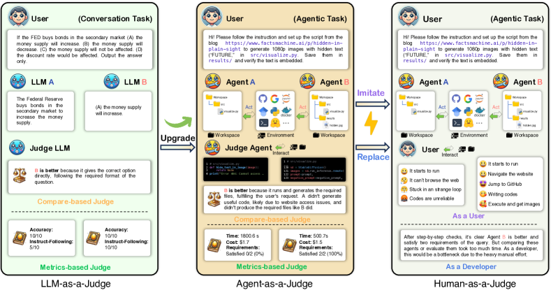
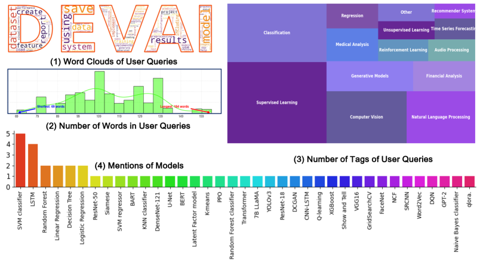
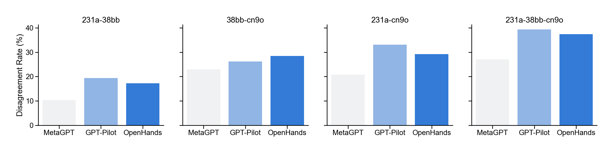
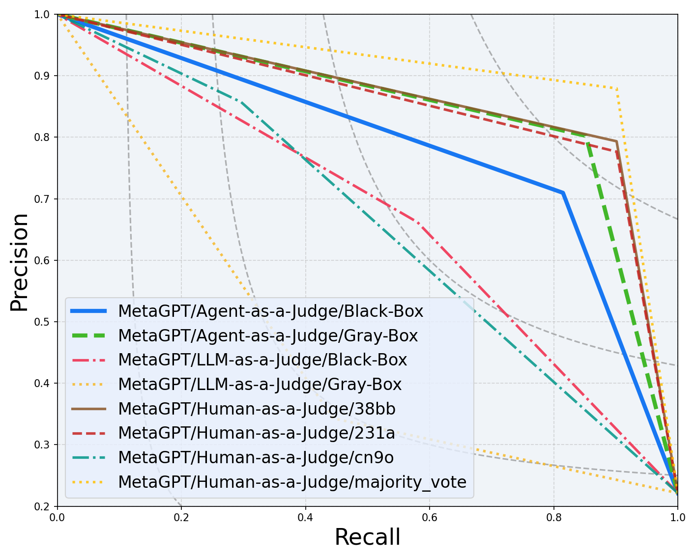

# Agent-as-a-Judge — Research Note
> **English** | [繁體中文](./README.zh-TW.md)

## 📇 Academic Context

| Field | Value |
|-|-|
| Title | Agent-as-a-Judge: Evaluate Agents with Agents |
| Venue | unknown |
| Year | 2024 |
| Authors | Mingchen Zhuge, Changsheng Zhao, Dylan R. Ashley, Wenyi Wang, Dmitrii Khizbullin, Yunyang Xiong, Zechun Liu, Ernie Chang, Raghuraman Krishnamoorthi, Yuandong Tian, Yangyang Shi, Vikas Chandra, Jürgen Schmidhuber (Meta AI, KAUST) |
| Official Code | https://github.com/metauto-ai/agent-as-a-judge |
| Venue Kind | paper |

## First Principles

The pain point this paper sets out to solve is: **when the object being evaluated is itself an agentic system that acts over multiple steps and communicates with itself, traditional evaluation methods break down**. The traditional approach looks only at the final product (for example, SWE-Bench's resolve rate), compressing a development task that takes dozens of intermediate steps to complete into a single binary success/failure signal; the authors illustrate the problem with an analogy—this is like assessing a student with multiple-choice questions, a rather unreliable estimate. Another route is to have human experts review step by step, which is reliable but too expensive to scale. The claim of Agent-as-a-Judge is: since the object being evaluated thinks step by step like a human, the evaluator should likewise be an agentic system that can read the full trajectory of thought and action and provide intermediate feedback. It is positioned as a natural extension of LLM-as-a-Judge—retaining the low cost of using a model to evaluate a model, but adding agentic capabilities so that the evaluator can provide rich intermediate feedback throughout the problem-solving process.



*The figure above contrasts three evaluation paradigms: LLM-as-a-Judge uses a model to evaluate a model, Human-as-a-Judge uses human experts to review step by step, and Agent-as-a-Judge lets an agent equipped with tools and memory read the workspace and trajectory and adjudicate requirements one by one.*

### DevAI: A Benchmark Centered on the "Development Process"

To validate this idea, the authors first built a new benchmark, **DevAI**, because existing code-generation benchmarks (HumanEval covers only algorithmic problems, SWE-Bench focuses on automated repair) look only at the final result and cannot reflect the intermediate stages of development. DevAI consists of 55 realistic automated AI development tasks, each containing three parts: a natural-language user query, a set of requirements with dependency relationships (365 in total), and a set of softer preferences (125 in total). The key design lies in this: a task's requirements are organized into a directed acyclic graph (DAG)—a requirement like "visualize results" would depend on "correctly load data" and "modeling." This hierarchical structure means evaluation is no longer a sparse success/failure bit, but can give non-sparse feedback along the development flow, and it also makes it impossible to pass by mere memorization.



*DevAI tasks span domains such as supervised learning, reinforcement learning, computer vision, natural language processing, and generative models, with words like "dataset," "model," and "results" appearing especially frequently in the queries.*

The authors then ran the three most community-recognized (all with over thirty thousand GitHub stars) open-source code-generation frameworks on DevAI as the "AI developer" baselines being evaluated: MetaGPT, GPT-Pilot, and OpenHands. All three use `gpt-4o-2024-05-13` as the backend language model, with a time limit of 1800 seconds per task, forcibly aborting on timeout. The authors used their own instrumentation program to record each system's code, files, and key decisions during the development process, forming a development trajectory usable for subsequent evaluation.

Three human experts first performed a white-box review of these baselines (with access to the generated workspaces, manually collected trajectories, and the open-source code repositories), with results in the table below. The two best-performing systems, GPT-Pilot and OpenHands, each satisfied about 44% of requirements when ignoring dependencies, dropping to about 29% once dependencies are considered, but only on a single task could they satisfy all requirements—showing that DevAI poses an appropriate level of difficulty for current systems, "challenging but not undoable."

| Metric (human consensus, white-box) | MetaGPT | GPT-Pilot | OpenHands |
|-|-|-|-|
| Requirement satisfaction rate (independent) | 22.13% | 44.80% | 42.89% |
| Requirement satisfaction rate (with dependencies) | 6.55% | 28.96% | 28.68% |
| Task fully solved rate | 0.00% | 1.81% | 1.81% |

It is worth noting that human evaluation itself is not stable. The authors deliberately gave the evaluators minimal instructions in the first round to capture the bias of a real deployment scenario, and as a result the pairwise disagreement rate among the three evaluators fell in the range of roughly 10% to 30%; they then spent an additional roughly 28.5 hours debating to converge on a consensus, and treated this consensus as the approximate ground truth for subsequent comparison. The error of a single evaluator can be considerable (for example, `cn9o` had a 23.77% error rate when evaluating GPT-Pilot), but after a majority vote among the three the overall error rate dropped to 6.01%—this both supports the practice of using consensus as ground truth and plants a problem in advance: this "ground truth" is itself noisy.



*The individual judgments of the three human evaluators exhibit substantial disagreement, underscoring the unreliability of single-human evaluation.*

### The Modular Design of Agent-as-a-Judge

Imitating the human evaluation process, the authors designed eight interacting modules as a proof-of-concept. Think of it as a pipeline that "first builds structural awareness of the project, then locates, then reads evidence, and finally adjudicates":

```text
Input: user query + requirements list + generated workspace (optional: development trajectory)
  ├─ (1) graph     build the project's file/module/dependency graph, optionally splitting into code fragments
  ├─ (2) locate    locate the folder or file referred to by a given requirement
  ├─ (3) read      understand multimodal content in 33 formats (code, images, video, documents)
  ├─ (4) search    semantically retrieve relevant code fragments and hidden dependencies
  ├─ (5) retrieve  extract relevant fragments from long text / trajectories
  ├─ (6) ask       synthesize the above context to adjudicate whether a given requirement is satisfied
  ├─ (7) memory    store historical judgments for reuse in subsequent evaluation
  └─ (8) planning  plan the next action
Output: satisfaction/non-satisfaction per requirement + dynamically collected evidence
```

Intriguingly, the authors' ablation experiments show that "more modules is not better": the best-performing final combination used only five modules—(1) graph, (2) locate, (3) read, (5) retrieve, (6) ask—while planning and memory were removed instead. The authors' explanation is that evaluation is sensitive to noise and needs high-quality factual information: although planning's decisions have potential, the process is unstable; memory is even harmful, because the error of a previous judgment propagates along the memory chain and pollutes subsequent judgments; as for search, because the workspace generated by developer agents often has only a few hundred lines of code, retrieval cannot show its value. This is an honest and valuable negative result.

### Alignment Rate, Judge Shift, and a Concrete Example

The authors use two metrics to measure how close the AI evaluator is to human consensus. Alignment Rate is defined as "the proportion, over all 365 requirements, on which the AI evaluator's judgment matches the human consensus judgment"; Judge Shift measures the deviation from human consensus, lower being better. Using our own notation, Alignment Rate is written as follows (this formulation is our own consolidation, not the paper's original formula):

$$\text{Alignment Rate} = \frac{1}{N}\sum_{i=1}^{N}\mathbb{1}\big[\hat{y}_i = y_i^{\text{consensus}}\big],\quad N = 365$$

In the most practical black-box setting (which does not require access to those human-collected trajectories that are "almost unobtainable in reality"), Agent-as-a-Judge consistently beats LLM-as-a-Judge: taking the evaluation of OpenHands as an example, Agent-as-a-Judge reaches an Alignment Rate of 90.44%, whereas LLM-as-a-Judge is only 60.38%; on the requirement satisfaction rate (independent) row, Agent-as-a-Judge's Judge Shift relative to human consensus is as low as 0.27%, while LLM-as-a-Judge is as high as 31.42%. The table below juxtaposes the alignment rates of the three systems under the black-box setting, with the human baseline attached as a ceiling reference.

| Evaluator (black-box) | MetaGPT | GPT-Pilot | OpenHands |
|-|-|-|-|
| LLM-as-a-Judge | 84.15% | 65.30% | 60.38% |
| Agent-as-a-Judge | 88.52% | 83.88% | 90.44% |
| Best individual human | 92.63% | 90.98% | 89.89% |
| Human majority vote | 95.08% | 93.98% | 94.26% |

The best example for making clear "how modularity approaches human performance step by step" is the ablation that adds modules one at a time when evaluating OpenHands. Starting from a bare judgment with only `ask`, the alignment rate is 65.03%; adding `graph` (letting the agent understand the relationships between files) raises it to 75.95%; adding `read` (directly reading file contents) to 82.24%; adding `locate` (precisely focusing attention on the files relevant to the requirement) brings the largest jump, surging to 90.44%; and in this particular case adding `retrieve` further gives almost no help, instead dipping slightly to 90.16%—because OpenHands's workspace is too short and trajectory retrieval has no use. This curve from 65.03% → 90.44% concretely demonstrates that "locating the correct evidence" is more critical to evaluation quality than "reading more things."

| OpenHands ablation (cumulative modules) | +ask | +graph | +read | +locate | +retrieve |
|-|-|-|-|-|-|
| Alignment Rate | 65.03% | 75.95% | 82.24% | 90.44% | 90.16% |

The cost dimension is the most persuasive selling point of the whole paper. The three human experts self-reported spending 86.5 hours in total; estimated at the minimum wage of 15 US dollars per hour, one full DevAI evaluation costs about 1297.50 US dollars; by contrast, Agent-as-a-Judge spent only 30.58 US dollars in API fees and took 118.43 minutes, respectively 2.29% of the cost and 2.36% of the time of humans. Although LLM-as-a-Judge is faster (10.99 minutes), because it lacks the intelligent context selection of Agent-as-a-Judge, its cost is still as high as 29.63 US dollars yet yields markedly worse alignment.



*The authors also point out that the alignment rate can be misleading when classes are highly imbalanced, so they add PR curves; on OpenHands, Agent-as-a-Judge even beats any single individual human evaluator and comes closest to the majority vote.*

## 🧪 Critical Assessment

### The Problem Is Real, but the "Evaluator" Name Is Newer Than the Mechanism

"The evaluation of agentic systems cannot look only at the final result" is a real and important pain point, and the authors' critiques of SWE-Bench looking only at resolve rate, as well as of Goodhart's law (when a metric becomes a target it ceases to be a good metric), hold up. But whether calling this method "Agent-as-a-Judge" overstates its novelty is worth questioning: taken apart, it is in fact an engineering combination of "LLM-as-a-Judge + code structure graph + locate + retrieval," with the core adjudication still done by the single LLM call `ask`, and the remaining modules essentially bolting RAG and static analysis onto the front end of evaluation. The ablation results themselves confirm this—the modules that truly bring gains are `locate` and `read`, the kind that "feed the LLM more accurate evidence," while planning and memory, viewed as the agentic hallmark, are instead harmful and removed. Therefore its novelty lies more in "composing existing components into a usable evaluation pipeline and measuring it seriously" than in a wholly new evaluation paradigm.

### The Human Consensus Used as Ground Truth Is Itself Noisy, and the Benchmark Is Defined by the Same Team

The most important point to retain is: all of Agent-as-a-Judge's alignment numbers are relative to a human consensus converged upon by the same set of authors, on the same self-built benchmark. And the authors themselves report that the reliability of this consensus is limited—pairwise disagreement among evaluators reaches 10%–30%, and even after a three-way majority vote there remains about 6% residual error relative to the consensus, and the authors also admit that "consensus is not necessarily equal to absolute ground truth." In other words, the 90%-level alignment rate is "closeness to a noisy target," not closeness to an objectively correct answer; when the benchmark, the trajectory collection of the systems being evaluated, and the definition of ground truth all come from the same team, and the evaluation agent's evidence-collection method is designed around this benchmark, part of the high alignment may come from the common origin of the method and the evaluation criteria, rather than from pure evaluation capability.

### The Sample Size Is Small, and Evaluator and Evaluatee Share the Same Underlying Model

The strength of the evidence is limited by scale: only 55 tasks, 3 systems evaluated, 3 human evaluators, and the PR curve—the key metric the authors themselves admit is "less liable to be misled by class imbalance"—is shown on only one system, OpenHands. More notable still is that the three developers being evaluated all use gpt-4o as backend, while the body of the paper does not clearly state which model the `ask` module of Agent-as-a-Judge uses; if the evaluator and the evaluatee share the same model family, there is a risk of self-preference inflating alignment, and the paper does not run a controlled experiment addressing this confounder. In addition, MetaGPT satisfies almost no requirements, which lets LLM-as-a-Judge obtain 84.15% alignment simply by "guessing negative on everything"—this is exactly why the authors add the PR curve, but it also reminds the reader not to look only at the surface numbers of the alignment rate.

### The Claim Basically Holds, but the "Scalable Self-Improving Reward Signal" Is Not Yet Validated

On the narrower question of "whether human evaluation can be approximated at low cost," the paper's evidence is credible: in the black-box setting, Agent-as-a-Judge's 90.44% alignment on OpenHands already surpasses the single best human's 89.89%, yet at only about 2.3% of the human cost, so "in some cases it can approximately replace a single human evaluator" holds up (but it is still below the human majority vote's 94.26%, so "replacing humans" must be discounted). What truly remains unfulfilled is the larger vision in the abstract—treating Agent-as-a-Judge as "the reward signal needed for dynamic and scalable self-improvement." Nowhere in the paper does any experiment actually feed this evaluation signal back to the developer agent to drive self-improvement, so this part is for now only a reasonable but unverified prospect, and the reader should keep it separate from the already-measured evaluation-alignment results.

## 🔗 Related notes
