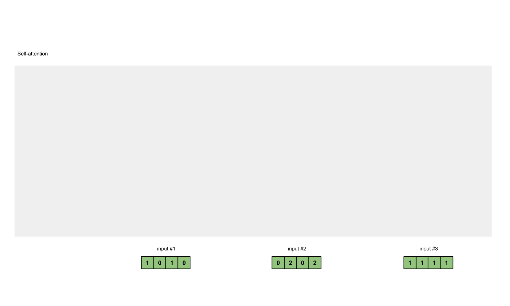

| Property  | Data |
|-|-|
| Created | 2022-12-19 |
| Updated | 2023-05-29 |
| Author | @Aiden |
| Tags | #study |

# Attention is All You Need


## Keywords
### Attention

$$
\begin{aligned}
\text{Attention} (Q, K, V) &= \text{softmax}\left(\frac{QK^T}{\sqrt{d_k}}\right) V = \frac{e^{z_i}}{ \sum_{j=1}{e^{z_j}}}
\end{aligned}
$$


#### Illustration

#### Python Code
```python
import math
import torch
import torch.nn.functional as F

def attention(query, key, value, mask=None, dropout=None):
    "Compute 'Scaled Dot Product Attention'"
    d_k = query.size(-1)
    scores = torch.matmul(query, key.transpose(-2, -1)) \
             / math.sqrt(d_k)
    if mask is not None:
        scores = scores.masked_fill(mask == 0, -1e9)
    p_attn = F.softmax(scores, dim = -1)
    if dropout is not None:
        p_attn = dropout(p_attn)
    return torch.matmul(p_attn, value), p_attn
```

# Multi-Head Self-Attention
Let $d_\text{model}$ represent the dimension of the input and output representations in the Transformer, and $d_k$ represent the dimension of the key, query, and value vectors for each head. The product of the number of heads $n$ and $d_k$ should equal $d_\text{model}$ to ensure that the concatenated output from all the heads will have the same dimension as:

$$
\begin{aligned}
d_\text{model} = n \cdot d_k
\end{aligned}
$$

The Multi-Head Attention mechanism can be denoted as:

$$
\begin{aligned}
    &\text{Attention} (Q, K, V) = \text{softmax} \left ( \frac{Q K^\top}{\sqrt{d_k}} \right) V \\
    &\text{MultiHead} (Q, K, V) = \text{Concat} (\text{head}_1, \dots, \text{head}_n) W^O \\
    &\text{head}_i = \text{Attention} (Q W^Q_i, K W^K_i, V W^V_i)
\end{aligned}
$$

Where $Q$, $K$, and $V$ are the query, key, and value matrices, respectively. $W^Q_i$, $W^K_i$, and $W^V_i$ are the weight matrices for the query, key, and value projections for each head $i$. $W^O$ is the output weight matrix for the multi-head attention.

## Position-wise Feed-Forward Network
Mathematically, the Position-wise Feed-Forward Network (PFFN) is represented as:

$$
\begin{align}
    &\text{FFN} (x) = \text{GeLU} (x W_1 + b_1) W_2 + b_2 \\    
    &\text{PFFN} (H^l) = [FFN (h^l_1)^{\top}; FFN (h^l_2)^{\top}; ...; FFN (h^l_t)^{\top}]^{\top}    
\end{align}
$$

Where $W_1$, $W_2$, $b_1$, and $b_2$ are the weights and biases for the feed-forward neural network. And $h^l_t$ is the hidden representations at each layer $l$ for each position $i$. combining all $h^l_i \in \mathbb{R}^{d_{\text{model}}}$ together into matrix $H^l \in \mathbb{R}^{t \times d_{\text{model}}}$.

## Stacking Transformer Layer
The Transformer encoder, denoted as $\text{Trm}$, can be defined in the following manner:

$$
\begin{aligned}
    \text{Trm} (H^l) = \text{LayerNorm} (F^l + \text{Dropout} (\text{PFFN} (F^l))), \\
    F^l =  \text{LayerNorm} (H^l + \text{Dropout} (\text (MultiHead (H^l))))
\end{aligned}
$$

where $H^l \in \mathbb{R}^{t \times d_{\text{model}}}$ denotes all hidden states at layer l, and $d_\text{model}$ specifies the Transformer's dimensionality. t is the input sequence of length. 
Employing **layer normalization** and **dropout strategies** ensures the model's efficiency and robustness.
