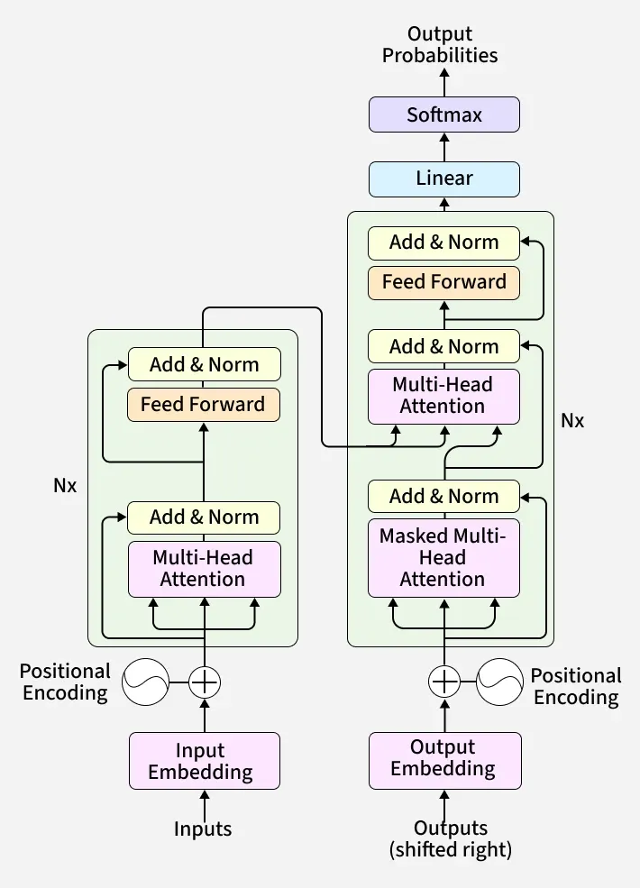
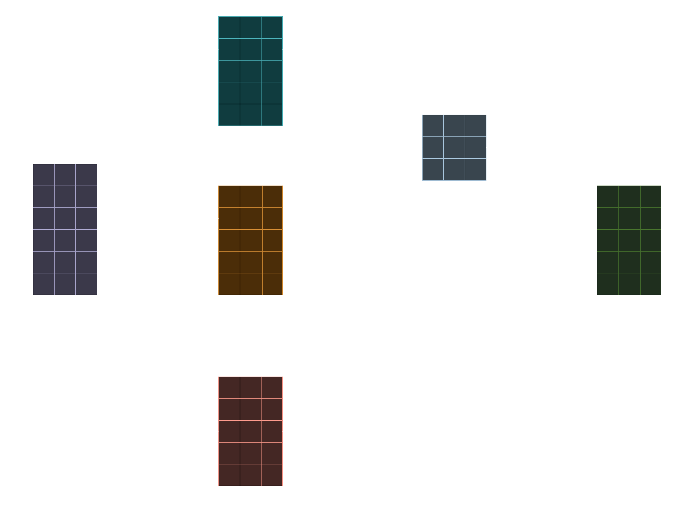
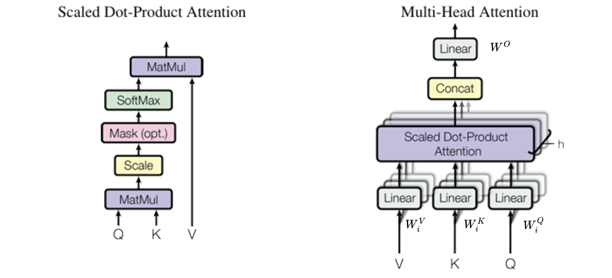
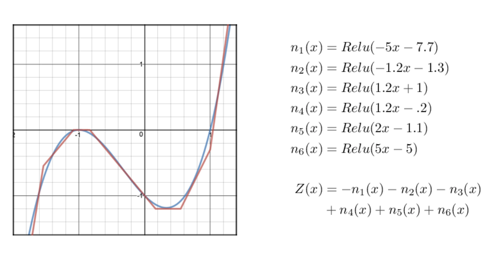

# Transformer - Close Reading

## Query, Key, Value 的意義

| 元件 | 角色 | 維度 | 抽象意義 |
|---|---|---|---|
| $Q$ | Query 查詢  | $(L \times d_k)$ | 「我在找什麼？」 |
| $K$ | Key鍵 | $(L \times d_k)$ | 「被查詢的特徵」 |
| $QK^T$ (經Softmax) | Attention Weighted (注意力權重) | $(L \times L)$ | 「我該關注『哪裡』？比例多少？」 |
| $V$ | Value 值 | $(L \times d_v)$ | 「由$QK^T$ 指出的位置，內容資訊是什麼？」 如果沒有 $V$，注意力機制就只知道「A 和 B 很相關」，但它不知道「A 和 B 的**內容**是什麼」 |
| $\text{Weights} \cdot V$ | **最終輸出** | $(L \times d_v)$ | 「這是融合了全局資訊後的新樣貌」 |

### Attention Weights $QK^T$ (經 Softmax) 
Attention Weights 的目標是「**當我在處理第 $i$ 個字時，我該花多少注意力在第 $j$ 個字上？**」 ，這個「注意力分數」是透過計算 **第 $i$ 個字的 Query 向量 ($q_i$)** 和**第 $j$ 個字的 Key 向量 ($k_j$)** 之間的**點積 (dot product)** 得到的
$$
\text{Score}(i, j) = q_i \cdot k_j
$$

我們希望一次運算就得到一個 $(L \times L)$ 的分數矩陣，其中 `Matrix[i, j]` 就是 $q_i \cdot k_j$. 

一個 Attention Weights 會有以下幾種特性：
- 它是一個 $(L \times L)$ 的矩陣 (L 是序列長度)
- 這個矩陣的**每一行**，都是一組「權重分數」，且**經過 Softmax 後總和為 1**
    - e.g.： `[0.1, 0.0, 0.7, 0.2, 0.0]`
    - 
"當我在處理第 1 個字時，我應該放 10% 的注意力在第 1 個字，0% 在第 2 個字，70% 在第 3 個字，20% 在第 4 個字..."

* 它是由「$Q$ 的**第 $i$ 個 row**」和「$K^T$ 的**第 $j$ 個 column**」進行點積。
    * **$Q$ 的第 $i$ 個 row** $\rightarrow$ 就是 $q_i$ 向量。
    * **$K^T$ 的第 $j$ 個 column** $\rightarrow$ 根據轉置的定義，這就是 $K$ 的**第 $j$ 個 row**，也就是 $k_j$ 向量。
    $$
    \text{Result}[i, j] = (Q \text{ 的第 } i \text{ 個 row}) \cdot (K^T \text{ 的第 } j \text{ 個 column}) = q_i \cdot k_j
    $$

透過 $Q \cdot K^T$ 這一個矩陣乘法，我們就高效地算出了序列中**每一個 $q$ 向量**對**每一個 $k$ 向量**的點積分數。

#### $Q$ 與 $K$ 在數學上的實際差異： 轉置(Transpose)
表層來看，它們是透過不同權重矩陣 $W_Q, W_K$ 算出來的兩個不同向量，分別代表查詢與被查詢的特徵。但從數學本質來看，它們唯一的原生差異其實就只有 $QK^T$ 中的轉置（Transpose）。在訓練過程中驅動 $W_Q$ 和 $W_K$ 學習到不同的特徵模式，從而實現了『主動關注 (Query)』與『被動索引 (Key)』的功能解耦。這個轉置讓矩陣乘法獲得了觀看時間維度($L$)的能力。

另外，$K$ 必須轉置也是為了：
1.  符合矩陣乘法的規則（維度要能對上）
    $$
    (L \times d_k) \cdot (d_k \times L)
    $$
2.  確保我們得到的是「Query 向量」和「Key 向量」之間的點積 (dot product)

### $V$ (Value): 內容本身 (Content)
$V$ 矩陣（維度是 $L \times d_v$）代表了序列中**每一個字**的「**實際內容**」或「**資訊向量**」。
* $V$ 的第 1 行 = 第 1 個字的內容
* $V$ 的第 2 行 = 第 2 個字的內容
* ...

這個 $QK^T \cdot V$ 的運算過程，可以想像成是一個**過濾器（Filter）**，決定了實際內容中的哪些部分應該要保留下來多少程度：

$$
\underbrace{
    \begin{bmatrix} 0.1 & 0.9 \\ 0.5 & 0.5 \end{bmatrix}}_{\text{Attention Weight (L} \times \text{L)}} \times \underbrace{\begin{bmatrix} v_1 \\ v_2 \end{bmatrix}}_{\text{Value (L} \times \text{d)}} = \underbrace{\begin{bmatrix} 0.1v_1 + 0.9v_2 \\ 0.5v_1 + 0.5v_2 
    \end{bmatrix}
}_{\text{Output Z (L} \times \text{d)}}
$$

> 補充. 其實也有研究指出我們不需要使用 Q, K. 如 Google 發布的 [《Synthesizer: Rethinking Self-Attention in Transformer Models》](https://arxiv.org/pdf/2005.00743).

#### 為什麼一定要 $\text{Weights} \cdot V$

這一步是「**加權總和**」（Weighted Sum），也是 Attention 最精華的部分。

它把「關係地圖」和「實際內容」組合起來，為序列中的每一個字，都重新創造了一個**融合了全局上下文**的新向量。

**運算過程：**

$$
\text{Output} = \text{Softmax}\left(\frac{QK^T}{\sqrt{d_k}}\right) \cdot V
$$

* $\text{Output}$ 的第 1 行 = (權重 $W_{1,1}$ $\cdot$ $V$的第1行) + (權重 $W_{1,2}$ $\cdot$ $V$的第2行) + ... + (權重 $W_{1,L}$ $\cdot$ $V$的第L行)
* 第 1 個字的新向量 = (0.1 $\cdot$ 第1個字的內容) + (0.0 $\cdot$ 第2個字的內容) + (0.7 $\cdot$ 第3個字的內容) + (0.2 $\cdot$ 第4個字的內容) + ...

**結果：**
這個「新向量」就是**第 1 個字在看過全局之後的新樣貌**。它 70% 像第 3 個字，20% 像第 4 個字，10% 像它自己。它已經**吸收了上下文的資訊**。

### $\sqrt{d_k}$ 的意義： "Scaled" Dot-Product Attention
$$
\text{Output} = \text{Softmax}\left(\frac{QK^T}{\textcolor{cyan}{\sqrt{d_k}}}\right) \cdot V
$$
除以 $\sqrt{d_k}$ 的唯一目的是**防止 Softmax 函數飽和 (saturate)，從而避免梯度消失 (vanishing gradients) 的問題。** 這是一個在訓練過程中確保數值穩定性的技巧。如果不進行縮放 (scale)，在訓練時會發生以下問題：
#### $d_k$ 越大， $Q \cdot K^T$ 的 Variance (變異數) 越大
* $d_k$ 是 Query 和 Key 向量的維度（例如在基礎的 Transformer 中是 64）
* $Q \cdot K^T$ 矩陣中的每一個元素，都是由兩個 $d_k$ 維向量的 **點積 (dot product)** 算出來的
$$
q \cdot k = \sum_{i=1}^{d_k} q_i k_i
$$
* 假設 $Q$ 和 $K$ 的元素是獨立的隨機變數，且經過標準化（平均值為 0，變異數為 1）。那麼它們的點積的變異數 (variance) 會是 $d_k$
$$
Var(\sum_{i=1}^{d_k} q_i k_i) = \sum_{i=1}^{d_k} \textcolor{cyan}{Var(q_i k_i)} = \sum_{i=1}^{d_k} \textcolor{cyan}{1} = d_k
$$

* $d_k$ 越大（例如 512），$QK^T$ 矩陣中的值（也就是 $\text{Softmax}$ 的輸入）就越有可能出現**非常大**或**非常小**（負很多）的值

#### 大數值會讓 $\text{Softmax}$ 函數飽和(Saturation)
假設輸入向量為 $x = [x_1, x_2, ..., x_n]$（也就是 $QK^T$ 計算出來的 logits），Softmax 函數針對第 $i$ 個元素的輸出 $y_i$ 為：

$$y_i = \text{softmax}(x)_i = \frac{e^{x_i}}{\sum_{j=1}^{n} e^{x_j}}$$

這個公式做了兩件事：
1.  **指數化 ($e^x$)：** 把所有數值變成非負數，且拉大差異。
2.  **歸一化 (Normalization)：** 除以總和，讓所有輸出的和為 1（變成機率分布）。

$\text{Softmax}$ 函數 $(\text{softmax}(z))$ 對輸入的「大小」非常敏感。
- 當輸入值很接近時, e.g. $[2, 1]$
    - Input:
        - $e^2 \approx 7.39$
        - $e^1 \approx 2.72$
        - $\sum_{j=1}^{n} e^{x_j} \approx 10.11$
    - Ouput:
        - $y_1 \approx \frac{7.39}{10.11} \approx \mathbf{0.73}$
        - $y_2 \approx \frac{2.72}{10.11} \approx \mathbf{0.27}$
- 當輸入值差距很大時：e.g. $[20, 10]$
    - Input
        - $e^{20} \approx 485,165,195$ (**4.8 億**)
        - $e^{10} \approx 22,026$ (**2 萬**)
        - $\sum_{j=1}^{n} e^{x_j} \approx 485,187,221$
    - Output
        - $y_1 \approx \frac{485,165,195}{485,187,221} \approx \mathbf{0.99995}$
        - $y_2 \approx \frac{22,026}{485,187,221} \approx \mathbf{0.00005}$
        - $y_1$ 拿走了幾乎 100% 的權重，$y_2$ 被壓縮到幾乎為 0
- 當 $QK^T$ 的值變得很大時，$\text{Softmax}$ 的輸出會被推向 0 或 1。這個狀態就叫做**飽和 (Saturation)**。

#### 飽和會導致梯度消失 (Vanishing Gradients)
在反向傳播（Backpropagation）時，我們需要計算梯度. 對於輸出 $y_i$，它對輸入 $x_i$ 的偏微分（梯度）是(公式推導請參考[Link](../../utils/softmax/README.md))：
$$\frac{\partial y_i}{\partial x_i} = y_i (1 - y_i)$$

讓我們把剛剛算出來的 $y_1$ 帶進去：
* **在情況 A (y = 0.73)：**
    $$
    \begin{aligned} 
    Gradient = 0.73 \times (1 - 0.73) \\
    = 0.73 \times 0.27 \approx \mathbf{0.197}
    \end{aligned}
    $$
    $\rightarrow$ **梯度很大**，模型可以有效地學習並更新權重。

* **在情況 B (y = 0.99995)：**
    $$
    \begin{aligned}
    Gradient &= 0.99995 \times (1 - 0.99995) \\
    &= 0.99995 \times 0.00005 \approx \mathbf{0.000049}
    \end{aligned}
    $$
    $\rightarrow$ **梯度趨近於 0**。

#### 解決方案：除以 $\sqrt{d_k}$
前面提到，$QK^T$ 中點積的「變異數」是 $d_k$。那麼，點積的**標準差 (standard deviation)**就是 $\sqrt{d_k}$。 
通過將 $QK^T$ 的**每一個元素**都除以 $\sqrt{d_k}$，我們就等於是把 $\text{Softmax}$ 輸入的「變異數」重新標準化 (normalize) 回 1
$$
\text{Softmax}\left(\frac{QK^T}{\sqrt{d_k}}\right)
$$

這樣做可以確保，無論 $d_k$ 的維度（64, 256, 512...）設得多大，$\text{Softmax}$ 的輸入都會被控制在一個不會輕易飽和的範圍內

## Multi-Head Attention
Multi-Head Attention 的核心思想是：單一個 Attention Head 可能只會專注於某一種特定的關係（例如：語法結構、主謂一致）。透過多個 Head，我們允許模型同時在**不同的子空間 (Subspaces)** 裡捕捉**不同類型的特徵**。

Multi-Head Attention 不是一個新的演算法，它只是把上述的 Attention 運算**平行做 $h$ 次**，最後再接起來。

$$
\text{MultiHead}(Q, K, V) = \text{Concat}(\text{head}_1, \dots, \text{head}_h) W^O
$$

其中，每一個 $\text{head}_i$ 都是一次獨立的 Attention 運算：
$$
\text{head}_i = \text{Attention}(QW_i^Q, KW_i^K, VW_i^V)
$$

這裡出現了三個關鍵的投影矩陣 (Projection Matrices) 以及一個輸出的線性變換矩陣(如圖都是Linear層)：
  * $W_i^Q \in \mathbb{R}^{d_{model} \times d_k}$
  * $W_i^K \in \mathbb{R}^{d_{model} \times d_k}$
  * $W_i^V \in \mathbb{R}^{d_{model} \times d_v}$
  * $W^O \in \mathbb{R}^{h d_v \times d_{model}}$

### 拆分 (Splitting) 與 維度縮減
Multi-Head **並不是**把原始維度 $d_{model}$ 複製 $h$ 份，而是將其**切分**。 

假設我們設定模型的維度 $d_{model} = 512$，並且使用 $h = 8$ 個 Heads。
那麼，每一個 Head 處理的向量維度 $d_k$ (或 $d_v$) 其實是變小的：

$$
d_k = d_v = d_{model} / h = 512 / 8 = 64
$$

這意味著，我們將原本寬度為 512 的資訊流，分流成 8 條寬度為 64 的小溪，各自進行 Attention 運算。

| 步驟 | 動作描述 | 維度變化 (以 $h=8$ 為例) | 意義 |
|---|---|---|---|
| 1. 投影 (Linear Proj) | 輸入 $X$ 分別乘上 $W_i^Q, W_i^K, W_i^V$ | $d_{model} \rightarrow d_k$   $(512 \rightarrow 64)$ | 將高維特徵投影到**較小的子空間**。(Head 1 可能只看文法，Head 2 只看代名詞.) |
| 2. 注意力 (Attention) | 各個 Head **獨立**計算 $Attention(\dots)$ | $64 \rightarrow 64$ | 在各自的子空間內進行資訊混合。這 8 個運算是**平行進行**的。 |
| 3. 拼接 (Concat) | 把 8 個 Head 的輸出串接在一起 | $h \times d_v \rightarrow d_{model}$   $(8 \times 64 \rightarrow 512)$ | 將來自不同視角的資訊蒐集回來，恢復原本的維度寬度。 |
| 4. 融合 (Linear Mix) | 乘上矩陣 $W^O$ | $512 \rightarrow 512$ | **資訊交換**。讓 Head 1 看到的和 Head 2 看到的特徵進行交互融合。 |

> 註1：理論上希望各 Head 關注不同特徵，如文法或指代，但在實務上這種分工往往是模糊且重疊的
> 註2：為什麼這樣設計？因為 $d_k$ 變小了，單一個 Head 的計算量變成了原本的 $1/h$。而我們有 $h$ 個 Heads，所以**總計算量與單一 Head (但維度是 512) 的情況幾乎是一樣的**。這讓我們在不增加算力的情況下，增強了模型的「多視角」理解能力。(這是面試中最常被誤解的地方，例如陷阱題： 使用 Multi-Head 後，時間複雜度是否會增加？)

### 拼接之後：$W^O$ 的重要性

公式的最後一步是乘以 $W^O$：

$$
\text{MultiHead Output} = \dots \times W^O
$$

* **Concat 只是物理上的「並排」：** 此時，Head 1 的資訊在第 1\~64 位，Head 2 的資訊在第 65\~128 位... 它們之間是**互不相通**的。
$$
\text{Vector}_{concat} = [\textcolor{red}{h_1}, \textcolor{cyan}{h_2} ]
$$
* **$W^O$ 是化學上的「反應」：** 透過這個全連接層 (Linear Layer)，模型可以把 Head 1 抓到的「主詞特徵」和 Head 2 抓到的「動詞特徵」進行**加權組合**。 
$$
\underbrace{[\textcolor{red}{h_1}, \textcolor{cyan}{h_2}]}_{\text{Input Row}} \times \underbrace{\begin{bmatrix} w_{11} & w_{12} \\ w_{21} & w_{22} \end{bmatrix}}_{W^O} = \underbrace{[z_1, z_2]}_{\text{Output Row}}
$$

- 輸出的新 Vector，它的每一維，都包含了來自 Head 1, Head 2... Head 8 
的所有資訊的加權總和, 數學呈現如下：

$$
z_1 = (\textcolor{red}{h_1} \cdot w_{11}) + (\textcolor{cyan}{h_2} \cdot w_{21})
$$

## Position-wise Feed-Forward Networks
FFN 本質上是一個包含兩個線性變換（Linear Transformation）與一個非線性激活函數（Activation Function）的簡單全連接網路

$$
\text{FFN}(x) = \max(0, xW_1 + b_1) \cdot W_2 + b_2
$$

或者用更通用的寫法（涵蓋現代常用的 GELU）：
$$
\text{FFN}(x) = \text{Activation}(xW_1 + b_1) \cdot W_2 + b_2
$$

這裡涉及到兩個關鍵的權重矩陣：
* **$W_1$ (Up-projection):** $\in \mathbb{R}^{d_{model} \times d_{ff}}$
* **$W_2$ (Down-projection):** $\in \mathbb{R}^{d_{ff} \times d_{model}}$

通常，$d_{ff}$ 會被設計得比 $d_{model}$ 大很多（一般是 4 倍）。
* $d_{model} = 512$
* $d_{ff} = 2048$

### FFN 的靈魂：非線性 (Non-Linearity)
FFN 是 Transformer Block 中，主要提供『特徵變換非線性』的地方。

Attention 中雖然有使用非線性運算 Softmax, 但這兩者有本質上的區別：
- Attention 的 Softmax: 是作用在權重 (Weights) 上。它決定了「我要看哪裡」。它改變的是路由 (Routing)，而不是特徵本身的數值空間形狀。
- FFN 的 ReLU/GELU: 是作用在特徵 (Features) 上。它負責扭曲、切割特徵空間，讓模型能逼近複雜的函數 (Universal approximation)。

### Position-wise
原始論文特別強調 "Position-wise" 這個詞，並非指運算有何特殊之處，而是為了強調架構上的設計： 「在此層級，序列中的每一個 Token 都是被隔離、獨立處理的，不存在Length 維度上的資訊交互

假設輸入矩陣 $X$ 的維度是 $(L \times d)$：
* $L$: 序列長度 (Sequence Length)
* $d$: 特徵維度 (Dimension)

$$
X = \begin{bmatrix} 
\leftarrow x_1 \rightarrow \\ 
\leftarrow x_2 \rightarrow \\ 
\vdots \\ 
\leftarrow x_L \rightarrow 
\end{bmatrix}
$$

**Position-wise FFN 的運作方式：**
它不是把整個 $L \times d$ 矩陣丟進去一起算，而是把這 $L$ 個向量**拆開**，一個一個丟進**同一個**函數 $f(x)$ 裡。

$$
\text{FFN}(X) = \begin{bmatrix} 
f(x_1) \\ 
f(x_2) \\ 
\vdots \\ 
f(x_L) 
\end{bmatrix}
$$

在 PyTorch 中使用 nn.Linear 處理序列數據 (Batch, Seq_Len, Dim) 時，本質上就是進行標準的矩陣乘法。$$Y = XW + b$$根據矩陣乘法的定義，輸出矩陣的第 $i$ 列（Row $i$）僅由輸入矩陣的第 $i$ 列決定。

> **⚠️ 面試陷阱題：FFN 等同於什麼樣的卷積神經網路 (CNN)？**
>
> **答案：** 它等同於 Kernel Size 為 1 的 1D Convolution (也就是 $1 \times 1$ Conv)。
> 因為它只看當前位置的 Channel (Feature) 維度，而不看鄰居。

### 維度變化：升維再降維
FFN 的運作過程可以看作是一個**「升維再降維」**的過程。這在幾何上非常有意義，類似的操作如：Boltzmann Machine

$$
\underbrace{x}_{(1 \times 512)} \xrightarrow[\text{Expand}]{W_1 (512 \times 2048)} \underbrace{\mathbf{h}}_{(1 \times \mathbf{2048})} \xrightarrow[\text{Non-Linearity}]{\text{ReLU/GELU}} \underbrace{\mathbf{h}'}_{(1 \times \mathbf{2048})} \xrightarrow[\text{Compress}]{W_2 (2048 \times 512)} \underbrace{y}_{(1 \times 512)}
$$

| 步驟 | 動作 | 維度變化 | 抽象意義 |
| :--- | :--- | :--- | :--- |
| 1. 擴張 (Expansion) | $x W_1$ | $512 \to 2048$ | **解構資訊**。將緊湊的特徵投影到更高維的空間，讓特徵之間「散開」，便於模型分辨細微的差異。（類似 SVM 的 Kernel Trick 概念） |
| 2. 激活 (Activation) | $\text{ReLU}(...)$ | $2048 \to 2048$ | **篩選與非線性**。這是整個 Transformer 中少數提供非線性能力的地方。它決定了哪些高維特徵應該被保留，哪些該被抑制（歸零）。 |
| 3. 壓縮 (Compression) | $... W_2$ | $2048 \to 512$ | **整合資訊**。將處理後的特徵重新壓縮回原本的維度，準備與殘差連接 (Residual Connection) 相加。 |

### FFN 在學什麼？ Key-Value Memory
近年來的研究（如 *Geva et al., 2020*）提出了一個非常有趣的觀點，認為 FFN 其實是模型的 **Key-Value Memory (鍵值記憶體)**。

這跟 Attention 的 QKV 不一樣：
* **Attention 的 QKV:** 是在處理「上下文資訊」（例如：這個句子的主詞是誰？）。
* **FFN 的權重:** 是在儲存「靜態知識」（例如：巴黎是法國的首都）。

我們可以這樣理解 FFN 的兩層矩陣：
1.  **$W_1$ (Keys):** 像是一個**模式識別器 (Pattern Detector)**。它在偵測輸入向量中是否包含某種特定的概念（例如：偵測到「法國」+「首都」的特徵組合）。
2.  **$W_2$ (Values):** 像是一個**內容生成器**。如果 $W_1$ 被激活了，它就會透過 $W_2$ 輸出對應的資訊（例如：增加「巴黎」這個概念的向量數值）。

**結論：**
如果說 Attention 負責把句子讀通（理解結構），FFN 就負責查閱大腦裡的百科全書（補充知識）。這也是為什麼大型語言模型 (LLM) 的參數量大部分都集中在 FFN 層的原因。

#### $FFN$ 與 $QK^T$ 的用途差異
| 運算類型 | FFN / Linear Layer | Attention Mechanism |
| :--- | :--- | :--- |
| **關鍵動作** | 乘上 **Weights** | 乘上 **Transposed Data** |
| **數學式** | $X \cdot W$ | $X \cdot X^T$ (概念上) |
| **轉置與否** | **無轉置** (或是只轉置 Weights) | **數據本身被轉置** ($K^T$) |
| **視線方向** | **向內看 (Introverted)** 看自己內部的特徵組合 | **向外看 (Extroverted)** 看別人(其他時間點)跟我的關係 |
| **物理意義** | **Feature Engineering** (把 "Apple" 變成 "Fruit") | **Context Discovery** (發現 "Apple" 與 "Red" 的關聯) |

## Layer Normalization
在 Transformer 中，Normalization 是穩定訓練的關鍵。但為什麼選擇 Layer Normalization (LN) 而不是電腦視覺中常見的 Batch Normalization (BN)？

### 為什麼不用 Batch Normalization?
Batch Normalization 的核心假設是：**同一個 Batch 內的數據應該來自相似的分佈**。它是在「Batch 維度」上計算平均值與變異數。
*   **CV 領域**：圖片大小固定（例如 $224 \times 224$），Batch 內的每個 Channel 代表的特徵意義一致（例如 Channel 1 都是邊緣檢測）
*   **NLP 領域**：
    1.  **序列長度不一**：一個 Batch 裡可能有長度 10 的句子，也有長度 100 的句子。Padding 的 0 會嚴重干擾 BN 的統計量計算
    2.  **Batch Size 限制**：Transformer 模型通常很大，導致訓練時 Batch Size 很小，這會讓 BN 的統計估計非常不穩定

### Layer Normalization 的運作
Layer Normalization 是在 **Feature 維度** ($d_{model}$) 上進行標準化。它**獨立**處理每一個樣本（每一個 Token），完全不依賴 Batch 中的其他數據。

對於一個 Token 的向量 $x \in \mathbb{R}^{d_{model}}$：
1.  **計算平均值 $\mu$ 與變異數 $\sigma^2$**：
    $$
    \mu = \frac{1}{d_{model}} \sum_{i=1}^{d_{model}} x_i, \quad \sigma^2 = \frac{1}{d_{model}} \sum_{i=1}^{d_{model}} (x_i - \mu)^2
    $$
2.  **標準化 (Normalize)**：
    $$
    \hat{x} = \frac{x - \mu}{\sqrt{\sigma^2 + \epsilon}}
    $$
3.  **重新縮放與偏移 (Scale and Shift)**：
    $$
    y = \gamma \hat{x} + \beta
    $$

#### $\gamma$ 和 $\beta$ 的重要性
這兩個是**可學習的參數 (Learnable Parameters)**。
- 標準化強制把數據變成 $\mu=0, \sigma=1$ 的分佈，這可能會破壞某些特徵表達（例如某些神經元本來就需要很大的激活值）
- $\gamma$ 和 $\beta$ 讓模型有能力 **復原** 或 **調整** 標準化後的結果。如果模型發現不標準化比較好，它可以學成 $\gamma=\sigma, \beta=\mu$，從而抵消 LN 的作用

### Post-LN vs. Pre-LN
- **Post-LN (原始論文)**：`Add -> Norm`。
  - 結構：$x_{out} = \text{LayerNorm}(x + \text{Sublayer}(x))$
  - 問題：輸出層附近的梯度很大，但越往底層梯度越小（因為每一層都在做 Normalization），導致 Warm-up 階段非常敏感，容易訓練失敗
- **Pre-LN (現代主流，如 GPT-2, LLaMA)**：`Norm -> Add`。
  - 結構：$x_{out} = x + \text{Sublayer}(\text{LayerNorm}(x))$
  - 優勢：殘差連接 (Residual Connection) 是一條「高速公路」，梯度可以直接流回底層，不需要經過 LayerNorm 的阻擋。這讓訓練更加穩定，甚至可以移除 `Warm-up` 階段

## Positional Encoding
Transformer 的 Self-Attention 機制有一個致命的「缺點」：**它具有排列不變性 (Permutation Invariance)**。
如果不加位置編碼：
*   "A hit B"
*   "B hit A"
對於 Self-Attention 來說，這兩句話是**完全一樣**的。因為它只看 $q \cdot k$ 的相似度，而不看誰在誰前面。

為了補救這個問題，我們必須「手動」把位置資訊注入到輸入向量中。

### 為什麼是相加 (Add) 而不是拼接 (Concat)?
$$
\text{Input} = \text{Embedding}(x) + \text{PositionalEncoding}(pos)
$$
*   **Concat**: 會增加維度，增加參數量。
*   **Add**: 
    *   **數學直覺**：在高維空間中（例如 512 維），Embedding 向量通常只佔據空間的一個小角落。Positional Encoding 就像是給這個向量加上了一個微小的「偏移量 (Bias)」
    *   這個偏移量足夠讓 Attention 機制區分出「位置 1 的 Apple」和「位置 5 的 Apple」是不同的向量，但又不會大到破壞 "Apple" 本身的語義特徵

### Sinusoidal Positional Encoding
原始論文使用正弦和餘弦函數來生成位置編碼：

$$
\begin{aligned}

\text{PE}_{(pos, 2i)} &= \sin(pos / 10000^{2i/d_{model}}) \\
\text{PE}_{(pos, 2i+1)} &= \cos(pos / 10000^{2i/d_{model}})

\end{aligned}
$$

#### 為什麼選 Sin/Cos?
它有兩個數學性質：
1.  **有界性 (Boundedness)**：
    值永遠在 $[-1, 1]$ 之間，這保證了位置編碼不會像普通的整數編碼 ($1, 2, 3, \dots$) 那樣隨著序列變長而數值爆炸，影響模型訓練
2.  **相對位置的線性關係 (Relative Positioning)**：
    這是最精華的設計。我們希望模型不只能知道「絕對位置」（第 3 個字），還能理解「相對位置」（A 在 B 後面 2 格）    
    - 根據三角函數公式：
        $$
        \sin(\alpha + \beta) = \sin\alpha \cos\beta + \cos\alpha \sin\beta
        $$
    - 對於位置 $pos+k$，它的編碼 $PE_{pos+k}$ 可以被表示為 $PE_{pos}$ 的**線性變換**（旋轉矩陣）
    - 這意味著：**Attention 機制只需要學習一個線性的矩陣 $W$，就能輕易地捕捉到「相對距離為 $k$」的特徵**，而不需要死記每一個絕對位置。這讓模型具有更好的 **外推性 (Extrapolation)**，即訓練時只看過長度 100 的句子，測試時遇到長度 200 的句子也能一定程度上理解相對位置

---

## Positional Embedding 的演進
雖然 Google 的原始論文提出了 Sinusoidal Encoding，但在隨後的幾年（BERT, GPT-2 時代），大家更傾向於使用 **Learnable Absolute Embedding**（直接讓模型學一個矩陣來代表位置，不強制用數學公式）。然而，到了現代 LLM (Llama 2/3, Mistral, PaLM) 時代，Sin/Cos 又強勢回歸，並進化成了 **RoPE (Rotary Positional Embedding)**。

### RoPE (Rotary Positional Embedding)
RoPE 的核心思想是：**不要把位置資訊「加 (Add)」在向量上，而是把向量進行「旋轉 (Rotate)」。**

它利用了複數平面上的旋轉特性。對於二維向量 $(x_1, x_2)$，加上位置 $m$ 的旋轉矩陣 $R_m$：

$$
f(x, m) = R_m x = \begin{pmatrix} \cos m\theta & -\sin m\theta \\ \sin m\theta & \cos m\theta \end{pmatrix} \begin{pmatrix} x_1 \\ x_2 \end{pmatrix}
$$
- $m$: Token 在序列中的絕對位置索引 (Absolute Position Index), e.g. 第 1 個字 $m=1$
- $f(x, m)$: 旋轉後的向量

#### 為什麼 RoPE 更好？
1.  **絕對位置即相對位置**：
    如果你把 Query 旋轉 $m$ 度，Key 旋轉 $n$ 度，那麼它們做點積 (Dot Product) 時：
    $$
    q_m \cdot k_n = (R_m q) \cdot (R_n k) = q^T R_m^T R_n k = q^T R_{n-m} k
    $$
    - $q_m$: **Query 向量** (來自第 $m$ 個 token)，代表「觀察者」的位置。例如我在讀第 5 個字 ($m=5$)，我想回頭看前面的資訊。
    - $k_n$: **Key 向量** (來自第 $n$ 個 token)，代表「被觀察對象」的位置，例如我想看看第 2 個字 ($n=2$) 跟我 ($m=5$) 的關係大不大。
    - $R_{n-m}$: 相對位置 $n-m$ 的旋轉矩陣。
    
    **為什麼角度不同？**
    因為 RoPE 的設計是 **「旋轉角度 = 位置索引 $\times$ 單位角度 $\theta_i$」**。
    - 位置 $m$ 的 Query 會被旋轉 $m\theta_i$ 度。
    - 位置 $n$ 的 Key 會被旋轉 $n\theta_i$ 度。
    - 兩者做內積時，數學上剛好等於 **相減** ($n\theta_i - m\theta_i$)，這就是為什麼它能捕捉到 **相對距離**。
    
    > **關於 $\theta$ (Theta) 的補充：**
    > 這裡的 $\theta$ 是一個**超參數 (Hyperparameter)**，通常被稱為 **Base Frequency**。
    > *   原始 Transformer / Llama 1 設定為 $10000$。
    > *   **Llama 2** 為了支援更長的 Context Window (4k)，將其調大到 $500000$。
    > *   **Llama 3** 甚至調大到 $50000000$ (8k+)。
    > *   調大 $\theta$ 的物理意義是：讓旋轉的頻率變慢，這樣即使位置索引 $m$ 很大（例如跑到第 10 萬個字），旋轉的角度也不會轉太多圈而發生混淆（Aliasing）。
    
    結果**只跟相對距離 $(n-m)$ 有關**！這完美實現了我們對相對位置的追求，而且比原始的 Sinusoidal Add 更直接。

2.  **外推性 (Extrapolation) 極強**：
    因為是旋轉角度，模型更容易泛化到沒見過的長度（例如訓練時只轉過 0~360 度，測試時轉到 720 度，模型依然能理解這是「兩圈」的概念，而不是一個未知的亂碼）。這也是為什麼現代 LLM 能支援超長 Context Window (如 128k tokens) 的關鍵原因之一。

> **補充：ALiBi (Attention with Linear Biases)**
> 還有另一派做法完全捨棄了 Positional Embedding (如 Bloom 模型)。ALiBi 直接在計算 Attention Score 時扣分：距離越遠，分數扣越多。
> $$ \text{Score}(q_i, k_j) = q_i \cdot k_j - m \cdot |i-j| $$
> 這種做法簡單粗暴，外推性也很好，但目前主流仍是 RoPE。
