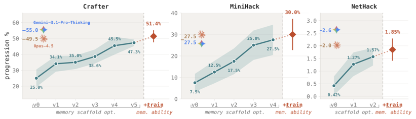
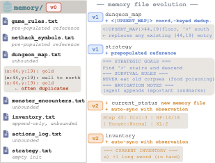
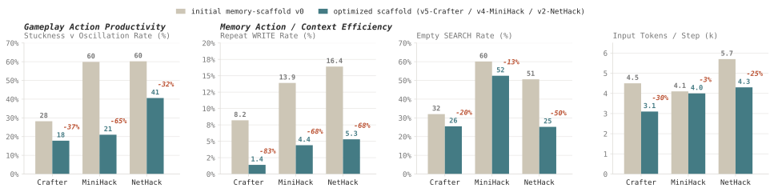
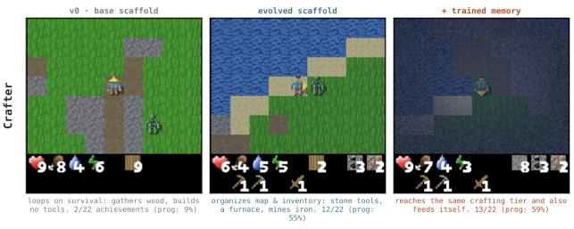
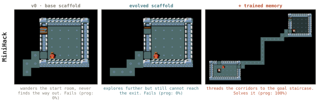
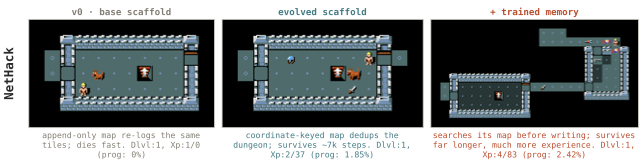

# AutoMem — Research Note
> [English](./README.md) | **繁體中文**

## 📇 Academic Context

| Field | Value |
|-|-|
| Title | AutoMem: Automated Learning of Memory as a Cognitive Skill |
| Venue | arXiv preprint (2607.01224v1) |
| Year | 2026 |
| Authors | Shengguang Wu, Hao Zhu, Yuhui Zhang, Xiaohan Wang, Serena Yeung-Levy (Stanford University) |
| Official Code | https://github.com/autoLearnMem/AutoMem |
| Venue Kind | paper |

> 本筆記依據 arXiv 預印本 `2607.01224v1`（LaTeX 原始碼）撰寫。論文採用 `neurips_2026` 預印本模板，但截至撰稿日並無可查證的正式接受紀錄，因此 venue tier 記為 `unknown`；正式發表版本的數字與敘述可能與此預印本不同。

## Introduction

大型語言模型的 context window 就是它的工作記憶：一個固定大小的緩衝區，一次只能容納有限資訊。長時序任務（long-horizon task）動輒跑上萬步，遠超這個容量。過去常見的做法是把外部記憶當成一個「架構模組」外掛上去——RAG 的檢索資料庫、MemGPT 的分頁機制、Generative Agents 的記憶流——這些設計都預先固定了「記憶如何運作」。

AutoMem 換了一個視角：**記憶管理本身是一種可以訓練的技能**，而非固定機制。它借用認知科學的後設記憶 (metamemory) 概念——人類會學習「什麼值得記、何時該回想、如何組織所知」——把這套能力交給模型自己決定。具體做法是把檔案系統操作（read、write、search、append、create）提升為模型 action space 裡的「一級記憶動作」，和它操作環境的任務動作平起平坐：同一次 forward pass 既可以選任務動作，也可以選記憶操作（例如 `<|APPEND|>` 或 `<|SEARCH|>`）。這樣每一個記憶決策都是軌跡裡一個可追蹤的動作。

論文主張記憶技能沿兩個軸進步：支撐它的**結構**（prompt、檔案 schema、動作詞彙）與行使它的模型**熟練度**。這兩軸都難以人工優化——單一 episode 可長達 $10^4$–$10^5$ 步，一個記憶失誤可能潛伏數百步才浮現後果，人工逐條審閱完整軌跡並不可行。AutoMem 的核心觀察是：一個夠強的 LLM（meta-LLM）可以像 code reviewer 讀完整執行日誌一樣讀完整段 episode，指出記憶決策哪裡出錯，因此可以**自動化**這兩軸的優化。

如何衡量成功？作者選了三個程序生成（procedurally generated）的長時序遊戲——Crafter、MiniHack、NetHack——都來自 BALROG benchmark。選遊戲的理由是：episode 夠長，光靠 context window 管理撐不住；世界每個 seed 重新生成，pretraining 記憶轉移不了，逼模型真的去「做筆記」（地圖、物品欄、遭遇日誌）。主要指標是 BALROG 的 **progression rate**（縮放到 $[0,100]$），基座模型固定為 `Qwen2.5-32B-Instruct`。baseline 分兩組：BALROG 排行榜上的 frontier / open-weight 模型，以及同一顆 32B 模型配上基本的 sliding-window context 管理（該 sliding-window baseline 只保留最近 16 步的 observation，可搭配或不搭配 chain-of-thought）。核心結果是：**只優化記憶、完全不動任務動作的模型權重**，就把 32B 基座 agent 的表現拉高約 2–4 倍——按 v0 到完整 AutoMem 逐環境重算，Crafter、MiniHack、NetHack 分別為 2.05×、4.00×、4.40×——追到 Claude Opus 4.5、Gemini 3.1 Pro Thinking 等 frontier 系統的水準。

## First Principles

### 內層 agent：把記憶當成檔案系統

內層迴圈就是一顆 LLM agent 跑一個 episode，配一個磁碟上的目錄當外部記憶。每一步跑兩個 routine，各對應記憶管理的一面：

- **LOG routine** 問「剛剛發生的事，有什麼值得記？」——agent 決定要不要記錄環境對上一動作的回應，以及怎麼記（append 到既有檔、開新檔、或改寫某條）。
- **PLAN routine** 問「要行動，我需要回想什麼？」——agent 跨檔案 search、讀特定條目或其尾端，然後 commit 下一個世界動作。

關鍵在於：記憶操作和任務動作**共用同一個 action space**，這才讓記憶成為「可學習的技能」而非固定機制。因為每個記憶決策都是軌跡裡可觀察的動作，外層迴圈才能觀察、評估、優化它。論文也主張一個副作用：優化記憶結構會**連帶改善任務行為**——整理得更好的記憶減少了重複探索與漫無方向的動作，即使優化器針對的是記憶 scaffold 而非遊戲策略本身。

### 兩個外層迴圈：一個共同的機器學習結構

論文把兩個迴圈統一成一個熟悉的機器學習形式：每個迴圈都有要優化的參數 $\theta$ 與從 meta-LLM 軌跡分析導出的更新訊號 $\nabla L$。用論文自己的類比可以寫成（記號沿用論文，下標為本筆記所加以區分兩迴圈）：

$$\theta_{\text{struct}} \leftarrow \theta_{\text{struct}} + \nabla L_{\text{struct}}, \qquad \theta_{\text{prof}} \leftarrow \theta_{\text{prof}} + \nabla L_{\text{prof}}$$

差別在於「參數是什麼、更新訊號長什麼樣」：

- **Outer-loop #1 (structure)**：$\theta_{\text{struct}}$ 是 agent scaffold（程式碼、prompt、記憶檔 schema、動作詞彙），$\nabla L_{\text{struct}}$ 是一次**程式碼改寫**。meta-LLM（Claude Opus 4.6，`--effort max`）拿到完整 episode 軌跡（逐步日誌、產生的記憶目錄、agent 程式碼本身），像 code reviewer 一樣診斷失敗樣式並改寫 scaffold。每次改寫都**以量測改善為門檻**：改寫後的 agent 跑同一組固定 eval seeds，只有平均 progression 嚴格超過前一版才保留；失敗給 1次 retry，再失敗就從乾淨 session 重啟。實務上約 2–5 次迭代收斂（Crafter 到 `v5`、MiniHack 到 `v4`、NetHack 到 `v2`）。

- **Outer-loop #2 (proficiency)**：$\theta_{\text{prof}}$ 是一個專職記憶模型的權重，$\nabla L_{\text{prof}}$ 是一個「配置妥當的監督式訓練步」。這裡 meta-LLM（Claude Opus 4.7，`--effort max`）當 **training engine**，把「資料篩選邏輯、資料組成、LoRA 訓練配置」當成一個**聯合決策**跨迭代精煉。關鍵限制：訓練資料每一筆都是內層模型自己在 episode 裡產生的原文，meta-LLM 只當**篩選器 (filter)**挑哪些回應值得強化，而非當 teacher 生成新答案。

因為記憶被當成可分離的技能，只 finetune 一個專職的 **memory specialist** (LoRA 適配器)，負責 LOG routine 與 PLAN routine 裡諮詢記憶的部分；**gameplay model** (未改動的基座) 負責 commit 世界動作。推論時兩個模型實例共用一段對話歷史，specialist 做完最後一次記憶操作後短暫交棒給 gameplay model。好處有二：訓練訊號專注在記憶操作、不被動作格式範例稀釋；基座產生良好格式世界動作的能力完全保留，因為它的權重從未被 finetune 碰過。

### Worked example：NetHack 的地圖去重（scaffold 如何演化）

最能說明「delayed consequence」的具體例子是 NetHack 的地圖檔。基座 schema（v0）用一個 append-only 的 `dungeon_map.txt`，無上限成長：agent 每次重訪同一格 $(x,y)$ 就再記一條，很快累積上千條重複座標，把有用資訊埋掉。meta-LLM 讀完整 NetHack 軌跡後診斷出這點，引入一個 `<|UPSERT_MAP|>` 操作，改成座標鍵去重——任何對 tile $(x,y)$ 的新觀察會**覆寫**舊條目而非並排堆疊。演化後的 schema 還加了從觀察自動同步的 `inventory` 與 `status` 檔（省去模型手動 READ 對帳），以及預填的 `strategy` 參考（把「找樓梯下降」這個主目標直接寫死，讓模型不用在 episode 早期浪費操作重新發現目標）。

效果是量化的：這些改動讓 agent 每步必須攜帶的記憶成長從 **138 字元降到 6 字元，減少 95%**。這正是外部記憶的本意——壓縮模型必須注意的資訊。把這條 worked example 放回主表：NetHack 的 progression 從 v0 的 0.42% 升到 scaffold 收斂的 1.57%（×3.74），再訓練後到 1.85%。

### 兩軸如何在數字上疊加

下表是三個環境的主結果（progression rate %，mean $\pm$ standard error）。評估用固定的 10 個 seeds `[42..51]`，但每個環境的評估 episode 數不同（比照 BALROG 預設）：Crafter 10 局、MiniHack 40 局（8 個 task 各 5 局）、NetHack 5 局，因此三環境的樣本規模並不對稱。frontier 數字取自 BALROG 排行榜；`Qwen2.5-32B-Instruct` 各列用同一 BALROG harness。

| Agent | Crafter (%) | MiniHack (%) | NetHack (%) |
|-|-|-|-|
| *Frontier proprietary（BALROG）* | | | |
| Gemini-3-Pro | 57.3 ± 4.4 | 40.0 ± 7.7 | 6.8 ± 3.2 |
| Gemini-3.1-Pro-Thinking | 55.0 ± 6.4 | 27.5 ± 7.1 | 2.6 ± 0.3 |
| Claude-Opus-4.5 | 49.5 ± 3.1 | 27.5 ± 7.1 | 2.0 ± 0.5 |
| *Open-weight（BALROG）* | | | |
| DeepSeek-R1 (671B) | 36.4 ± 3.8 | 25.0 ± 6.8 | 1.4 ± 0.5 |
| Qwen2.5-72B-Instruct | 27.3 ± 3.6 | 5.0 ± 3.4 | 0.3 ± 0.3 |
| Qwen2.5-7B-Instruct | 16.4 ± 3.0 | 0.0 ± 0.0 | 0.0 ± 0.0 |
| *32B + 基本 context 管理* | | | |
| sliding window | 19.55 ± 3.46 | 2.50 ± 2.47 | 0.00 ± 0.00 |
| + chain-of-thought | 17.27 ± 2.71 | 10.00 ± 4.74 | 0.00 ± 0.00 |
| *32B + AutoMem（ours）* | | | |
| memory-as-file-system, v0 | 25.00 ± 5.50 | 7.50 ± 4.16 | 0.42 ± 0.37 |
| + scaffold opt.（loop #1） | 47.27 ± 2.05 | 27.50 ± 7.06 | 1.57 ± 0.35 |
| + memory training（loop #2） | **51.36 ± 3.81** | **30.00 ± 7.25** | **1.85 ± 0.44** |

只做 scaffold 優化（權重全程不動）就把 progression 大致翻倍到三倍以上：Crafter 25.0→47.27（×1.89）、MiniHack 7.5→27.5（×3.67）、NetHack 0.42→1.57（×3.74）。訓練 memory specialist 再疊加互補增益：Crafter +4.09、MiniHack +2.5、NetHack +0.28，量級相當於一到兩次 scaffold 迭代。

scaffold 優化到底改變了什麼行為？論文量了四個指標（v0 vs 收斂版，皆越低越好）：

再看訓練帶來的行為內化：在演化後 scaffold 上，比較基座模型與訓練後 specialist 的「LOG 階段每次 SEARCH 對應幾次 write」（越低代表寫入前先檢索）——Crafter 0.84→0.39（−54%）、MiniHack 2.89→0.82（−72%）、NetHack 4.66→1.31（−72%）。也就是說，訓練把 scaffold 原本靠 prompt 鼓勵的「先查再寫 (consult-before-write)」紀律，內化進了記憶模型的權重。

### 定性案例分析：三種環境的行為演化

聚合表把兩軸的增益壓成幾個平均數字，但看不到「行為」怎麼變。論文各挑一個代表性的評估 episode，把三個優化階段（基座 v0 → 演化後 scaffold → 再訓練 specialist）並排，讓記憶對行為的影響直接可見。要注意這裡每格標的 progression 是**單一代表性 episode** 的值，和前面主表的跨 episode 聚合平均（Crafter 10、MiniHack 40、NetHack 5 局）是兩回事——尤其 NetHack 格內的 1.85% 是這一局 scaffold 的單局值，恰好與主表 loop #2 的平均數字撞號，不要混為一談。

在 Crafter，v0 只會重複收集木材、卡在生存循環（progression 9%）；演化後的 scaffold 把地圖與物品欄整理到足以合成石製工具、建造熔爐、開採鐵礦（55%，12/22 achievements）；再訓練的 specialist 維持同一工藝水準之餘，還會主動進食維持生存（59%，13/22）。

MiniHack 的 Corridor-R3 是一個要穿過分支走廊抵達目標樓梯的導航任務。v0 在起始房間內打轉找不到出口，演化後 scaffold 探索得更遠但仍耗盡 step 上限、到不了樓梯，兩者 progression 皆 0%；再訓練的 specialist 則穿過分支走廊抵達目標樓梯、解出任務（100%）。這是「光改 scaffold 不夠、熟練度訓練帶來質變」最鮮明的一格：同一組記憶結構下，這一局的成敗從 0% 翻到 100%。論文沒有把這單一 episode 的成功拆解成單一成因，不過在聚合層級，訓練後的 specialist 在 MiniHack 上「LOG 階段每次 SEARCH 對應的 write」由 2.89 降到 0.82（−72%，見上一節），呈現一種跨 episode 的「先查後寫」傾向，可視為這類行為改善背後的一條線索。

NetHack 最能體現「delayed consequence」。v0 用 append-only 地圖不斷重記同一格 tile，很快在數百步內死去，角色停在 experience level 1（progression 0%）；演化後的座標鍵去重地圖（見前面的記憶檔演化圖）讓 agent 存活上千步、升到 level 2（1.85%）；再訓練的 specialist 在這一局裡寫入前會先查地圖、而非盲目附加，同一局中也存活更久、爬到 level 4（2.42%）。要強調的是：這是論文挑出的**單一代表性 episode**，圖 6 的說明只記錄了「先查再寫」這個行為與「存活更久、升到 level 4」這個結果在同一局同時出現，並未對這一局做 ablation 或因果拆解，因此無法斷定是主動檢索這個行為單獨延長了存活。角色等級 1→2→4 的階梯提供的，是「記憶去重／主動檢索」與「存活時間」在單局尺度上共同出現的一個可直接數的觀察，而非兩者的因果證明。

## 🧪 Critical Assessment

### 問題是否真實且重要

長時序 agent 的記憶瓶頸是真問題：NetHack 的 $10^4$–$10^5$ 步 episode 確實遠超任何 context window，而 frontier 模型在 NetHack 上也只有個位數 progression（Gemini-3-Pro 6.8%、Claude-Opus-4.5 2.0%），顯示這是一個未被解決、值得投入的方向。「把記憶當可訓練技能而非固定模組」的框架也不是換皮：它把記憶決策變成 action space 裡可觀察、可優化的動作，這個 observability 論點是實質的設計選擇，而非行銷語言。

### baseline、ablation、資料與指標是否充分

這是本文最需要謹慎解讀之處。**frontier 對照並非同場競技**：Gemini/Claude 的數字取自 BALROG 排行榜的「vanilla」設定，並未套上 AutoMem 的 scaffold 或 two-model 部署，而 32B 模型享有為每個環境量身優化的 scaffold + 專職 specialist。因此「32B 追平 frontier」嚴格說是「有 scaffold 的 32B vs 沒 scaffold 的 frontier」——frontier 模型若也吃同一套 scaffold，天花板未知。論文把這句話寫成「closing the gap」尚屬謹慎，但讀者容易過度解讀成模型能力等價。

**樣本量小、變異大**：每個數字都在固定的 10 個 eval seeds `[42..51]` 上評估，但實際評估 episode 數依環境而異——Crafter 10、MiniHack 40（8 個 task 各跑 5）、NetHack 5——所以三個環境的樣本規模並不對稱。NetHack 的值落在 0.42–1.85 而 standard error 達 ±0.35–0.44，1.57 與 1.85 之間的 +0.28「增益」在誤差帶內幾乎無法區分——把它稱作 loop #2 的「互補增益」在 NetHack 上證據其實很弱（Crafter 的 +4.09 相對紮實）。

**NetHack 的絕對水準接近地板**：所謂「追到 frontier」在 NetHack 上是 1.85% 對 2.0–2.6%，雙方都在近乎失敗的區間；宣稱在此「達到 frontier 水準」在統計與實務意義上都很單薄，真正有說服力的是 Crafter（51.36 vs 49.5）與 MiniHack（30.0 vs 27.5）。

### 自訂收斂點與 eval seed 的重疊風險

一個結構性隱憂：**scaffold 優化的接受門檻用的是同一組 eval seeds `[42..51]`**——「改寫後的 agent 跑同一組固定 eval seeds，平均 progression 有升才保留」。而最終報告的表格也是在這 10 個 seed 上評估。這意味著 loop #1 是**直接對測試 seed 做選擇**，收斂版本（v5/v4/v2）等於是在這些 seed 上被挑出來的最佳者，存在對評估集過擬合的空間；各環境還各自挑不同的收斂迭代數（v5/v4/v2），更像是事後選點。相對地，loop #2 的訓練 seed 明確與 eval seed 不相交（Crafter 100、MiniHack 400、NetHack 50 episodes，seed 隨機且 disjoint），這一半的實驗設計乾淨得多。作者未報告在一組 held-out seed 上的 scaffold 表現，這是我認為最該補的對照。

### 是「記憶」的功勞，還是 frontier meta-LLM 的功勞

「32B 就能追 frontier」的敘事有個容易被忽略的成本：驅動兩個迴圈的 meta-LLM 是 Claude Opus 4.6 / 4.7 配 `--effort max`。真正做診斷、改寫程式碼、篩資料、調 LoRA 的是 frontier 模型；32B 只是被優化的對象。因此結論更準確的版本是「用 frontier meta-LLM 離線優化，可以把一顆 32B 的長時序記憶行為推到 frontier 推論水準」——這在部署階段確有 accessibility 價值（跑的是 32B），但把它讀成「小模型自主追平大模型」會誤解 leverage 的來源。

### 新意 vs 既有工作的重新包裝，以及真實世界關聯

定位大致誠實：論文在 related work 明確區隔 MemAct（記憶即動作，但作用在 context window 而非外部檔案）、MemSkill（記憶為可演化技能）、MeMo（凍結基座 + 專職記憶模型，但編碼靜態文件知識而非 agent 的記憶管理決策）。AutoMem 的差異化賣點是「同時優化 structure 與 proficiency 兩軸」，這個 coverage 論點站得住。但也要注意其可推廣性受限：論文自陳記憶是 **episodic**（每 episode 從零開始，不跨 episode 持久化），且三個環境各訓一套 scaffold + specialist，無法共用——距離「real-world memory-intensive 任務」還有明顯落差，作者在 limitations 誠實列出這幾點。整體而言這是一篇設計清楚、批判空間集中在「對照公平性與評估集選擇」的紮實工作，而非可以照單全收的無瑕結果。

## 一分鐘版

- **記憶瓶頸**：LLM 的 context window 就像一個固定大小的緩衝區，裝不下動輒上萬步的長時序任務。NetHack 每局可長達 $10^4$–$10^5$ 步，即便最強的 frontier 模型，其 BALROG 排行榜成績的 progression 也只有個位數（Gemini-3-Pro 6.8%、Claude-Opus-4.5 2.0%）。
- **記憶即動作**：AutoMem 把讀寫檔案當成和環境互動一樣的「一級動作」，交給模型自行決定何時記、記什麼。同一次 forward pass 裡，模型既可以選遊戲動作，也可以選 `<|APPEND|>` 或 `<|SEARCH|>` 來操作外部記憶檔。
- **只優化記憶的威力**：完全不動遊戲策略的權重，單靠自動優化記憶檔的結構與使用熟練度，就能讓小模型表現翻倍——32B 基座在 MiniHack 上因此提升 4.00 倍。
- **對照的公平性與侷限**：所謂「小模型追平大模型」的比較並不同場競技——當作對照的 Claude 與 Gemini 取自 BALROG 的 vanilla 設定，並未配上這套量身打造的記憶系統；而且決定 scaffold 好壞的接受門檻，用的竟然和最終測試同一組 eval seeds，留有對評估集過擬合的空間。
- **價值在離線部署**：真正做診斷與改寫的是最頂尖的 frontier meta-LLM（Claude Opus 4.6/4.7），小模型只是離線被優化後享受成果。實務上可用大模型當「教練」離線調校、部署時只跑 32B 省成本，但這不等於小模型能自主追平大模型。

## 🔗 Related notes

- [Reflexion](../Reflexion/) — 同樣讓 agent 靠自我反思跨 episode 改進，但用語言反思而非可訓練的記憶技能；AutoMem 在 related work 中將其歸為 embodied-agent 範式的對照。
- [LoRA](../Lora/) — memory specialist 正是用 LoRA 適配器 finetune 出來的。
- [Agent-as-a-Judge](../Agent-as-a-Judge/) — 以 agent 審查 agent，和 AutoMem「meta-LLM 當 code reviewer / training engine」的軌跡級審查精神相通。
- [Meta-Harness](../MetaHarness/) — 同屬「自動化優化 agent 系統」的 Stanford 工作，AutoMem 的 scaffold loop 與其 diagnose-and-revise 結構相近。
