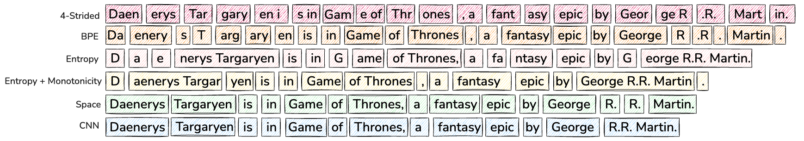
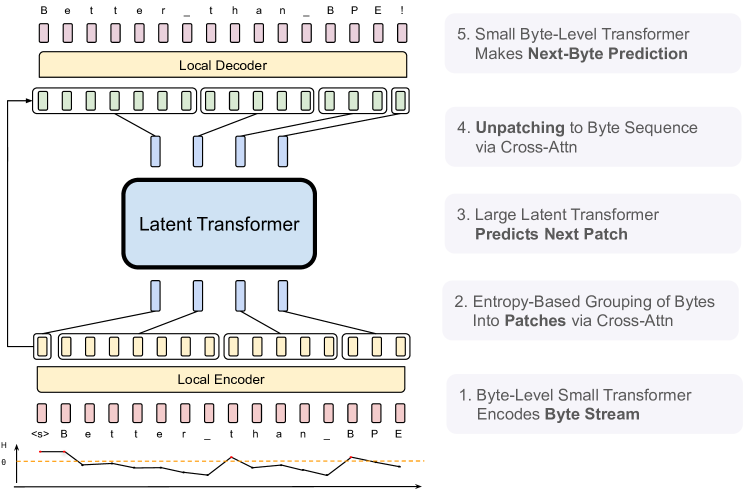
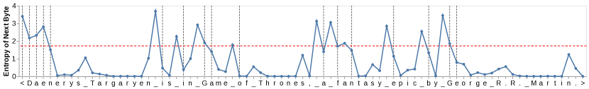

# Byte Latent Transformer — Research Note

## 📇 Academic Context

| Field | Value |
|-|-|
| Title | Byte Latent Transformer: Patches Scale Better Than Tokens |
| Venue | arXiv preprint (2412.09871) |
| Year | 2024 |
| Authors | Artidoro Pagnoni, Ram Pasunuru, Pedro Rodriguez, John Nguyen, Benjamin Muller, Margaret Li, Chunting Zhou, Lili Yu, Jason Weston, Luke Zettlemoyer, Gargi Ghosh, Mike Lewis, Ari Holtzman, Srinivasan Iyer (FAIR at Meta) |
| Official Code | https://github.com/facebookresearch/blt |
| Venue Kind | tech-report |

> 說明：本文基於 arXiv 預印本 `2412.09871`（FAIR at Meta 技術報告，`fairmeta` 排版）撰寫，正式會議之 camera-ready 版本可能與此有差異；本文所有數值與引文均取自預印本 LaTeX 原始檔。venue 分級（tier）此處標為 `unknown`，因為 ledger 中沒有可引用的排名來源。

## First Principles

### 問題：tokenization 是唯一沒有被端到端學習的環節

現代大型語言模型（LLM）幾乎全程都是端到端訓練，唯一的例外是 tokenization —— 一個把 byte 序列用啟發式規則（heuristic）壓縮成固定詞表（fixed vocabulary）的前處理步驟。這個靜態詞表帶來幾個結構性副作用：對領域／模態（domain/modality）敏感、對輸入雜訊（input noise）脆弱、缺乏拼寫層級（orthographic）知識、以及多語言的不公平（multilingual inequity）。過去大家仍離不開 tokenization，是因為直接在 raw bytes 上訓練 LLM 的序列太長、規模化時計算成本過高。

Byte Latent Transformer（BLT）主張：與其讓每個 token 都吃到相同的計算量，不如讓模型「在需要的地方才動用算力」。它把 bytes 動態切成大小可變的 **patch**，patch 才是主要的計算單位；切分的依據是下一個 byte 的預測熵（entropy），資料越複雜的地方才分配越多算力與模型容量。作者提出這是第一個把 byte-level 模型做 FLOP-controlled 規模化研究、一路推到 8B 參數與 4T 訓練 bytes 的工作，並宣稱首次在規模上追平以 tokenization 為基礎的模型。

### Patch 與 token 的根本差異

「token」指的是訓練前就從有限詞表選出的 byte 群組；「patch」則是沒有固定詞表、動態切出的 byte 群組。關鍵區別在於：使用 token 時，模型無法直接存取底層的 byte 特徵；而 patch 保留了對 byte 資訊的存取。更重要的是它重新定義了「詞表大小 vs. 計算量」的取捨：在標準 LLM 中，把詞表變大等於平均 token 變長、模型步數變少，但最後的輸出投影層維度也跟著暴增。論文舉例，Llama 3 為了把平均 token 從 3.7 bytes 提升到 4.4 bytes，付出的代價是把 embedding table 相對 Llama 2 放大 4 倍。BLT 因為沒有固定詞表，可以任意加大 patch size 而不受這個 embedding 膨脹的牽制。

論文比較了幾種把 bytes 分組成 patch 的方案（下圖）：固定每 k 個 byte 切一刀的 strided patching（如 MegaByte）、BPE tokenizer、以空白（space-like bytes）切分（SpaceByte），以及本文的 entropy patching。由於每個 patch 都要跑一次昂貴的 global transformer step，**patch 的數量直接決定了主要的 FLOP 開銷**，因此「平均 patch 大小（patch size）」是決定訓練與推論成本的主因。

### Entropy patching：用小型 byte LM 的下一 byte 熵來切分

BLT 不用「遇到空白就切」這種規則，而是資料驅動地找出「高不確定性」的下一 byte 位置。作者先在 BLT 的訓練資料上訓練一個小型 byte-level 自回歸語言模型，計算其在 byte 詞表 $\mathcal{V}$ 上對下一 byte 的分布 $p_e$，並取其熵：

$$H(x_i) = \sum_{v \in \mathcal{V}} p_{e}(x_i=v \mid \pmb{x}_{<i}) \log p_{e}(x_i=v \mid \pmb{x}_{<i})$$

有了每個 byte 的熵，就有兩種找 patch 邊界的判準：一是熵超過全域門檻（global threshold）$\theta_g$，二是熵相對前一個 byte 的躍升超過門檻 $\theta_r$（近似單調約束，approximate monotonic constraint）：

$$\text{Global:}\quad H(x_t) > \theta_g \qquad\qquad \text{Monotonic:}\quad H(x_t) - H(x_{t-1}) > \theta_r$$

這個小 entropy 模型在實驗中是一個 100M 參數、14 層、hidden 512、滑動視窗（sliding window）512 bytes 的 transformer；當 receptive field 夠小時，它甚至可以編碼成一個高效的查表（lookup table）。門檻 $\theta_g$ 則反推自「想要的平均 patch size」，因此 patch size 在 BLT 中是一個可以自由選定的旋鈕。

一個關鍵的正確性性質是 **incremental patching**：生成時模型必須在還沒看到後續 bytes 的情況下，就決定當前位置是不是 patch 邊界（因為這決定要不要動用 global transformer）。形式化地說，切分函數 $f_p$ 必須滿足下式，也就是對前綴的切分不能被未來 bytes 改變：

$$f_p(\pmb{x}_{<i}) = f_p(\pmb{x})_{<i}$$

BPE 不滿足這個性質——同樣的前綴會因為後續內容不同而被切得不一樣——這正是 entropy patching 相對 tokenization 在推論一致性上的優勢。

### 三段式架構：兩個輕量 local 模型夾一個重量級 global 模型

BLT 由三個 transformer 區塊組成：一個大型的 global **Latent Transformer**（自回歸、跑在 patch 表徵上、用 block-causal attention），以及兩個輕量的 byte-level local 模型（$l_{\mathcal{E}} \ll l_{\mathcal{G}}$、$l_{\mathcal{D}} \ll l_{\mathcal{G}}$）。Local Encoder 把 byte 序列編碼成 patch 表徵，Local Decoder 再把 patch 表徵解回 raw bytes。global 模型消耗絕大部分的 FLOP，因此「何時才動用它」就是控制算力分配的旋鈕。

Local Encoder 在每個 byte embedding 上還會疊加 **hash n-gram embeddings**：對每個位置 $i$ 取 $n \in \{3,4,5,6,7,8\}$ 的 byte-gram，用 rolling polynomial hash 映到固定大小的 embedding table 後相加。BLT 各模型都用 500,000 個 hash、單一 hash 函數。增強後的 embedding 為：

$$e_i = x_i + \sum_{n=3}^{8} E_{n}^{hash}(\text{Hash}(g_{i,n}))$$

byte 與 patch 之間的資訊流靠 **cross-attention** 打通：Encoder 端以 patch 表徵為 query、byte 表徵為 key/value 把 bytes 池化成 patch；Decoder 端則角色對調，以 byte 表徵為 query、patch 表徵為 key/value 把 patch「解 patch（unpatching）」回 bytes。每個 query patch 只 attend 到屬於自己那個 patch 的 bytes。

### 評測用的度量：Bits-Per-Byte

因為 perplexity 只在固定 tokenizer 下才有意義，要公平比較 byte-level 與 token-level 模型，論文沿用先前工作改報 **Bits-Per-Byte（BPB）**，即把整段資料的交叉熵損失以總 byte 數與常數正規化，得到一個與 tokenizer 無關的困惑度：

$$\text{BPB}(x) = \frac{\mathcal{L}_{CE}(\pmb{x})}{\ln(2)\cdot n_{\text{bytes}}}$$

FLOP 估計上，論文沿用 Chinchilla 的 transformer FLOP 公式，但把輸入 embedding 層視為高效查表、當作 0-FLOP 操作，並假設反向傳播的 FLOP 是前向的兩倍。

### 一個具體的前向流程（用論文的真實數字）

以論文 Figure 4 的例句 `Daenerys Targaryen is in Game of Thrones, a fantasy epic by George R.R. Martin.` 為例，走一遍 entropy patching：小 entropy 模型逐 byte 算出 $H(x_i)$，凡是 $H(x_i)$ 超過紅線 $\theta_g$ 的 byte 就開一個新 patch。在 `George R.R. Martin` 這個命名實體裡，`G` 與 `e` 的熵超過 $\theta_g$，於是 `G` 自成一個單 byte 的 patch，`e` 開啟一個較大的 patch——因為接下來熵一路走低（名字後半很好猜），整個實體剩餘部分不再產生新 patch。直覺上，難預測的字首拿到一次昂貴的 global step，好猜的字尾則被便宜地打包。

再看架構層面的算力帳（8B 設定，來自附錄 Table 8）：Local Encoder 只有 1 層、$h_{\mathcal{E}}=1280$、約 20M 參數；global Latent Transformer 有 32 層、$h_{\mathcal{G}}=4096$、約 6.4B 參數；Local Decoder 6 層、$h_{\mathcal{D}}=1280$、約 120M 參數；cross-attention 用 20 個 head、$k=4$。在 BLT-1T 上平均 patch size 約 4.5 bytes，所以對一段 16k bytes 的 context，昂貴的 global 模型只跑約 $16000/4.5 \approx 3556$ 步，而不是對每個 byte 各跑一步。真正的效率槓桿在於：把 patch size 從 4.5 拉到 8，global step 幾乎砍半，就換來論文宣稱的近 50% 推論 FLOP 節省；而 local 模型的參數量從 400M 放大到 8B 時只約略翻倍，所以放大 patch 幾乎只影響 global transformer 的 FLOP，不影響 byte-level 模組。

### 頭條結果

在 BLT-1T 資料上、以相同 FLOP 預算訓練的三個 8B 模型比較如下（Table 1，準確率越高越好）：

| Task | Llama 3 (BPE) | BLT-Space | BLT-Entropy |
|-|-|-|-|
| Arc-E | 77.6 | 75.4 | **79.6** |
| Arc-C | **53.3** | 49.8 | 52.1 |
| HellaSwag | 79.1 | 79.6 | **80.6** |
| PIQA | 80.7 | **81.1** | 80.6 |
| MMLU | **58.1** | 54.8 | 57.4 |
| MBPP | 40.2 | 37.6 | **41.8** |
| HumanEval | 31.1 | 27.4 | **35.4** |
| Average | 60.0 | 58.0 | **61.1** |
| Bytes/Patch | 4.4 | **6.1** | 4.5 |

BLT-Entropy 在 7 項中有 4 項勝過同資料量的 Llama 3，平均 61.1 對 60.0；而 BLT-Space 雖然平均略輸，卻靠 6.1 bytes 的更大 patch 換到顯著的推論 FLOP 節省。作者把 BLT-Entropy 的優勢歸因於（1）動態 patching 更會用訓練算力、（2）直接建模 byte 層級資訊。

在字元層級（character-level）任務上，byte 建模的優勢更明顯（Table 2 節選，8B 模型）：

| Task | Llama 3 (1T) | Llama 3.1 (16T) | BLT (1T) |
|-|-|-|-|
| HellaSwag 加噪平均 | 56.9 | 64.3 | **64.3** |
| CUTE（總分） | 27.5 | 20.0 | **54.1** |
| CUTE - Spelling | 1.1 | – | **99.9** |

BLT 在 CUTE 這個字元理解 benchmark 上比兩個 BPE Llama 3 模型高出 25 分以上，拼寫（spelling）任務甚至到 99.9%——而且它只用了 Llama 3.1 的 1/16 資料量。作者據此論證：字元層級資訊對 BPE 模型來說「很難單靠更多資料學到」。此外，把 global transformer 用預訓練好的 Llama 3.1 權重初始化、以 1/10 學習率微調（論文稱為「byte-ify」蒸餾），能在僅 220B tokens 下把 MMLU 從 BLT 從頭訓練的 25.2 拉到 63.7，逼近原生 Llama 3.1。

### Patch 比 token 更會 scale：固定推論預算下的新維度

BLT 最核心的主張是它解鎖了一個新的 scaling 軸：**在固定推論 FLOP 預算下同時放大模型與 patch size**。下表（Table 3）是固定推論 scaling 研究用的模型配對——每一列的 inference FLOPs/byte 相同：

| Llama 2 | Llama 3 | Entropy ps=6 | Entropy ps=8 | Inference FLOPs | 交叉點 (Bytes) |
|-|-|-|-|-|-|
| 470m | 450m | 610m (1.2x) | 760m (1.6x) | 3.1E8 | 150B |
| 3.6B | 3.9B | 5.2B (1.3x) | 6.6B (1.7x) | 2.1E9 | 1T |

因為更長的 patch 平均省下算力，這些算力可以拿去把 global latent transformer 養得更大（因為它跑得更少次）。BPE 模型在訓練預算很小時較好，但很快就被 BLT 超過——交叉點只落在 compute-optimal 點稍微之後（大 FLOP 級距下從 3x 收斂到約 2.5x）。作者強調，8B 這種被訓練到遠超 compute-optimal（例如 Llama 3.1 多訓兩個數量級資料）的模型，正是這個「多花一次性預訓練、換固定推論預算下更好模型」策略的理想場景。

## 🧪 Critical Assessment

### 問題是真的，還是被 tokenizer 綁架出來的假議題

tokenization 的痛點——多語言不公平、對雜訊脆弱、拼寫無知——是有文獻支撐的真問題，不是硬湊出來的。BLT 在 CUTE 上 54.1 對 27.5 的差距，以及加噪 HellaSwag 上平均約 8 分的優勢，確實把「byte 直通」的價值量化了出來。但要誠實指出：這些字元任務本來就是 tokenizer 的結構性盲點，byte 模型贏在這裡幾乎是定義上的必然；它更像是「證明 byte 模型沒有這個先天缺陷」，而非「byte 模型全面更強」。真正硬的知識與推理任務（MMLU、Arc-C）上，BLT 其實是小輸或持平的。

### baseline、消融與資料是否撐得起「追平 Llama 3」的宣稱

實驗設計相當克制且對自己不利：作者刻意讓每個 batch 的 byte 數在期望上相同、縮短大 patch 模型的序列長度，避免 BLT 靠更長 context 佔便宜，這點值得肯定。消融也涵蓋了 entropy 模型大小、cross-attention 位置、n-gram hash 詞表大小、local 層數等主要設計選擇。但「追平 Llama 3」建立在一個借來的假設上：BLT 直接沿用 Llama 3 為 BPE transformer 算出的 compute-optimal（參數／資料比）與最佳步數。論文自己在 Limitations 承認，這個 scaling law 是給 BPE transformer 算的，對 BLT 可能導致次佳的配置——也就是說目前的 BLT 很可能還沒被放在自己的最佳操作點上，這是把兩者對比時一個未被消化掉的變因。

### 是新架構，還是既有零件的工程重組

BLT 的個別零件多半有前身：static patching 來自 MegaByte、space patching 來自 SpaceByte、entropy／boundary-predictor 式的動態切分在 Nawrot 等人早有雛形、cross-attention pooling 明說是沿用 Perceiver。真正的新意在於「把 entropy patching + hash n-gram + 雙向 cross-attention 組起來，並第一次在 FLOP-controlled、8B/4T 規模上追平 SOTA tokenizer 模型」。這是扎實的規模化貢獻，但要小心把「第一個在此規模做到」誤讀成「方法本身全新」。

### 「patches scale better」的評測是否圍繞自身強項而設計

固定推論 scaling 的結論高度依賴 FLOP 這個理論代理指標，而非真實 wall-clock。論文自己在 Limitations 坦承，現有函式庫是為 tokenizer transformer 高度最佳化的，BLT 用到 FlexAttention 等非標準層，實際牆鐘時間「可能尚未與 tokenizer 模型平起平坐」。因此「patch size 8 省近 50% 推論 FLOP」是一個理論上限，讀者不該直接當成 1.9 倍的實測加速。此外，crossover 點、patch size 的選擇、以及推論時把 entropy 門檻從 0.6 臨時調到 0.1 來換 CUTE 分數，都帶有「benchmark 由作者圍繞自身方法強項定義」的味道——BLT-Entropy 在 Table 1 的優勢有一部分來自這個推論時的門檻調整，而非純粹的架構勝出。

### 宣稱的問題真的解決了嗎、對真實世界有多大意義

在「不用固定詞表也能規模化到 8B/4T 並追平 Llama 3」這個命題上，論文提供了目前最有力的證據，這是實質進展。但「解決」要打折：需要額外訓練並在推論時常駐一個 entropy 模型、依賴一堆尚未被 BLT 專屬 scaling law 驗證過的超參數、且缺乏牆鐘效率的證據。對真實世界的即時意義，最務實的其實是 byte-ify 蒸餾——把已經花大錢訓好的 Llama 3.1 轉成 BLT，用 220B tokens 就把 MMLU 拉到 63.7，這條路避開了從頭 byte 訓練的成本，可能比從零訓練的 BLT 更快落地。

## 🔗 Related notes

- [Byte-Level BPE (BBPE)](../tokenizer/ByteLevelBPE/) — BLT 想取代的固定詞表 tokenization 路線的代表。
