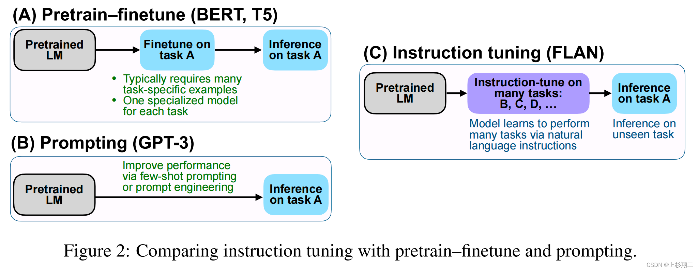

| Property  | Data |
|-|-|
| Created | 2023-01-16 |
| Updated | 2023-04-14 |
| Author | @Aiden |
| Tags | #study |

# ChatGPT
## Training language models to follow instructions with human feedback
| Title | Venue | Year | Code |
|-|-|-|-|
| [Training language models to follow instructions with human feedback](https://arxiv.org/pdf/2203.02155.pdf) | - | '22 | [trlx](https://github.com/CarperAI/trlx) |

### Abstract
| Aspect | Information |
|-|-|
| Cause | Making language models bigger does not inherently make them better at following user intent. Large models can generate untruthful, toxic, or unhelpful outputs. The paper presents an avenue for aligning language models with user intent by fine-tuning with human feedback. |
| Process | The process involves collecting a dataset of labeler demonstrations of desired model behavior and fine-tuning GPT-3 using supervised learning. A dataset of rankings of model outputs is then collected to further fine-tune the model using reinforcement learning from human feedback. |
| Effect | The resulting models, called InstructGPT, outperform the 175B GPT-3 model in human evaluations despite having 100x fewer parameters. InstructGPT also shows improvements in truthfulness and reductions in toxic output generation while having minimal performance regressions on public NLP datasets. Fine-tuning with human feedback is a promising direction for aligning language models with human intent. |

## Methods
| Topic | Summary |
|-|-|
| Research on alignment and learning from human feedback | Builds on previous techniques to align models with human intentions, particularly reinforcement learning from human feedback (RLHF), which has been applied to fine-tuning language models in various domains. Madaan et al. (2022) use human feedback to improve the performance of GPT-3, while Nahian et al. (2021) use RL with a normative prior to align agents in text-based environments. |
| What it means for language models to be aligned | Gabriel (2020) addresses this question, while Kenton et al. (2021) catalog behavioral issues in LMs that result from misalignment, and Askell et al. (2021) propose language assistants as a testbed for alignment research. |
| Training language models to follow instructions | LMs are fine-tuned on a broad range of public NLP datasets with instructions and evaluated on a different set of NLP tasks to improve their downstream performance on held-out tasks. There has been a range of work in this domain, including studies by Yi et al. (2019), Mishra et al. (2021), and Sanh et al. (2021). There is also related work on instruction following for navigation. |

### Instruction Tuning

