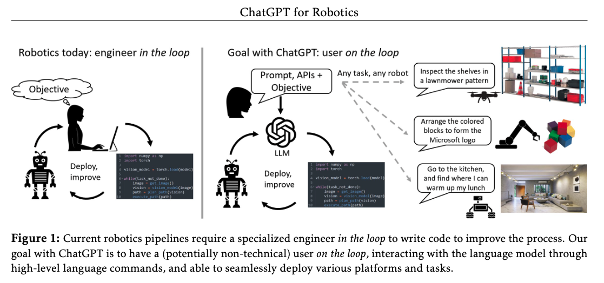

# ChatGPT for Robotics: Design Principles and Model Abilities

| Title | Venue | Year | Code |
|-|-|-|-|
| [ChatGPT for Robotics: Design Principles and Model Abilities](https://www.microsoft.com/en-us/research/uploads/prod/2023/02/ChatGPT___Robotics.pdf) | - | '23 | 

## Abstract

This paper is an experimental study that using ChatGPT for robotics applications. 

And outline a strategy that combines design principles for `prompt engineering` and the creation of a high-level function library which allows `ChatGPT` to adapt to different robotics tasks, simulators, and form factors. 
The article describes a study on the effectiveness of prompt engineering techniques and dialog strategies in using `ChatGPT` for various types of robotics tasks, from basic reasoning to complex domains. 

`ChatGPT` is found to be **effective in solving these tasks and allowing users to interact primarily via natural language instructions**. 
The article also introduces an open-sourced research tool called PromptCraft, which includes a platform for researchers to upload and vote on examples of good prompting schemes for robotics applications and a sample robotics simulator with ChatGPT integration. The tool aims to make it easier for users to get started with using ChatGPT for robotics.

## Clear description of the task details in the prompt

| Component | Definition | Example |
|-|-|-|
| Constraints and requirements | Specifications that are relevant to the task | Weight, size, and shape of objects to be moved |
| Environment | The setting in which the robotics task takes place|Size and shape of a maze, obstacles or hazards to be avoided |
Current state | The current status of the robotics system|Position and orientation of the robot and object to be picked up |
| Goals and objectives | The desired outcomes of the task|Number of puzzle pieces to be assembled, completion time |
| Solution examples | Demonstrations of similar tasks and solution strategies | Examples of how the robot should interact with the user for input, providing a diverse range of examples to avoid biases |

## ChatGPT Ability for solving robotics problem
| Component | Definition | Example |
|-|-|-|
| Zero-shot task planning | ChatGPT can solve robotics tasks without access to code examples | Catching a basketball with visual servoing, Real-world drone flight with intuitive human-robot interface, AirSim industrial inspection |
| User on the loop | ChatGPT can perform complex tasks with feedback from a user | Manipulation with curriculum learning, AirSim obstacle avoidance |
| Perception-action loops | ChatGPT can reason about perception-action loops | Closed loop object navigation with API library, Closed loop visual-language navigation |
| Reasoning and common-sense robotics tasks | ChatGPT has capabilities in logical reasoning and basic robotics concepts | Basic robotics problems, control, camera geometry, physical form factors |
