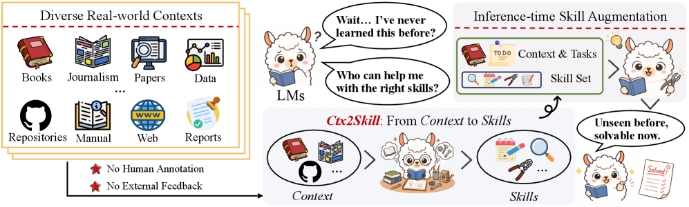
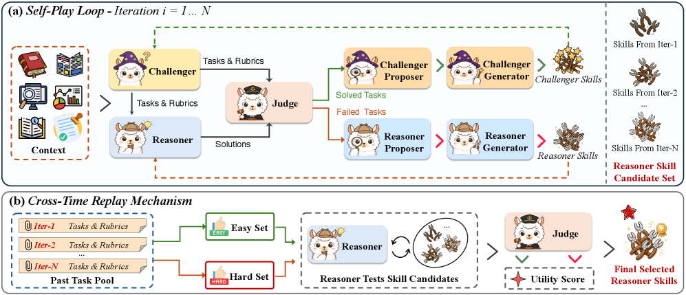
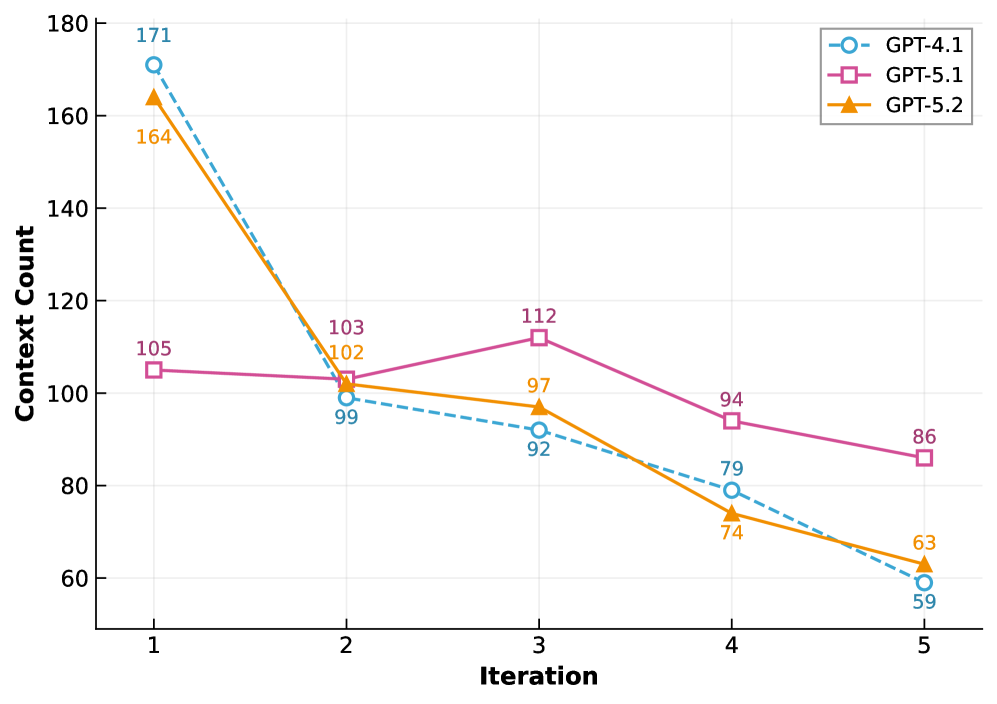
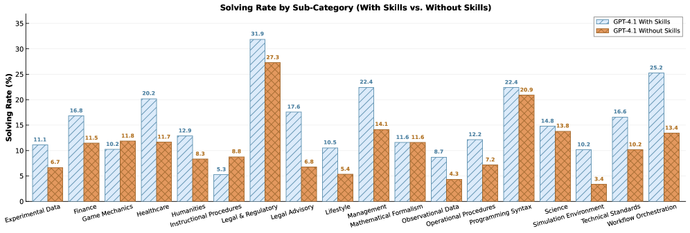

# Ctx2Skill — Research Note
> [English](./README.md) | **繁體中文**

## 📇 Academic Context

| Field | Value |
|-|-|
| Title | From Context to Skills: Can Language Models Learn from Context Skillfully? |
| Venue | arXiv preprint (2604.27660v3) |
| Year | 2026 |
| Authors | Shuzheng Si, Haozhe Zhao, Yu Lei, Qingyi Wang, Dingwei Chen, Zhitong Wang, Zhenhailong Wang, Kangyang Luo, Zheng Wang, Gang Chen, Fanchao Qi, Minjia Zhang, Maosong Sun (THU / DeepLang AI / UIUC / FDU / CUHK) |
| Official Code | https://github.com/S1s-Z/Ctx2Skill |
| Venue Kind | paper |

> 本筆記依據快取的 arXiv 預印本 `2604.27660v3`（版本日期 2026-06-02；v1 首次投稿 2026-04-30）撰寫，正式發表版（若有）可能與此不同。

## Introduction

這篇論文要解的問題是 **context learning**：許多真實任務要求語言模型（LM）從一段「超出其預訓練知識」的長脈絡（context）中即時學會新知識，再用來推理與解題，而不是靠參數裡既有的知識。作者引用 CL-bench 的定義，並強調這與 long-context（主要考檢索/閱讀理解）與 in-context learning（靠示範學簡單任務樣式）不同——context learning 要模型真正把脈絡裡「隱含的規則與流程」歸納出來。舉例來說，讓 LM 讀一份沒見過的產品文件後，生成逐步操作程序或排除故障。

一個直覺解法是 **inference-time skill augmentation**：把脈絡裡的規則與流程抽成自然語言的 **skill**（一份短 Markdown），推理時把它接在系統提示前面。但作者指出這條路在 context learning 情境有兩個根本困難：第一，**人工標註 skill 成本過高**——脈絡又長又技術密集，要標註者完全內化多段落文件在經濟上不可行；第二，**缺乏外部回饋訊號**——不像 coding 或數學能用執行結果或標準答案自動判分，這裡沒有任何自動訊號能告訴你一條 skill 是否忠實、完整地捕捉了脈絡知識。

論文提出 **Ctx2Skill**，一個自我演化框架，在「沒有人工標註、也沒有外部回饋」的前提下，自動從脈絡中發現、精煉並挑選 context-specific skill。核心是一個多智能體 self-play 迴圈：**Challenger** 依脈絡出題與評分準則，**Reasoner** 依當前 skill set 作答，中立的 **Judge** 給二元判定，失敗與成功的案例分別路由到兩側的 **Proposer–Generator** 去診斷弱點並改寫該側 skill，兩側各自演化 skill set 而非更新模型參數。再加一個 **Cross-Time Replay** 機制，從各輪的候選 skill set 中挑最泛化的一份，避免對抗式退化（adversarial collapse）。

衡量成功的方式是把最終 Reasoner skill 接到任意 LM 上，在 CL-bench 的四類 context learning 任務上量測 solving rate。CL-bench 有 500 個脈絡、1,899 個任務、31,607 條評分準則，評分是「全數評分準則通過才算解出」的 all-or-nothing。主要對照組是兩個 skill 建構基線 *Prompting*（單次直接生成 skill）與 *AutoSkill4Doc*（分窗抽 skill 再重組），以及一排不用 skill 的 frontier LM。論文的主結果是 Ctx2Skill 一致地把三個 backbone 拉高：GPT-4.1 從 11.1% 到 16.5%、GPT-5.1 從 21.1% 到 25.8%、GPT-5.2 從 18.2% 到 21.4%。

## First Principles

### 問題形式化與 skill 的角色

一個 context learning 任務由一段脈絡 $C$、一組答案依賴 $C$ 的任務 $\mathcal{T}=\{t_j\}$、以及每題的一組二元評分準則 $\mathcal{R}_j=\{r_{j,k}\}$ 組成。給定 LM $\pi$ 產生的答案 $a_j$，只有當「所有評分準則都通過」時任務才算解出，解題指標定義為：

$$
y_j(\pi;C) = \prod_{k} \mathbb{I}\bigl[r_{j,k}(a_j)=\mathrm{pass}\bigr],
\qquad a_j \sim \pi(\cdot\mid C, t_j).
$$

Ctx2Skill 的介入點很單純：引入一份自然語言 **skill set** $\mathcal{S}$（接在系統提示前的短 Markdown），把作答分布改成條件於 skill 的形式 $a_j \sim \pi(\cdot\mid \mathcal{S}, C, t_j)$。關鍵是全程「不更新任何參數」，只演化這份文字。訓練時 $\mathcal{S}$ 拆成兩份：Reasoner 的 $\mathcal{S}^{\mathrm{R}}$ 與 Challenger 的 $\mathcal{S}^{\mathrm{C}}$；推理部署時只用 Reasoner 那份 $\mathcal{S}^{\mathrm{R}}$。

### 五個凍結 LM 角色的 self-play 迴圈

整個迴圈由五個「凍結參數」的 LM 角色構成，跑 $N$ 輪。在第 $i$ 輪：**Challenger** 依脈絡 $C$ 與自身 skill $\mathcal{S}^{\mathrm{C}}_{i-1}$ 產生一批 $M$ 個任務與評分準則，這些準則刻意設計成「要歸納 $C$ 的規則才答得對，不能只是複述表面片段」；**Reasoner** 依 $C$ 與 $\mathcal{S}^{\mathrm{R}}_{i-1}$ 作答；中立的 **Judge** 逐條準則給二元判定並算出解題指標 $y_m$，把整批切成失敗集 $\mathcal{F}_i=\{m:y_m=0\}$ 與成功集 $\mathcal{P}_i=\{m:y_m=1\}$。

接著每一側各有一對 **Proposer** 與 **Generator**：Proposer 負責「診斷為何失敗/成功」，把一批案例綜合成一個高階診斷（指定動作 add 或 merge、目標 skill 名稱、描述與理由）；Generator 才把診斷「物化」成完整替換的 skill set，只增改相關條目而保留其餘。Reasoner 側吃失敗集 $\mathcal{F}_i$，診斷缺了哪些脈絡知識並更新出 $\mathcal{S}^{\mathrm{R}}_{i}$；Challenger 側吃「太容易被解出」的成功集 $\mathcal{P}_i$，收緊 $\mathcal{S}^{\mathrm{C}}_{i}$ 讓下一輪維持對抗壓力。任何一側的提示都不會看到對方的 skill set，保持嚴格對抗。把 Proposer 與 Generator 拆成兩個 agent（診斷與物化分離）是刻意設計，消融顯示合併會小幅但一致地掉分（GPT-4.1 16.5% → 15.9%）。

### Cross-Time Replay：對抗式退化與如何挑 skill

作者指出這個設計有個內在張力，稱為 **adversarial collapse**：隨輪次推進，Challenger 會生成越來越極端、偏離 $C$ 代表性知識的任務，而 Reasoner 的 skill 因為是「失敗驅動」更新，會對這些病態案例過度特化，累積冗餘 skill 而傷害泛化。更糟的是這種退化在迴圈內偵測不到——每輪的 Judge 只評當輪新生成的任務，無法告訴你早期學會的知識是否已被後續編輯破壞。所以直接回傳最後一輪 $\mathcal{S}^{\mathrm{R}}_{N}$ 並不可靠。

解法是 Cross-Time Replay：在 self-play 過程中「順手」增量收集兩個小探針集——每輪把評分準則通過率最低的失敗題加進 hard 探針集 $\mathcal{Q}^{\mathrm{h}}$，把評分準則數最少的成功題加進 easy 探針集 $\mathcal{Q}^{\mathrm{e}}$。迴圈結束後，讓 Reasoner 用每一份候選 $\mathcal{S}^{\mathrm{R}}_{i}$ 重答兩個探針集，Judge 重評，得到 Laplace 平滑後的解題率：

$$
\rho^h(i) = \frac{\sum_{q \in \mathcal{Q}^{\mathrm{h}}} y_q (\pi^\mathrm{R};C, \mathcal{S}^{\mathrm{R}}_{i}) + 1}{|\mathcal{Q}^{\mathrm{h}}| + 1},
\qquad
\rho^e(i) = \frac{\sum_{q \in \mathcal{Q}^{\mathrm{e}}} y_q (\pi^\mathrm{R};C, \mathcal{S}^{\mathrm{R}}_{i}) + 1}{|\mathcal{Q}^{\mathrm{e}}| + 1}.
$$

最終選出的 skill set 是讓兩者「乘積」最大的那一輪 $\mathcal{S}^{\mathrm{R}}_{\star}=\mathcal{S}^{\mathrm{R}}_{i^\star}$，其中 $i^{\star} = \arg\max_{i}\left(\rho^\mathrm{h}(i)\cdot\rho^\mathrm{e}(i)\right)$。乘積形式是重點：某份 skill 若靠犧牲 easy 題來換 hard 題的進步，會在 $\rho^\mathrm{e}(i)$ 上被懲罰而遭否決；反之亦然。作者以消融驗證這點——把乘積換成加法（Additive Scoring）會掉 0.6%（16.5% → 15.9%）。這份 $\mathcal{S}^{\mathrm{R}}_{\star}$ 一個脈絡只算一次，之後在該脈絡的所有未見任務上重用，成本攤提到 $|\mathcal{T}|$ 題上。

### 一個具體的數字走查

以 GPT-4.1 為例走一遍量級。實作設 $N=5$ 輪、每輪 $M=5$ 題。第 1 輪 Reasoner 平均解出約 $0.91/5$（18.2%）題，到第 5 輪升到 $1.17/5$（23.3%），但失敗率始終在 76% 以上——代表 Challenger 的對抗壓力沒讓 Reasoner 飽和。skill 檔隨輪次近似線性成長：GPT-4.1 的 skill 字數中位數從 Iter-1 的 311 字漲到 Iter-5 的 1,703 字，每輪約加一條、每條約 340 字。但 Cross-Time Replay 選出的最終 skill 中位數只有 705 字，落在 Iter-2（656）與 Iter-3（1,002）之間——也就是說機制多半挑「較早、較精簡」的那幾輪，而非最長的 Iter-5。不過三個 backbone 被選中的輪次並不一致：GPT-4.1 與 GPT-5.2 明顯偏早（最終 skill 中位字數 705、1,458，分別貼近各自 Iter-2 的 656、1,338），而 GPT-5.1 整體偏晚，選中的中位字數 3,682 已逼近它的 Iter-3（3,871）。所以「集中在早期」只對前兩個 backbone 成立，對 GPT-5.1 反而峰值落在中段。

### 主要證據

主結果（CL-bench，all-or-nothing solving rate，%）顯示 Ctx2Skill 在三個 backbone 上都贏過兩個基線與無 skill 版本：

| Model | Overall | Domain Know. | Rule System | Procedural | Empirical |
|-|-|-|-|-|-|
| GPT-4.1（無 skill） | 11.1 | 10.6 | 14.8 | 10.4 | 4.6 |
| GPT-4.1 + Prompting | 12.3 | 12.4 | 12.3 | 13.9 | 8.2 |
| GPT-4.1 + AutoSkill4Doc | 13.2 | 13.3 | 13.1 | 15.0 | 8.7 |
| GPT-4.1 + Ctx2Skill | 16.5 | 16.8 | 17.6 | 17.6 | 9.7 |
| GPT-5.1（無 skill） | 21.1 | 22.4 | 21.0 | 22.8 | 13.6 |
| GPT-5.1 + Ctx2Skill | 25.8 | 27.9 | 24.9 | 26.9 | 19.1 |
| GPT-5.2（無 skill） | 18.2 | 19.5 | 18.0 | 19.1 | 12.1 |
| GPT-5.2 + Ctx2Skill | 21.4 | 22.2 | 20.4 | 25.4 | 12.6 |

一個值得注意的對照：GPT-4.1 配上 Ctx2Skill skill（16.5%）反而超過原生更強、但沒 skill 的 Gemini 3 Pro（15.8%），作者用來論證 context-specific skill 能填補模型能力差距。skill 也具可遷移性但不對稱：GPT-5.1 生成的 skill 給 GPT-4.1 用得到 16.1%（幾乎追平自產 16.5%），但 GPT-4.1 生成的 skill 給 GPT-5.1 只得 23.1%（+2.0%，遠低於自產的 +4.6%）——強模型產的 skill 遷移得好，弱模型則挖不出強模型能用的知識。

## 🧪 Critical Assessment

### 問題真實性與重要性

context learning 這個問題設定是站得住腳的：真實場景（醫師讀新版臨床指引、工程師照文件執行程序）確實要求模型即時吸收未見脈絡而非套用參數知識，且論文用的 CL-bench 是外部、由領域專家標註的基準（500 脈絡 / 1,899 任務 / 31,607 條評分準則），不是作者自訂的 benchmark，這一點大幅降低了「射箭再畫靶」的疑慮。真正尖銳的問題不在題目真不真，而在「是否解決」：即便用上 Ctx2Skill，最好的 GPT-5.1 也只有 25.8% solving rate，換言之四分之三的任務仍然失敗，論文本身也承認 context learning 對當前 frontier LM 仍極具挑戰。這比較像是把一個非常難的問題往前推了幾個百分點，而非解決它。

### 基線、消融、資料與指標是否充分

主結果只比了兩個 skill 建構基線（Prompting 與 AutoSkill4Doc），而 Related Work 列了 AutoSkill、CoEvoSkills、EvoSkill、SkillX 等一整排自動化 skill 方法。作者的理由是那些方法都依賴外部回饋、不適用無回饋情境，這在邏輯上成立，但也意味著「在同一無回饋設定下，還有沒有更強的無回饋基線」這個問題沒被回答，對照面偏窄。更關鍵的統計問題：論文因 API 預算（總花費約 $30K USD）只跑單次、$N=M=5$，明確說「不做多次獨立執行、不報 error bar 或信賴區間」。在 11–26% 這種低絕對值區間，GPT-5.2 上僅 +3.2% 的增益是否穩定於隨機性之外，沒有統計證據支撐——這是我認為最該保留的警告。

### Judge 與 skill 品質評分的循環性

評分協定把 Judge 固定為 GPT-5.1（沿用 CL-bench 原協定，宣稱與人類一致性 >90%）。但這帶來一個結構性隱憂：當 backbone 本身就是 GPT-5.1 時，出題（Challenger）、作答（Reasoner）、判分（Judge）都由同一個模型家族擔任，self-play 內部訊號有同源循環的風險。最終 solving rate 是在外部 CL-bench 上量的，這部分緩解了疑慮；但 Table 2 的「skill 品質」五維評分（conciseness/faithfulness/clarity/effectiveness/reusability）用 GPT-4.1 當裁判，而受評的 Ctx2Skill skill 也是 GPT-4.1 產的，這種自評自的設定容易出現自我偏好偏誤，其 +3.6 的品質領先應謹慎看待，難以當成獨立證據。

### 機制的實際貢獻：Cross-Time Replay 貢獻多小

論文主打的兩個創新裡，Cross-Time Replay 的邊際貢獻其實相當有限。作者自己的資料顯示：在 GPT-4.1 上，固定用某一輪的 skill，解題率會隨輪次從 Iter-1 的 15.9% 逐步降到 Iter-5 的 14.7%（15.9 → 15.6 → 15.6 → 15.2 → 14.7），而完整 Cross-Time Replay 也只到 16.5%，機制本身相對「最佳固定輪次」（Iter-1 的 15.9%）只多 +0.6%。換句話說，一個便宜得多的啟發式「乾脆都用第 1 輪」就能拿到絕大部分好處，這套「收探針集 + 乘積選擇」的機器帶來的淨增益偏薄。真正扛起大部分增益的是 Challenger 持續演化（移除它 GPT-4.1 掉到 13.8%，是最大單項消融），這比較像是「持續對抗式出題」這個想法本身在起作用，而非 replay 選擇。

### 新穎性與真實世界關聯

把 self-play、以評分準則當獎勵訊號、失敗驅動的 skill 編輯、以及一個模型選擇啟發式組合起來，工程整合的成分不小，單一元件都能在既有文獻找到影子；真正比較新的是「在完全無外部回饋下，用自產評分準則當代理訊號驅動 skill 演化」這個組合定位。實務關聯上有個容易被主結果掩蓋的細節：從 per-sub-category 圖可見，skill 並非全面有益——GPT-4.1 在 Instructional Procedures 反而從 8.8% 掉到 5.3%、Game Mechanics 從 11.8% 掉到 10.2%、Mathematical Formalism 持平，最大增益（workflow orchestration +11.8%）與這些退化並存。「改善絕大多數子類」的說法為真，但把它當成通用可插拔增益前，得留意它在某些任務型態上會反傷。

此外，摘要寫 GPT-5.1 基線為 21.2%，正文與主結果表卻是 21.1%，屬預印本的小內部不一致，本筆記數值以主結果表為準。

## 一分鐘版

- **脈絡學習（context learning）**：模型必須從一段「超出其預訓練知識」的長脈絡中即時歸納出隱含規則來解題。例子：讓 LM 讀一份沒見過的產品文件後，生成逐步操作程序或排除故障。
- **Ctx2Skill 框架**：在「沒有人工標註、也沒有外部回饋」下，用多智能體對抗式 self-play 自動精煉自然語言 skill。例子：Challenger 依脈絡出題、Reasoner 依 skill 作答，失敗案例路由給 Proposer 診斷弱點並改寫該側 skill。
- **核心發現**：自動擴增的 skill 能提升解題成功率。例子：GPT-5.1 加 skill 後從 21.1% 升到 25.8%，甚至讓 GPT-4.1（16.5%）反超原生更強、沒 skill 的 Gemini 3 Pro（15.8%）。
- **最大限制**：這只是把難題往前推了幾個百分點，並未真正解決。例子：即便用上最好的 GPT-5.1 配 skill，解題率仍只有 25.8%，等於四分之三的任務依然失敗。
- **統計與機制疑慮**：主打的 Cross-Time Replay 淨增益極微，且單次執行缺乏統計誤差線。例子：Replay 相對最佳固定輪次只多 +0.6%，而在 11–26% 的低分區間，論文未做多次獨立執行、未報 error bar 或信賴區間。

## 🔗 Related notes

- [Reflexion](../Reflexion/) — 以自然語言口頭回饋驅動 agent 自我改進，與本文「失敗驅動的文字 skill 編輯」同源。
- [SELF-REFINE](../SelfRefine/) — 單模型自我回饋迭代改寫，可對照本文多角色分工的差異。
- [Agent-as-a-Judge](../Agent-as-a-Judge/) — 用 agent 評 agent，呼應本文 Judge 與評分準則的循環性隱憂。
- [AutoMem](../AutoMem/) — 把記憶當成可學習的認知 skill，與「context → skill」的抽取取向相關。
