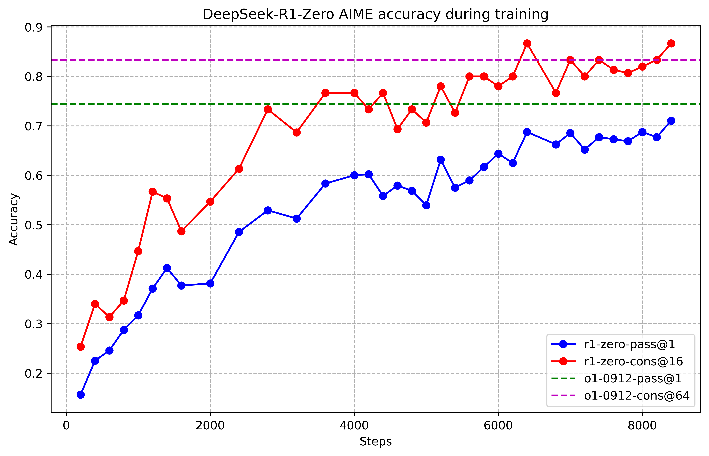
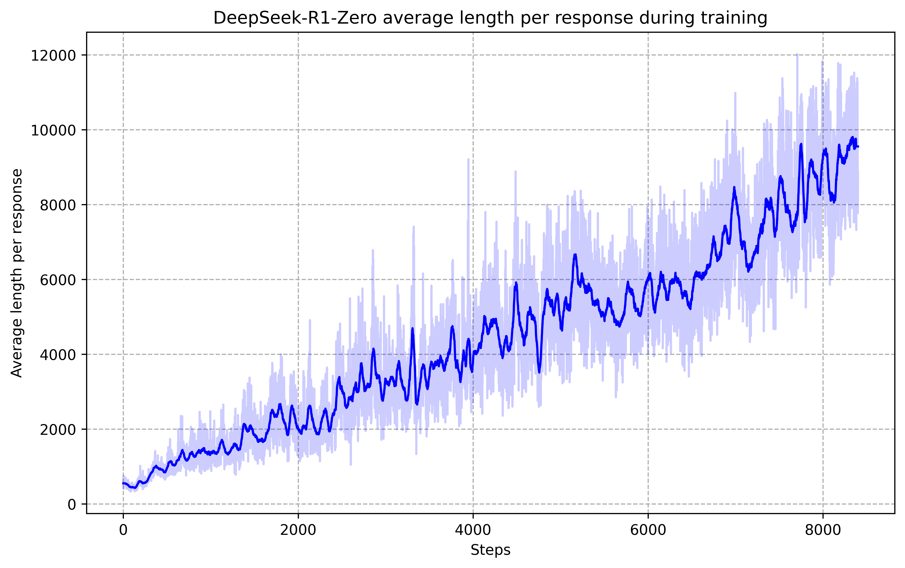
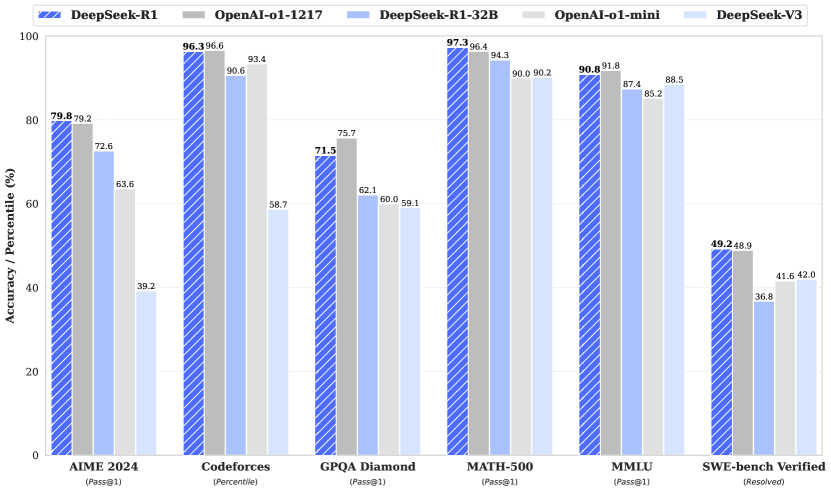

# DeepSeekR1 — Research Note
> [English](./README.md) | **繁體中文**

## 📇 Academic Context

| Field | Value |
|-|-|
| Title | DeepSeek-R1: Incentivizing Reasoning Capability in LLMs via Reinforcement Learning |
| Venue | Nature (vol. 645, pp. 633–638) |
| Year | 2025 |
| Authors | DeepSeek-AI (Daya Guo, Dejian Yang, Zhihong Shao, Peiyi Wang, Junxiao Song, et al.) |
| Official Code | https://github.com/deepseek-ai/DeepSeek-R1 |
| Venue Kind | paper |

## 核心問題與一句話總結

這篇論文問的問題很直接：**大型語言模型的推理能力，一定要靠人類標註的推理過程（chain-of-thought demonstrations）來教嗎？** DeepSeek-R1 給的答案是「不必」。作者從 DeepSeek-V3-Base 出發，**跳過傳統的 supervised fine-tuning（SFT）暖身階段**，直接用純強化學習（pure RL）訓練，只用「最終答案對不對」這種可自動驗證的 reward 訊號，就讓模型自發長出自我檢查、驗證、回溯等長鏈推理行為，並在 AIME、Codeforces、GPQA 等可驗證任務上逼近甚至追平 OpenAI-o1-1217。這個「先不教、只給誘因」的思路是本文和過往 RLHF pipeline 最大的分野。

### GRPO：用群組相對優勢取代價值網路

RL 訓練的骨幹是 Group Relative Policy Optimization（GRPO），它原本是 DeepSeekMath 為了簡化 PPO、省掉一個和策略模型同樣大的 value network 而提出的。對每一個問題 $q$，GRPO 從舊策略 $\pi_{\theta_{old}}$ 取樣一整組 $G$ 條輸出 $\{o_1,\dots,o_G\}$，然後用「組內獎勵的相對高低」當作每條輸出的優勢（advantage），再最大化以下目標：

$$
\mathcal{J}_{GRPO}(\theta)=\mathbb{E}\Big[\frac{1}{G}\sum_{i=1}^{G}\min\Big(\rho_i A_i,\ \mathrm{clip}(\rho_i,1-\epsilon,1+\epsilon)A_i\Big)-\beta\,\mathbb{D}_{KL}(\pi_\theta\|\pi_{ref})\Big],\quad \rho_i=\frac{\pi_\theta(o_i|q)}{\pi_{\theta_{old}}(o_i|q)}
$$

關鍵在於優勢 $A_i$ 不再需要一個學出來的 critic，而是直接用**同一組 $G$ 條 rollout 的獎勵做標準化**得到，公式為：

$$
A_i=\frac{r_i-\mathrm{mean}(\{r_1,\dots,r_G\})}{\mathrm{std}(\{r_1,\dots,r_G\})}
$$

這一步把「絕對獎勵」變成「相對於同伴的排名」，好處是省掉 value model 的記憶體與訓練成本，代價是優勢估計的方差取決於組內樣本，因此需要夠大的 $G$（本文用 16）與夠大的 batch。

### Reward 設計：只用規則，不用神經獎勵模型

對 R1-Zero 的推理任務，reward 完全是 rule-based，由兩部分等權相加：**accuracy reward**（數學題要求把答案放進指定格式如 box 中，用規則比對；程式題丟進 compiler 跑測資）與 **format reward**（強制模型把思考過程包在 `<think>...</think>` 標籤內）：

$$
Reward_\text{rule}=Reward_\text{acc}+Reward_\text{format}
$$

作者刻意**不用 neural reward model**（無論 outcome-based 還是 process-based），理由是他們觀察到神經獎勵模型在大規模 RL 下容易被 reward hacking 鑽漏洞，且重訓成本高。這個「能用規則就不用模型」的取捨，是 R1-Zero 能穩定訓練的前提。

### R1-Zero：純 RL 下自發湧現的長鏈推理

R1-Zero 的訓練配方乾淨到近乎極簡：learning rate 3e-6、KL 係數 0.001、rollout 溫度 1，每題取樣 16 條輸出，最大長度在 8.2k step 前是 32,768 tokens、之後放寬到 65,536，總共訓練 10,400 步（約 1.6 個 epoch），batch size 512。沒有 SFT、沒有人工推理範例、沒有價值網路，只有規則獎勵。

在這樣的設定下最戲劇性的觀察是：模型在 AIME 2024 上的平均 pass@1 從最初的 15.6 一路爬升到 77.9，若再套上 self-consistency（16 條答案取多數決 cons@16）更達到 86.7，超過人類參賽者的平均水準。下圖左半是這條學習曲線。

伴隨準確率上升的，是**回應長度的自發增長**：模型沒有被告知「要想久一點」，卻在訓練中逐步把每則回應從幾百 token 拉長到近一萬 token，用更多「思考時間」去探索、驗證、換策略。作者把某個中間版本出現、用擬人口吻說出「Wait, wait. Wait. That's an aha moment」的時刻稱為 "aha moment"，並統計到 "wait" 這類反思詞在 step 8000 後頻率暴增 5 到 7 倍。

### 一個具體的 GRPO 更新步：AIME 題目上的 16 條 rollout

把上面的公式落到一次真實的更新來看。取一道 AIME 數學題當 $q$，GRPO 抽出 $G=16$ 條完整解題 rollout。假設其中有 6 條算出正確答案、10 條錯誤（格式都合規，所以 format reward 對每條相同、在標準化時會抵銷，只看 accuracy reward $r_i\in\{0,1\}$）。這一組的統計量是 $\mathrm{mean}=6/16=0.375$、$\mathrm{std}=\sqrt{0.375\times0.625}\approx0.484$。代入 $A_i$ 公式，得到下表（這組 6/16 的切分是我們為了說明而假設的具體數字，非論文原始數據）：

| rollout 類型 | 數量 | $r_i$ | $A_i=(r_i-0.375)/0.484$ | 對策略的效果 |
|-|-|-|-|-|
| 答對 | 6 | 1 | $+1.29$ | 提高這條 CoT 的生成機率 |
| 答錯 | 10 | 0 | $-0.77$ | 壓低這條 CoT 的生成機率 |

直覺是：**組內的正確答案愈稀有，答對那幾條拿到的正優勢就愈大**（若 16 條全對，優勢全為 0，不再推動更新）。模型因此被推著去多產出「最後能對」的長推理軌跡，而長 CoT、反思、回溯等行為就是在這種「答對才有相對優勢」的壓力下被間接誘發出來的——沒有任何一步顯式教它要反思。

### 從 R1-Zero 到 R1：四階段管線

R1-Zero 雖強，但有兩個實際毛病：可讀性差、以及中英文在同一條 CoT 內混雜（language mixing）。DeepSeek-R1 因此改用多階段管線來「馴化」它：(1) 先用數千筆對話式、貼近人類思考的 **cold-start** 資料做 SFT；(2) 做一輪面向推理的 RL，並加入 language consistency reward；(3) 用 rejection sampling 產生資料、混入非推理資料再做一次 SFT（總計約 80 萬筆）；(4) 最後一輪涵蓋推理與通用資料的 RL，對齊 helpfulness 與 harmlessness。下圖是 R1、R1-Zero 與各基準模型的整體對比。

各階段（中間檢查點 Dev1/Dev2/Dev3）的效果可以在下表看得很清楚：cold-start 之後 instruction-following 類指標大漲，但推理指標一度回退（AIME 從 R1-Zero 的 77.9 掉到 Dev1 的 59.0），之後靠推理 RL 補回來；真正被最後階段拉高的是使用者偏好類指標——AlpacaEval 2.0 的 LC-winrate 從 R1-Zero 的 24.7 飆到最終 R1 的 87.6，ArenaHard 從 53.6 到 92.3：

| Benchmark (Metric) | R1-Zero | R1-Dev1 | R1-Dev2 | R1-Dev3 | R1 |
|-|-|-|-|-|-|
| AIME 2024 (Pass@1) | 77.9 | 59.0 | 74.0 | 78.1 | 79.8 |
| IF-Eval (Prompt Strict) | 46.6 | 71.7 | 72.0 | 78.1 | 83.3 |
| AlpacaEval2.0 (LC-winrate) | 24.7 | 50.1 | 55.8 | 62.1 | 87.6 |
| ArenaHard (GPT-4-1106) | 53.6 | 77.0 | 73.2 | 75.6 | 92.3 |

放到跨模型的橫向比較，最終 R1 在數學上和 OpenAI-o1-1217 幾乎並駕齊驅（AIME 2024：R1 79.8 vs o1 79.2；MATH-500：97.3 vs 96.4），程式競賽 Codeforces rating 2029 略低於 o1 的 2061，而在需要遵循格式與寫作的 AlpacaEval2.0（87.6）與 ArenaHard（92.3）上明顯領先。真正吃虧的是工程型任務：Aider-Polyglot 上 R1 的 53.3 落後 o1 的 61.7，作者自陳工程資料的 RL 量還太少。

### 蒸餾：把大模型的推理能力搬進小模型

論文的第二個貢獻是把 R1 產生的 80 萬筆資料當老師，直接對 Qwen2.5 / Llama 系列小模型做 SFT（不做 RL），得到一系列 R1-Distill 模型。效果驚人：僅 1.5B 參數的 DeepSeek-R1-Distill-Qwen-1.5B 在 AIME 2024 pass@1 拿到 28.9，就已超過 GPT-4o-0513 的 9.3 與 Claude-3.5-Sonnet 的 16.0；32B 版更到 72.6：

| Model | AIME24 pass@1 | MATH-500 | GPQA Diamond | LiveCodeBench |
|-|-|-|-|-|
| GPT-4o-0513 | 9.3 | 74.6 | 49.9 | 32.9 |
| DeepSeek-R1-Distill-Qwen-1.5B | 28.9 | 83.9 | 33.8 | 16.9 |
| DeepSeek-R1-Distill-Qwen-32B | 72.6 | 94.3 | 62.1 | 57.2 |
| DeepSeek-R1-Distill-Llama-70B | 70.0 | 94.5 | 65.2 | 57.5 |

作者還做了一個關鍵對照：直接對 Qwen2.5-32B-Base 做同樣大規模 RL（得到 Qwen2.5-32B-Zero）只拿到 AIME 47.0，遠不如蒸餾版的 72.6。結論是：**在算力有限時，把強模型蒸餾進小模型，比讓小模型自己跑大規模 RL 更划算**；但要突破天花板，仍需要更強的 base 與更大規模的 RL。

### 訓練成本

論文少見地把成本攤開：以 H800 每 GPU 小時 2 美元估算，R1-Zero 花了 101K GPU 小時（約 20.2 萬美元），SFT 資料生成 5K 小時，R1 本身 41K 小時（約 8.2 萬美元），合計 147K GPU 小時、約 29.4 萬美元。相對於動輒數千萬美元的預訓練，這個「後訓練」成本量級是本文能被大量複現的重要原因。

## 🧪 Critical Assessment

### 這條路的前提：任務必須有可靠的 verifier

「能不能不靠人類推理標註、只用可驗證的 reward 就長出推理能力」是一個真問題，而且賭注很高：如果成立，推理能力的上限就不再被人類示範所綁住。R1-Zero 這條「無 SFT 暖身」的線提供了相當有說服力的存在性證明——AIME pass@1 從 15.6 到 77.9 的曲線很難用資料汙染或提示工程解釋掉，作者也專門做了 10-gram 去汙染（光數學領域就濾掉約六百萬筆預訓練文本）。不過要留意：這條路的前提是**任務必須有可靠、可自動判定的 verifier**，論文自己在 limitation 也承認寫作、開放式問答這類「沒有可靠 reward」的任務仍得退回 SFT + 少量 RL，所以「pure RL 解決推理」的敘事其實有明確的適用邊界。

### 自訓「Zero」對照組與跨團隊比較的公平性

正面看，本文的實驗誠實度偏高：有跨模型橫向比較（含 o1-1217、GPT-4o、Claude-3.5、DeepSeek-V3）、有分階段 Dev1/2/3 的縱向拆解、有 distillation vs RL 的直接對照、有 language consistency reward 的消融、甚至誠實記錄了 reward hacking 與 MCTS/PRM 的失敗嘗試。這些都不是 cherry-picking 的樣子。但幾個值得打問號的地方：其一，與 OpenAI-o1 的比較用的是對方公開的分數，取樣設定（pass@1 用 64 條估計、溫度 0.6）由 DeepSeek 這邊決定，跨團隊比較的公平性天然有限。其二，R1-Zero-Qwen、Qwen2-Math-7B-Zero 等對照都是作者自訓的「Zero」版本當靶子，屬於自家定義的比較框架，容易讓蒸餾的優勢看起來被放大。其三，安全評測作者自評為「moderate level（約當 GPT-4o）」，並坦承 R1 可被越獄產生危險內容，這個弱點在強調能力的敘事裡容易被讀者略過。

### 新意在組合層次，而非單一元件

需要誠實區分。GRPO 不是本文發明的（來自 DeepSeekMath），rule-based reward、self-consistency、CoT 也都是既有技術。本文真正的新意不在單一元件，而在於**「拿掉 SFT 暖身、直接對夠大的 base 做 outcome-only RL，並實證觀察到長 CoT 與反思行為的湧現」這個組合與其可規模化的證據**。這是有份量的實證貢獻，但也要避免被「aha moment」這類擬人化敘事帶著走——所謂 "aha moment" 本質上是反思詞頻率的統計上升，論文把它寫得很有戲劇性，讀者應把它當現象描述而非機制解釋。另外「pure RL」一詞略有語意鬆動：最終出貨的 R1 其實用了四階段、含兩次 SFT，真正 pure 的是 R1-Zero 而非 R1。

### 受限可驗證推理已近解決，開放任務與工具使用仍未觸及

在「可驗證推理」這個受限範圍內，宣稱大致成立且已被社群廣泛複現（開源權重 + MIT 授權讓它成為 2025 年最有影響力的開放推理模型之一）。但把鏡頭拉遠，好幾個限制直接削弱了「通用推理已解決」的說法：R1 無法使用工具（搜尋、計算機）、結構化輸出偏弱、對非中英文查詢會 language mixing、few-shot 反而降低表現、且在真實軟體工程任務（SWE、Aider）上相對 V3 幾乎沒進步。換句話說，它在「有乾淨 verifier 的競賽題」上接近 o1，但在「reward 難以定義的開放任務」上，本文並未主張、也未展示問題被解決。這既是它的邊界，也恰恰是作者指出的下一步方向。我認為這篇論文最耐久的價值，未必是 R1 這個模型本身，而是它把「verifier + 夠大的 base + 足夠 RL 算力」清楚地標定為推理能力的三個槓桿——這個判斷屬於本文之後才逐漸被社群驗證的推論，而非論文已證實的結論。

## 🔗 Related notes

<!-- 尚無安全可解析的相關 note；保留標題。 -->
