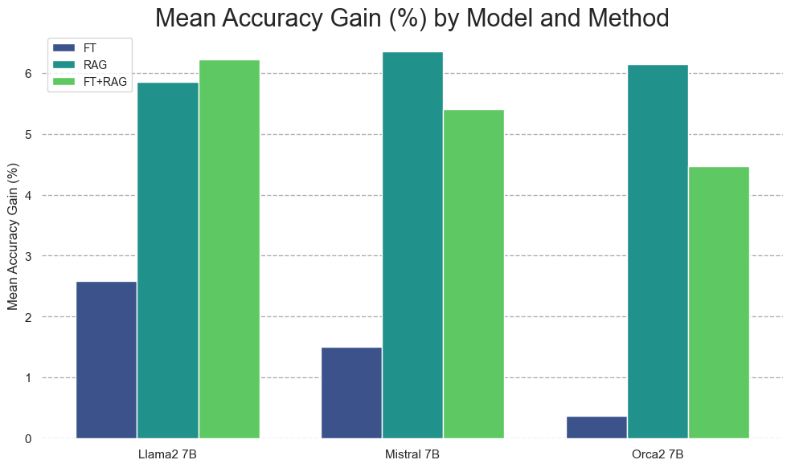

# FineTuning-vs-ICL-vs-RAG — Research Note
> [English](./README.md) | **繁體中文**

## 📇 Academic Context

| Field | Value |
|-|-|
| Title | When to fine-tune, when to use in-context learning, and when to use RAG: what the empirical evidence supports about their trade-offs |
| Venue | unknown |
| Year | unknown |
| Authors | unknown |
| Official Code | unknown |
| Venue Kind | survey |

## 📚 Sources

| # | Title | Venue | Year | arXiv / URL | Access |
|-|-|-|-|-|-|
| 1 | Fine-Tuning or Retrieval? Comparing Knowledge Injection in LLMs (Ovadia et al.) | arXiv (preprint) | 2023 | [2312.05934](https://arxiv.org/abs/2312.05934) | fetched |
| 2 | RAG vs Fine-tuning: Pipelines, Tradeoffs, and a Case Study on Agriculture | arXiv (preprint) | 2024 | [2401.08406](https://arxiv.org/abs/2401.08406) | fetched |
| 3 | Few-shot Fine-tuning vs. In-context Learning: A Fair Comparison and Evaluation (Mosbach et al.) | arXiv (preprint) | 2023 | [2305.16938](https://arxiv.org/abs/2305.16938) | fetched |
| 4 | RAFT: Adapting Language Model to Domain Specific RAG | arXiv (preprint) | 2024 | [2403.10131](https://arxiv.org/abs/2403.10131) | fetched |

四篇皆以 arXiv 全文為證據來源（preprint，正式會議版本用字可能微幅不同）；本篇所有數字與引述均回到各自 `source/*.tex` 核對。無來源被封鎖。

## First Principles

### 先把問題拆對：knowledge 與 behavior 是兩件事

實務決策表最常見的錯誤，是把「讓模型知道新事實」（knowledge injection）跟「讓模型換一種行為/語氣/格式」（behavior adaptation）混為一談，然後用一張表回答。四篇論文其實各自測的是不同東西：Ovadia et al. 測的是把新事實灌進模型的能力，Mosbach et al. 測的是少樣本下的分類任務適應（behavior），Agriculture 那篇兩者都碰，RAFT 則是把 fine-tuning 拿來教模型「怎麼讀 retrieved context」。把它們擺在一起，答案就不再是三選一，而是「你要注入的是知識還是行為」。

### 知識注入：RAG 幾乎穩定贏過 unsupervised fine-tuning

Ovadia et al. 直接測試 seed 決策表裡「fine-tuning 是拿來注入知識用的」這個信念，結論相反：unsupervised fine-tuning offers some improvement, but RAG consistently outperforms it, both for existing knowledge and entirely new knowledge，而且 LLMs struggle to learn new factual information through unsupervised fine-tuning。跨 Llama2-7B、Mistral-7B、Orca2-7B 三個模型，RAG 帶來的平均準確率增益一致大於 FT。

### 一個走完的跨方法對照：current events 任務

拿 Ovadia 的 current events 任務（模型在預訓練時沒看過的全新事實）走一遍最清楚。以 Mistral-7B 為例，四種設定的 log-likelihood accuracy 分別是：base model 0.481、加上 RAG 躍升到 0.875、而 regular fine-tuning（FT-reg）只到 0.504、即使用多重改寫增強（FT-par）也只到 0.588。也就是說在「灌新事實」這件事上，把同一段語料拿去做非監督 fine-tuning，幾乎沒有把知識學進去（0.481→0.504），而把同一段語料放進 context 讓模型即時檢索，準確率幾乎翻倍。作者進一步發現，要靠 fine-tuning 教會新知識，the knowledge must be repeated in numerous ways：current events 準確率是改寫數量的單調遞增函數。這個 worked example 說明的是 seed 表格沒講的機制——非監督 fine-tuning 難以把「一次性出現的事實」寫進權重，而 RAG 把記憶問題換成了檢索問題。

### 但 fine-tuning 的成敗高度取決於它是哪一種 fine-tuning

Ovadia 的悲觀結論有一個關鍵邊界：作者明說 they focused on unsupervised training as their primary fine-tuning method, as opposed to instruction-tuning or RL-based methods。Agriculture 那篇換成監督式 Q&A fine-tuning，結論就不同了：they see an accuracy increase of over 6 p.p. when fine-tuning the model and this is cumulative with RAG, which increases accuracy by 5 p.p. further。以 GPT-4 為例，base 75% → fine-tuned 81% → fine-tuned+RAG 86%。同一篇還顯示 fine-tuning 能讓模型跨地理區學會回答特定問題，answer similarity 從 47% 拉到 72%。所以「fine-tuning 能不能注入知識」這題，兩篇論文表面矛盾，實際是在測不同的 fine-tuning：非監督續訓 vs 監督式任務/風格微調——這正是可比性（comparability）的陷阱。

### 「fine-tuning 高且穩定、ICL 只適合少樣本」也被打折

seed 表格假設 fine-tuning 帶來 high and consistent performance、而 ICL 只適合 limited data 與 rapid prototyping。Mosbach et al. 指出過去說 fine-tuning OOD 泛化較差、容易學到 spurious correlations 的比較，其實是用了不同大小的模型才得到的假象。在控制模型大小（125M–30B）與樣本數（16 examples）後，fine-tuned language models can in fact generalize well out-of-domain，而且 both approaches generalize similarly; they exhibit large variation。換句話說，「consistent」這個形容詞對兩者都不成立——FT 與 ICL 的 variance 都很高。真正穩定的差異在別處：ICL requires large models to work in contrast to FT, which works well even with small models，這使得 ICL 對低資源語言不友善；而 FT benefits more from additional samples than ICL does。

### 三選一的框架本身會崩：RAFT 這種 hybrid

當你把「fine-tuning vs RAG」當成互斥選項時，RAFT 直接證明最好的做法常是兩者合體。Agriculture 已顯示 FT 與 RAG 的增益可以疊加；RAFT 更進一步：與其把 retrieval 當外掛，不如 train the model to ignore those documents that don't help in answering the question, which they call distractor documents。RAFT（LLaMA2-7B）在 PubMed / HotPot / HuggingFace / Torch Hub / TensorFlow 上得到 73.30 / 35.28 / 74.00 / 84.95 / 86.86，幾乎全面超越 domain-specific fine-tuning（DSF）與 GPT-3.5+RAG。關鍵反直覺處在於：introducing RAG to a domain-specifically fine-tuned (DSF) model doesn't invariably lead to better outcomes——DSF 在 HuggingFace 是 61.06，直接加 RAG（DSF+RAG）反而掉到 42.59，因為模型沒被訓練成會讀 context。RAFT 的貢獻就是把「讀 retrieved context」當成一種要 fine-tune 進去的 behavior。

### 一張務實對照表

| 面向 | Fine-tuning（監督式） | In-context learning | RAG |
|-|-|-|-|
| 最擅長注入的東西 | 行為 / 風格 / 格式、任務技能 | 臨時的任務示範 | 事實知識、可更新的來源 |
| 注入一次性新事實 | 弱（非監督續訓尤其弱） | 僅限放進 context 的部分 | 強且可即時更新 |
| 需要訓練 / 算力 | 需要 | 不需要 | 不需要（需檢索基礎設施） |
| 小模型可用性 | 高 | 低（需大模型） | 中 |
| 一致性 / variance | 高 variance | 高 variance | 相對可控 |
| 疊加性 | 可與 RAG 疊加（甚至該一起訓練） | 與 RAG 部分重疊 | 可與 FT 疊加 |

## 🧪 Critical Assessment

### 四篇的實驗設定其實不可直接對比

把這四篇擺成「FT vs ICL vs RAG 的擂台」是危險的，因為它們的 fine-tuning 根本不是同一種東西。Ovadia 用非監督續訓、Agriculture 用監督式 Q&A、Mosbach 用 pattern-based fine-tuning、RAFT 用帶 chain-of-thought 的監督式微調。Ovadia 自己就把「只測非監督 FT」列為限制。因此「RAG 打敗 FT」這句話的外部效度是有邊界的：它成立於「把原始語料丟去非監督續訓」這個特定操作，不能推廣成「任何 fine-tuning 都輸給 RAG」。

### benchmark 的真實性與指標充分性

三篇的 headline 數字都建立在偏窄的評測上。Ovadia 全部用 multiple-choice log-likelihood accuracy，這對「模型是否真的理解並能生成」是很弱的代理；Agriculture 的正確性與簡潔性是由 GPT-4 當裁判評的，等於用一個 LLM 的偏好去定義另一個 LLM 的好壞；RAFT 的 PubMed 是 yes/no 二元題，作者自己也承認在該資料集上相對 DSF+RAG 看不到顯著增益。這些都不是「射進靶心後才畫靶」的自訂 benchmark，但指標的單一化仍讓「誰比較好」的結論比表面脆弱。

### 對讀者實務問題的外部效度

讀者真正想問的是「我現在該選哪個」，而這些數字多半來自 2023–2024 的 7B–13B 開源模型或 GPT-3.5/4。Mosbach 特別提醒這些方法目前仍未被充分理解（these methods are still poorly understood），且效果對 pattern、seed、樣本數極度敏感。對當前世代（長 context、原生 tool-use、更強 instruction following）的模型，沒有一篇提供 head-to-head 數據；把這些 pass 值直接套到今天的模型是一種未經驗證的外推。

### 尚未被回答的部分

沒有任何一篇回答「多大的知識更新頻率下，重新 fine-tuning 的攤提成本才會低於長期跑 RAG 檢索」這種成本曲線問題；seed 表格把「limited compute」同時列在 ICL 和 RAG 的適用欄，但四篇都沒有給出可比的 total cost of ownership 量測。RAFT 指出的「FT 進去的是讀 context 的 behavior」是最有前景的整合方向，但它只在少數 domain-specific QA 上驗證，是否泛化到開放式生成仍是開問題。因此本篇對「三選一決策表」的整體判斷是：它在把 knowledge 與 behavior 混談、且預設三者互斥這兩點上，證據並不支持——這屬於尚未被證成、甚至可疑的框架，而非可直接照抄的結論。

## 🔗 Related notes

- [Lora](../Lora/)
- [GNN-RAG](../GNN-RAG/)
- [SAG-SQL-RAG](../SAG-SQL-RAG/)
- [PromptLanguageCodingAccuracy](../PromptLanguageCodingAccuracy/)
