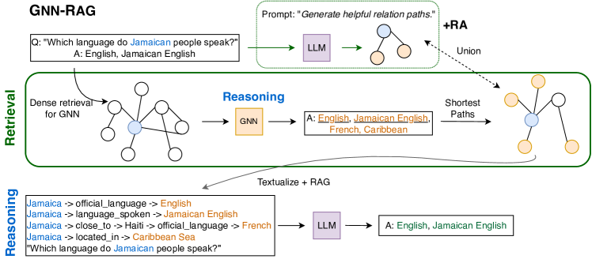
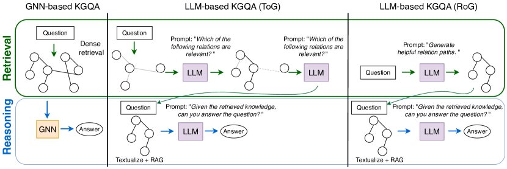

# GNN-RAG — Research Note

## 📇 Academic Context

| Field | Value |
|-|-|
| Title | GNN-RAG: Graph Neural Retrieval for Large Language Model Reasoning |
| Venue | arXiv (preprint) |
| Year | 2024 |
| Authors | Costas Mavromatis, George Karypis |
| Official Code | https://github.com/cmavro/GNN-RAG |
| Venue Kind | paper |

> 本篇為根據 arXiv 預印本 `2405.20139` 撰寫的閱讀筆記；原稿採用 NeurIPS 2024 preprint 樣式，正式發表版本（camera-ready）可能與此有出入。所有數值與引述均以預印本 LaTeX 原始檔為準。

## First Principles

### 問題背景：KGQA 的瓶頸在「檢索」而非「生成」

這篇論文處理的任務是知識圖譜問答（KGQA, Question Answering over Knowledge Graphs）：給定一個由 `(head, relation, tail)` 三元組構成的知識圖譜 $\mathcal{G}$，以及一個自然語言問題 $q$，要求模型抽出圖譜中正確回答 $q$ 的實體集合 $\{a\}$。訓練時只有問題—答案配對，沒有標註「通往答案的路徑」，因此屬於弱監督（weakly-supervised）設定。作者把 KGQA 拆成兩階段：先從擁有數百萬條事實的完整 KG 中，用實體連結與 PageRank 擷取一個問題相關的稠密子圖 $\mathcal{G}_q$，再交給推理模型輸出答案。整個 pipeline 用 retrieval-augmented generation（RAG）的形式串起來，把 KG 事實逐字轉成文字塞進 LLM 的 prompt。

RAG 在 KGQA 上的表現高度取決於「檢索到哪些事實」。作者指出真正的難點在檢索端：KG 動輒上百萬條事實，要撈出正確資訊需要有效的圖處理能力，而撈進無關資訊反而會干擾 LLM 的推理。既有做法要嘛靠 LLM 逐跳（hop-by-hop）檢索、無法處理複雜圖結構而在多跳問題上失效；要嘛得仰賴 GPT-4 這種超大模型的內部知識去補檢索的缺口。換句話說，論文把矛頭指向「檢索器不夠強」這個常被 RAG 敘事忽略的環節。

### GNN-RAG 的核心設計：把 GNN 當成稠密子圖推理器

GNN-RAG 的中心主張是：GNN 雖然不像 LLM 那樣理解自然語言，但它天生擅長處理複雜的圖結構，正好可以「改用途」（repurpose）當成檢索器。整個流程分三步：第一步，一個 GNN 在稠密子圖上做訊息傳遞推理，把每個節點分類為「答案 / 非答案」，取出機率高於門檻的候選答案；第二步，抽出從問題實體到這些候選答案的最短路徑，作為 KG 推理路徑（reasoning paths）；第三步，把這些路徑逐字轉成 `{問題實體} → {關係} → {實體} → … → {答案實體}` 的文字，連同問題一起餵給下游 LLM 做 RAG。在這個分工裡，GNN 負責從圖裡萃取有用資訊，LLM 負責用它的語言理解能力做最終問答。

### GNN 的訊息傳遞與「問題—關係匹配」

GNN 把 KGQA 視為節點分類問題。在第 $l$ 層，節點 $v$ 的表徵 $\mathbf{h}_v^{(l)}$ 由聚合鄰居訊息更新，而且訊息傳遞會條件化在問題 $q$ 上：

$$
\mathbf{h}_v^{(l)} = \psi\!\Big(\mathbf{h}_v^{(l-1)},\; \sum_{v' \in \mathcal{N}_v} \omega(q, r)\cdot \mathbf{m}_{vv'}^{(l)}\Big)
$$

這裡的關鍵是 $\omega(q, r)$：它衡量事實 $(v, r, v')$ 的關係 $r$ 對問題 $q$ 有多相關，等於是在做「問題—關係匹配」（question-relation matching）。作者在附錄的定理裡證明：在理想情況下，若 $\omega$ 能對相關事實給 1、對無關事實給 0，GNN 的求和運算子（sum-operator）就能「過濾掉」無關資訊、只保留問題相關的子圖，達到最優推理。這也點出 GNN 的罩門——它的成敗完全押在 $\omega$ 這個語意匹配函數上。

由於 $\omega(q, r)$ 的實作依賴一個共享的預訓練 LM 去編碼問題與關係表徵（常見形式為 $\phi(\mathbf{q}^{(k)} \odot \mathbf{r})$），作者的巧思是：與其換不同的 GNN 架構，不如換 $\omega$ 裡的 LM。他們訓練兩個 GNN，一個用 SBERT、一個用 $\text{LM}_{\text{SR}}$（一個針對 KG 上問題—關係匹配預訓練的 LM）。實驗顯示這兩個 GNN 雖然撈到不同的 KG 資訊，卻都能改善 RAG，因此後續可以把它們的路徑聯集起來做 ensemble。

### 從推理路徑到 LLM 的 RAG

拿到推理路徑後，作者把它們逐字轉成文字餵給下游 LLM。由於 LLM 對 prompt 模板與圖資訊的敘述方式很敏感，作者對開源可訓練的模型（一個 LLaMA2-Chat-7B）做 RAG prompt tuning：用訓練集的問題—答案對微調它，prompt 為「Based on the reasoning paths, please answer the given question」。訓練時餵的是問題實體到答案的最短路徑，推論時則換成 GNN-RAG 檢索出來的路徑。值得注意的是，這個 7B 模型與 RAG 微調做法本身沿用自對照方法 RoG，GNN-RAG 真正替換的是「檢索器」這一塊。

### 為何 GNN 適合多跳檢索，以及它的限制

作者用一組檢索分析佐證「為什麼 GNN 是好的多跳檢索器」。他們訓練一個深的（$L=3$）與一個淺的（$L=1$）GNN，量測「Answer Coverage」（檢索到的路徑是否至少包含一個正確答案，注意這只評檢索、不評最終問答）與輸入 token 數（效率）。WebQSP 上的結果如下：

| Retriever | 1-hop #Input Tok. | 1-hop %Ans. Cov. | 2-hop #Input Tok. | 2-hop %Ans. Cov. |
|-|-|-|-|-|
| RoG (LLM-based) | 150 | 87.1 | 435 | 82.1 |
| GNN ($L=1$) | 112 | 83.6 | 2,582 | 79.8 |
| GNN ($L=3$) | 105 | 82.4 | 357 | 88.5 |

這張表把故事講得很清楚：在 2-hop 問題上，深 GNN 用最少的 token（357，遠少於淺 GNN 的 2,582 與 RoG 的 435）達到最高的答案覆蓋率（88.5%）——它既更有效也更省。但在 1-hop 問題上情況反轉：這時「精準的問題—關係匹配」比「深層圖搜尋」更重要，LLM 檢索器（RoG，87.1%）反而略勝 GNN（82.4%）。這個「深 GNN 贏多跳、LLM 贏單跳」的互補性，直接催生了下一節的檢索增強。

### 檢索增強（RA）：把兩種檢索器的長處聯集起來

檢索增強（Retrieval Augmentation, RA）的想法很直接：既然 GNN 擅長多跳、LLM 擅長單跳，那就在推論時把兩者檢索到的推理路徑取聯集，兼顧多樣性與答案召回。論文的預設 **GNN-RAG+RA** 就是把 GNN 檢索器與 RoG 這個 LLM 檢索器的路徑合併。作者也提出一個更便宜的替代方案 **GNN-RAG+Ensemble**：不呼叫 LLM，只把前面兩個配不同 LM 的 GNN（GNN+SBERT 與 GNN+$\text{LM}_{\text{SR}}$）的路徑聯集，避免 LLM 檢索器 beam-search 多次生成帶來的額外開銷。

### 一次具體的前向流程（用論文的真實數字）

以圖中的 WebQSP 問句「Which language do Jamaican people speak?」為例走一遍：子圖檢索先用實體連結與 PageRank 從 Freebase 撈出平均約 1,429.8 個實體的稠密子圖；GNN 在其上推理，輸出候選答案（English, Jamaican English, French, Caribbean…）並抽出最短路徑，例如 `Jamaica → language_spoken → Jamaican English`；這些路徑逐字化後餵給微調過的 LLaMA2-Chat-7B，輸出最終答案。關鍵在效率與效果的帳：整條 GNN-RAG（預設）在檢索端**不需要任何額外的 LLM 呼叫**（#LLM Calls = 0），WebQSP / CWQ 的中位輸入 token 只有 144 / 207，卻拿到 71.3 / 59.4 的 F1；相較之下 RoG 每題要 3 次 beam-search 生成、輸入 202 / 325 token，F1 只有 70.8 / 56.2。主結果表把整體對比攤開：

| Method | WebQSP Hit | WebQSP H@1 | WebQSP F1 | CWQ Hit | CWQ H@1 | CWQ F1 |
|-|-|-|-|-|-|-|
| LLaMA2-Chat-7B (No RAG) | 64.4 | — | — | 34.6 | — | — |
| RoG (KG+LLM) | 85.7 | 80.0 | 70.8 | 62.6 | 57.8 | 56.2 |
| ToG+GPT-4 | 82.6 | — | — | 69.5 | — | — |
| GNN-RAG (Ours) | 85.7 | 80.6 | 71.3 | 66.8 | 61.7 | 59.4 |
| GNN-RAG+RA (Ours) | 90.7 | 82.8 | 73.5 | 68.7 | 62.8 | 60.4 |

把這幾列連起來讀：光是把檢索器從「無」換成 GNN-RAG，就把 7B LLaMA2 的 WebQSP Hit 從 64.4 拉到 85.7；再加 RA 後衝到 90.7，在 WebQSP 上以 7B 模型全面超過 ToG+GPT-4 的 82.6，在 CWQ 上也逼近（68.7 對 69.5）。作者估算 ToG+GPT-4 整體花費超過 800 美元，而 GNN-RAG 可在單張 24GB GPU 上部署——這是「小模型 + 好檢索」勝過「大模型 + 弱檢索」的核心賣點。在多跳與多實體問題上差距最明顯：相對於 RoG，GNN-RAG 在 F1 上高出 6.5–17.2（WebQSP）與 8.5–8.9（CWQ）個百分點。

## 🧪 Critical Assessment

### 問題是不是真的、重不重要

「RAG 的品質受限於檢索器」這個問題是真實且被獨立佐證的——論文引用多篇工作說明撈進雜訊會拖垮 LLM 推理。把診斷聚焦在檢索端、而非一味放大生成模型，方向上是站得住腳的。KGQA 本身也是有實際意義的知識密集任務。要留意的是，這個問題設定綁定在「已經有一個乾淨、結構化、且答案覆蓋率夠高的知識圖譜」這個前提上：WebQSP 子圖的答案覆蓋率是 94.9%，但 CWQ 只有 79.3%，意味著約兩成的 CWQ 問題其正確答案根本不在檢索子圖裡，任何下游方法的上限都被子圖擷取步驟卡死。論文的貢獻其實只作用在「子圖已給定」之後的環節，這個邊界在敘事中被輕描淡寫帶過。

### 基線、消融、資料集與指標是否充分

這篇的實證相當紮實：主結果涵蓋 embedding / GNN / LLM / KG+LLM / GNN+LLM 五類共二十多個基線，並附有更換 GNN（GraftNet/NSM/ReaRev）、更換底層 LLM（Alpaca、Flan-T5、ChatGPT）、稠密 vs 稀疏子圖、訓練資料組合等多組消融，效率面也誠實報告了 #LLM Calls 與輸入 token。指標選得合理：Hit、Hits@1、F1 各自量測不同面向，作者甚至坦言 Hit 因為只看「是否命中任一答案」而對 LLM 較寬鬆。一個值得追問的缺口是統計顯著性——像 GNN-RAG 與 RoG 在 WebQSP Hit 都是 85.7 這種並列，或 F1 只差 0.5 的情形，論文沒有給出誤差棒或多次隨機種子的變異，讀者難以判斷部分「持平或些微勝出」是否為雜訊。另外，消融也顯示「弱 GNN 不是好檢索器」（GNN-RAG 換成 GraftNet/NSM 時 CWQ 表現不如 RoG），代表整套方法的效益高度依賴一個本身就已是 SOTA 的 GNN（ReaRev），而非 GNN-RAG 框架本身。

### 這是新方法還是既有元件的重組

平心而論，GNN-RAG 的組成元件幾乎都是現成的：GNN 檢索用的是 ReaRev、RAG 微調與 7B LLaMA2 沿用 RoG、$\text{LM}_{\text{SR}}$ 來自 SR、子圖擷取沿用 NSM 的 PageRank 做法。真正原創的是「用 GNN 節點分類的輸出去反推最短路徑、再把路徑當檢索結果餵給 RAG」這個接合方式，以及據此設計的 RA 聯集策略。這確實是有價值的洞見——它把「GNN 擅長多跳、LLM 擅長語意」用一個乾淨的介面（verbalized 路徑）銜接起來，而不是硬做 latent 融合。但若用嚴格的新穎性標準看，這更接近一次設計良好的系統整合與經驗發現，而非方法論上的突破；論文自身的貢獻敘述（Framework / Effectiveness / Efficiency）也偏向工程與實證面。

### 評測是否被作者「量身訂做」，以及真實世界關聯

多跳、多實體子集上的巨大增益（F1 高出對手 8.9–15.5 個百分點）需要放在脈絡裡看：這些正是 GNN 深層圖搜尋的主場，等於是在挑選對自身機制最有利的切片來凸顯優勢，讀者應把它理解為「在深度圖搜尋重要時」的條件式結論，而非全面碾壓——事實上在 1-hop 問題上 GNN 反而略遜 LLM 檢索器，作者也誠實呈現了這點。就整體 F1 而言（例如 WebQSP 的 71.3 對 RoG 70.8）差距其實很小。真實世界關聯的最大保留在於對「高品質 KG」的依賴：方法假設存在一個結構化、可更新、且與問題對齊的知識圖譜，這在 Freebase/WikiMovies 這類學術基準上成立，但在多數實務場景中，KG 的建置與維護成本往往才是瓶頸，而這正是本方法不處理的部分。因此本篇的結論在「KGQA 學術基準」上是可信且有說服力的，但要外推到一般開放領域 RAG 仍有明顯落差，不宜過度誇大其普適性。

## 🔗 Related notes

- [BM25](../information_retrieval/BM25/) — 經典稀疏檢索基線，可與此處的圖檢索作對照
- [TF-IDF: IDF](../information_retrieval/TFIDF/) — 檢索權重的基礎概念
