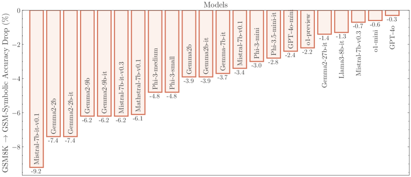
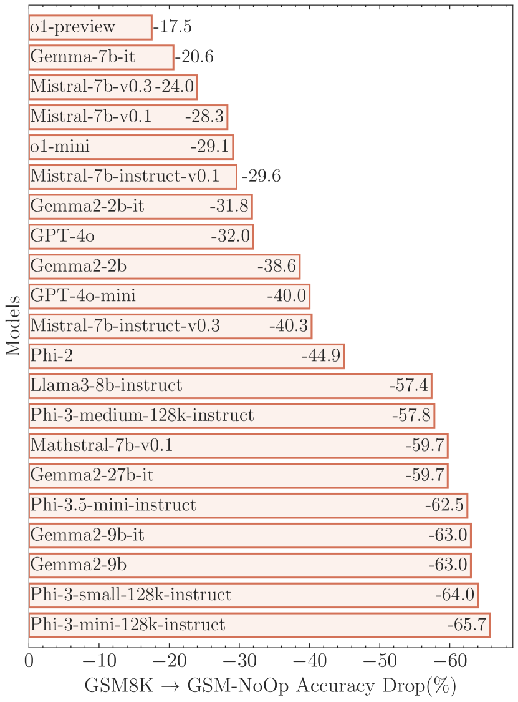

# GSM-Symbolic — Research Note

## 📇 Academic Context

| Field | Value |
|-|-|
| Title | GSM-Symbolic: Understanding the Limitations of Mathematical Reasoning in Large Language Models |
| Venue | ICLR |
| Year | 2025 |
| Authors | Iman Mirzadeh, Keivan Alizadeh, Hooman Shahrokhi, Oncel Tuzel, Samy Bengio, Mehrdad Farajtabar |
| Official Code | https://github.com/apple/ml-gsm-symbolic |
| Venue Kind | paper |

> 本文基於 arXiv 預印本 `2410.05229`（LaTeX 原始碼，含 `\iclrfinalcopy` 標記）撰寫，並經 OpenReview（forum `AjXkRZIvjB`）交叉確認為 ICLR 2025 正式接收版本。引用數在撰寫當下因 Semantic Scholar API 回傳 429 而標記為 `unavailable`。

## First Principles

### 這篇論文真正在問的問題

GSM8K 是評估 LLM「小學數學推理」能力最流行的基準之一，包含 7473 個訓練題與 1319 個測試題。它的問題在於：它只提供**單一分數**、題目集是**固定且靜態**的，而且因為太過流行，測試題很可能已經滲進各家模型的訓練資料（data contamination）。當一個模型在 GSM8K 上拿到 95% 時，我們無法分辨這是「會推理」還是「背過類似題目」。

作者的核心主張是：**與其把 LLM 的數學能力看成一個點估計（single-point accuracy），不如把它看成一個分布（distribution）**。如果模型真的在做形式推理（formal reasoning），那麼把同一題的名字與數字換掉、但保持推理步驟完全不變，準確率應該幾乎不動；反之若準確率出現明顯變異，就暗示模型做的比較像是把題目對應到訓練資料中「看過的相似樣板」的模式比對（pattern-matching）。

### 資料生成引擎：符號樣板（symbolic templates）

GSM-Symbolic 的做法不是再收集題目，而是把 GSM8K **測試集裡的 100 個題目**改寫成可解析的符號樣板。每個樣板定義三件事：變數、變數的定義域（domain）、以及保證題目與答案都成立的條件（conditions）。以論文 Figure 1 的積木題為例，樣板長這樣：

```text
When {name} watches her {family}, she gets out a variety of toys ...
The bag of building blocks has {x} blocks in it.
The bin of stuffed animals has {y} stuffed animals inside.
The tower of stacking rings has {z} multicolored rings on it.
{name} ... bringing her total number of toys ... up to {total}.
How many bouncy balls came in the tube?

#variables:
- name  = sample(names)
- family= sample(["nephew", "cousin", "brother"])
- x     = range(5, 100)
- y     = range(5, 100)
- z     = range(5, 100)
- total = range(100, 500)
- ans   = range(85, 200)

#conditions:
- x + y + z + ans == total
```

`ans` 就是答案（要買的彈力球數）。條件 `x + y + z + ans == total` 保證每次隨機抽樣出的實例都自洽。作者刻意讓數值範圍**貼近原始 GSM8K 的範圍**，理由很關鍵：他們要測的是**邏輯推理**而非**大數字算術**，附錄的消融實驗確認了在這些範圍內模型的算術正確率仍維持穩定，所以準確率下降不能被推給「數字變大算不動」。

樣板品質靠多層檢查把關：自動檢查（原始變數值不得出現在樣板中、原始值需滿足所有條件、最終答案需與原題一致）、每個樣板人工檢視 10 個隨機樣本、以及在所有模型評估完後要求**至少兩個模型答對每一題**，否則該題再送人工複審。

### 一個具體的前向例子：從樣板到一次評估

把上面的樣板用原始 GSM8K 的值代回，就得到 Figure 1 左邊的題目。設彈力球數為 $T$，題目給了 $31+8+9+T = 62$，於是

$$T = 62 - (31 + 8 + 9) = 62 - 48 = 14.$$

這條算式只需要「把已知量相加、再用總數相減」兩步。GSM-Symbolic 做的就是把 $31,8,9,62$ 這幾個常數換成 `range(...)` 抽樣、把名字換成 `sample(names)`，其餘敘事與解題步驟一字不改，然後用**同一個樣板生成 50 個實例**。整份研究用 100 個樣板 × 每樣板 50 個樣本 = 5000 題，等價於**50 份各 100 題的資料集**，對 25 個模型（超過 20 個 2B–27B 開源模型，加上 GPT-4o-mini、GPT-4o、o1-mini、o1-preview）跑近 500 組評估，統一用 8-shot CoT、greedy decoding。

### 四個由淺入深的發現

**(1) 同一題的不同實例，準確率是一個有變異的分布。** 在 50 份資料集上，每個模型的準確率都有不可忽視的變異：Gemma2-9B 最好與最差之間差超過 12 個百分點，Phi-3.5-mini 約 15 個百分點。更耐人尋味的是，模型在「當初拿來當樣板的那 100 道原始 GSM8K 題」上的準確率，往往落在 GSM-Symbolic 分布的**右側**（25 個模型中有 21 個如此），統計上這種偏移發生機率很低，作者把它讀成**資料污染**的訊號——原始測試題可能已進入訓練集，造成樂觀偏誤。



上圖是每個模型從 GSM8K 換到 GSM-Symbolic 的準確率變化。可以看到污染嫌疑最重的老模型（如 Mistral-7B-it-v0.1 掉 9.2、Gemma2-2b 掉 7.4）下降最多，而 o1-mini、GPT-4o 幾乎不動（只掉 0.x）。

**(2) 對名字穩健，對數字敏感。** 拆解「改什麼」的影響後發現：只改**專有名詞**（人名、地名、食物）時，分布仍貼近原始 GSM8K 的中心；一旦改**數值**，分布明顯左移、變異加大；兩者同改則更嚴重。作者的評語很尖銳：連只換名字都會讓準確率抖動，這是一個「真的懂數學的小學生」不該出現的現象。

**(3) 難度一升，準確率崩得比線性還快。** 以 GSM-Symbolic 為基準，移除一個子句得到 M1、加一或兩個子句得到 P1、P2。所有模型的分布都一致地隨難度左移且變異變大，而且**下降速率隨難度加快**。以 Mathstral-7B 為例：

| 難度 | M1 | Symbolic | P1 | P2 | NoOp |
|-|-|-|-|-|-|
| 準確率 (%) | 82.9 | 74.0 | 57.4 | 35.5 | 20.4 |

推理步數大致隨子句線性增加，但準確率掉得比線性更快——這與「模型在做模式比對、搜尋難度隨題目複雜度爆炸」的假設一致，而不像在執行穩定的形式推理。

**(4) GSM-NoOp：一句無關但看似相關的話就能讓模型崩盤。** 這是全文最有殺傷力的實驗。作者在題目裡加入**語意上看似相關、但對計算完全無作用**的子句（No-Op），例如經典的奇異果題：

> Oliver 週五摘 44 顆奇異果，週六摘 58 顆，週日摘週五的兩倍（$2\times 44 = 88$），**但其中五顆比平均小一點**。Oliver 一共有幾顆奇異果？

正解應忽略「五顆比較小」這句廢話，答案是 $44+58+88 = 190$。但 o1-mini 與 Llama3-8B 都**盲目地把「五顆較小」轉成一個減法**，算出 $88-5=83$、總和 $185$。模型傾向把每個名詞子句都機械地轉成運算，甚至把「折扣」一律讀成「乘法」，顯示它們並沒有真的理解概念、只是在套用訓練資料中「這種句型 → 這種運算」的對應。



結果是災難性的下降：Phi-3-mini 掉超過 65%（本文摘要「up to 65%」即由此而來），連 o1-preview 也掉了 17.5 個百分點。更關鍵的是這個下降**無法用 few-shot 救回**：即使在 prompt 裡塞 8 個「同一題、已示範要忽略無關資訊」的示例（NoOp-Symb），或塞 8 個「不同題但都含 No-Op」的示例（NoOp-NoOp），準確率大多仍停在原水準的標準差之內。作者據此主張，這不是靠 in-context 示例或微調就能補起來的表面問題，而是推理機制本身的缺陷。

綜合四點，作者的結論是：LLM 的數學「推理」更像是精緻的機率式模式比對，而非真正的形式邏輯推理。

## 🧪 Critical Assessment

### 問題是真的、且切中評估方法論的痛點

「GSM8K 的單點準確率不可靠、且有污染風險」是社群公認的真問題，本文把它從口號變成可操作的量測：用符號樣板把一題展開成一個分布，並用「原始題落在分布右側」當作污染的統計指紋，這個設計乾淨且有說服力。把數值範圍鎖在原始 GSM8K 範圍、並用附錄消融排除「算術過載」這個顯而易見的替代解釋，是負責任的實驗控制。NoOp 這個操作化更是漂亮：它把「模型是否真的理解題意」變成一個可重現、可量化的探針。

### 基準、消融與指標的充分性——以及幾個該打折的地方

樣板規模其實不大：只有 **100 個樣板**，全部取自 GSM8K 測試集，因此整份研究的「多樣性」是縱向的（同題 50 個實例）而非橫向的（題型仍侷限在小學四則運算敘事題）。這意味著結論嚴格來說是關於「GSM8K 這一類題目」的穩健性，外推到更廣的數學推理需要謹慎。品質把關中的「至少兩個模型要答對每題，否則人工複審」也帶一點循環性：它用模型群的共識來定義題目合法性，可能悄悄剔除掉一些其實合理、但多數模型都答錯的難題，從而讓保留下來的題庫略偏向模型友善的分布。NoOp 子句「五顆比較小」是否**真的**與答案無關，某種程度上是人為裁定的；對人類讀者而言，這類句子在自然語境下往往也帶有「是不是要我扣掉」的歧義，因此把模型的失敗完全歸因於「不理解概念」，可能高估了效果、低估了題目本身的語用模糊性。

### 這是新方法，還是把既有想法換個包裝？

符號樣板與擾動評估並非本文首創：GSM-IC 早就用「無關脈絡」測過干擾、GSM-Plus 造過 GSM8K 變體、GSM1K 對照風格找系統性過擬合、也有 MATH 的 functional 變體。本文自己也誠實地列出這些前作。真正的增量在於三點：把評估明確地**分布化**、用**符號樣板**取得可控難度、以及 NoOp 這個特別鋒利的探針；這些組合起來確實比任一前作更成體系。但要留意兩個「把靶畫在自己箭旁」的風險。其一，基準是由作者圍繞「要暴露 LLM 弱點」而設計的，NoOp 子句被刻意寫得容易誤導，因此「模型會崩」某種程度上是被設計出來的預期結果，而非中立抽樣下的自然發現。其二，摘要主打的 **「up to 65%」是最壞情況的取值**（Phi-3-mini 這個小模型），而同一張圖上最強的 o1-preview 只掉 17.5%——用最大跌幅當標題，會讓整體印象比「面向前沿模型的真實風險」更悲觀。

### 宣稱的問題真的被「解決」了嗎？對現實世界又有多相關？

需要區分兩件事：本文**診斷**得很成功，但它並沒有、也未宣稱要**解決**「讓 LLM 穩健推理」。作為診斷，最強的反例其實藏在自己的資料裡：能力越強的模型退化越小（o1 系列在難度與 NoOp 上都遠比小模型穩），這使得「LLM 不具備形式推理」這個全稱結論站得有點勉強——資料同樣支持一個較弱、也較可能的解讀：**當前多數模型的推理穩健性隨規模與訓練品質而改善，而非本質上不可能**。事實上，把行為層面的退化直接等同於「內部沒有推理」是一種歸因跳躍：換數字/加子句同時也改變了題面的表層分布，退化可能來自 prompt 格式敏感度或分布外泛化不足，未必是「完全沒有推理」。就現實相關性而言，本文最大的貢獻是給出一套**會隨模型變強而自動變難的動態評估協議**，這點價值長青；但「所有 SOTA 模型都脆弱」這句話有其時效性——後續（含 2026 年前沿模型）的追蹤已顯示這道題正被逐步攻克，因此本文更該被讀成「某一時間切片上的穩健性下限與一套量測工具」，而非對 LLM 推理能力的永久判決。

整體而言，這是一篇診斷扎實、工具價值高、但在因果歸因與標題敘事上略為越界的論文：它證明了 GSM8K 單點準確率的不可靠與模型對無關資訊的敏感，卻把「行為脆弱」過度上綱為「不具備形式推理」。

## 🔗 Related notes

<!-- 目前 NLP 網域下無可安全解析的直接相關筆記，保留標題待後續補上。 -->
