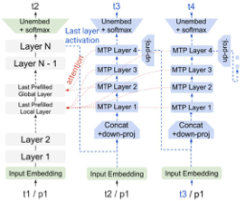
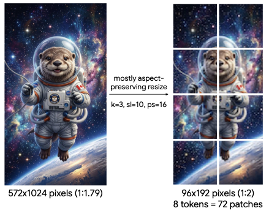

# Gemma4 — Research Note
> [English](./README.md) | **繁體中文**

## 📇 Academic Context

| Field | Value |
|-|-|
| Title | Gemma 4 Technical Report |
| Venue | arXiv:2607.02770(technical report,未經同行評審) |
| Year | 2026 |
| Authors | Gemma Team, Google DeepMind |
| Official Code | unknown |
| Venue Kind | tech-report |

> 本筆記依據 arXiv 預印本 `2607.02770v1`(2026-07-02 提交,cs.CL)撰寫,證據以 e-print 的 LaTeX 原始檔為主。這是 Google DeepMind 的技術報告而非同行評審論文,camera-ready 或後續版本的數字可能變動。權重以 Apache 2.0 授權釋出;論文正文未給出程式碼倉庫 URL,故 Official Code 記為 `unknown`。

## First Principles

Gemma 4 是一個 open-weight、原生多模態(文字、影像、音訊)的模型家族,核心賣點不是單一新演算法,而是一組為「on-device 推論效率 × 推理能力」服務的工程取捨。以下從模型家族、長上下文 KV cache 效率、encoder-free 架構、thinking mode 與 MTP drafter、量化,最後用一個真實前向例子把影像切塊算清楚。

### 模型家族與參數配置

Gemma 4 同時提供 dense 與 Mixture-of-Experts(MoE)兩種架構,規模從 effective 2.3B(E2B)到 31B,外加一個 3.8B active / 26B total 的 MoE 變體(26B-A4B);各尺寸支援的 modality 與 encoder 配置並不一致:E2B/E4B 有 305M audio + 150M vision encoder,26B-A4B/31B 只有 550M vision encoder(無音訊),12B 則走 encoder-free 投影、不掛獨立編碼器。tokenizer 沿用 Gemini 的 SentencePiece(split digits、byte-level),詞表 262k。

| 模型 | 類型 | 規模 | Einsums | Drafter |
|-|-|-|-|-|
| E2B | Dense | 2.3B 有效 | 1,870M | 76M |
| E4B | Dense | 4.5B 有效 | 3,940M | 77M |
| 12B | Dense(encoder-free) | 12B | 10,890M | 400M |
| 26B-A4B | MoE | 3.8B active / 26B total | 24,500M | 430M |
| 31B | Dense | 31B | 29,290M | 500M |

其中 E2B 與 E4B 沿用 Gemma 3n 的 per-layer embeddings,使它們在 5B 與 8B total 參數下分別達到 2.3B 與 4.5B effective;這種「總參數大、有效參數小」的設計是後面批判要留意的比較口徑。

### 長上下文與 KV cache 效率

延長上下文會讓 KV cache 記憶體爆炸,Gemma 4 的對策是把大部分 attention layer 設成便宜的 local sliding-window,只留少數昂貴的 global self-attention:local-to-global 比例為 5:1(2.3B 的 E2B 用 4:1),並在 global 層直接把 keys 當成 values 重用(E2B、E4B 除外),省下一半的 value 儲存。

$\text{values} = \text{keys}$

位置編碼上,global 層採用 $p\text{-RoPE}$($p=0.25$,只旋轉四分之一維度)、local 層用一般 RoPE,RoPE 頻率在 global/local 層分別設為 1M 與 10k;論文宣稱這些組合把 global KV cache 佔用「最多」降低 37.5%,並額外對 E2B、E4B 施加 20/35 與 18/42 的 KV cache sharing 比例。

### Encoder-free 統一架構(僅 12B)

12B 走一條與眾不同的路:from scratch 訓練,丟掉獨立編碼器。視覺端,它吃 48×48×3 的 RGB patch,用一個 35M 參數的單一大 matmul 取代 550M 的 vision encoder,再對 patch 表徵加上 2D 座標式位置嵌入並過一層 LayerNorm 維持空間感。

音訊端更激進:305M 的 USM conformer 編碼器被「完全丟棄」,原始音訊以 16kHz 切成 40ms chunk(每 chunk 640 維)後直接投影進 LLM embedding space;因為音訊本身就是時間序列,不再需要額外位置編碼。

### Thinking mode 與 MTP drafter

Gemma 4 在後訓練加入 thinking mode:模型可在回答前先輸出一段 reasoning trace,在數學、程式等推理密集領域提升表現(靠 `<|think|>` 控制 token 開關)。

為了加速解碼,Gemma 4 訓練了一個小的自回歸 multi-token prediction(MTP)drafter head 供 speculative decoding:它把主模型上一步的 last-layer activations 與 token embeddings 餵進一個獨立 embedder 加 4 層 Transformer,並 cross-attend 主模型的 KV,因此不需要 MTP prefill、可支援任意 draft 長度;drafter 的 model dim 在 E2B/E4B 為 256、在 26B-A4B/31B 為 1024,含三層 local 與一層 global attention。E2B/E4B 的 drafter 還用「群集 top-k」把最後對整個詞表的投影換成對 token 群集的 top-k 運算:

$d \times 262{,}000 \rightarrow d \times 4096$

論文 Figure 1 把這個「不需 prefill」的機制畫得很清楚:MTP 解碼器(右側藍色方塊)以 cross-attention 直接讀取主模型不同深度的特徵層——包含 last prefilled local layer、last prefilled global layer 以及最後的 Layer N,再逐步自回歸吐出多個 draft token,因此免去了對 draft 序列另做一次 prefill 的開銷。



### 量化感知訓練(QAT)

Gemma 4 隨 raw checkpoint 一併釋出兩套量化格式:mobile(weight 混用 int2/int4、activation int8)與 blockwise 的 Q4_0;同時對編碼器量化,150M vision encoder 以 W8A8 換到 2 倍的 forward-pass 記憶體縮減(400 MB → 200 MB)與相對 Gemma 3n 44% 的 on-device latency 降低,audio encoder 則把 on-disk 佔用從 Gemma 3n 的 390 MB 壓到 87 MB(78% 縮減)。

### 一次具體前向:variable-resolution 影像切塊

視覺編碼器支援可變長寬比,最大 token 數 $N_\text{max}$ 只能取 70、140、280、560、1120;下面這個保長寬比的 resize 演算法(論文 Algorithm 1)決定每張圖被壓成幾個 soft token:

```text
輸入: 影像 I ∈ R^(H×W×C), patch size p, 最大 token 數 N_max, pooling kernel size k
m ← k · p                       # pooled patch 邊長
T ← N_max · m^2
f ← sqrt(T / (H · W))           # 理想縮放因子
H_ideal ← f · H ; W_ideal ← f · W
H_target ← floor(H_ideal / m) · m   # 向下取整到 m 的倍數
W_target ← floor(W_ideal / m) · m
I_resized ← BicubicResize(I, H_target, W_target)
```

以論文附錄圖給的參數 `patch_size=16`、`pooling_kernel_size=3`、`max_soft_tokens=10` 走一遍:pooled patch 邊長是

$m = k \cdot p = 3 \times 16 = 48$

而 token 預算換算成像素面積是

$T = N_{\max} \cdot m^2 = 10 \times 48^2 = 23040$

於是圖被 resize 成 2×4 個 pooled patch(每個 pooled patch 邊長 48 px、即 48×48 px,合計 8 個 ≤ 10 的預算);換算成 16px 的 patch 就是 6×12 = 72 個 patch 進 vision encoder,再做 3×3 pooling,最後只剩 72 / 9 = 8 個 soft token 交給 LLM backbone——這說明「解析度」在 Gemma 4 是被 token 預算與 pooling 反推出來的,而非固定尺寸。

論文 Figure 2 用一張 $572 \times 1024$(長寬比 1:1.79)的太空水獺圖示範同一套流程:在 `k=3`、`max_soft_tokens=10`、`patch_size=16` 下,演算法算出最接近原比例、又落在 token 預算內的目標尺寸 $96 \times 192$(1:2),對應 2×4 個 pooled patch 與 72 個 16px patch,最終壓成 8 個 soft token。



### 效能:相對 Gemma 3 27B 的躍升

在靜態基準上,Gemma 4 各尺寸(thinking mode)相對前代 Gemma 3 27B(non-thinking)有大幅領先,尤以推理類最明顯:

| Benchmark(thinking) | Gemma 4 31B | Gemma 4 E2B | Gemma 3 27B(non-thinking) |
|-|-|-|-|
| MMLU Pro | 85.2 | 60.0 | 67.6 |
| AIME 2026(no tools) | 89.2 | 37.5 | 20.8 |
| LiveCodeBench v6 | 80.0 | 44.0 | 29.1 |
| GPQA Diamond | 84.3 | 43.4 | 42.4 |
| Codeforces (Elo) | 2150 | 633 | 110 |

在人類盲測的 Arena Text(2026-06-19 快照)上,Gemma 4 31B 拿到 1451 Elo(全榜第 43、dense open 模型第一),26B-A4B 為 1438,遠高於 Gemma 3 27B 的 1366,並在榜上與參數量大它十倍以上的 MoE 開源模型(如 DeepSeek V4、Kimi K2.6、GLM 5)比肩;長上下文方面 RULER 128k 上 31B 達 96.4、Gemma 3 27B 僅 66.0,音訊上 E4B 在 CoVoST 翻譯平均 38.2 勝過 Gemma 3n E4B 的 34.7(此為 AVG CorpusBLEU,越高越好);同一組音訊評測中,FLEURS ASR 的平均 WER 也從 Gemma 3n E4B 的 0.085 降到 Gemma 4 E4B 的 0.075(越低越好)。

## 🧪 Critical Assessment

### 37.5% 這個效率數字的溯源前後不一

最醒目的效率宣稱——global KV cache「最多」降低 37.5%——在論文裡有兩處互相打架的歸因:Introduction 把它算給「KV cache sharing + 在 global 層把 keys 當 values 重用」的組合,而 Model Architecture 一節卻寫成是 $p\text{-RoPE}$($p=0.25$)「effectively reducing the global KV cache by 37.5%」。兩種機制、同一個數字、沒有任何推導或 ablation,加上「up to」的措辭,讓人無法判斷這 37.5% 到底來自何處、在哪些尺寸成立;這是一個典型「結論先行、推導從缺」的效率宣稱。

### 主要對照組只有自家 Gemma 3 27B,且 thinking 對 non-thinking

除了 Arena 榜是跟眾多外部模型盲測(相對公允),靜態、視覺、長上下文三張主表的唯一縱向對照都是自家上一代 Gemma 3 27B,看不到同尺寸的當代開源競品(如 Qwen、Llama 系)逐項並列。更關鍵的是口徑:表格註明 Gemma 4 全在 thinking mode、而 Gemma 3 27B 是 non-thinking,於是「across the board 大幅領先」有一部分其實是 thinking / non-thinking 的落差,而非單純的世代進步——把同一顆 Gemma 4 關掉 thinking 再比,才是公平的世代對照,但論文沒有給。

### open-weight 不等於 open-recipe:關鍵細節缺席難以複現

作為技術報告,它交代了架構與各尺寸的維度,卻對真正決定成敗的東西幾乎沉默:pre-training 只說「similar to Gemma 3」、資料組成與混合比例、總訓練 token 數、實際訓練 compute(只給了 TPU 晶片數與 sharding)、post-training 的資料與 RL 設定全部從缺。這讓 Gemma 4 是可下載權重、卻不可複現訓練的模型,外部研究者無法據此重跑或驗證任何效率與能力宣稱。

### 安全宣稱是自我報告,缺乏可對照的外部基準數字

安全一節宣稱「every category of content safety 都有 major improvements」「minimal policy violations」,但整段沒有任何 benchmark 名稱、數字或表格,也沒有外部 red-team 的可對照結果;而且測試是「without safety filters」下自評的。對一個主打企業與 on-device 部署的 open model,這種只有形容詞、沒有可稽核數字的安全論述,分量明顯低於它對能力基準的詳盡程度。

### effective-param 口徑與選擇性回報會放大「小模型也能打」的敘事

「E2B 用少 10 倍參數就約等於 Gemma 3 27B」這類說法建立在 effective-parameter 口徑上:E2B 的 total 參數其實是 5B(靠 per-layer embeddings 才算成 2.3B effective),而它在硬推理(AIME 2026 僅 37.5、GPQA 43.4)離大模型仍有明顯差距,「約等於」主要成立在較容易的綜合題。表格中也有不少 `-`(如 HLE with search 只報 31B/26B、MTOB 256k Full book 只報 31B/26B/12B 三顆較大模型、對 E4B/E2B 留白),屬於選擇性回報,讀者不易看出小模型在困難任務上的真實天花板。

## 一分鐘版

- **KV cache 瘦身**:延長上下文最痛的是 KV cache 記憶體,Gemma 4 把多數注意力層改成便宜的 local sliding-window,並在 global 層直接把 keys 當 values 重用——論文宣稱這套組合最多可把 global KV cache 佔用降低 37.5%(但這個數字的歸因在文中前後不一,見下方批判)。
- **Encoder-free 12B**:12B 乾脆丟掉獨立視覺編碼器,把影像 patch 直接投影進語言模型——用一個 35M 參數的矩陣乘法就取代了原本 550M 的 vision encoder。
- **Thinking mode**:模型能在回答前先輸出一段推理軌跡,在數學、程式等推理密集領域大幅拉高分數——31B 在 AIME 2026 拿到 89.2,遠高於前代 Gemma 3 27B 的 20.8。
- **對照基準不對等**:上面那種「across the board 大幅領先」,有一部分其實是拿「開了 thinking 的 Gemma 4」去打「沒開 thinking 的前代 Gemma 3 27B」;論文並未提供同一顆 Gemma 4 關掉 thinking 後的公平世代對照。
- **開權重不等於開配方**:報告開放了模型權重下載,卻對訓練資料組成、混合比例與總訓練 token 數保持沉默,外部研究者因此無法據此複現訓練。

## 🔗 Related notes

- [Scaling Laws for Neural Language Models](../ScalingLaws/) — 參數/資料/compute 的縮放取捨,是 Gemma 4「有效參數 vs 效能」敘事的背景。
- [Byte Latent Transformer](../ByteLatentTransformer/) — 同樣走「丟掉固定 tokenizer/encoder、直接吃原始 patch」的路線,可對照 Gemma 4 的 encoder-free 設計。
- [LayerSkip](../LayerSkip/) — self-speculative decoding,與 Gemma 4 的 MTP drafter 同屬加速解碼家族。
- [Scaling Test-Time Compute](../ScalingTestTimeCompute/) — 以測試期算力換效能,對應 Gemma 4 的 thinking mode。
