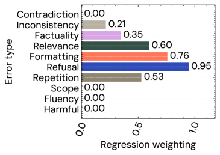
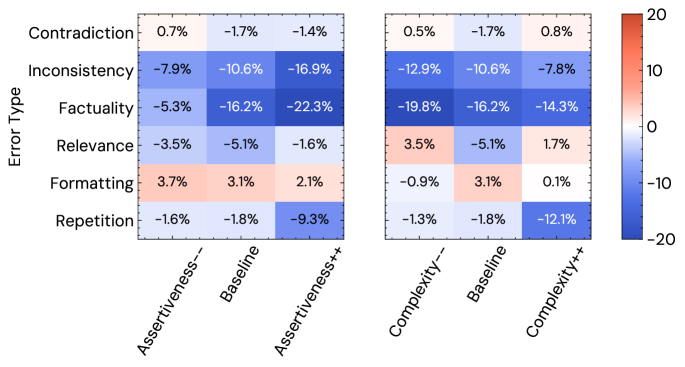
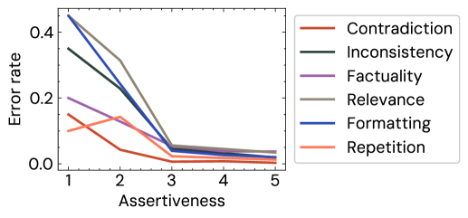
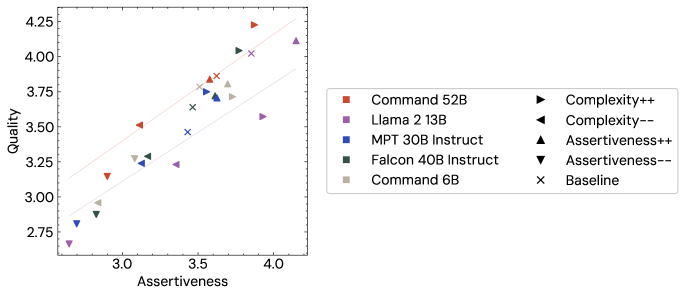

# Human Feedback is not Gold Standard — Research Note

## 📇 Academic Context

| Field | Value |
|-|-|
| Title | Human Feedback is not Gold Standard |
| Venue | ICLR 2024 |
| Year | 2024 |
| Authors | Tom Hosking, Phil Blunsom, Max Bartolo |
| Official Code | https://github.com/cohere-ai/human-feedback-paper |
| Venue Kind | paper |

## First Principles

### 一、被當成「金標準」的那個單一分數

大型語言模型（LLM）的開放式生成任務很難用自動指標評估，於是「找人來打一個總體分數」變成事實上的標準做法：human evaluation using a single overall score has become the *de facto* standard，而且這個分數不只用來評估，還被拿來當 RLHF 的訓練目標。這篇論文的核心質疑是：這個被壓縮成單一純量的 `preference` 分數，到底捕捉了輸出的哪些屬性？它真的能當作可靠的「金標準」嗎？

作者的出發點是一個很實務的觀察：標註者會偷懶。人在面對繁重的判斷任務時會 look for shortcuts to make the task easier，因此傾向依據容易檢查的表層屬性（流暢度、語言複雜度）打分，而不是需要花力氣查證的屬性（例如事實正確性）。如果偏好分數系統性地被表層屬性主導，那用它來訓練模型，等於在獎勵「看起來好」而非「真的有用」。

### 二、Part 1：單一偏好分數的錯誤覆蓋率

論文先定義一組任務無關、但夠具體到能被標註的最小需求，作為「錯誤類型」。這組準則綜合了 Xu et al. (2023) 的批判性評估、Grice 合作原則（Maxim of Quantity 對應重複、Maxim of Quality 對應事實），以及使用者在生產環境在意的面向，最終得到十種 error types：Harmful、Fluency、Scope、Repetition、Refusal、Formatting、Relevance、Factuality、Inconsistency（即 faithfulness）、Contradiction。

實驗設定上，作者從三個資料集（Curation Corpus 摘要、Amazon 產品描述、WikiHow 教學）建構輸入，蒐集 MPT 30B Instruct、Falcon 40B Instruct、Command 6B/52B 以及 reference 輸出的回應。標註來自 Prolific 的母語英語者，介面基於 Potato，協議依 RankME 的發現：一次只給兩個輸出、收集絕對評分較能提升標註者一致性。關鍵是他們用**兩組不同的標註者**：一組逐一標記每個 error type（binary yes/no），另一組完全獨立地用自己的標準給 1–5 的總體品質分。Part 1 共標註 900 distinct outputs，含品質檢查共 4,440 annotations。

品質控制用了兩個機制。第一是 distractor：把某個輸出跟「同模型但不同輸入」的輸出配成一對當注意力檢查——結果 distractor 有超過 97% 的比例被正確地評為較差，代表絕大多數標註者確實在認真做。第二是用 Gwet's AC1 衡量標註者一致性，分數落在 0.64（Factuality，最難、最主觀）到 0.94（Refusal，最容易判定）之間，這個落差本身就暗示不同錯誤類型的可靠度差很多。

為了量化「每種錯誤有多少被總體分數捕捉」，作者對總體分數與各錯誤標註擬合一個 Lasso regression（$\alpha=0.01$）。我們可以把這個線性模型的直覺寫成（符號為本文所擬）：

$$\hat{s} \;=\; s_0 \;-\; \sum_{j=1}^{10} w_j \cdot \mathbb{1}[e_j = 1]$$

其中 $e_j$ 表示第 $j$ 種錯誤是否出現、$w_j \ge 0$ 是 Lasso 學到的權重，也就是「該錯誤出現時，總體分數預期會被扣掉多少」。Lasso 的 $\ell_1$ 懲罰會把貢獻微弱的錯誤權重壓成零，因此非零權重的錯誤就是「有進到總體分數裡」的那些。

結果是 Six out of ten error types contribute to the overall scores，其中 refusal 的權重最強；而 Factuality 與 inconsistency 雖然有貢獻，權重卻小得多。換句話說，單一偏好分數會**遮蔽**事實性與一致性這兩個關鍵面向的失敗——它們有被看到，但被嚴重低估。剩下沒進到分數裡的錯誤（如 harmful、fluency）恰好也是最罕見的（出現率 < 1%），因為這些強模型在這些良構任務上很少犯這類錯。

*圖：各錯誤類型在 Lasso 下的權重，refusal 最強、factuality 偏低。*

distractor 還揭露了一個更微妙的問題：標註者無法乾淨地把各準則拆開判斷。理論上 factuality、contradiction 這種「與輸入無關」的準則，在 distractor 上不該被扣分（該扣的是 relevance、inconsistency）。但實際上 factuality and contradiction (within the output) are both rated worse for the distractor examples——它們被錯誤地連坐扣分。作者推測標註者會先對回應形成「好/壞」的第一印象，再讓這個印象污染每個細項判斷：先覺得回應爛，就更容易覺得它哪裡都有錯。

### 三、Part 2：果斷性是事實性判斷的混淆變數

既然細項標註本身也可能有偏誤，Part 2 直接檢驗兩個假設中的混淆變數：果斷性（assertiveness）與語言複雜度（complexity）。背後是社會語言學的 language ideology——說話者的語氣與風格會扭曲聽者對其可信度與智識的判斷。作者用四種 preamble（系統提示）操控輸出風格：Assertiveness−−（謹慎、防衛、不確定）、Assertiveness++（權威、堅定、有說服力）、Complexity−−（用簡單詞彙）、Complexity++（用複雜術語），且 preamble 對標註者隱藏。

為了估計「真實」錯誤率，作者自己（the authors）仔細標註了 300 examples for each error type 當作 expert 標註，用來跟群眾標註對照。Part 2 共標註 1,500 distinct outputs、含品質檢查 7,200 annotations，模型組換掉 reference、加入以 RLHF 訓練的 Llama 2 13B Chat。

核心結果是：群眾標註者系統性地低估 factuality 與 inconsistency 錯誤，而且這個低估幅度**隨果斷性上升而擴大**、隨果斷性下降而縮小。用論文的話說，annotators are more trusting of assertive responses, and are less likely to identify factuality or inconsistency errors within them。也就是說，果斷性不只影響總體分數，還直接污染了最需要客觀性的細項判斷。

*圖：不同 preamble 下群眾與專家標註的錯誤率差 δ。*

把 Table（`tab:full_error_rates`）的 Factuality 三欄抽出來走一遍，就能看清這個混淆效應。以下數字為群眾（Ann.）、專家（Exp.）與差值 δ = Ann. − Exp.（百分點）：

| Preamble | Factuality Ann. | Factuality Exp. | δ (Ann.−Exp.) |
|-|-|-|-|
| Baseline | 4.3 | 20.3 | -16.1 |
| Assertiveness−− | 7.1 | 12.5 | -5.4 |
| Assertiveness++ | 2.2 | 24.6 | -22.3 |

讀法是這樣：Baseline 下專家抓到 20.3% 的輸出有事實錯誤，群眾只抓到 4.3%，低估 16.1 個百分點。到了 Assertiveness++，專家抓到的真實錯誤率其實**上升**到 24.6%（更果斷的輸出反而更容易硬掰事實），但群眾抓到的卻**下降**到只剩 2.2%，低估幅度暴增到 22.3 個百分點。反過來在 Assertiveness−− 組，專家真實錯誤率降到 12.5%、群眾升到 7.1%，低估只剩 5.4 個百分點。同一個 δ 從 −5.4 → −16.1 → −22.3 單調惡化，正好對應果斷性從低到高——這就是「越果斷、越沒人抓得到它在唬爛」的量化證據。作者又用「以感知果斷性分箱」重畫錯誤率，得到一致結論，排除了純粹是 preamble 改變真實錯誤率的解釋。

*圖：錯誤率隨感知果斷性升高而下降。*

### 四、Part 3：偏好作為訓練目標可能放大果斷性

如果果斷性會抬高感知品質，那用偏好分數訓練就有副作用風險。作者量到 Assertiveness is strongly positively correlated with overall quality scores, with a Pearson correlation coefficient of 0.68，複雜度的相關係數則為 0.53。因果方向難定（是果斷的回應真的較好，還是較好的回應被覺得較果斷？），但這個強相關本身就意味著：拿人類偏好當訓練目標，可能在無意間把輸出推向更果斷、更複雜。

*圖：各模型的品質對果斷性散點與趨勢線。*

論文比較的關鍵差異是 Command was fine-tuned on preference scores, while Llama 2 was trained using on-policy RLHF。在品質對果斷性的圖上，Llama 2 13B 在相同品質下展現更高的果斷性（落在右下），Command 52B 則相對「謙遜」（左上，相同品質下果斷性較低）。作者據此提出 preliminary evidence：RLHF 目標雖然提升了 Llama 2 的品質，卻可能把果斷性抬升得更多。這只是 preliminary，因為兩個模型的訓練細節不可直接比較——但它也順帶證明品質與果斷性**可以被解耦**，「謙遜且高品質」的模型應被視為比「自信卻錯誤」的模型更理想。

## 🧪 Critical Assessment

### 這個問題是不是真的、重不重要

這篇的問題設定站得住腳，而且切中當下 RLHF 生態的要害：偏好分數同時是主流評估指標與訓練訊號，如果它系統性地偏袒表層屬性，整條 alignment 流水線都會被污染。作者沒有停在「偏好分數是主觀的」這種空泛主張，而是用 expert vs. crowd 的雙軌標註把「低估多少、隨什麼變數擴大」量化出來，δ 從 −5.4 到 −22.3 的單調惡化是很難反駁的證據。這比許多只做定性抱怨的評估批判紮實。

### 基線、對照、資料與指標夠不夠

最強的方法論設計是把「作者自己的 expert 標註」當真實值的近似，用它跟群眾標註做差。但這正是最脆弱的環節：作者也承認這 not strictly an unbiased set of ratings。專家（同時是論文作者）知道研究假設、且有動機在「果斷輸出」上更用力查證，光是這一點就足以人為放大 δ 隨果斷性的趨勢——這是無法從論文數據內部排除的循環風險。理想的對照應是預先註冊、對假設盲化的第三方專家，而非作者本人。其次，果斷性與複雜度在標註上高度糾纏（作者自陳兩維度相關），Part 2 對這兩個「獨立」混淆變數的拆解因此並不乾淨。第三，Gwet AC1 對 Factuality 僅 0.64，代表就連被當作真實值基礎的事實性判斷本身都有相當的雜訊，δ 的絕對數值需保留誤差空間。樣本規模（900 / 1,500 輸出）對主效應足夠，但把資料切成 preamble × error-type 後每格樣本變小，論文未報告 δ 的信賴區間或顯著性檢定，「單調惡化」有多少是抽樣波動仍屬未證實。

### 是新發現還是舊觀察換包裝

sycophancy（諂媚）、verbosity bias、「reference 不是 ground truth」這些現象在相關工作（Perez et al.、Sharma et al.、Kabir et al.）已被提出，本文的果斷性偏誤可視為 sycophancy 的一個具體切面。真正的增量在於：把偏誤從「模型行為」層次搬到「人類標註過程」層次，並用 Lasso 覆蓋率 + expert-crowd 差值把它從軼事變成可測量的量。這不是純粹換名詞，但也談不上顛覆——它更像是給既有直覺補上乾淨的量化骨架。值得注意的是，作者選定的十種 error type 與 Lasso 分析，某種程度上是圍繞「能凸顯 factuality 被低估」這個既定結論來設計評估框架的：如果換一組準則或不同的聚合方式，refusal 未必仍是最強權重。

### 問題被解決了嗎、對真實世界有多大意義

論文誠實地沒有宣稱解決問題——它是診斷而非療方，Part 3 更明說 RLHF 那部分只是 preliminary evidence，兩模型不可直接比較，充其量是提出待驗證的假設，不能當成 RLHF 放大果斷性的定論。附錄裡「reference 品質最低」的說法也需打折：`tab:scores_by_model1` 的 unbiased 欄其實是 Command 6B（3.49）最低、reference 為 3.62，該主張只在 biased 欄（reference 3.50）成立且與次低者僅差 0.01，屬於被過度概括的結論。真實世界意義上，作者提的緩解方向（訓練有素、有誘因的標註者池、多標註者聚合、jury learning）都合理但未在本文驗證有效，仍是開放問題。整體而言，這是一篇高品質的「問題揭示」論文，其價值在於把一個模糊的擔憂變得可測、可討論，而非提供可直接落地的解法。

## 🔗 Related notes

- [Training language models to follow instructions with human feedback (InstructGPT)](../ChatGPT/)
