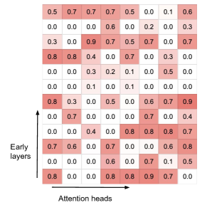
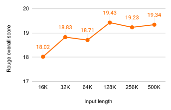

# Infini-attention — Research Note
> **English** | [繁體中文](./README.zh-TW.md)

## 📇 Academic Context

| Field | Value |
|-|-|
| Title | Leave No Context Behind: Efficient Infinite Context Transformers with Infini-attention |
| Venue | COLM 2024 |
| Year | 2024 |
| Authors | Tsendsuren Munkhdalai, Manaal Faruqui, Siddharth Gopal (Google) |
| Official Code | unknown |
| Venue Kind | paper |

> The full text of this note is based on the e-print LaTeX source of arXiv `2404.07143v2`, a version that uses the COLM 2024 camera-ready template (`\colmfinalcopy`). Should the final conference version differ from this, the conference version prevails.

## Introduction

The Transformer's attention mechanism is quadratic in sequence length: to cover an entire context, you have to hold the Key-Value (KV) states of all tokens in memory at once and compute them pairwise. The paper makes the cost concrete with a specific number — a 500B-parameter model with batch size 512 and context length 2048 has a 3TB memory footprint from the KV cache alone (`pope2023efficiently`); pushing an LLM to a length like 1M tokens becomes expensive both to train and to serve. This is where "long context" is truly stuck in engineering terms: both memory and computation balloon with length.

The solution the paper proposes is Infini-attention: on top of the original scaled dot-product attention, it hangs a fixed-size compressive memory within "the same attention layer, the same set of Q/K/V," performing writes and reads in the form of linear attention. As a result every layer simultaneously holds two kinds of state — a local causal attention covering the current segment, and a long-term memory accumulated across segments and updated recurrently. Because it makes only a "tiny but critical" change to the existing attention, an existing LLM can be extended into a long-context model plug-and-play via continual pre-training.

The paper measures effectiveness with three "extremely long input" tasks: long-context language modeling (PG19 and Arxiv-math, with token-level perplexity as the metric, and Transformer-XL, Memorizing Transformers, and RMT as baselines); passkey retrieval at 1M length (hiding a set of digits in extremely long distractor text and asking the model to recover it, using a 1B model); and BookSum book summarization at 500K length (with Rouge as the metric, against BART, PRIMERA and their retrieval-based long-context version Unlimiformer, using an 8B model). The three headline results are, respectively: achieving roughly a 114x compression ratio in memory, a 1B model solving 1M passkey, and an 8B model setting a new SOTA on BookSum.

## First Principles

### Why turn attention into "recurrence"

Standard attention does a single feed-forward computation per segment; after outputting $O_s = \mathrm{attention}(X_s)$ it passes the result to the next layer, and **the same attention layer carries no state into the next segment $X_{s+1}$**. To capture dependencies between adjacent segments, you can only cram them into the same attention computation together, which becomes the bottleneck once the length grows. The core move of Infini-attention is to introduce a "recurrent attention layer": it maintains a memory state $M_s$, letting the output and the new memory be produced together (this note denotes it $O_s, M_s = \mathrm{Infini\text{-}attention}(X_s, M_{s-1})$), compressing context into a fixed-size state and passing it forward like an RNN.

The local path is still the untouched multi-head scaled dot-product attention: first compute $Q, K, V$, then obtain the local context $A_{dot}$ with the following expression.

$$A_{dot} = \mathrm{softmax}\left(\frac{Q K^\top}{\sqrt{d_{model}}}\right) V$$

### Compressive memory: writing and reading via linear attention

The key point is that Infini-attention does not compute a separate set of projections for memory; it **directly reuses** the $Q, K, V$ already computed by dot-product attention. The memory is parameterized as an associative matrix $M_{s-1} \in \mathbb{R}^{d_{key} \times d_{value}}$; reading it queries with the query and normalizes with a normalization term $z_{s-1}$, equivalent to the linear attention of Katharopoulos et al.:

$$A_{mem} = \frac{\sigma(Q)\, M_{s-1}}{\sigma(Q)\, z_{s-1}}$$

Here $\sigma$ takes the element-wise ELU+1, and $z_{s-1}$ is the running sum over all keys; both are carried over from the linear attention literature for training stability. Writing accumulates the new KV binding into the matrix and updates the normalization term at the same time; the term $\sigma(K)^\top V$ is the so-called associative binding operator:

$$M_s \leftarrow M_{s-1} + \sigma(K)^\top V, \qquad z_s \leftarrow z_{s-1} + \sum_{t=1}^{N} \sigma(K_t)$$

The paper additionally provides a delta rule variant: before updating, it first reads out the "existing old value" already in memory, subtracts it from the new value, and then does the binding; the benefit is that when a given KV binding is in fact already in memory, the associative matrix is barely written to redundantly.

$$M_s \leftarrow M_{s-1} + \sigma(K)^\top \left(V - \frac{\sigma(K)\, M_{s-1}}{\sigma(K)\, z_{s-1}}\right)$$

### Mixing long-term and local context together

The final step fuses the memory-read $A_{mem}$ with the local context $A_{dot}$ via gating, using a learnable scalar $\beta$ that is "one per head," letting the model learn the trade-off between long-term and local information flow itself (each head gets only one extra training parameter):

$$A = \mathrm{sigmoid}(\beta) \odot A_{mem} + (1 - \mathrm{sigmoid}(\beta)) \odot A_{dot}$$

After training, one observes that the gating scores surface two kinds of heads: "specialized heads" with scores close to 0 or 1 (going only through local attention, or drawing values only from the compressive memory), and "mixer heads" with scores near 0.5 (mixing the current context with the long-term memory). The figure below plots the $\mathrm{sigmoid}(\beta)$ of each head in each layer as a heatmap, where the specialized and mixed types can be seen coexisting.

### How fixed memory buys "unbounded" context: a concrete calculation

The difference between the Infini-Transformer and Transformer-XL can be seen at a glance in the figure below: Transformer-XL caches only the KV of "the previous segment," and old context is immediately discarded (the staircase shape at the bottom); the Infini-Transformer, at every layer, merges old KV into the compressive memory, retaining the entire history (top).

Compute the memory size once with the paper's language-modeling setup: the compressive memory per head needs only to store $M_s$ ($d_{key} \times d_{value}$) and $z_s$ ($d_{key}$), i.e. a constant complexity of $d_{key} \times d_{value} + d_{key}$, independent of sequence length. Plug in the model dimensions $d_{key}=d_{value}=128$, $H=8$ heads, $l=12$ layers: a single head in a single layer is $128 \times 128 + 128 = 16512$ memory-state values (i.e. the entries of $M_s$ and $z_s$, the compressive-memory footprint updated at each recurrence step, not trainable parameters), times $8 \times 12$ gives about $1.585\text{M} \approx 1.6\text{M}$ — exactly matching the compressive memory size of 1.6M reported in the paper, i.e. a compression ratio of about 114x relative to Memorizing Transformers' 183M KV memory ($183 / 1.6 \approx 114$). During training the segment length $N$ is set to 2048 and the input sequence to 32768, which unrolls the compressive memory over $32768 / 2048 = 16$ steps (BPTT).

On the small-model language modeling of PG19 / Arxiv-math, this fixed memory buys not only memory savings but also lower perplexity:

| Model | Memory (comp.) | XL cache | PG19 | Arxiv-math |
|-|-|-|-|-|
| Transformer-XL | 50M (3.7x) | 2048 | 11.88 | 2.42 |
| Memorizing Transformers | 183M (1x) | 2048 | 11.37 | 2.26 |
| RMT | 2.5M (73x) | None | 13.27 | 2.55 |
| Infini-Transformer (Linear) | 1.6M (114x) | None | **9.65** | 2.24 |
| Infini-Transformer (Linear + Delta) | 1.6M (114x) | None | 9.67 | **2.23** |

The Infini-Transformer reaches 9.65 perplexity on PG19, beating Transformer-XL's 11.88 and Memorizing Transformers' 11.37, while its compressive memory size is 114x smaller (the latter uses a length-65K KV memory at layer 9). Pulling the training sequence length further from 32K to 100K and training instead on Arxiv-math, perplexity can drop again to 2.21 for Linear and 2.20 for Linear+Delta (this number comes only from that Arxiv-math 100K experiment, not from PG19). It is worth noting that Linear and Linear+Delta are nearly tied: on PG19 the two differ by only 0.02 perplexity (9.65 vs 9.67, about 0.21%), while on Arxiv-math it is instead Linear + Delta that is 0.01 lower (2.23 vs 2.24); the difference the delta rule brings is in fact very small.

### Long-context adaptation: passkey and BookSum

Passkey retrieval directly tests "whether a set of digits can be recovered from extremely long distractor text." The paper swaps the vanilla MHA of a 1B LLM for Infini-attention, first continual-pre-trains for 30K steps with 4K inputs (batch size 64), then fine-tunes for only 400 steps using inputs of only **5K length**, and solves passkey on tests up to 1M in length. Note that even though the total inputs of passkey and BookSum reach 1M and 500K respectively at most, the segment length actually processed by each Infini-attention layer is uniformly fixed at $N=2\text{K}$ across all LLM experiments; the longer context comes not from enlarging the single-pass attention window, but from the compressive memory passing recurrently across segments. The table below shows token-level retrieval accuracy (the numbers are the accuracy of the passkey hidden at three positions: start/middle/end); after fine-tuning, 32K–1M is nearly all correct:

| Setting | 32K | 128K | 256K | 512K | 1M |
|-|-|-|-|-|-|
| Zero-shot (Linear) | 14/13/98 | 11/14/100 | 6/3/100 | 6/7/99 | 8/6/98 |
| Zero-shot (Linear + Delta) | 13/11/99 | 6/9/99 | 7/5/99 | 6/8/97 | 7/6/97 |
| FT 400 steps (Linear) | 100/100/100 | 100/100/100 | 100/100/100 | 97/99/100 | 96/94/100 |
| FT 400 steps (Linear + Delta) | 100/100/100 | 100/100/99 | 100/100/99 | 100/100/100 | 100/100/100 |

Book summarization BookSum scales up to 8B: first continual-pre-train for 30K steps with 8K inputs, use 32K inputs during fine-tuning, and at evaluation directly feed up to **500K** (generation temperature 0.5, $top_p=0.95$, decoding 1024 steps). Taking an entire book as input, the Infini-Transformer beats the encoder-decoder baselines purpose-built for summarization on Overall Rouge, setting a new SOTA:

| Model | Rouge-1 | Rouge-2 | Rouge-L | Overall |
|-|-|-|-|-|
| BART | 36.4 | 7.6 | 15.3 | 16.2 |
| BART + Unlimiformer | 36.8 | 8.3 | 15.7 | 16.9 |
| PRIMERA | 38.6 | 7.2 | 15.6 | 16.3 |
| PRIMERA + Unlimiformer | 37.9 | 8.2 | 16.3 | 17.2 |
| Infini-Transformers (Linear) | 37.9 | 8.7 | 17.6 | 18.0 |
| Infini-Transformers (Linear + Delta) | **40.0** | **8.8** | **17.9** | **18.5** |

The paper further plots a trend of "longer input, better Rouge" on the BookSum validation set, claiming that feeding in more book text yields better performance. But looking at the actual numbers, this trend has in fact already saturated after 128K: the score climbs from 18.02 at 16K all the way to the peak of 19.43 at 128K, but relative to this peak, 256K's 19.23 and 500K's 19.34 are lower by 0.20 and 0.09 respectively; the last three points never again exceed 128K, and it is not monotonic growth (500K's 19.34 rebounds slightly by 0.11 over 256K's 19.23, but is still below the peak).

## 🧪 Critical Assessment

### The problem is real, and the cost number holds up

The memory bottleneck of long context is not fabricated: the 3TB KV cache (500B model, batch 512, context 2048) is a specific, checkable cited number, and the quadratic complexity is a structural fact of the Transformer. So the problem setting itself — "using a fixed-size memory to buy unbounded context" — is solid, and the direction of the method (hanging linear attention as a compressive memory onto standard attention) is reasonable.

### Baselines and datasets: language modeling uses a small model, and the opponents are dated

The main language-modeling result was run on a **from-scratch small model** with 12 layers and 8 heads (128 dims per head, FFN hidden layer 4096 per layer), against Transformer-XL, Memorizing Transformers, and RMT — none of which are modern long-context LLMs, and there is no head-to-head comparison on the same data against mainstream long-context approaches like "directly using full attention on long sequences" or RoPE / positional interpolation. So the 9.65 perplexity win better explains "the compressive memory is effective within this small-model family" rather than the merits of Infini-attention relative to contemporary long-context techniques.

### The BookSum SOTA is hard to attribute to the compressive memory itself

The "new SOTA" on BookSum takes an 8B decoder LLM and compares it against BART, PRIMERA and similar encoder-decoder models purpose-built for summarization; moreover the latter's numbers are directly cited from the Unlimiformer paper (`bertsch2024unlimiformer`) rather than rerun under the same setup, and the lead of Overall 18.5 over PRIMERA + Unlimiformer's 17.2 is only 1.3 to begin with. The paper reports neither the parameter counts of these baselines nor provides a control that is "the same scale, the same architecture, differing only in whether there is a compressive memory," so "winning because of Infini-attention" and "winning because the model is bigger or the architecture is simply different" are hard to disentangle, and the gain cannot be cleanly attributed to the method itself.

### passkey ≠ long-context understanding, and it is a low-entropy self-defined task

The 1M passkey number is eye-catching, but this is a synthetic single-fact retrieval task: the distractor text is low-entropy content built up from the same "The grass is green…" passage repeated x times, and the passkey is just a set of digits to spit back verbatim. Being able to recover a needle at 1M length does not amount to being able to truly reason, aggregate, or do multi-hop understanding over 1M tokens; reading it as "solved 1M long context" overestimates the method's actual capability. As for the delta rule, this seemingly-critical improvement, its effect in fact varies by task: on language-modeling perplexity delta and linear are nearly indistinguishable (PG19 9.65 vs 9.67), a marginal contribution; but on 1M passkey after fine-tuning, Linear+Delta reaches 100/100/100, slightly beating Linear's 96/94/100, and BookSum's Overall Rouge is likewise 18.5 vs 18.0 — the delta version still has a small but consistent lead on these two tasks. So "delta's contribution is marginal" holds only for language-modeling perplexity and cannot be generalized to all tasks.

### The capacity ceiling of the fixed memory and reproducibility

Compressing an entire history into a fixed matrix of $d_{key} \times d_{value}$ is mathematically necessarily lossy: when the KV bindings of different segments interfere with each other, or when details needing precise recall exceed the matrix's capacity, the compressive memory degrades — and the paper's evaluation tasks (perplexity, single-needle passkey, summarization) hardly push against this ceiling, so how far "unbounded context" can hold up in scenarios requiring large amounts of precise long-range recall remains untested. Add to this that the paper released no official implementation, so extreme results like the 1M passkey in Table 2 cannot be independently reproduced from the paper alone, and readers would do well to treat the most striking numbers as pending verification.

## 🔗 Related notes

- [Attention Is All You Need](../AttentionIsAllYouNeed/)
- [Layer-Condensed KV Cache](../LayerCondensedKVCache/)
- [AutoMem](../AutoMem/)
