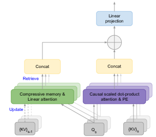
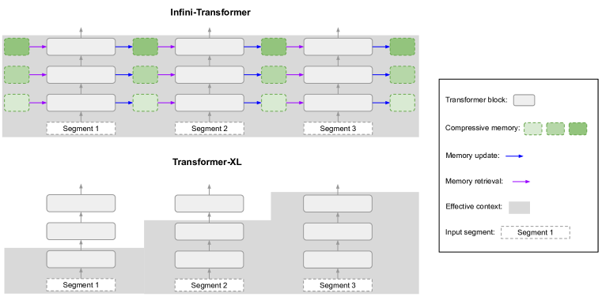

# Infini-attention — Research Note
> [English](./README.md) | **繁體中文**

## 📇 Academic Context

| Field | Value |
|-|-|
| Title | Leave No Context Behind: Efficient Infinite Context Transformers with Infini-attention |
| Venue | COLM 2024 |
| Year | 2024 |
| Authors | Tsendsuren Munkhdalai, Manaal Faruqui, Siddharth Gopal (Google) |
| Official Code | unknown |
| Venue Kind | paper |

> 本筆記的全文依據為 arXiv `2404.07143v2` 的 e-print LaTeX 原始檔，該版本使用 COLM 2024 的 camera-ready 模板（`\colmfinalcopy`）。若最終會議版與此有出入，以會議版為準。

## Introduction

Transformer 的注意力機制對序列長度是二次複雜度：要涵蓋整段上下文，就得把所有 token 的 Key-Value（KV）狀態同時放進記憶體並兩兩計算。論文用一個具體數字點出代價——一個 500B 參數、batch size 512、context length 2048 的模型，光是 KV cache 就有 3TB 的記憶體足跡（`pope2023efficiently`）；把 LLM 推到 1M token 這種長度，無論訓練或服務都變得昂貴。這就是「長上下文」在工程上真正卡住的地方：記憶體與計算都隨長度膨脹。

論文提出的解法是 Infini-attention：在原本的 scaled dot-product attention 之外，於「同一個 attention 層、同一組 Q/K/V」內再掛一塊固定大小的壓縮記憶體（compressive memory），用 linear attention 的形式做寫入與讀取。於是每一層都同時擁有兩種狀態——涵蓋當前 segment 的局部因果注意力（local causal attention），以及跨 segment 累積、以遞迴方式更新的長期記憶。因為它只在既有 attention 上做「微小但關鍵」的改動，既有 LLM 可以透過 continual pre-training 直接 plug-and-play 地擴充成長上下文模型。

論文用三個「極長輸入」任務衡量成效：長上下文語言建模（PG19 與 Arxiv-math，指標為 token-level perplexity，baseline 為 Transformer-XL、Memorizing Transformers、RMT）；1M 長度的 passkey 檢索（把一組數字藏進超長干擾文字後要模型答回，用 1B 模型）；以及 500K 長度的 BookSum 書籍摘要（指標為 Rouge，對手是 BART、PRIMERA 及其檢索式長上下文版 Unlimiformer，用 8B 模型）。三個 headline 結果分別是：在記憶體上取得約 114x 的壓縮比、1B 模型解到 1M passkey、8B 模型在 BookSum 上刷新 SOTA。

## First Principles

### 為什麼要把 attention 變成「遞迴」

標準 attention 對每個 segment 只做一次前饋計算，輸出 $O_s = \mathrm{attention}(X_s)$ 後就把結果傳給下一層，**同一個 attention 層不會把任何狀態帶到下一個 segment $X_{s+1}$**。要捕捉相鄰 segment 之間的依賴，就只能把它們一起塞進同一次注意力計算，長度一長就成為瓶頸。Infini-attention 的核心動作是引入一個「遞迴的 attention 層」：它維護一個記憶狀態 $M_s$，讓輸出與新記憶同時產生（本筆記記為 $O_s, M_s = \mathrm{Infini\text{-}attention}(X_s, M_{s-1})$），像 RNN 一樣把上下文壓進固定大小的狀態往後傳。

局部這一路仍是原封不動的多頭 scaled dot-product attention：先算出 $Q, K, V$，再用下式得到局部脈絡 $A_{dot}$。

$$A_{dot} = \mathrm{softmax}\left(\frac{Q K^\top}{\sqrt{d_{model}}}\right) V$$

### 壓縮記憶體：用 linear attention 做寫入與讀取

關鍵在於，Infini-attention 不另外算一組記憶用的投影，而是**直接重用** dot-product attention 已經算好的 $Q, K, V$。記憶體被參數化成一個關聯矩陣（associative matrix）$M_{s-1} \in \mathbb{R}^{d_{key} \times d_{value}}$，讀取時用 query 去查、以一個標準化項 $z_{s-1}$ 正規化，等價於 Katharopoulos 等人的 linear attention：

$$A_{mem} = \frac{\sigma(Q)\, M_{s-1}}{\sigma(Q)\, z_{s-1}}$$

這裡 $\sigma$ 取 element-wise 的 ELU+1、$z_{s-1}$ 是對所有 key 的累加和，兩者都是為了訓練穩定性沿用自 linear attention 文獻。寫入則是把新的 KV 綁定累加進矩陣、同時更新標準化項，$\sigma(K)^\top V$ 這一項就是所謂的 associative binding operator：

$$M_s \leftarrow M_{s-1} + \sigma(K)^\top V, \qquad z_s \leftarrow z_{s-1} + \sum_{t=1}^{N} \sigma(K_t)$$

論文另外提供一個 delta rule 變體：更新前先把記憶體裡「已存在的舊值」讀出來，用新值減去它再做綁定，好處是當某個 KV 綁定其實已經在記憶體中時，關聯矩陣幾乎不被重複寫入。

$$M_s \leftarrow M_{s-1} + \sigma(K)^\top \left(V - \frac{\sigma(K)\, M_{s-1}}{\sigma(K)\, z_{s-1}}\right)$$

### 把長期與局部脈絡混起來

最後一步是把記憶讀出的 $A_{mem}$ 與局部脈絡 $A_{dot}$ 用一個「每個 head 一顆」的可學習純量 $\beta$ 做 gating 融合，讓模型自己學長期／局部資訊流的權衡（每個 head 只多一個訓練參數）：

$$A = \mathrm{sigmoid}(\beta) \odot A_{mem} + (1 - \mathrm{sigmoid}(\beta)) \odot A_{dot}$$

訓練後觀察 gating 分數會浮現兩種 head：分數貼近 0 或 1 的「specialized head」（只走局部注意力，或只從壓縮記憶體取值），以及分數靠近 0.5 的「mixer head」（把當前脈絡與長期記憶混在一起）。下圖把各層各 head 的 $\mathrm{sigmoid}(\beta)$ 畫成熱圖，可以看到專職與混合兩型並存。

### 固定記憶體如何換來「無界」上下文：一個實算

Infini-Transformer 與 Transformer-XL 的差別可以用下圖一眼看出：Transformer-XL 只快取「上一個 segment」的 KV，舊脈絡隨即被丟棄（下方階梯狀）；Infini-Transformer 則在每一層都把舊 KV 併進壓縮記憶體，保留整段歷史（上方）。

用論文的語言建模設定實算一次記憶體大小：每個 head 的壓縮記憶只需存 $M_s$（$d_{key} \times d_{value}$）與 $z_s$（$d_{key}$），即常數複雜度 $d_{key} \times d_{value} + d_{key}$，與序列長度無關。代入模型維度 $d_{key}=d_{value}=128$、$H=8$ heads、$l=12$ 層：單頭單層為 $128 \times 128 + 128 = 16512$ 個記憶狀態值（即 $M_s$ 與 $z_s$ 的 entries，是每步遞迴更新的壓縮記憶足跡，並非可訓練參數），乘上 $8 \times 12$ 得約 $1.585\text{M} \approx 1.6\text{M}$——正好對上論文報告的壓縮記憶大小 1.6M，也就是相對 Memorizing Transformers 的 183M KV 記憶約 114x（$183 / 1.6 \approx 114$）的壓縮比。訓練時 segment 長度 $N$ 設 2048、輸入序列 32768，等於讓壓縮記憶沿 $32768 / 2048 = 16$ 步展開（BPTT）。

在 PG19 / Arxiv-math 的小模型語言建模上，這塊固定記憶體換來的不只是省記憶體，perplexity 還更低：

| Model | Memory (comp.) | XL cache | PG19 | Arxiv-math |
|-|-|-|-|-|
| Transformer-XL | 50M (3.7x) | 2048 | 11.88 | 2.42 |
| Memorizing Transformers | 183M (1x) | 2048 | 11.37 | 2.26 |
| RMT | 2.5M (73x) | None | 13.27 | 2.55 |
| Infini-Transformer (Linear) | 1.6M (114x) | None | **9.65** | 2.24 |
| Infini-Transformer (Linear + Delta) | 1.6M (114x) | None | 9.67 | **2.23** |

Infini-Transformer 在 PG19 拿到 9.65 perplexity，優於 Transformer-XL 的 11.88 與 Memorizing Transformers 的 11.37，同時壓縮記憶大小少了 114x（後者是在第 9 層用長度 65K 的 KV 記憶）。把訓練序列長度從 32K 進一步拉到 100K 並改在 Arxiv-math 上訓練，perplexity 還能再降到 Linear 的 2.21 與 Linear+Delta 的 2.20（此數字僅來自該 Arxiv-math 100K 實驗，不含 PG19）。值得注意的是，Linear 與 Linear+Delta 幾乎打平：在 PG19 上兩者僅差 0.02 perplexity（9.65 vs 9.67，約 0.21%），在 Arxiv-math 上則反而是 Linear + Delta 低 0.01（2.23 vs 2.24），delta rule 帶來的差異其實非常小。

### 長上下文適應：passkey 與 BookSum

passkey 檢索直接測「能不能在超長干擾文字中把一組數字找回來」。論文把 1B LLM 的 vanilla MHA 換成 Infini-attention，先用 4K 輸入 continual pre-train 30K 步（batch size 64），再只用 **5K 長度**的輸入 fine-tune 400 步，就在最長到 1M 的測試上把 passkey 解出來。要注意的是，即便 passkey 與 BookSum 的總輸入最長分別達 1M 與 500K，每個 Infini-attention 層實際處理的 segment 長度在所有 LLM 實驗中一律固定為 $N=2\text{K}$；更長的脈絡不是靠加大單次注意力視窗，而是靠壓縮記憶跨 segment 遞迴傳遞。下表是 token-level 檢索準確率（數字為 passkey 藏在 start/middle/end 三個位置的準確率），fine-tune 後 32K–1M 幾乎全對：

| Setting | 32K | 128K | 256K | 512K | 1M |
|-|-|-|-|-|-|
| Zero-shot (Linear) | 14/13/98 | 11/14/100 | 6/3/100 | 6/7/99 | 8/6/98 |
| Zero-shot (Linear + Delta) | 13/11/99 | 6/9/99 | 7/5/99 | 6/8/97 | 7/6/97 |
| FT 400 steps (Linear) | 100/100/100 | 100/100/100 | 100/100/100 | 97/99/100 | 96/94/100 |
| FT 400 steps (Linear + Delta) | 100/100/100 | 100/100/99 | 100/100/99 | 100/100/100 | 100/100/100 |

書籍摘要 BookSum 則把規模拉到 8B：先用 8K 輸入 continual pre-train 30K 步，fine-tune 時輸入 32K，評估時直接餵到 **500K**（生成溫度 0.5、$top_p=0.95$、解碼 1024 步）。Infini-Transformer 以整本書為輸入，在 Overall Rouge 上勝過為摘要量身打造的 encoder-decoder baseline，取得新的 SOTA：

| Model | Rouge-1 | Rouge-2 | Rouge-L | Overall |
|-|-|-|-|-|
| BART | 36.4 | 7.6 | 15.3 | 16.2 |
| BART + Unlimiformer | 36.8 | 8.3 | 15.7 | 16.9 |
| PRIMERA | 38.6 | 7.2 | 15.6 | 16.3 |
| PRIMERA + Unlimiformer | 37.9 | 8.2 | 16.3 | 17.2 |
| Infini-Transformers (Linear) | 37.9 | 8.7 | 17.6 | 18.0 |
| Infini-Transformers (Linear + Delta) | **40.0** | **8.8** | **17.9** | **18.5** |

論文進一步在 BookSum 驗證集上畫出「輸入越長、Rouge 越好」的趨勢，宣稱餵進越多書本文字表現越好。不過從實際數字看，這個趨勢在 128K 之後其實已經飽和：分數從 16K 的 18.02 一路爬到 128K 的 19.43 峰值，但相對這個峰值，256K 的 19.23 與 500K 的 19.34 分別低了 0.20 與 0.09，最後三點都沒有再超過 128K，並非單調成長（500K 的 19.34 雖比 256K 的 19.23 略回升 0.11，仍在峰值之下）。

## 🧪 Critical Assessment

### 問題是真的，成本數字也站得住

長上下文的記憶體瓶頸不是杜撰的：3TB KV cache（500B 模型、batch 512、context 2048）這個引用數字具體且可核，二次複雜度也是 Transformer 的結構性事實。因此「用固定大小記憶體換無界上下文」這個問題設定本身是紮實的，方法方向（把 linear attention 當壓縮記憶掛進標準 attention）也合理。

### baseline 與資料集：語言建模用的是小模型、對手偏舊

語言建模的主結果是在 12 層、8 head（每 head 維度 128、每層 FFN hidden layer 4096）的**從頭訓練小模型**上跑出來的，對手是 Transformer-XL、Memorizing Transformers、RMT——都不是現代長上下文 LLM，也沒有和「直接用全注意力吃長序列」或 RoPE/位置內插這類主流長上下文方案在同一資料上正面比較。因此 9.65 這個 perplexity 勝出，較能說明的是「在這個小模型家族內壓縮記憶體有效」，而非 Infini-attention 相對當代長上下文技術的優劣。

### BookSum 的 SOTA 難以歸因到壓縮記憶體本身

BookSum 的「新 SOTA」是拿一個 8B 的 decoder LLM 去比 BART、PRIMERA 這類專為摘要打造的 encoder-decoder 模型，而且後者的數字是直接引用自 Unlimiformer 論文（`bertsch2024unlimiformer`）、並非在同一套設定下重跑；Overall 18.5 對 PRIMERA + Unlimiformer 的 17.2，領先幅度本就只有 1.3。論文既沒有報告這些 baseline 的參數量，也沒有提供一個「同規模、同架構、僅差在有無壓縮記憶體」的對照，因此「贏在 Infini-attention」與「贏在模型更大或架構本就不同」很難拆開，增益無法乾淨地歸因到方法本身。

### passkey ≠ 長上下文理解，且是低熵的自訂任務

1M passkey 的數字很吸睛，但這是一個合成的單一事實檢索任務：干擾文字是同一段「The grass is green…」重複 x 次堆出來的低熵內容，passkey 也只是一組要原樣吐回的數字。能在 1M 長度把一個 needle 找回，並不等於能對 1M token 做真正的推理、聚合或多跳理解；把它讀成「解決了 1M 長上下文」會高估方法的實際能力。至於 delta rule 這個看似關鍵的改良，效果其實隨任務而異：在語言建模 perplexity 上 delta 與 linear 幾乎無差（PG19 9.65 vs 9.67），貢獻邊際；但在 1M passkey 上 fine-tune 後 Linear+Delta 拿到 100/100/100、略勝 Linear 的 96/94/100，BookSum 的 Overall Rouge 也是 18.5 對 18.0，delta 版本在這兩個任務上仍有小幅但一致的領先。因此「delta 貢獻邊際」只成立於語言建模 perplexity，不能一概而論到所有任務。

### 固定記憶體的容量上限與可重現性

把整段歷史壓進一個 $d_{key} \times d_{value}$ 的固定矩陣，數學上必然是有損的：當不同 segment 的 KV 綁定互相干擾、或需要精確回憶的細節超過矩陣容量時，壓縮記憶會退化，而論文的評測任務（perplexity、單 needle passkey、摘要）都不太會逼出這個上限，因此「無界上下文」在需要大量精確長程回憶的場景能撐到哪裡，仍屬未經檢驗。加上論文未釋出官方實作，Table 2 的 1M passkey 這類極端結果無法僅憑論文獨立重現，讀者宜把最亮眼的數字視為待覆核。

## 🔗 Related notes

- [Attention Is All You Need](../AttentionIsAllYouNeed/)
- [Layer-Condensed KV Cache](../LayerCondensedKVCache/)
- [AutoMem](../AutoMem/)
