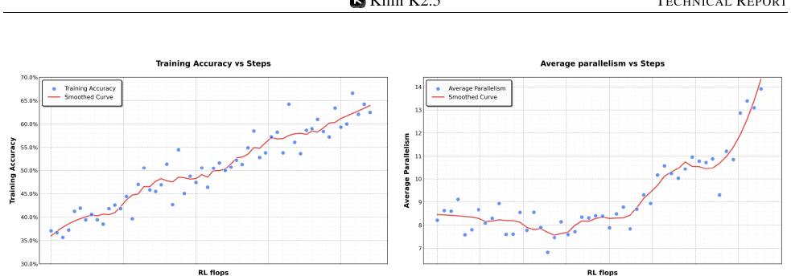
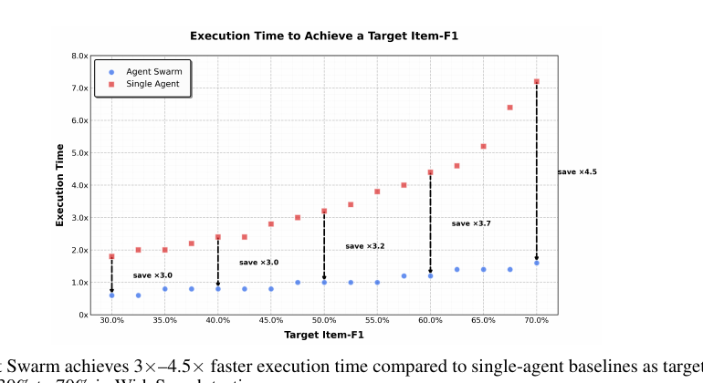

# Kimi-K2.5 — Research Note
> [English](./README.md) | **繁體中文**

## 📇 Academic Context

| Field | Value |
|-|-|
| Title | Kimi K2.5: Visual Agentic Intelligence (Technical Report of Kimi K2.5) |
| Venue | vendor technical report (GitHub-hosted PDF, not peer-reviewed) |
| Year | 2026 |
| Authors | Kimi Team (Moonshot AI) |
| Official Code | https://github.com/MoonshotAI/Kimi-K2.5 |
| Venue Kind | tech-report |

> 本筆記依據 Moonshot AI 在 GitHub 倉庫 `MoonshotAI/Kimi-K2.5` 自行發布的 `tech_report.pdf`（2026-07-29 取得，HTTP 200、約 12.7 MB、30 頁）撰寫。這是廠商自出的 technical report，非同儕審查論文，任務指定時亦無對應的 arXiv 版本；報告中的數字未經第三方驗證。倉庫本體只提供推論部署指引（vLLM / SGLang）與模型卡，不含訓練程式碼或資料，權重放在 HuggingFace（`moonshotai/Kimi-K2.5`），授權為 Modified MIT。

## Introduction

Kimi K2.5 想解決的具體問題有兩個：第一，如何在**固定的視覺-文字 token 預算**下，讓一個語言模型同時把文字與視覺能力練好而不互相拖累；第二，如何讓 agentic 模型擺脫「一步接一步」的序列式工具呼叫，因為即使能推理數百步的模型（如 Kimi K2-Thinking）其推論時間仍隨步數線性成長，複雜任務會慢到不可用。這兩個問題都很真實：多模態模型長期存在「加了視覺、文字退步」的取捨，而長時序 agent 的延遲是產品化的硬瓶頸。

報告的高階解法對應這兩點。針對第一點，K2.5 以 Kimi K2 這個 1.04 兆參數的 MoE 語言模型為底，用約 15 兆混合視覺-文字 token 做**聯合預訓練**，並主張「早期、低比例」的視覺融合優於傳統「後期、高比例」注入；post-training 再用 zero-vision SFT（只用純文字 SFT 就啟動視覺工具使用）與文字-視覺聯合 RL。針對第二點，K2.5 提出 **Agent Swarm**：一個可訓練的 orchestrator 動態拆解任務、生成凍結的 subagent 並行執行，並以 Parallel-Agent Reinforcement Learning（PARL）學習「要不要、何時、如何」並行。

如何衡量成功？報告在一份橫跨推理、程式、多模態（圖像與影片）、agentic 搜尋與 computer-use 的大型 benchmark 套件上，對比 Claude Opus 4.5、GPT-5.2、Gemini 3 Pro 三個 proprietary 模型與 DeepSeek-V3.2、Qwen3-VL 兩個開源模型；核心量測指標包括 HLE、AIME 2025、SWE-Bench Verified、BrowseComp、OSWorld-Verified 等的準確率或成功率，以及 Agent Swarm 在 WideSearch 上把達到目標 Item-F1 所需的執行時間縮短的倍率。需要注意的是，K2.5 自家分數多用公開 benchmark、但在作者自訂的取樣設定下重跑（預設 temperature 1.0、top-p 0.95、context 256k），少數項目（SWE-Bench 系列）用的是「內部開發的評測框架」；同時 Table 4 中大量 baseline 標了星號，代表那是作者「內部重測」而非官方公布值。

## First Principles

### 模型家族與架構：K2.5 = K2 的 MoE 語言骨幹 + MoonViT-3D 視覺編碼器

Kimi K2.5 不是從零訓練的新模型，而是把 Kimi K2 擴成原生多模態。語言骨幹沿用 Kimi K2：一個 1.04 兆總參數、每 token 啟動 32B 的 MoE transformer，共 384 個 expert、每 token 選 8 個（稀疏度 48），以 MuonClip optimizer 搭配 QK-Clip 穩定訓練。多模態架構由三部分組成：native-resolution 的視覺編碼器 MoonViT-3D、一個 MLP projector、以及上述 K2 MoE 語言模型，設計沿襲 Kimi-VL。

倉庫模型卡補充了論文正文未列的細節：模型為 MLA 注意力、SwiGLU 激活、61 層（其中 1 層 dense）、attention hidden 7168、每個 expert 的 MoE hidden 2048、64 個 attention head、1 個 shared expert、詞表 160K、context length 256K、視覺編碼器 MoonViT 約 400M 參數。實際釋出的只有「post-trained」checkpoint 一種，並沒有釋出 base 版或多種尺寸；因此「模型家族」其實只有單一個約 1T 的 MoE。

MoonViT-3D 的關鍵是「影像與影片共用同一組參數與 embedding 空間」。它以 SigLIP-SO-400M 初始化，採 NaViT 的 patch packing 以原生解析度處理影像；影片則把最多連續四幀當成一個時空體積、2D patch 一起攤平打包，讓同一套 attention 同時跨空間與時間運作。進 MLP projector 前用輕量 temporal pooling 做每個時間塊的聚合，得到 4× 時間壓縮，讓可處理的影片長度延長四倍而不需要額外的影片專用模組。

### 早期、低比例視覺融合：一張消融表撐起的核心主張

報告最反直覺的主張是：在固定視覺-文字 token 總預算下，**早期注入、低視覺比例**比傳統的後期高比例更好。Table 1 是這個主張的主要證據——三種策略在相同 token 預算下比較六項能力：

| Vision Injection Timing | Vision Ratio | Vision Knowledge | Vision Reasoning | OCR | Text Knowledge | Text Reasoning | Code |
|-|-|-|-|-|-|-|-|
| Early (0%) | 10%:90% | 25.8 | 43.8 | 65.7 | 45.5 | 58.5 | 24.8 |
| Mid (50%) | 20%:80% | 25.0 | 40.7 | 64.1 | 43.9 | 58.6 | 24.0 |
| Late (80%) | 50%:50% | 24.2 | 39.0 | 61.5 | 43.1 | 57.8 | 24.0 |

Early 在六欄裡有五欄最高（Text Reasoning 略輸 Mid 的 58.6）。附錄的 Figure 9 把同一組消融畫成完整訓練曲線：三種比例（10:90、20:80、50:50）在六項能力上的 learning curve，10:90（早期低比例）幾乎在每一項都收斂到最高的最終分數，而 20:80／50:50 這兩條較晚才注入視覺的曲線，在文字類 benchmark（Text Knowledge、Text Reasoning、Coding）一進視覺資料就先掉一段再回升——這就是作者說的「dip-and-recover」，歸因於模態 domain shift 打亂既有語言表徵。

實際採用的配方見 Table 3 的三階段：ViT 訓練（1T token、seq 4096）→ 聯合預訓練（15T、seq 4096）→ 長脈絡 mid-training（500B→200B、seq 32768→262144，用 YaRN 外插）。

要留意這張表與這組曲線的說服力邊界：它只呈現三個離散比例、單一 token 預算，且欄位分數差距很小（例如 Vision Knowledge 25.8 vs 24.2 只差 1.6），沒有給多次執行的變異數或信賴區間，「五比一勝出」在這種尺度下可能只是雜訊；Figure 9 的曲線雖然讓「10:90 收斂最高」在視覺上更明確，但曲線末端的差距同樣沒有標注變異區間。

### 訓練基礎設施：DEP 讓多模態訓練沿用純文字的並行策略

把視覺編碼器塞進既有的大型語言模型訓練管線，最大的工程痛點在 Pipeline Parallelism（PP）：傳統做法把視覺編碼器與文字 embedding 一起放在管線第一段（Stage-0），但影像數量與解析度變動很大，Stage-0 的計算量與記憶體用量會劇烈波動，逼得工程上得為 VLM 客製 PP 配置（例如手動調整 Stage-0 的 decoder 層數來預留記憶體），而且無法直接沿用純文字訓練已高度優化的並行策略。K2.5（§4.5）提出 **Decoupled Encoder Process（DEP）**，利用視覺編碼器在計算圖上的特殊位置（它是前向的最起點、反向的最末端），把每個訓練步拆成三段：(1) Balanced Vision Forward——先對整個 global batch 的所有視覺資料做前向，因為視覺編碼器很小就複製到所有 GPU、依 image/patch 數把負載平均攤到各卡，並丟棄中間 activation 只留最終輸出，再把結果匯回 PP Stage-0；(2) Backbone Training——主 transformer 骨幹的前後向，因為前一段已丟掉視覺中間 activation，此時能完整沿用純文字驗證過的並行策略；(3) Vision Recomputation & Backward——重算視覺編碼器前向再做反向求梯度。這樣既解決了 PP 的負載不均，又讓視覺編碼器與主骨幹的優化策略解耦，報告稱因此「seamlessly inherits」K2 的並行策略、達到相對純文字訓練 **90% 的多模態訓練效率**。

訓練規模與硬體：K2.5 在 NVIDIA H800 叢集上訓練（節點間 8×400 Gbps RoCE），採 16-way PP（帶 virtual stages）＋16-way EP＋ZeRO-1 資料並行，可在任意 32 倍數節點數上訓練，EP 的 all-to-all 通訊以 interleaved 1F1B 排程與計算重疊；為省記憶體另做選擇性重算、把不敏感 activation 壓成 FP8-E4M3、並把剩餘 activation offload 到 CPU。這些是清楚的工程貢獻，但同時也是不可複現的部分——倉庫只提供推論部署（vLLM/SGLang），DEP 與這套並行策略都沒有訓練程式碼、超參數或資料組成細節，讀者只能取其設計思路而無法照著重跑。

### zero-vision SFT 與跨模態遷移：視覺 RL 反而讓文字變強

K2.5 的 post-training 有個大膽選擇：**只用純文字 SFT** 來啟動視覺與 agentic 能力（zero-vision SFT）。做法是把所有影像操作都代理成 IPython 裡的程式化操作（例如用二值化估算物件大小、計數），當成傳統視覺工具使用的一般化。作者說加入人工設計的視覺軌跡反而傷害泛化，推測是因為聯合預訓練已經建立了夠強的視覺-文字對齊。

接著是 outcome-based 視覺 RL，鎖定三類「必須看圖才能答對」的任務：視覺定位與計數、圖表與文件理解、需要視覺輸入的 STEM。報告最強的跨模態論點是 Table 2：只做視覺 RL，純文字 benchmark 反而變好——MMLU-Pro 84.7→86.4、GPQA-Diamond 84.3→86.4、LongBench v2 56.7→58.9。作者解讀為視覺 RL 改善了「結構化資訊抽取」情境下的校準。這是一個乾淨、可檢驗的因果宣稱，但只有三個 benchmark、各 1.7～2.2 個百分點，樣本仍偏薄。

### 聯合 RL 的損失、獎勵與 Toggle：把「省 token」寫進目標函數

K2.5 的 RL 對每個問題 $x$ 用舊策略 $\pi_{old}$ 取樣 $K$ 條回應，優化下式（式 1，符號依報告）：

$$L_{RL}(\theta) = \mathbb{E}_{x \sim D}\left[ \frac{1}{N} \sum_{j=1}^{K} \sum_{i=1}^{|y_j|} \mathrm{Clip}\!\left(\frac{\pi_\theta(y_j^i \mid x, y_j^{0:i})}{\pi_{old}(y_j^i \mid x, y_j^{0:i})}, \alpha, \beta\right)\big(r(x,y_j) - \bar{r}(x)\big) - \tau \left(\log \frac{\pi_\theta(y_j^i \mid x, y_j^{0:i})}{\pi_{old}(y_j^i \mid x, y_j^{0:i})}\right)^{2} \right]$$

式中的機率比是**逐 token 的條件機率比**：$y_j^{0:i}$ 是第 $j$ 條回應第 $i$ 個 token 之前的前綴，$\pi_\theta(y_j^i \mid x, y_j^{0:i})$ 即在該前綴條件下生成第 $i$ 個 token 的機率，$N = \sum_{i=1}^{K} |y_i|$ 是整個 batch 的總生成 token 數，$\bar{r}(x)$ 是同一問題 $K$ 條回應的平均獎勵（作為 baseline）。求和內有兩項：前一項是被 clip 的機率比乘上 advantage，關鍵是這個 token-level clipping **只看 log-ratio 是否落在 $[\alpha,\beta]$ 區間**、與 advantage 正負號無關，落在區間外的 token 梯度直接歸零；後一項 $-\tau\big(\log \tfrac{\pi_\theta}{\pi_{old}}\big)^{2}$ 是逐 token 的 **log-ratio 平方懲罰**（$\tau>0$），額外把新舊策略拉近。兩者合起來明確地限制 training/inference 框架不一致造成的 off-policy 漂移，這是它與標準 PPO clipping 的主要區別。

獎勵端對可驗證任務用 rule-based outcome reward，並額外加 budget-control reward 提升 token 效率；開放式任務用 Generative Reward Models（GRM）。為了在「省 token」與「測試期擴張」之間取得平衡，報告提出 **Toggle**：每 $m$ 次迭代交替兩個階段——Phase0 限制在依問題估的 token budget 內（且僅當該問題平均正確率超過門檻 $\lambda$ 才施加），Phase1 放開到最大 token 數鼓勵測試期擴張。問題相依的 budget 取自「正確回應長度的第 $\rho$ 百分位」（式 2）：

$$\mathrm{budget}(x) = \mathrm{Percentile}\big(\{\,|y_j| \mid r(x,y_i)=1\,\},\ \rho\big)$$

報告稱 Toggle 在 K2 Thinking 上讓輸出平均減少 25～30% 而效能幾乎不變，並宣稱只在數學/程式上訓練也能泛化到 GPQA、MMLU-Pro 的 token 縮減。Figure 5 用兩張雷達圖把這個「省 token 但不掉分」的雙目標具體化：左圖是各 benchmark 的正確率（Toggle 前灰、後藍），標註 Improved: 5 / Degraded: 2，退步的兩項（如某項 −2.4%、另一項 −1.0%）幅度都很小；右圖是 token 用量（Toggle 前灰、後橘），標註 Reduced: 7 / Increased: 0，橘色多邊形明顯內縮，代表七個 benchmark 的 token 用量全數下降。

### Agent Swarm 與 PARL：把延遲寫進 reward 的並行編排

Agent Swarm 的核心是 decoupled 架構：**可訓練的 orchestrator + 凍結的 subagent**（由固定的中間 policy checkpoint 實例化）。刻意不做端到端共同優化，是為了避開兩個難題——credit assignment 模糊與訓練不穩；把 subagent 輸出當成環境觀測而非可微決策點，就能把「高層協調」與「低層執行」解耦。PARL 的獎勵是三項相加：

$$r_{PARL}(x,y) = \lambda_1 \cdot r_{parallel} + \lambda_2 \cdot r_{finish} + r_{perf}(x,y)$$

$r_{perf}$ 評估最終解的品質；$r_{parallel}$ 鼓勵生成 subagent 以避免「serial collapse」（退化成單 agent 的局部最優）；$r_{finish}$ 要求 subtask 真的完成，防止「spurious parallelism」這種只狂開 subagent 灌並行指標的 reward hacking。$\lambda_1,\lambda_2$ 會在訓練中退火到 0，確保最終只優化真正目標。為了衡量並行下的時間成本，報告定義 **critical steps**：一個 stage 的耗時由該並行群裡跑最久的 subagent 決定，整段 episode 的 critical steps 是各 stage 主 agent 步數加上該 stage 最長 subagent 步數的總和。用 critical steps 而非總步數當資源約束，模型才會被逼著去縮短「最長並行分支」而不是狂開沒用的並行。

值得注意的是，並行度並非人工指定，而是 RL 從環境回饋裡「長出來」的。Figure 4 的兩條訓練曲線佐證這點：左圖 training accuracy 隨訓練步數從約 35% 平滑升到約 65%，右圖 average parallelism（每個 episode 平均實體化的 subagent 數）先從約 8.5 略降到 7.5 附近、再一路爬到約 14。也就是說 orchestrator 是在「先學會把事情做對、再學會值得並行時才並行」，而不是一開始就無腦拆分。

### 一個具體的 worked example：BrowseComp 上三種設定的階梯

把 BrowseComp 這一列讀完最能看出各機制的疊加效果。單一 K2.5、不做 context management 時得 60.6%；換上 DeepSeek 的 Discard-all context management（超過 token 門檻就截斷全部歷史）升到 74.9%；再換成 Agent Swarm 則到 78.4%，比單 agent 高 17.8 個百分點，甚至超過 GPT-5.2 Pro 的 77.9%。Agent Swarm 之所以贏，是因為它把長任務拆成語意隔離、各自有界的 subtask，subagent 各自維護獨立工作記憶、只把「任務相關的輸出」而非完整互動軌跡回傳給 orchestrator——這等於用「context sharding」取代「context truncation」，在多開一個架構維度的同時保住資訊局部性。附錄 E.8 揭露此設定下 BrowseComp 的 orchestrator 上限 15 步、每個 subagent 上限 100 步。

延遲面的證據見 Figure 8：在 WideSearch 上，隨著目標 Item-F1 從 30% 拉高到 70%，單 agent 的執行時間從約 1.8× 一路爬到 7.0× 以上，Agent Swarm 卻維持在 0.6×～1.6× 的近常數低延遲，對應 3×～4.5× 的加速。這張圖是「並行把任務複雜度從線性擴張轉成並行處理」這個賣點最直接的視覺證據。

### 評測協定與 harness：讀 Table 4 前必須知道的取樣設定

Table 4 把六大類、五個對手併成一張表，但各列的取樣協定其實差很多，讀之前得先把附錄 E 的設定攤開。K2.5 的通用設定是 temperature 1.0、top-p 0.95、context 256k；公開但無現成分數的項目由作者「在相同條件下重測並標星號」。分領域看：

- **推理**（HLE-Full、AIME 2025、HMMT、GPQA-Diamond、IMO-AnswerBench）用 96k token 的完成上限；為壓抽樣變異，AIME 2025 與 HMMT 2025 取 64 次獨立執行平均（Avg@64）、GPQA-Diamond 取 8 次（Avg@8）。
- **程式**全部取 5 次獨立執行平均（Avg@5）；SWE-Bench 系列用的是「內部開發的評測框架」（最小工具集 bash/create_file/insert/view/str_replace/submit），Terminal Bench 2.0 則因作者的 thinking-mode context management 與 Terminus-2 的對話狀態不相容而改用 non-thinking 模式評——這兩點都會讓與其他模型的可比性打折。
- **影像／影片**統一 max 64k token、取 3 次平均（Avg@3）；影片再細分：短片（VideoMMMU、MMVU、MotionBench）抽 128 幀、空間解析度上限 896，長片（Video-MME、LongVideoBench、LVBench）抽 2048 幀、解析度 448。
- **agentic 搜尋**預設「不做 context management，超出 context window 直接算失敗（不截斷）」；只有 Seal-0 與 WideSearch 取 Avg@4，其餘單次執行。
- **computer-use**（OSWorld-Verified、WebArena）為省資源一律 one-shot、每回合上限 100 步，且為求公平只讓 Claude Opus 4.5 用 computer-use 工具、刻意排除其 browser tools（偏離其 System Card 設定）——這種為了對齊而動對手工具集的做法，本身就是一個可能影響對手分數的變因。

一句話：這張表不是「同一套 harness 跑出來」的齊頭數字，而是各領域各自的協定；跨列直接比大小前要先確認取樣次數與工具設定是否一致。

### 主結果：Figure 1 的十個代表面板 vs Table 4 的全表勝負互見

Table 4 是完整的對照表，涵蓋 51 個 benchmark／設定列（推理與通用 10、程式 9、agentic 9、影像 15、影片 6、computer-use 2）。挑幾個代表：推理上 AIME 2025 得 96.1（GPT-5.2 滿分 100、Gemini 3 Pro 95.0、Claude 92.8）、GPQA-Diamond 87.6、HLE-Full 無工具 30.1 / 有工具 50.2；程式上 SWE-Bench Verified 76.8、LiveCodeBench v6 85.0；agentic 上 BrowseComp 單 agent 60.6、DeepSearchQA 77.1、Seal-0 57.4；多模態上 MMMU-Pro 78.5、OCRBench 92.3、Video-MME 87.4；computer-use 上 OSWorld-Verified 63.3。K2.5 在不少項目領先，但也有明顯落後：AIME 輸 GPT-5.2、SWE-Bench Verified 輸 Claude（80.9）、SimpleQA Verified 36.9 遠輸 Gemini 3 Pro 的 72.1。要提醒的是這些數字的抽樣協定並不一致：只有 Seal-0 與 WideSearch 採 4 次獨立執行取平均（Avg@4），其餘 agentic benchmark 原則上單次執行，因此不同列之間的抽樣變異未必可直接比較。

摘要頁的 Figure 1 選了十個代表性面板，把 K2.5 以藍柱置於每組最左並凸顯——但若逐格核對印在柱上的數字，K2.5 其實不是每一格都最高：SWE-Bench Verified 76.8 輸 Claude 80.9、SWE-Bench Multilingual 73.0 輸 Claude 77.5、MMMU-Pro 78.5 輸 Gemini 81.0、MathVision 84.2 輸 Gemini 86.1、VideoMMMU 86.6 輸 Gemini 87.6，十格裡有五格 K2.5 並非第一。所以與其說「只挑全贏的面板」，更準確的是：這十個面板的選取依據（為何是這 51 列裡的這 10 項）沒有交代，且擺在摘要頁、以藍柱置左的呈現方式仍讓視覺印象偏向 K2.5——讀廠商報告時要回到 Table 4 的全表才能校正這種印象。

## 🧪 Critical Assessment

### 問題是否真實且重要

兩個核心問題都站得住腳。多模態的「固定預算下融合策略」是個真實的資源分配問題，長時序 agent 的線性延遲也確實是產品瓶頸——報告拿 Kimi K2-Thinking 自家模型當反例（能推數百步但推論時間線性成長）具體且誠實。Agent Swarm 用 critical steps 把「延遲」直接寫進 reward，是把工程痛點轉成可優化目標的漂亮設計，這部分的問題意識與方法對齊得很好。

### baseline 與評測設定是否對等

這是全報告最該打折扣的地方。作者自陳因為「無法穩定存取 GPT-5.2 API」而跳過部分高成本 benchmark（如 WideSearch），又說 GPT-5.2 在視覺評測有約 10% 的無輸出失敗、且一律當作答錯——這會系統性壓低對手分數，作者也承認自家分數因此是保守下限，等於反向承認對手分數是偏低估。Table 4 中大量 baseline 數字標了星號（作者「內部重測」而非官方公布值），與 K2.5 自家分數混在同一張表比較，對等性存疑。BrowseComp 的比較要小心讀：報告正文把「K2.5 開 Discard-all context management 的 74.9」直接拿去對 GPT-5.2 的 65.8、Claude 的 37.0、Gemini 的 37.8——但這三個對手數字全取自「沒開 context management」那一列，屬於設定不對齊的呈現。其中 65.8 是 GPT-5.2 在整張 Table 4 唯一的 BrowseComp 分數（該欄兩列在表中合併為同一格，作者並未另給 GPT-5.2「有開 context management」的數字）。若把設定對齊、都看「沒開 context management」，K2.5 自己其實是 60.6，反而低於 GPT-5.2 的 65.8；K2.5 是靠 context management 才把分數拉到 74.9 領先。同一張表中真正有另列「有開 context management」數字的是 Claude（37.0→57.8）、Gemini（37.8→59.2）、DeepSeek（51.4→67.6），它們開了之後仍落後 74.9。真正跨層級不對等的是 agentic 那項：Agent Swarm 的 78.4 是拿自家「多 agent 編排系統」去比 GPT-5.2 Pro 的「單模型」77.9，比較的根本是不同層級的系統。

### 自建 benchmark 與挑選過的門面

Agent Swarm 的三個評測裡有一個是完全自建、無法外部複現的「In-house Swarm Bench」，K2.5 在其上領先 16.7 個百分點——在自訂且未公開的環境上取得最大領先，說服力最弱。WorldVQA 也是 Moonshot 自家釋出的 benchmark。摘要頁的 Figure 1 雖然不是「每格全贏」（如上所述十格有五格 K2.5 非第一），但選了哪十個面板、為何是這幾項，報告沒有交代，加上藍柱置左的視覺安排，整體呈現仍偏向「凸顯強項、淡化落後」。computer-use 一節裡 GPT-5.2（8.6）與 Gemini 3 Pro（20.7）的 OSWorld 分數低到異常，且都來自內部重測，這種極端低分若未經對手方確認，很可能是 harness 不相容而非真實能力差距。

### 「visual agentic」是端到端證明還是分項結果的拼裝

報告的招牌是「visual agentic intelligence」，但要問：有沒有一條量化證據，能證明「看圖→採取行動→得到答案」是端到端跑通的？答案是——量化面上沒有。Table 4 的視覺分數（MMMU-Pro、OCRBench、Video-MME…）是純感知/理解 benchmark，agentic 分數（BrowseComp、OSWorld…）多半是文字或 GUI 情境，兩者分列、各自取樣，並沒有一個「感知驅動行動」的量化 benchmark 把兩端串起來。真正展示 perception→tool/code→answer 完整迴路的，是兩張**質性**範例圖：Figure 12 秀 K2.5 把視覺問題拆成可執行程式（迷宮用 BFS 走圖、圓餅圖做像素級色彩分割算面積、找不同用 CV 比對像素差異），Figure 11 秀 Agent Swarm 用階層式多 agent 分析 24 小時、40GB 的《黑神話：悟空》遊玩影片並彙整成 HTML 報告。這些例子讀起來很有說服力，但它們是精選的個案展示、不是可複現的統計證據；也就是說「視覺 agentic」目前是「強視覺感知 + 強 agentic 編排」兩個分項能力的組合，端到端的閉環只有質性佐證，尚缺量化 benchmark 支撐。

### 新穎性還是工程再包裝

多數組件是既有想法的整合而非全新演算法：MoonViT/NaViT packing 來自 Kimi-VL 與既有工作、MuonClip/QK-Clip 來自 Kimi K2、Discard-all context management 直接引用 DeepSeek。真正較新的是「早期低比例融合」的實證主張、zero-vision SFT，以及把並行決策交給 RL 學（PARL + critical steps）。但「早期融合較好」只靠 Table 1 三個設定、且欄位差距極小、無變異數，證據強度撐不起這麼強的一般化結論；zero-vision SFT「加人工視覺軌跡反而更差」也只有「preliminary experiments」一句帶過，沒有數字。這些是有價值的觀察，但更接近工程配方的經驗談而非被嚴格證立的原理。

### 安全、汙染控制與可複現性的缺口

相較於同級 frontier 模型報告，這份報告缺了三塊關鍵內容：**沒有任何安全/風險評估章節、沒有資料汙染（contamination/decontamination）控制的說明、也沒有 limitations 段落**。對一個主打 computer-use 與自主 agent（能開 subagent、跑 shell/IPython、下載檔案）的模型，缺安全評估尤其嚴重。可複現性上，倉庫只給推論部署指引與模型卡，訓練程式碼、資料組成細節、RL 超參數（$\alpha,\beta,\tau,\lambda,m,\rho$ 都未給值）、Agent Swarm 的訓練資料都未公開；讀者能信的是「權重可下載、可在 vLLM/SGLang 上跑出類似分數」這件事，而預訓練配方、跨模態遷移的因果宣稱、以及所有帶星號的對手分數，都需要獨立複現才能採信。因此整體屬於「結果可用、方法可讀但不可完全重現」的廠商報告。

## 一分鐘版

- **早期視覺融合**：K2.5 主張在固定 token 預算下，訓練一開始就以低比例（10:90）加入視覺資料，比後期才大量注入更好。例子：同預算比較裡，早期注入在六項評測有五項最高，視覺知識 25.8 分勝過後期注入的 24.2 分。
- **視覺 RL 反哺文字**：只針對「必須看圖才能答對」的任務做強化學習，反而連帶提升純文字能力。例子：做完視覺 RL 後純文字的 MMLU-Pro 從 84.7 升到 86.4、GPQA-Diamond 從 84.3 升到 86.4。
- **Agent Swarm 並行加速**：把長任務拆給多個子代理同時做，解決單模型做長任務時延遲隨步數暴增的問題。例子：在 WideSearch 要達到 70% 目標時，單 agent 執行時間爬到 7.0× 以上，Agent Swarm 卻維持在 0.6×～1.6× 的近常數低延遲。
- **評測比較常不對等**：多項領先其實摻了雙方設定不一致的偏誤，要回全表校正。例子：agentic 上 K2.5 的 78.4 是「自家多 agent 編排系統」的分數，卻拿去比 GPT-5.2 Pro「單模型」的 77.9，比的是不同層級的系統。
- **安全與風險留白**：模型能操作電腦、開子代理、跑 shell/IPython、下載檔案，報告卻完全沒有安全/風險評估章節，也缺資料汙染控制說明與 limitations 段落——這是讀這份報告時最需要自己補上的一塊。

## 🔗 Related notes

- [Gemma4](../Gemma4/)
