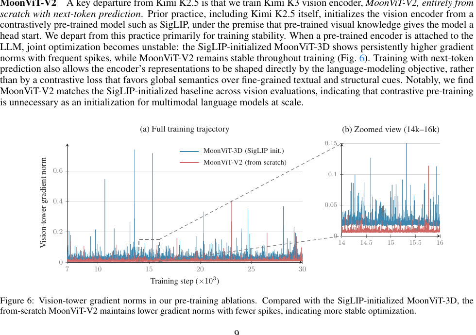
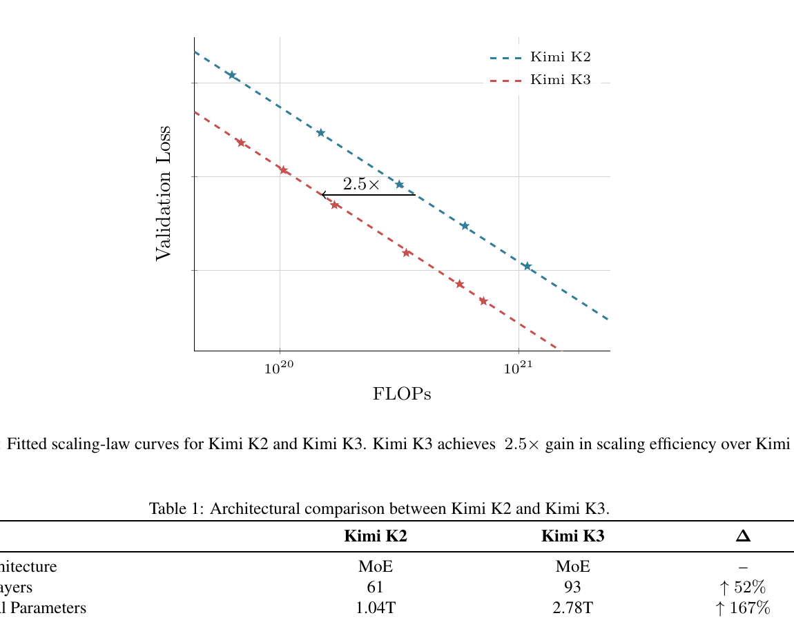

# Kimi K3 — Research Note
> [English](./README.md) | **繁體中文**

## 📇 Academic Context

| Field | Value |
|-|-|
| Title | Kimi K3 Technical Report |
| Venue | Moonshot AI vendor technical report (GitHub-hosted PDF, not peer-reviewed) |
| Year | 2026 |
| Authors | Kimi Team, Moonshot AI |
| Official Code | https://github.com/MoonshotAI/Kimi-K3 |
| Venue Kind | tech-report |

> 本筆記以官方釘選的 GitHub PDF 為唯一權威來源：`https://github.com/MoonshotAI/Kimi-K3/blob/main/k3_tech_report.pdf`，git blob sha 為 `6899a9ea0bb99868235e563fefbe08a5c0aa7bd2`（本地重算相符），內容為 47 頁的 `%PDF-1.5`。這是廠商自述的 technical report，不是同行評審論文，報告中的每個數字都應視為廠商聲稱值而非獨立驗證結果；本筆記的引用皆取自該 PDF 的 `pdftotext` 抽取文字，並與官方 repo 的 model card（`README.md`）交叉比對。原始 repo 僅四個受版控檔案——model card（`README.md`）、`LICENSE`、一張 logo（`assets/kimi-logo.png`）與本技術報告 PDF（`k3_tech_report.pdf`）——**不含**任何訓練或推論程式碼，權重釋出於 HuggingFace。

## Introduction

Kimi K3 想解決的問題很具體：開源社群在「測試期運算（test-time / RL）」這條軸上追得很快，但在「預訓練基座規模」這條軸上長期停在 1T-class（約一兆參數）附近，於是報告主張，當各家都在相近規模的基座上疊 RL 時，開源彼此會趨同、而與最強閉源系統的差距反而擴大。Kimi K3 的答案是「兩條軸一起推到前沿」：把基座放大到 3T-class，同時把 RL、reasoning effort 與長時序互動放大到 1M-token context。

它給出的高階解法是一個 native multimodal Mixture-of-Experts（MoE）模型：2.8 兆總參數、104B activated 參數、原生視覺、最長一百萬 token 的 context window。架構沿三個維度擴張資訊流——序列長度用 Kimi Delta Attention（KDA）與週期性 Gated MLA 混合、網路深度用 Attention Residuals（AttnRes）、模型寬度用 Stable LatentMoE（896 個 routed experts、每個 token 啟用 16 個）。後訓練則是 SFT → 三大領域各三種 reasoning effort 的 RL → 用 Multi-Teacher On-Policy Distillation（MOPD）把九個專家合併回單一模型。

報告如何衡量這套方案是否有效？評測沿四條能力軸展開：Reasoning & Knowledge、Coding、Agentic、Vision，對手包含閉源的 Claude Fable 5、GPT-5.6 Sol、Claude Opus 4.8、GPT-5.5，以及開源的 GLM-5.2；主結論是 Kimi K3 整體仍落後最強的 Claude Fable 5 與 GPT-5.6 Sol，但一致地贏過其餘所有受測模型。以下先重建機制，再逐項審視這些比較是否對稱。

## First Principles

### 架構總覽：沿三個維度擴張資訊流

Kimi K3 的核心設計語言是「把資訊流分別沿 token、depth、width 三個維度擴張」，而不是單一新演算法。序列維度用 Hybrid Attention（每個 block 三層 KDA 接一層 Gated MLA，3:1 比例）處理長距離 token mixing；深度維度用 AttnRes 讓每一層可以選擇性地讀取 embedding、當前 block 與先前 block 的表徵，突破傳統殘差把所有先前資訊壓進單一狀態的瓶頸；寬度維度則在每個 attention 層後接一個 Stable LatentMoE 做稀疏 channel mixing。視覺由 MoonViT-V2 編碼後經輕量 projector 投影進共享 embedding 空間。下圖是報告 Figure 2 的整體架構。

### KDA：帶通道遺忘閘的 delta-rule 線性注意力

KDA 把 delta-rule recurrence 加上一個 channel-wise forget gate。對隱藏狀態序列 $x_t \in \mathbb{R}^d$，單一注意力頭維護一個固定大小的 recurrent state $S_t \in \mathbb{R}^{d_k \times d_v}$，先做通道衰減再做 delta-rule 更新：

$$S_t = \left(I - \beta_t k_t k_t^\top\right)\mathrm{Diag}(\alpha_t)\, S_{t-1} + \beta_t k_t v_t^\top, \qquad \tilde{o}_t = S_t^\top q_t$$

其中 $\alpha_t \in (0,1)^{d_k}$ 是逐通道的單步保留因子、$\beta_t \in (0,1)$ 控制 delta-rule 的寫入強度。相對於 softmax attention 會隨序列長度成長的 KV cache，KDA 用一個固定大小的 state 換取「便宜的轉移與重用」——這正是後面 1M context 系統設計能成立的物理前提。週期性插入的 Gated MLA 層則提供不受限的全域 token 互動，並對所有 MLA 層採用 No Position Encoding（NoPE）：位置資訊完全由 KDA 的遞迴衰減隱式承載，因此延長 context 時不必調 RoPE 頻率基底或做 YaRN 內插。

### Lower-bounded decay：一個把對角 tile 送回 Tensor Core 的數值技巧

KDA 的 chunkwise 平行形式需要用 $1/\Gamma_{[t]}^{1\to C}$（累積衰減的倒數）重新縮放 key，而 $\Gamma$ 是一串 $(0,1)$ 因子的乘積，倒數會無界成長、在有限精度下發生上溢位（overflow）。Kimi K3 把 log-decay 的映射從 Kimi Linear 的無界 negative-Softplus 改成有下界的 scaled sigmoid：

$$g_t = g_{\min}\,\mathrm{Sigmoid}(e^{A} z_t) \in (g_{\min}, 0), \qquad \alpha_t = \exp(g_t)$$

固定 $g_{\min} = -5$，於是每個保留因子滿足 $\alpha_t > e^{-5} \approx 6.7\times 10^{-3}$，16-token tile 上的累積 log-decay 落在 $(-80, 0)$，倒數縮放因子小於 $e^{80}\approx 5.5\times 10^{34}$，仍在 BF16 動態範圍內。這個看似只是換 activation 的改動有明確的系統後果：對角 tile 不必再做逐位置對的顯式計算，可以和非對角 tile 一起用 Tensor Core 的稠密矩陣乘法，消掉 intra-chunk 的主要瓶頸。下圖把這個「換映射→換計算」的因果關係畫在一起。

### Attention Residuals：把「深度」也變成一種注意力

標準殘差把所有先前層的資訊壓進單一狀態 $h_l$，像 RNN 在時間上的瓶頸。AttnRes 把 Transformer 對序列做的事搬到深度：每一層用一個可學習的 pseudo-query $q_l = w_l$，對所有先前層的輸出（key/value）做 softmax-kernel 注意力，選擇性地取回表徵：

$$\alpha_{i\to l} = \frac{\phi(q_l, k_i)}{\sum_{j=0}^{l-1}\phi(q_l, k_j)}, \qquad h_l = \sum_{i=0}^{l-1}\alpha_{i\to l}\cdot v_i$$

其中 $\phi(q,k)=\exp\!\big(q^\top\mathrm{RMSNorm}(k)\big)$，RMSNorm 防止大幅度輸出的層主導權重。完整形式的記憶體開銷是 $O(Ld)$；為了降本，報告把 $L$ 層切成 $N$ 個 block、block 內求和、block 間才做全注意力，開銷降到 $O(Nd)$。Kimi K3 取 $N\approx 8$、每 block 12 層，加上 embedding 層共 9 個 block 表徵。

### Stable LatentMoE：在 sparsity 56 下把 MoE 撐住

一般 MoE 每個被選中的 expert 都收到完整 $d$ 維表徵，通訊與權重流量隨 routing 多重度成長。LatentMoE 把「模型寬度」與「routed-expert 寬度」分開：shared experts 走全寬路徑，routed experts 在壓縮的 latent 空間（寬度 $\ell$）運作。Kimi K3 因此能把 channel mixing 擴到 896 個 routed experts、每 token 啟用 16 個，對應 $896/16 = 56$ 的稀疏度。routed 路徑計算如下（$N_s=2$ 個固定的全寬 shared experts）：

$$u = \sum_{i\in T_k(x)} p_i\, E_i^{\mathrm{routed}}(W_\downarrow x), \qquad y = \sum_{j=1}^{N_s} E_j^{\mathrm{shared}}(x) + W_\uparrow\,\mathrm{RMSNorm}(u)$$

這種「四個近乎連續的矩陣乘法 + 2.8 兆參數規模」會放大兩個失效模式：routed branch 的內部激活爆炸，以及近 $10^3$ 個 expert 的負載平衡失控。Stable LatentMoE 用三招穩住：aggregate 後、up-projection 前插入 RMSNorm（Normalized LatentMoE）；用 SiTU-GLU 取代 SwiGLU 以壓住激活；以及 Quantile Balancing（QB）做無輔助損失的負載平衡。SiTU-GLU 對 Swish 閘的線性因子與 up 分支各自套一個平滑上限 $\beta\tanh(x/\beta)$，取 $\beta_1=4$、$\beta_2=25$，使輸出有界 $|f(x)|\le \beta_1\beta_2 = 100$，同時在原點附近仍近似 SwiGLU。QB 則把每個 expert 的 bias 設成「與其目標負載相符的 router-score 分位數」，用直方圖在一次前向就估出全域 batch 的分位數，把近千個 expert 的負載拉平。

### MoonViT-V2：從頭訓練的原生視覺塔

一個和 Kimi K2.5 的關鍵差異是：Kimi K3 的視覺編碼器 MoonViT-V2 完全從零開始、用 next-token prediction 訓練，而非像過去慣例從 SigLIP 這類對比預訓練模型初始化。報告給的主要理由是訓練穩定性——SigLIP 初始化的 MoonViT-3D 在聯合優化時梯度範數持續偏高且頻繁尖峰，而 from-scratch 的 MoonViT-V2 全程平穩，且視覺評測不輸 SigLIP 基線。MoonViT-V2 是 27 層、約 0.4B（401M）參數的 ViT，採 RMSNorm、移除所有 linear 與 attention 投影的 bias；投影前先做 $2\times 2$ 的 pixel-shuffle 下採樣把視覺 token 數減為四分之一，讓最高 $3584\times 3584$ 像素的輸入在 1M context 內仍可負擔。「訓練穩定性」這個理由在報告的消融曲線上看得很直接：

### 一個具體的前向走查：形狀、專家與視覺 token

用報告的真實數字走一遍：一張 $3584\times 3584$ 的影像、patch size 14，先切成 $256\times 256 = 65{,}536$ 個 patch，經 $2\times 2$ pixel-shuffle 後降為 $16{,}384$ 個視覺 token，這些 token 與文字 token 交錯進同一個 context（1M 上限下綽綽有餘）。進入主幹後，每個 token 在 Stable LatentMoE 層先被 $W_\downarrow$ 從 hidden 7168 投到 latent 3584（Table 1 的 0.5×），router 從 896 個 routed experts 選出 16 個（每個 expert 的 MoE hidden 為 3072），加權聚合後過 RMSNorm，再由 $W_\uparrow$ 投回 7168，並與 2 個全寬 shared expert 的輸出相加。整個主幹是 93 層、依 3:1 拆成 69 層 KDA + 24 層 Gated MLA，並在最末端額外放一層 Gated MLA 確保最後一層一定做全域注意力。這就是「2.8T 總參數、每 token 只活化 104B」如何成立：稀疏度 56 意味著 MoE 的絕大多數權重在單一 token 上是閒置的。

### 規模數字的意義與 2.5× scaling efficiency

下表整理報告 Table 1 中 Kimi K2 與 K3 的架構對照，這些結構變化正是「約 2.5× scaling efficiency」的來源：

| 項目 | Kimi K2 | Kimi K3 | Δ |
|-|-|-|-|
| #Layers | 61 | 93 | ↑ 52% |
| Total Parameters | 1.04T | 2.78T | ↑ 167% |
| Activated Parameters | 32.6B | 104.2B | ↑ 220% |
| Routed Experts | 384 | 896 | ↑ 133% |
| Experts Active per Token | 8 | 16 | ↑ 100% |
| Training Context Length | 128K | 1M | 8× |
| Attention Mechanism | MLA | Hybrid KDA–MLA | – |
| Activation Function | SwiGLU | SiTU-GLU | – |

要點是先把每個數字讀懂再談比較：total 2.78T 是全部 MoE 權重之和，activated 104.2B 是單一 token 實際走過的參數（約 3.75% 活化率），兩者差距正是 sparsity 56 的直接後果；1M 是「訓練」context 長度（K2 為 128K），靠 NoPE + KDA 遞迴外推而不需位置編碼改動。至於「2.5× scaling efficiency」的準確語意，報告用一條在留出 OOD 驗證資料上擬合的 scaling-law 曲線來定義：在相同 validation loss 下，K3 需要的訓練 FLOPs 約為 K2 的 1/2.5（下圖橫向箭頭）。要強調的是——這是廠商內部的擬合曲線、衡量的是「達到相同預訓練驗證損失的算力效率」，不是任何下游 benchmark，也未公開擬合細節與資料，屬於難以獨立重現的聲稱。

### 訓練與後訓練配方：可重現與不可重現的部分

預訓練是 native multimodal：語言與視覺 token 從第一步就交錯在單一 next-token prediction 目標下聯合優化，用 Per-Head Muon 優化器（把 Q/K/V 投影沿 head 維度切開各自做 Newton–Schulz 正交化，讓各 head 的更新尺度均衡），cosine 學習率排程配 1% linear warmup、weight decay 0.1。context 從 8k 起訓、後續延到 64k，cooldown 階段再從 256K 逐步升到 1M，把昂貴的長序列計算集中在總預算的一小段。後訓練走三階段：SFT 建冷啟策略（並自 SFT 起就做 MXFP4 權重 / MXFP8 激活的量化感知訓練 QAT）；RL 在 general / general agents / coding agents 三大領域、各配 low/high/max 三種 reasoning effort，交叉出九個 expert；最後用 MOPD 把九個 expert 蒸餾回單一 student，其 per-token 獎勵為 teacher 與 student 對數機率差的截斷值：

$$r^d_{\mathrm{opd}}(y_t\mid e,x,y_{<t}) = \mathrm{clip}\!\left(\mathrm{sg}\,\log\frac{\pi^{(d,e)}_{\mathrm{teacher}}(y_t\mid x,y_{<t})}{\pi_\theta(y_t\mid x,y_{<t})},\ -R_{\max},\ R_{\max}\right)$$

reasoning-effort 用 per-problem token budget 控制：給每題一個由冷啟模型估的初始預算 $b_0(x)$，超過 $\tau\cdot b_0(x)$ 的軌跡把 reward 覆寫為 $-1$，再沿 $\tau$ 由大到小退火得到 max/high/low 三檔。哪些可重現、哪些不行？演算法層級（KDA、AttnRes、SiTU-GLU、QB、MOPD 獎勵式、budget control）寫得夠清楚、有方程式可照做；但資料層級幾乎不可重現——語料的領域配比、rephrasing、知識圖譜引導的任務合成、以及九個 expert 的實際訓練資料都只有質性描述，沒有釋出，加上未釋出訓練程式碼，外部無法照著重跑出同一個模型。至於這套 RL 的規模化是否真的把能力推上去，報告用一組跨八項任務的曲線給出佐證：

### 系統基礎設施：讓 1M context 與 3T 參數在有限機器上跑得動

報告花了整整一章講基礎設施，因為 KDA、3T-class 稀疏 MoE、與 1M-token agentic RL 三個少見的挑戰同時出現在一個模型上。幾個代表性設計：KDA 的演算法-系統協同設計包含 FlashKDA（CUTLASS chunkwise kernel，重疊 intra-chunk 計算與跨 chunk 狀態傳遞）與 KDA Context Parallelism（KCP，把每段的效果拆成「作用在入境狀態的累積轉移」與「從零生成的本地狀態」兩個可本地計算量，用固定大小的 all-gather 同步遞迴狀態）；預訓練的 MoonEP 用「動態冗餘專家」達成完美負載平衡，並證明每 rank 至多 $E/R$ 個冗餘專家就必存在可行解，使計算 shape 靜態已知、通訊零拷貝；1M agentic RL 靠 external KV cache pool（把閒置 prefix 寫回 CPU DRAM）、auto-throttling 排程與可續存的 microVM sandbox 維持長軌跡狀態。sandbox 系統 AgentENV 的數字很具體：增量 checkpoint / resume 延遲低至 133 ms / 49 ms，暫停中的 sandbox 不吃資源（等模型推論可占 sandbox 生命週期 98%），記憶體 overcommit 達 6.5×，整個 K3 訓練與評測共建立了 51,219,741 個 sandbox、橫跨 1,505,678 個 image。這套長時序 rollout 基礎設施要支撐的，正是像下圖這種需要數十到上百步工具互動才做得完的黑箱任務。

### 上線推論與 KDA-aware prefix cache

上線服務的難點是 hybrid KDA–MLA 維護兩種性質完全不同的 cache（KDA 是每請求單一固定大小的遞迴狀態、MLA 是隨長度成長的 per-token KV），而一個 prefix 只有在兩者都能在同一邊界還原時才可重用。Kimi K3 把 KDA 狀態塞進和 MLA KV 相同的 paged block pool，並把 hash 粒度（細，512 token）與實體 block（粗，1024–6144 token）解耦：prefix hash 在 MLA 的細 hash block 上跑，KDA 只在稀疏的 hash 端點（通常對齊對話輪界）存 checkpoint。舉例：一個 6144-token 的實體 block 內含 12 個 512-token hash block，若某請求前 2800 token 命中快取，會停在 $B = 2560 = 5\times 512$——深在實體 block 內部——直接從 token 2560 續 prefill，完全不重算 $[0, 2560)$。fleet 層再用 cache-aware affinity（把 session 路由到持有其 prefix cache 的叢集，並用一致性雜湊指派備援叢集）與 budget-based admission control（給不同請求類別各自的資源預算，避免長 context 突發拖垮短請求的 TTFT）。

### 評測設計與主結果

所有 Kimi K3 評測用 reasoning effort max、temperature 1.0；對手設定為 Claude Fable 5（含 fallback）、GPT-5.6 Sol（含 potential cyberguards）、Claude Opus 4.8、GPT-5.5（xhigh）、GLM-5.2（max）。報告 Table 2 的主結論是 Kimi K3 整體緊追 Fable 5 與 GPT-5.6 Sol、並一致地贏過 Opus 4.8、GPT-5.5、GLM-5.2。分項看：GPQA Diamond 93.5%（與前沿持平），但 HLE-Full（43.5% / 56.0%，不含/含工具）與 CritPt 23.4% 明顯落後，顯示研究級推理仍是弱項；Coding 上 ProgramBench 拿到最佳 77.8%、SWE-Marathon（偏 GPU kernel）42.0% 領先 Fable 5 七分、Terminal-Bench 2.1 88.3% 幾乎追平 GPT-5.6 Sol 的 88.8%、FrontierSWE 81.2% 排第二（落後 Fable 5 的 86.6%）；Agentic 上 BrowseComp 91.2%、MCPMark-Verified 94.5% 等多項最佳，但 Elo 制的知識工作套件（GDPval-AA v2 第三、AA-Briefcase 第二）由 Fable 5 領先。第三方評測方面，Artificial Analysis 的 Intelligence Index v4.1 給 57.1（580 個模型中第 4），落後 Fable 5（59.9）與 GPT-5.6 Sol（58.9）；WebDev Arena 則以 1,678 Elo 排第一、是首個登頂該榜的開源模型。

## 🧪 Critical Assessment

### 問題是否真實且重要

「開源卡在 1T-class、與閉源差距擴大」這個問題是真實且可觀察的，把預訓練規模與 test-time 兩條軸一起推也是合理的研究方向；作為「首個開源 3T-class 模型」，即使是廠商自述，其工程完成度與權重釋出本身就有社群價值。但要注意報告把「規模」與「能力」隱性等同——2.5× scaling efficiency 衡量的是預訓練驗證損失的算力效率，並不直接等於下游能力提升，而下游主結論又靠一整套自選的評測條件支撐（見下），因此「問題重要」不代表「這些數字證明問題被解決」。

### baseline 與評測條件的對稱性

這是全篇最需要打折扣的地方，因為多處比較條件並不對稱。其一，對手是被「加料」的：Fable 5 的所有結果都「含 fallback」、GPT-5.6 Sol 的所有結果都「含 potential cyberguards」，報告未量化這些機制對分數的淨影響，讀者無法判斷差距有多少來自模型本身。其二，harness 不統一：coding 讓各模型跑 Kimi Code / Claude Code / Codex 之一，Table 3 內部評測更是 Kimi K3 用 Kimi Code、別家用 Claude Code/Codex——當 Kimi K3 在自家 harness 上表現最好，很難分辨是模型還是 harness 契合度的貢獻。其三，硬體與版本被重新校準：SWE-Marathon 用「H20-calibrated」的非正式分支、PostTrainBench 在 H20（非官方 H100）上跑，FrontierSWE 分數用特定日期的腳本重算，這些都讓數字不易與官方榜對齊。其四，同一 benchmark 存在雙數字（如 BrowseComp 表列 91.2%、但全 1M context 無 context management 時為 90.4%），挑對自己有利的呈現方式是常見手法。

### 新穎性 vs 工程重組

多數組件是「站在自家與他人肩上的精煉」而非全新發明：KDA 來自 Kimi Linear、AttnRes 是既有方法、MLA 來自 DeepSeek-V2、LatentMoE 與 auxiliary-loss-free routing 也都有前作。真正屬於本報告的新增點比較像是一組穩定化與系統化的工程改良——lower-bounded scaled-sigmoid decay（把對角 tile 送回 Tensor Core）、SiTU-GLU 的有界激活、Quantile Balancing 的分位數負載平衡、MoonEP 的 $E/R$ 冗餘專家上界證明、KDA-aware 雙粒度 prefix cache。這些改良單看都合理且有明確動機，但把它們包裝成「約 2.5× scaling efficiency」這種單一大數字時，各組件的個別貢獻並未被拆解出來（報告只給一條合併曲線與一張架構對照表），因此無法判斷哪些改動真正關鍵、哪些只是隨規模放大順帶的結果。

### 自訂 benchmark、cyber 聲稱與可重現性

報告大量倚賴自訂/內部評測：Table 3 的 KCB 2.0、ClawBench、MIRA、KAET、Kimi Webdev Bench 等皆為 in-house，且「頻繁刷新擴充以追蹤模型失效模式」——這等於承認評測與訓練迭代耦合，外部無法重現，內部最佳成績的說服力也因此下降。cyber 能力的呈現同樣需要小心：Tier 1 宣稱約 70% 人工複核為真、含 16 個未知漏洞，Tier 2 解出 36 題中的 14 題（38.9%）勝過 GLM-5.2 的 8 題，但這些是自建題庫、且刻意排除會拒答 cyber 任務的 Anthropic/OpenAI 前沿模型，使「勝過對手」的對照很薄弱；相較之下，報告自己引用的 UK AISI 與 NIST CAISI 獨立評估給出更冷靜的數字——在 41 題上達成任意程式碼執行為 0 題，這與廠商樂觀敘事形成有用的對照，也是全篇少數的外部制衡。可重現性上，這是「開放權重」但非「開放重現」：LICENSE 名義上把 inference/training code 納入 Software，但 repo 實際不含任何訓練或推論程式碼，資料配方、scaling-law 擬合、九個 expert 的訓練資料都未釋出；此外 Kimi K3 License 有兩項各自獨立的商用限制：Model as a Service 業者若連續 12 個月合計營收逾 2000 萬美元，須先與 Moonshot AI 另訂協議；而任何商用產品或服務只要月活躍使用者逾一億、或月營收逾 2000 萬美元，其使用者介面就須顯著標示「Kimi K3」。因此嚴格說是「附條件的開放權重」而非完全無限制。

### 是否真的解決問題、以及真實世界關聯

在「開源可用的前沿能力」這個務實定義下，報告的證據算相當有力：多個 coding/agentic 公開榜的最佳或次佳、WebDev Arena 首個登頂開源模型、以及成本效率（如 BrowseComp $2.03/task、約 GPT-5.6 Sol 一半）都指向實際可用性。但「達到前沿」的完整版主張並未成立——報告自己承認整體仍落後 Fable 5 與 GPT-5.6 Sol，研究級推理（CritPt、HLE）與硬化目標的 cyber exploit 是明確缺口。合理的解讀是：Kimi K3 把開源前沿往上推了一大截並在若干實用維度追平閉源，但「與最強閉源等量齊觀」尚未被本報告的證據支持，而支持性數字又高度依賴前述不對稱的評測條件，需要獨立、條件對齊的複測才能定論。這種「便宜但非最強」的取捨，在報告的 Pareto 成本圖上看得最清楚：

## 一分鐘版

- **規模擴展**：把模型基座用極高稀疏度推到近三兆參數與百萬 token 長度。例子：總參數 2.8 兆，但單一 token 前向只活化 104B（約 3.75%），並原生支援視覺與最長 1M 的 context。
- **架構機制**：資訊流沿序列長度、深度、寬度三個維度分別擴張。例子：主幹 93 層依 3:1 混合 69 層 KDA 與 24 層 Gated MLA 處理長序列，MoE 則從 896 個 routed experts 每 token 挑 16 個活化。
- **效能亮點**：在部分公開榜追平或超越最強閉源模型。例子：WebDev Arena 以 1,678 Elo 排第一，是首個登頂該榜的開源模型。
- **評測要打折**：勝出結論高度依賴被「加料」的對手設定，且與外部獨立評估有落差。例子：對手成績分別「含 fallback」或「含 potential cyberguards」，而 UK AISI 的獨立評估顯示 K3 在 41 題上達成任意程式碼執行為 0 題——樂觀敘事需要條件對齊的複測才能定論。

## 🔗 Related notes

- [Gemma4](../Gemma4/) — 另一份開放權重、原生多模態的廠商 technical report，可對照兩家在 KV cache 效率、MTP drafter、量化與「大總參數／小活化參數」評測口徑上的取捨。
- [ScalingTestTimeCompute](../ScalingTestTimeCompute/) — test-time scaling 的第二條軸，對應本報告 reasoning-effort RL 與 budget control 的動機背景。
