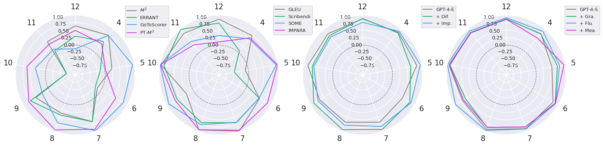
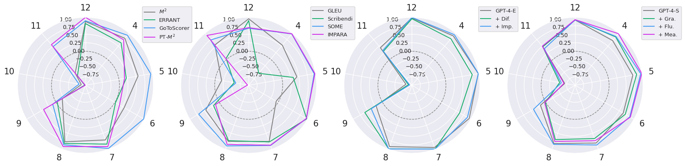

# Large Language Models Are State-of-the-Art Evaluator for Grammatical Error Correction — Research Note

## 📇 Academic Context

| Field | Value |
|-|-|
| Title | Large Language Models Are State-of-the-Art Evaluator for Grammatical Error Correction |
| Venue | Workshop on Innovative Use of NLP for Building Educational Applications (BEA), NAACL 2024 |
| Year | 2024 |
| Authors | Masamune Kobayashi, Masato Mita, Mamoru Komachi |
| Official Code | unknown |
| Venue Kind | paper |

> 本篇筆記依據 arXiv 預印本 `2403.17540v2`（2024-05-26 版）的 LaTeX 原始檔撰寫，正式版收錄於 BEA 2024（ACL Anthology `2024.bea-1.6`，頁 68–77）。camera-ready 版本細節可能與預印本略有差異。作者未附本論文專屬的程式碼倉庫；文中使用的 SEEDA 資料集來自另一篇論文 (Kobayashi et al., 2024, *Revisiting Meta-evaluation for GEC*)，故本表 Official Code 記為 `unknown`。

## First Principles

### 這篇論文到底在問什麼

這篇論文**不是**在做文法錯誤修正（Grammatical Error Correction, GEC），而是在做「**如何評分一個 GEC 系統**」這件事——也就是 **meta-evaluation（後設評估）**。

要理解為什麼這是個真問題，先看 GEC 評估的兩層結構：

1. **第一層（一般評估）**：給定學習者寫的原句 source、系統修正後的 hypothesis、以及人工黃金修正 reference，用某個 metric（如 M²、ERRANT、GLEU）對 hypothesis 打一個分數。
2. **第二層（後設評估）**：我們怎麼知道這個 metric 打的分數「準不準」？做法是把 metric 的排名，拿去跟**人類評審對同一批系統的排名**算相關係數。相關係數越高，代表這個 metric 越貼近人類判斷、越可信。

本論文的主張是：把 **GPT-4 當作第二層那個「打分數的 metric」**，它跟人類判斷的相關性，比所有既有的自動 metric 都高。標題的 “state-of-the-art evaluator” 指的就是這件事——GPT-4 是最好的**評估者**，而非最好的**修正者**。

### 兩種評估粒度與八個既有基線

論文把既有 metric 分成兩類，這個分類在後面理解 prompt 設計時很關鍵：

- **Edit-Based Metrics (EBMs)**：只看「所做的編輯」對不對。包含 M²、ERRANT、GoToScorer、PT-M²。例如 M² 用 Levenshtein 演算法從 hypothesis 抽出編輯，與黃金編輯求最大重疊後算 F-score。
- **Sentence-Based Metrics (SBMs)**：看整句改完的品質。包含 GLEU、Scribendi Score、SOME、IMPARA。例如 SOME 是拿人工評分微調 BERT，分別學 grammaticality、fluency、meaning preservation 三個面向。

對應地，論文讓 LLM 也分兩種模式評估，並用後綴標記：

- **-E（edit-based）**：prompt 裡把編輯明確標出來讓 LLM 評每個編輯。
- **-S（sentence-based）**：prompt 給整句讓 LLM 評句子品質。

三個受測 LLM：LLaMa 2（13B chat）、GPT-3.5（`gpt-3.5-turbo-1106`）、GPT-4（`gpt-4-1106-preview`）。並在 GPT-4 上額外做「加評估準則」的 prompt 變體：edit 端加 Difficulty / Impact；sentence 端加 Grammaticality / Fluency / Meaning Preservation。這些變體只是在 base prompt 第一段結尾加一句話，例如 Fluency 版加：「Please evaluate each target with a focus on the fluency of the sentence.」

### 後設評估怎麼計算：把 LLM 打的分變成排名再算相關

評估用 **SEEDA** 資料集：對 12 個神經 GEC 系統輸出 + 3 句人工修正，三位標註者在 edit-based 與 sentence-based 兩種粒度下，對成對修正 (A, B) 各給 5 分制評分，共產生 **5347 個成對判斷**（A>B、A=B、A<B）。再用 TrueSkill、Expected Wins 等評分演算法，把成對判斷轉成 1 到 15 名的人類系統排名。SEEDA 拆成 SEEDA-E（edit 粒度）與 SEEDA-S（sentence 粒度）兩個子集。

論文用兩種粒度做後設評估：

- **System-level（系統層級）**：把每個系統的 metric 分數（LLM 端則是用 LLM 的成對判斷跑 TrueSkill 得到系統分數）對上人類系統分數，算 **Pearson $r$** 與 **Spearman $\rho$**。
- **Sentence-level（句子層級）**：直接用 SEEDA 的成對判斷，算 **Accuracy** 與 **Kendall's $\tau$**。

Kendall's $\tau$ 是本論文的主指標，直觀定義為：

$$\tau = \frac{(\text{concordant pairs}) - (\text{discordant pairs})}{\text{total comparable pairs}}$$

其中一個「pair」是一次人類成對判斷；若 metric 對這一對的排序方向與人類一致就是 concordant，相反就是 discordant。$\tau \in [-1, 1]$，越接近 1 代表 metric 的細粒度判斷越貼合人類。論文特別強調句子層級，因為它樣本數大、且能拉開高效能 metric 之間的差距——這點在下面的批判性評估會回頭談。

論文額外做一個 “+ Fluent corr.” 設定：在 12 個系統之外，再加入兩句「流暢型修正」（fluency edits，追求整句通順而非最小編輯）。這個設定專門用來壓力測試 metric 在面對「非最小編輯、但更流暢」的修正時會不會失準。

### 主結果表判讀

下表節錄自論文 Table 1（`tab:meta`）。列出關鍵列，數值直接引自 LaTeX 原始檔。粗體為該欄最佳值。

| Metric | Sys SEEDA-E Base $r$ | Sys SEEDA-E Base $\rho$ | Sent SEEDA-E Base Acc | Sent SEEDA-E Base $\tau$ |
|-|-|-|-|-|
| M² (EBM) | 0.791 | 0.764 | 0.582 | 0.328 |
| ERRANT (EBM) | 0.697 | 0.671 | 0.573 | 0.310 |
| GLEU (SBM) | 0.911 | 0.897 | 0.695 | 0.404 |
| SOME (SBM) | 0.901 | 0.951 | 0.747 | 0.512 |
| IMPARA (SBM) | 0.889 | 0.944 | 0.742 | 0.502 |
| GPT-3.5-S | 0.878 | 0.916 | 0.633 | 0.265 |
| GPT-4-S | 0.960 | 0.958 | 0.798 | 0.595 |
| GPT-4-S + Fluency | **0.974** | 0.979 | **0.831** | **0.662** |
| GPT-4-E + Impact | 0.905 | **0.986** | 0.730 | 0.460 |

幾個關鍵觀察：

1. **句子層級 $\tau$ 才能拉開差距**：系統層級 $r$ 大家都擠在 0.9 上下（GPT-4-S 0.960 vs SOME 0.901，差距很小）；但到了句子層級 $\tau$，GPT-4-S + Fluency 的 0.662 遠勝 SOME 的 0.512、GLEU 的 0.404。這正是摘要標榜的 0.662。
2. **Fluency 這個字很關鍵**：GPT-4-S base 的句子層級 $\tau$ 是 0.595，只把 prompt 尾句從評 grammaticality 改成評 fluency，$\tau$ 就跳到 0.662。改一個詞造成的落差，暗示 prompt engineering 對評估效能影響顯著。
3. **規模越小越糟**：GPT-3.5-S 的 $\tau$ 只有 0.265，比傳統的 GLEU（0.404）還低；LLaMa 2-S 的 $\tau$ 更是掉到 0.042，幾乎與人類無相關。

### 一個具體的走查：GPT-4-S + Fluency 如何得到 0.662

以論文 Appendix A 的真實 prompt 範例走一遍前向流程，看數字怎麼串起來：

**輸入**：一段英語學習者作文的三句 context，中間句為待評的原句。針對它給出 5 個候選修正 target（節錄自論文）：

```
# targets
1. In conclude , socia media benefits people in several ways but in the same time harms people .
2. In conclusion , social media benefits people in several ways but at the same time harms people .
3. In conclusion , social media benefits people in several ways but , at the same time , harms people .
4. In conclude , social media benefits people in several ways but at the same time harms people .
5. In conclusion , socia media benefits people in several ways but , at the same time , harms people .
```

prompt 指示 LLM：「assign a score from a minimum of 1 point to a maximum of 5 points to each target based on the quality of the sentence」，並補上 fluency 那句，輸出為 JSON 格式的分數。target 1 保留了 `socia`、`in conclude`、`in the same time` 三個錯誤，應得低分；target 3 全部改對且斷句自然，應得高分。

**從逐句分數到系統排名**：把 GPT-4-S + Fluency 對所有成對修正的判斷（A>B/A=B/A<B）餵進 TrueSkill，得到系統層級排名（論文 Table 5 對應子表，數值引自原始檔）：

| # | Score | System |
|-|-|-|
| 1 | 0.721 | GPT-3.5 |
| 2 | 0.648 | REF-F |
| 3 | 0.230 | TransGEC |
| … | … | … |
| 5 | -0.308 | BART |
| 6 | -1.002 | INPUT |

關鍵在最上面兩名：GPT-3.5 與 REF-F 都是**流暢型修正**（fluency edits）。GPT-4-S + Fluency 把它們排到第 1、2 名，這正是人類排名的樣子；相對地 GPT-3.5-S 與 LLaMa 2-S 無法把這兩個流暢修正排高（附錄 B 指出小模型傾向給很多系統相近分數、無法區辨）。

**從系統排名到相關係數**：把上面這組 LLM 排名對上人類排名，在句子層級用成對判斷算 Kendall's $\tau$，得到 SEEDA-E Base 的 **0.662**——即摘要的頭條數字。整條鏈是：*prompt（含 fluency 指示）→ LLM 對每對修正打分 → TrueSkill 聚合成系統排名 → 與人類排名算 $\tau$*。

### Window analysis：只比相近水準的系統

論文擔心「系統層級相關性大家都 >0.9」是因為任務太簡單（混了強弱懸殊的系統，隨便排都對）。於是做 window analysis：在人類排名中只取**連續四個名次**的系統子集，算它們的 Pearson $r$，並讓視窗從第 4 名滑到第 12 名。x=4 就是只用第 1–4 名系統算出的 $r$。





在 SEEDA-E 上，GPT-4-S + Fluency 幾乎在所有視窗都維持高相關，凸顯 fluency 的重要性；傳統 metric 則常掉到無相關甚至負相關，顯示它們在「比較水準相近的現代系統」時魯棒性差。在 SEEDA-S 上整體相關雖高，但 x=10 附近明顯下滑，暗示有些系統對所有 metric 都難評。

## 🧪 Critical Assessment

### 問題是否真實：後設評估的「解析度」危機

這篇的問題設定是扎實的，且承接了一個真實痛點：既有 GEC metric 在高效能系統之間**分不出高下**。作者引用 Kobayashi et al. (2024) 指出傳統 metric 缺乏 resolution，而本文的系統層級數據自己也印證了這點——GPT-4 系列多數系統層級相關性都 >0.9，作者誠實地把這解讀為「十幾個系統的後設評估已達飽和」，並警告這會**低估**未來的高效能 metric。這種「連我自己的方法都把任務做飽和了」的自我否定，比單純報 SOTA 更有價值，也讓句子層級 $\tau$ 的強調顯得合理而非事後包裝。

### 基線、資料與指標的充分性

基線相當完整：四個 EBM + 四個 SBM，涵蓋 F-score 系、n-gram 系、以及 BERT 微調系（SOME/IMPARA），是這個子領域該有的對照組。指標同時報 Pearson/Spearman（系統層級）與 Accuracy/Kendall（句子層級），沒有只挑對自己有利的。

但有三個明顯的侷限值得畫問號：

1. **只有一個資料集、一種語言**：全部結論建立在 SEEDA（英語、W&I+LOCNESS 域）之上。「GPT-4 是 SOTA evaluator」這個普遍性斷言，在跨語言、跨領域（如母語者寫作、正式文書）上完全未經檢驗——這是本文最大的外部效度缺口。
2. **系統數量小到會讓相關係數不穩**：系統層級只有 12（或 +2）個系統。在 n=12 上算 Pearson $r$，單一離群系統就可能大幅擺動數值。“+ Fluent corr.” 設定下傳統 metric 的 $r$ 甚至翻成負值（如 M² 從 0.791 掉到 -0.239），這種劇烈翻轉本身就說明 n 太小、結論脆弱。
3. **LLM 版本不可複現**：`gpt-4-1106-preview` 是會被下架/更新的封閉快照，作者自己在 Limitations 也承認跨版本結果可能不一致。所謂 “state-of-the-art” 綁在一個無法長期複現的 API 版本上，科學意義上是打折的。

### fluency 增益：是發現，還是對自家指標的迎合

最需要審視的是「加 fluency 就變 SOTA」這條主線。$\tau$ 從 0.595（base）到 0.662（+Fluency）確實是實打實的增益，且 window analysis 有佐證。但有一個循環論證的隱憂：**SEEDA 的人類標註本身可能就偏好流暢型修正**（論文附錄 B 也說人類把 REF-F、GPT-3.5 這類流暢修正排得高）。若人類黃金標準本就重 fluency，那麼「叫 GPT-4 也重 fluency 就更貼近人類」幾乎是套套邏輯——你把評估者的偏好調到跟裁判一樣，當然相關性上升。這比較像是**對準了這個特定標註集的偏好**，而非發現了 GEC 評估的普遍真理。作者把它詮釋成「人類在比較高品質修正時也優先看流暢度」，這個因果解讀是有可能的，但論文沒有做能區辨兩種解釋的實驗（例如在一個刻意壓低 fluency 權重的標註集上重測）。

### 新穎性：方法簡單，貢獻在於嚴謹的比較

就方法而言，本文新穎性有限——沒有新模型、新演算法，核心就是「把 GPT-4 套上不同 prompt 拿去當 evaluator，然後量相關係數」。真正的貢獻不在 how，而在 what：它是（作者宣稱的）第一個用數十個系統、對 LLM 評估者做**全面**後設評估的工作，過去 Sottana et al. (2023) 只用少數系統。這種「把既有工具嚴謹地量清楚」的貢獻是正當的，但讀者應把它定位成一篇扎實的**實證與診斷**論文，而非方法創新。特別是「加準則的 prompt 更好」這個結論，本質上是既有 prompt-engineering 觀察在 GEC 上的再確認。

### 真的解決了嗎，以及現實相關性

從「能不能提供一個比傳統 metric 更貼近人類的自動評估者」來看，在 SEEDA 上答案是肯定的。但論文自己揭露的兩個裂縫讓「問題已解決」的說法要打折：其一，系統層級已飽和，代表這個評估任務的**難度需要被重新設計**（作者的解方是轉向句子層級與 window analysis，但這也還在同一個資料集內）；其二，落地成本高——用 GPT-4 當日常評估器對每次比較都要付費、且不可複現，作者在 Limitations 明確承認這侷限了適用性，並補做 LLaMa 2 當「可複現替代」，然而 LLaMa 2 的 $\tau$ 只有 0.042，實務上根本不能用。換句話說：能用的（GPT-4）不可複現，可複現的（LLaMa 2）不能用。這個張力尚未被解決，是後續工作真正該補的洞。

## 🔗 Related notes

<!-- 尚無可安全解析的相關筆記。 -->
