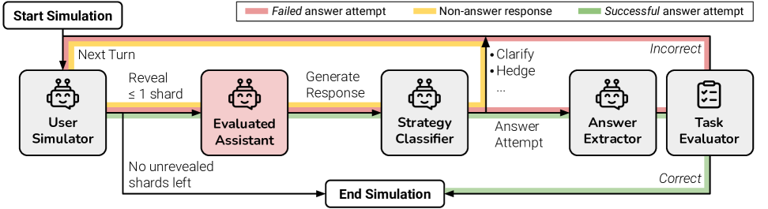
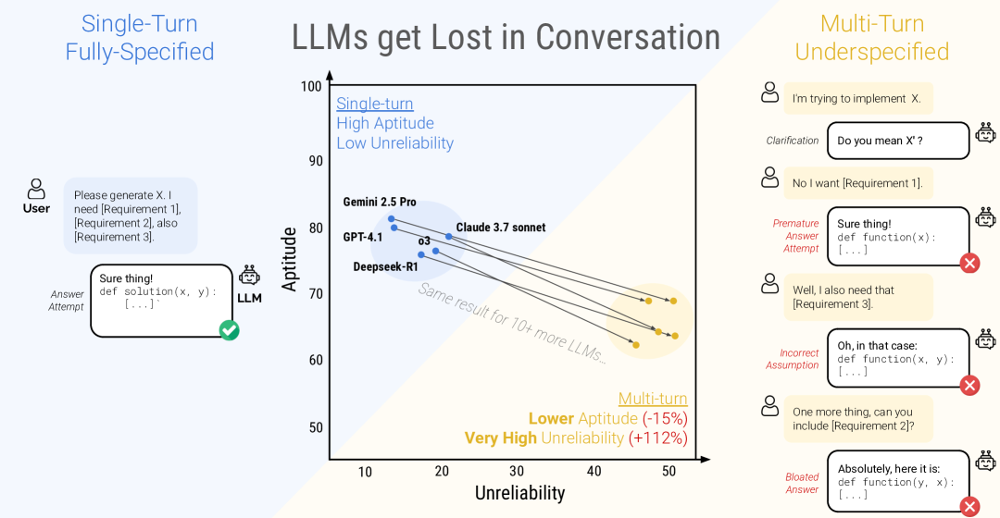
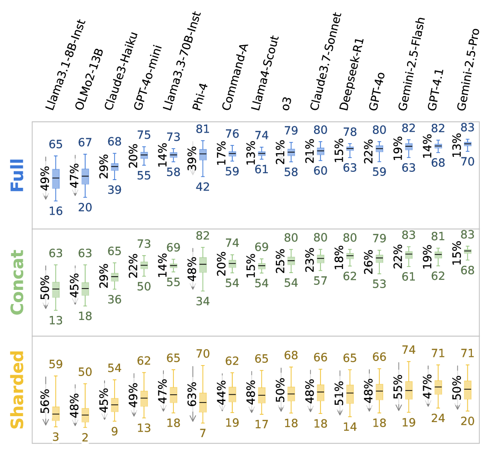
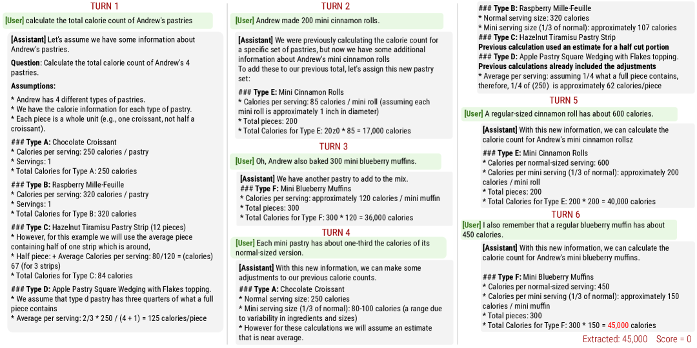

# LLMs Get Lost In Multi-Turn Conversation — Research Note
> **English** | [繁體中文](./README.zh-TW.md)

## 📇 Academic Context

| Field | Value |
|-|-|
| Title | LLMs Get Lost In Multi-Turn Conversation |
| Venue | ICLR 2026 (Outstanding Paper Award) |
| Year | 2026 |
| Authors | Philippe Laban, Hiroaki Hayashi, Yingbo Zhou, Jennifer Neville (Microsoft Research / Salesforce Research) |
| Official Code | https://github.com/microsoft/lost_in_conversation |
| Venue Kind | paper |

> This note is written from the arXiv full text `2505.06120` (camera-ready details may differ slightly); all numbers are traced back to the paper's LaTeX source and figures.

## First Principles

The question this paper asks is simple: LLMs are routinely used as "chat interfaces," yet almost all evaluations run under a **single-turn, fully-specified** setting. Real users, however, often cannot state their needs clearly at the outset and gradually fill in the requirements over multiple turns of conversation. The paper designs a large-scale simulation environment that feeds the same batch of tasks to models in both single-turn and multi-turn forms, directly measuring the gap between the two. The core finding: across 15 tested models, performance degrades by an average of 39% in multi-turn, underspecified conversations — and that degradation is almost never "getting dumber," but rather "becoming extremely unstable."

### From fully-specified to sharded: cutting one instruction into multiple turns

The paper's key technique is **sharding**: taking one instruction that would normally be delivered all at once and splitting it into a set of smaller shards, each carrying a single piece of information, which together are exactly equal to the original instruction. When simulating a multi-turn conversation, at most one shard may be revealed per turn, so information surfaces gradually as the conversation unfolds. Take a GSM8K problem: the original instruction is "Jay can build 20 snowballs in an hour, but 2 melt every 15 minutes. How long will it take before he has 60 snowballs?"; the sharded version is split into five pieces — Shard 1 only asks "how long before he is ready for a snowball fight" (the high-level intent), and Shards 2–5 later add "a snowball fight with his sister," "makes 20 per hour," "goal of 60," and "2 melt every 15 minutes" respectively.

A valid sharded instruction must satisfy five properties: P1 information preservation (the split must not lose any information needed to complete the task), P2 first shard is the high-level intent (the first shard is always the intent), P3 order independence (all shards except the first can be arranged in any order), P4 maximal decomposition (split into as many, as small shards as possible), and P5 minimal rephrasing (aside from what is needed to satisfy the first four properties, keep the wording as close to the original as possible). Production uses a semi-automatic pipeline: GPT-4o first performs three automatic steps — segmentation, rephrasing, and verification — followed by manual inspection and editing by the authors, taking about 1–3 minutes of human effort per problem.

### The simulation environment: three-party roles and five conversation types

Simulating a conversation involves three parties: the **assistant** being evaluated (the tested LLM), the **user** who holds the complete sharded instruction and is responsible for revealing it turn by turn (simulated by an LLM), and the **system** responsible for classification and scoring. As shown above, the User Simulator reveals at most one shard per turn, and the tested Assistant's (marked with a red box) response is first sorted by the Strategy Classifier into one of seven strategies (clarification, refusal, hedging, interrogation, discussion, missing, answer attempt); only responses judged as an answer attempt have their answer extracted by the Answer Extractor and sent to the Task Evaluator for scoring. A simulation ends when either of the following holds: (1) the Task Evaluator judges some answer attempt correct, or (2) at the start of a new turn the user simulator has no shard left to reveal — in other words, a correct answer ends the conversation early, while a wrong one keeps revealing until all shards are exhausted. There is a circularity in the design that must be faced squarely: the user simulator is itself an LLM, specifically the low-cost GPT-4o-mini, which can read the entire sharded instruction and the current conversation state to decide which shard to reveal next and rephrase it into a natural tone; the strategy classifier and answer extractor are likewise GPT-4o-mini. In other words, the measurement of degradation is in fact built on top of a set of LLM components.

The paper itself runs a batch of manual checks to bound this (the main text says 200 simulated conversations were checked, but the corresponding table caption says 100 — this number is internally inconsistent): simulation errors caused by the user, classifier, and extractor occur in fewer than 5% of conversations, and errors that are genuinely "unfavorable to the assistant" occur in fewer than 2%. The system never tells the assistant that it is in an underspecified multi-turn test, nor gives any conversation-strategy hints, in order to measure the model's **default behavior**. Based on the same shards, the paper defines five conversation types: the single-turn **Full** (the complete original instruction given in the first turn, i.e. the baseline) and **Concat** (all shards merged into one bullet list and given at once, to rule out the confound of "the rephrasing itself causing information loss"); and the multi-turn **Sharded** (the main setting), **Recap** (Sharded plus one extra final turn restating all shards), and **Snowball** (each turn cumulatively restating all prior shards).

### Metrics: averaged performance, aptitude, and unreliability

Because an LLM at T=1.0 produces different responses to the same state, the paper runs N=10 simulations per problem to obtain a score set $S=\{S_i\}$, then defines three metrics: averaged performance $\overline{P}$, aptitude $A^{90}$ taken at the 90th percentile, and unreliability $U_{10}^{90}$ taken as the difference between the 90th and 10th percentiles:

$$
\overline{P} = \frac{1}{N}\sum_{i=1}^{N} S_i, \qquad
A^{90} = \mathrm{percentile}_{90}(S), \qquad
U_{10}^{90} = \mathrm{percentile}_{90}(S) - \mathrm{percentile}_{10}(S)
$$

Intuitively, $A^{90}$ is "how high it can reach when performing well" (best-case, corresponding to the upper edge of the box-plot), and $U_{10}^{90}$ is "how far apart the best and worst are" (the height of the box); reliability is defined as $R_{10}^{90}=100-U_{10}^{90}$. The figure above, top to bottom, uses three stacked panels to make the meaning of this decomposition concrete, each demonstrating one way of dropping from Full (blue) to Sharded (yellow): pure aptitude loss (the upper whisker $A^{90}$ moving from 95 down to 65, $U$ staying at 25), pure reliability loss ($A^{90}$ staying at 95, the box stretching from $U=25$ up to 65), or a mix of both ($A^{90}$ 95→80, $U$ 25→40) — which is exactly what the main results to come are meant to answer. Decomposing $\overline{P}$ into aptitude and unreliability is precisely to answer the question "is the degradation the model getting dumber, or becoming inconsistent — good one moment, bad the next."

### Main result: every model, every task degrades

The main experiment covers six generation tasks (Code, Database, Actions, Math, Data-to-text, Summary), 600 instructions in total, 15 LLMs, with N=10 per combination, for over 200,000 simulations in total, estimated to cost about $5,000. The result is remarkably consistent: **every single model, on every single task, degrades from Full to Sharded, by an average of -39%**. At the same time, Concat performs at an average of 95.1% of Full, proving that the degradation is not information loss caused by the sharding rephrasing, but a problem of "multi-turn + underspecified" itself. Viewed as overall Full ~90% versus Sharded ~65%, that is a 25-percentage-point gap.

| Model | Code: Full → Sharded | Overall Sharded/Full |
|-|-|-|
| Gemini 2.5-Pro | 97.4 → 68.1 | 64.5% |
| GPT-4.1 | 96.6 → 72.6 | 61.8% |
| Claude 3.7-Sonnet | 78.0 → 65.6 | 65.9% |
| Llama-3.1-8B | 27.4 → 21.7 | 62.5% |

Notably, **stronger models do not get lost any less**: Claude 3.7 Sonnet, Gemini 2.5, and GPT-4.1 land at 30–40% overall degradation, the same order of magnitude as small models like Llama-3.1-8B and Phi-4. The two reasoning models (o3, Deepseek-R1) are not spared either, degrading by margins comparable to the non-reasoning models — extra test-time compute by itself does not teach a model to manage multi-turn conversation, and if anything, because their responses are longer (on average 33% longer than non-reasoning models), they are more prone to stuffing assumptions into the conversation.

### Aptitude barely drops; it's reliability that collapses

Breaking the degradation apart makes the story clear: from Full to Sharded, aptitude drops by only 16% on average (not significant), but unreliability spikes by an average of 112% (more than doubling). In the single-turn setting, stronger models are usually more stable (GPT-4.1 and Gemini 2.5 Pro have the lowest unreliability); but in the multi-turn setting, all models — strong or weak — become extremely unstable, with an average gap of 50 percentage points between the best and worst simulations of the same problem. This is the phenomenon the paper names **lost in conversation**: when a model takes a wrong step early in the conversation, it gets lost and cannot recover. The paper's additional gradual sharding experiment (splitting the same problem into 2 to 8 pieces) further shows that a model gets lost as soon as the conversation spans two or more turns, and the granularity of the split is not actually the main cause — for the user, saying everything at once (1-shard) is the only effective way to improve reliability.

### Why models get lost: four behaviors

The paper distills four root causes from the simulation logs. First, **answering fully too early**: attempting a complete answer in the early stage when information is most lacking plants wrong assumptions into the conversation. Binning the Code and Math tasks, first answering within the first 20% of the conversation yields an average score of only 30.9, less than half of waiting until the last 20% to answer (64.4). Second, **answer bloat**: the model over-reuses its prior (often wrong) answer, revising it longer and longer; even for Code solutions that end up correct, the Sharded setting averages 27% more characters than Full. Third, **loss-in-middle-turns**: observing the citation distribution in the Summary task, the model tends to cite documents introduced in the first and last turns while neglecting the middle turns, effectively transplanting the long-context "lost in the middle" phenomenon into multi-turn conversation. Fourth, **overly verbose responses**: binning conversations by response length, in five of six tasks shorter responses perform better, as long responses often carry more assumptions that skew the subsequent conversation.

### A concrete failure trajectory (Math task)

Walking through a 6-shard Math conversation from the paper's appendix is the most intuitive; the tested model is Llama-3.1-8B and the correct answer is 85,000 calories. In Turn 1 the user only tosses out the high-level question (compute the total calories of several of Andrew's pastries), yet the model immediately assumes "there are 4 kinds of pastry" and invents nonexistent items and calories such as Chocolate Croissant and Raspberry Mille-Feuille — this is exactly "answering early + fabricating assumptions." Over the next few turns the user reveals the real items piece by piece (Turn 2's mini cinnamon rolls, Turn 3's blueberry muffins, etc.), but the model does not retract its earlier wrong assumptions, instead piling onto the existing answer and getting messier (answer bloat). In the end the model forgets that the original question asked for the **total**, returning only the subtotal for the Mini Blueberry Muffin item, which is extracted as 45,000 and judged Score = 0. Had the same problem been given all at once in the Full setting, the model would mostly have gotten it right; the only difference is that the information was split across multiple turns.

### Remediations are almost all ineffective

The paper tests two common classes of remediation. The first is agent-style restatement: Recap (restate everything at the end) and Snowball (cumulatively restate every turn). Both help GPT-4o and GPT-4o-mini somewhat, but neither recovers to the Full level. For GPT-4o-mini, Full/Sharded/Recap/Snowball are 86.8 / 50.4 / 66.5 / 61.8 respectively; for GPT-4o they are 93.0 / 59.1 / 76.6 / 65.3 — Recap recovers more (+16.1, +17.5), but its intervention occurs at "the final turn," and in a real conversation there is no way to know which turn is the last, so it is impractical. The more realistic Snowball only lifts Sharded by +11.4 and +6.2 absolute percentage points (still far below Full), and the paper estimates it can recover about 15–20% of the Full→Sharded degradation. The second class is lowering the temperature: dropping the assistant temperature to 0 substantially improves reliability in the single-turn setting, but is almost useless in the Sharded setting — even with both user and assistant temperatures set to 0, unreliability stays at about 30%, because a one-token difference early on gets amplified layer upon layer across turns. The conclusion: **in multi-turn interaction, lowering the generation temperature does not help improve system reliability**.

## 🧪 Critical Assessment

### The problem itself is real enough, but "the information is guaranteed to be complete in the end" blunts the impact

Underspecification is indeed common in real conversation, and the prior work the paper cites also notes that users state all their requirements at once only about 34% of the time, so the problem is well and importantly chosen. But the simulation environment has a key idealizing assumption: the conversation is **guaranteed** to reveal all shards by the last turn, and the task is guaranteed solvable. Real users often give up halfway, have self-contradictory requirements, or never manage to fill in the information. The paper itself acknowledges that the observed degradation is therefore "very likely an underestimate," which is honest; but conversely, this also means the 39% figure is measured in a sandbox relatively friendly to the model, and while extrapolating it to real products is directionally reasonable, its magnitude cannot be known directly from this paper.

### Is the degradation the model's problem, or an artifact manufactured by the simulator itself

The thing most worth being wary of is the circularity: the user, classifier, and extractor are all GPT-4o-mini. If the simulator reveals a shard ambiguously, or misjudges an actually-correct response as a wrong answer attempt, the degradation could come partly from the simulator rather than the tested model. The paper responds to this concern with 200 manual checks, claiming an error rate below 5% and errors unfavorable to the assistant below 2%, which is a responsible approach. But this audit itself has two limitations worth noting: it only covers the four tasks that can be automatically judged right or wrong — Code, Database, Math, Actions — leaving out the two continuously-scored refinement tasks (Data-to-text, Summary); and using GPT-4o-mini as the user inherently produces decompositions that "seem natural to GPT-4o-mini," and whether that is friendlier to same-family OpenAI assistants or harsher to others is not broken out and examined by the paper.

### The aptitude/unreliability decomposition is not just mean/variance in new words

Some will object that aptitude ($A^{90}$) and unreliability ($U_{10}^{90}$) are just a repackaging of mean and variance. This criticism does not fully hold: both take percentiles (P90, P90−P10) rather than moments, and their behavior on long-tailed and bimodal distributions is not equivalent to mean/variance; the paper's appendix also uses concrete examples with binary scores to demonstrate that "the same $\overline{P}=60$ can come from pure aptitude loss, pure reliability loss, or a mix of both." The real value lies in this decomposition yielding a testable and counterintuitive conclusion — the degradation comes mainly from reliability rather than aptitude, and strong models are not immune. That said, "aptitude only drops 16%" uses the optimistic endpoint P90, which naturally suppresses the apparent aptitude loss and inflates the reliability loss, so this decomposition is better treated as a qualitative framework than as a precise ratio comparable across papers.

### The baselines and ablations are solid, but the remediation experiments are narrow in coverage

The Concat baseline is cleverly designed, cleanly separating "information loss caused by rephrasing" from "multi-turn underspecification," and gradual sharding effectively rules out the competing hypothesis that "the degradation is just from splitting too finely" — these are methodological highlights of the paper. Unfortunately, the remediation and temperature experiments are done on only two models, GPT-4o and GPT-4o-mini, and four tasks, a far smaller sample than the main experiment's 15 models × 6 tasks; so whether conclusions like "Snowball only recovers 15–20%" and "lowering temperature is ineffective" hold on other model families is actually extrapolation rather than direct evidence. The counterexample of the Translation task not degrading, however, convincingly delimits the scope of applicability: when a task can be decomposed sentence by sentence (episodic), the model does not get lost — which also serves as a reminder that metrics like BLEU may fail to catch document-level fine-grained degradation.

### Does this count as solving the problem, and what it means for the real world

The paper's positioning is **diagnosis** rather than **cure**: it precisely measures and characterizes the problem, but offers no method that actually fixes it, and every remediation it measures fails, leaving only stopgaps for users like "start a new conversation and restate it" and "have the model consolidate first, then retry." This is honest but also marks the boundary of the paper. From a real-world angle, its most valuable contribution is actually a reminder about evaluation culture: outsourcing multi-turn capability to agent frameworks (single-turn assembly) overestimates models, because Concat-style assembly cannot recover the Sharded degradation; a model scoring high on single-turn benchmarks does not mean the user gets the same quality in a real multi-turn conversation. That gap is more worth remembering than the specific 39% figure.

## One-minute version

- **The getting-lost phenomenon**: real users often cannot state their needs clearly at the outset, and a model that takes a single wrong step early in the conversation gets lost and cannot recover. For example, computing calories, the model invents nonexistent pastries in the very first turn, so the same problem it can solve single-turn scores zero once split into multiple turns.
- **Core finding**: in multi-turn conversation, the model does not simply get dumber — its performance becomes extremely unstable. Going from single-turn to multi-turn, aptitude drops only 16% on average, but unreliability spikes by 112%.
- **Experimental mechanism**: the paper shatters the complete instruction (sharding), revealing only one piece of information per turn in the conversation. If all pieces are merged into a list and fed to the model at once (Concat), performance still reaches 95.1% of single-turn, proving the degradation comes from the "multi-turn" setting itself, not from information loss caused by the decomposition.
- **Biggest limitation**: the simulation environment is an idealized sandbox — the conversation is guaranteed to give all conditions in the end, and the simulated user asking the questions is itself GPT-4o-mini, which inherently produces the decompositions it finds natural; both of these bias the measured degradation toward the optimistic side.
- **Practical advice**: lowering the generation temperature or having the model restate history cannot recover the collapse — even at temperature zero, about 30% unreliability remains; for the user, saying everything at once is the only effective way to improve reliability.

## 🔗 Related notes

- [GSM-Symbolic](../GSM-Symbolic/) — likewise uses "rephrasing / perturbing an existing benchmark" to expose the fragility of LLM reasoning
- [Illusion-of-Thinking](../Illusion-of-Thinking/) — the capability boundary of reasoning models as complexity rises, complementing this paper's "extra test-time compute cannot save multi-turn"
- [Agent-as-a-Judge](../Agent-as-a-Judge/) — the methodology of using an LLM as an evaluation component, corresponding to this paper's circularity risk of using an LLM to simulate the user / judge scores
- [TemperatureCreativity](../TemperatureCreativity/) — the role of temperature as a randomness parameter, contrasting with this paper's finding that "lowering temperature is ineffective in multi-turn"
