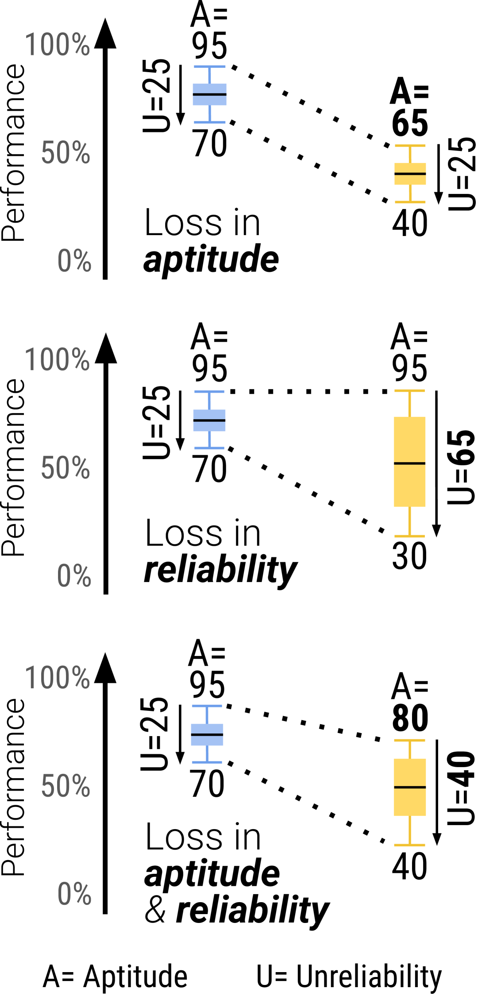

# LLMs Get Lost In Multi-Turn Conversation — Research Note
> [English](./README.md) | **繁體中文**

## 📇 Academic Context

| Field | Value |
|-|-|
| Title | LLMs Get Lost In Multi-Turn Conversation |
| Venue | ICLR 2026 (Outstanding Paper Award) |
| Year | 2026 |
| Authors | Philippe Laban, Hiroaki Hayashi, Yingbo Zhou, Jennifer Neville (Microsoft Research / Salesforce Research) |
| Official Code | https://github.com/microsoft/lost_in_conversation |
| Venue Kind | paper |

> 本筆記依據 arXiv 全文 `2505.06120` 撰寫（camera-ready 版本細節可能略有差異）；所有數字均回溯自論文 LaTeX 原始碼與圖表。

## First Principles

這篇論文問的問題很單純：LLM 平常被當成「聊天介面」在用，但評測幾乎都在**單輪、資訊完整**（single-turn, fully-specified）的設定下進行。真實使用者卻常常在一開始講不清楚需求，靠著多輪對話慢慢把條件補齊。論文設計了一個大規模模擬環境，把同一批任務分別用單輪與多輪兩種方式餵給模型，直接量出兩者的落差。核心發現是：15 個受測模型在多輪、underspecified 的對話中平均退化 39%，而且這個退化幾乎不是「變笨」，而是「變得極度不穩定」。

### 從 fully-specified 到 sharded：把一條指令切成多輪

論文的關鍵手法是 **sharding**：把一條原本一次講完的完整指令，拆成一組較小的 shard，每個 shard 只帶入一項資訊，合起來剛好等於原指令。模擬多輪對話時，規定每一輪最多只揭露一個 shard，讓資訊隨著對話逐步浮現。以 GSM8K 的一題為例，原指令是「Jay can build 20 snowballs in an hour, but 2 melt every 15 minutes. How long will it take before he has 60 snowballs?」；sharded 版本則拆成五片：Shard 1 只問「多久才準備好打雪仗」（高層次意圖），Shard 2–5 才分別補上「和妹妹打雪仗」「一小時做 20 顆」「目標 60 顆」「每 15 分鐘融化 2 顆」。

一個合法的 sharded 指令必須滿足五個性質：P1 資訊保存（拆解不能遺失任何完成任務所需資訊）、P2 首片即為高層次意圖（第一個 shard 一定是 intent）、P3 順序無關（除第一片外可任意排列）、P4 最大化切分（盡量拆成最多、最小的 shard）、P5 最小改寫（除為滿足前四項外，用字盡量貼近原句）。實際製作採半自動流程：先由 GPT-4o 做 segmentation、rephrasing、verification 三個自動步驟，再由作者人工檢查與編修，每題約需 1–3 分鐘人工。

### 模擬環境：三方角色與五種對話型態

模擬一場對話牽涉三方：被評測的 **assistant**（受測 LLM）、掌握完整 sharded 指令並負責逐輪揭露的 **user**（由 LLM 模擬），以及負責分類與評分的 **system**。如上圖，User Simulator 每一輪最多揭露一個 shard，受測 Assistant（紅框標記）的回應先經 Strategy Classifier 歸入七種策略之一（clarification、refusal、hedging、interrogation、discussion、missing、answer attempt），只有被判為 answer attempt 才由 Answer Extractor 抽出答案送 Task Evaluator 評分。一場模擬在滿足以下任一條件時結束：(1) Task Evaluator 判定某次 answer attempt 正確，或 (2) 新一輪開始時 user simulator 已無 shard 可揭露——換言之答對會提前收場，答不對則一路揭露到所有 shard 用盡。這裡有個必須正視的循環性設計：user simulator 本身也是一個 LLM，具體是低成本的 GPT-4o-mini，它讀得到整份 sharded 指令與當前對話狀態，決定下一輪揭露哪一片、並改寫成自然的口吻；strategy classifier 與 answer extractor 同樣是 GPT-4o-mini。換句話說，退化的量測其實建立在一組 LLM 元件之上。

論文自己對這點做了一批人工檢查來設界（正文寫檢查了 200 場模擬對話，但對應表格的 caption 卻寫 100 場，這處數字前後不一致）：user、classifier、extractor 造成的模擬錯誤發生在少於 5% 的對話中，而真正「對 assistant 不利」的錯誤更少於 2%。系統不會告訴 assistant 它正處在一個 underspecified 的多輪測試裡，也不給任何對話策略提示，目的是量測模型的**預設行為**。基於同一批 shard，論文定義了五種對話型態：單輪的 **Full**（第一輪就給完整原指令，即 baseline）與 **Concat**（把所有 shard 併成一則 bullet 清單一次給，用來排除「改寫本身造成資訊流失」的干擾）；以及多輪的 **Sharded**（主設定）、**Recap**（Sharded 結尾多加一輪把所有 shard 重述一遍）與 **Snowball**（每一輪都把先前所有 shard 累積重述）。

### 衡量指標：averaged performance、aptitude 與 unreliability

因為 LLM 在 T=1.0 下對同一狀態會生出不同回應，論文對每題跑 N=10 次模擬，得到分數集合 $S=\{S_i\}$，再定義三個指標：平均表現 $\overline{P}$、能力（aptitude）$A^{90}$ 取第 90 百分位、不可靠度（unreliability）$U_{10}^{90}$ 取第 90 與第 10 百分位之差：

$$
\overline{P} = \frac{1}{N}\sum_{i=1}^{N} S_i, \qquad
A^{90} = \operatorname{percentile}_{90}(S), \qquad
U_{10}^{90} = \operatorname{percentile}_{90}(S) - \operatorname{percentile}_{10}(S)
$$

直覺上，$A^{90}$ 是「發揮得好時能到多高」（best-case，對應 box-plot 上緣），$U_{10}^{90}$ 則是「最好與最差之間差多少」（box 的高度）；reliability 定義為 $R_{10}^{90}=100-U_{10}^{90}$。上圖由上而下三個堆疊面板點出這個拆解的意義，每個面板都示範一種從 Full（藍）掉到 Sharded（黃）的方式：純能力下降（上鬚 $A^{90}$ 從 95 下移到 65、$U$ 維持 25）、純可靠度下降（$A^{90}$ 維持 95、箱體從 $U=25$ 拉高到 65），或兩者混合（$A^{90}$ 95→80、$U$ 25→40）——這正是後面主結果要回答的問題。把 $\overline{P}$ 拆成 aptitude 與 unreliability，正是為了回答「退化到底是模型變笨、還是變得時好時壞」這個問題。

### 主結果：每個模型、每個任務都退化

主實驗涵蓋六個生成任務（Code、Database、Actions、Math、Data-to-text、Summary）、共 600 條指令、15 個 LLM、每組合跑 N=10，總計超過 200,000 場模擬，估計花費約 5,000 美元。結果非常一致：**每一個模型在每一個任務上，Sharded 對比 Full 都退化，平均退化 -39%**。同時 Concat 的表現平均是 Full 的 95.1%，證明退化不是 sharding 改寫造成的資訊流失，而是「多輪 + underspecified」本身的問題。用整體 Full 約 90% 對比 Sharded 約 65% 來看，是 25 個百分點的落差。

| Model | Code：Full → Sharded | 整體 Sharded/Full |
|-|-|-|
| Gemini 2.5-Pro | 97.4 → 68.1 | 64.5% |
| GPT-4.1 | 96.6 → 72.6 | 61.8% |
| Claude 3.7-Sonnet | 78.0 → 65.6 | 65.9% |
| Llama-3.1-8B | 27.4 → 21.7 | 62.5% |

值得注意的是，**更強的模型並沒有比較不會迷路**：Claude 3.7 Sonnet、Gemini 2.5、GPT-4.1 的整體退化落在 30–40%，和 Llama-3.1-8B、Phi-4 等小模型同一量級。兩個 reasoning 模型（o3、Deepseek-R1）也沒有倖免，退化幅度與非 reasoning 模型相仿——額外的 test-time compute 本身並不能讓模型學會經營多輪對話，反而因為回應更長（平均比非 reasoning 模型長 33%）而更容易在對話裡塞進假設。

### aptitude 幾乎沒掉，是 reliability 崩了

把退化拆開來看，故事就清楚了：從 Full 到 Sharded，aptitude 平均只掉 16%（不顯著），但 unreliability 平均暴增 112%（超過翻倍）。在單輪設定裡，能力越強的模型通常越穩定（GPT-4.1、Gemini 2.5 Pro 的 unreliability 最低）；但到了多輪設定，所有模型無論強弱都變得極不穩定，同一題最好與最差的模擬之間平均相差 50 個百分點。這就是論文命名的 **lost in conversation** 現象：當模型在對話早期走錯一步，它會迷路而且回不來。論文另做的 gradual sharding 實驗（把同一題切成 2 到 8 片）進一步指出，只要對話發生在兩輪或以上就會迷路，切分的粒度反而不是主因——對使用者而言，一次把話講完（1-shard）是唯一有效提升可靠度的方法。

### 模型為什麼會迷路：四個行為

論文從模擬 log 歸納出四個根因。第一，**過早給出完整答案**：在資訊最不足的前段就嘗試完整作答，會把錯誤假設植入對話。以 Code 與 Math 兩個任務分箱來看，在對話前 20% 就首次作答的平均分只有 30.9，不到拖到最後 20% 才作答（64.4）的一半。第二，**答案膨脹（answer bloat）**：模型過度沿用先前（往往是錯的）答案，越改越長；即使是最後做對的 Code 解答，Sharded 設定平均也比 Full 長 27% 的字元數。第三，**loss-in-middle-turns**：以 Summary 任務的引用分佈觀察，模型偏向引用第一輪與最後一輪帶入的文件，冷落中間輪次，等於把長文本的「lost in the middle」現象搬到了多輪對話。第四，**回應過於冗長**：把對話依回應長度分箱，六個任務中有五個是回應越短、表現越好，長回應往往夾帶更多假設而拉偏後續對話。

### 一條具體的失敗軌跡（Math 任務）

拿論文附錄一個 6-shard 的 Math 對話走一遍最直觀，受測模型是 Llama-3.1-8B，正確答案是 85,000 卡路里。Turn 1 使用者只丟出高層次問題（算 Andrew 幾種糕點的總熱量），模型卻立刻假設「有 4 種糕點」並自行編出 Chocolate Croissant、Raspberry Mille-Feuille 等不存在的品項與熱量——這正是「過早作答 + 亂補假設」。接下來幾輪使用者才逐片揭露真正的品項（Turn 2 的 mini cinnamon rolls、Turn 3 的 blueberry muffins 等），但模型並未撤回先前的錯誤假設，反而在既有答案上疊加、越算越亂（answer bloat）。到最後模型忘了原始問題要的是**總和**，只回傳了 Mini Blueberry Muffin 這一項的小計、被抽出為 45,000，判為 Score = 0。同一題若在 Full 設定下一次給完，模型多半能算對；差別只在資訊被拆散到多輪。

### 補救措施幾乎都無效

論文測了兩類常見補救。第一類是 agent 式的重述：Recap（結尾重述全部）與 Snowball（每輪累積重述）。兩者對 GPT-4o、GPT-4o-mini 都有些幫助，但都補不回 Full 的水準。以 GPT-4o-mini 為例，Full/Sharded/Recap/Snowball 分別是 86.8 / 50.4 / 66.5 / 61.8；GPT-4o 則是 93.0 / 59.1 / 76.6 / 65.3——Recap 拉回的幅度較大（+16.1、+17.5），但它的介入發生在「最後一輪」，真實對話中根本不知道哪輪是最後一輪，因此不切實際。較貼近現實的 Snowball 只把 Sharded 拉高 +11.4、+6.2 個絕對百分點（仍遠低於 Full），論文估計約能把 Full→Sharded 的退化補回 15–20%。第二類是調低溫度：把 assistant 溫度降到 0 在單輪能大幅改善可靠度，但在 Sharded 設定幾乎無效——即使 user 與 assistant 溫度都設為 0，unreliability 仍停在約 30%，因為早期一個 token 的差異就會在多輪裡層層放大。結論是：**在多輪互動裡，調低生成溫度無助於提升系統可靠度**。

## 🧪 Critical Assessment

### 問題本身夠真實，但「最後一定湊齊資訊」削弱了衝擊力

underspecification 在真實對話裡確實普遍，論文引用的先前研究也指出使用者只有約 34% 的時候會一次講清全部需求，所以問題選得很好、也很重要。但模擬環境有一個關鍵的理想化假設：對話**保證**在最後一輪把所有 shard 揭露完、任務保證可解。真實使用者常常講到一半就放棄、需求本身自相矛盾、或永遠補不齊資訊。論文自己也承認因此觀察到的退化「很可能是低估」，這點誠實；但反過來說，這也代表 39% 這個數字是在一個對模型相對友善的沙盒裡量到的，其外推到真實產品的方向雖然合理，量級卻無法從本文直接得知。

### 退化到底是模型的問題，還是模擬器自己製造的假象

最需要警惕的是循環性：user、classifier、extractor 全是 GPT-4o-mini。如果模擬器把一片 shard 揭露得含糊、或把一個其實正確的回應誤判成錯的 answer attempt，退化就可能部分來自模擬器而非受測模型。論文用 200 場人工檢查回應了這個疑慮，宣稱錯誤率低於 5%、對 assistant 不利的錯誤低於 2%，這是負責任的做法。但這份稽核本身有兩個侷限值得留意：它只涵蓋 Code、Database、Math、Actions 四個可自動判對錯的任務，兩個連續評分的 refinement 任務（Data-to-text、Summary）不在其中；而且用 GPT-4o-mini 當 user，天生就會產出「像 GPT-4o-mini 覺得自然」的拆解方式，對同門的 OpenAI assistant 是否更友善、對其他家是否更刁難，論文並未拆開來檢驗。

### aptitude/unreliability 的拆解不只是換句話說的 mean/variance

有人會質疑 aptitude（$A^{90}$）與 unreliability（$U_{10}^{90}$）只是把平均數與變異數重新包裝。這個批評不完全成立：兩者取的是百分位（P90、P90−P10）而非動差，對長尾與雙峰分佈的行為和 mean/variance 並不等價，論文附錄也用 binary 分數的具體例子演示了「同樣 $\overline{P}=60$，可以來自純能力下降、純可靠度下降、或兩者混合」。真正的價值在於這個拆解導出一個可檢驗且反直覺的結論——退化主要來自可靠度而非能力，且強模型並不因此免疫。不過「aptitude 只掉 16%」用的是 P90 這種樂觀端點，天然會壓低能力損失、放大可靠度損失，所以這個拆解比較適合當成質性框架，而非可跨論文比較的精確配比。

### baseline 與消融夠紮實，但補救實驗的覆蓋面偏窄

Concat 這個 baseline 設計得很聰明，乾淨地把「改寫造成的資訊流失」從「多輪 underspecification」中分離出來，gradual sharding 也有效排除了「退化只是切太細造成」的競爭假說，這些都是本文方法論上的亮點。可惜補救與溫度實驗只在 GPT-4o 與 GPT-4o-mini 兩個模型、四個任務上做，樣本遠小於主實驗的 15 模型 × 6 任務；因此「Snowball 只能補回 15–20%」「降溫無效」這類結論在其他模型家族上是否成立，其實是外推而非直接證據。Translation 任務不退化的反例則很有說服力地界定了適用範圍：當任務可被逐句分解（episodic）時，模型就不會迷路——這也順帶提醒 BLEU 這類指標可能抓不到 document-level 的細緻退化。

### 這算解決問題嗎，以及對真實世界的意義

本文的定位是**診斷**而非**解方**：它精準地量出並刻畫了問題，但沒有提出能真正修復的方法，測到的補救全都失敗，最後只能給使用者「開新對話重講一次」「先請模型彙整再重試」這類權宜之計。這誠實但也劃出了本文的邊界。從真實世界角度看，它最有價值的貢獻其實是對評測文化的提醒：把多輪能力外包給 agent 框架（單輪拼裝）會高估模型，因為 Concat 型的拼裝救不回 Sharded 的退化；模型在單輪 benchmark 上刷高分，不代表使用者在真實多輪對話中拿得到同樣品質。這個落差，比 39% 這個具體數字更值得記住。

## 一分鐘版

- **迷路現象**：真實使用者常在一開始講不清需求，而模型只要在對話早期走錯一步，就會迷路而且回不來。例如算熱量時模型在第一輪就自行編出不存在的糕點，導致同一題單輪能算對、拆成多輪卻得零分。
- **核心發現**：在多輪對話中，模型並非單純變笨，而是表現變得極度不穩定——從單輪改為多輪，能力（aptitude）平均只掉 16%，但不可靠度（unreliability）卻暴增 112%。
- **實驗機制**：論文把完整指令拆碎（sharding），對話中每輪只揭露一項資訊。若把所有碎片一次併成清單餵給模型（Concat），表現仍達單輪的 95.1%，證明退化來自「多輪」設定本身，而非拆解造成的資訊流失。
- **最大限制**：模擬環境是理想化沙盒——對話保證最後一定給齊所有條件，且擔任發問的模擬使用者本身就是 GPT-4o-mini，天生會產出它自己覺得自然的拆解方式，這兩點都讓實測退化偏向樂觀。
- **實務建議**：調低生成溫度或讓模型重述歷史都救不回崩壞——即使溫度降到零仍留約 30% 不可靠度；對使用者而言，一次把話講完才是唯一有效提升可靠度的方法。

## 🔗 Related notes

- [GSM-Symbolic](../GSM-Symbolic/) — 同樣用「改寫／擾動既有 benchmark」來揭露 LLM 推理的脆弱性
- [Illusion-of-Thinking](../Illusion-of-Thinking/) — reasoning 模型在複雜度提高時的能力邊界，與本文「額外 test-time compute 救不了多輪」互補
- [Agent-as-a-Judge](../Agent-as-a-Judge/) — 以 LLM 作為評測元件的方法論，對應本文用 LLM 模擬 user／判分的循環性風險
- [TemperatureCreativity](../TemperatureCreativity/) — 溫度作為隨機性參數的角色，對照本文「降溫在多輪無效」的發現
