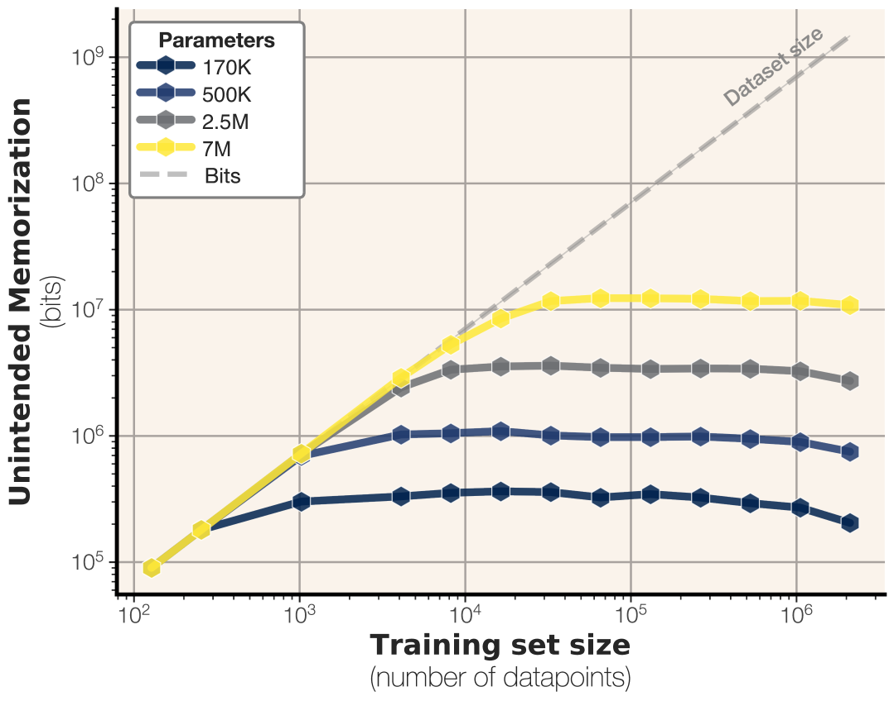
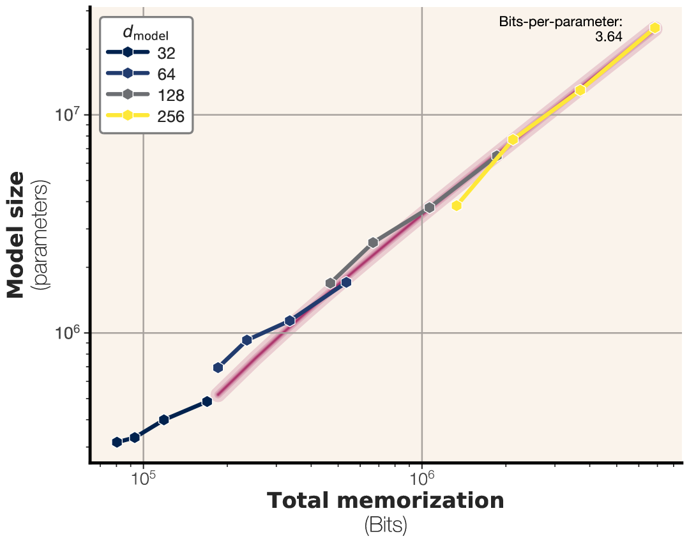
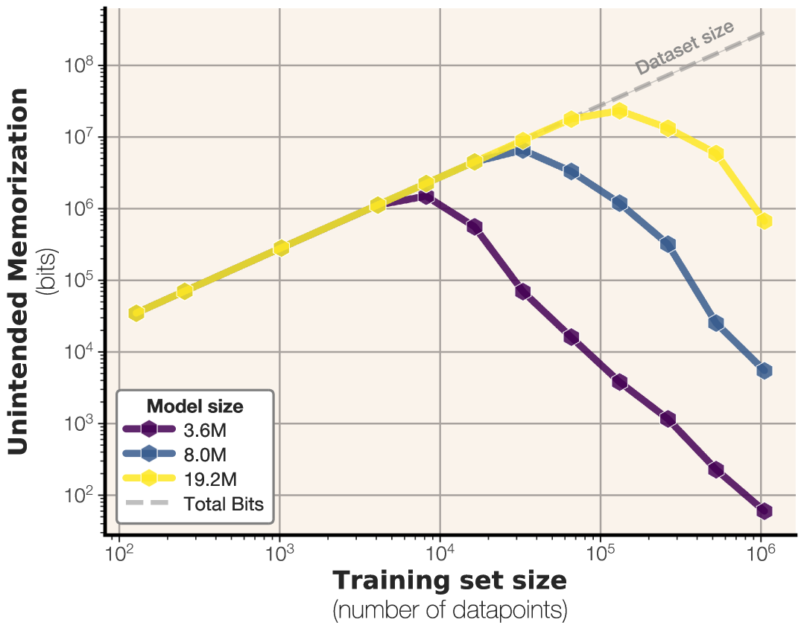
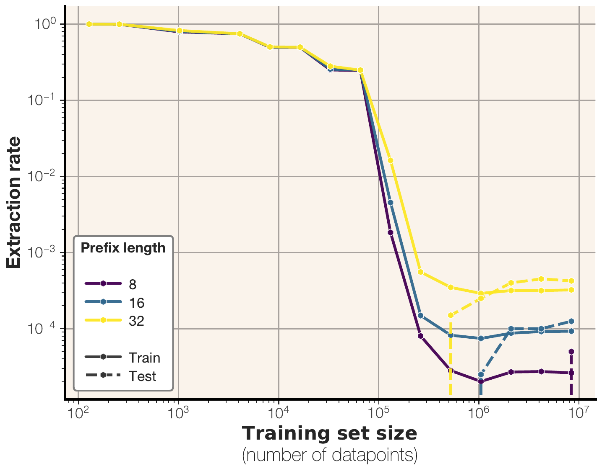
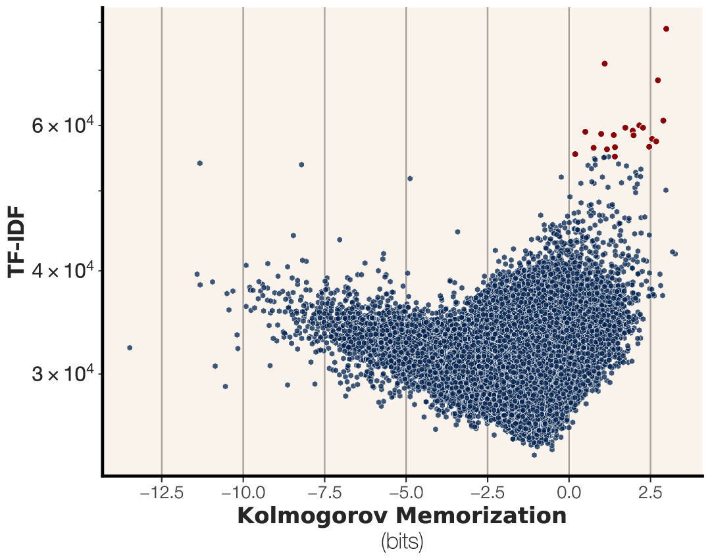
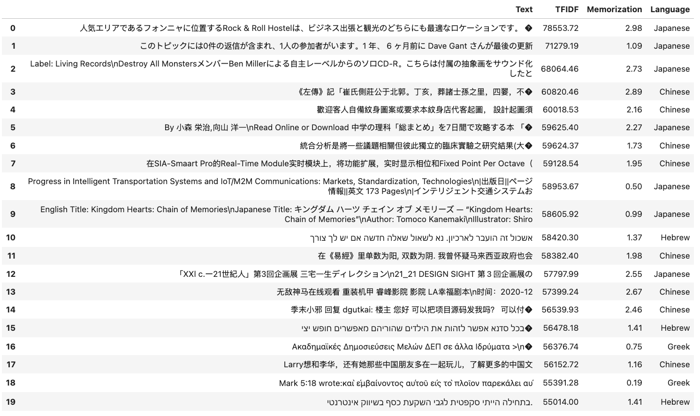
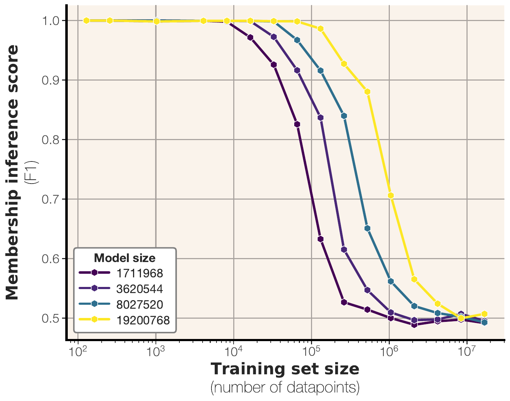
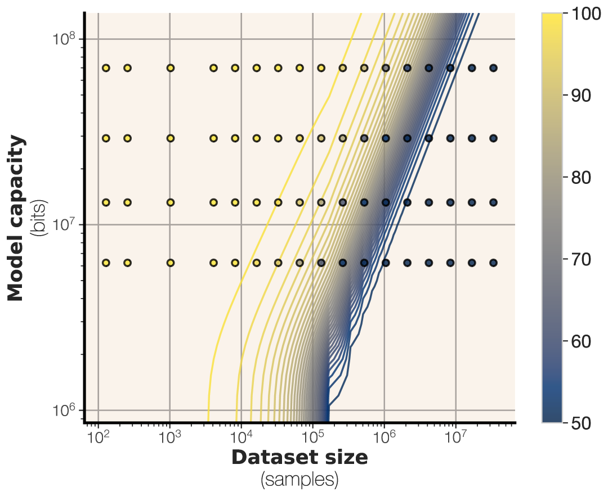

# How much do language models memorize? — Research Note
> [English](./README.md) | **繁體中文**

## 📇 Academic Context

| Field | Value |
|-|-|
| Title | How much do language models memorize? |
| Venue | arXiv preprint (2505.24832v3, cs.CL) |
| Year | 2025 |
| Authors | John X. Morris, Chawin Sitawarin, Chuan Guo, Narine Kokhlikyan, G. Edward Suh, Alexander M. Rush, Kamalika Chaudhuri, Saeed Mahloujifar |
| Official Code | unknown |
| Venue Kind | paper |

> 本筆記依據 arXiv 預印本 `2505.24832v3`（cs.CL）撰寫；此版本為預印本，正式發表版（若有）數字可能不同。作者隸屬 FAIR at Meta、Google DeepMind、Cornell University 與 NVIDIA。

## Introduction

過去幾年語言模型的訓練資料量暴增，但參數量卻停在數十億這個量級：論文舉的例子是一個 8B 參數模型（磁碟上約 32 GB）卻用 15 兆（trillion）token 訓練（磁碟上約 7 TB）。當資料量遠大於權重能裝下的資訊量時，「模型到底把訓練資料記住了多少」就成了隱私與版權上的核心問題。既有作法主要走兩條路：extraction（能否從權重把訓練樣本吐回來）與 membership inference（判斷某樣本是否在訓練集中），但兩者都無法乾淨地把「記憶」與「泛化」分開——模型被引導吐出某字串，可能只是因為它學會了規律，而不是背下了那筆資料。

這篇論文提出一個以壓縮（bits）為基礎的 memorization 定義，並用它來量測現代語言模型的容量（capacity）。核心作法是把總記憶量拆成兩塊：unintended memorization（模型對某個特定資料集所含的資訊）與 generalization（模型對真實資料生成過程所學到的知識，論文把它等同於 intended memorization）。把 generalization 扣掉後剩下的就是 unintended memorization；由於它具有 super-additivity，逐樣本的 unintended memorization 加總只給出「資料集層級 unintended memorization」的**下界**估計，而不是資料集的總記憶量（total memorization，後者還含 generalization 那一份）。當資料夠大、模型記到飽和時，這個下界會逼近一個高原，其高度就是模型容量的估計值。

衡量方式分三步走。第一步用均勻隨機取樣的 bitstring 當訓練資料：因為每個 token 都獨立均勻，沒有任何可泛化的規律，unintended memorization 幾乎等於總記憶量，於是能把容量單獨量出來——這給出了 **GPT 家族約 3.6 bits-per-parameter** 的容量估計。第二步換成真實文字（FineWeb），觀察模型如何在記憶與泛化之間切換，並把這個切換點連到 double descent。第三步用容量與資料量推出 membership inference 的 scaling law，並在 500K 到 1.5B 參數的模型上驗證。實驗共訓練了數百個 GPT-2 架構的 Transformer，量測指標包括逐樣本記憶量（bits）、loss-based membership inference 的 F1、以及貪婪解碼的 extraction rate。

## First Principles

### 為什麼 extraction 不足以定義記憶

論文的出發點是：模型能生成某字串，並不等於它記住了那字串。已有工作證明語言模型幾乎能被誘導輸出任意字串，所以「輸出了」本身不是記憶的證據。就算把提示長度限制住或要求提示對齊前綴，也仍分不清模型是靠記憶還是靠泛化——一個被要求把兩個數字相加的模型，可以在沒看過那條算式的情況下算出答案。論文用一個具體樣本點出核心難題：訓練樣本 `Q: What is 2^100? A: 1267650600228229401496703205376`，幾乎所有 extraction 式定義都會把它判為高度記憶，但會做次方運算本來就是語言模型該有的能力，這部分不該算成對該筆資料的記憶。

### 統計視角：把記憶寫成互資訊

先用 Shannon 資訊論搭骨架。把資料分佈記為隨機變數 $X$、訓練演算法 $L$ 把樣本映到訓練後模型 $\hat{\Theta}$。模型對 $X$ 所含的總資訊，就是兩者的互資訊：

$$\text{mem}(X, \hat{\Theta}) = I(X, \hat{\Theta}) = H(X) - H(X \mid \hat{\Theta})$$

這個量把所有資訊都算進去，包含泛化。為了只留下「非預期」的部分，論文先用真實模型的先驗 $\Theta$ 把可泛化的資訊固定住，定義 unintended memorization 為：

$$\text{mem}_U(X, \hat{\Theta}, \Theta) = I([X \mid \Theta], \hat{\Theta}) = H(X \mid \Theta) - H(X \mid (\Theta,\hat{\Theta}))$$

generalization（intended memorization）則是總記憶量減去 unintended 的部分，$\text{mem}_I = \text{mem}(X,\hat{\Theta}) - \text{mem}_U(X,\hat{\Theta},\Theta)$。這個切分繼承自 Brown 等人用 conditional mutual information 定義記憶的想法，但論文的關鍵差異是要在**單一實例層級**上做到這件事。

一個支撐後續量測的性質是 unintended memorization 的 super-additivity：對 $n$ 筆 i.i.d. 樣本，逐樣本記憶量之和是資料集記憶量的下界，而模型本身的資訊熵是它的上界。

$$\sum_{i\in[n]} \text{mem}_U(X_i, \hat{\Theta}, \Theta)\leq \text{mem}_U(X, \hat{\Theta}, \Theta) \leq H(\hat{\Theta})$$

這條式子有兩個實務意涵：要估資料集層級記憶量的下界，可以直接把逐樣本記憶量加總；而 unintended memorization 會隨資料量增加，但絕不會超過模型容量 $H(\hat{\Theta})$——這正是後面「高原」現象的理論根據。

### 換成 Kolmogorov 複雜度：處理「只有一個樣本」的困境

上面的定義全都建立在隨機變數的熵上，但實際情境裡我們只有一個訓練好的模型 $\hat{\theta}$、一個資料集 $x$、一個參考模型 $\theta$，全是單一實例（singleton），無法對單一樣本估熵。論文因此改用以壓縮為基礎的 Kolmogorov 複雜度：字串 $x$ 的資訊量 $H^K(x)$ 定義為在某計算模型下能產生 $x$ 的最短程式長度。

$$H^K(x) = \min_{f(p)=x} |p|$$

相對版本 $H^K(x \mid \theta)$ 是「手上有 $\theta$ 當參考時」描述 $x$ 的最短長度。於是 unintended memorization 的 Kolmogorov 版本寫成：

$$\text{mem}^K_U(x,\theta,\hat{\theta}) = H^K(x\mid \theta) - H^K(x\mid (\theta, \hat{\theta}))$$

直覺是：有了通用參考模型 $\theta$ 之後，$x$ 還需要多少額外 bits 才能被描述；如果加進 $\hat{\theta}$ 能把這個長度再壓短，短掉的 bits 就是 $\hat{\theta}$ 對 $x$ 的非預期記憶。論文並證明在期望意義下 Kolmogorov 版本與 Shannon 版本相差一個與 $n,\ell,\ell'$ 無關的常數，兩者是相容的。

### 讓不可計算的定義變得可量：arithmetic coding 與 likelihood

Kolmogorov 複雜度本身是**不可計算**的，論文用現成的壓縮演算法來逼近它，並選了 arithmetic coding——因為它對文字壓縮有效，且其碼長可以直接用模型的 likelihood 算出來。unintended memorization 的 Kolmogorov 定義 $\text{mem}^K_U = H^K(x\mid\theta) - H^K(x\mid(\theta,\hat{\theta}))$ 由兩項相減而成：前一項是「只握有參考模型 $\theta$」時描述 $x$ 的最短長度，後一項是「同時握有參考與目標模型」時的最短長度。論文用負對數似然把兩項各估一次（只握有目標模型時另有 $H^K(x\mid\hat{\theta})\approx -\log p(x\mid\hat{\theta})$，用來估總記憶量）：

$$H^K(x \mid \theta) \approx -\log p(x \mid \theta), \qquad H^K(x \mid \theta,\hat{\theta}) \approx -\log \max\{p(x \mid \hat{\theta}),\, p(x \mid \theta)\}$$

後一項取兩個模型 likelihood 的較大值，因為壓縮時可以自由挑壓得更短的那個模型。把兩項相減，unintended memorization 就化成一個乾淨的形式（以下化簡為本筆記推導）：

$$\text{mem}^K_U(x,\theta,\hat{\theta}) = H^K(x \mid \theta) - H^K(x \mid (\theta,\hat{\theta})) \approx \max\left\{\log \frac{p(x \mid \hat{\theta})}{p(x \mid \theta)},\; 0\right\}$$

這條式子把**參考模型如何扣掉泛化**講得最清楚：只有當目標模型 $\hat{\theta}$ 給 $x$ 的 likelihood 高於參考模型 $\theta$ 時，unintended memorization 才為正，數值恰好是 $\hat{\theta}$ 相對 $\theta$ 多壓出來的 bits；若代表可泛化知識的 $\theta$ 本來就把 $x$ 解釋得一樣好或更好，這一項歸零——能被泛化解釋的部分被完整減掉。因此**參考模型的 likelihood $p(x\mid\theta)$ 就是估計式裡的 baseline**，它的選擇直接決定扣掉多少泛化。論文用兩種參考模型：合成隨機字串實驗中資料生成分佈已知，直接拿真分佈當 $\theta$；文字實驗中主要參考模型是一個**同參數量、在最大量資料（整個資料集）上訓練**的模型，另外設一個追求最低評估 loss、參數量可以多出許多的 oracle 參考模型。值得注意的是，論文一開始從 likelihood 出發、繞到 Kolmogorov、最後又回到 likelihood 來估計，但強調此處的 likelihood 依賴解碼參數（如 temperature、top-k），與最初的 likelihood notion 並不相同。

### 用合成隨機字串量容量

因為均勻取樣的資料沒有可泛化的結構，它的 Shannon 資訊量可以精確算出。給定資料集大小 $N$、每序列 $S$ 個 token、詞表大小 $V$，整個資料集的熵是 $H(x) = N S \log_2 V$；再用 $\hat{\theta}$ 的 arithmetic coding 碼長估 $H^K(x \mid \hat{\theta})$，相減即得記憶量 $\text{mem} = H(x) - H^K(x \mid \hat{\theta})$，模型容量則取所有資料集大小下的最大記憶量。實驗用 GPT-2 架構從頭訓練，1 到 8 層、hidden 從 32 到 512、參數 100K 到 20M，訓練 $10^6$ 步、batch 2048、Adam、A100、bfloat16，預設 $V=2048$、$S=64$，每個設定跑 5 個隨機種子。

高原的高度對模型參數量呈現極為平滑的線性關係：把每個模型的最大記憶量對參數量作圖，斜率就是 bits-per-parameter。論文的頭條數字是摘要裡「GPT 家族約 3.6 bits-per-parameter」，對應主圖在 bfloat16 下的擬合值 $\alpha = 3.64$；正文另用「每參數 3.5 到 4 bits，依架構與精度而定」來概括。要留意的是，3.5–4 是四捨五入後的摘要區間，而非個別模型的實際範圍：Table 5 逐一列出的 per-configuration $\alpha$ 其實從最低 2.86（8 層、$d_\text{model}=32$、bfloat16）一路橫跨到最高 4.23（1 層、$d_\text{model}=32$、fp32），只是平均值落在 bfloat16 的 3.51 與 fp32 的 3.83。這個平均比 Allen-Zhu 等人以量化估出的約 2 bits-per-parameter 稍大，但與「事實儲存量隨容量線性成長」的先前發現一致。

一個具體的驗算：固定 $N=4096$ 筆樣本、$S=64$、$V=2048$，資料集熵 $H(x)=4096 \times 64 \times \log_2 2048 = 4096 \times 64 \times 11 \approx 2.88 \times 10^6$ bits；該模型約 $6.67 \times 10^5$ 參數，以 $\alpha=3.642$ 估容量約 $2.43 \times 10^6$ bits。由於容量小於資料熵，預測記憶量取容量端，論文（修正 embedding 尺寸後）給出期望值 $2.36 \times 10^6$ bits，實測 $2.29 \times 10^6$ bits，誤差 2.97%。論文用的預測式就是：

$$\text{mem}(X,L(X)) \approx \min(\text{capacity}(L),\, H(X))$$

跨序列長度與詞表大小掃描時，這個線性容量預測的平均誤差僅 1.7%（掃 $S$）與 1.8%（掃 $V$）。

精度的影響出乎意料地小：把 bfloat16 換成 fp32，$\theta$ 的位元數翻倍，但平均 $\alpha$ 只從 3.51 升到 3.83——遠不到 2 倍，意味著增加精度多出來的位元大多沒被用於原始儲存。

| 精度 | 平均 $\alpha$ (bits-per-parameter) |
|-|-|
| bfloat16 | 3.51 |
| float32 | 3.83 |

### 文字：把 unintended memorization 從 generalization 中拆出來

換成真實文字後，學習同時混有 sample-level 的 unintended memorization 與 population-level 的 generalization。論文改用 FineWeb 資料集（因其採用了 state-of-the-art 去重），並額外做一次嚴格去重（否則截成 64 token 後約有 1–2% 序列變成重複），因為去重對忠實量測 extraction rate 極為重要。

這條先升後降的曲線把 memorization 到 generalization 的轉換視覺化：模型先把容量填滿樣本層級的細節，一旦裝不下，就開始用可重複利用的通用規律取代個別樣本的記憶。論文把這個轉換點連到 double descent。要留意的是，論文用來畫「dataset-to-capacity ratio 對 test loss」這張最乾淨的 double descent 圖，資料其實是**合成 bitstring**（Figure 1，正文以此把資料量與容量的比值視覺化），而非上一段的文字實驗——因為合成資料能精確算出資料集大小（用參考模型的壓縮率）與模型容量（用估出的 $\alpha$），比值才畫得準。在這張合成圖上，test loss 的尖峰恰好落在比值等於 1 的位置。

extraction 的行為也支持同一個故事。論文在完整訓練集與 10,000 筆非重疊測試樣本上量 extraction rate：32-token 前綴在很小的訓練集上有 100% 可被抽取，隨訓練集變大而下降；但當（已去重的）資料集夠大時，extraction rate 不會歸零，而是收斂到幾乎等於測試集的 extraction rate。換句話說，資料夠大時，所有成功的訓練資料 extraction 都可歸因於泛化，而非對特定樣本的記憶。

哪些樣本最被記住？論文的分佈分析顯示，訓練在大量文字上的模型能記住的其實是「少數」樣本。用 TF-IDF 量每篇文件的罕見詞多寡，發現在記憶量為正的樣本中，TF-IDF 與記憶量有強相關：含越多罕見詞的樣本越被記住。全訓練集 TF-IDF 最高的一筆（一段日文）記憶量排第三高，模型甚至只給單一 token（囚）就能把整段吐回來——即便它只是 260,000 筆訓練樣本中的一筆；前二十名最被記住的樣本裡，除三筆外都含有其他語言（日文、中文、希伯來文）的 token。

### Membership inference 的 scaling law

論文用最標準的 loss-based membership inference：設一個 loss 門檻來判斷樣本是否為訓練集成員。對固定容量的模型，membership inference 的 F1 對資料量大致呈 sigmoid 形——大模型過擬合小資料時 F1 從 1 開始，資料量變大後越來越難分辨訓練與測試樣本，最終衰減到 0.5（隨機猜）。

論文把它擬合成：

$$\text{Membership}_{F_1}(\theta, \mathcal{D}) = \frac{1}{2}\left(1 + c_1\,\sigma\!\left(c_2\left(\frac{\text{Capacity}(\theta)}{|\mathcal{D}|} + c_3\right)\right)\right)$$

用非線性最小平方擬合得到 $c_1 = 1.34$、$c_2 = -0.034$、$c_3 = -33.14$，擬合值落在觀測的 1–2% 內。論文接著主張其極限行為「很乾淨」：當 $|\mathcal{D}| \to \infty$ 時 attack 表現趨近 0.5，因而對訓練在無窮大資料上的模型，membership inference 與 extraction 都變得不可能。

這裡有一處論文自身的內部不一致，值得攤開來看。把上面印出的係數直接代回上面印出的公式，並不會得到 0.5：當 $|\mathcal{D}| \to \infty$ 時 $\text{Capacity}(\theta)/|\mathcal{D}| \to 0$，sigmoid 內部趨近 $c_2 c_3 = (-0.034)\times(-33.14) \approx 1.13$，$\sigma(1.13)\approx 0.755$，代回得 $F_1 \approx \tfrac{1}{2}(1 + 1.34\times0.755) \approx 1.01$，而不是 0.5。也就是說，論文印出的「閉式擬合＋係數」與它自己宣稱的 0.5 極限彼此矛盾——原始論文（source/main.tex 第 248 行的式子、第 252 行的極限敘述、第 254 行的係數）也帶著同一個衝突。要區分的是：上一張圖的**實測** F1 曲線確實隨資料量下探到 0.5（那是資料觀察），但印出的解析式本身並不重現這個極限，因此任何「把資料量無窮大代進公式就得到 0.5」的推導都不成立，下面的當代模型結論也無法靠這條公式的數值來支撐。

為驗證，論文用 scaling law 反解出能達到目標 F1（0.55、0.75、0.95）所需的資料量，並實際訓練模型量測。這裡有個論文自身的命名不一致值得留意：正文寫的是「GPT-2 small（125M params）」與「GPT-2 XL（1.5B params）」，但驗證用的 Table 4 把那個 123,702,528 參數的列標成 GPT2-Medium——同一個模型在正文與表格裡叫了兩個名字，下表沿用表格的標籤。預測大致落在真實 F1 的 1.5 個百分點內，最不準的是 F1≈0.75 附近（sigmoid 最陡處）。下表兩欄 F1 都以百分點呈現（目標值 55.00 即 F1=0.55），避免把預測的小數與實測的百分數誤讀成量級差異：

| 模型（依 Table 4 標籤） | 參數量 | 資料量 $\lvert D\rvert$ | 預測 F1 | 實測 F1 |
|-|-|-|-|-|
| GPT2-XL | 1,556,075,200 | 170,654,583 | 55.00 | 54.61 ± 1.3 |
| GPT2-XL | 1,556,075,200 | 18,851,574 | 95.00 | 95.85 ± 0.8 |
| GPT2-Medium | 123,702,528 | 13,566,442 | 55.00 | 53.44 ± 1.1 |
| GPT2-Medium | 123,702,528 | 1,498,634 | 95.00 | 97.98 ± 0.3 |

論文據此指出：所有當代語言模型的 tokens-per-parameter 比值都在 $10^2$ 以上，並主張把這個比值代入 scaling law 會得到 F1≈0.5，因而在此框架下對平均樣本做統計上顯著的 loss-based membership inference 並不可行。但這一步正好踩在前面那處內部不一致上：當代模型正處在 $\text{Capacity}(\theta)/|\mathcal{D}|$ 很小（趨近 0）的區域，而用印出的係數代入印出的公式，這個區域得到的是 $F_1 \approx 1.01$、不是 0.5。因此「代入公式得 0.5」並不能從論文印出的解析式推導出來；能支撐「大資料下 membership inference 會退化到隨機」的，其實是前面那張**實測** F1 曲線隨資料量下探到 0.5 的觀察，而不是這條擬合公式的數值外推。這個當代模型結論應被讀成論文從實測趨勢做出的定性主張，而非由 scaling law 嚴格導出的定量結果。

## 🧪 Critical Assessment

### 問題是否真實且重要

問題本身是實在的：memorization 直接牽動隱私、版權與訓練資料外洩，而 extraction 與 membership inference 這兩條主流路線確實無法區分「記住某筆資料」與「學會某種規律」，論文的 $2^{100}$ 反例把這個缺口點得很清楚。把記憶用 bits 定義、並強制扣掉可泛化的部分，是概念上乾淨且可操作的貢獻，不是換皮。

### 容量、baseline、資料與 metric 的充分性

實驗設計在「合成」這一側相當扎實：均勻隨機資料讓 Shannon 資訊量可精確計算，容量對參數量的線性關係跨深度、寬度、精度都成立，且有跨序列長度／詞表的 1.7–1.8% 誤差驗證與 5 個種子。但 membership inference 全程只用單一的 loss-based 門檻攻擊，並未納入更強的 LiRA、reference-model 校準或 shadow-model 類攻擊；「平均樣本的 membership inference 不可行」這個結論因此是對**這一種**攻擊成立，對更強攻擊或最脆弱樣本（worst-case）未必成立——而隱私風險往往由 worst-case 樣本主導。更關鍵的是，支撐這個結論的 scaling law 本身有內部不一致：如前文所示，用論文印出的係數代回印出的公式，資料量趨於無窮時得到的是 $F_1\approx1.01$ 而非它宣稱的 0.5，所以這個「不可行」的定量說法目前只靠實測曲線下探到 0.5 的觀察撐著，並沒有一條自洽的解析式在數值上把它撐起來。這是我認為證據強度被論文的措辭高估的地方。

### 3.6 bits-per-parameter：經驗高原，還是資訊理論上限？

需要小心區分兩件事。3.6 bpp 是在均勻隨機序列上、用梯度下降訓練所觀察到的**經驗高原**，論文自己也點明因為 SGD 不保證找到全域最優，量到的其實是容量的**下界**。因此把它讀成某種普世的資訊理論上限並不妥當：它依賴 GPT-2 這個架構家族、特定訓練預算與 bfloat16 精度，精度實驗（3.51→3.83）也顯示這個數字對實作細節敏感。論文對這點大致誠實（用「approximate」「lower bound」措辭），但摘要裡「3.6 bits-per-parameter」被當成單一乾淨常數呈現，容易被讀者過度一般化。

### 從合成 uniform string 外推到自然文字的鴻溝

最大的外推風險在這裡。容量的乾淨線性關係是在**均勻隨機**資料上量到的——沒有任何結構、每筆樣本獨立，因此 unintended memorization 幾乎等於總記憶量。真實文字高度結構化、有長尾與重複，記憶與泛化交纏，論文自己的 oracle 曲線與 TF-IDF 分析也顯示文字的記憶集中在少數罕見樣本上，分佈與合成情形很不一樣。因此「模型有 3.6 bpp 容量」這個由合成資料得到的常數，能多大程度用來推論模型對**自然文字**記住了多少，仍是開放的；double descent 的對齊是漂亮的觀察，但論文建立的是圍繞 dataset-to-capacity ratio 的**對齊與預測**，而非嚴格的因果證明——「一旦裝不下就被迫共享資訊而泛化」目前是一個合理但未被因果驗證的假說。

### memorization、extractability、membership 與隱私之間的落差

論文清楚地把 memorization 定義為資訊量（bits），但這與實際隱私外洩之間仍有距離：一筆資料即使 unintended memorization 很低，仍可能因為可被 extraction 而造成外洩；反之論文也觀察到 membership F1 可達 0.97 而 extraction rate 為 0 的情形，顯示三者並不等價。

此外整個方法依賴對模型 likelihood 的存取（白盒，或至少能算 $p(x\mid\theta)$），對只有 API 存取的閉源模型難以直接套用；scaling law 雖驗證到 1.5B 參數，但現代前沿模型大上兩三個數量級，外推到那裡仍屬未經直接驗證的推斷。這些都不否定論文的核心貢獻，但提醒「average-case membership inference 不可行」不應被讀成「這些模型沒有隱私風險」。

## 一分鐘版

- **為什麼「記憶」這麼難量**：過去靠「能不能讓模型吐出某字串」來判斷記憶，但吐得出來不等於背下來——一個模型能把兩個數字相加，可能只是學會了算術，未必在訓練時看過那條算式。
- **怎麼把死背和泛化分開**：論文改用資訊量（bits）定義記憶，把「對真實規律的理解」這部分扣掉，剩下的才算對某筆資料的非預期記憶。模型會先把容量填滿樣本細節，一旦裝不下，就改用通用規律取代個別樣本的記憶。
- **模型能記多少**：GPT 家族大約每個參數 3.6 bits。以一個約 66 萬參數的模型換算，容量約 243 萬 bits，這個推估和實測相當接近。
- **別把這個數字亂套**：3.6 bits-per-parameter 是在均勻隨機字串上量到的，不該直接當成自然文字的普世上限——真實文字高度結構化、有長尾與重複，記憶與泛化交纏，情況和合成字串很不一樣。
- **隱私別鬆懈**：論文主張「對平均樣本做 loss-based membership inference 會趨於不可行」，但這個定量結論倚賴的擬合公式有內部不一致（用它印出的係數反推無窮大資料的極限得到的是 F1≈1、不是 0.5），能站得住的其實只是「實測 F1 隨資料量下探到 0.5」這個觀察；而且就算成立，也不等於模型沒有隱私風險——真正的外洩往往由最脆弱的極端樣本主導，extraction 為 0 時 membership F1 仍可高到 0.9 以上。

## 🔗 Related notes

- [Scaling Laws for Neural Language Models](../ScalingLaws/) — 本文的容量與 membership scaling law 沿用 Kaplan 等人的 scaling-law 方法論與 GPT-2 訓練設定。
- [Attention is all you need](../AttentionIsAllYouNeed/) — 全文實驗皆以 GPT-2（Transformer 解碼器）架構為量測對象。
