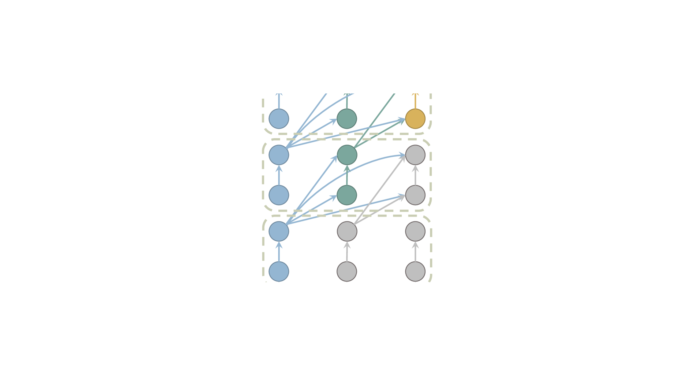
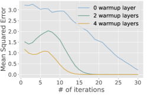

# Layer-Condensed KV Cache — Research Note

## 📇 Academic Context

| Field | Value |
|-|-|
| Title | Layer-Condensed KV Cache for Efficient Inference of Large Language Models |
| Venue | ACL 2024 (Volume 1: Long Papers) |
| Year | 2024 |
| Authors | Haoyi Wu, Kewei Tu |
| Official Code | https://github.com/whyNLP/LCKV |
| Venue Kind | paper |

本篇筆記以 arXiv 全文（`2405.10637`）為證據來源撰寫；正式發表版本為 ACL 2024 主會長論文（pp. 11175–11188），兩者若有細節差異，以正式版為準。作者來自上海科技大學（ShanghaiTech University）。

## First Principles

### KV cache 為何是部署瓶頸

自回歸生成時，Transformer 會把每一層、每個已生成 token 的 key/value 存進 KV cache，避免重新計算。它的記憶體佔用同時正比於序列長度與層數：論文引用既有量測指出 KV cache 在部署時可佔到超過 30% 的 GPU 記憶體。對深層模型而言，「層數」這個乘數特別致命——LLaMA-7B 有 32 層、30B 有 60 層，每多一層就多存一整層的 K 與 V。

把 KV cache 的記憶體寫成一個粗略的正比關係，可以看清楚兩條可下手的軸：

$$
\text{KV cache memory} \;\propto\; L \times n \times d_{\text{kv}}
$$

其中 $L$ 是層數、$n$ 是序列長度、$d_{\text{kv}}$ 是每個 token 每層的 KV 維度（此式為本筆記為說明而寫的整理，非論文原式）。過去絕大多數工作都在壓 $n$ 這一軸（壓縮 prompt、只保留初始與近期 token、依注意力分數淘汰 token）。本文的切入點正交於這些方法：直接砍掉 $L$ 這個乘數。

### 核心機制：所有層的 query 只配對頂層的 KV

本文提出一種新的 Transformer decoder 變體：讓**所有層的 query 都與「僅僅頂層」的 key/value 配對**，而不是各層配對各自那一層的 KV。這樣一來，除了頂層以外的層根本不需要快取、甚至不需要計算 KV；連帶地，把隱藏表徵映射到 K、V 的權重 $W_K, W_V$ 也可以在這些層被丟棄，於是記憶體、計算量與模型參數量三者同時下降。作者的直覺來自把 Transformer 的堆疊結構詮釋為「逐層精煉 token 表徵」的迭代過程——頂層表徵資訊量最高，因此讓所有層都去注意頂層是合理的；這也呼應了 encoder–decoder 中所有 decoder 層都對頂層 encoder 輸出做 cross-attention 的設計。

### 循環依賴與對角遮罩

這個設計有一個雞生蛋問題：既然每個 token 在低層的注意力也要用到「自己的頂層 KV」，但頂層要等所有低層算完才算得出來，就形成循環依賴。作者的解法很直接——遮蔽注意力矩陣的對角線，讓每個 token 不再注意自己；序列第一個 token 因此無可注意的對象，就以零向量當作 dummy KV。因為殘差連接仍在，token 自身的資訊依然能在自底向上的計算中被帶入，論文實測發現這個對角遮罩幾乎不影響效能。

### warmup 層與三明治配置

只用上述設計，語言模型與下游任務的效能會落後標準 Transformer。作者觀察到 Transformer 低層偏語法、高層偏語意，用同一層 KV 餵給所有層可能破壞這個分工，因此保留少數幾層維持標準注意力，稱為 **warmup 層**，其餘層才套用「共用頂層 KV」的做法。他們進一步提出把 warmup 層拆成「頂部 $w/2$ 層＋底部 $w/2$ 層」的三明治（sandwich）配置，實測這種擺法優於把 warmup 層全放底部或全放頂部，且相較標準 Transformer 幾乎沒有效能損失。

### 讓循環依賴可以平行訓練

推理時本方法與標準 Transformer 幾乎相同（由左到右一次解一個 token），但訓練麻煩得多：既然每個 token 依賴前面 token 的頂層 KV，就無法像標準 Transformer 那樣對整段序列平行訓練。作者把原本「對 $n$ 個 token 依序做 $n$ 遍自底向上計算」的計算圖，改寫成「對所有 token 同時做 $n$ 次迭代，每次迭代用『上一次迭代的頂層 KV』與本次所有層的 query 配對」的等價計算圖，並以歸納法證明兩者在訓練上等價（第 $i$ 個 token 從第 $i$ 次迭代起就與序列版完全一致）。這個改寫把原圖的水平依賴換成垂直依賴，最長依賴鏈長度不變，因此仍需 $n$ 次迭代——真正的加速來自接下來對迭代次數的兩刀砍。

### 反向傳播只回傳最後 $b$ 次迭代

在最後一次迭代才算損失，若對 $n$ 次迭代全回傳，計算圖大到放不進 GPU。作者仿效 Transformer-XL 的梯度停止，只讓損失回傳最後 $b$ 次迭代（$b \ll n$）。這裡有個細節：最後一次迭代用的 KV 來自倒數第二次迭代，若 $b=1$ 則梯度根本傳不到算 KV 的參數，效能會大幅退化；實測 $b \geq 2$ 即可與標準 Transformer 相當，故預設 $b=2$。

### 前向傳播靠 KV 快速收斂再砍一刀

梯度停止後，前 $n-b$ 次迭代只用來前向計算餵給後 $b$ 次迭代的 KV。作者的關鍵觀察是：KV 在迭代間收斂得非常快，不必真的跑滿 $n-b$ 次。他們以隨機初始化、與 TinyLlama 同配置的模型、2048 tokens 的輸入量測相鄰迭代間 KV 的均方誤差，發現只要數十次迭代 KV 就收斂，且 warmup 層越多收斂越快；因此改用 $m$ 次迭代（$m \ll n$）近似，並實測 $m=7$ 已足夠、再加大也不再提升。

### prompt 的處理

生成本身很直接，但本方法無法像標準 Transformer 那樣平行編碼 prompt（與無法平行訓練同因）。所幸 KV 收斂快，只要對 prompt 迭代 $m+b$ 次即可；由於 $m+b$ 通常遠小於待生成的 token 數，編碼 prompt 的額外開銷可忽略。

### 一個帶真實數字的走查

以論文的 1.1B 模型（配置對齊 TinyLlama：22 層、hidden size 2048、32 個 attention head、4 個 KV head、詞表 32000、訓練長度 2048）與 $w=10$ 為例：三明治配置把最頂 5 層與最底 5 層留作標準注意力，中間 12 層不再計算或快取自己的 KV，全部改用共用的頂層 KV；訓練與 prompt 編碼各用 $m+b=7+2=9$ 次迭代。下表節錄 A100（80GB）與 RTX 3090（24GB）上的最大批次量與吞吐（$x+y$ 表 prompt 長度 $x$、生成長度 $y$，倍率相對標準 Llama）：

| GPU | Model Size | Seq. Length | Llama 批次 | Ours $w{=}2$ 批次 | Ours $w{=}10$ 批次 | Llama 吞吐 | Ours $w{=}2$ 吞吐 | Ours $w{=}10$ 吞吐 |
|-|-|-|-|-|-|-|-|-|
| A100 | 30B | 2048+2048 | 1 | 32 (32×) | 8 (8×) | 14.10 | 108.29 (7.7×) | 77.65 (5.5×) |
| RTX 3090 | 30B (CPU-offload) | 512+1024 | 4 | 83 (20.8×) | 23 (5.8×) | 0.23 | 5.99 (26.0×) | 1.63 (7.1×) |
| RTX 3090 | 7B | 5+2043 | 5 | 64 (12.8×) | 16 (3.2×) | 140.88 | 534.02 (3.8×) | 315.38 (2.2×) |

摘要宣稱的「最高 26× 吞吐、最高 32× 批次」正對應到這張表的邊角：26.0× 吞吐來自 30B 於 RTX 3090 靠 CPU-offload 的 512+1024 設定（$w=2$，0.23→5.99 token/s），32× 批次則來自 30B 於 A100 的 2048+2048 設定（$w=2$，批次 1→32）。同一列裡，批次放大 32× 但吞吐只放大 7.7×，說明吞吐並非隨批次線性成長。

品質面則以從頭預訓練的 1.1B 模型（100B token 的 SlimPajama 子集）對照 TinyLlama：

| Model | Dev ppl. | HellaSwag | WinoGrande | ARC-e | BoolQ | PIQA | Avg |
|-|-|-|-|-|-|-|-|
| TinyLlama | 9.219 | 44.58 | 50.99 | 46.38 | 60.46 | 68.93 | 46.65 |
| Ours ($w=2$) | 9.746 | 42.22 | 49.64 | 43.10 | 61.38 | 66.49 | 45.45 |
| Ours ($w=10$) | 9.265 | 44.74 | 51.70 | 46.38 | 61.38 | 67.90 | 46.84 |

可見 $w=10$ 幾乎無損（平均 46.84 甚至略高於 TinyLlama 的 46.65），$w=2$ 則在多數任務小幅退步但換得更高吞吐。若把 KV cache 記憶體近似為所快取的層數，$w=2$ 大約只需快取 22 層中的 3 層（約省 86%），$w=10$ 約需快取 11 層（約省 50%）——這個換算是本筆記依三明治配置自行推得，用以說明「省記憶體」與「保品質」之間的取捨是由 $w$ 連續調控的。

## 🧪 Critical Assessment

### 問題是否真實且重要

KV cache 佔部署記憶體的比例確實可觀，且其記憶體隨層數線性成長對深層模型是硬瓶頸，因此「砍層數」這條與壓序列長度正交的軸是有價值的切入點。更關鍵的是，本方法不只省 cache，還同時省下非頂層的 KV 計算與 $W_K, W_V$ 參數，這使它在批次放大之外，於相同批次下也能降低延遲（附錄的 latency 實驗支持此點）。問題設定本身站得住腳。

### 基線、消融、資料與指標是否充分

證據強度是本文最需打折的地方。真正「從頭預訓練並比較品質」的只有 1.1B 一個規模，且基線只有 TinyLlama 一條線；7B 與 30B 只量了吞吐與延遲，完全沒有品質數字，因此「大模型上同樣無損」並無實證，只是外推。下游評測是七個常識推理任務的零樣本準確率，數量與難度都偏輕，HellaSwag 這類 44 分左右的絕對分數也顯示模型本身很弱，難以據此斷言方法在強模型上仍無損。消融（三明治擺法、warmup 層數、$m$、$b$、KV loss）做得相對紮實，是本文的加分項。

### 是換名字還是真的新東西

作者自己點出與 Feedback Transformer 的高度相似——後者同樣聚合各層（含只用頂層）表徵作為記憶，差別在 Feedback 的序列式訓練對大模型不切實際。因此本文真正的新貢獻並不在「共用頂層 KV」這個想法本身，而在讓它可規模化的兩件工程：可平行的迭代訓練（附證明的等價性）與「KV 快速收斂 → 只跑 $m=7$ 次迭代」的近似。把貢獻定位在「讓舊想法可訓練、可放大」是誠實的，但也意味著方法新穎性主要是系統／訓練層面而非表徵層面。

### 吞吐數字的量測方式是否偏向自身

頭條倍率的取得方式值得警惕。多個吞吐設定（如 5+8187、512+1024）的序列長度超出模型實際訓練長度（1.1B 訓練長度僅 2048），論文也坦承「有些序列長度超過訓練上限，但不影響批次與吞吐量測」——問題在於這些邊角設定同時被用來報告最亮眼的批次/吞吐倍率，而那些長度下的生成品質並未一併呈現。26× 這個頭條還依賴 30B 的 CPU-offload 情境（標準基線吞吐被壓到 0.23 token/s，分母極小才撐出大倍率）。這是一種以對自身有利的操作點定義比較基準的做法：倍率本身不假，但挑選的操作點放大了優勢、也迴避了同設定下的品質檢驗。

### 問題真的被解決了嗎、有多大實際意義

「幾乎無損」只在 $w=10$ 成立，而 $w=10$ 已把省下的記憶體折掉一半（約省 50% 而非 $w=2$ 的約 86%）；要拿最大記憶體節省就得接受 $w=2$ 的可見退步，取捨並未消失、只是被 $w$ 參數化。成本面也不便宜：迭代訓練使預訓練時間約為 TinyLlama 的 2.7–2.8 倍，作者以「訓練是一次性、推理反覆發生」自我辯護，尚屬合理但需使用者自行權衡。真正限制實際適用面的是論文自陳的短板：由於 prompt 也要迭代編碼，當 prompt 遠長於生成長度（如文件摘要）時吞吐會退化，方法更適合生成長度大的場景（翻譯、對話、CoT）。整體而言這是一個定位清楚、對「長生成、重部署」場景確有價值的方法，但把它讀成「無代價地砍掉 KV cache」會過度樂觀。

## 🔗 Related notes

- [Attention is all you need](../AttentionIsAllYouNeed/)
