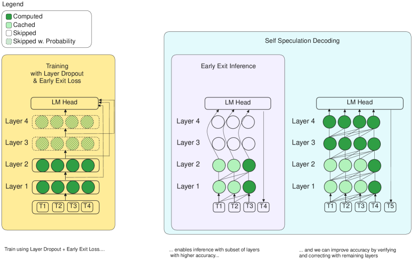
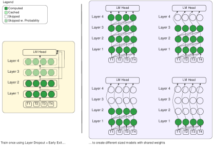
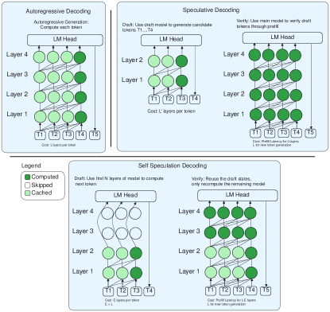

# LayerSkip — Research Note
> [English](./README.md) | **繁體中文**

## 📇 Academic Context

| Field | Value |
|-|-|
| Title | LayerSkip: Enabling Early Exit Inference and Self-Speculative Decoding |
| Venue | ACL 2024 (Volume 1: Long Papers) |
| Year | 2024 |
| Authors | Mostafa Elhoushi, Akshat Shrivastava, Diana Liskovich, Basil Hosmer, Bram Wasti, Liangzhen Lai, Anas Mahmoud, Bilge Acun, Saurabh Agrawal, Ahmed Roman, Ahmed A Aly, Beidi Chen, Carole-Jean Wu |
| Official Code | https://github.com/facebookresearch/LayerSkip |
| Venue Kind | paper |

本篇筆記以 ACL 2024 正式版（aclanthology `2024.acl-long.681`）對應的 arXiv 全文 `2404.16710` 為證據來源，兩者皆為 Meta FAIR 團隊同一篇長論文；數值與引文皆取自 LaTeX 原始檔以避免 PDF 抽字誤差。

## First Principles

### 這篇論文想解決什麼：層數就是延遲

自迴歸 LLM 每產生一個 token，都要跑完全部 $L$ 層 transformer。作者的核心觀察是：多數 token 其實不需要走完所有層才能定案。他們把 Llama1 7B 餵入 HumanEval 的一個 prompt，對每一層的輸出用同一顆 LM head 做 unembedding，發現平均一個 token 只需要 23.45 層（模型共 32 層）就已收斂到最終預測；換言之，即便有一個零開銷的完美「早退預測器」，也頂多省下 26% 的計算。這說明模型天生把算力平均攤在各層、缺乏「早點定案」的動機，於是作者要從訓練端逼模型更依賴淺層。

LayerSkip 把「加速」拆成三個彼此支撐的階段：一套訓練配方，讓同一組權重等價於「不同深度子模型的集成」；一套早退推論，直接在第 $E$ 層接上 LM head 出字；以及一套自我推測解碼（self-speculative decoding），用淺層草擬、深層驗證與更正，把早退的準確度損失補回來。三段共用同一個模型、同一顆 LM head，不新增任何 auxiliary layer 或額外草稿模型，這是它和多數早退／推測解碼工作的關鍵差異。

### 訓練配方之一：層 dropout（讓模型少依賴深層）

第一個修改是把 dropout 加到「整層」而非權重上。在第 $l$ 層、第 $t$ 次迭代，transformer 運算變成：

$$x_{l+1,t} = x_{l,t} + M(p_{l,t}) f_l(x_{l,t})$$

其中 $M(p)$ 是 Bernoulli 遮罩，以機率 $p_{l,t}$ 回傳 0（整層被跳過）、否則回傳 1。關鍵在於 dropout 率不是常數，而是隨層數指數上升——淺層近乎不 drop、深層幾乎必 drop：

$$D(l) = e^{\frac{l\text{ln}2}{L-1}} - 1$$

實際的每層率為 $p_{l,t} = S(t)\,D(l)\,p_{max}$，其中 $p_{max}$ 是整體上限、$S(t)$ 是時間軸的 curriculum。作者發現：若從既有預訓練模型接著做 continual pretraining 或 finetuning，時間軸不縮放（$S(t)=1$）即可；但從零預訓練時，指數型時間 curriculum $S_{exp}(t)=e^{\frac{t\ln 2}{T-1}}-1$ 才能得到最佳準確度。這個「淺層低、深層高」的非對稱設計，就是要迫使淺層自己扛起預測責任。

### 訓練配方之二：早退損失（讓同一顆 LM head 讀懂淺層）

LM head 原本只被訓練來 unembed 最後一層的表徵，對淺層的 embedding 是「看不懂」的。LayerSkip 因此在總損失中，把每一層的輸出都接到同一顆 LM head 上算交叉熵並加權求和：

$$J(X,Y,t) = \sum_{l=0}^{l=L-1} \tilde{e}(t,l)J_{\text{CE}}(g(x_{l+1}),Y)$$

$\tilde{e}(t,l)$ 是歸一化後的每層權重（各層相加為 1），其中 $e(l)$ 對較深層給二次方成長的權重（深層預測較容易、罰得更重），而 $C(t,l)$ 是決定「第 $t$ 次迭代要不要開啟第 $l$ 層早退」的 curriculum。作者實驗兩種 curriculum：rotational（每 $R$ 層開一個早退、逐迭代輪轉，每步只做 $\lceil L/R \rceil$ 次 unembedding）與 gradual（從最後一層往前、每 $T/2L$ 迭代多開一層）。刻意不對所有層同時全開，是因為那會拖慢訓練並傷到最後一層準確度。

值得強調的是：與 DepthAdaptive、CALM 等早退工作不同，LayerSkip 不替每一層加專屬 LM head、也不加任何 early-exit 模組，而是全層共享同一顆 LM head。這讓訓練更快、訓練與推論記憶體都更省，部署與維護也更單純。

### 推論階段：早退與自我推測解碼

早退推論本身很直接：自迴歸產生每個 token 時只跑前 $E$ 層，直接把 $g(x_E)$ 當作模型輸出、跳過其餘層。但單純早退會掉準確度，於是作者用推測解碼把準確度補回來——這正是本文最具工程巧思的部分。

自我推測解碼分兩步：Self-Drafting 用早退（前 $E$ 層）自迴歸草擬 $d$ 個 token；Self-Verification 用「剩下的 $L-E$ 層」對這批草稿 token 做一次平行前向，找出草稿與驗證首次分歧處，把分歧點之前的草稿與該處的驗證 token 一併採納，再從草稿階段繼續。因為草稿與驗證走的是「同一個模型、同一組層的相同順序」，前 $E$ 層的計算可以完全重用：作者只需維護單一 KV cache，並額外引入一個 exit query cache——只存下第 $E-1$ 層的 query 向量，驗證階段就能直接從第 $E$ 層接續跑到最後一層。作者把 KV cache 與 exit query 的聯集稱為 KVQ cache。相較 Draft & Verify（Zhang 等人 2023）跳過中間層、無法重用草稿階段的 activation 與 KV，本文因為兩階段共用前段層而能省下這部分重算，這也是它記憶體與延遲雙贏的來源。

### 一個具體的走一遍：TOPv2 上的 Llama 1.5B（24 層）

把 Llama 1.5B（24 層）在 TOPv2 語意剖析資料上以 LayerSkip 微調（$p_{max}=0.2$、$e_{scale}=1.0$、gradual curriculum），下表是同一個模型在三種解碼方式下的實測（8 speculations、貪婪解碼、每題最多 80 tokens）：

| Generation | $E$（早退層） | EM | Token Acc. | Time/Token (ms) | Speedup |
|-|-|-|-|-|-|
| Autoregressive | – | 85.9% | – | 36 | 1.00× |
| Early Exit | 18 | 83.3% | – | 28 | – |
| Early Exit | 12 | 79.4% | – | 19 | – |
| Early Exit | 6 | 62.9% | – | 10 | – |
| Self Speculative | 18 | 82.9% | 98.9% | 29 | 1.24× |
| Self Speculative | 12 | 82.9% | 97.6% | 22 | 1.64× |
| Self Speculative | 6 | 82.9% | 76.0% | 18 | 2.0× |

讀法如下：若直接在第 6 層早退，每 token 只要 10 ms（比 36 ms 快很多），但 EM 從 85.9% 崩到 62.9%——這就是「退太早」的代價。改用自我推測解碼、同樣在第 6 層草擬，Token Acceptance 只有 76.0%（每四個草稿 token 約被接受三個），但因為被拒絕的 token 會由剩下 18 層驗證更正，最終 EM 回到 82.9%，而每 token 平均時間降到 18 ms，換算 2.0× 加速。對照第 18 層：草稿幾乎全被接受（98.9%），品質守住（82.9%）但只有 1.24× 加速——因為草稿階段本身就跑了 18/24 層、省得不多。這條「$E$ 越淺、加速越大但 acceptance 越低」的取捨曲線，正是整套方法的操作旋鈕。

### 早退準確度與跨任務加速

在 Llama2 7B/13B 的 continual pretraining 上，中間層（第 16／20 層）的早退品質相對 baseline 大幅改善，尤其是開放式生成任務：例如 NaturalQuestions 在 Llama2 7B 中間層由 baseline 的 0% 拉到 4%。分類型任務（單選／是非）本來就比生成型任務更耐早退，因為只評一個 token、且候選只有 2–4 個而非上萬字典項；MMLU 這種難題在 Llama2 13B baseline 從最後層到中間層也只從 55.2% 掉到 49.2%。端到端加速方面，作者回報自我推測解碼可得 1.34×–2.16×：從零預訓練的 Llama2 7B 在 CNN/DM 摘要達 2.16×、程式碼微調的 Llama1 7B 在 HumanEval 達 1.82×、TOPv2 達 2.0×，且與 Draft & Verify 在共同設定上比較，CNN/DM 明顯更快（1.81× vs. 1.5×）、XSUM 略慢（1.34× vs. 1.48×）。

## 🧪 Critical Assessment

### 23.45/32 層的動機：為何非動訓練端不可
LLM 推論延遲與記憶體成本是實打實的部署痛點，而「以層為單位省算力」相較量化／稀疏化不需要特製 kernel 或硬體，這個切入點確實有價值。作者自己的動機分析也誠實地量化了上界：既有模型平均要 23.45/32 層，完美預測器頂多省 26%，因此「不改訓練只加預測器」的早退路線天花板很低，必須從訓練端改造——這個論證讓方法的必要性站得住腳，而非為了新穎而新穎。

### 四種訓練型態的覆蓋，與驗證階段守住的品質
證據面相對紮實：涵蓋 continual pretraining、從零預訓練、領域微調、任務微調四種訓練型態，跨 Llama1/2/3 多個尺寸，且與同類的 Draft & Verify 在共同模型與任務上正面對比。自我推測解碼的品質是可驗證的——因為驗證階段用完整模型更正，ROUGE-2／EM 幾乎與自迴歸持平（例如 TOPv2 的 82.9% vs. 85.9%），加速數字因此不是靠犧牲品質換來的。這是本文最可信的一塊。

### 最後一層退化：被淡化的代價
方法並非沒有帳要付。Llama3 8B 以 LayerSkip continual pretraining 後，最後一層準確度出現明顯下滑（例如 MMLU 66.5%→60.5%、HumanEval 37.8%→28.7%、GSM8K 54.2%→45.0%），即便訓練 token 更多。作者把原因歸到「Llama3 淺層 perplexity 本就高出 Llama2 兩三個數量級、更難壓」，並轉而建議「乾脆在未來從零預訓練時就採用本配方」。這個解釋合理但未被直接證實，而且把一個回歸轉述成「未來工作的動機」，讀來有淡化既有缺點之嫌：對已經有 Llama3 檢查點、只想做 continual pretraining 的使用者而言，最後一層掉幾個點是真實成本，論文的表格誠實列出、但敘事明顯偏向早退層的增益。

### 加速數字的情境依賴與潛在挑選
2.16× 這個標題數字來自「從零預訓練、僅 26B token」的 Llama2 7B，屬於相對受控、偏弱的模型設定；而在更接近實務的 continual pretraining 上，Llama2 13B 在 XSUM 只有 1.34×，甚至輸給 Draft & Verify 的 1.48×。加速高度取決於 token acceptance，而 acceptance 又取決於任務可預測性與所選的 $E$／$d$。論文回報的多為每個設定下較好的 $E$，讀者難以判斷這些退出層是否經過針對性挑選；缺少「acceptance 對 $E$ 的完整敏感度曲線與最差情況」使得 headline 數字有被最有利設定放大的空間。此外全部以貪婪解碼、CNN/DM 為 1-shot（刻意對齊 Draft & Verify）評測，換成取樣解碼或多輪對話時的表現仍是未知數。

### exit query cache 把三個舊元件接成一條自洽的鏈
層 dropout、早退、推測解碼三者皆非首創。LayerSkip 的真正貢獻是把它們接成一條自洽的鏈：非對稱層 dropout 與共享 LM head 的早退損失讓「同一模型即一族子模型」成真，而 exit query cache／單一 KVQ cache 讓草稿與驗證真正共用前段計算——這一點相較跳中間層的 Draft & Verify 是實質的機制差異，不只是換名詞。而且它是在既有的公開任務與同類方法上正面對比，而非在自家方法的強項周圍另立一個只利於自己的基準；因此它更像是有明確工程新意的整合，但也應如實承認，單看任一元件都難稱突破。

### 再訓練成本：現成檢查點使用者的適用邊界
在「無明顯品質損失下取得 1.3×–2× 加速、且不需第二個模型或額外記憶體」這個定義下，論文對其宣稱大致達成，且已開源程式碼與檢查點，實務可用性高。但「問題被解決」需附帶但書：其一，多數強加速依賴以 LayerSkip 從頭訓練或大規模 continual pretraining，對想直接套用現成權重者門檻不低；其二，最後一層退化在部分模型上真實存在，需以再訓練成本換取。整體而言結論可信但非普適，屬於「對願意付出訓練成本者成立」的加速方案。

## 🔗 Related notes

<!-- 目前沒有可安全解析的相關筆記；保留標題，待相關主題（如 speculative decoding、LoRA）補齊後再連結。 -->
