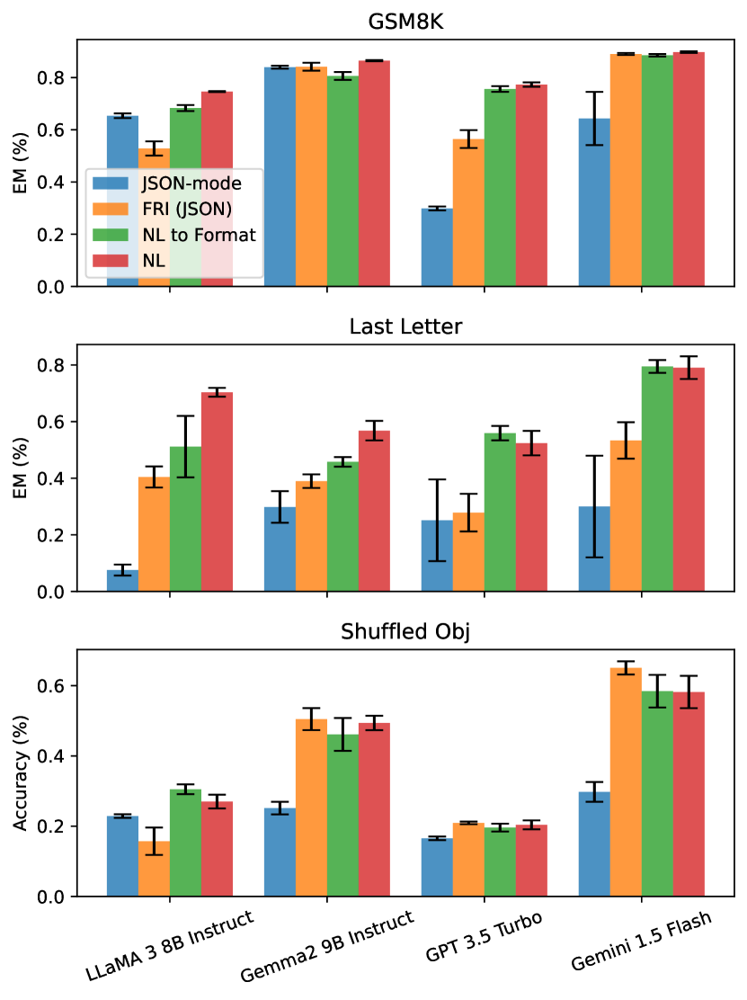
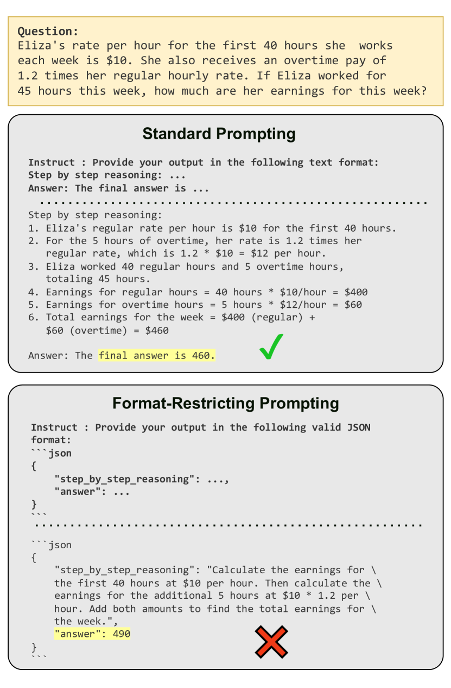

# LetMeSpeakFreely — Research Note
> **English** | [繁體中文](./README.zh-TW.md)

## 📇 Academic Context

| Field | Value |
|-|-|
| Title | Let Me Speak Freely? A Study on the Impact of Format Restrictions on Performance of Large Language Models |
| Venue | unknown |
| Year | 2024 |
| Authors | Zhi Rui Tam, Cheng-Kuang Wu, Yi-Lin Tsai, Chieh-Yen Lin, Hung-yi Lee, Yun-Nung Chen |
| Official Code | https://github.com/appier-research/structure-gen |
| Venue Kind | paper |

## Problem Setting: Structured Generation and Format Restrictions

In real industrial applications, we almost never feed an LLM's free-text reply directly into a downstream system; instead, we require it to output standardized formats such as JSON, XML, or YAML, so that a program can parse out the "answer" field. This practice of requiring the model to produce output following a fixed schema is called structured generation, and the means of imposing this restriction is format restriction. The question this paper asks is highly practical: when we bind the model's output space for the sake of easy parsing, do we also, in the process, harm the model's own reasoning and knowledge-comprehension ability?

Past benchmarks such as IFEval, INFOBENCH, and FOFO all evaluate whether an LLM "can follow a format," but none answers "whether format instructions harm the quality of the generated content." The authors argue that this is the first systematic study of the relationship between format-restricting instructions and the quality of generated content (this is the first systematic investigation), and the answer is unexpected: on reasoning tasks, format restrictions bring a significant and substantial performance degradation.

## Three Format-Restriction Methods and Their Strictness Spectrum

The paper abstracts common industry practices into three methods of decreasing strictness, and this spectrum is the backbone of the whole paper's comparison:

| Method | Mechanism | Strictness |
|-|-|-|
| Constrained Decoding (JSON-mode) | Forcing the token space during decoding, guaranteeing legal JSON output | Strictest |
| Format-Restricting Instructions (FRI) | Using prompts to require output following a specified schema, without forcing the token space | Medium |
| NL-to-Format | First answer in natural language, then convert the answer into the target format | Loosest |

Constrained decoding restricts the LLM's output by enforcing a predefined token space during the generation process (enforcing predefined token space during the generation process); the JSON mode of the OpenAI and Gemini APIs is the most widespread instance of this technique. FRI merely uses instructions to guide the model to generate responses in standardized formats such as JSON, XML, and YAML (generate responses in standardized formats such as JSON, XML, and YAML), which is looser than constrained decoding because it does not lock down the token space. NL-to-Format is a two-stage process: first the model answers the question in natural language, and then instructs it to convert its response into the target format schema (answer the question in natural language, and then instructs it to convert its response into the target format schema), decoupling "content generation" from "format compliance," and it is the loosest of the three.

## Core Findings: Reasoning Degrades, Classification Tasks May Even Benefit

The most counterintuitive result of the paper is that on reasoning tasks such as GSM8K, Last Letter Concatenation, and Shuffled Objects, looser prompts generally give better results — JSON-mode is mostly the worst, followed by FRI, then NL-to-Format, and pure natural language (NL) is the best. In other words, the stricter the format restriction, the greater the performance degradation on reasoning tasks.



Classification tasks, however, show the opposite trend. On DDXPlus, Gemini 1.5 Flash demonstrates a significant performance boost when JSON-mode is enabled (demonstrates a significant performance boost when JSON-mode is enabled); across other classification datasets, JSON-mode performs competitively, and in some cases even surpasses the other three methodologies (surpasses the other three methodologies). The authors' interpretation is that JSON-mode, by restricting the answer space and reducing the chance of choosing the wrong answer, actually helps classification tasks that did not need long reasoning to begin with. This makes the conclusion task-dependent: strict formats harm reasoning-heavy tasks, but may improve classification tasks that require a fixed output set.

## A Concrete Forward Pass: The Eliza Wage Problem from GSM8K

The paper's cover figure uses one GSM8K wage problem to make the mechanism very clear. The problem: Eliza's hourly rate for the first 40 hours is $10, and for overtime of 5 hours the rate is 1.2 times. Using the standard "reason step by step, then give the answer" text format, GPT-3.5-turbo dutifully computes 40×$10 = $400 and 5×$12 = $60, sums to $460, and answers correctly.



Once the same problem is changed so that a JSON object must be produced first, the model's behavior changes:

```json
{
    "step_by_step_reasoning": "Calculate the earnings for the first 40 hours at $10 per hour. Then calculate the earnings for the additional 5 hours at $10 * 1.2 per hour. Add both amounts to find the total earnings for the week.",
    "answer": 490
}
```

In the JSON `step_by_step_reasoning` field, the model only writes a "plan" without actually expanding the calculation step by step, and `answer` directly jumps to 490 (incorrect). More critical evidence comes from the Last Letter task: after inspection, the authors found that 100% of GPT-3.5-turbo JSON-mode responses placed the `answer` key before the `reason` key (100\% of GPT 3.5 Turbo JSON-mode responses placed the "answer" key before the "reason" key), so the model becomes zero-shot answering directly, rather than zero-shot chain-of-thought, and the reasoning chain is cut off by the key order of the format. This shows that one root cause of the degradation is the key ordering of "write the answer first or the reasoning first," rather than the format itself mysteriously making the model dumber.

## Quantifying the Degradation with Numbers: The Cost of Adding a Schema Restriction

To quantify the degradation, the paper compares two settings on GSM8K — "requiring only a certain output language" versus "additionally attaching a schema constraint" — averaging the score over 9 prompt perturbations (standard deviation in parentheses). The following excerpts the key rows from the "loose vs strict" table:

| Model | Format | No schema | With schema constraint |
|-|-|-|-|
| claude-3-haiku | JSON | 86.99 | 23.44 |
| gpt-3.5-turbo | JSON | 74.70 | 49.25 |
| gpt-3.5-turbo | XML | 60.45 | 45.06 |
| LLaMA-3-8B | YAML | 69.41 | 46.08 |

We can describe the degradation with a simple quantity (this notation is defined by this note):

$$
\Delta_{\text{fmt}} = \text{Acc}_{\text{NL}} - \text{Acc}_{\text{fmt}}
$$

The most dramatic row is claude-3-haiku's JSON: the average score collapses from 86.99 to 23.44, while the standard deviation simultaneously surges from 0.2 to 22.9, showing that adding a schema not only lowers the average but also makes the model extremely sensitive to prompt wording (adding schema not only increase the sensitivity to prompt but also degrade in average performance). This supports a practical recommendation: when handling reasoning-heavy tasks, rather than forcibly cramming in a rigid schema, it is better to loosen the format restriction and preserve the model's original reasoning space.

## The Degradation Is Not Caused by Parsing Errors

A natural suspicion is: could the gap between text and structured formats be merely because structured output is harder for a parser to correctly extract the answer from? The paper's analysis rejects this hypothesis. Gemini 1.5 Flash and GPT-3.5-turbo have nearly zero parsing failure rates across the three formats, yet the score drop is still seen; and on LLaMA-3-8B, the parsing error rate for the Last Letter task in JSON format is only 0.148%, yet there exists a substantial 38.15% performance gap (the parsing error rate for the Last Letter task in JSON format is only 0.148\%, yet there exists a substantial 38.15\% performance gap). This means the gap comes from the interference of format restrictions on the model's reasoning and generation process, rather than from mistakes in the parsing step.

## Mitigation: Let the Model Speak Freely First

The solution the paper proposes revolves around the same principle — separate content generation from format compliance. NL-to-Format can maintain almost the same score as pure natural language, because both answers derive from the same natural-language reply. For the parsing errors that do occur (Claude-3-Haiku and LLaMA-3-8B are the most severe), simply using a second prompt to reformat the broken output can recover the score on JSON and YAML. In addition, the newer gpt-4o-mini provides a JSON-Schema (Structured Output) API implemented with a context-free grammar and guaranteed to be 100% schema-compliant; in 2 out of 3 reasoning datasets, pure natural language is still slightly better than JSON-Schema (In 2 out of 3 reasoning datasets, NL still performs slightly better than JSON-Schema), but the gap is already much smaller than with the old JSON-mode. On cost, YAML is the most cost-effective format for LLaMA-3-8B, Gemini-1.5-Flash, and GPT-3.5-Turbo (YAML is the most cost-effective format), which also gives "loose formats" an advantage in both performance and cost.

## 🧪 Critical Assessment

### Reality and Importance of the Problem

This problem is real, not artificial. Anyone who connects an LLM into a production system encounters the dilemma of "you need to bind the format for good parsing, but binding the format risks harming quality," and before this study, the community's benchmarks only measured format-following compliance — no one measured the side effects of format on content quality. The paper turns this engineering pain point into a measurable experiment, a solid direction.

### Adequacy of Baselines, Ablations, Datasets, and Metrics

The experiments cover three closed-source APIs and two open-source models, six datasets, three formats (JSON/XML/YAML), and nine prompt perturbations — the coverage is adequate among similar studies. But two design choices affect credibility. First, the so-called "perfect parser" is actually claude-3-haiku used as an LLM parser, on the grounds that it has the highest agreement (kappa) with gpt-4-turbo, reaching 0.86 — this is "most consistent," not "error-free," so the claim of completely ruling out parser error is somewhat optimistic, and the parser itself may still have systematic preferences among different formats. Second, the schema is deliberately restricted to only two fields, reasoning and answer, and the authors also acknowledge that the gap between this and real-world complex nested schemas is an unresolved external-validity issue.

### A New Discovery or a Repackaging of an Existing Phenomenon

The real novelty lies in the angle of "measuring the causal impact of format restrictions on content quality," rather than proposing a new model or new technique; the mitigation means (two-stage generation, error rewriting) are also all a consolidation of existing engineering techniques. What should be retained is that some key evidence in fact points to "implementation flaws" rather than "the essential harm of format restrictions." JSON-mode's collapse on Last Letter has as its root cause the model placing the answer key before reason, which is a problem of key ordering and the chain-of-thought being cut off; simply adjusting the schema field order or switching to a setting that keeps the reasoning field first can greatly mitigate it, so counting it as "constrained decoding is inherently harmful" risks overgeneralization. Moreover, the choice of evaluation tasks may also amplify the effect — Task 280 is itself a task known to be extremely sensitive to prompt format, with variance reaching 56%, which amounts to comparing on the terrain most favorable to this method.

### Is the Problem Really Solved, and Real-World Relevance

The paper is quite honest in converging its contribution to "revealing the phenomenon and proposing a usable mitigation," rather than claiming to fully solve it. A few points weaken the generality of the conclusion: the models tested are all smaller, cheaper generations (gpt-3.5-turbo, claude-3-haiku, gemini-1.5-flash, 8–9B open-source models), and due to cost the authors could not include stronger models such as LLaMA-70B or GPT-4o; and when they tried the newer gpt-4o-mini JSON-Schema, the degradation was already clearly reduced. This makes it reasonable to speculate that a considerable part of the observed harm is tied to early models and early JSON-mode implementations, and as native constrained decoding matures and models grow stronger, the effect may keep converging. For practitioners, the most robust actionable conclusion is not "do not use structured output," but "for reasoning-heavy tasks, prefer NL-to-Format or a loosened schema, and ensure the reasoning field is placed before the answer."

## 🔗 Related notes

- [Instruction Tuning with GPT-4](../InstructioinTuningWithGPT4/)
