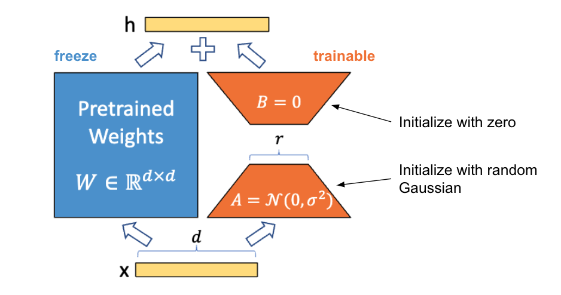

# Lora
| Title | Venue | Year | Code |
|-|-|-|-|
| [LoRA: Low-Rank Adaptation of Large Language Models](https://arxiv.org/abs/2106.09685) | ICLR | '22 | [✓](https://github.com/huggingface/peft/blob/main/src/peft/tuners/lora.py) |
## Low-Rank-Parametrized Update Matrices
- The pre-trained language models have a low `instrisic dimension` and can still learn efficiently despite a random projection to a smaller subspace. 
    - `instrisic dimension` refers to the number of dimensions needed to represent the statistical patterns it has learned. In other words, it represents the **complexity of the model**.
    - This paper hypothesizes the updates to the weights also have a `low intrinsic rank` during adaptation.

$$
h = W_0 x + \Delta W_x  = W_0 + BA_x
$$

| Property | Definition |
|-|-|
| $W_0$ | The pre-trained language models's weight, $W_0 \in \mathbb{R}^{d \times k}$ |
| $A$   | $A$ contain trainable parameters. Initialize random Gaussian.  |
| $B$   | $B$ contain trainable parameters. Initialize with 0. |

- $\Delta W = BA$ is zero at the beginning.
