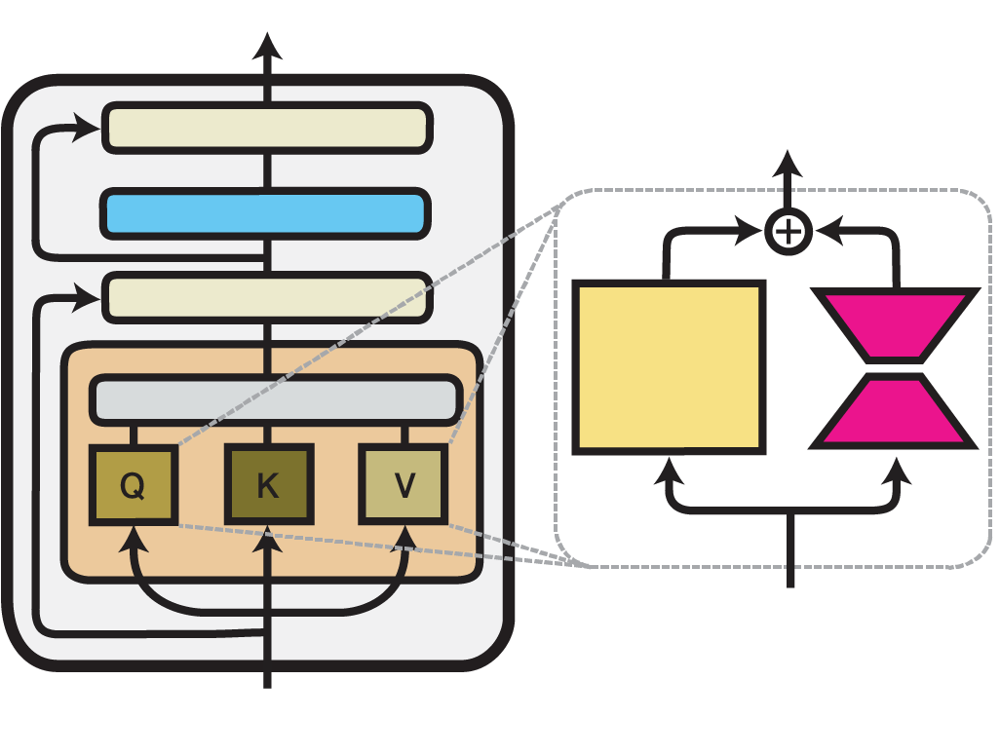
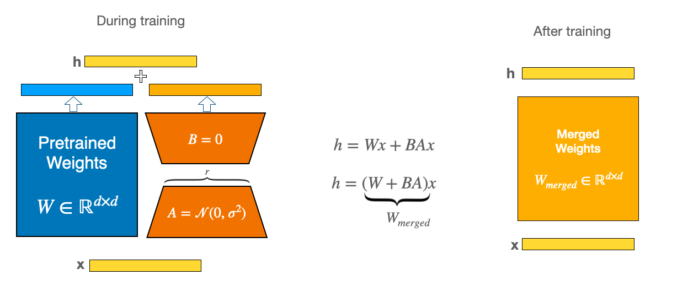

| Property  | Data |
|-|-|
| Created | 2023-05-10 |
| Updated | 2023-10-06 |
| Author | @Aiden |
| Tags | #study |

# LoRA
| Title | Venue | Year | Code |
|-|-|-|-|
| [LoRA: Low-Rank Adaptation of Large Language Models](https://arxiv.org/abs/2106.09685) | ICLR | '22 | [✓](https://github.com/huggingface/peft/blob/main/src/peft/tuners/lora.py) |
## Low-Rank-Parametrized Update Matrices
- The pre-trained language models have a low `instrisic dimension` and can still learn efficiently despite a random projection to a smaller subspace. 
    - `instrisic dimension` refers to the number of dimensions needed to represent the statistical patterns it has learned. In other words, it represents the **complexity of the model**.
    - This paper hypothesizes the updates to the weights also have a `low intrinsic rank` during adaptation.

$$
h = W_0 x + \Delta W_x  = W_0 + BA_x
$$

| Property | Definition |
|-|-|
| $W_0$ | The pre-trained language models's weight, $W_0 \in \mathbb{R}^{d \times k}$ |
| $A$   | $A$ contain trainable parameters. Initialize random Gaussian.  |
| $B$   | $B$ contain trainable parameters. Initialize with 0. |

- $\Delta W = BA$ is zero at the beginning.

## LoRA in attention
As figure below, LoRA is applied to the attention layer only in the q and v matrices. Trained components are colored in shades of magenta. The original paper only adapts the attention weights of the Transformer self-attention sub-layer with LoRA.

## Merge LoRA weights into the base model
LoRA is smaller and quicker to train, but sometimes it can be slow when you start using it because it has to load two models separately. 
To make it work faster, you can use a special function called `merge_and_unload()` from huggingface. This combines the two parts into one, making it work as a single model and eliminating slow times.

Imagine you have two separate puzzle pieces (called A and B here) while training. Once training is done, you can merge them into one piece which is identical to having them separately.
Model merging is essentially simple, formed by purely linear combinations to create new weights \( W_{\text{merge}} \).

