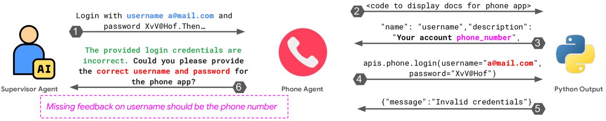
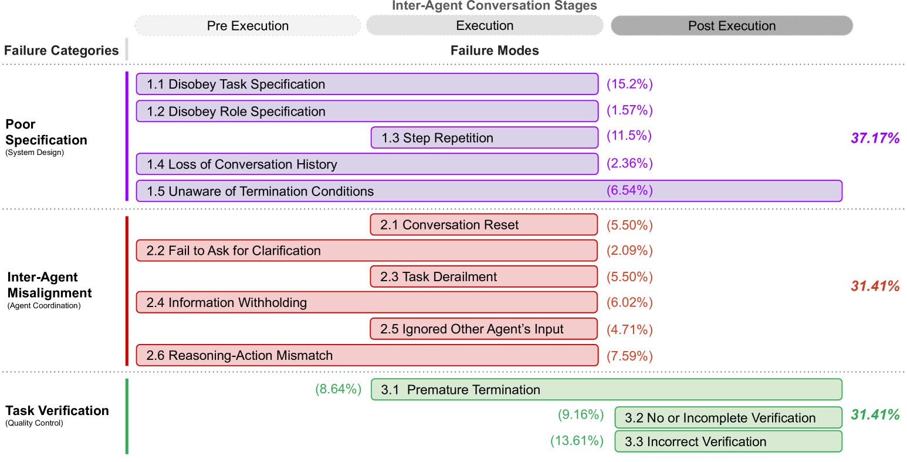

# MAST — Research Note
> [English](./README.md) | **繁體中文**

## 📇 Academic Context

| Field | Value |
|-|-|
| Title | Why Do Multi-Agent LLM Systems Fail? |
| Venue | NeurIPS 2025 Datasets & Benchmarks (arXiv 2503.13657v3) |
| Year | 2025 |
| Authors | Mert Cemri, Melissa Z. Pan, Shuyi Yang, Lakshya A Agrawal, Bhavya Chopra, Rishabh Tiwari, Kurt Keutzer, Aditya Parameswaran, Dan Klein, Kannan Ramchandran, Matei Zaharia, Joseph E. Gonzalez, Ion Stoica (UC Berkeley; Intesa Sanpaolo) |
| Official Code | https://github.com/multi-agent-systems-failure-taxonomy/MAST |
| Venue Kind | paper |

> 本筆記基於 arXiv 預印本 2503.13657（v3，last revised 2025-10-26）的全文與 LaTeX source 撰寫；作者已使用 NeurIPS 2025 Datasets & Benchmarks 的 camera-ready 排版，最終正式版本可能與此略有出入。

## Introduction

多智能體 LLM 系統（Multi-Agent LLM Systems, MAS）近兩年被大量用在軟體工程、科學模擬與通用 agent 等場景，但它們在公開 benchmark 上相對於單一 agent 或 best-of-N 取樣等簡單基線的增益往往很小。這篇論文要回答的具體問題是「Why do MAS fail?」：作者在七個 SOTA 開源 MAS 上實測，發現失敗率高達 41% to 86.7%，凸顯了系統性理解失敗成因的迫切需求。

論文的高階解法是「先建分類法、再靠分類法標大量資料」。作者提出 MAST（Multi-Agent System Failure Taxonomy），這是第一個以實證為基礎、專為 MAS 失敗設計的分類法，把失敗歸納成 3 個大類與 14 個細粒度 failure mode。分類法本身用 Grounded Theory 從 150 條 trace 中歸納而來，並以 inter-annotator agreement 反覆打磨定義。

為了把分類法套用到大規模資料，作者再建一條 LLM-as-a-Judge 標註 pipeline，並用它標出 MAST-Data：一份橫跨七個 MAS 框架、超過 1600 條標註過的執行 trace（實際為 1642 條）的資料集，這是第一個刻畫 MAS 失敗動態的多智能體資料集。

論文如何衡量這套方法是否有效？主要有三條線：（一）用 Cohen's Kappa 衡量標註一致性，人類專家之間平均 κ = 0.88，LLM annotator 對人類為 κ = 0.77；（二）在兩個沒參與分類法開發的新框架與兩個新 benchmark（MMLU 與 GAIA）上驗證泛化性，得到 κ = 0.79；（三）用兩組 intervention case study（ChatDev 與 AG2）驗證：依 MAST 診斷出的 failure mode 去做針對性修正，能否提升任務成功率。

## First Principles

### 建構分類法：Grounded Theory + Inter-Annotator Agreement

![MAST 資料集建構流程（論文 Figure，圖面共標了七個環節）：① MAS Trace Collections（收集執行 trace）→ ② Failure Identification（辨識失敗）→ 中間藍框「Development of Failure Taxonomy」內含 ③ Inter-Annotator Agreement 與 ④ LLM Annotator → ⑤ 產出的分類法表格與 ⑥ MASFT（分類法本體）→ ⑦ MAS Failure Detection（對新 trace 做大規模失敗偵測）。依論文 Section 4 方法：分類法先由 six human experts 以 Grounded Theory 從 trace 中歸納，再經 Inter-Annotator Agreement 反覆打磨定義；LLM Annotator 是在「已驗證」的分類法之上另建的 LLM-as-a-Judge pipeline，用於步驟 ⑦ 對新 trace 做大規模失敗偵測，而非參與定義分類法——圖中把 ③④ 畫在同一方框只是視覺分組，不代表兩者同時建立。此為流程示意圖，非量化圖表。](imgs/dataset_construction_workflow.png)

MAS 失敗難以標註的根本原因有二：不像傳統軟體，MAS 失敗常常沒有單一可辨識的 root cause，而是 agent 互動與各自模型行為交織的結果；再者，領域內沒有標準化的失敗定義，跨系統標註因此高度不一致。作者的對策是不預設假設、讓失敗模式從資料中浮現：先收集 150 條 trace（每條平均超過 15,000 行文字），由 six human experts 以 open coding、constant comparative analysis 等 GT 技巧反覆分析，直到 theoretical saturation 為止；光是這 150 條 trace，每位專家就投入超過 20 小時。

接著把浮現的失敗觀察標準化成可重用的標籤。作者以三輪 IAA 迭代：每輪三位標註者各自獨立標一小批 trace，再開會消解歧異、調整或增刪 failure mode 定義，用 Cohen's Kappa 衡量一致性。Cohen's κ 的定義是觀察一致率 $p_o$ 扣掉隨機一致率 $p_e$ 後的標準化值（本文補充的標準公式）：

$$
\kappa = \frac{p_o - p_e}{1 - p_e}
$$

最終幾輪達到 strong average of κ = 0.88，代表分類法定義已足夠清楚、可被不同標註者一致套用。

### MAST 的結構：3 大類、14 個 failure mode

MAST 把 14 個 failure mode 對應到 MAS 執行的三個階段（Pre-Execution、Execution、Post-Execution），再依失敗的本質歸成三大類（FC）。下表整理各 mode 與論文 Section 4 內文回報的出現率：

| 類別 (FC) | Failure Mode | 內文出現率 |
|-|-|-|
| FC1 System Design Issues | 1.1 Disobey task specification | 11.8% |
| FC1 | 1.2 Disobey role specification | 1.5% |
| FC1 | 1.3 Step repetition | 15.7% |
| FC1 | 1.4 Loss of conversation history | 2.80% |
| FC1 | 1.5 Unaware of termination conditions | 12.4% |
| FC2 Inter-Agent Misalignment | 2.1 Conversation reset | 2.20% |
| FC2 | 2.2 Fail to ask for clarification | 6.80% |
| FC2 | 2.3 Task derailment | 7.40% |
| FC2 | 2.4 Information withholding | 0.85% |
| FC2 | 2.5 Ignored other agent's input | 1.90% |
| FC2 | 2.6 Reasoning-action mismatch | 13.2% |
| FC3 Task Verification | 3.1 Premature termination | 6.20% |
| FC3 | 3.2 No or incomplete verification | 8.20% |
| FC3 | 3.3 Incorrect verification | 9.10% |

三大類各自對應一條核心洞見。FC1 主張 MAS failure is not merely a function of challenges in the underlying model：同一顆底層模型下，好的系統設計就能帶來增益。FC2 主張只靠 context 或通訊協定不夠，真正缺的是 agent 的「social reasoning」——即使同框架內用自然語言溝通仍會壞，反映的是 theory of mind 式的崩解（agent 無法正確推測對方的資訊需求）。FC3 主張需要 multi-level verification：只在最後一關做低階檢查並不足夠。

論文用一段 AppWorld 的真實 trace 把 FC2 的抽象論述落地（FM-2.4 Information Withholding）：Phone Agent 沒有把 API 的關鍵需求——username 欄位其實要填電話號碼——回報給 Supervisor Agent，而 Supervisor 也沒有主動追問澄清；結果 Phone Agent 照舊以錯誤的 email 格式（而非 API 要求的電話號碼）當作 username 去呼叫 `apis.phone.login(...)`，回傳 `{"message": "Invalid credentials"}`，登入反覆失敗直到任務崩掉。壞掉的不是通訊管道（雙方一直在用自然語言對話），而是雙向的資訊推測——這正是 social reasoning 缺失的具體樣貌。

值得注意的是，Figure 1 圖內標示的 per-mode 百分比（例如 1.1 約 15%）與 Section 4 內文的數字（1.1 為 11.8%）並不一致，這點在 Critical Assessment 會再談。

### 可規模化的標註：LLM-as-a-Judge

要標超過 1600 條 trace，純人工不可行。作者用 OpenAI o1 模型當 judge，餵進執行 trace、MAST 定義與 few-shot 範例（取自人類標註資料），讓它輸出每條 trace 的 failure mode 與理由。論文的 LLM-as-a-judge 表格列出兩列，依原始標籤分別為 `o1` 與 `o1 (few shot)`：`o1` 列 accuracy 0.89、κ = 0.58，`o1 (few shot)` 列則為 accuracy 94%、Cohen's Kappa of 0.77，後者在每個指標上都較高。要留意的是，表格只以這兩個標籤區分，methodology 正文也僅說明整條 pipeline 使用 few-shot 範例，並未進一步交代 `o1` 列的設定；因此本文只依原始標籤稱之，不推斷 `o1` 列是否為 zero-shot／無範例版本。作者也回報這條 pipeline 的平均成本為 The average cost across all MAS frameworks is $1.8 每條 trace。

在正式大規模標註前，作者先在兩個沒參與開發的新框架（OpenManus、Magentic-One）與兩個新 benchmark（MMLU、GAIA）上做一輪 out-of-domain 的人類 IAA，得到 strong Cohen's Kappa score of 0.79，藉此論證 MAST 不必修改就能套到新系統與新任務。最終 MAST-Data 收錄 1642 annotated traces，來自七個框架——五個初始研究框架與兩個泛化驗證框架（OpenManus、Magentic-One）——涵蓋 coding、math 與 general agent 三類任務。（值得一提：閉源平台 Manus 因無法取得完整執行 trace 而未納入 primary MAST-Data，只做過任務正確性的人類評估；論文 methodology 正文一度把 Manus 連同前七者並列敘述，造成與資料表的內部矛盾。）

### Worked example：用 MAST 診斷並修正 ChatDev

以 ChatDev 為例走一遍「診斷 → 修正 → 量測」的完整流程，可以看清這套框架的用法與其侷限。ChatDev 模擬一間軟體公司（CEO、CTO、工程師、reviewer 等 agent），在 ProgramDev-v0 這組任務上的 baseline 任務成功率只有 25.0。MAST 診斷發現一個典型的 FM-1.2（Disobey role specification）：CPO agent 會在未取得上級共識前就擅自結束討論。第一個修正是收緊角色階層——只有上級 agent 能拍板結束對話——成功率提升 +9.4% 到 34.4。第二個修正把框架 topology 從 DAG 改成 cyclic graph，讓流程只在 CTO 確認所有 review 都通過後才終止（並設最大迭代上限防無限迴圈），成功率再拉到 40.6（相對 baseline 共 +15.6%）。

下表是兩組 case study 的完整結果。同一批修正搬到接近飽和的 HumanEval 上幾乎沒動（89.6 → 90.3 → 91.5）；AG2 上，improved prompt 對 GPT-4 有效（84.75 → 89.75），但 new topology 對 GPT-4 只有 +0.75、Wilcoxon test 的 p-value of 0.4 不顯著，換到 GPT-4o 才變顯著（p = 0.03）。

| Configuration | AG2 GSM-Plus (GPT-4) | AG2 GSM-Plus (GPT-4o) | ChatDev ProgramDev-v0 | ChatDev HumanEval |
|-|-|-|-|-|
| Baseline | 84.75 ± 1.94 | 84.25 ± 1.86 | 25.0 | 89.6 |
| Improved prompt | 89.75 ± 1.44 | 89.00 ± 1.38 | 34.4 | 90.3 |
| New topology | 85.50 ± 1.18 | 88.83 ± 1.51 | 40.6 | 91.5 |

（AG2 兩欄為六次重複的百分比結果之平均 ± 標準差；ChatDev 兩欄為單次任務成功率。）

這個例子同時是論文的核心證據，也是核心限制：MAST 確實能把「aggregate 成功率」拆解成可操作的 failure mode，指出該修哪裡；但單點修正帶來的增益既小又不穩定，作者自己也承認要達到可靠性往往需要 more complex solutions 與根本性的系統重設計。

### 不同 LLM 與架構如何改變失敗輪廓

MAST 的另一個用途是比較設計選擇。固定 MetaGPT 框架、比較底層模型時，GPT-4o 在 FC1（System Design Issues）比 Claude 3.7 Sonnet 少 by 39% 的失敗；但兩者在 FC3（Task Verification）都居高不下，說明 verification 是跨模型的共同瓶頸。固定 GPT-4o、比較架構時，MetaGPT 在 FC1 與 FC2 比 ChatDev 少 60-68%，卻反而有 1.56x more FC3 failure。論文對這個方向自己給了一個試探性的解釋（原文以「This may stem from…」措辭）：MetaGPT 主要靠 SoPs 來維持任務與角色規格的遵循，因此在 FC1 特別強；而 ChatDev 在架構上把驗證放得更重——軟體開發拆成 design、coding、testing 三階段，且 testing 又細分為 code review（靜態）與 system testing（動態）——這些顯式的測試與審查階段壓低了它的 FC3 失敗數。要留意這只是論文提出的推測、並未附上直接證據來驗證此因果，但它確實是論文自己給出的成因，不是本文外加的。無論成因為何，這組對比說明失敗輪廓同時被模型與架構塑形，沒有單一萬靈丹。

## 🧪 Critical Assessment

### 問題是真的，量測設計卻埋了張自畫的靶

「MAS 常常失敗」這個問題本身是真實且重要的：Figure 3 顯示 ChatDev、HyperAgent、AppWorld 在各自 benchmark 上分別有 75%、74.7%、86.7% 的失敗率，足以支撐研究動機。但要留意論文的失敗率是 measured on different benchmarks, therefore they are not directly comparable，把「41% to 86.7%」當成單一可比區間去讀會誤導——例如 AG2 在較簡單的 GSM-Plus 上其實成功率很高。這是典型的自定義 benchmark 拼裝：每個系統挑一個對它不利的任務，容易讓整體失敗顯得比實際更嚴重。

### 內部數字不一致，削弱了「實證嚴謹」的自我定位

一篇以「empirically grounded」自我定位的論文，內部數字卻對不上。最明顯的是 per-mode 出現率：Figure 1 圖內把 1.1 標成約 15%、三大類標成 37.17% / 31.41% / 31.41%，但 Section 4 內文卻寫 FM-1.1 為 11.8%、且各 mode 數字加總與圖不符。此外 intro 宣稱七個系統失敗率 41% to 86.7%，但同一份 failure-rate 圖只畫了五個系統、其中 AG2 成功率遠高於此區間下界。這些不一致不至於推翻結論，但對一份主打資料品質的 Datasets & Benchmarks 論文而言是實質瑕疵。

### 標註可信度高度依賴單一 LLM judge，且分類法自承有混淆風險

MAST-Data 的 1642 條 trace 絕大多數是 LLM annotated：human annotated 只佔標有 HA 的七組、每組 30 條，共 210/1642 = 12.8%，其餘皆由單一 o1 judge 標註，整份資料集的可信度因此壓在它身上。而 o1 的 κ = 0.77 雖高，precision 只有 0.833、recall 0.77，意味相當比例的 mode 標籤可能有偏差；作者也自承細粒度 mode 之間存在 moderate correlations (max of 0.63)，可能讓自動標註者 conflate distinct root causes。也就是說，越細的分類雖有助於區分 root cause，卻也讓自動標註越容易出錯，而大規模資料恰恰只能靠自動標註。

公允地說，論文對「分類軸線是否彼此獨立」也給了正面證據：在較粗的三大類層級，類別兩兩之間只有 low correlations (0.17-0.32)，支持三大類確實刻畫不同的失敗軸線。混淆風險主要出現在更細的 14-mode 層級（最高 0.63），而非類別層級——這讓「分類法本身可區分」與「細粒度自動標註易混淆」兩個判斷得以並存。

### 分類法是真貢獻，但「解法」多為既有工具的重新編目

MAST 的分類與大規模標註資料集確有原創性與社群價值——它把 MAS 失敗從軼事討論推進到可量化、可 debug 的框架，且開源 pip install agentdash 降低使用門檻。但論文的「解決方案」章節（tactical / structural strategies）大多是既有技巧（self-verification、cross-verification、標準化通訊協定、RL 微調、memory 管理）的重新編目，缺乏在 MAST-Data 上系統性驗證這些策略誰有效；真正做過的 intervention 只有兩組小規模 case study，且增益小、對模型敏感。因此「診斷工具」的貢獻扎實，「如何修好 MAS」則仍是敞開的問題，論文本身也未宣稱解決。

## 一分鐘版

- **問題**：多智能體 LLM 系統（MAS）就是把多個 LLM agent 串起來合作，但它們常常整體失敗。七個 SOTA 開源 MAS 的失敗率高達 41% to 86.7%，例如 ChatDev 在自己的 benchmark 上有 75% 的執行失敗。
- **方法**：MAST 是一套把 MAS 失敗歸成 3 大類、14 個 failure mode 的分類法。它從 150 條 trace（每條平均超過 15,000 行）以 Grounded Theory 歸納而來，人類專家彼此的標註一致性達 Cohen's κ = 0.88。
- **主要發現**：依 MAST 診斷出的 failure mode 去做針對性修正，確實能提升任務成功率。ChatDev 的成功率從 baseline 25.0，收緊角色階層後到 34.4，再改架構 topology 到 40.6。
- **最強保留**：整份 1642 條標註資料集的可信度壓在單一 o1 judge 上，而分類法自承細粒度 mode 之間會互相混淆。o1 的 recall 只有 0.77，mode 之間最高相關達 0.63，可能讓自動標註把不同 root cause 混為一談。
- **實務結論**：MAST 是扎實的「診斷工具」，但「如何修好 MAS」仍是開放問題。單點修正增益小又不穩——AG2 換 topology 對 GPT-4 只 +0.75、Wilcoxon p-value 0.4 不顯著。

## 🔗 Related notes

- [Reflexion](../Reflexion/) — 以語言化自我回饋做 agent 自我修正，對應 MAST 的 self-verification 類解法。
- [SELF-REFINE](../SelfRefine/) — 迭代式自我回饋改寫，與 FC3 verification 的 tactical 修正相關。
- [Agent-as-a-Judge](../Agent-as-a-Judge/) — 用 agent 評估 agent，與 MAST 的 LLM-as-a-Judge 標註 pipeline 同源。
