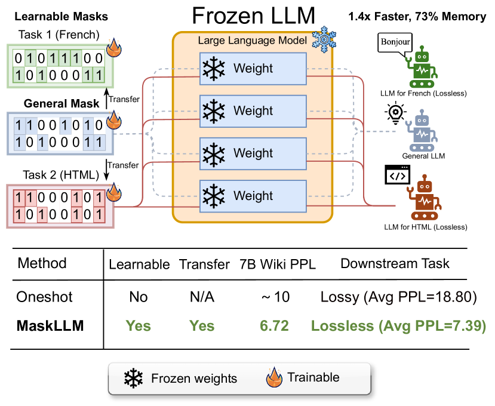
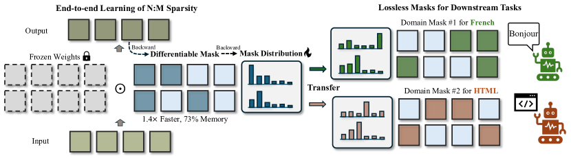
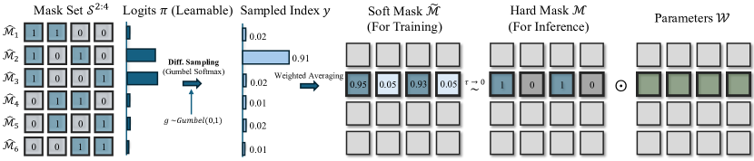

# MaskLLM — Research Note

## 📇 Academic Context

| Field | Value |
|-|-|
| Title | MaskLLM: Learnable Semi-Structured Sparsity for Large Language Models |
| Venue | NeurIPS 2024 |
| Year | 2024 |
| Authors | Gongfan Fang, Hongxu Yin, Saurav Muralidharan, Greg Heinrich, Jeff Pool, Jan Kautz, Pavlo Molchanov, Xinchao Wang (NVIDIA, National University of Singapore) |
| Official Code | https://github.com/NVlabs/MaskLLM |
| Venue Kind | paper |

> 說明：本筆記的全文證據取自 arXiv e-print 的 camera-ready 原始碼（`maskllm_camera_ready.tex`，NeurIPS 2024 final 版式），數值與公式皆以該 `.tex` 為準。

## First Principles

MaskLLM 要解的問題是**半結構化剪枝（semi-structured pruning）中的 N:M 稀疏**：在每連續 M 個權重中至多保留 N 個非零值。之所以鎖定 N:M 而非任意非結構化稀疏，是因為 N:M 這種規則排列對 GPU 等加速器友善，能同時拿到「結構化的加速」與「細粒度稀疏的彈性」。本文主力設定為 2:4，也就是每四個連續參數留兩個、清掉兩個。

把稀疏化寫成一個**遮罩選擇（mask selection）**問題後，候選集合的大小是一個組合數。對一個由四個連續參數組成的區塊 $\mathcal{W} \in \mathbb{R}^{1\times4}$，2:4 的二元遮罩必須剛好含兩個零，因此候選集只有下式這 6 種：

$$
\mathbf{S}^{2:4} = \{\mathcal{M} \in \mathbb{B}^{1\times4} \mid \textstyle\sum \mathcal{M} = 2\} = \{[1,1,0,0], [1,0,1,0], [1,0,0,1],[0,1,0,1],[0,1,1,0],[0,0,1,1]\}
$$

一般化的候選集大小是 $|\mathbf{S}|=\binom{M}{N} = \frac{M!}{N!(M-N)!}$，2:4 時 $\binom{4}{2}=6$。單一區塊只有 6 種選擇看似簡單，真正的困難在於**規模**：論文指出一個完全 2:4 稀疏化的 LLaMA-2 7B 的稠密層裡有 16 億（1.6 billion）個 2:4 遮罩要決定，整體是一個天文數字的組合最佳化問題。

$$
\{\mathcal{M}_i^{*}\} = \operatorname{argmin}_{\{\mathcal{M}_i \in \mathbf{S}^{2:4}\} } \mathbb{E}_{x\sim p(x)} \left[ \mathcal{L}_{LM}(x; \{\mathcal{W}_i \odot \mathcal{M}_i\}) \right]
$$

上式就是理想目標：在觀測資料上，找一組遮罩讓剪枝後的語言模型損失 $\mathcal{L}_{LM}$ 最小；$\odot$ 是逐元素相乘。問題是遮罩的挑選本身是離散、不可微分的，無法直接對它做反向傳播。既有做法（如 SparseGPT、Wanda）繞過這點的方式是用一小份校正集（calibration set）搭配手工設計的重要性準則來估哪些權重可刪，但這帶來兩個結構性弱點：其一，小校正集不足以代表 LLM 在龐大多樣語料裡學到的知識，論文觀察到把校正集擴大到超過 256 筆後結果不再改善；其二，用手工準則當作「剪枝真實誤差」的代理，本身就會累積估計誤差。

MaskLLM 的核心手法是把「選遮罩」重寫成「**抽樣**」：對每個參數區塊定義一個類別分佈（categorical distribution），類別機率為 $p_1, p_2, \ldots, p_{|\mathbf{S}|}$ 且 $\sum_j p_j = 1$。訓練時若某個被抽到的遮罩剪枝後品質好，就提高它的機率；反覆抽樣與更新後，高機率的遮罩就是剪枝後仍能維持品質的遮罩。於是目標從對離散遮罩的最佳化，變成對機率分佈的最佳化：

$$
\{p^{*}(\mathcal{M}_i)\} = \operatorname{argmin}_{\{p(\mathcal{M}_i)\}} \mathbb{E}_{x\sim p(x),\, \mathcal{M}_i \sim p(\mathcal{M}_i)} \left[ \mathcal{L}_{LM}(x; \{\mathcal{W}_i \odot \mathcal{M}_i\}) \right]
$$

但從類別分佈抽樣一樣不可微分。作者借用 **Gumbel Softmax** 這個重參數化技巧解決：先用 Gumbel Max 把抽樣的隨機性外包給一個獨立噪聲變數 $g_i=-\log(-\log \epsilon_i),\ \epsilon_i \sim U(0,1)$，得到硬性的 one-hot 索引 $y=\text{onehot}(\operatorname{argmax}_i [\log(p_i) + g_i])$；接著用 Softmax 取代不可微的 argmax，得到一個溫度 $\tau$ 控制的軟索引：

$$
\tilde{y}_i = \frac{\exp((\log(p_i) + g_i) / \tau)}{\sum_j \exp( (\log(p_j) + g_j) / \tau )}
$$

當溫度 $\tau \rightarrow 0$ 時軟索引會趨近 one-hot。有了軟索引 $\tilde{\mathbf{y}}$ 這個列向量，再把 6 個候選遮罩疊成矩陣 $\mathbf{S}$（第 $i$ 列是候選 $\hat{\mathcal{M}}_i$），一次矩陣乘法就得到可微分的「軟遮罩」——它其實是候選遮罩依軟索引加權後的平均：

$$
\tilde{\mathcal{M}} = \tilde{\mathbf{y}} \times \mathbf{S}=\sum_{i=1}^{|\mathbf{S}|} \tilde{y}_i \cdot \hat{\mathcal{M}}_i
$$

實務上作者不直接學機率，而是學 logits $\pi_i$，再配一個縮放因子 $\kappa$ 得到 $p_i = \frac{\exp(\pi_i \cdot \kappa)}{\sum_j \exp( \pi_j \cdot \kappa ) }$。這個 $\kappa$ 是控制「探索 vs 收斂」的關鍵旋鈕：$\kappa$ 太大時 logits 壓過 Gumbel 噪聲，抽樣幾乎固定、失去探索；$\kappa$ 太小時噪聲主導、遮罩一直變動、收斂很慢。論文全程用 $\kappa$ 從 1e2 線性升到 5e2。

作者另外發現一個實務坑：剪枝會把部分參數清零，導致梯度消失、傷害後續的下游轉移與微調。為此加入**稀疏權重正則化（Sparse Weight Regularization）**，鼓勵剩餘權重維持夠大的量級，形成最終學習目標：

$$
\min_{\{p_{\pi}(\mathcal{M}_i)\}} \mathbb{E}_{x, \tilde{\mathcal{M}}_i \sim p_{\pi}(\mathcal{M}_i)} \left[ \mathcal{L}_{LM}(x; \{\mathcal{W}_i \odot \tilde{\mathcal{M}}_i\}) \right] - \lambda \sum_i \|\mathcal{W}_i \odot \tilde{\mathcal{M}}_i\|^2_2
$$

第二項由 $\lambda$ 加權，論文用 $\lambda=$ 1e-5；表 8（附錄）顯示 GPT-3 2B 前 500 步的平均梯度範數會從無正則化的 0.219 提升到 0.542（1e-5）與 0.559（1e-4），佐證它確實維持了梯度。

最後是**遷移學習（transfer learning）**的部分。既然學的是機率分佈，就能用預先算好的遮罩來初始化 logits，加速收斂。作者提出 Mask Prior：給定一個先驗遮罩 $\mathcal{M}_0$（可來自 Magnitude、SparseGPT 或 Wanda），計算它與各候選遮罩的相似度並重新置中，再依相似度調整初始 logits：

$$
\pi_i^{\prime} = \pi_i + \sigma(\pi)* \text{sim}(\mathcal{M}_0, \hat{\mathcal{M}}_i) * \alpha
$$

其中 $\sigma(\pi)$ 是 logits 的標準差、$\alpha$ 控制先驗強度；$\alpha=0$ 時等於不用任何先驗、純粹從頭學。整個訓練流程可濃縮成下面的演算法：

```text
Algorithm 1  MaskLLM: Learnable 2:4 Semi-Structured Sparsity
  S = { [1,1,0,0], [1,0,1,0], ... , [0,0,1,1] }          # 6 個 2:4 候選遮罩
  # 對所有參數區塊 W 平行執行：
  初始化 logits  π_i ~ N(0, σ)
  以先驗遮罩 M0 更新    π'_i = π_i + σ(π) * sim(M0, M̂_i) * α
  while 訓練未結束:
      # 可微分抽樣
      ỹ_i = softmax((π_i·κ + g_i)/τ),  g_i = -log(-log ε_i),  ε_i ~ U(0,1)
      M̃   = ỹ × S = Σ_i ỹ_i · M̂_i
      以梯度更新 logits:  ∇_π [ L_LM(x; W ⊙ M̃) - λ‖W ⊙ M̃‖² ]
  k  = argmax(π)
  M* = M̂_k                                                # 推論時的最終硬遮罩
```

**一個具體的前向例子（數字取自論文，示意用的權重數值為本筆記自訂並標記為 ours）。** 取一個 2:4 區塊，設其四個權重為 $\mathcal{W}=[0.8, -0.1, 0.5, 0.05]$（ours）。候選集就是上面 6 個遮罩。若以 Magnitude 先驗初始化，最大量級的兩個位置是第 1、3 格（$|0.8|,|0.5|$），對應候選 $\hat{\mathcal{M}}_2=[1,0,1,0]$，於是 Mask Prior 會抬高 $\pi_2$。訓練期間 Gumbel 噪聲仍讓模型偶爾抽到別的候選（例如 $[1,1,0,0]$）去試探，但只要那些選擇讓 $\mathcal{L}_{LM}$ 變差，其 logits 就被壓低。2,000 步後 $\operatorname{argmax}(\pi)$ 落在 $[1,0,1,0]$，最終硬遮罩把區塊剪成 $\mathcal{W}\odot\mathcal{M}^*=[0.8, 0, 0.5, 0]$。把這個機制平行套到 LLaMA-2 7B 的 16 億個區塊、凍結權重只學遮罩、跑 2,000 步後，Wikitext PPL 從 SparseGPT 的 10.42 降到 6.72，接近稠密模型的 5.12。

下表是論文主結果（凍結權重、只學遮罩；SparseGPT 一欄有做權重更新），一次看清 MaskLLM 相對三個 2:4 基線的位置（Wikitext PPL，越低越好；括號旁為七項 zero-shot 任務平均準確率 Avg.）：

| Method (LLaMA-2 7B) | Wikitext PPL | Avg. (7 tasks) |
|-|-|-|
| Dense（稠密上界） | 5.12 | 57.16 |
| Magnitude | 54.71 | 46.19 |
| SparseGPT（含權重更新） | 10.42 | 47.16 |
| Wanda | 11.29 | 45.98 |
| MaskLLM（凍結權重） | 6.72 | 52.09 |

在 LLaMA-2 13B、Nemotron-4 15B、GPT-3 2B/843M 上有一致的趨勢：MaskLLM 的 PPL 全面優於三個基線。先驗的效果也很明顯——LLaMA-2 7B 在「無先驗」時只能學到 9.12 PPL，換上 Magnitude 先驗後降到 6.77、SparseGPT 先驗降到 6.72，說明「先驗初始化 + 端到端精修」比單獨任一者都好。







在下游應用面，論文主張學到的遮罩可以「無損」地把凍結 LLM 適配到特定領域：對 GPT-3 2B，直接沿用通用遮罩會退化到平均 PPL 10.61、從頭訓練專家遮罩為 7.51，而以通用遮罩當先驗再遷移可達 7.39，甚至略優於稠密的 7.42。成本面上，每個任務只需儲存遮罩、共用同一份權重：以簡單算術編碼每參數僅 0.65 bits（$\log_2(6)/4$），相對存整份 16-bit 微調權重是約 25 倍的儲存節省；在 A6000 上以 TensorRT-LLM 跑 batch size 1，2:4 稀疏帶來約 1.4 倍（實測 1.36–1.41 倍）吞吐加速與約 27% 記憶體節省。

## 🧪 Critical Assessment

### 2:4 稀疏的硬體現實與小校正集的結構限制
N:M 稀疏是真實且有硬體支撐的問題，而非人造需求：Ampere 之後的 NVIDIA GPU 對 2:4 有原生加速，論文也附上 TensorRT-LLM 的實測吞吐（LLaMA-2 7B 約 1.36–1.41×、13B 約 1.50–1.57×），代表 PPL 的改善確有落地路徑，不是只停在紙面指標。作者對既有方法弱點的診斷也站得住腳：小校正集（>256 筆後不再改善）與手工重要性準則作為剪枝真實誤差的代理，確實是 SparseGPT/Wanda 路線的結構限制。

### 評測落在 PPL 與 zero-shot，缺少生成品質的直接驗證
基線涵蓋 Magnitude、SparseGPT、Wanda 三條主線，附錄再補上 ADMM-Iter、GBLM、RIA、Pruner-Zero 等 SOTA，且明確標注 SparseGPT「有做權重更新」而 MaskLLM「凍結權重」，比較條件揭露得相對誠實。消融面向也算完整：先驗類型、縮放因子 $\kappa$、Gumbel 溫度 $\tau$、先驗強度 $\alpha$、稀疏正則化、層敏感度都有掃過。可質疑處在於指標偏重 Wikitext PPL 與 zero-shot 準確率——PPL 對稀疏擾動敏感、但與真正的生成品質（長文一致性、指令遵循）並非線性對應，論文並未提供這類端到端的下游生成評測。

### 成本被低估：真實開銷藏在訓練端
「凍結權重、只學遮罩」聽起來很輕，但學遮罩本身的代價不小：LLaMA-2 7B 要 64 張 A100、8-way tensor parallel、跑 2,000 步共約 1,280 GPU 小時，13B 更是約 2,304 GPU 小時。相對地 SparseGPT/Wanda 是「一次性、少量校正、幾乎不訓練」。因此 MaskLLM 的 PPL 優勢是用「數個數量級更高的算力」換來的；論文的敘事把重點放在品質提升，但這個算力量級差異對「誰該用哪個方法」的實務決策其實非常關鍵，值得更醒目地並列。

### 把已知技巧放大到十億級凍結 LLM，與作者自訂的「無損」門檻
核心組件（Gumbel Softmax、可學習稀疏遮罩、先驗初始化）在視覺模型與更早的可學習稀疏文獻中都已存在，本文自己也坦承是「首次」把這套搬到凍結的、十億級參數規模的 LLM 上。因此它的貢獻更接近「把已知技巧成功放大到新規模並解決放大時才浮現的問題（梯度消失→稀疏權重正則化）」，而非全新機制。這是紮實的工程貢獻，但把它讀成方法論上的重大突破會高估其原創性。另外「無損（lossless）」一詞用得偏寬：下游 PPL 7.39 vs 稠密 7.42 只是在該指標上打平，稱其為「無損壓縮」是作者以自身指標定義的達標門檻，並不等於任意任務、任意指標下都不掉分。

### 宣稱的問題是否真的解決、以及現實相關性
在「以更多算力、對凍結權重學出更好的 2:4 遮罩」這個被收窄的命題上，證據是充分的：多個模型家族、一致優於基線、且有部署數據。但更大的敘事——「N:M 稀疏可對 LLM 達成無損壓縮」——被證據支持的程度弱於字面主張：它成立於特定下游領域的 PPL、且以昂貴的每任務遮罩訓練為前提。現實相關性因此是雙面的：對已經大量重複部署同一凍結模型、且能負擔一次性遮罩訓練成本的場景（例如雲端服務商固定服務一顆 LLaMA-2），25× 儲存節省與 1.4× 加速很有吸引力；對算力有限、只想快速壓縮一次的使用者，一次性方法的性價比可能仍勝出。

## 🔗 Related notes

- [AttentionIsAllYouNeed](../AttentionIsAllYouNeed/)
- [Lora](../Lora/)
