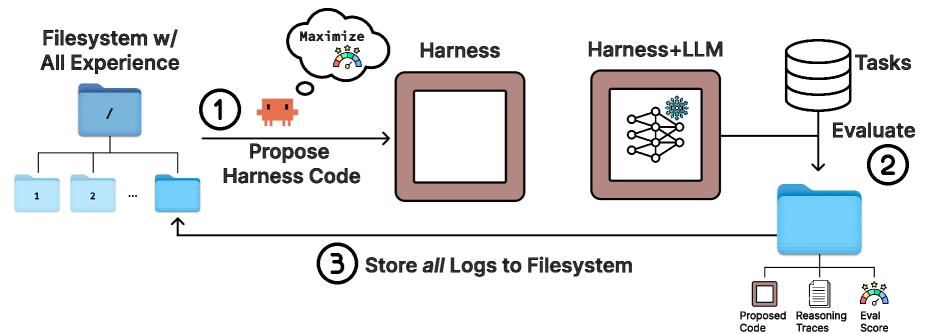
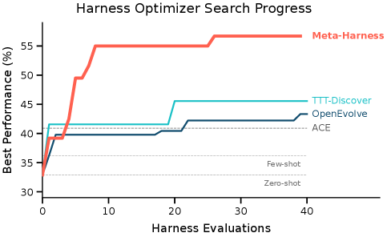

# MetaHarness — Research Note
> [English](./README.md) | **繁體中文**

## 📇 Academic Context

| Field | Value |
|-|-|
| Title | Meta-Harness: End-to-End Optimization of Model Harnesses |
| Venue | unknown |
| Year | 2026 |
| Authors | Yoonho Lee, Roshen Nair, Qizheng Zhang, Kangwook Lee, Omar Khattab, Chelsea Finn |
| Official Code | https://github.com/stanford-iris-lab/meta-harness-tbench2-artifact |
| Venue Kind | paper |

本文作者來自 Stanford、KRAFTON 與 MIT。論文 LaTeX 樣板為 `colm2026_conference`，顯示投稿目標為 COLM 2026，但至撰稿時尚無正式接受紀錄，因此 Venue 以字面 `unknown` 標示，年份取 arXiv 版本的 2026。本文基於 arXiv 全文（`2603.28052`）撰寫，正式會議版可能有出入。

## First Principles

這篇論文問的問題很單純：一個大型語言模型（LLM）的表現，除了權重之外，有多少是被它外圍的「harness」決定的？作者定義的 harness（機殼／外掛程式）指的是決定「要儲存什麼、要檢索什麼、要把什麼呈現給模型」的那段程式碼。論文開頭引用的觀察是——在同一個 benchmark 上，光是換 harness 就能造成 6 倍的表現差距，說明 harness 往往和模型本身一樣重要。過去 harness 幾乎都是人工設計：工程師看失敗案例、調啟發式規則、在少數幾個設計間反覆迭代。作者要問的是，這個迭代過程本身能不能被自動化。

一個自然的起點是既有的「文字最佳化」（text optimization）方法，例如 OPRO、TextGrad、GEPA、AlphaEvolve/OpenEvolve、Feedback Descent，它們都用先前嘗試的回饋來迭代改進提示或程式碼。作者的核心批評是：這些方法對 harness engineering 並不合適，因為它們把回饋壓縮得太兇——有的只看純量分數、有的只看當前候選、有的把回饋限制成短模板或 LLM 生成的摘要。但 harness 是在長時序上作用的：一個「何時儲存、何時檢索、如何呈現」的決定，可能在許多推理步之後才影響行為，壓縮式回饋常把用來追蹤下游失敗的資訊也一併丟掉。

Meta-Harness 的關鍵設計選擇，就是不壓縮：它讓提議者（proposer）透過**檔案系統**存取「完整歷史」。對每一個過去的候選 harness，檔案系統保存它的原始碼、評測分數與執行軌跡（prompts、工具呼叫、模型輸出、狀態更新）。提議者不是把這些塞進單一 prompt，而是用 `grep`、`cat` 這類終端工具選擇性地去查。這裡的提議者本身是一個 coding agent（會呼叫開發工具、會改程式碼的語言模型系統），而不是在固定 prompt 上跑的原始 LLM——因為經驗量很快就超過 context 上限，提議者必須自己決定「要看什麼」並透過與程式庫的直接互動驗證修改。



搜尋迴圈只有三步，如上圖：(1) 提議者讀取含有所有先前候選之原始碼、執行軌跡與分數的檔案系統，提出一個新的 harness 程式；(2) 在評測任務上執行這個 harness；(3) 把該次的所有 log（提出的程式碼、推理軌跡、評測分數）寫進檔案系統的新目錄，然後迴圈重複。作者刻意讓外層迴圈極簡：不設父代選擇規則、不預設固定 scaffold、不強制某種持久記憶機制，提議者可以檢視任何一個先前 harness。這個極簡是有意的——把診斷與編輯決策交給提議者，Meta-Harness 就能隨著 coding agent 變強而自動變好。

形式化的目標很直接。設 $M$ 為固定的語言模型、$\mathcal{X}$ 為任務分佈；對 harness $H$ 與任務實例 $x$，執行一條 rollout 軌跡 $\tau \sim p_M(H, x)$，並以任務獎勵 $r(\tau, x)$ 評分。harness 最佳化的目標是找出使期望最終獎勵最大的 harness：

$$H^{*} = \arg\max_{H}\; \mathbb{E}_{x \sim \mathcal{X},\; \tau \sim p_M(H, x)}\; r(\tau, x)$$

當同時關心多個目標（例如準確率與 context 成本）時，作者改以 Pareto 支配來評比候選，並回報整條 frontier。搜尋的外層迴圈可以寫成下面這個極簡的偽程式碼（改寫自論文 Algorithm 1，符號為我們所加）：

```text
輸入: 任務 X, 語言模型 M, 提議者 P, 迭代次數 N
初始化: 母體 H  (一組有效的種子 harness)
初始化: 檔案系統 D = 空   (儲存 code / scores / traces)
for H in 母體:
    E_H = Evaluate(H, M, X)
    D = D ∪ {(H, E_H)}
for t = 1 .. N:
    P 查詢檔案系統 D            # 檢視先前 harness、分數與軌跡
    P 提出 k 個新的 harness
    for H in 這 k 個候選:
        if H 通過介面驗證:
            D = D ∪ {(H, Evaluate(H, M, X))}
return D 中 harness 的 Pareto frontier
```

在論文的實作中，每個 harness 是一支單檔 Python 程式，提議者 $P$ 是搭配 `Opus-4.6` 的 Claude Code，被評測的基底模型 $M$ 依領域而定且始終凍結。一次典型的搜尋在 20 個迭代內評測約 60 個 harness。為了量化「檔案系統確實被大量使用」，作者在 TerminalBench-2 的搜尋中記錄檔案讀取：提議者每個迭代讀取的檔案數中位數是 82（範圍 69–99），其中約 41% 是先前 harness 原始碼、40% 是執行軌跡。在他們最吃重的設定裡，單次評測可產生高達 10,000,000 個 token 的診斷資訊，比先前文字最佳化最大的回饋預算高出約三個數量級。

### 一個帶真實數字的走查：線上文字分類

把上面的機制落到具體數字，最清楚的是線上文字分類。設定沿用 ACE 的線上協定：LLM（此處為 `GPT-OSS-120B`）逐一收到帶標籤的樣本、更新記憶、再在保留測試集上評測。三個資料集刻意挑得又難又雜：LawBench（法律，215 個罪名類別）、Symptom2Disease（S2D，22 類）、USPTO-50k（化學逆合成，180 類）。搜尋以 zero-shot、few-shot、ACE、MCE 四個 harness 作為種子母體，跑 20 個迭代、每迭代 2 個候選，共產生 40 個候選 harness。

被選出的最佳 harness 叫 Meta-Harness (Label-Primed Query)。它在建構 prompt 時分三段：先放一個「label primer」列出所有合法輸出標籤，再放一個「coverage」區塊為每個標籤放一個與查詢相關的檢索範例，最後放「query-anchored contrastive pairs」把高度相似但標籤不同的範例並排。以 LawBench 為例，模型面對一段案情描述，要在 215 個罪名中選一個——primer 讓 215 個標籤空間完整可見，coverage 區塊提供逐類別的相關判例，contrastive 區塊則銳化查詢附近的決策邊界。最終在 LawBench 上這支 harness 拿到 45.0% 準確率，遠高於 ACE 的 29.0%。

| Harness | USPTO | S2D | Law | Avg Acc | Ctx(K) ↓ |
|-|-|-|-|-|-|
| Zero-Shot | 12.0 | 63.2 | 7.0 | 27.4 | 0 |
| Few-Shot (all) | 15.0 | 78.3 | 29.0 | 40.8 | 12.3 |
| MCE | 14.0 | 83.0 | 23.0 | 40.0 | 28.5 |
| ACE | 16.0 | 77.8 | 29.0 | 40.9 | 50.8 |
| Meta-Harness | 14.0 | 86.8 | 45.0 | 48.6 | 11.4 |



整體來看，被選出的 Meta-Harness 平均準確率 48.6%，比 ACE 高 7.7 分、比 MCE 高 8.6 分；而且這個提升不是靠堆更多 context——它只用 11.4K context tokens，而 ACE 用 50.8K、MCE 用 28.5K，等於在近 4 倍更少的 context 下反而更準。值得注意的是各資料集並非全面領先：在 USPTO 上 Meta-Harness 只有 14.0，輸給 ACE 的 16.0，主要的分數來自 S2D 與 Law。

論文最有說服力的一張消融，是拆開提議者能看到什麼。三種條件：只給分數（scores-only）、給分數加 LLM 摘要（scores + summary）、以及完整介面（可讀原始執行軌跡）。結果差距很大：scores-only 中位數 34.6、最佳 41.3；scores + summary 中位數 34.9、最佳 38.7；而完整介面中位數 50.0、最佳 56.7——連完整介面的「中位候選」都勝過兩個消融版本的「最佳候選」。這強力支持了本文的中心主張：真正關鍵的成分是對原始執行軌跡的存取，摘要非但補不回缺失的訊號，還可能因為壓縮掉診斷細節而有害。

### 另外兩個領域：檢索增強數學與 agentic coding

在檢索增強的奧林匹亞數學上，作者給 Meta-Harness 一個 ≥500,000 題已解題目的語料庫（經去重與去污染），在 250 題搜尋集上跑 40 個迭代、產生 109 個檢索 harness，僅以 `GPT-OSS-20B` 的搜尋集表現選出單一 harness，再拿到 200 道 IMO 等級新題、以及四個搜尋期間未見過的模型上評測。這支發現出來的檢索 harness 在全部五個保留模型上都勝過「不檢索」基準，平均進步 4.7 分；跑在與稀疏基準相同的 BM25 詞彙檢索堆疊上，而沒有另外引入 dense encoder。

在 agentic coding 上，作者用 TerminalBench-2 的 89 個長時序任務，以 Terminus 2 與 Terminus-KIRA 兩個強開源基準為種子。這裡他們把 benchmark 當成「discovery problem」：搜尋與最終評測都在同一份 89 題上進行。在 `Claude Opus 4.6` 上，發現的 harness 達到 76.4% 通過率，超過人工調校的 Terminus-KIRA（74.7%）；在較弱的 `Claude Haiku 4.5` 上提升更大，達 37.6%，勝過次佳的 Goose（35.5%）2.1 分。附錄的定性軌跡顯示提議者的行為值得一看：前兩個迭代把結構性修改和 prompt 模板改動綁在一起、兩者都相對種子基準退步，到第 3 個迭代它明確假設退步是被共用的 prompt 介入所混淆，於是把結構改動與 prompt 改寫分離，最後轉向一個「純加法」的修改（在第一次 LLM 呼叫前用單一 shell 指令抓取環境快照並附到初始 prompt），成為該次搜尋的最佳候選。

## 🧪 Critical Assessment

### 6 倍的 harness 差距讓自動化搜尋成為真問題

harness 對 LLM 系統表現的影響是真實且被廣泛觀察到的，「換 harness 造成 6 倍差距」的引用、以及 TerminalBench-2 上眾多團隊持續手工迭代 harness 的公開紀錄，都支持「自動化 harness 搜尋」是一個有實務價值的問題，而非人造需求。這點我認為站得住腳。

### 「平均進步」的聚合掩蓋了 per-model 的參差

消融（scores-only vs summary vs 完整軌跡）設計得很好，且結論鮮明，是全文最扎實的證據。但幾個度量的呈現方式偏向對自己有利。數學檢索的「平均進步 4.7 分」是相對「不檢索」而算的；若與最接近的固定基準 BM25 比，整體只領先 1.3 分，而且逐模型看並不全面領先——在 `Gem-3F` 上 dense retrieval (k=5) 的 47.2 就高於 Meta-Harness 的 46.3。把優勢集中在「平均」這個聚合量，容易掩蓋 per-model 的參差。文字分類的 USPTO 一欄同樣落後 ACE，顯示增益主要來自特定資料集。

### 用檔案系統暴露完整歷史，是被 coding agent 能力解鎖的系統設計

從演算法骨架看，Meta-Harness 與 AlphaEvolve/OpenEvolve 這類「LLM 當變異算子的程式搜尋」屬同一家族；真正被主張為新的，是「用檔案系統暴露完整歷史」加上「用強 coding agent 當提議者」。這比較像是一個被 2026 年前後 coding agent 能力躍升所解鎖的工程配置，而不是一個全新的搜尋原理——作者自己也把外層迴圈的「極簡」當成賣點。因此我傾向把貢獻定位為「一個及時且有效的系統設計與紮實的實證」，而非方法論上的突破。

### 在同一份 89 題上搜尋又評測，加上選擇性的排名框架

TerminalBench-2 的實驗在同一份 89 題上同時做搜尋與最終評測，沒有獨立的保留切分。作者坦承此點並辯稱這是該社群慣例、且題數太少切分會削弱訊號，並以人工檢視加正則稽核來查字串洩漏。這個處理算誠實，但本質上仍是「在評測集上最佳化」，其分數的外推性應打折扣——這正是一個由方法自身強項來界定成功標準的情況。此外，作者在 Opus 4.6 上其實只排第 2（ForgeCode 以 81.8% 領先 76.4%），卻在摘要與重點框裡選擇性強調「在 Haiku 4.5 上排第 1」，並以「無法從公開程式碼重現 ForgeCode」為由淡化那個更高分——這是可理解但需要讀者自行加註的框架選擇。附錄定性段落又把 Terminus-KIRA 的基準寫成 64.4%，與主表的 74.7% 不一致，來源未交代清楚，值得存疑。

### 命題被支持，但 10^7-token 的評測成本讓一般團隊難以複製

方法確實在三個領域都產出可讀、可轉移的 harness，且能泛化到 OOD 資料集與未見模型，這是實質成果。但成本面被輕描淡寫：單次評測可達 10^7 tokens、一次搜尋約 60 個 harness、提議者用 Opus-4.6 且「最大推理」，「幾小時 wall-clock」的說法掩蓋了可觀的 token 與 API 成本，對多數團隊的可重現性是一大門檻。加上全文只驗證了單一提議者（Claude Code）與每領域偏小的樣本（89 題 / 200 題 / 3 個資料集），我認為「harness 搜尋可自動化」這個命題被支持，但「對一般團隊實用」則尚待更廉價、跨提議者的驗證。

## 🔗 Related notes

<!-- 目前 domains/natural_language_processing 下無可安全解析的直接相關筆記，保留標題並留空。 -->
