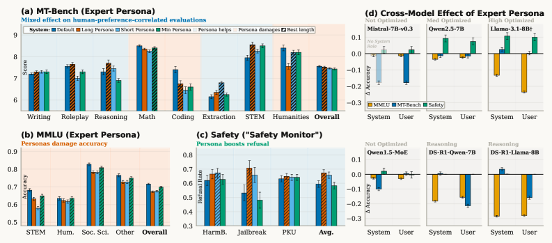
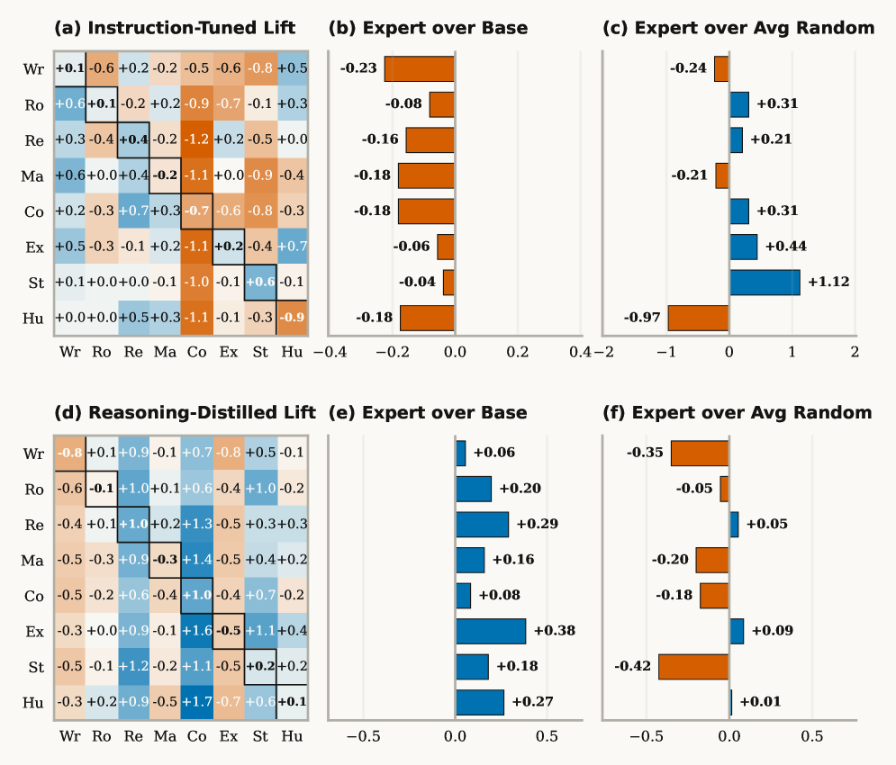
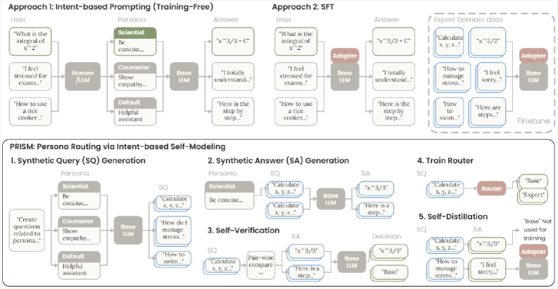
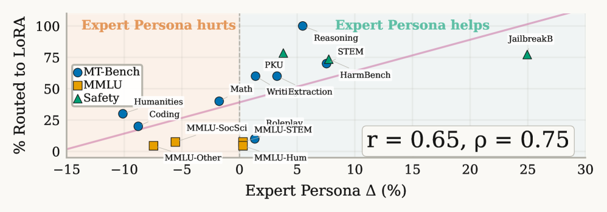

# PRISM — Expert Personas 與 LLM Alignment 研究筆記

## 📇 Academic Context

| Field | Value |
|-|-|
| Title | Expert Personas Improve LLM Alignment but Damage Accuracy: Bootstrapping Intent-Based Persona Routing with PRISM |
| Venue | unknown |
| Year | 2026 |
| Authors | Zizhao Hu, Mohammad Rostami, Jesse Thomason |
| Official Code | unknown |
| Venue Kind | paper |

> 本筆記基於 arXiv 預印本 `2603.18507`（University of Southern California）撰寫；投稿場域尚未公開（venue 標為 `unknown`），正式版數值可能與此處引用略有差異。全文提供 LaTeX source，數值以 source 為準。

## First Principles

這篇論文回答一個在實務上長期矛盾的問題：給 LLM 套上「你是某領域專家」的 persona 系統提示（persona prompting），到底有沒有用？先前文獻結論分歧——有人報告專家 persona 在特定領域帶來增益、也能豐富合成資料多樣性，也有人發現對一般任務近乎零效益甚至傷害推理。作者主張這些矛盾並非隨機噪音，而是被一個被忽略的變數所解釋：**任務類型（task type）**。他們的核心發現是，persona 的效果取決於該任務倚賴的是預訓練習得的知識檢索能力，還是指令微調（instruction-tuning）習得的對齊行為。

作者把 LLM 能力拆成兩層來源。**預訓練層**負責事實記憶、分類、實體關係辨識與 zero-shot 推理，這些能力可以不經指令跟隨就被存取；**指令微調層**負責風格適應、語氣控制、格式遵循、安全拒答與偏好導向生成，是 RLHF 或監督微調強化出來的。專家 persona 本質上是一個額外的指令跟隨語境（instruction-following context），因此它會放大指令微調層的行為、卻同時干擾預訓練層的知識檢索——這就是「改善 alignment、卻損害 accuracy」的機制根源。

在判別式知識任務上，證據很直接：MMLU 上專家 persona 全面且一致地低於 base model（overall accuracy: 68.0% vs. 71.6% base model），四個科目類別無一例外，作者推測 persona 前綴啟動了本該用於事實回憶的指令跟隨模式。一個具體的算術例子很能說明問題（Math, Mistral-7B QID 114，擲兩顆骰子點數和至少為 3 的機率）：無 persona 版本正確推理出 35/36（9/10 分），加了 math persona 後卻算出「3+6=9 種點數和小於 3 的結果」這種明顯錯誤（1.5/10 分）。persona 沒有增加任何知識，反而把模型推離了本來就會的正確答案。

反過來在對齊型任務上 persona 一致有幫助。MT-Bench 上專家 persona 改善了 8 類中的 5 類（Writing、Roleplay、Reasoning +0.40、Extraction +0.65、STEM +0.60），這些類別共通點是倚賴風格、語氣、結構化格式與意圖跟隨，而非新知識。安全面向更戲劇化：一個專職 Safety Monitor persona 在三個安全基準都提升拒答率，其中 JailbreakBench 增益最大（+17.7%，from 53.2% to 70.9%），因為系統提示微調的資料本就把前綴指令擺在最優先，這種特性天生就能抵抗越獄。作者也觀察到粒度效應是雙面的：最短（minimum）persona 對 MMLU 傷害最小（68.0% vs. 66.3% for the long persona），但最長（long）persona 帶來的對齊增益最大——描述越詳細，放大指令微調行為的訊號越豐富。

persona 的效果還與模型如何被優化強相關。作者跨 6 個模型（涵蓋 instruction-tuned、MoE、reasoning-distilled）觀察到：越是為系統提示優化的模型（例如 Llama）對 persona 的 steering 越敏感——MMLU 掉更多、但安全對齊增益也更大。最尖銳的案例是 reasoning-distilled 模型：在 R1 蒸餾模型上，任何 persona（不論領域）都會提升 Reasoning、Coding、STEM 三個欄位，因為這三類正好主導了 R1 蒸餾訓練集，模型學到的是「任何長的結構化語境都啟動推理路徑」，persona 的具體身分變得無關緊要；而蒸餾集裡沒有的 Writing、Roleplay、Humanities 則出現退化。更關鍵的是，因為 R1 蒸餾集不含安全對齊資料，這些模型的拒答率不論加不加 persona 都維持在 0%——安全微調在蒸餾過程中已被抹除。這印證了一條統一原則：persona 只能放大「在訓練中存活下來」的行為。

既然專家 persona 同時「幫忙」也「傷害」，自然的問題是：能不能只吸收有益的部分、避開有害的部分？作者用 PRISM（Persona Routing via Intent-based Self-Modeling）作為概念驗證來測試這個假設。他們先對比兩個較簡單卻失敗的替代方案：Approach 1 是**推理時 prompt 路由**，用 router 挑選 persona，但成本高且無法保證改善；Approach 2 是**傳統 SFT**，把 persona 行為烤進權重，但需要外部領域資料且會損害 base model 表現。PRISM 的關鍵約束是完全自舉（bootstrapped）：整條訓練管線只用 base model 本身、一組領域名稱、以及一個 persona 模板，不需外部資料、模型或人工標註。

PRISM 管線分五個階段自我閉環。以 base model $M_\theta$、輸出分布 $P_\theta(\cdot \mid x)$、persona 語境 $c$ 記號：**Stage 1** 對每個 persona $c_k$ 讓 base model 生成會受益於該專長的查詢，得到 $K \times N$ 條查詢；**Stage 2** 對每條查詢生成兩個答案——無 persona 的 baseline $y_0$ 與配對專家 persona 的 $y_k$；**Stage 3** 用 base model 當自我裁判做成對比較（pairwise comparison），並以位置互換跑兩次來消除位置偏差與冗長偏差（verbosity bias），只有在兩種排列都勝出時 persona 才算贏，這個保守準則產生高精度的路由標籤，同時把「是否啟動」寫成二元目標 $t(x)$；**Stage 4** 訓練一個輕量二元 gate $R_\phi$ 決定每條查詢是否啟動 LoRA；**Stage 5** 只在 Stage 3 選出的 distill 集合 $D_\text{dist}$ 上，以 KL divergence 把「贏的 persona 答案」蒸餾進 LoRA，讓學生模型不需 persona 提示也能複製 persona 品質的輸出。

gate 的設計有一個精巧之處。它作用在查詢最後一個 token 於**第 0 層 transformer**之後的隱狀態 $h(x)$，並以 sigmoid 產生開關機率：

$$R_\phi(x) = \sigma(W_\phi \cdot h(x)) \in [0, 1]$$

關鍵在於 LoRA 只套用在第 $1$ 到 $L{-}1$ 層，第 0 層保持未修改，因此不論 adapter 是否啟動，gate 永遠收到相同的表徵——這讓路由決策與 adapter 狀態解耦。gate 以 binary cross-entropy 訓練，並用重採樣少數類別的方式平衡 distill 與 retain 兩組。實作上 gate 是一個 3-layer MLP（$h \to 128 \to 64 \to 1$，GELU），LoRA rank 16、alpha 32、套在全部 7 個投影模組上，約 21M 可訓練參數。

推理時 gate 依門檻切換，形成一個條件式的機率位移：

$$P_{\theta'}(\cdot \mid x) \rightarrow \begin{cases} P_{\theta + \Delta\theta}(\cdot \mid x) & \text{if } R_\phi(x) \geq 0.5 \\ P_\theta(\cdot \mid x) & \text{otherwise} \end{cases}$$

換言之，只有在 persona 行為確實有益的查詢上才啟動 LoRA，其餘退回未修改的 base model。這正是 PRISM 相對於 Approach 2（ungated LoRA）的優勢：ungated LoRA 對所有輸入一律套用 adapter，把有益與有害的 persona 行為壓進同一組共享參數，無法消除分布漂移。

把整條路徑用 Qwen2.5-7B-Instruct 的實際數字走一遍最能看清楚。從 Stage 2 的多 persona 評分中，PRISM 構出 282 個 distill 樣本（gate target = 1，任一 persona 勝過 baseline）與 318 個 retain 樣本（gate target = 0，baseline 最好），共 600 筆訓練資料，最終 gate accuracy 為 68.8%。在下表的整體評估中（Overall 為 15 個子類別的 macro-average，放到 0–100 尺度），可以看到 expert prompting 本身並沒有改善整體表現，因為對齊任務的增益被知識任務的損失抵銷；而 PRISM 的 gated 架構同時吸收了增益、保住了知識：

| Model / Strategy | MT-Bench Avg | MMLU Avg | Safety Avg | Overall |
|-|-|-|-|-|
| Qwen2.5-7B — Base Model | 7.56 | 71.7 | 60.3 | 71.8 |
| Qwen2.5-7B — Expert Prompting (Ap1) | 7.53 | 69.0 | 67.3 | 72.2 |
| Qwen2.5-7B — SFT (Ap2) | 7.53 | 67.4 | 59.6 | 70.0 |
| Qwen2.5-7B — PRISM | 7.76 | 71.7 | 63.7 | 73.5 |
| Mistral-7B — Expert Prompting (Ap1) | 7.16 | 58.4 | 87.4 | 71.4 |
| Mistral-7B — PRISM | 8.99 | 59.8 | 87.0 | 81.5 |

具體讀這張表：Qwen2.5-7B 上 PRISM 拿到 73.5 Overall（比 baseline 71.8 高 +1.7），MT-Bench 從 7.56 升到 7.76，MMLU 維持 71.7 不變——gated 架構把 expert persona 的好處吸收進來、卻沒付出知識檢索的代價。Mistral-7B 是更極端的對照：那裡 expert prompting 反而傷害整體（7.16 vs. 8.74 baseline），而 PRISM 達到 8.99、超過 baseline +0.25，同時完整保住 MMLU 並改善安全。

最後一塊證據把「gate 學到了任務類型」這件事量化出來。在 Qwen2.5-7B 上，gate 的 LoRA 路由比例與各類別的 expert persona 效果呈強正相關（Pearson r=0.65、Spearman ρ=0.75），三個群集自然浮現：MMLU 各科在約 6% 路由、安全基準在 73–78%、MT-Bench 各類散布於 10–100%——而這一切都沒有任何任務類型的監督訊號。相對地，reasoning-distilled 模型上 gate 幾乎全數退回 base model（R1-Llama 97.6%、R1-Qwen 99.4% 的查詢走 base），因為 PRISM 選出的集合偏向 math 與 coding，這些任務的改善被 base model 的預訓練知識上限卡住，導致路由退化——這與前面 reasoning 模型不受 persona 蒸餾影響的觀察一致。

## 🧪 Critical Assessment

### 問題是否真實且重要
這個問題是真的：persona prompting 在多代理系統、合成資料生成、情感支持對話等場景已被廣泛使用，而文獻對其效益的分歧確實存在且未被系統性解釋。作者把矛盾歸因於任務類型的切分（知識檢索 vs. 對齊行為）具有解釋力，也與「persona 只能放大訓練中存活的行為」這個機制敘事自洽。就「診斷為何矛盾」而言，這是一個扎實的貢獻。

### baseline、消融、資料與度量是否充分
調查部分的度量設計大致合理，但**評審模型的選擇引入了循環風險**。MT-Bench 由 Qwen3-32B-Instruct 當 LLM-as-Judge，而受評模型之一正是 Qwen2.5-7B——同家族評審偏好同家族輸出的風格偏差無法排除，作者以「Qwen3-32B 在標準基準上勝過原始 GPT-4」為理由，但這並未處理家族一致性偏誤。更值得注意的是作者自己在附錄揭露了 self-verification 的 verbosity bias：pointwise 評分下 Mistral math persona 有 68% distill rate，但同一 persona 實際上把 math 分數拉低 2.95 分（9.05→6.10）——這證明自我裁判會獎勵冗長格式而非正確性。作者用成對雙向比較緩解，但這也意味著 PRISM 的訓練標籤本身建立在一個已知有偏的裁判之上，distill/retain 的切分品質難以獨立驗證。安全度量同樣依賴 LLM-as-Judge 的二元拒答判定，未見人工校核。

### 增益幅度與統計顯著性
PRISM 在 instruction-tuned 模型上的整體增益偏小（Qwen +1.7、Llama +2.8 Overall，Mistral +0.25 MT-Bench）。MT-Bench 每類僅 10 題、標準差常在 ±0.4–0.5 量級，數個「改善」落在單一標準差內，Overall 的 macro-average 也未附信賴區間，因此「PRISM 一致優於所有 baseline」的強度需保留看待；相較之下安全基準有 bootstrap 信賴區間，度量嚴謹度不一致。reasoning 模型上 PRISM 幾乎等同 base model（gate 退回 97–99%），實質上是「沒有變差」而非改善，這點論文行文略顯樂觀。

### 是新方法還是既有元件的重新包裝
PRISM 的個別元件並不新：context distillation、intent-based routing、gated/conditional LoRA、self-verification 都有前作。真正的組合創新在於「用 base model 自我驗證產生路由標籤，再把 gate 與 LoRA 綁在同一自舉管線」，且 gate 讀取未被 LoRA 修改的第 0 層表徵以解耦決策——這個工程設計是合理且有巧思的。但需要警惕的是，評估基準（12 個 persona 對應 MT-Bench 八類）是作者圍繞自己方法的優勢所定義的，persona 池與評估類別高度重疊，等於在自己畫定的靶上射箭；跨到分布外領域時 gate 的路由品質是否仍成立，並無證據。

### 是否真的解決問題、以及真實世界關聯
論文把 PRISM 定位為「proof-of-concept」而非可部署系統，這個定位是誠實的。限制也寫得清楚：只測到 7–8B 模型（70B+ 未知）、gated 架構與標準 LoRA merging 不相容需額外維護、MoE 因稀疏啟動被排除、對已高度專門化的模型邊際效益遞減。就實務而言，一個只帶來 +1.7 Overall、卻要多維護一個 gate 元件、且訓練標籤倚賴有偏自我裁判的方案，其成本效益在生產環境仍待驗證。整體來說，論文作為「機制診斷 + 概念驗證」是站得住的，但把 PRISM 當成通用的對齊提升方案來讀會高估其成熟度。

## 🔗 Related notes

- [LoRA: Low-Rank Adaptation](../Lora/) — PRISM 的自蒸餾與 gate 都建立在 LoRA adapter 之上
- [Instruction Tuning with GPT-4](../InstructioinTuningWithGPT4/) — persona 效益的來源（指令微調層行為）與此脈絡相關
