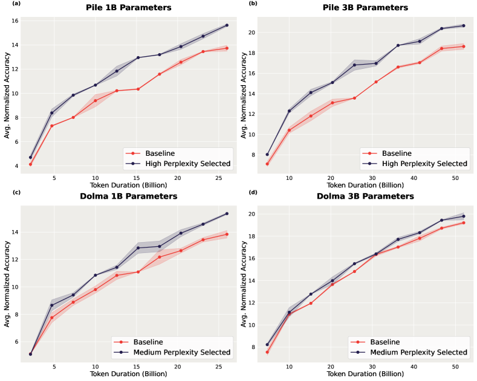
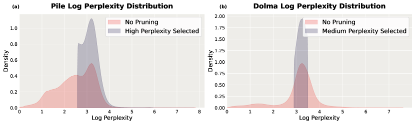
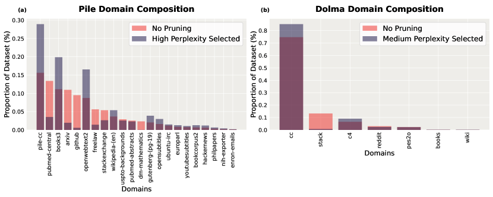

# Perplexed by Perplexity — Research Note
> [English](./README.md) | **繁體中文**

## 📇 Academic Context

| Field | Value |
|-|-|
| Title | Perplexed by Perplexity: Perplexity-Based Data Pruning With Small Reference Models |
| Venue | unknown |
| Year | 2024 |
| Authors | Zachary Ankner, Cody Blakeney, Kartik Sreenivasan, Max Marion, Matthew L. Leavitt, Mansheej Paul |
| Official Code | unknown |
| Venue Kind | paper |

> 本筆記依據 arXiv 預印本 `2405.20541`（`https://arxiv.org/abs/2405.20541`）撰寫。作者分屬 Databricks、MIT 與 DatologyAI；論文腳註寫明「Code to be made public soon.」，撰寫當下沒有可解析的官方程式碼連結，故 Official Code 記為 `unknown`；正式會議版若存在可能與此預印本有差異。

## First Principles

### 核心問題與反直覺的主張

這篇論文問的問題很單純：**能不能用一個很小的語言模型，去替一個大很多的模型挑選預訓練資料？** 先前的 perplexity（困惑度）剪枝工作（Marion 等人）通常用「和最終模型一樣大、甚至更大」的參考模型來打分，並且用「在預訓練資料測試集上的 perplexity」這種上游指標來衡量成效。本文的反直覺結論是：一個只有 125 million 參數的參考模型，就能替一個大 30 倍的模型剪掉資料，並在下游任務上把 3 billion 參數模型的平均表現提升最多 2.04，同時把達到基線表現所需的預訓練步數縮短最多 1.45 倍。

### 剪枝演算法：先訓練參考模型，再依 perplexity 百分位取樣

流程分兩段。第一段是把原始資料集 $D$ 隨機切成兩份：一份 $D_{\text{ref}}$ 用來訓練參考模型 $\theta_{\text{ref}}$，另一份 $D_{\text{train}}$ 留給最終模型。參考模型以標準的 next-token prediction 目標訓練後，對 $D_{\text{train}}$ 中的每一個樣本計算平均負對數似然（NLL）並轉成 perplexity。第二段依照這些 perplexity 的經驗累積分布（empirical CDF）$\hat{F}_P$，把樣本落在某個百分位區間內的部分保留下來，訓練最終模型。整體虛擬碼如下：

```text
Input: 資料集 D = {x^(i)}; selection_criteria ∈ {low, medium, high};
       selection rate r_s ∈ (0,1); reference split size R
D_ref, D_train ← random_split(D, R)
θ_ref* ← train(random_init, D_ref)
for x in D_train:
    NLL[x]  = (1/|x|) · Σ_j −log P(t_j | t_<j ; θ_ref*)
    PPLX[x] = 2 ^ NLL[x]
if   criteria == low:    min,max ← 0.0,      r_s
elif criteria == medium: min,max ← 0.5−r_s/2, 0.5+r_s/2
elif criteria == high:   min,max ← 1−r_s,    1.0
F̂_P ← empirical CDF of PPLX
D_pruned ← [ x for x in D_train if min < F̂_P(PPLX[x]) < max ]
θ_final* ← train(random_init, D_pruned)
return θ_final*
```

每個樣本的 perplexity 定義為以 2 為底、平均負對數似然的指數：

$$\text{NLL}(x)=\frac{1}{|x|}\sum_{t_j \in x} -\log P(t_j \mid t_{<j};\theta_{\text{ref}}),\qquad \text{PPLX}(x)=2^{\text{NLL}(x)}$$

### 三種選取準則與選取率

選取準則（selection criteria）決定要保留分布的哪一段：low 選最低 perplexity 的樣本，high 選最高的，medium 則選 perplexity 落在中位數附近的樣本，也就是位在 $[50-\frac{r_s}{2},\,50+\frac{r_s}{2}]$ 百分位的樣本。選取率（selection rate）$r_s$ 決定剪掉多少——實驗最終固定用 50%。這裡有個關鍵的觀念轉換：這種以「模型本身在同分布上訓練後的 perplexity」不是在判斷「這段文字是否離群、是否髒」，而更像是在估計「這個樣本對模型而言有多難」。高 perplexity 代表模型覺得難、資訊量高，這也解釋了為什麼在某些資料集上「保留高 perplexity 樣本」反而有益。

### 實驗設定：兩個組成迥異的資料集

模型全部基於 MPT transformer 家族，參考模型固定 125 million 參數，最終模型為 1 billion 與 3 billion 兩種。兩個資料集的領域組成刻意選得非常不同：the Pile 由 22 個領域組成，只有 15.61% 來自一般網路爬取；Dolma 由 7 個領域組成，卻有 81.31% 來自 CommonCrawl。所有資料都用 GPT-4 tokenizer 斷詞。參考模型固定訓練 26 billion tokens，最終模型除非特別說明皆訓練到 Chinchilla optimal（token 數為參數量的 20 倍）。評估用 MosaicML evaluation gauntlet 上的 33 個下游問答任務。

每個任務的分數會先用隨機猜測基線做歸一化，再取平均。歸一化公式把「模型準確率 $a_m$」與「隨機猜測準確率 $a_r$」轉成落在同一尺度上的分數：

$$a_n=\frac{a_m-a_r}{1-a_r}$$

論文把 33 個任務分成 World Knowledge、Common Sense Reasoning、Language Understanding、Symbolic Problem Solving、Reading Comprehension 五大類，先在類內平均、再跨類平均得到最終的 Average normalized accuracy。要注意這個歸一化不同於 EleutherAI LM Evaluation Harness 依 byte 長度做的歸一化。

### 主要結果

下表是四個「資料集 × 模型大小」設定下，最佳剪枝設定對比無剪枝基線的平均歸一化準確率（節錄自論文 Table 1，Pile 用 high、Dolma 用 medium，皆 50% 選取率）：

| 設定 | No Pruning (Average) | Best Pruning (Average) | Gain |
|-|-|-|-|
| 1B on Pile | 13.73 | 15.62 (High) | +1.89 |
| 3B on Pile | 18.63 | 20.67 (High) | +2.04 |
| 1B on Dolma | 13.84 | 15.35 (Medium) | +1.51 |
| 3B on Dolma | 19.20 | 19.79 (Medium) | +0.59 |

跨所有資料集與模型大小，在剪枝後資料上訓練的模型平均都勝過基線，論文據此主張小模型的 perplexity 對大很多的模型而言是有效的資料品質訊號。但一個容易被平均值蓋掉的細節是：不同資料集的**最佳準則並不通用**——在 Dolma 上最好的 medium 準則若套到 Pile，平均反而比不剪枝掉了 0.23。

### 一次完整的剪枝走查（用論文真實數字）

以 1B on Pile 這一格為例走一遍。先訓練一個 125M 參考模型 26 billion tokens；接著對 Pile 的 $D_{\text{train}}$ 每個樣本算 perplexity。因為 Pile 上最佳準則是 high、$r_s=0.5$，演算法會令 $\text{min\_percentile}=1-0.5=0.5$、$\text{max\_percentile}=1.0$，也就是**只保留 perplexity 最高的那 50% 樣本**（參考模型覺得最難的一半）。用這半份資料，從頭訓練一個 1 billion 參數的最終模型到 Chinchilla optimal（約 20 billion tokens）。結果：平均歸一化準確率從基線的 13.73 提升到 15.62（+1.89）。逐類拆開看，World Knowledge 從 15.51 升到 18.18、Language Understanding 從 28.11 升到 33.2，是提升的主力；但 Symbolic Problem Solving 幾乎沒動（3.53 對 3.36）。這個走查也凸顯後面批判會談到的一點：整體平均的提升，其實高度集中在某些類別。

### 訓練效率：更快到達同一水準



剪枝不只改善最終表現，也改善訓練動態。論文對部分訓練的檢查點做中途評估，發現剪枝模型在所有評估過的中途步數上都勝過基線；並且剪枝模型分別在 Pile 1B/3B 上以 1.31 倍與 1.45 倍更少的步數、在 Dolma 1B/3B 上以 1.29 倍與 1.14 倍更少的步數，就達到了基線模型的平均歸一化準確率。

### 非標準情境：過度訓練與資料受限

論文進一步在兩個非標準情境測試。過度訓練（over-training）上，把 1B 模型訓練到 130B tokens（Chinchilla optimal 的 5 倍）：Pile 上剪枝相對基線的增益從 1.89 微降到 1.74（大致維持），但 Dolma 上從 1.51 掉到 0.84（明顯縮小）。資料受限（data-constrained）上，剪枝在 Pile 與 Dolma 上都能維持增益直到基礎資料（base data）約重複 2 次；因 $r_s=0.5$（$1/r_s=2$），此時被保留的剪枝子集實際上被重複了約 4 次，呼應了 Muennighoff 等人「超過四次重複收益趨近於零」的發現。

### 上游 perplexity 是會誤導的評估指標

論文一個值得記住的觀察是：用「預訓練資料測試集上的 perplexity」來評估剪枝，會給出錯誤結論。以 1B on Pile 為例，剪枝後模型在測試集上的 perplexity 從 7.83 惡化到 8.51，但下游平均準確率卻從 13.73 提升到 15.62。原因是剪枝改變了資料分布，使模型成為原始分布的有偏估計，因此在原始分布上的 perplexity 本就不是公平的品質衡量。這也是本文主張「要直接在下游 benchmark 上評估」的核心論據。

### 剪枝如何改變領域組成





從 log perplexity 分布看，Pile 是多峰且不對稱的，Dolma 則是單峰且對稱的——這也解釋了為何 Pile 適合 high、Dolma 適合 medium。從領域組成看，剪枝傾向**增加**一般網路爬取領域的比例、**減少**高度專門的技術領域比例：在 Pile 上，Pile-CC 與 OpenWebText2 的比例幾乎翻倍，而 Pubmed Central、ArXiv、Github 等領域的比例至少被砍到原本的三分之一以下。這帶出一個作者自己也點名的隱憂：被大量剪掉的領域，其對應下游能力會不會受損。

## 🧪 Critical Assessment

### 上游到下游的評估切換是本文最實在的貢獻

問題本身是真的：預訓練資料品質確實是 LLM 表現的關鍵槓桿，而「用小模型替大模型省下打分成本」在下一代模型比任何現有模型都大時尤其實際。論文相對前人最實在的貢獻，是把評估從上游 perplexity 換成 33 個下游任務，並且明確展示了上游與下游可以**反向**（測試集 perplexity 變差、下游卻變好），這個反例本身就有方法論價值，值得記住。

### 單一 125M 參考模型與被平均掩蓋的分項退步

實驗的廣度不錯：兩個組成迥異的資料集、兩種模型大小、每個實驗兩次試驗、對準則與選取率都有掃描。但有幾個缺口值得存疑。第一，論文標題主打「small reference models」，實際卻只用了單一的 125M 參考模型，完全沒有掃描參考模型大小——所以「多小才夠小」這個最有價值的問題其實沒被回答。第二，歸一化平均容易掩蓋分項退步：3B on Pile 的 Symbolic Problem Solving 從 4.88 掉到 2.91、Reading Comprehension 在 Dolma 3B 上從 14.2 掉到 13.19，都是被整體平均的正號蓋過去的實質退步。第三，Dolma 3B 上僅 +0.59 的增益，在只有兩次試驗、又用「一個標準誤內視為並列」的判準下，是否穩健是可疑的。

### 演算法沿用 Marion，貢獻在於實證體檢

需要誠實看待：剪枝**演算法本身**來自 Marion 等人，本文並未提出新的剪枝機制。它的貢獻是實證性的——換下游指標、換不同領域組成、加測非標準情境——而不是演算法創新。這不減損其實用價值，但把它當成「新方法」來讀會失焦；它更像是對一個既有方法「在什麼情況下有效、在什麼情況下會反效果」的系統性體檢。

### 最佳準則在同一套 gauntlet 上掃出、跨資料集不通用

最佳準則與選取率，是在「用來報告增益的同一套 gauntlet」上掃出來的，因此「Pile 用 high、Dolma 用 medium」某種程度上是對評估集過擬合的結果；論文也坦承沒有一套能事先預測參數的理論，只證明了 1B 掃出的最佳設定可以轉移到 3B。換句話說，跨資料集不通用、需要每個新資料集重新掃參數，這個成本在真實應用中並不小，論文對此的緩解（設定可從 1B 便宜地轉移到 3B）只回答了問題的一半。

### 領域組成偏移與 tokenizer/家族綁定限制了外推

就「小模型能替大模型剪枝並改善下游」這個主張而言，論文在其設定內確實給出了有說服力的證據。但幾個現實因素會限制外推：領域組成會系統性地偏向網路文本、砍掉 code 與科學論文，對這些下游能力的影響論文自己也只留作未來工作；撰寫當下程式碼尚未釋出，重現需自行實作；且結論綁定在特定 tokenizer 與 MPT 家族上。整體而言這是一份紮實但範圍明確的實證研究，把它讀成「data pruning 已被解決」會過度延伸——比較準確的定位是：它把 perplexity 剪枝從「單一資料集上的上游觀察」推進到「多資料集、多情境、以下游為準的可用工具」。

## 🔗 Related notes

<!-- 目前 domains/natural_language_processing 下沒有可安全解析的直接相關筆記，保留標題留空。 -->
