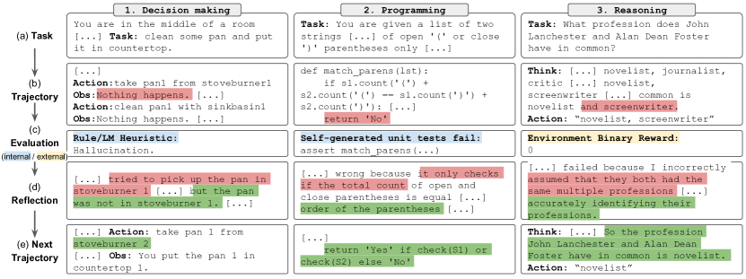

# Reflexion — Research Note
> [English](./README.md) | **繁體中文**

## 📇 Academic Context

| Field | Value |
|-|-|
| Title | Reflexion: Language Agents with Verbal Reinforcement Learning |
| Venue | NeurIPS |
| Year | 2023 |
| Authors | Noah Shinn, Federico Cassano, Edward Berman, Ashwin Gopinath, Karthik Narasimhan, Shunyu Yao |
| Official Code | https://github.com/noahshinn024/reflexion |
| Venue Kind | paper |

## First Principles

本note依據 arXiv 預印本 `2303.11366`（v4）之全文撰寫，正式 camera-ready 版本（NeurIPS 2023）之細節可能略有差異；venue 與年份取自 DBLP 收錄紀錄 `conf/nips/ShinnCGNY23`。

### 問題：讓語言代理人不更新權重也能從失敗中學習

當大型語言模型（LLM）被當成 goal-driven agent 去操作遊戲、compiler、API 等外部環境時，傳統上要讓它「從 trial-and-error 中變強」的手段是 reinforcement learning——但 policy/value gradient 需要大量互動樣本與昂貴的 model finetuning，對動輒數百億參數的 LLM 並不實際。這篇論文主張：與其更新 weights，不如更新 agent 的 memory，用自然語言把每次失敗的教訓寫下來當作下一輪的 context。

論文把這個訊號稱為一種 `semantic gradient`：環境只給出 binary 或 scalar 的成敗，Self-Reflection model 會把它放大成一段具體、可操作的文字回饋（哪一步錯了、下次該怎麼改），這段文字比純量 reward 更容易做 credit assignment。作者也坦承此法的代價：它完全仰賴 LLM 自我評估的能力（或人工 heuristic），且對成功沒有形式上的保證（not having a formal guarantee for success）。



### 三個模組：Actor、Evaluator、Self-Reflection

Reflexion 把 agent 拆成三個各自獨立的 LLM 實例：**Actor** $M_a$ 依 state 生成文字與 action；**Evaluator** $M_e$ 對產出的 trajectory 打分數；**Self-Reflection** $M_{sr}$ 把分數與 trajectory 轉成語言回饋。policy 被參數化為「Actor 的權重加上一塊可讀寫的 memory」，也就是說學習發生在 memory 而非 $M_a$：

$$
a_t \sim \pi_\theta(a_t \mid s_t), \quad \theta = \{M_a, \mathit{mem}\}, \quad r_t = M_e(\tau_t)
$$

Evaluator 的實作依任務而異：reasoning 任務用 exact match（EM）grading，decision-making 用人工 heuristic，programming 則用 agent 自己生成的 unit test 通過與否。這種「因地制宜」的 reward 設計是 Reflexion 能跨三類任務的關鍵，但也把評估品質的責任推給了各任務的 Evaluator。

Self-Reflection model 拿到稀疏的成敗訊號、當前 trajectory 與既有 memory 後，生成一段細緻的 verbal feedback $sr_t$ 存進長期記憶 $\mathit{mem}$；短期記憶則是當前 trajectory。為了不超過 LLM 的 context 上限，memory 被限制在最多 $\Omega$ 筆經驗（論文常設為 1 至 3）：

$$
\mathit{mem} \leftarrow \mathit{mem} \cup \{sr_t\}, \quad |\mathit{mem}| \le \Omega, \quad \Omega \in \{1,2,3\}
$$


### Reflexion 迴圈

整個流程是一個 iterative optimization：Actor 先產生軌跡，Evaluator 打分，Self-Reflection 產生教訓寫入 memory，帶著 memory 重試，直到 Evaluator 判定通過或達到 trial 上限：

```text
初始化 Actor M_a、Evaluator M_e、Self-Reflection M_sr
policy π_θ, θ = {M_a, mem};  用 π_θ 生成初始軌跡 τ_0
r_0 = M_e(τ_0);  sr_0 = M_sr(τ_0, r_0);  mem ← [sr_0];  t = 0
while (M_e 未通過) and (t < 最大 trial 數):
    τ_t = [a_0, o_0, ..., a_i, o_i]  由 π_θ 產生
    評估 τ_t：r_t = M_e(τ_t)
    生成 self-reflection sr_t = M_sr(τ_t, r_t)
    把 sr_t 附加進 mem（超過 Ω 則丟棄最舊者）
    t ← t + 1
return
```

### 一次完整的 trial：以 HumanEval 程式生成為例

以 programming 任務具體走一遍。給定自然語言描述後，Actor 先寫出一份候選程式，再用 Chain-of-Thought prompting 生成一批帶自然語言說明的測試；系統以能否建出合法的 abstract syntax tree（AST）過濾語法錯誤的測試，最後抽樣至多 $n=6$ 條組成測試套件 $T=\{t_0,\dots,t_n\}$。programming agent 的 memory 上限只設為 1 筆經驗。

Evaluator 就是「跑這批 self-generated 測試」：若全過就提前 return 該解答；若失敗，Self-Reflection 讀失敗的測試與程式，寫出一段「哪裡錯、該怎麼修」的文字存進 memory，Actor 帶著它重寫。因為 programming 可用自己生成的測試自我評估，Reflexion 得以合法回報 pass@1。在 HumanEval Python 上，這個迴圈把 pass@1 從 baseline 的 0.80 推到 0.91（絕對 +11%），超過當時 GPT-4 的 80.1 SOTA。

同一機制在 MBPP Python 上卻反而輸給 baseline（77.1 vs GPT-4 的 80.1）。作者的診斷是 false positive：自我生成的測試在錯誤解答上全數通過，agent 便誤判成功而提早提交。量化上，MBPP Python 的 false positive 測試執行率高達 16.3%，而 HumanEval Python 僅 1.4%——同一個「用自己寫的測試當 reward」的設計，在測試品質差的資料集上會直接侵蝕成績，這是 Reflexion 少數輸掉的格子。

### 主要實驗結果

programming 的 pass@1 主結果如下（單位為 %，粗體為各列最佳）：

| Benchmark + Language | Prev SOTA Pass@1 | SOTA Pass@1 | Reflexion Pass@1 |
|-|-|-|-|
| HumanEval (PY) | 65.8 (CodeT + GPT-3.5) | 80.1 (GPT-4) | **91.0** |
| HumanEval (RS) | -- | 60.0 (GPT-4) | **68.0** |
| MBPP (PY) | 67.7 (CodeT + Codex) | **80.1** (GPT-4) | 77.1 |
| MBPP (RS) | -- | 70.9 (GPT-4) | **75.4** |
| Leetcode Hard (PY) | -- | 7.5 (GPT-4) | **15.0** |

另外兩類任務也有一致的增益：decision-making 的 AlfWorld 上，ReAct + Reflexion 用簡單 heuristic 偵測幻覺與無效規劃，在 134 個任務中完成 130 個，相對強基線絕對提升 22%（12 個 iterative learning step 內）；reasoning 的 HotPotQA 上相對基線提升 20%。作者還做了 ablation：把 self-reflection 換成只保留最近軌跡的 episodic memory（EPM），self-reflection 帶來的額外提升為絕對 8%，佐證「有反思引導的 refinement」勝過「純 refinement」。

## 🧪 Critical Assessment

### 問題是否真實且重要

「讓 LLM agent 不 finetune 也能從失敗中變強」是個真需求：對閉源、超大模型而言，gradient-based RL 幾乎不可行，而 in-context 學習確實是目前唯一可負擔的槓桿。把成敗訊號放大成語言教訓、存進 memory 再餵回，這個框架抓到的痛點是真實的，不是為了發論文硬湊出來的問題。

### 基線、消融與資料集是否足夠

三類任務各有合理基線（ReAct、CoT、CoT(GT)、GPT-4），ablation 也乾淨地拆出 test generation 與 self-reflection 兩個因子（HumanEval Rust 50 題上 0.60 → 0.52 → 0.60 → 0.68），這點做得比多數同期 agent 論文紮實。但要打折的地方也不少：許多曲線只在單一 temperature 0.7、單次 run 下報告，沒有跨 seed 的變異或信賴區間，而 self-reflection 的產出本身高度隨機；HotPotQA、AlfWorld 的評估各只用 100～134 題，樣本偏小。這些數字的統計穩健度是未被證明的，讀者無從判斷 8%、22% 的增益有多少落在噪音範圍內。

### 是真創新還是既有元件的重組

Reflexion 的組件——self-evaluation、self-generated tests、episodic memory、retry loop——在 Self-Refine、CodeT、Self-Debugging 等前作都出現過，論文自己的 related-work 對照表也如實列出。真正的新意在於把「稀疏 reward → 語言化教訓 → 寫入持久 memory → 影響後續 policy」串成一個明確的 verbal RL 迴圈，並主張 memory 就是被優化的 policy 參數。我的判斷是：這比較接近「把既有 debugging/refinement 技巧用 RL 語彙重新框架化並加上持久記憶」，其貢獻是概念整合與命名，而非全新機制；這仍有價值，但 91% 這個標題數字更多來自 GPT-4 底模的強度與可自我評估的 programming 設定，而非反思機制本身不可取代。

### LeetcodeHardGym 與自訂基準的取捨

論文引入 LeetcodeHardGym（40 題 hard 級、涵蓋多種語言，題目刻意選在 GPT-4 預訓練截止之後釋出以避免記憶污染），出發點——避免 data contamination——是正當的。但這也是一個由作者自訂、規模僅 40 題的基準，Reflexion 在此從 7.5 拉到 15.0，看似翻倍，實則兩個絕對值都很低且缺乏第三方比較；把它當成「解決了難題」的證據會過度樂觀，較保守的讀法是「在一個新且小的沙盒上展示了相對改善」。

### 宣稱的問題真的被解決了嗎，對真實世界有多少意義

在「可自我評估」的窄設定下（有 compiler、有可生成的 unit test、有 EM grading），Reflexion 確實可靠地把成績往上推。但論文自陳的限制點出了外推的天花板：memory 只是固定大小的 sliding window，沒有形式收斂保證，仍可能卡在 local minima；而整套機制的品質完全綁在 Evaluator 上——MBPP 的 false-positive 崩盤就是明證：當自我評估不可靠，反思會放大錯誤而非修正它。對於沒有廉價、可信 verifier 的真實任務（開放式寫作、多數 robotics、無明確 ground truth 的決策），這個框架能否遷移仍是開放問題，而非已解。

## 🔗 Related notes

- [ChatGPT / InstructGPT (RLHF)](../ChatGPT/)
- [Instruction Tuning with GPT-4](../InstructioinTuningWithGPT4/)
